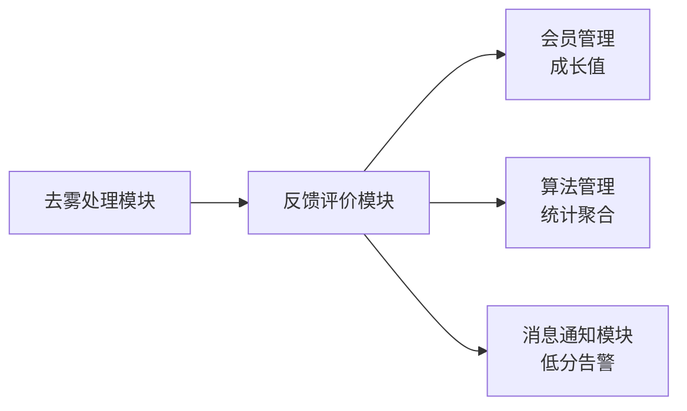

# 反馈评价模块需求规格

> **文档分层说明**：本文档按"已实现（现状）/ 本次改造目标（规划中）/ 远期规划"三层组织。
> - **已实现**：当前代码已落地、可直接验证的功能
> - **本次改造目标（规划中）**：已列入[近期改造计划总览](../../05-改造计划/近期改造计划总览.md)，尚未实现的演进方向
> - **远期规划**：已列入[远期改造计划总览](../../05-改造计划/远期改造计划总览.md)，依赖后续阶段的基础设施
>
> **本次改造说明**：[近期改造计划总览](../../05-改造计划/近期改造计划总览.md)对反馈评价模块**无直接改动项**，本模块维持现状，以下按实际实现校准。

## 1. 模块概述

### 1.1 模块定位

反馈评价模块负责收集用户对去雾处理结果的评分与评价，以及用户对产品功能的意见反馈。该模块是系统数据飞轮的核心环节——用户评价数据反哺算法迭代决策，功能反馈驱动产品优化，形成"使用→反馈→改进"的闭环。

### 1.2 核心价值

| 价值维度 | 具体内容 | 状态 |
|---------|---------|------|
| **数据飞轮** | 用户评分为算法效果评估提供真实数据，支撑算法迭代决策 | ✅ 已实现（评分统计） |
| **质量监控** | 低分评价自动告警，帮助发现算法异常或质量问题 | ✅ 已实现（站内信告警） |
| **用户倾听** | 反馈渠道畅通，提升用户参与感和满意度 | ✅ 已实现 |
| **改进闭环** | 反馈从收集到处理到回复的全流程跟踪，确保用户声音被响应 | ✅ 已实现 |

### 1.3 业务目标

#### 功能目标

- 建立针对处理结果的 1-5 星评分体系 ✅ 已实现
- 提供结构化的用户反馈收集机制 ✅ 已实现
- 支持后台反馈处理全流程（分配→处理→回复→关闭）✅ 已实现
- 提供评分数据统计分析能力 ✅ 已实现（基础统计）

#### 性能目标

| 指标 | 目标值 | 说明 |
|-----|--------|------|
| 评价提交响应 | <500ms | 评分和评价提交接口响应时间 |
| 反馈列表查询 | <500ms | 后台分页查询响应时间 |
| 评价统计聚合 | <2s | 算法维度评分统计查询 |

### 1.4 模块依赖关系



---

## 2. 评分体系

### 2.1 结果评分 (F-FE-001)

#### 2.1.1 功能描述

用户在去雾处理完成后，可对处理结果进行 1-5 星评分并提交文字评价。**后端能力已实现**（接口与完整业务规则），**前端评价入口弹窗已封装但尚未接入业务页面**（见 §2.1.5）。

#### 2.1.2 评分维度

| 维度 | 星级范围 | 说明 |
|------|---------|------|
| 综合评分 | 1-5 星 | 用户对处理结果的整体满意度 |

**星级含义**：

| 星级 | 标签 | 含义 |
|------|------|------|
| 5 星 | 非常满意 | 去雾效果超出预期 |
| 4 星 | 满意 | 去雾效果符合预期 |
| 3 星 | 一般 | 去雾效果可接受但有改进空间 |
| 2 星 | 不满意 | 去雾效果不理想 |
| 1 星 | 非常不满意 | 去雾效果极差或出现负面效果 |

#### 2.1.3 评价内容

| 字段 | 必填 | 说明 |
|------|------|------|
| 关联处理记录 | ✅ | 本次评价针对的处理记录 |
| 评分 | ✅ | 1-5 星 |
| 评价文字 | ❌ | 最多 500 字符 |
| 效果标签 | ❌ | 预设标签（最多 5 个，按评分动态切换正/负标签，见 §2.1.4） |
| 截图 | ❌ | 最多 3 张，JPG/PNG/WEBP，单张 ≤5MB |
| 匿名评价 | ❌ | 开启后评价不展示用户信息 |

#### 2.1.4 预设标签

前端按评分动态展示标签组：评分 ≥4 展示正面标签，≤2 展示负面标签，=3 展示全部；切换评分档位时清空已选标签。

| 正面标签 | 负面标签 |
|---------|---------|
| 去雾彻底 | 残留雾气 |
| 色彩自然 | 色彩失真 |
| 细节清晰 | 细节丢失 |
| 处理速度快 | 处理速度慢 |
| 整体提升明显 | 无明显改善 |

#### 2.1.5 评价入口

| 入口 | 说明 | 状态 |
|------|------|:----:|
| 效果对比页评分卡片 | 处理完成后弹出评价弹窗（评分/标签/截图/匿名/跳过） | ⏳ 弹窗已封装待接入 |
| 我的评价页 | 查看已提交的评价列表（含管理员回复），**当前为只读展示，无补评/修改入口** | ✅ 已实现（查看） |
| 后台评价列表 | 管理员查看/隐藏/回复评价 | ✅ 已实现 |

> 早期需求稿中"处理历史每条记录可补评或修改"——**未实现**（图像输入历史无评价入口；修改评价能力后端已具备，前端未接入）。

#### 2.1.6 业务规则

| 规则 | 状态 |
|------|:----:|
| 1. 每条处理记录仅可评价一次（防重校验） | ✅ 已实现 |
| 2. 提交后可修改（仅限本人，修改**不增加**成长值） | ✅ 已实现（后端能力，前端未接入） |
| 3. 评价需在处理完成后 30 天内提交，超期不可评价 | ✅ 已实现 |
| 4. 提交评价后获得 5 成长值（每日最多 5 次），需会员记录存在 | ✅ 已实现 |
| 5. 匿名评价**用户端与后台均不展示用户信息**，评价记录保留 | ✅ 已实现 |
| 6. 1-2 星评价触发低分告警（见 §4.3） | ✅ 已实现 |
| 7. 评价提交前校验处理记录存在、状态已完成、归属本人 | ✅ 已实现 |
| 8. 截图校验：最多 3 张、JPG/PNG/WEBP 格式、来自系统文件服务 | ✅ 已实现 |

### 2.2 评价展示 (F-FE-002)

#### 2.2.1 处理结果页评价展示

> 在效果对比页底部展示当前处理的评价信息（星级/文字/标签/时间）与"去评价"入口——**当前未实现**（效果对比页未接入评价组件，见 §2.1.5）。

#### 2.2.2 算法评价聚合展示（规划中）

> 在算法选择页的算法详情中展示该算法评分统计（平均评分、评分分布、评价总数、热门标签）——**当前未实现**。后端已提供算法维度统计（平均分/评价数/低分率），前端算法选择页未展示。

---

## 3. 用户反馈

### 3.1 反馈提交 (F-FE-003)

#### 3.1.1 功能描述

用户可提交对产品功能、使用体验、问题报告等方面的反馈意见。**已实现**。

#### 3.1.2 反馈类型

| 类型 | 说明 | 示例 |
|------|------|------|
| 功能建议 | 对产品功能的改进建议 | 希望增加视频去雾功能 |
| 问题报告 | 使用中遇到的问题 | 处理结果无法保存 |
| 体验反馈 | 对使用体验的评价 | 页面加载太慢 |
| 投诉 | 对服务的不满 | VIP 权益未生效 |

#### 3.1.3 反馈表单

| 字段 | 必填 | 说明 |
|------|------|------|
| 反馈类型 | ✅ | 下拉选择 |
| 标题 | ✅ | 5-50 字符 |
| 内容 | ✅ | 10-1000 字符 |
| 联系方式 | ❌ | 手机/邮箱，**仅管理员可见** |
| 截图 | ❌ | 最多 5 张，单张 ≤5MB，JPG/PNG/WEBP |
| 相关模块 | ❌ | 去雾处理/效果对比/会员中心等 |

#### 3.1.4 反馈入口

| 入口 | 位置 | 状态 |
|------|------|:----:|
| 个人中心 | "我的反馈"页面（列表 + 新建反馈对话框） | ✅ 已实现 |
| 设置页 | "帮助与反馈"入口 | ⏳ 待确认 |
| 全局 | 侧边栏/底部导航的反馈图标 | ⏳ 待确认 |

#### 3.1.5 业务规则

| 规则 | 状态 |
|------|:----:|
| 1. 每用户每日最多提交 5 条反馈，超限返回业务错误 | ✅ 已实现 |
| 2. 反馈提交后 3 个工作日内首次回复（SLA 追踪） | ⏳ 未实现（仅统计平均响应时间） |
| 3. 反馈状态变更时推送通知给用户 | ⏳ 未实现（当前仅后台站内信，无用户侧通知） |
| 4. 提交反馈不获得成长值 | ✅ 已实现 |
| 5. 反馈状态：待处理/处理中/已回复/已关闭 | ✅ 已实现 |
| 6. 反馈关闭需填写关闭原因 | ✅ 已实现 |

### 3.2 我的反馈 (F-FE-004)

#### 3.2.1 功能描述

用户可查看自己提交的反馈记录和处理进度。**已实现**。

#### 3.2.2 反馈列表

| 字段 | 说明 |
|------|------|
| 反馈标题 | 完整标题 + 内容摘要 |
| 反馈类型 | 类型标签 |
| 状态 | 待处理/处理中/已回复/已关闭（彩色标签） |
| 相关模块 | 模块标签 |
| 处理人 | 分配的处理人名称（未分配显示"暂未分配"） |
| 提交时间 | 反馈提交时间 |
| 操作 | 查看详情 |

> 早期需求稿中的"补充说明、关闭"列表操作**未实现**——补充说明在详情页内完成，关闭仅后台支持。

#### 3.2.3 反馈详情

展示反馈完整内容、图片附件、标签、处理时间线（用户提交→管理员回复/分配，按时间升序）、管理员回复内容（回复人/类型/内容/附件）。用户可在**未关闭**的反馈中补充说明（追加回复记录；若状态为"已回复"则回退为"处理中"）。

---

## 4. 后台管理功能

### 4.1 评价管理 (F-FE-005)

#### 4.1.1 评价列表查询

| 查询条件 | 说明 |
|---------|------|
| 用户信息 | 用户名/昵称模糊匹配 |
| 算法 | 按算法精确筛选 |
| 评分范围 | 1-5 星区间筛选 |
| 评价时间 | 起止时间范围 |
| 标签 | 多选标签筛选 |
| 是否有文字 | 布尔筛选 |

#### 4.1.2 列表展示字段

| 字段 | 说明 |
|------|------|
| 用户名/头像 | 评价用户（匿名评价置空） |
| 算法名称 | 被评价的算法 |
| 评分 | 星级展示 |
| 评价内容 | 文字内容 |
| 标签 | 评价标签 |
| 处理记录 | 关联的处理记录 ID |
| 评价时间 | 提交时间 |
| 操作 | 隐藏/回复 |

> 早期需求稿中的"处理记录链接"——实际仅展示处理记录 ID。

#### 4.1.3 评价处理

| 操作 | 说明 | 状态 |
|------|------|:----:|
| 查看详情 | 查看完整评价、图片、关联处理记录 | ✅ 已实现 |
| 隐藏评价 | 不当评价可隐藏，用户端不再展示 | ✅ 已实现 |
| 回复评价 | 管理员可回复用户评价 | ✅ 已实现 |
| 标记处理 | 将低分评价标记为"已处理"/"需关注" | ⏳ 未实现 |

### 4.2 反馈管理 (F-FE-006)

#### 4.2.1 反馈列表查询

| 查询条件 | 说明 |
|---------|------|
| 关键字 | 标题/内容模糊，或按用户名/昵称匹配用户 |
| 反馈类型 | 精确匹配 |
| 反馈状态 | 待处理/处理中/已回复/已关闭 |
| 相关模块 | 精确匹配 |
| 优先级 | 普通/紧急/高优 |
| 处理人 | 按处理人筛选 |
| 提交时间 | 起止时间范围 |

#### 4.2.2 列表展示字段

| 字段 | 说明 |
|------|------|
| 反馈标题 | 截断显示 |
| 用户名 | 提交用户 |
| 反馈类型 | 类型标签 |
| 相关模块 | 关联模块 |
| 状态 | 反馈状态标签 |
| 优先级 | 普通/紧急/高优标签 |
| 处理人 | 分配的处理人 |
| 提交时间 | 反馈提交时间 |
| 操作 | 详情/分配/回复/关闭/标签 |

#### 4.2.3 反馈处理流程

```
用户提交反馈 → 状态：待处理
    ↓
管理员分配处理人（或自行回复，回复时自动分配给自己）
    ↓
状态：处理中
    ↓
管理员回复（回复类型：信息补充/已解决/暂不支持/转开发）
    ↓
状态：已回复
    ↓
用户补充说明（状态回退为处理中）或管理员关闭（需填关闭原因）
    ↓
状态：已关闭
```

> 需求稿中"无法解决→标记暂不支持→关闭"通过"暂不支持"类型回复 + 关闭反馈实现。

#### 4.2.4 反馈回复

| 字段 | 必填 | 说明 |
|------|------|------|
| 回复内容 | ✅ | 最多 2000 字符 |
| 回复类型 | ✅ | 信息补充/已解决/暂不支持/转开发 |
| 附件 | ❌ | 回复附件 |

#### 4.2.5 反馈标签管理

后台可对反馈设置标签（自由文本，无预设约束），标签随详情/列表展示。

> 需求稿中的预设标签（高频问题/已知问题/已排期/已解决/不予处理）**未实现为预设选项**，由管理员自行输入。

### 4.3 低分告警 (F-FE-007)

#### 4.3.1 功能描述

当收到 1-2 星低分评价时，自动触发告警通知。**已实现**（异步站内信通知管理员）。

#### 4.3.2 告警规则（按实际实现）

| 条件 | 告警级别 | 通知方式 | 说明 |
|------|---------|---------|------|
| 单条评分 ≤2 星 | 普通 | 站内信 | 通知全体管理员，含算法名/评分/处理记录 ID |
| 评分 =1 星 且 24 小时内同一算法低分（≤2 星）≥3 条 | 紧急 | 站内信 | 紧急告警仅在 1 星评价时检查 |
| 当日（当天 0 点起）全局低分率 >20% | 严重 | 站内信 | 低分率 = 当日 ≤2 星评价数 / 当日评价总数 |

> **说明**：
> - 通知方式**仅站内信**（消息通知模块），需求稿中的"邮件/短信"未实现
> - 告警为**异步发送**，不影响评价提交
> - 紧急/严重告警按算法/日期去重，避免重复通知

#### 4.3.3 告警处理

- 管理员在后台查看低分评价详情和关联处理记录（告警站内信携带处理记录 ID）
- 判断是算法质量问题、特定图片问题还是用户误评
- 通过隐藏/回复评价处理

> 需求稿中"标记处理结果（算法问题→转算法团队等）"**未实现**。

### 4.4 评价统计分析 (F-FE-008)

#### 4.4.1 统计维度

| 维度 | 指标 | 状态 |
|------|------|:----:|
| 全局评分 | 平均评分、评分分布（1-5 星计数）、评价总数 | ✅ 已实现 |
| 标签分析 | 正面/负面标签频次排行（Top 5） | ✅ 已实现 |
| 按算法 | 各算法平均评分、评价总数、低分率 | ✅ 已实现 |
| 按时间 | 日/周/月评分趋势 | ⏳ 未实现 |
| 按用户等级 | 不同会员等级的评分分布差异 | ⏳ 未实现 |

> 统计支持时间范围筛选；统计数据带缓存，评价变更时自动刷新。

#### 4.4.2 反馈统计分析

| 维度 | 指标 | 状态 |
|------|------|:----:|
| 按类型 | 各类型反馈数量占比 | ✅ 已实现 |
| 按模块 | 各模块反馈数量排行（定位问题模块） | ✅ 已实现 |
| 按状态 | 待处理/处理中/已回复/已关闭 数量分布 | ✅ 已实现 |
| 响应时效 | 平均首次响应时间、平均关闭时间 | ✅ 已实现 |
| 高频关键词 | 标题+内容分词统计 Top 10 | ✅ 已实现（词云未实现） |

> 统计数据带缓存，新反馈提交时自动刷新。

---

## 5. 非功能需求

### 5.1 性能需求

| 指标 | 要求 | 实际 |
|-----|------|------|
| 评价提交 | <500ms（含图片校验） | 接口为同步写入，无阻塞操作 |
| 评价统计聚合 | 算法维度统计 <2s，全局统计 <5s | 统计数据带缓存，无时间范围直接命中 |
| 低分告警触发 | 评价提交后 10s 内完成告警判断 | 异步发送，不阻塞评价提交 |
| 反馈列表查询 | 分页查询 <500ms | 数据访问层索引覆盖 |

### 5.2 安全需求

| 方面 | 措施 | 状态 |
|-----|------|:----:|
| 评价防刷 | 同一处理记录仅可评价一次（防重校验） | ✅ 已实现 |
| 反馈频率限制 | 每用户每日 ≤5 条反馈 | ✅ 已实现 |
| 图片安全 | 类型/数量/大小校验 + 来源校验 | ✅ 已实现 |
| 敏感信息 | 反馈联系方式仅管理员可见 | ✅ 已实现 |
| 数据隔离 | 我的评价/我的反馈仅本人可见；评价归属校验（非本人视为不存在） | ✅ 已实现 |
| 内容过滤 | 评价和反馈内容敏感词过滤 | ⏳ 未实现 |

### 5.3 可用性需求

| 方面 | 要求 | 实际 |
|-----|------|------|
| 评价降级 | 评价功能不可用时不影响核心去雾流程 | ✅ 评价独立接口，与处理流程解耦 |
| 统计缓存 | 统计数据带缓存，避免重复聚合 | ✅ 已实现 |
| 告警可靠 | 低分告警异步发送，不丢消息 | ✅ 消息队列消费确认 |
| 通知送达 | 反馈状态变更通知至少保证站内信送达 | ✅ 后台告警站内信；用户侧状态变更通知未实现 |

---

## 6. 依赖关系

### 6.1 依赖模块

| 模块 | 依赖说明 | 状态 |
|------|---------|:----:|
| **去雾处理模块** | 评价关联处理记录，校验状态/归属/30 天时限 | ✅ 已实现 |
| **算法管理模块** | 评价统计按算法维度聚合 | ✅ 已实现 |
| **会员管理模块** | 提交评价获得 5 成长值（每日最多 5 次） | ✅ 已实现 |
| **消息通知模块** | 低分告警站内信通知 | ✅ 已实现 |
| **文件管理模块** | 评价截图/反馈图片的 URL 校验与存储 | ✅ 已实现（URL 校验） |
| **消息队列** | 低分告警异步消息（条件启用） | ✅ 已实现 |

### 6.2 被依赖模块

| 模块 | 依赖说明 | 状态 |
|------|---------|:----:|
| **算法管理模块** | 算法效果报告使用评价统计数据（算法维度统计已提供，前端未接入展示） | ⏳ 规划中 |
| **会员管理模块** | 评价行为触发成长值增加 | ✅ 已实现 |
| **消息通知模块** | 低分告警通知发送 | ✅ 已实现 |

---

## 7. 待确认事项

> 早期需求稿"评价公开展示、评价激励、社区展示墙、反馈转工单、评价修改限制、AI 辅助分析"等事项保留如下（均为规划中/未实现）：

1. **评价公开展示**：是否在算法选择页公开展示算法评分与用户评价？（后端算法维度统计已就绪，前端未展示）
2. **评价激励**：除了成长值，是否需要其他评价激励（如评价抽奖、评价积分）？
3. **社区展示墙**：用户授权后展示优质处理结果（规划中的 P2 功能），是否与评价模块联动？
4. **反馈转工单**：高优反馈是否需要自动转为开发工单，对接项目管理工具？
5. **评价修改限制**：用户修改评价的次数是否需要限制？修改后成长值如何处理？（当前修改能力无次数限制、不奖励成长值）
6. **AI 辅助分析**：是否需要引入 AI 对反馈内容做自动分类和情感分析？
7. **敏感词过滤**：评价/反馈内容是否需要接入敏感词过滤？
