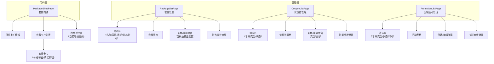

# 套餐管理模块 - 前端实现设计

## 1. 文档概述

本文档描述套餐管理模块的前端实现方案，聚焦组件架构、状态管理、路由设计与关键交互决策。套餐模块是会员商业化体系的商品中心，前端覆盖用户端套餐展示与购买入口，以及管理端套餐 CRUD、优惠券管理、促销活动管理与销售统计。

---

## 2. 组件树设计



### 组件职责划分

| 组件 | 职责 | 所属端 |
|------|------|:------:|
| PackageShopPage | 在售套餐卡片展示、权益对比表、购买入口（调用价格计算后跳转订单创建） | 用户 |
| PackageCard | 单个套餐卡片：等级图标/名称/促销价/原价删除线/日均价/权益列表/购买按钮 | 用户 |
| BenefitComparison | 跨套餐权益对比表，当前等级列高亮，表头合并单元格 | 用户 |
| PackageListPage | 套餐分页管理、新增/编辑/上下架/删除、销售统计 | 管理员 |
| PkgFormDialog | 套餐表单（基本信息/价格/权益覆盖配置），编辑时隐藏状态字段 | 管理员 |
| CouponListPage | 优惠券模板管理、新增/编辑/删除、批量发放 | 管理员 |
| CouponFormDialog | 优惠券表单，字段按类型联动显隐（满减/折扣/无门槛/体验券） | 管理员 |
| DistributeDialog | 发放对象选择（全部用户/指定等级/指定用户），提交后展示成功/失败数量 | 管理员 |
| PromotionListPage | 促销活动管理、创建/编辑/上下架/关联套餐 | 管理员 |
| PromoFormDialog | 活动表单（名称/类型/起止时间/折扣方式/新用户专享标识） | 管理员 |
| LinkPackageDialog | 套餐多选关联（多对多关系），展示已关联套餐列表 | 管理员 |

> **设计决策**：用户端为 `package/shop` 单页承载套餐展示与购买入口，购买流程跳转订单管理模块；后台拆分为套餐/优惠券/促销活动三页独立管理。

---

## 3. 状态管理

| Store | 核心状态 | 职责 |
|-------|---------|------|
| packageStore | packageList、currentPackage、loading | 在售套餐列表与套餐详情；用户端商城页加载在售列表后派生权益对比表数据 |
| orderCreateStore | selectedPackageId、calculatedPrice、payMethod、creating | 下单状态管理：选中的套餐 ID、价格计算结果（促销折扣/优惠券抵扣/应付金额）、支付方式选择、订单创建中状态 |

- packageStore 在商城页加载时拉取在售套餐列表，权益对比表数据从列表派生（按权益项聚合）
- orderCreateStore 在用户点击购买时初始化，先获取价格预览，再跳转订单创建流程；订单创建成功后跳转订单详情页
- 管理端各页面（套餐/优惠券/促销活动）的列表分页数据、筛选条件、弹窗显隐、表单数据均在页面组件内局部管理，无独立 Store

---

## 4. 路由设计

| 路由路径 | 组件 | 名称 | 加载方式 | 角色要求 |
|---------|------|------|---------|---------|
| `/package/shop` | PackageShopPage | PackageShop | 静态路由（hidden, keepAlive） | 登录用户 |
| `/package/list` | PackageListPage | PackageList | 动态菜单 | 管理员 |
| `/package/coupon` | CouponListPage | CouponList | 动态菜单 | 管理员 |
| `/package/promotion` | PromotionListPage | PromotionList | 动态菜单 | 管理员 |

- 套餐商城为静态路由，hidden 不显示在菜单，通过个人中心/导航入口跳转；启用 keepAlive 保留页面状态
- 管理端三页经动态菜单加载，后端菜单权限控制入口可见性

### 权限控制

后台各页的写操作按钮（套餐增删改/上下架、销售统计、优惠券增删改与批量发放、促销活动增删改）按对应 `package:*` 权限标识控制显隐，无权限时按钮隐藏。权限标识清单见 [API接口.md](./API接口.md)。

---

## 5. 数据流

### 用户端套餐商城

```
进入套餐商城 -> 加载在售套餐列表（含生效权益）+ 会员档案
    ↓
渲染套餐卡片 + 权益对比表（当前等级高亮）
    ↓
点击购买 -> 调用价格计算（商品 ID + 可选优惠券）
    ↓
跳转订单创建/确认流程（订单管理模块）
```

### 管理端数据流

```
进入管理页面 -> 分页查询
    ↓
筛选（名称/等级/类型/状态/时间）-> 重新查询
    ↓
├─ 新增/编辑 -> 弹窗（元转分/字段联动/必填校验）-> 提交 -> 刷新列表
├─ 上下架 -> switch 切换 -> 提交 -> 刷新列表
├─ 删除 -> 确认 -> 提交 -> 刷新列表
├─ 销售统计 -> 抽屉 -> 按需加载统计接口
├─ 批量发放 -> 弹窗（选择对象）-> 提交 -> 提示成功/失败数量
└─ 关联套餐 -> 弹窗（套餐多选）-> 提交 -> 刷新关联数
```

### 模块间数据交互

| 交互方向 | 数据 | 说明 |
|---------|------|------|
| 套餐商城 -> 订单管理 | packageId + 价格计算结果 | 购买流程跳转订单创建 |
| 套餐管理 -> 会员管理 | levelCode | 权益覆盖配置的等级下拉与等级名称展示 |
| 促销活动 -> 套餐管理 | 关联套餐关系 | 活动关联套餐多选，影响价格计算 |
| 后台 -> 前台 | 上下架状态 | 下架套餐/活动用户端不可见 |

---

## 6. 交互设计决策

| 决策点 | 实现方式 | 理由 |
|--------|---------|------|
| 套餐卡片展示 | 权益列表平铺展示，不折叠 | 权益直接可读，免点击展开 |
| 价格对比 | 权益对比表跨套餐聚合，当前等级列高亮 | 用户一眼看出各等级权益差异，辅助决策 |
| 价格单位转换 | 输入以元为单位，提交前 ×100 转为分；展示时 /100 保留 2 位小数 | 后端金额单位为分，前端输入展示用元 |
| 优惠券选择 | 下单时可选优惠券，价格计算接口实时返回抵扣金额 | 优惠券抵扣由后端计算，前端展示预览结果 |
| 编辑状态隐藏 | 编辑弹窗不展示状态字段，上下架仅通过表格 switch 操作 | 状态变更高频且独立，不适合混入编辑表单 |
| 表单类型联动 | 满减券显示门槛、固定有效期显示起止时间、领取后 N 天显示天数 | 按优惠券类型动态显隐字段，减少无效输入 |
| 发放对象联动 | 全部用户/指定等级/指定用户三种模式切换选择器 | 按发放对象动态渲染对应选择器 |
| 进行中活动改规则 | 修改进行中活动的规则字段时二次确认 | 避免误改影响进行中的促销价格计算 |

---

## 7. 公共组件使用

| 公共组件 | 使用位置 | 配置要点 |
|---------|---------|---------|
| 分页表格 | 套餐/优惠券/促销活动列表 | 自定义列模板（类型标签/状态 switch/操作列），后端分页 |
| 抽屉 | 销售统计 | 打开时按需加载统计数据 |
