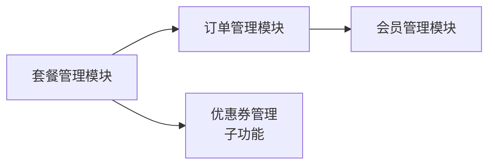

# 套餐管理模块需求规格

> **文档分层说明**：本文档按"已实现（现状）/ 本次改造目标（规划中）/ 远期规划"三层组织。
> - **已实现**：当前代码已落地、可直接验证的功能
> - **本次改造目标（规划中）**：已列入[近期改造计划总览](../../05-改造计划/近期改造计划总览.md)，尚未实现的演进方向
> - **远期规划**：已列入[远期改造计划总览](../../05-改造计划/远期改造计划总览.md)，依赖后续阶段的基础设施
>
> **模块边界说明**：本模块覆盖套餐定义、促销活动（读取）、优惠券、价格计算与销售统计；**订单创建/支付/退款/自动续费**由[订单管理模块](../订单管理/需求规格.md)承接，**购买后会员等级变更**由[会员管理模块](../会员管理/需求规格.md)承接，本文档不重复定义。

## 1. 模块概述

### 1.1 模块定位

套餐管理模块负责管理系统中所有 VIP 套餐的定义、定价、上下架及权益包配置，是会员商业化体系的商品中心，为订单管理模块提供商品数据，为会员管理模块提供权益生效依据。

### 1.2 核心价值

| 价值维度 | 具体内容 | 状态 |
|---------|---------|------|
| **多样化方案** | 支持包月/季/年多种周期套餐，匹配不同用户付费意愿 | ✅ 已实现 |
| **灵活定价** | 支持原价、促销价，配合促销活动与优惠券实现多种价格策略 | ✅ 已实现 |
| **权益组合** | 套餐权益继承会员等级权益并支持个性化覆盖（benefit_overrides） | ✅ 已实现 |
| **运营管控** | 套餐上下架、销售数据统计、优惠券管理一站式管理 | ✅ 已实现 |

### 1.3 业务目标

#### 功能目标

- 提供套餐 CRUD 和上下架管理 ✅ 已实现
- 提供价格计算能力（促销折扣 + 优惠券抵扣，下单前预览）✅ 已实现
- 提供促销活动数据读取与展示及运营自助管理（创建/修改/上下架/关联套餐）✅ 已实现（见 §2.4）
- 提供优惠券管理（创建/发放/领取/核销状态流转）✅ 已实现
- 提供销售统计（按套餐/等级/周期/优惠券使用率）✅ 已实现

#### 性能目标

| 指标 | 目标值 | 说明 |
|-----|--------|------|
| 套餐列表查询 | <200ms | 用户端在售套餐列表（Python 端有缓存） |
| 套餐详情查询 | <100ms | 单个套餐详情响应时间 |
| 后台套餐列表 | <500ms | 后台分页查询响应时间 |
| 价格计算 | <100ms | 促销折扣与优惠券抵扣实时完成 |

### 1.4 模块依赖关系



---

## 2. 套餐方案设计

### 2.1 套餐定义 (F-PM-001)

#### 2.1.1 套餐字段

| 字段 | 说明 | 约束 |
|------|------|------|
| 套餐名称 | 展示名称 | 2-32 字符，全局唯一（含已删除记录，防历史占用） |
| 会员等级 | 关联的会员等级（level_1/level_2/level_3） | 必填 |
| 计费周期 | monthly（月卡）/quarterly（季卡）/yearly（年卡） | 必填，固定枚举 |
| 有效期天数 | 支付后会员有效期 | 1-365 |
| 原价 | 标准价格 | 单位：分，>0 |
| 促销价 | 当前销售价格 | 单位：分，>0 且 ≤原价 |
| 套餐描述 | 展示文案 | ≤256 字符 |
| 权益覆盖项 | 对等级默认权益的个性化覆盖（JSON） | 可选，未覆盖项继承等级权益 |
| 排序值 | 列表展示顺序 | 0-999 |
| 上下架状态 | 1 上架 / 0 下架 | 新建默认下架 |

> **说明**：早期设计稿中的"9 个固定套餐矩阵（VIP1/VIP2/SVIP × 月/季/年 + 具体价格）"**仅为实现前的商品方案示意**。系统提供**默认套餐模板初始化脚本**（VIP1/VIP2/SVIP × 月/季/年 共 9 套预置套餐，含默认价格与权益覆盖），部署时初始化，运营可在此基础上调整或新建；权益包由"等级权益 + 套餐覆盖项"动态计算，无独立权益包表。

#### 2.1.2 权益计算规则

```
套餐实际生效权益 = 会员等级权益（sys_member_benefit）⊕ 套餐权益覆盖项（benefit_overrides）
```

- 未配置覆盖项的字段取该等级的标准权益（各任务类型配额/历史保留/批量上限/优先级/功能开关）
- 配置覆盖项的字段以套餐覆盖值为准；各任务类型配额取 `max(等级权益配额, 套餐覆盖配额)`（见 [会员管理 §3.3](../会员管理/需求规格.md)）
- 覆盖项 JSON 解析失败时返回业务错误（不静默降级）

#### 2.1.3 套餐有效期计算

| 计费周期 | 有效期 | 说明 |
|---------|--------|------|
| 月卡 | 30 天 | 由 period_days 字段控制（不按自然月） |
| 季卡 | 90 天 | 同上 |
| 年卡 | 365 天 | 同上 |

> **续费叠加规则**：套餐未到期时购买新套餐，有效期在原到期时间基础上叠加（`activateMemberByPackage` 取"原到期时间与当前时间较晚者"为基准）；到期后购买从支付时间开始计算。**续费叠加最大有效期上限 3 年（1095 天）**，叠加后超过 1095 天的购买请求拒绝（返回"有效期超过最大上限"）。**升级差价折算（按剩余天数退还差额）未实现**——跨等级购买同样按续费叠加处理（见[订单管理模块 §3.1](../订单管理/需求规格.md)）。

### 2.2 价格计算 (F-PM-002)

#### 2.2.1 功能描述

下单前实时计算套餐应付金额，供订单确认页预览。**已实现**（`GET /calculate-price`，三端一致）。

#### 2.2.2 计算规则

```
应付金额 = 促销价 - 促销折扣 - 优惠券抵扣（最低 0）
```

| 折扣项 | 计算方式 |
|--------|---------|
| 促销折扣 | 遍历套餐关联的进行中促销活动（status=1 且当前时间在活动期内），按活动类型计算折扣：`percent` 按 `salePrice × discount_value / 100`、`fixed` 按固定金额、`full_reduction` 按"订单金额 ≥ threshold 时减 face_value"；**取最大折扣值** |
| 优惠券抵扣 | 校验券状态/归属/有效期/适用套餐后，按满减/折扣/无门槛/体验券类型计算（见 §2.3.4） |

> **促销叠加规则定论**：
> - **同时段多活动不叠加**：同一时段多个进行中促销活动**取最大折扣**（不累加）
> - **单活动多档位按满足条件执行**：满减活动支持多档位（如满 100 减 10、满 200 减 30），按订单实际金额命中的最高档位执行
> - 促销折扣与优惠券**可叠加**；结果小于 0 时按 0 处理

#### 2.2.3 价格快照

订单创建时**锁定价格快照**（snapshot）：将当时计算得出的促销价、促销折扣明细、优惠券抵扣、应付金额以及关联的套餐 ID/等级/周期/有效期写入订单快照字段。支付时按快照金额收款，**不受后续套餐价格/促销活动/优惠券变更影响**。

> **实现说明**：订单表冗余存储套餐名称、等级、价格、周期与计算明细；价格快照在订单创建事务内生成，支付回调校验回调金额 = 快照应付金额（见 [订单管理模块支付回调](../订单管理/需求规格.md)）。

### 2.3 优惠券管理 (F-PM-003)

#### 2.3.1 优惠券类型

| 类型 | 说明 | 抵扣规则 |
|------|------|---------|
| 满减券 `full_reduction` | 满 X 元减 Y 元 | 促销后价 ≥ threshold 时抵扣 face_value |
| 折扣券 `discount` | 打 X 折 | 抵扣 `促销后价 × (100 - face_value) / 100` |
| 无门槛券 `no_threshold` | 直接抵扣固定金额 | 抵扣 face_value |
| 体验券 `trial` | 免费体验 | **直接激活权益（不产生订单）**，有效期短（默认 3 天），每人限领 1 次；激活后立即生效对应等级权益，到期后自动收回 |

#### 2.3.2 优惠券模板字段

| 字段 | 说明 |
|------|------|
| 名称/类型/面值 | 基础信息（面值：满减/无门槛为金额分，折扣为 0-100） |
| 使用门槛 | 满减券必填 |
| 有效期类型 | fixed（固定起止时间）/ relative（领取后 N 天） |
| 发放总量 | -1 为不限量 |
| 每人限领 | 每用户最多领取数量 |
| 适用套餐 | 限定套餐 ID 列表（NULL 表示全部适用） |
| 启用状态 | 1 启用 / 0 禁用 |

#### 2.3.3 优惠券发放

| 发放方式 | 状态 |
|---------|:----:|
| 主动领取 | ✅ 已实现（限频 + 限领 + 库存乐观锁） |
| 定向批量发放（全部用户 / 指定等级 / 指定用户） | ✅ 已实现（后台批量发放接口） |
| 活动赠送（如新用户注册自动发放） | ⏳ 未实现 |
| 客服补偿（客服手动发放） | ⏳ 未实现 |

#### 2.3.4 优惠券状态流转

| 状态 | 说明 | 触发场景 |
|------|------|---------|
| 未使用(1) | 已领取待使用 | 领取/批量发放 |
| 已锁定(4) | 下单时预占 | 订单创建时锁定 |
| 已使用(2) | 支付成功后核销 | 支付回调/余额支付完成 |
| 已过期(3) | 超过有效期 | 定时任务扫描过期 |

> 核销与锁定逻辑由[订单管理模块](../订单管理/需求规格.md)承接；**退款时未使用优惠券退回**（券状态由已锁定/已使用恢复为未使用，`used_qty` 同步扣减），**已使用（已核销）的优惠券不退回**；体验券不涉及订单，退款不适用。

#### 2.3.5 领取限制

- 每用户每分钟 ≤5 次（Redis 计数，`coupon.receive-rate-limit` 可配置）
- 每用户领取数量 ≤ 每人限领（per_user_limit）
- 库存乐观锁：`issued_qty < total_qty` 条件更新，超发返回"已领完"

### 2.4 促销活动 (F-PM-004)

#### 2.4.1 活动类型

| 类型 | 说明 | 状态 |
|------|------|:----:|
| 限时折扣 `discount` | 指定时间段内套餐降价 | ✅ 已实现（表结构 + 折扣计算） |
| 新用户专享 `new_user` | 首次购买用户享受特价 | ✅ 已实现（购买时校验购买者是否新用户） |
| 节日促销 `holiday` | 节假日期间专属活动 | ✅ 已实现 |
| 满减活动 `full_reduction` | 订单金额满足条件减价 | ✅ 已实现（订单满 X 减 Y，支持多档位） |

#### 2.4.2 活动规则

- 活动通过 `start_time`/`end_time` 控制有效期，`status=1` 启用
- 套餐-活动关联表记录折扣方式（percent 百分比 / fixed 固定金额 / full_reduction 满减档位）与折扣值
- 套餐详情展示进行中的活动（活动名称/类型/时间/规则 JSON）
- 价格计算时取进行中活动的**最大折扣值**（同时段多活动不叠加，单活动多档位按满足条件执行，见 §2.2.2）
- **下架保护**：参与进行中活动的套餐不可下架（返回"套餐参与进行中促销活动，无法下架"）
- **新用户专享校验**：购买 `new_user` 活动关联的套餐时，校验购买者是否为新用户（**无历史付费订单**）。非新用户购买返回错误"该套餐仅限新用户购买"；校验基于订单表中该用户已支付订单记录
- **活动生效依赖时间范围判断**：活动到点生效/失效通过 `start_time`/`end_time` 时间范围判断实时计算，无需定时任务切换

> **活动自动切换（远期规划）**：当前活动生效完全依赖时间范围判断（实时计算，无需定时任务）；远期规划增加运营通知（活动开始/结束前推送站内信提醒运营复核），属远期规划。

#### 2.4.3 促销活动管理（运营自助）

提供促销活动后台管理接口，支持运营自助创建/修改/上下架/关联套餐：

| 管理能力 | 说明 |
|---------|------|
| 创建活动 | 录入活动名称、类型、时间范围、规则 JSON（折扣方式/折扣值/满减档位）、`new_user_only` 标识 |
| 修改活动 | 修改活动信息；**进行中的活动修改规则需二次确认** |
| 上架/下架 | `status` 切换；下架后价格计算不再纳入该活动 |
| 关联套餐 | 维护套餐-活动关联关系（一个活动可关联多个套餐，一个套餐可关联多个活动） |
| 活动查询 | 后台分页查询活动列表，支持按类型/状态/时间筛选 |

> **三后端一致性**：促销活动管理接口在 Java/Go/Python 三后端契约一致（Java 权威，Go/Python 对齐），权限标识 `package:promotion:*`（见 [API接口.md](./API接口.md)）。

---

## 3. 用户端功能

### 3.1 套餐展示页 (F-PM-005)

#### 3.1.1 功能描述

展示所有在售套餐，支持用户比较和选择。**已实现**（`package/shop` 页面）。

#### 3.1.2 页面布局

| 区域 | 内容 |
|------|------|
| 顶部横幅 | 会员推广文案（可关闭） |
| 套餐卡片 | 按套餐展示（等级图标/名称/促销价/原价删除线/日均价/权益列表/购买按钮） |
| 权益对比表 | 各等级权益对比（当前等级高亮） |

#### 3.1.3 套餐卡片信息

| 信息项 | 说明 |
|--------|------|
| 套餐名称 | 如"VIP2 年卡" |
| 会员等级标识 | 等级图标和颜色 |
| 价格 | 促销价（大字）+ 原价（删除线） |
| 日均价格 | 促销价 / 有效期天数（整数四舍五入到分，如"¥0.26/天"） |
| 核心权益 | 生效权益列表（等级权益 ⊕ 套餐覆盖项） |
| 购买按钮 | "立即开通"/"续费"/"升级至此"（按当前等级与套餐等级比较） |

> 早期设计稿中的"促销活动横幅（动态展示当前活动）"**未实现**——顶部横幅为固定推广文案；套餐卡片的"点击展开完整权益列表"未实现（权益直接平铺展示）。

### 3.2 套餐购买（联动订单管理）

购买流程（选择套餐 → 价格预览 → 订单创建 → 支付）由[订单管理模块](../订单管理/需求规格.md)承接，套餐管理仅提供在售列表、详情与价格计算接口。

> 早期设计稿中的"订单确认页（协议勾选、优惠券选择、支付方式）"细节见订单管理模块；**自动续费**由订单管理模块的自动续费配置承接。

---

## 4. 后台管理功能

### 4.1 套餐列表查询 (F-PM-008)

#### 4.1.1 功能描述

提供套餐信息的分页展示和多条件筛选。

#### 4.1.2 查询条件

| 条件类型 | 说明 |
|---------|------|
| 套餐名称 | 模糊匹配 |
| 会员等级 | 精确匹配 |
| 计费周期 | 精确匹配 |
| 上下架状态 | 精确匹配 |
| 创建时间 | 范围匹配 |

#### 4.1.3 列表展示字段

| 字段 | 说明 |
|------|------|
| 套餐名称 | 套餐显示名称 |
| 会员等级 | 等级名称（关联权益配置） |
| 计费周期 | 月/季/年 |
| 原价 | 标准价格 |
| 促销价 | 当前销售价格 |
| 日均价格 | 促销价 / 天数 |
| 销量 | 累计销售份数（支付成功时累加） |
| 状态 | 在售/下架 |
| 创建时间 | 套餐创建时间 |
| 操作 | 编辑/上架/下架/删除 |

### 4.2 套餐新增/编辑 (F-PM-009)

#### 4.2.1 功能描述

创建或修改套餐信息，包括基本信息、价格、权益配置。

#### 4.2.2 表单字段与校验

| 字段 | 必填 | 校验规则 |
|------|------|---------|
| 套餐名称 | ✅ | 2-32 字符，全局唯一（含软删行） |
| 会员等级 | ✅ | 关联会员等级配置 |
| 计费周期 | ✅ | 固定枚举（monthly/quarterly/yearly），非法值拒绝 |
| 有效期天数 | ✅ | 1-365 |
| 原价 | ✅ | >0，单位分 |
| 促销价 | ✅ | >0 且 ≤原价 |
| 套餐描述 | ❌ | ≤256 字符 |
| 排序值 | ❌ | 0-999 |
| 上下架状态 | ❌ | 0/1（表单默认下架） |

#### 4.2.3 权益覆盖配置区域

套餐编辑页包含权益覆盖配置区，可配置该套餐对等级默认权益的覆盖项；未覆盖项继承等级权益：

| 配置项 | 继承来源 | 是否可覆盖 |
|--------|---------|-----------|
| 各任务类型月度配额（去雾/去雨/去雪/低光/超分/去噪/修复/评估） | 会员等级配置 | ✅ |
| 历史记录保留 | 会员等级配置 | ✅ |
| 批量处理上限 | 会员等级配置 | ✅ |
| 处理优先级 | 会员等级配置 | ✅ |
| 功能解锁项（高级参数/高清导出/对比报告/批量下载） | 会员等级配置 | ✅ |

> **额外加成（限时双倍次数等）未实现**——覆盖项仅支持以上字段的数值替换。

#### 4.2.4 业务规则

1. 已有订单的套餐不可删除，仅可下架
2. 价格修改不影响已生成的订单（订单冗余存储套餐名称/等级/价格）
3. 套餐名称全局唯一（含软删行查重，防历史占用）
4. 新建套餐默认为下架状态，需手动上架

### 4.3 套餐上下架 (F-PM-010)

#### 4.3.1 功能描述

控制套餐在用户端的展示和购买状态。

#### 4.3.2 业务规则

- 下架后：用户端不再展示该套餐，已购买用户的权益不受影响
- 上架后：用户端立即可见可购买
- **参与进行中促销活动的套餐不可下架**（返回业务错误）
- 下架状态校验：套餐详情接口对下架套餐返回"套餐已下架"

### 4.4 销售统计 (F-PM-012)

#### 4.4.1 功能描述

展示套餐销售数据，支撑运营决策。**已实现**（`/sales/stats`）。

#### 4.4.2 统计维度

| 维度 | 指标 | 说明 |
|------|------|------|
| 按套餐 | 销量、销售额 | 基于已支付订单（status 2/3）分组统计，销售额=实付金额求和 |
| 按等级 | 各等级套餐销量、销售额 | 按订单 package_level 分组 |
| 按周期 | 月/季/年套餐销量、销售额 | JOIN 套餐表按 period 分组 |
| 优惠券 | 发放量、使用量、使用率 | `Σissued_qty`、`Σused_qty`、使用率=used/issued |

> **说明**：早期设计稿中的"退款率、续费率、按时间趋势"**未实现**（退款率/按日趋势在[订单管理模块](../../订单管理/需求规格.md)的订单统计中提供）。

---

## 5. 非功能需求

### 5.1 性能需求

| 指标 | 要求 | 实际 |
|-----|------|------|
| 套餐列表缓存 | 用户端在售列表带缓存 | ✅ Python 端缓存（在售 5 分钟 / 详情 10 分钟，套餐变更时失效）；Java 端无套餐缓存 |
| 价格计算 | <100ms，促销与优惠券实时计算 | ✅ 同步实时计算 |
| 销量统计 | 实时聚合（非 T+1） | ✅ 直接查询已支付订单聚合 |

### 5.2 安全需求

| 方面 | 措施 | 状态 |
|-----|------|:----:|
| 价格防篡改 | 订单创建时后端重新计算价格（`calculate-price` 结果为准），不信任前端传入金额 | ✅ 已实现（订单模块） |
| 优惠券防刷 | 领取频率限制（每用户每分钟 ≤5 次）+ 每人限领数量 | ✅ 已实现 |
| 并发控制 | 优惠券库存乐观锁（`issued_qty < total_qty` 条件更新） | ✅ 已实现 |
| 权限控制 | 后台管理仅管理员可操作（package:* 权限标识） | ✅ 已实现 |

### 5.3 可用性需求

| 方面 | 要求 | 实际 |
|-----|------|------|
| 套餐展示降级 | 缓存不可用时降级为直接查询 | ✅ Python 端 Redis 降级回退 |
| 支付幂等 | 同一订单重复支付回调防重 | ✅ 订单模块 Redisson 锁 + 状态判断 |
| 活动切换 | 促销活动到点自动开始/结束 | ✅ 依赖时间范围判断实时计算（无需定时任务） |

---

## 6. 依赖关系

### 6.1 依赖模块

| 模块 | 依赖说明 | 状态 |
|------|---------|:----:|
| **会员管理模块** | 套餐关联会员等级，权益配置基于等级权益 + 套餐覆盖项 | ✅ 已实现 |
| **订单管理模块** | 订单创建引用套餐信息与价格计算结果；支付成功累加销量并激活会员 | ✅ 已实现 |

> **说明**：计费周期、优惠券类型为**固定枚举**，**不依赖字典管理模块**（早期设计稿"使用字典数据"未实现）。

### 6.2 被依赖模块

| 模块 | 依赖说明 | 状态 |
|------|---------|:----:|
| **订单管理模块** | 订单创建时引用套餐信息，计算订单金额 | ✅ 已实现 |
| **会员管理模块** | 套餐支付成功后触发会员等级变更（`level_source=purchase`）与配额更新，并累积成长值（`consume`） | ✅ 已实现 |

> 套餐支付成功后成长值按消费金额 1:1 累积（`consume`），退款时等量扣减（`refund_deduct`），见 [会员管理需求规格 §2.3](../会员管理/需求规格.md)。

---

## 7. 待确认事项

> 本节原待确认项已全部定论，保留作为决策记录。

1. **促销活动管理接口（已实现）**：提供后台管理接口（创建/修改/上下架/关联套餐），运营自助，见 §2.4.3。
2. **新用户专享校验（已实现）**：购买时校验购买者是否新用户（无历史付费订单），非新用户购买返回错误，见 §2.4.2。
3. **满减活动（已实现）**：`full_reduction` 实现满减计算逻辑（订单满 X 减 Y，支持多档位），见 §2.2.2/§2.4.1。
4. **升级差价（已定论）**：跨等级升级**维持续费叠加**处理，不实现按剩余天数折算差价（避免差价退款链路复杂化），见 §2.1.3。
5. **体验券激活（已定论）**：体验券直接激活权益（不产生订单），有效期短（默认 3 天），每人限领 1 次，见 §2.3.1。
6. **活动自动切换（已定论）**：活动生效依赖时间范围判断实时计算，无需定时任务；远期规划增加运营通知，见 §2.4.2。
7. **企业套餐（远期规划）**：当前仅支持个人套餐；企业版套餐（多人共享、统一计费）属远期规划，依赖组织架构与配额池基础设施。
8. **免费试用（已定论）**：免费试用由体验券承接（体验券直接激活权益、有效期短），不单独实现免费试用期字段。
9. **多端价格统一（已定论）**：**全端价格统一**，Web/移动端/小程序套餐价格完全一致，不支持多端差异化定价。
