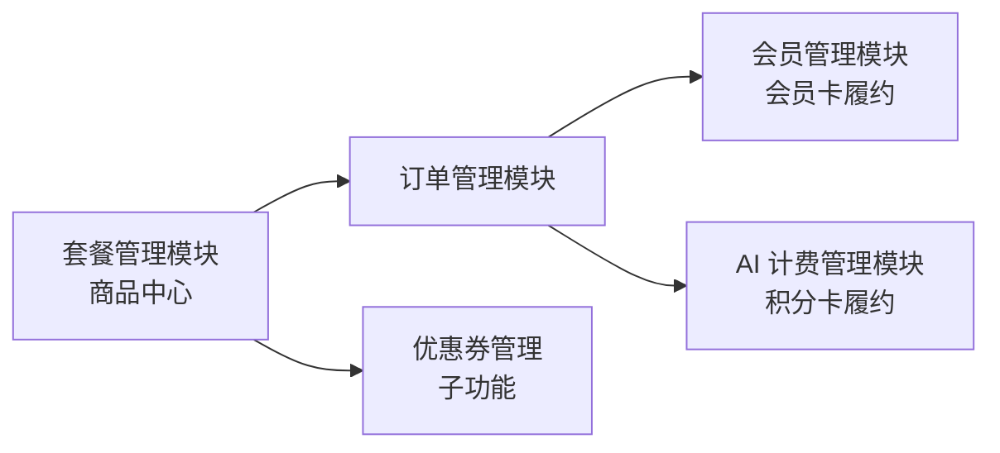

# 套餐管理模块需求规格

> **模块边界说明**：本模块是平台**商品中心**，覆盖所有可售商品（套餐）的定义、定价、营销与销售统计；**订单创建/支付/退款/自动续费**由[订单管理模块](../订单管理/需求规格.md)承接，**会员卡履约（等级变更）**由[会员管理模块](../会员管理/需求规格.md)承接，**积分卡履约（积分到账）**由[AI 计费管理模块](../AI计费管理/需求规格.md)承接，本文档不重复定义。
>
> **设计基线**：本模块遵循[商业化体系总体架构](../../../01-产品设计/07-商业化体系总体架构.md)的产品思想——"套餐是商品打包售卖的抽象"，商品类型可随产品线扩展。

## 1. 模块概述

### 1.1 模块定位

套餐管理模块负责管理平台所有可售商品（套餐）的定义、定价、上下架及权益/积分配置，是平台商业化体系的商品中心：为订单管理模块提供商品数据，为会员管理模块（会员卡）与 AI 计费模块（积分卡）提供履约依据。

套餐是"商品打包售卖"的抽象，当前支持两类商品：

| 商品类型 | 定位 | 履约目标 |
|---------|------|---------|
| **会员卡** | 订阅型：打包"会员身份与权益"，购买获得或升级会员等级 | 会员等级与权益 |
| **积分卡** | 加量型：打包"积分数量"，购买为积分余额加量（**AI 加量包**，服务当前会员超额用量） | 积分余额到账 |

### 1.2 核心价值

| 价值维度 | 具体内容 |
|---------|---------|
| **通用商品中心** | 所有可售商品统一管理，商品类型可扩展（会员卡 / 积分卡 / 未来服务包） |
| **多样化方案** | 会员卡支持包月/季/年多种周期套餐，积分卡支持多档位加量包 |
| **灵活定价** | 支持原价、促销价，配合促销活动与优惠券实现多种价格策略 |
| **权益/积分配置** | 会员卡权益个性化覆盖；积分卡积分数量配置 |
| **运营管控** | 商品上下架、销售数据统计、优惠券管理一站式管理 |

### 1.3 业务目标

#### 功能目标

- 提供商品 CRUD 和上下架管理（会员卡）
- 提供价格计算能力（促销折扣 + 优惠券抵扣，下单前预览）
- 提供促销活动数据读取与展示及运营自助管理（见 §2.4）
- 提供优惠券管理（创建/发放/领取/核销状态流转）
- 提供销售统计（按商品/等级/周期/优惠券使用率）
- 支持积分卡商品定义与履约（AI 加量包）

#### 性能目标

| 指标 | 目标值 | 说明 |
|-----|--------|------|
| 商品列表查询 | <200ms | 用户端在售商品列表（Python 端有缓存） |
| 商品详情查询 | <100ms | 单个商品详情响应时间 |
| 后台商品列表 | <500ms | 后台分页查询响应时间 |
| 价格计算 | <100ms | 促销折扣与优惠券抵扣实时完成 |

### 1.4 模块依赖关系



| 依赖方向 | 模块 | 依赖说明 |
|---------|------|---------|
| 被依赖 | **订单管理模块** | 商品购买下单、支付、退款统一经订单管理 |
| 被依赖 | **会员管理模块** | 会员卡支付成功后触发会员等级变更与权益生效 |
| 被依赖 | **AI 计费管理模块** | 积分卡支付成功后积分到账（积分余额增加） |

---

## 2. 商品方案设计

### 2.1 商品定义 (F-PM-001)

#### 2.1.1 商品类型与通用字段

商品是"产品打包售卖"的抽象，通过**商品类型**区分履约目标。当前支持会员卡与积分卡，未来可随产品线扩展其他商品类型。

**通用字段**（所有商品类型共有）：

| 字段 | 说明 | 约束 |
|------|------|------|
| 商品名称 | 展示名称 | 2-32 字符，全局唯一（含已删除记录，防历史占用） |
| 商品类型 | 会员卡 / 积分卡 | 必填，创建后不可修改 |
| 原价 | 标准价格 | 单位：分，>0 |
| 促销价 | 当前销售价格 | 单位：分，>0 且 ≤原价 |
| 商品描述 | 展示文案 | ≤256 字符 |
| 排序值 | 列表展示顺序 | 0-999 |
| 上下架状态 | 1 上架 / 0 下架 | 新建默认下架 |

**类型差异化字段**：

| 字段 | 会员卡 | 积分卡 | 说明 |
|------|:----:|:----:|------|
| 会员等级 | ✅ | — | 关联会员等级（level_1/level_2/level_3） |
| 计费周期 | ✅ | — | monthly（月卡）/quarterly（季卡）/yearly（年卡） |
| 有效期天数 | ✅ | — | 支付后会员有效期（1-365） |
| 权益覆盖项 | ✅ | — | 对等级默认权益的个性化覆盖（JSON，未覆盖项继承） |
| 可得积分 | — | ✅ | 支付成功后到账的积分数量（>0） |

> **积分卡定价说明**：积分卡以标准兑换率（1 元 = 100 积分）为衡量锚；档位可在此锚上做量价优惠（大额档位单价更低，通过促销价体现），鼓励大额加购。兑换率锚不构成定价硬约束。

> **说明**：早期设计稿中的"9 个固定套餐矩阵（VIP1/VIP2/SVIP × 月/季/年 + 具体价格）"**仅为实现前的商品方案示意**。系统提供**默认商品模板初始化脚本**（会员卡：VIP1/VIP2/SVIP × 月/季/年 共 9 套；积分卡：若干积分档位），部署时初始化，运营可在此基础上调整或新建；会员卡权益包由"等级权益 + 套餐覆盖项"动态计算，无独立权益包表。

#### 2.1.2 权益计算规则（会员卡）

```
会员卡实际生效权益 = 会员等级权益（sys_member_benefit）⊕ 会员卡权益覆盖项（benefit_overrides）
```

- 未配置覆盖项的字段取该等级的标准权益（各任务类型配额/历史保留/批量上限/优先级/功能开关/AI 限额）
- 配置覆盖项的字段以覆盖值为准；各任务类型配额取 `max(等级权益配额, 覆盖配额)`（见 [会员管理 §3.3](../会员管理/需求规格.md)）
- 覆盖项解析失败时返回业务错误（不静默降级）

#### 2.1.3 会员卡有效期计算

| 计费周期 | 有效期 | 说明 |
|---------|--------|------|
| 月卡 | 30 天 | 由 period_days 字段控制（不按自然月） |
| 季卡 | 90 天 | 同上 |
| 年卡 | 365 天 | 同上 |

> **续费叠加规则**：会员卡未到期时购买新商品，有效期在原到期时间基础上叠加（取"原到期时间与当前时间较晚者"为基准）；到期后购买从支付时间开始计算。**续费叠加最大有效期上限 3 年（1095 天）**，叠加后超过 1095 天的购买请求拒绝。**升级差价折算（按剩余天数退还差额）未实现**——跨等级购买同样按续费叠加处理（见[订单管理模块 §3.1](../订单管理/需求规格.md)）。

#### 2.1.4 积分卡有效期

积分卡无有效期概念：支付成功后积分到账，充值积分**永久有效**（积分有效期规则见 [AI 计费管理 §2.2](../AI计费管理/需求规格.md)）。

### 2.2 价格计算 (F-PM-002)

#### 2.2.1 功能描述

下单前实时计算商品应付金额，供订单确认页预览（`GET /calculate-price`，三端一致），适用于全部商品类型。

#### 2.2.2 计算规则

```
应付金额 = 促销价 - 促销折扣 - 优惠券抵扣（最低 0）
```

| 折扣项 | 计算方式 |
|--------|---------|
| 促销折扣 | 遍历商品关联的进行中促销活动（status=1 且当前时间在活动期内），按活动类型计算折扣：`percent` 按 `salePrice × discount_value / 100`、`fixed` 按固定金额、`full_reduction` 按"订单金额 ≥ threshold 时减 face_value"；**取最大折扣值** |
| 优惠券抵扣 | 校验券状态/归属/有效期/适用商品后，按满减/折扣/无门槛/体验券类型计算（见 §2.3.4） |

> **促销叠加规则定论**：
> - **同时段多活动不叠加**：同一时段多个进行中促销活动**取最大折扣**（不累加）
> - **单活动多档位按满足条件执行**：满减活动支持多档位（如满 100 减 10、满 200 减 30），按订单实际金额命中的最高档位执行
> - 促销折扣与优惠券**可叠加**；结果小于 0 时按 0 处理

#### 2.2.3 价格快照

订单创建时**锁定价格快照**（snapshot）：将当时计算得出的促销价、促销折扣明细、优惠券抵扣、应付金额以及关联的商品 ID/类型/等级/周期/有效期写入订单快照字段。支付时按快照金额收款，**不受后续商品价格/促销活动/优惠券变更影响**。

> **实现说明**：订单表冗余存储商品名称、类型、等级、价格、周期与计算明细；价格快照在订单创建事务内生成，支付回调校验回调金额 = 快照应付金额（见 [订单管理模块支付回调](../订单管理/需求规格.md)）。

### 2.3 优惠券管理 (F-PM-003)

#### 2.3.1 优惠券类型

| 类型 | 说明 | 抵扣规则 |
|------|------|---------|
| 满减券 `full_reduction` | 满 X 元减 Y 元 | 促销后价 ≥ threshold 时抵扣 face_value |
| 折扣券 `discount` | 打 X 折 | 抵扣 `促销后价 × (100 - face_value) / 100` |
| 无门槛券 `no_threshold` | 直接抵扣固定金额 | 抵扣 face_value |
| 体验券 `trial` | 免费体验 | **直接激活会员卡权益（不产生订单）**，有效期短（默认 3 天），每人限领 1 次；激活后立即生效对应等级权益，到期后自动收回（适用于会员卡） |

#### 2.3.2 优惠券模板字段

| 字段 | 说明 |
|------|------|
| 名称/类型/面值 | 基础信息（面值：满减/无门槛为金额分，折扣为 0-100） |
| 使用门槛 | 满减券必填 |
| 有效期类型 | fixed（固定起止时间）/ relative（领取后 N 天） |
| 发放总量 | -1 为不限量 |
| 每人限领 | 每用户最多领取数量 |
| 适用商品 | 限定商品 ID 列表（NULL 表示全部适用；可限定商品类型） |
| 启用状态 | 1 启用 / 0 禁用 |

#### 2.3.3 优惠券发放

| 发放方式 | 状态 |
|---------|:----:|
| 主动领取 | ✅ 已实现（限频 + 限领 + 库存乐观锁） |
| 定向批量发放（全部用户 / 指定等级 / 指定用户） | ✅ 已实现（后台批量发放接口） |
| 活动赠送（如新用户注册自动发放） | ⏳ 未实现 |
| 客服补偿（客服手动发放） | ⏳ 未实现 |

#### 2.3.4 优惠券状态流转

| 状态 | 说明 | 触发场景 |
|------|------|---------|
| 未使用(1) | 已领取待使用 | 领取/批量发放 |
| 已锁定(4) | 下单时预占 | 订单创建时锁定 |
| 已使用(2) | 支付成功后核销 | 支付回调/余额支付完成 |
| 已过期(3) | 超过有效期 | 定时任务扫描过期 |

> 核销与锁定逻辑由[订单管理模块](../订单管理/需求规格.md)承接；**退款时未使用优惠券退回**（券状态由已锁定/已使用恢复为未使用，`used_qty` 同步扣减），**已使用（已核销）的优惠券不退回**；体验券不涉及订单，退款不适用。

#### 2.3.5 领取限制

- 每用户每分钟 ≤5 次（Redis 计数，可配置）
- 每用户领取数量 ≤ 每人限领（per_user_limit）
- 库存乐观锁：`issued_qty < total_qty` 条件更新，超发返回"已领完"

### 2.4 促销活动 (F-PM-004)

#### 2.4.1 活动类型

| 类型 | 说明 |
|------|------|
| 限时折扣 `discount` | 指定时间段内商品降价（表结构 + 折扣计算） |
| 新用户专享 `new_user` | 首次购买用户享受特价（购买时校验购买者是否新用户） |
| 节日促销 `holiday` | 节假日期间专属活动 |
| 满减活动 `full_reduction` | 订单金额满足条件减价（订单满 X 减 Y，支持多档位） |

#### 2.4.2 活动规则

- 活动通过 `start_time`/`end_time` 控制有效期，`status=1` 启用
- 商品-活动关联表记录折扣方式（percent 百分比 / fixed 固定金额 / full_reduction 满减档位）与折扣值；**促销活动可关联任意商品类型（会员卡 / 积分卡）**
- 商品详情展示进行中的活动（活动名称/类型/时间/规则）
- 价格计算时取进行中活动的**最大折扣值**（同时段多活动不叠加，单活动多档位按满足条件执行，见 §2.2.2）
- **下架保护**：参与进行中活动的商品不可下架（返回"商品参与进行中促销活动，无法下架"）
- **新用户专享校验**：购买 `new_user` 活动关联的商品时，校验购买者是否为新用户（**无历史付费订单**）。非新用户购买返回错误"该商品仅限新用户购买"；校验基于订单表中该用户已支付订单记录
- **活动生效依赖时间范围判断**：活动到点生效/失效通过 `start_time`/`end_time` 时间范围判断实时计算，无需定时任务切换

> **活动自动切换（远期规划）**：当前活动生效完全依赖时间范围判断（实时计算，无需定时任务）；远期规划增加运营通知（活动开始/结束前推送站内信提醒运营复核），属远期规划。

#### 2.4.3 促销活动管理（运营自助）

提供促销活动后台管理接口，支持运营自助创建/修改/上下架/关联商品：

| 管理能力 | 说明 |
|---------|------|
| 创建活动 | 录入活动名称、类型、时间范围、规则（折扣方式/折扣值/满减档位）、`new_user_only` 标识 |
| 修改活动 | 修改活动信息；**进行中的活动修改规则需二次确认** |
| 上架/下架 | `status` 切换；下架后价格计算不再纳入该活动 |
| 关联商品 | 维护商品-活动关联关系（一个活动可关联多个商品，一个商品可关联多个活动） |
| 活动查询 | 后台分页查询活动列表，支持按类型/状态/时间筛选 |

> **三后端一致性**：促销活动管理接口在 Java/Go/Python 三后端契约一致（Java 权威，Go/Python 对齐），权限标识 `package:promotion:*`（见 [API接口.md](./API接口.md)）。

### 2.5 商品履约 (F-PM-013)

商品购买后的履约按商品类型差异化执行，由订单管理支付成功回调触发：

| 商品类型 | 履约动作 | 承接模块 |
|---------|---------|---------|
| 会员卡 | 会员等级变更（获得/升级）、权益生效（含权益覆盖项）、成长值累积（消费 1:1） | 会员管理 |
| 积分卡 | 积分余额增加（可得积分到账）、积分流水记录（充值来源） | AI 计费 |

- **会员卡履约**：支付成功 → 会员等级生效 → 权益与配额更新 → 成长值累积（详见 [会员管理 §3.1](../会员管理/需求规格.md)）
- **积分卡履约**：支付成功 → 积分余额增加、流水记录 → 用户可在 AI 服务中消耗（详见 [AI 计费 §2.2](../AI计费管理/需求规格.md)）
- **积分卡不影响会员身份**：购买积分卡不改变会员等级与权益
- 退款履约联动：会员卡退款按天折算并扣减对应成长值；积分卡退款策略见 §8 待确认事项

---

## 3. 用户端功能

### 3.1 商品展示页 (F-PM-005)

#### 3.1.1 功能描述

展示所有在售商品，支持用户比较和选择（`package/shop` 页面），含积分卡分类展示。

#### 3.1.2 页面布局

| 区域 | 内容 |
|------|------|
| 顶部横幅 | 会员推广文案（可关闭） |
| 商品分类 Tab | **会员卡** / **积分卡** 分类切换（本次改造目标） |
| 商品卡片 | 按商品展示（类型图标/名称/促销价/原价删除线/日均价或积分数量/权益列表/购买按钮） |
| 权益对比表 | 各等级权益对比（会员卡区展示，当前等级高亮） |

#### 3.1.3 商品卡片信息

**会员卡区**：

| 信息项 | 说明 |
|--------|------|
| 商品名称 | 如"VIP2 年卡" |
| 会员等级标识 | 等级图标和颜色 |
| 价格 | 促销价（大字）+ 原价（删除线） |
| 日均价格 | 促销价 / 有效期天数（整数四舍五入到分，如"¥0.26/天"） |
| 核心权益 | 生效权益列表（等级权益 ⊕ 覆盖项） |
| 购买按钮 | "立即开通"/"续费"/"升级至此"（按当前等级与商品等级比较） |

**积分卡区**：

| 信息项 | 说明 |
|--------|------|
| 商品名称 | 如"AI 积分 1000 加量包" |
| 可得积分 | 支付成功后到账积分数量（大字展示） |
| 价格 | 促销价（大字）+ 原价（删除线，体现量价优惠） |
| 单价提示 | 每积分单价（促销价 / 可得积分），帮助用户比较档位 |
| 购买按钮 | "立即购买" |

> **用户心智**：会员卡区"买权益"、积分卡区"买用量"，两类商品职责清晰、互不混淆；顶部横幅为固定推广文案。

### 3.2 商品购买（联动订单管理）

购买流程（选择商品 → 价格预览 → 订单创建 → 支付）由[订单管理模块](../订单管理/需求规格.md)承接，套餐管理仅提供在售列表、详情与价格计算接口。会员卡与积分卡统一经订单管理完成购买。

> 早期设计稿中的"订单确认页（协议勾选、优惠券选择、支付方式）"细节见订单管理模块；**自动续费**由订单管理模块的自动续费配置承接（当前仅会员卡适用）。

---

## 4. 后台管理功能

### 4.1 商品列表查询 (F-PM-008)

#### 4.1.1 功能描述

提供商品信息的分页展示和多条件筛选。

#### 4.1.2 查询条件

| 条件类型 | 说明 |
|---------|------|
| 商品名称 | 模糊匹配 |
| 商品类型 | 精确匹配（会员卡 / 积分卡）🔧 本次改造目标 |
| 会员等级 | 精确匹配（会员卡） |
| 计费周期 | 精确匹配（会员卡） |
| 上下架状态 | 精确匹配 |
| 创建时间 | 范围匹配 |

#### 4.1.3 列表展示字段

| 字段 | 说明 |
|------|------|
| 商品名称 | 商品显示名称 |
| 商品类型 | 会员卡 / 积分卡（标签区分） |
| 会员等级 / 可得积分 | 会员卡展示等级名称；积分卡展示可得积分数量 |
| 计费周期 | 月/季/年（会员卡） |
| 原价 | 标准价格 |
| 促销价 | 当前销售价格 |
| 日均价格 / 积分单价 | 会员卡展示日均价；积分卡展示每积分单价 |
| 销量 | 累计销售份数（支付成功时累加） |
| 状态 | 在售/下架 |
| 创建时间 | 商品创建时间 |
| 操作 | 编辑/上架/下架/删除 |

### 4.2 商品新增/编辑 (F-PM-009)

#### 4.2.1 功能描述

创建或修改商品信息。表单按商品类型差异化展示：会员卡展示"等级/周期/有效期/权益覆盖"配置，积分卡展示"可得积分"配置。

#### 4.2.2 通用表单字段与校验

| 字段 | 必填 | 校验规则 |
|------|------|---------|
| 商品名称 | ✅ | 2-32 字符，全局唯一（含软删行） |
| 商品类型 | ✅ | 固定枚举（会员卡/积分卡），创建后不可修改 |
| 原价 | ✅ | >0，单位分 |
| 促销价 | ✅ | >0 且 ≤原价 |
| 商品描述 | ❌ | ≤256 字符 |
| 排序值 | ❌ | 0-999 |
| 上下架状态 | ❌ | 0/1（表单默认下架） |

#### 4.2.3 会员卡差异化字段

| 字段 | 必填 | 校验规则 |
|------|------|---------|
| 会员等级 | ✅ | 关联会员等级配置 |
| 计费周期 | ✅ | 固定枚举（monthly/quarterly/yearly），非法值拒绝 |
| 有效期天数 | ✅ | 1-365 |
| 权益覆盖项 | ❌ | 见 §4.2.4 |

#### 4.2.4 权益覆盖配置区域（会员卡）

商品编辑页包含权益覆盖配置区，可配置该商品对等级默认权益的覆盖项；未覆盖项继承等级权益：

| 配置项 | 继承来源 | 是否可覆盖 |
|--------|---------|-----------|
| 各任务类型月度配额（去雾/去雨/去雪/低光/超分/去噪/修复/评估） | 会员等级配置 | ✅ |
| AI 积分限额（日/月） | 会员等级配置 | ✅ |
| 历史记录保留 | 会员等级配置 | ✅ |
| 批量处理上限 | 会员等级配置 | ✅ |
| 处理优先级 | 会员等级配置 | ✅ |
| 功能解锁项（高级参数/高清导出/对比报告/批量下载） | 会员等级配置 | ✅ |

> 覆盖项仅支持以上字段的数值替换。

#### 4.2.5 积分卡差异化字段

| 字段 | 必填 | 校验规则 |
|------|------|---------|
| 可得积分 | ✅ | >0，支付成功后到账积分数量 |
| 积分单价提示 | 自动 | 促销价 / 可得积分，用户端展示（见 §3.1.3） |

#### 4.2.6 业务规则

1. 已有订单的商品不可删除，仅可下架
2. 价格修改不影响已生成的订单（订单冗余存储商品名称/类型/等级/价格）
3. 商品名称全局唯一（含软删行查重，防历史占用）
4. 新建商品默认为下架状态，需手动上架
5. 商品类型创建后不可修改（避免履约语义错乱）

### 4.3 商品上下架 (F-PM-010)

#### 4.3.1 功能描述

控制商品在用户端的展示和购买状态。

#### 4.3.2 业务规则

- 下架后：用户端不再展示该商品，已购买用户的权益/积分不受影响
- 上架后：用户端立即可见可购买
- **参与进行中促销活动的商品不可下架**（返回业务错误）
- 下架状态校验：商品详情接口对下架商品返回"商品已下架"

### 4.4 销售统计 (F-PM-012)

#### 4.4.1 功能描述

展示商品销售数据，支撑运营决策。**已实现**（`/sales/stats`）；本次改造增加按商品类型维度。

#### 4.4.2 统计维度

| 维度 | 指标 | 说明 |
|------|------|------|
| 按商品 | 销量、销售额 | 基于已支付订单（status 2/3）分组统计，销售额=实付金额求和 |
| 按商品类型 | 会员卡 / 积分卡 各自销量、销售额 | 按订单商品类型分组 |
| 按等级 | 各等级会员卡销量、销售额 | 按订单会员等级分组 |
| 按周期 | 月/季/年会员卡销量、销售额 | JOIN 商品表按 period 分组 |
| 优惠券 | 发放量、使用量、使用率 | `Σissued_qty`、`Σused_qty`、使用率=used/issued |

> **说明**：早期设计稿中的"退款率、续费率、按时间趋势"**未实现**（退款率/按日趋势在[订单管理模块](../订单管理/需求规格.md)的订单统计中提供）。

---

## 5. 交互规范

### 5.1 页面布局

| 页面 | 布局要点 |
|------|---------|
| 商品列表页 | 顶部推广横幅（可关闭），商品分类 Tab（会员卡 / 积分卡），主体为商品卡片排列，会员卡区底部权益对比表 |
| 商品详情页 | 会员卡：基本信息、价格梯度（原价/促销价/日均价）、权益清单、购买入口；积分卡：基本信息、可得积分、价格梯度（原价/促销价/积分单价）、购买入口 |
| 商品编辑页（后台） | 通用表单 + 类型差异化配置区（会员卡权益覆盖 / 积分卡可得积分） |

### 5.2 关键交互行为

| 场景 | 交互行为 |
|------|---------|
| 商品分类切换 | 会员卡 / 积分卡 Tab 切换，列表按类型过滤展示 |
| 会员卡卡片展示 | 等级图标、促销价（大字）+原价（删除线）、日均价、核心权益列表、购买按钮（按等级比较展示"立即开通"/"续费"/"升级至此"） |
| 积分卡卡片展示 | 可得积分（大字）、促销价 + 原价、积分单价、购买按钮"立即购买" |
| 价格预览 | 选择优惠券后实时计算并展示应付金额 |
| 权益对比 | 权益对比表高亮当前等级，支持横向滚动查看全部权益项 |

### 5.3 操作反馈

| 场景 | 反馈行为 |
|------|---------|
| 点击购买 | 跳转下单页（联动订单管理） |
| 下架商品不可购买 | 提示"商品已下架" |
| 参与活动商品下架 | 提示"商品参与进行中促销活动，无法下架" |
| 优惠券领取成功 | 提示"领取成功" |
| 优惠券已领完 | 提示"优惠券已领完" |

---

## 6. 非功能需求

### 6.1 性能需求

| 指标 | 要求 |
|-----|------|
| 商品列表缓存 | 用户端在售列表带缓存（Python 端缓存：在售 5 分钟 / 详情 10 分钟，商品变更时失效；Java 端无缓存） |
| 价格计算 | <100ms，促销与优惠券实时计算（同步实时计算） |
| 销量统计 | 实时聚合（非 T+1，直接查询已支付订单聚合） |

### 6.2 安全需求

| 方面 | 措施 |
|-----|------|
| 价格防篡改 | 订单创建时后端重新计算价格（`calculate-price` 结果为准），不信任前端传入金额（订单模块） |
| 优惠券防刷 | 领取频率限制（每用户每分钟 ≤5 次）+ 每人限领数量 |
| 并发控制 | 优惠券库存乐观锁（`issued_qty < total_qty` 条件更新） |
| 权限控制 | 后台管理仅管理员可操作（package:* 权限标识） |

### 6.3 可用性需求

| 方面 | 要求 |
|-----|------|
| 商品展示降级 | 缓存不可用时降级为直接查询（Python 端 Redis 降级回退） |
| 支付幂等 | 同一订单重复支付回调防重（订单模块锁 + 状态判断） |
| 活动切换 | 促销活动到点自动开始/结束（依赖时间范围判断实时计算，无需定时任务） |

---

## 7. 依赖关系

### 7.1 依赖模块

| 模块 | 依赖说明 |
|------|---------|
| **会员管理模块** | 会员卡关联会员等级，权益配置基于等级权益 + 覆盖项 |
| **订单管理模块** | 商品订单引用商品信息与价格计算结果；支付成功累加销量并触发履约 |
| **AI 计费管理模块** | 积分卡履约（积分到账）；积分消耗计量与成本核算 |

> 计费周期、优惠券类型为**固定枚举**，**不依赖字典管理模块**。

### 7.2 被依赖模块

| 模块 | 依赖说明 |
|------|---------|
| **订单管理模块** | 订单创建时引用商品信息，计算订单金额 |
| **会员管理模块** | 会员卡支付成功后触发会员等级变更（`level_source=purchase`）与配额更新，并累积成长值（`consume`） |
| **AI 计费管理模块** | 积分卡支付成功后积分到账（充值来源） |

> 会员卡支付成功后成长值按消费金额 1:1 累积（`consume`），退款时等量扣减（`refund_deduct`），见 [会员管理需求规格 §2.3](../会员管理/需求规格.md)。

---

## 8. 待确认事项

1. **积分卡退款策略**：积分卡支付成功后未消耗部分发生退款，如何处理？已消耗积分按比例折算，还是积分卡退款不支持？（对齐会员卡按天折算逻辑）
2. **积分卡体验券/试用**：积分卡是否需要体验/试用形态（当前体验券仅适用于会员卡）？
3. **过期商品续费优惠**：商品到期后的续费是否享受自动续费折扣？过期后宽限期内续费是否叠加原有效期？
