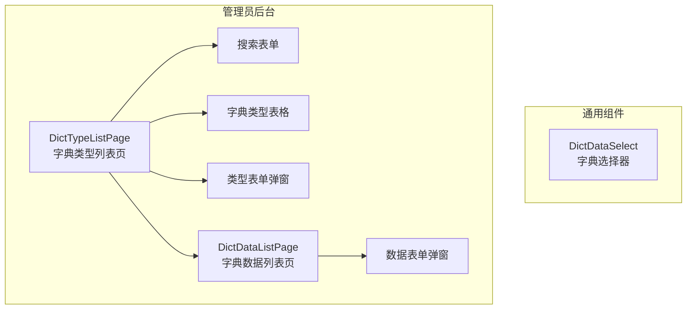
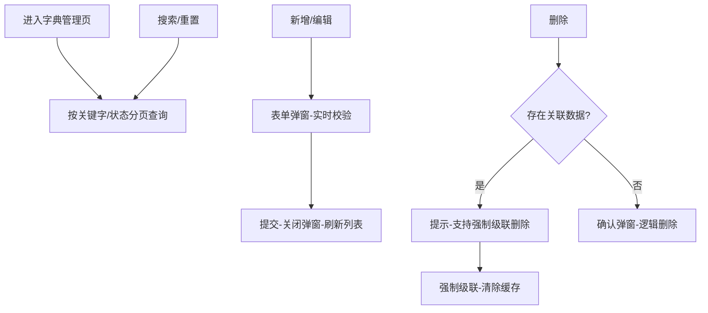

# 字典管理模块 - 前端实现设计

## 1. 文档概述

本文档描述字典管理模块的前端实现方案（dehaze-front-vue），聚焦组件架构、状态管理、路由设计、数据流与关键交互决策。字典管理采用字典类型 + 字典数据两级结构，前端提供管理员字典管理页面与通用字典选择器组件，并通过前端缓存减少字典选项重复请求。业务需求见[需求规格.md](./需求规格.md)。

---

## 2. 组件树设计

| 组件 | 职责 | 复用性 |
|------|------|--------|
| DictDataSelect | 通用字典选择器：按 typeCode 加载下拉选项，优先读 dictStore 缓存 | 可复用（嵌入各业务表单） |
| DictTypeListPage | 字典类型管理：搜索、分页表格、新增/编辑/删除、批量删除、级联删除 | 管理员页面 |
| DictDataListPage | 字典数据管理：按类型筛选、分页表格、新增/编辑/删除、排序、默认值设置 | 管理员页面（弹窗形式） |
| 类型/数据表单弹窗 | 字典类型/数据的新增与编辑表单，含实时校验 | 页面内组件 |

> 字典管理页面采用单页双列表格布局：主页展示字典类型列表，字典数据通过弹窗管理。字典类型编码（code）创建后不可修改，编辑表单中只读。

---

## 3. 状态管理

**Store 模块划分**

| Store | 职责 |
|------|------|
| dictStore | 字典数据前端缓存（按 typeCode 缓存启用状态下拉选项），减少重复请求 |

**核心状态**

| Store | 状态字段 | 说明 |
|------|---------|------|
| dictStore | dictCache | 按 typeCode 缓存启用状态选项，同会话内不重复请求 |
| dictStore | loading | 缓存加载状态 |

> 页面局部状态（DictTypeListPage / DictDataListPage 组件内管理）：loading / total / pageData（加载状态、数据总数、分页数据）、removeIds（待删除 ID 集合）、dialogVisible / formData（弹窗可见性与表单数据）。

**核心操作**

| Store | 方法 | 说明 |
|------|------|------|
| dictStore | getOptions | 按 typeCode 获取下拉选项，优先读缓存，未命中时请求并写入缓存 |
| dictStore | invalidate | 字典数据变更后清除对应 typeCode 缓存，保证全局刷新 |
| dictStore | preload | 预加载高频字典类型（如用户性别、角色状态），减少首屏等待 |

> dictStore 前端缓存与后端 Redis 缓存配合：前端缓存减少同会话内重复请求，后端缓存（TTL 1 小时）兜底并保证多端一致。字典数据变更后通过 dictStore.invalidate 清除前端缓存，下次读取时重新拉取。

---

## 4. 路由设计

| 路径 | 组件 | 权限 | 守卫 |
|------|------|------|------|
| `/system/dict/type` | DictTypeListPage | 管理员（`sys:dict:type:*`） | 登录守卫 + 动态菜单加载 |
| 弹窗（无独立路由） | DictDataListPage | 管理员（`sys:dict:data:*`） | 由类型列表页打开 |

> 字典管理为管理员路由，通过动态菜单按权限加载。DictDataSelect 无独立路由，由业务表单嵌入。字典下拉选项接口无需管理权限，登录用户即可调用。

---

## 5. 数据流

### 5.1 字典类型管理

### 5.2 字典数据管理

点击"字典数据" -> 打开管理弹窗 -> 按 typeCode 分页查询 -> 新增/编辑（typeCode 只读）/删除 -> 刷新数据表格

### 5.3 字典选择器消费

业务表单嵌入 DictDataSelect -> 传入 typeCode -> dictStore.getOptions 优先读缓存 -> 未命中时请求后端（走 Redis 缓存）-> 返回启用状态选项（按 sort 升序）

### 5.4 模块间数据交互

| 交互方向 | 数据 | 说明 |
|---------|------|------|
| 各业务模块 -> 字典管理 | typeCode | 经 DictDataSelect 消费字典下拉选项 |
| 字典管理 -> 各业务模块 | 字典选项 | 变更后清除缓存，业务模块下次读取获取最新数据 |

---

## 6. 交互设计决策

| 决策点 | 实现方式 | 理由 |
|--------|---------|------|
| 字典前端缓存策略 | dictStore 按 typeCode 缓存启用状态选项，同会话内不重复请求；变更后失效对应缓存 | 字典数据低频变更高频读取，前端缓存减少重复请求，提升表单加载速度 |
| 字典选择器通用化 | DictDataSelect 统一接口，业务表单只需传入 typeCode 即可获取下拉选项 | 统一组件避免各业务模块重复实现字典加载逻辑 |
| 字典变更后全局刷新 | 字典数据增删改后调用 dictStore.invalidate 清除对应缓存，全局选择器下次读取自动刷新 | 前端缓存无法被动感知后端变更，主动失效保证数据一致性 |
| 编码不可变 | 字典类型 code 与字典数据 typeCode 创建后不可修改，编辑表单中只读 | 编码作为字典唯一标识被多处引用，修改会导致引用断裂 |
| 级联删除策略 | 默认禁止删除有引用的字典类型；强制级联时提示含字典数据数量，一并逻辑删除并清缓存 | 默认禁止避免误删导致业务下拉选项缺失；强制级联需用户明确知情 |
| 预置数据保护 | 系统预置字典类型不可删除 | 预置字典为系统基础数据，删除会导致功能异常 |
| 删除二次确认 | 单个/批量删除均弹确认弹窗，逻辑删除（数据保留可追溯） | 删除影响业务引用，需防误操作；逻辑删除保留可追溯性 |
| 搜索触发 | 点击搜索按钮或回车触发，重置到第一页 | 回车触发符合搜索习惯，重置页码避免空结果 |
| 排序生效 | 字典数据按 sort 字段升序展示，修改后立即影响显示顺序 | 排序值控制下拉选项顺序，即时生效确保展示一致 |

---

## 7. 公共组件使用

| 公共组件 | 使用方式 |
|---------|---------|
| 字典选择器组件（DictDataSelect） | 业务表单按需嵌入，传入 typeCode；自动读缓存加载下拉选项 |
| 表格组件 | 字典类型/数据列表分页展示，支持选择、排序、操作列 |
| 表单组件 | 类型/数据新增编辑弹窗，含实时校验与字段约束 |
| 搜索表单组件 | 关键字 + 状态筛选，回车/按钮触发查询 |
| 分页组件 | 字典类型/数据列表分页查询（默认每页 10 条） |
