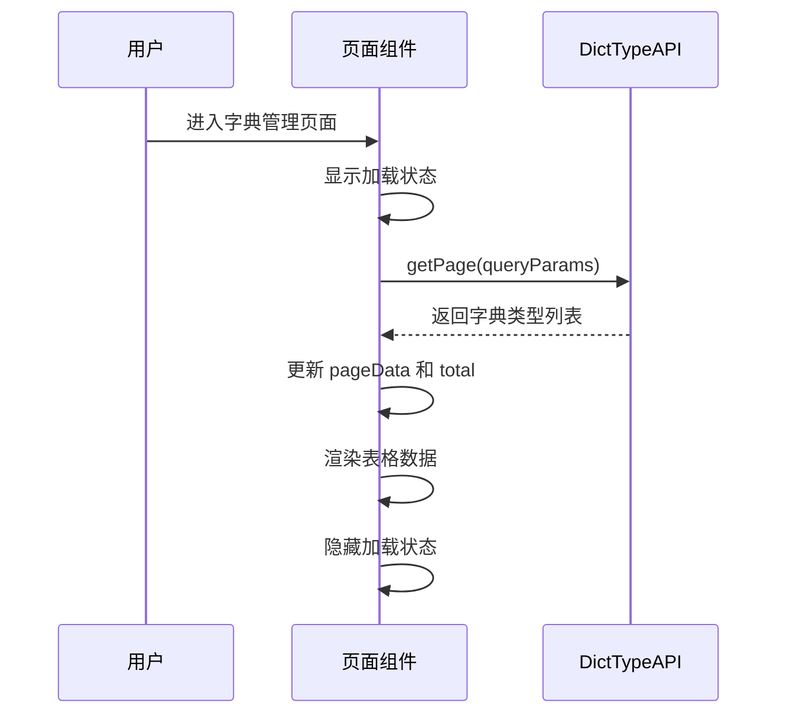
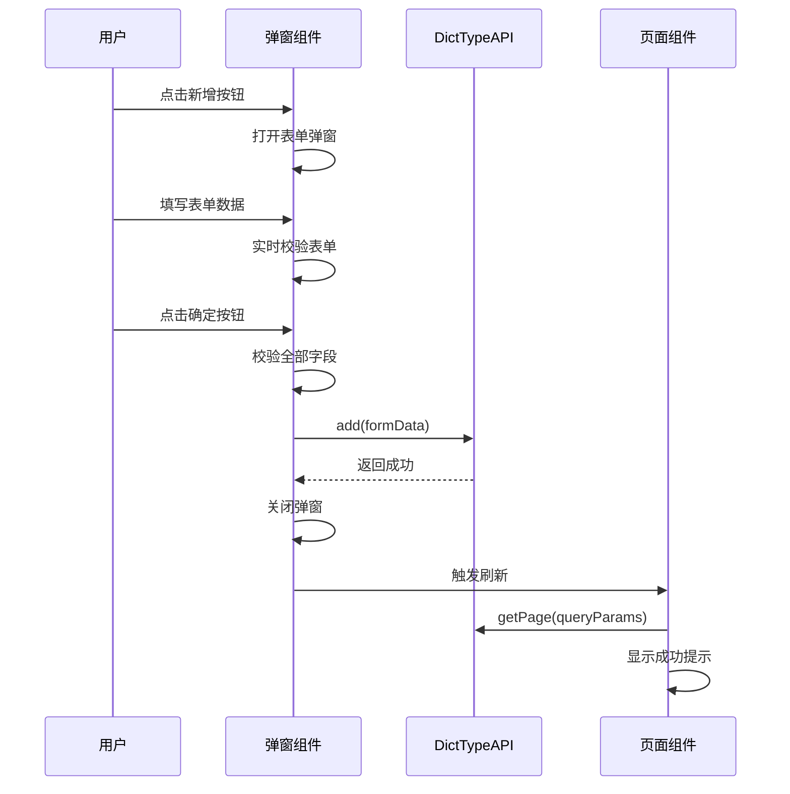
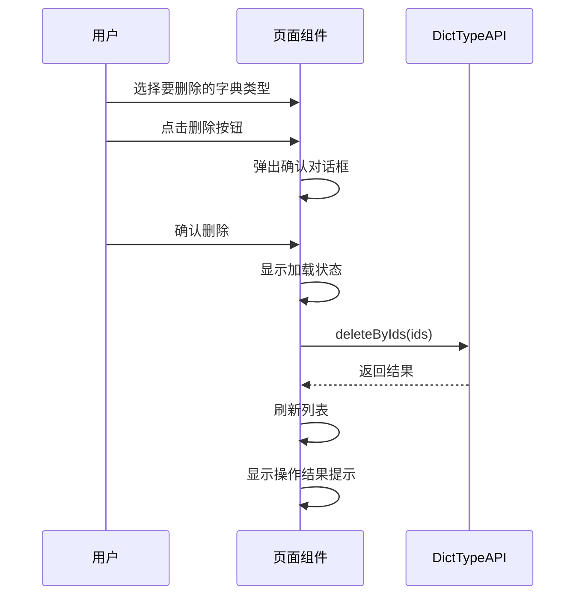

# 字典管理模块 - 前端实现设计

## 1. 文档概述

### 1.1 文档目的

本文档描述字典管理模块的前端实现设计，包括组件设计、状态管理、API 调用、交互设计等，为前端开发提供指导。

## 2. 技术架构

```
页面组件 (views/system/dict/index.vue)
    ↓
API调用层 (dehaze-sdk-js)
    ↓
状态管理 (Pinia / 组件状态)
    ↓
UI组件 (Element Plus)
```

## 3. 组件设计

### 3.1 组件结构

```
DictManagement (index.vue)                    # 字典管理主页面
├── SearchForm                                # 字典类型搜索表单
├── DictTypeTable                             # 字典类型表格
├── DictTypeFormDialog                        # 字典类型表单弹窗
└── DictItemDialog                            # 字典数据管理弹窗
    ├── DictItemTable                         # 字典数据表格
    └── DictItemFormDialog                    # 字典数据表单弹窗
```

### 3.2 页面组件结构

```
字典管理页面
├── 字典类型管理区域
│   ├── 搜索容器
│   │   ├── 搜索表单
│   │   │   ├── 类型名称输入框
│   │   │   ├── 类型编码输入框
│   │   │   ├── 搜索按钮
│   │   │   └── 重置按钮
│   │   └── 操作按钮区域
│   │       └── 新增按钮
│   └── 数据展示区域
│       ├── 字典类型表格
│       │   ├── 选择列
│       │   ├── 类型名称列
│       │   ├── 类型编码列
│       │   ├── 状态列
│       │   ├── 备注列
│       │   ├── 创建时间列
│       │   └── 操作列
│       └── 分页组件
└── 字典数据管理弹窗
    ├── 字典数据操作区域
    │   ├── 操作按钮区域
    │   │   └── 新增按钮
    │   └── 数据展示区域
    │       ├── 字典数据表格
    │       │   ├── 选择列
    │       │   ├── 数据名称列
    │       │   ├── 数据值列
    │       │   ├── 状态列
    │       │   ├── 排序列
    │       │   ├── 备注列
    │       │   ├── 创建时间列
    │       │   └── 操作列
    │       └── 分页组件
    └── 字典数据表单弹窗
```

### 3.3 组件接口定义

#### 3.3.1 字典类型搜索表单

| 属性/事件 | 类型 | 说明 |
|----------|------|------|
| modelValue | DictTypeQuery | 搜索条件 |
| @search | () => void | 搜索事件 |
| @reset | () => void | 重置事件 |

**搜索表单组件设计**：
- **类型名称输入框**：占位符 "字典名称"，支持回车键触发搜索，带清空按钮
- **类型编码输入框**：占位符 "字典编码"，支持回车键触发搜索，带清空按钮
- **搜索按钮**：主要按钮样式，搜索图标，触发字典类型列表查询
- **重置按钮**：默认按钮样式，刷新图标，清空搜索条件并重新查询

#### 3.3.2 字典类型表格

| 属性/事件 | 类型 | 说明 |
|----------|------|------|
| data | DictType[] | 表格数据 |
| loading | boolean | 加载状态 |
| @edit | (row: DictType) => void | 编辑事件 |
| @delete | (row: DictType) => void | 删除事件 |
| @manage-data | (row: DictType) => void | 管理字典数据事件 |
| @selection-change | (rows: DictType[]) => void | 选择变更事件 |

**表格列设计**：

| 字段 | 列名 | 宽度 | 对齐 | 说明 |
|------|------|------|------|------|
| selection | - | 55px | 居中 | 复选框列 |
| name | 类型名称 | 150px | 居中 | 字典类型显示名称 |
| code | 类型编码 | 150px | 居中 | 字典类型编码 |
| status | 状态 | 100px | 居中 | 启用/禁用标签 |
| remark | 备注 | 200px | 居中 | 备注信息 |
| createTime | 创建时间 | 180px | 居中 | 创建时间 |
| operation | 操作 | 220px | 右侧固定 | 字典数据/编辑/删除 |

#### 3.3.3 字典类型表单弹窗

| 属性/事件 | 类型 | 说明 |
|----------|------|------|
| visible | boolean | 弹窗可见性 |
| formData | DictTypeForm | 表单数据 |
| @submit | (data: DictTypeForm) => void | 提交事件 |
| @close | () => void | 关闭事件 |

**表单字段设计**：

| 字段 | 显示名称 | 组件类型 | 必填 | 校验规则 |
|------|---------|---------|------|---------|
| name | 字典名称 | 输入框 | ✅ | 不能为空 |
| code | 字典编码 | 输入框 | ✅ | 不能为空，编辑时只读 |
| status | 状态 | 单选框组 | ✅ | 正常(1)/禁用(0)，默认正常 |
| remark | 备注 | 文本域 | ❌ | 最大200字符 |

#### 3.3.4 字典数据管理弹窗

| 属性/事件 | 类型 | 说明 |
|----------|------|------|
| visible | boolean | 弹窗可见性 |
| typeCode | string | 字典类型编码 |
| typeName | string | 字典类型名称 |
| @close | () => void | 关闭事件 |

#### 3.3.5 字典数据表格

| 字段 | 列名 | 宽度 | 对齐 | 说明 |
|------|------|------|------|------|
| selection | - | 55px | 居中 | 复选框列 |
| name | 数据名称 | 150px | 居中 | 字典标签 |
| value | 数据值 | 150px | 居中 | 字典键值 |
| status | 状态 | 100px | 居中 | 启用/禁用标签 |
| sort | 排序 | 100px | 居中 | 排序值 |
| remark | 备注 | 200px | 居中 | 备注信息 |
| createTime | 创建时间 | 180px | 居中 | 创建时间 |
| operation | 操作 | 150px | 右侧固定 | 编辑/删除 |

#### 3.3.6 字典数据表单弹窗

**表单字段设计**：

| 字段 | 显示名称 | 组件类型 | 必填 | 校验规则 |
|------|---------|---------|------|---------|
| name | 字典标签 | 输入框 | ✅ | 不能为空 |
| value | 字典键值 | 输入框 | ✅ | 不能为空 |
| typeCode | 字典类型 | 输入框 | ✅ | 只读显示 |
| defaulted | 是否默认 | 单选框组 | ❌ | 是(1)/否(0)，默认否 |
| sort | 字典排序 | 数字输入框 | ✅ | 默认1，必须为数字 |
| status | 状态 | 单选框组 | ✅ | 正常(1)/禁用(0)，默认正常 |
| remark | 备注 | 文本域 | ❌ | 最大200字符 |

---

## 4. 状态管理

### 4.1 字典类型页面状态

```typescript
interface DictTypePageState {
  loading: boolean;           // 加载状态
  removeIds: number[];        // 待删除ID集合
  queryParams: DictTypeQuery; // 查询参数
  total: number;              // 数据总数
  pageData: DictType[];       // 字典类型分页数据
}

const state = reactive<DictTypePageState>({
  loading: false,
  removeIds: [],
  queryParams: {
    pageNum: 1,
    pageSize: 10,
    name: "",
    code: ""
  },
  total: 0,
  pageData: []
});
```

### 4.2 字典数据弹窗状态

```typescript
interface DictItemDialogState {
  visible: boolean;           // 弹窗可见性
  typeCode: string;           // 当前字典类型编码
  typeName: string;           // 当前字典类型名称
  loading: boolean;           // 加载状态
  removeIds: number[];        // 待删除ID集合
  queryParams: DictQuery;     // 查询参数
  total: number;              // 数据总数
  pageData: Dict[];           // 字典数据分页数据
}

const dictItemState = reactive<DictItemDialogState>({
  visible: false,
  typeCode: "",
  typeName: "",
  loading: false,
  removeIds: [],
  queryParams: {
    pageNum: 1,
    pageSize: 10,
    typeCode: ""
  },
  total: 0,
  pageData: []
});
```

### 4.3 表单数据状态

```typescript
// 字典类型表单
interface DictTypeForm {
  id?: number;
  name: string;
  code: string;
  status: number;
  remark?: string;
}

const dictTypeFormData = reactive<DictTypeForm>({
  name: "",
  code: "",
  status: 1,  // 默认启用
  remark: ""
});

// 字典数据表单
interface DictForm {
  id?: number;
  name: string;
  value: string;
  typeCode: string;
  defaulted?: number;
  sort: number;
  status: number;
  remark?: string;
}

const dictFormData = reactive<DictForm>({
  name: "",
  value: "",
  typeCode: "",
  defaulted: 0,  // 默认否
  sort: 1,       // 默认排序
  status: 1,     // 默认启用
  remark: ""
});
```

### 4.4 页面状态类型

| 状态 | 显示效果 |
|------|---------|
| 加载中 | 显示加载动画/骨架屏 |
| 空数据 | 显示"暂无数据"提示 |
| 加载失败 | 显示错误提示，提供重试按钮 |
| 正常 | 显示数据列表 |

### 4.5 按钮状态控制

| 按钮 | 状态控制 |
|------|---------|
| 批量删除按钮 | 无选中项时禁用 |
| 确定按钮 | 表单校验未通过时禁用，提交中显示加载 |

---

## 5. API 调用设计

### 5.1 SDK 接口调用

使用 `dehaze-sdk-js` 提供的 API 接口进行后端服务调用。

#### 5.1.1 字典类型 API

| 方法 | 功能 | 参数 | 返回值 |
|------|------|------|--------|
| DictTypeAPI.getPage | 获取字典类型分页列表 | queryParams: DictTypeQuery | Promise\<PageResult\<DictType\>\> |
| DictTypeAPI.add | 新增字典类型 | form: DictTypeForm | Promise\<void\> |
| DictTypeAPI.getFormData | 获取字典类型表单数据 | id: number | Promise\<DictTypeForm\> |
| DictTypeAPI.update | 修改字典类型 | id: number, form: DictTypeForm | Promise\<void\> |
| DictTypeAPI.deleteByIds | 删除字典类型 | ids: string | Promise\<void\> |

#### 5.1.2 字典数据 API

| 方法 | 功能 | 参数 | 返回值 |
|------|------|------|--------|
| DictAPI.getPage | 获取字典数据分页列表 | queryParams: DictQuery | Promise\<PageResult\<Dict\>\> |
| DictAPI.add | 新增字典数据 | form: DictForm | Promise\<void\> |
| DictAPI.getFormData | 获取字典数据表单数据 | id: number | Promise\<DictForm\> |
| DictAPI.update | 修改字典数据 | id: number, form: DictForm | Promise\<void\> |
| DictAPI.deleteByIds | 删除字典数据 | ids: string | Promise\<void\> |
| DictAPI.getOptions | 获取字典下拉选项 | typeCode: string | Promise\<Option[]\> |

## 6. 交互设计

> **交互规范**：详见 [需求规格.md](./需求规格.md) 第 4 节

### 6.1 页面加载流程



### 6.2 字典类型新增流程



### 6.3 字典类型删除流程



---

## 7. 表单校验规则

### 7.1 字典类型表单校验

```typescript
const dictTypeRules = reactive({
  name: [
    { required: true, message: "字典名称不能为空", trigger: "blur" }
  ],
  code: [
    { required: true, message: "字典编码不能为空", trigger: "blur" }
  ]
});
```

### 7.2 字典数据表单校验

```typescript
const dictRules = reactive({
  name: [
    { required: true, message: "字典标签不能为空", trigger: "blur" }
  ],
  value: [
    { required: true, message: "字典键值不能为空", trigger: "blur" }
  ],
  sort: [
    { required: true, message: "字典排序不能为空", trigger: "blur" },
    { type: "number", message: "字典排序必须为数字", trigger: "blur" }
  ]
});
```

### 7.3 业务校验规则

| 校验项 | 说明 |
|--------|------|
| 编码唯一性 | 字典类型编码在系统中必须唯一（后端校验） |
| 值唯一性 | 字典值在同一类型下必须唯一（后端校验） |
| 关联检查 | 删除字典类型前检查是否存在关联字典数据 |

## 8. 权限控制

> **权限矩阵**：详见 [需求规格.md](./需求规格.md) 第 5.1 节

权限标识用于按钮显示控制：
- `sys:dict:type:add/edit/delete` - 字典类型操作
- `sys:dict:data:add/edit/delete` - 字典数据操作
