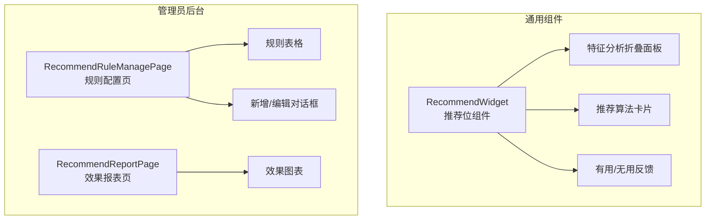
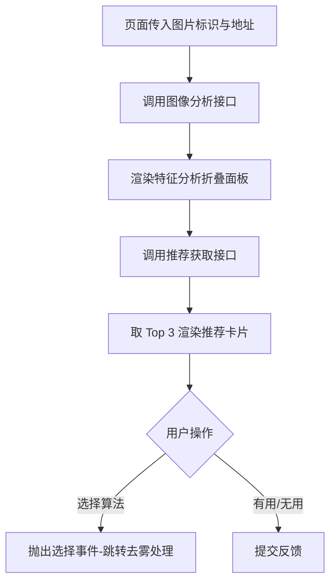
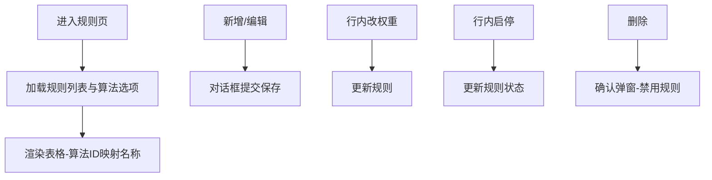

# 推荐管理模块 - 前端实现设计

## 1. 文档概述

本文档描述推荐管理模块的前端实现方案，聚焦组件架构、状态管理、路由设计、数据流与关键交互决策。前端提供可嵌入业务页面的推荐位组件与管理员规则配置/效果报表页面。

---

## 2. 组件树设计

| 组件 | 职责 | 复用性 |
|------|------|--------|
| RecommendWidget | 推荐位组件：接收图片标识 -> 特征分析 -> Top 推荐算法列表 -> 反馈 | 可复用（嵌入算法选择页等业务页面） |
| RecommendRuleManagePage | 管理员规则配置：规则列表、行内改权重/启停、新增/编辑、删除（禁用） | 管理员页面 |
| RecommendReportPage | 管理员效果报表：推荐总量、覆盖率、采纳率、满意度、趋势图表 | 管理员页面 |

> 推荐位采用 RecommendWidget 单组件承载推荐全流程（特征分析 + 推荐列表 + 反馈）。推荐功能仅在算法选择页接入。

---

## 3. 状态管理

**Store 模块划分**

| Store | 职责 |
|------|------|
| recommendStore | 图像特征分析、推荐列表获取、反馈提交的全流程状态 |
| ruleStore | 管理员规则配置页状态（规则列表、对话框、算法名称映射） |

**核心状态**

| Store | 状态字段 | 说明 |
|------|---------|------|
| recommendStore | analysis | 图像特征分析结果 |
| recommendStore | recommendations | 推荐算法列表（Top 3） |
| recommendStore | analyzing / error | 加载中状态与错误信息 |
| ruleStore | ruleList / total | 规则分页列表与总数 |
| ruleStore | dialogVisible / formData | 新增/编辑对话框可见性与表单数据 |

**核心操作**

| Store | 方法 | 说明 |
|------|------|------|
| recommendStore | analyze | 调用图像分析接口，写入特征分析结果 |
| recommendStore | fetchRecommendations | 分析完成后获取 Top 3 推荐 |
| recommendStore | submitFeedback | 提交"有用/无用"反馈 |
| ruleStore | loadRules | 加载规则列表与算法选项 |
| ruleStore | saveRule | 新增/编辑规则 |
| ruleStore | toggleRule | 行内启停规则（删除为禁用） |

---

## 4. 路由设计

| 路径 | 组件 | 权限 | 守卫 |
|------|------|------|------|
| 后台动态菜单 | RecommendRuleManagePage | 管理员（`sys:recommendation:rule:view/edit`） | 登录守卫 + 动态菜单加载 |
| 后台动态菜单 | RecommendReportPage | 管理员（`sys:recommendation:report`） | 登录守卫 + 动态菜单加载 |
| 无独立路由 | RecommendWidget | 登录用户 | 组件嵌入（无路由守卫） |

> 规则管理与效果报表为管理员后台页面，通过动态菜单按权限加载；RecommendWidget 作为可复用组件嵌入算法选择页，不单独配置路由。推荐查询/反馈无会员等级差异，所有用户获得相同推荐结果。

---

## 5. 数据流

### 5.1 推荐流程

### 5.2 规则管理流程

### 5.3 缓存与更新策略

| 策略 | 说明 |
|------|------|
| 推荐结果 | recommendStore 内存管理，页面级生命周期，不跨页面缓存 |
| 规则列表 | ruleStore 加载时完成算法 ID->名称映射，页面内不重复请求 |
| 规则更新 | 规则增删改后刷新规则列表，后端规则缓存由后端自行失效 |

### 5.4 模块间数据交互

| 交互方向 | 数据 | 说明 |
|---------|------|------|
| 算法选择 -> 推荐管理 | imageId/imageUrl | 传入推荐位组件 |
| 推荐管理 -> 算法选择 | select 事件 | 选择推荐算法跳转处理 |
| 推荐管理 -> 算法管理 | 算法选项 | 规则页算法多选与名称映射 |

---

## 6. 交互设计决策

| 决策点 | 实现方式 | 理由 |
|--------|---------|------|
| 推荐结果个性化展示 | 卡片列表展示 Top 3：排名序号 + 算法名 + 匹配度进度条 + 推荐理由 | Top 3 平衡推荐覆盖与选择负担；匹配度可视化帮助用户决策 |
| 匹配度可视化 | 进度条颜色分级（≥80 绿 / ≥60 橙 / 其他灰） | 颜色分级直观传达匹配程度，比纯数字更易感知 |
| 规则配置可视化 | 场景类型下拉、关联算法多选（可搜索）、权重滑块（0-100）、启用开关 | 可视化配置降低管理员操作门槛，滑块比输入框更直观 |
| 效果报表图表展示 | 覆盖率/采纳率/满意度统计卡片 + 按日采纳率趋势图表 | 统计卡片快速概览，趋势图展示推荐效果演变 |
| 特征分析展示 | 折叠面板（默认展开）展示 6 项特征网格，所有登录用户可见，无角色分级 | 特征分析为推荐依据，透明展示增强推荐可信度 |
| 反馈交互 | "有用/无用"按钮在卡片底部，按 recommendationId 独立 loading，不阻塞其他卡片 | 独立 loading 避免一个反馈操作阻塞整个推荐列表 |
| 分析/推荐分离 | analyze 完成后才请求推荐，避免串行等待 | 特征分析是推荐的前置条件，分离调用便于错误定位与重试 |
| 推荐列表截取 | 前端截取 Top 3 展示 | 后端返回匹配规则全部候选，前端截取控制展示数量 |
| 图像分析失败处理 | 错误提示（可关闭），不影响页面其他功能；保留已完成的特征分析结果 | 分析失败不应阻塞用户手动选择算法 |
| 推荐获取失败处理 | 警告提示，反馈提交失败时按钮恢复可点击 | 失败后允许重试，不永久禁用交互 |
| 规则保存失败处理 | 错误提示，保留对话框编辑状态供重试 | 避免用户填写的表单数据丢失 |
| 未传入图片 | 空状态引导提示 | 明确告知用户需要先上传图片才能获取推荐 |

