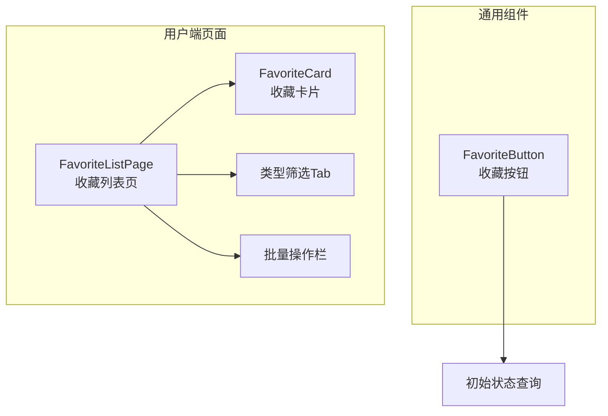
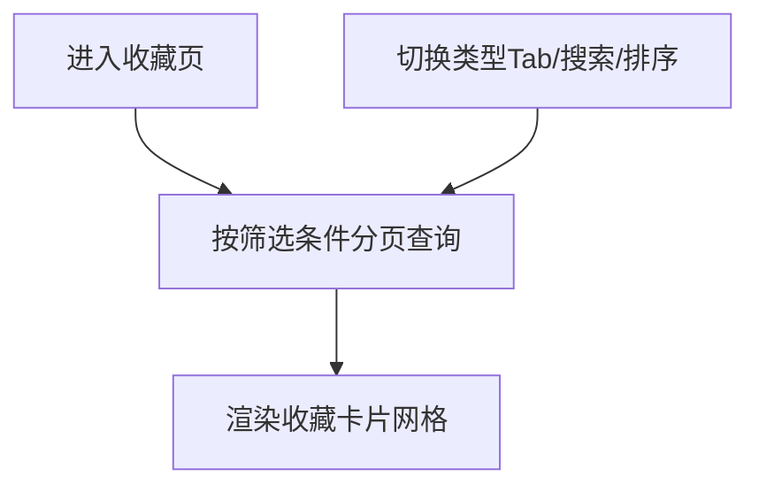
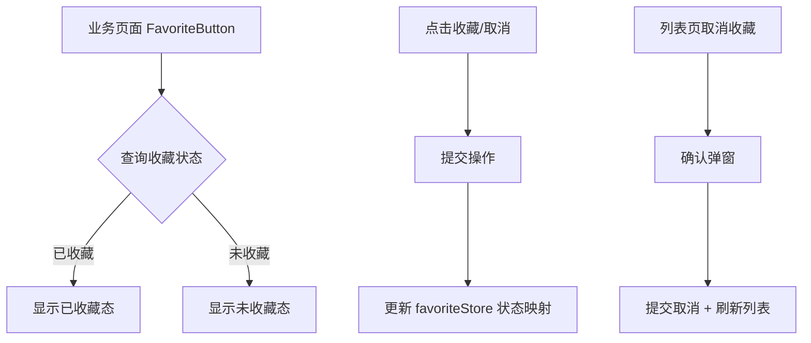

# 收藏管理模块 - 前端实现设计

## 1. 文档概述

本文档描述收藏管理模块的前端实现方案（dehaze-front-vue），聚焦组件架构、状态管理、路由设计、数据流与关键交互决策。收藏管理通过统一收藏表为算法、处理结果、数据集等业务实体提供收藏能力，前端提供通用收藏按钮组件与"我的收藏"聚合页。业务需求见[需求规格.md](./需求规格.md)。

---

## 2. 组件树设计

| 组件 | 职责 | 复用性 |
|------|------|--------|
| FavoriteButton | 通用收藏/取消收藏按钮：按 targetType + targetId 查询初始状态、操作切换、反馈提示 | 可复用（嵌入算法详情/处理结果/数据集详情等业务页面） |
| FavoriteListPage | 收藏聚合页：类型筛选 Tab、搜索、排序、收藏卡片网格、分页 | 用户端页面 |
| FavoriteCard | 收藏卡片：类型标签、失效标签、缩略图、名称、收藏时间、取消收藏 | 页面内组件 |

> 收藏管理能力（类型筛选/排序/搜索/卡片/批量操作/失效提示）内聚在页面组件中；FavoriteButton 为独立可复用组件，业务页面按需集成。

**FavoriteButton 集成场景**：

| 嵌入页面 | targetType | 说明 |
|---------|-----------|------|
| 算法详情页 | algorithm | 收藏算法，校验对象存在 |
| 图像处理结果页 | result | 收藏处理结果（失效标记规划中） |
| 数据集详情页 | dataset | 收藏数据集，校验对象存在 |

---

## 3. 状态管理

**Store 模块划分**

| Store | 职责 |
|------|------|
| favoriteStore | 收藏列表分页数据、收藏状态映射（按 targetType+targetId 缓存），供 FavoriteButton 快速初始化 |

**核心状态**

| Store | 状态字段 | 说明 |
|------|---------|------|
| favoriteStore | favoriteList / total | 收藏分页列表与总数 |
| favoriteStore | favoriteStatusMap | 收藏状态映射（key= targetType+targetId，value=是否已收藏），FavoriteButton 优先读缓存避免重复请求 |

**核心操作**

| Store | 方法 | 说明 |
|------|------|------|
| favoriteStore | toggleFavorite | 收藏/取消收藏切换，操作后同步更新状态映射 |
| favoriteStore | checkStatus | 按 targetType + targetId 查询收藏状态，优先读缓存 |
| favoriteStore | refreshList | 列表页取消收藏后刷新当前页数据 |

> 收藏/取消操作后同步更新 favoriteStatusMap，保证多按钮状态一致。列表分页数据与筛选条件在页面组件内局部管理。

---

## 4. 路由设计

| 路径 | 组件 | 权限 | 守卫 |
|------|------|------|------|
| `/favorite/my` | FavoriteListPage | 登录用户 | 登录守卫 + 动态菜单加载 |

> 收藏列表为受保护路由，经动态菜单加载，未登录不可访问。FavoriteButton 无独立路由，由业务页面嵌入。收藏容量按会员等级区分（普通 200 / VIP 500，后端校验），前端不区分等级权限，仅展示容量上限提示。

---

## 5. 数据流

### 5.1 收藏列表加载

> 查询参数含 targetType（类型筛选）、keywords（名称搜索）、sortBy/sortOrder（排序）、分页参数；切换类型 Tab 或搜索时重置页码重新查询。列表信息由关联查询实时获取（名称随对象更新），对象删除后名称为空且标记失效。

### 5.2 收藏操作

### 5.3 批量取消收藏

多选卡片 -> 确认弹窗 -> 批量提交取消 -> 提示"已取消 N 条收藏" -> 刷新列表 -> 同步更新 favoriteStore 状态映射

### 5.4 模块间数据交互

| 交互方向 | 数据 | 说明 |
|---------|------|------|
| 收藏管理 -> 会员管理 | 用户等级 | 容量校验（普通 200 / VIP 500，后端执行） |
| 算法/数据集管理 -> 收藏管理 | 删除事件 | 删除时标记相关收藏失效 |

---

## 6. 交互设计决策

| 决策点 | 实现方式 | 理由 |
|--------|---------|------|
| 收藏状态实时同步 | favoriteStore 维护状态映射，收藏/取消后同步更新，多按钮共享一致状态 | 同一对象可能在不同页面有多个收藏按钮，状态需全局一致 |
| 重复收藏幂等 | 已收藏对象重复点击幂等返回原记录，不报错、不产生重复数据 | 避免用户重复操作导致数据异常；后端幂等保证数据一致性 |
| 对象复活 | 已取消的收藏再次收藏时原记录复活（逻辑删除恢复），收藏时间更新 | 避免反复收藏/取消产生大量记录；复活机制保持数据简洁 |
| 收藏按钮防抖 | 快速重复点击时防抖，避免重复请求 | 后端虽幂等，前端防抖减少无效请求，提升体验 |
| 收藏列表虚拟滚动 | 收藏数量较多时启用虚拟滚动，仅渲染可视区域卡片 | VIP 用户收藏可达 500-3000 条，全量渲染导致卡顿 |
| 类型筛选 | 单选 Tab（targetType 单值），"全部"时不过滤；切换重置页码重新查询 | 单选简化交互，避免多类型组合筛选的复杂度（后端不支持组合筛选） |
| 排序选项 | 仅按收藏时间倒序/正序 | 评分/使用频率排序后端不支持，前端不展示避免误导用户 |
| 取消收藏确认 | 单条/批量均弹确认弹窗防误操作 | 收藏取消后需重新收藏，防误操作 |
| 失效卡片 | 对象已删除时展示"已失效"标签，点击不跳转 | 避免用户跳转到不存在的详情页 |
| 卡片跳转 | 按 targetType 映射详情路由（算法->算法详情、数据集->数据集详情等） | 收藏目的是快速回到对象，跳转是核心交互 |
| 收藏容量提示 | 容量已满时提示"收藏已达上限（X条），请清理后重试" | 后端校验容量，前端提前提示避免提交后才知道失败 |
| 搜索触发 | 按收藏名称关键字搜索，回车触发查询 | 回车触发符合搜索习惯，减少不必要的请求 |
| 缩略图预览 | 数据集类型展示缩略图，支持点击放大预览 | 数据集以图像为主，缩略图帮助用户识别收藏内容 |

---

## 7. 公共组件使用

| 公共组件 | 使用方式 |
|---------|---------|
| 收藏按钮组件（FavoriteButton） | 业务页面按需嵌入，传入 targetType + targetId；自动查询初始状态并响应操作 |
| 卡片组件（FavoriteCard） | 收藏列表使用，网格布局自适应列；含类型标签、失效标签、缩略图 |
| 分页组件 | 收藏列表分页查询（每页 12 条） |
| 图片预览组件 | 数据集类型缩略图支持点击放大预览 |
