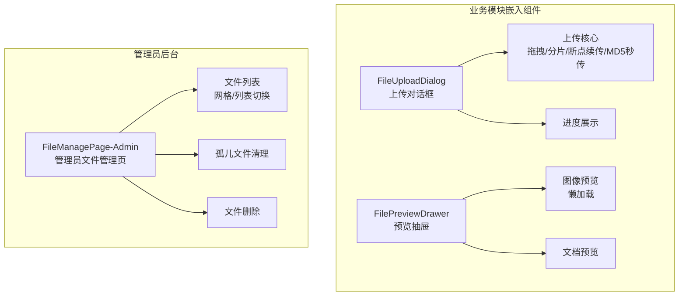
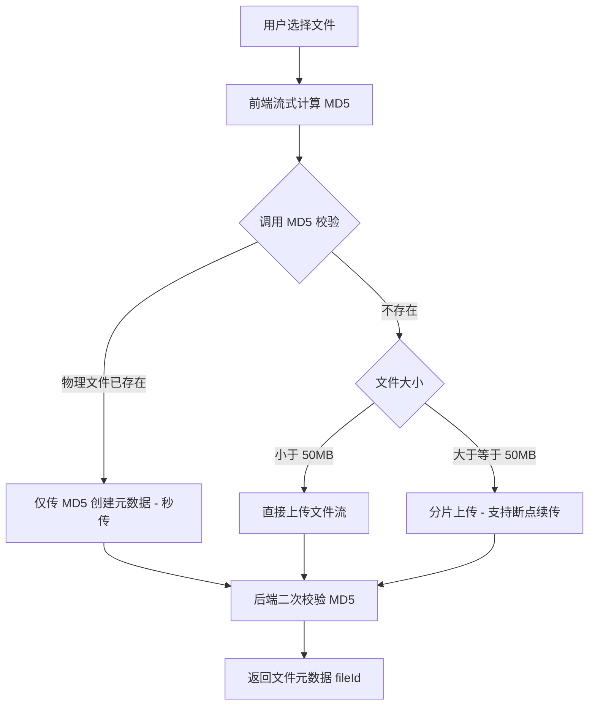

# 文件管理模块 - 前端实现设计

## 1. 文档概述

本文档描述文件管理模块的前端实现方案（dehaze-front-vue）。文件管理为 BFF 层基础服务，不面向普通用户提供独立界面：上传与预览能力以可复用组件形式嵌入各业务模块（数据集、算法、图像处理等）；文件列表与孤儿文件清理为管理员后台页面。业务需求见[需求规格.md](./需求规格.md)。

---

## 2. 组件树设计

| 组件 | 职责 | 复用性 |
|------|------|--------|
| FileUploadDialog | 文件上传对话框：拖拽上传、分片上传、断点续传、MD5 秒传、进度展示、去重提示 | 可复用（嵌入业务模块） |
| FilePreviewDrawer | 文件预览抽屉：图像懒加载预览、文档预览 | 可复用（嵌入业务模块） |
| FileManagePage-Admin | 管理员文件管理页：文件列表（网格/列表切换）、分页查询、关键字搜索、孤儿文件清理 | 管理员页面 |

> 上传组件按业务类型（image/model）区分大小限制，由调用方传入 businessType；文件列表仅管理员可见，普通用户经业务模块间接使用上传/下载能力。

---

## 3. 状态管理

**Store 模块划分**

| Store | 职责 |
|------|------|
| fileStore | 管理员文件列表分页查询、视图模式（网格/列表）切换 |
| uploadStore | 上传任务列表与进度，支持多文件并发上传状态跟踪，跨组件同步 |

**核心状态**

| Store | 状态字段 | 说明 |
|------|---------|------|
| fileStore | fileList / total / queryParams | 文件分页列表、总数、查询参数（关键字/分页） |
| fileStore | viewMode | 视图模式（网格/列表），仅控制展示层 |
| uploadStore | uploadTasks | 上传任务列表，每任务含生命周期 pending->uploading->completed/failed（分片支持 paused） |
| uploadStore | progress | 各任务分片上传进度 |

**核心操作**

| Store | 方法 | 说明 |
|------|------|------|
| fileStore | fetchList | 按关键字分页查询文件列表 |
| fileStore | toggleViewMode | 切换网格/列表视图模式（不触发重新请求） |
| uploadStore | addTask | 新增上传任务，初始化进度 |
| uploadStore | updateProgress | 更新分片上传进度 |
| uploadStore | removeTask | 上传完成/失败后移除任务 |

> 上传任务状态独立于业务页面状态，由 uploadStore 统一管理，便于上传对话框与列表跨组件同步进度。

---

## 4. 路由设计

| 路径 | 组件 | 权限 | 守卫 |
|------|------|------|------|
| `/file/manage` | FileManagePage-Admin | 管理员 | 登录守卫 + 动态菜单加载 |

> 上传/预览组件无独立路由，由业务模块按需嵌入。文件管理页为受保护路由，仅管理员可见；普通用户无文件列表入口，仅经业务模块上传/下载。

---

## 5. 数据流

### 5.1 上传流程（含秒传与分片）

### 5.2 文件列表与管理

进入管理页 -> 按关键字分页查询 -> 网格/列表切换（仅展示层）-> 删除文件（确认弹窗 -> 逻辑删除 -> 刷新列表）-> 孤儿文件清理（管理员触发对账清理物理文件）

### 5.3 缓存与更新策略

| 策略 | 说明 |
|------|------|
| 上传任务状态 | uploadStore 内存管理（非持久化），页面刷新后任务状态丢失，已上传分片由后端记录支持断点续传 |
| 签名 URL 时效 | 下载签名 URL 默认有效期 30 分钟，过期后重新请求获取，不前端缓存 |
| 列表更新 | 删除文件后刷新当前页列表；上传完成后回调业务模块传入 fileId，不自动刷新管理页 |

### 5.4 模块间数据交互

| 交互方向 | 数据 | 说明 |
|---------|------|------|
| 业务模块 -> 文件管理 | 上传/下载/删除请求 | 经 SDK 调用文件接口 |
| 文件管理 -> 业务模块 | fileId / 签名 URL | 上传返回 fileId，下载返回签名 URL（有时效） |

---

## 6. 交互设计决策

| 决策点 | 实现方式 | 理由 |
|--------|---------|------|
| 大文件分片上传 | ≥ 50MB 启用分片（默认 5MB/片） | 单次大文件上传易超时失败，分片降低单次请求体积，适配移动端/小程序弱网 |
| 断点续传 | 记录已上传分片，中断后从断点继续 | 弱网环境下上传中断率高，避免重新上传浪费带宽与时间 |
| 秒传 | 上传前 MD5 校验，物理文件已存在则跳过文件流上传 | 物理去重策略下相同文件复用存储，避免重复传输与存储占用 |
| 上传进度展示 | uploadStore 跟踪各分片进度，对话框实时展示总进度 | 大文件上传耗时长，无进度反馈用户会以为卡死 |
| 文件去重提示 | MD5 命中已存在物理文件时提示"文件已存在，已秒传" | 让用户感知秒传发生，避免误以为上传了错误文件 |
| 图像预览懒加载 | 缩略图懒加载，进入视口后再加载原图 | 文件列表可能含大量图像，全量加载原图导致卡顿与带宽浪费 |
| 视图模式切换 | 网格/列表为纯展示层切换，不触发重新请求 | 视图模式仅影响渲染方式，数据源不变，避免无意义的重复请求 |
| 删除确认 | 删除前弹窗确认，逻辑删除（元数据标记，物理文件定时清理） | 文件删除影响业务引用，需防误操作；逻辑删除保留可追溯性 |
| 下载鉴权 | 签名 URL 机制（有时效 + 归属校验），过期后重新获取 | 防止越权下载他人文件；时效限制降低链接泄露风险 |
| 文件大小限制 | 按业务类型限制（图像 100MB、模型 500MB），超限阻止上传 | 不同业务文件体积差异大，按类型限制避免单一标准过严或过松 |

---

## 7. 公共组件使用

| 公共组件 | 使用方式 |
|---------|---------|
| 上传组件（FileUploadDialog） | 业务模块按需嵌入，传入 businessType 区分大小限制；支持拖拽与分片 |
| 图像预览组件（FilePreviewDrawer） | 业务模块嵌入，支持图像懒加载与文档预览 |
| 表格/网格切换组件 | FileManagePage-Admin 使用，支持网格与列表两种视图 |
| 分页组件 | 文件列表分页查询（默认每页 10 条） |
