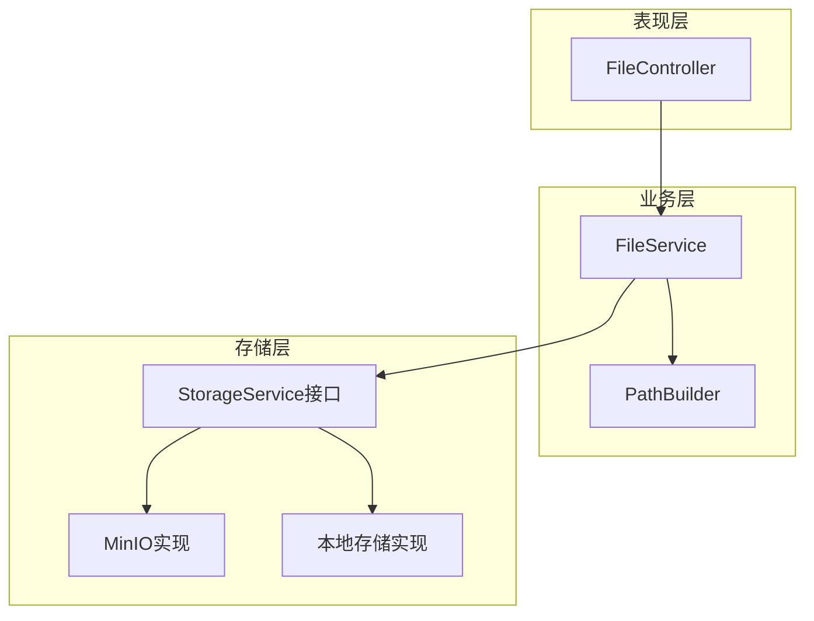
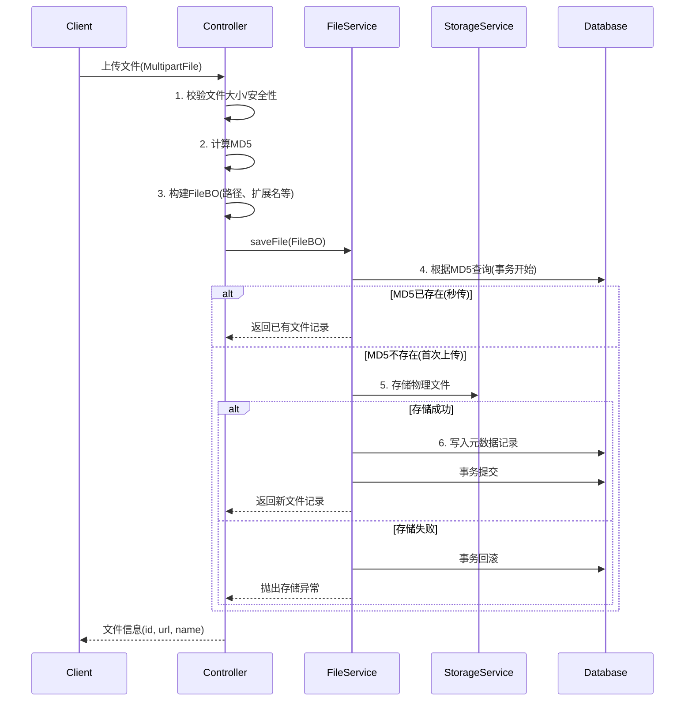
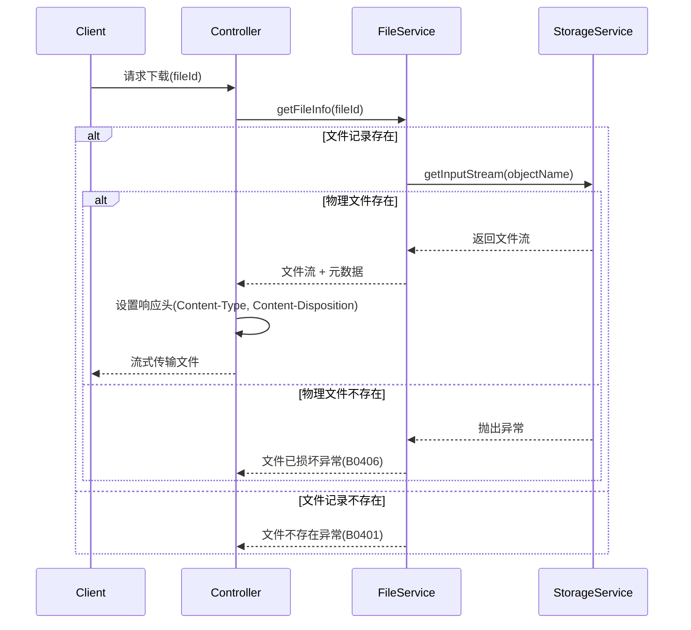
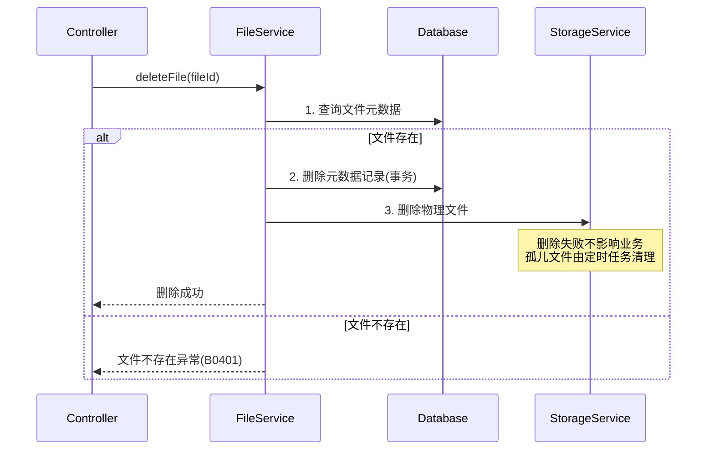

# 文件管理模块 - 后端实现设计

## 1. 文档概述

### 1.1 文档目的

本文档描述文件管理模块的后端实现方案，包括分层架构设计、存储策略模式、MD5 去重机制、核心业务流程、事务边界与异步任务设计等。

### 1.2 相关文档

- **需求规格**：[需求规格.md](./需求规格.md)
- **API 接口**：[API接口.md](./API接口.md)
- **数据库设计**：[03-数据库设计.md](../../../02-系统架构/03-数据库设计.md)
- **测试用例**：[测试用例.md](./测试用例.md)
- **任务管理**：[任务管理/后端实现.md](../任务管理/后端实现.md)（导出任务依赖文件存储服务）

## 2. 架构设计

### 2.1 模块分层架构

文件管理模块采用三层架构，元数据层负责业务逻辑编排，存储层通过策略模式实现后端可切换：



**设计考量**：

- 元数据与物理存储分离，元数据存数据库，物理文件存对象存储
- 策略模式允许运行时切换存储后端，便于开发/生产环境适配
- PathBuilder 统一命名规范，避免路径逻辑散落各处

### 2.2 核心组件职责

| 组件 | 职责描述 | 关键能力 |
|------|---------|---------|
| FileController | HTTP 请求处理 | 参数校验、文件流读取、MD5 计算、响应封装 |
| FileService | 业务逻辑编排 | MD5 去重判断、元数据 CRUD、事务控制 |
| PathBuilder | 存储路径生成 | 日期目录、MD5 命名、扩展名提取 |
| StorageService | 物理存储抽象 | 上传、下载、删除、存在性检查 |

### 2.3 存储策略模式

#### 设计原理

存储后端差异大（本地文件系统 vs 对象存储 vs 云存储），但上层业务逻辑一致。通过策略模式：

1. 定义统一的存储接口契约
2. 不同存储后端实现相同接口
3. 运行时根据配置注入具体实现

#### 存储接口契约

| 方法 | 入参 | 出参 | 说明 |
|------|------|------|------|
| upload | 文件流、对象名 | 访问 URL | 上传文件到存储后端（幂等：相同 objectName 覆盖写入） |
| download | 对象名 | 文件流 | 获取文件内容流（流式传输，不加载到内存） |
| delete | 对象名 | 是否成功 | 删除物理文件（不存在时视为成功） |
| exists | 对象名 | 是否存在 | 检查文件是否存在 |
| getUrl | 对象名 | 访问 URL | 获取文件访问地址 |

#### 已实现的存储策略

| 配置值 | 存储后端 | 特点 | 适用场景 |
|--------|---------|------|---------|
| `minio` | MinIO 对象存储 | S3 兼容、支持分布式 | 生产环境、需要高可用 |
| `local` | 本地文件系统 | 简单直接、无依赖 | 开发环境、单机部署 |

**扩展点**：新增存储后端只需实现 StorageService 接口，并在策略工厂中注册。

## 3. 内部领域对象

> API 层 DTO（Query/Form/VO）定义详见 [API接口.md](./API接口.md)

### 3.1 FileBO（文件业务对象）

Service 层内部使用，封装文件上传过程中的中间状态，生命周期仅限于单次请求：

| 字段 | 类型 | 说明 |
|------|------|------|
| file | 临时文件 | 上传的原始文件（处理完成后删除） |
| name | 字符串 | 原始文件名（用户上传时的名称） |
| objectName | 字符串 | 存储对象名（含路径，如 `upload/20250119/abc123.jpg`） |
| extension | 字符串 | 文件扩展名（小写，如 `jpg`） |
| md5 | 字符串 | MD5 哈希值（32 位十六进制） |
| path | 字符串 | 存储路径（相对路径，用于数据库记录） |
| size | 长整型 | 文件大小（字节） |
| url | 字符串 | 访问 URL（完整地址） |

## 4. 核心业务逻辑

### 4.1 关键流程

#### 文件上传流程



**关键决策点**：

1. **先物理存储，再写元数据**：物理存储在事务内执行。存储失败时事务回滚，不产生孤儿元数据记录。存储成功但 DB 写入失败时产生孤儿物理文件，由定时任务清理（见 §9.2）
2. **MD5 计算在 Controller 层**：避免 Service 层依赖文件流，关注点分离
3. **秒传判断在写入前**：减少无效存储操作，命中已有记录时直接返回

#### 文件下载流程



#### 文件删除流程



**设计说明**：先删DB元数据（事务内），再删物理文件（事务外，best-effort）。物理文件删除失败仅记录日志，产生的孤儿文件由定时任务清理。当前版本不实现引用计数机制，文件删除由调用方（业务模块）在删除前自行检查引用关系。

### 4.2 MD5 去重机制

#### 处理流程

| 阶段 | 操作 | 说明 |
|------|------|------|
| 1. 计算 | 读取文件流计算 MD5 | 使用流式计算，避免内存溢出 |
| 2. 查询 | `SELECT ... WHERE md5 = ?` | 命中唯一索引，毫秒级响应 |
| 3. 命中 | 返回已有记录 | 秒传，不存储物理文件 |
| 4. 未命中 | 存储文件 + 写入记录 | 首次上传完整流程 |

#### 并发上传同一文件处理

当多个请求同时上传相同文件（MD5 相同）时：

| 场景 | 处理策略 | 说明 |
|------|---------|------|
| 并发查询 | 乐观处理 | 多个请求同时查询 MD5，可能都未命中 |
| 并发写入 | 唯一索引约束 | 数据库 MD5 唯一索引保证只有一条记录 |
| 唯一键冲突 | 事务内捕获异常重查 | 冲突时在同一事务内重新查询返回已有记录 |
| 物理文件 | 幂等覆盖 | 相同对象名重复上传，存储服务幂等处理 |

**并发安全保证**：即使在 READ COMMITTED 隔离级别下，两个事务可能同时通过 SELECT 检查，但唯一索引是最终兜底。冲突时的补偿路径（捕获异常 → 重查）在同一事务内完成，确保返回一致的结果。

#### 边界情况

| 场景 | 处理方式 |
|------|---------|
| 0 字节文件 | 正常计算 MD5，允许上传 |
| 超大文件（>100MB） | Controller 层拦截，抛出文件过大异常（B0402） |
| MD5 碰撞 | 理论存在但概率极低（约 2^-128），不做特殊处理 |

### 4.3 图片处理逻辑

> 当前版本文件管理模块不做图片专用处理（格式校验、宽高解析、缩略图生成），统一按普通文件处理。以下为后续演进规划。

| 处理项 | 触发条件 | 处理内容 |
|--------|---------|---------|
| 格式校验 | 扩展名为图片类型 | 验证实际内容与扩展名是否匹配（防止伪装） |
| 宽高解析 | 图片文件 | 读取图片元数据获取宽高，存入数据库 |
| 缩略图生成 | 配置开启时 | 生成指定尺寸的缩略图，独立存储 |

**处理顺序**（规划）：格式校验 → 宽高解析 → 物理存储 → 缩略图生成（异步可选）

### 4.4 核心业务规则

| 规则 | 校验条件 | 处理方式 | 说明 |
|------|---------|---------|------|
| 文件大小限制 | size ≤ 100MB | 超限抛出异常（B0402） | 可通过 `file.maxSize` 配置调整 |
| 文件类型控制 | — | 文件管理模块不做白名单限制 | 由业务模块在调用前控制允许的类型 |
| 文件名安全 | 不含 `../`、`\0`、特殊字符 | 过滤或拒绝 | 防止路径遍历攻击 |
| MD5 唯一性 | 数据库唯一索引 | 秒传/去重 | 核心去重逻辑 |
| 路径规范化 | 标准化后在基础路径内 | 非法路径拒绝 | 防止目录穿越 |
| 文件类型嗅探 | 扩展名 + MIME 内容嗅探 | 不匹配时拒绝 | 防止恶意文件伪装 |

**关于文件类型白名单**：需求规格明确"文件管理模块本身不做限制"，类型限制由各业务模块自行控制（如数据集模块限制图片类型、算法模块限制模型文件类型）。文件管理模块仅做安全层面的内容嗅探校验。

### 4.5 事务边界

| 操作 | 事务级别 | 事务范围 | 说明 |
|------|---------|---------|------|
| 文件查询 | 只读事务 | 单次查询 | 优化数据库连接 |
| 文件上传 | 读写事务 | MD5 查询 → 物理存储 → 元数据写入 | 存储失败回滚，不产生孤儿元数据 |
| 文件删除 | 读写事务 | 元数据删除 | 物理删除在事务提交后（允许孤儿文件由定时任务清理） |
| 批量操作 | 读写事务 | 整批元数据操作 | 原子性保证 |

**设计考量**：

- **上传事务包含物理存储**：确保存储失败时元数据不入库。虽然物理存储是外部 I/O 可能导致事务时间较长，但文件上传本身是低频操作（相对于查询），且单文件存储耗时通常在秒级，事务持有时间可接受
- **删除事务不含物理删除**：先删元数据（事务内），再删物理文件（事务外）。元数据删除后物理删除失败产生的孤儿文件由定时任务兜底
- **唯一键冲突补偿**：上传事务内捕获唯一索引异常后，在同一事务中重查并返回已有记录，整个补偿路径不跳出事务

### 4.6 幂等性与并发控制

| 场景 | 问题 | 解决方案 |
|------|------|---------|
| 并发上传同 MD5 文件 | 重复写入元数据 | 唯一索引约束 + 冲突捕获重查 |
| 物理文件重复上传 | 存储空间浪费 | 存储服务幂等覆盖（相同 objectName 覆盖写入） |
| 并发删除同一文件 | 双重删除异常 | 删除前查询，记录不存在则返回错误（由调用方决定是否幂等处理） |
| 删除后立即查询 | 查到已删除记录 | 元数据硬删除，查询走 DB 无延迟 |

## 5. 数据访问与数据依赖

> 表结构定义详见 [数据库设计.md](../../../02-系统架构/03-数据库设计.md)

### 5.1 依赖表清单

| 表名 | 关联方式 | 说明 |
|------|---------|------|
| sys_file | 主表 | 文件元数据存储 |

**WPX 格式转换说明**：WPX 转换为可选扩展功能，当前版本暂不在核心架构中设计。如需实现，可通过新增 sys_wpx_file 表和独立的 WpxService 处理，不影响核心文件管理流程。

### 5.2 关键字段约束

| 字段 | 约束 | 业务含义 |
|------|------|---------|
| md5 | 唯一索引 | 实现文件去重，并发安全兜底 |
| path | 非空 | 物理文件定位，丢失则无法下载 |
| name | 非空 | 原始文件名，用于下载时的文件名 |
| size | 非空 | 文件大小，用于传输进度计算 |

### 5.3 核心查询方法

| 查询方法 | 查询条件 | 索引依赖 | 说明 |
|---------|---------|---------|------|
| 根据 ID 查询 | id = ? | 主键索引 | 下载、删除时使用 |
| 根据 MD5 查询 | md5 = ? | md5 唯一索引 | 去重判断，必须走索引 |
| 分页列表 | 关键字模糊 + 分页 | name、type 字段 | 后台管理列表 |
| 批量查询 | id IN (...) | 主键索引 | 批量下载、打包导出 |

### 5.4 查询优化要点

| 场景 | 优化措施 |
|------|---------|
| MD5 去重查询 | 必须命中唯一索引，禁止全表扫描 |
| 大文件下载 | 流式读取（InputStream），不加载到内存 |
| 批量操作 | 控制批次大小（建议 100 条/批） |
| 分页查询 | 按创建时间倒序，利用索引避免全表排序 |

## 6. 外部服务集成

### 6.1 MinIO 对象存储

#### 服务调用配置

| 配置项 | 说明 | 默认值 |
|--------|------|--------|
| endpoint | 服务地址 | http://localhost:9000 |
| access-key | 访问密钥 | admin |
| secret-key | 凭据密钥 | - |
| bucket | 存储桶名称 | dehaze |

#### 调用参数

| 参数 | 值 | 说明 |
|------|------|------|
| 连接超时 | 10s | 建立连接的超时时间 |
| 读取超时 | 60s | 大文件读取需要较长时间 |
| 写入超时 | 60s | 大文件上传需要较长时间 |
| 重试次数 | 1 | 失败后重试一次 |

### 6.2 降级策略

| 场景 | 检测方式 | 降级行为 | 用户提示 |
|------|---------|---------|---------|
| MinIO 连接失败 | 连接超时 | 抛出异常，记录日志 | 文件服务暂时不可用 |
| 存储桶不存在 | 启动时检查 | 自动创建 | 无 |
| 上传失败 | 异常捕获 | 重试 1 次后抛出 | 文件上传失败，请重试 |
| 下载文件不存在 | 404 响应 | 抛出业务异常（B0406） | 文件不存在或已被删除 |
| 存储空间不足 | 写入失败 | 抛出异常，告警 | 系统存储空间不足 |

### 6.3 文件存储路径规则

| 路径类型 | 格式 | 示例 | 说明 |
|---------|------|------|------|
| 上传路径 | `upload/{yyyyMMdd}/{md5}.{ext}` | `upload/20250119/abc123.jpg` | 按日期分目录，MD5 命名 |
| 缩略图路径 | `thumbnail/{originPath}` | `thumbnail/upload/20250119/abc123.jpg` | 与原图路径对应 |
| 导出路径 | `exports/{taskId}.{ext}` | `exports/550e8400-xxxx.xlsx` | 导出任务结果文件（通用导入导出框架使用） |
| 导入错误报告 | `imports/{taskId}_errors.{ext}` | `imports/550e8400-xxxx_errors.xlsx` | 导入失败行的错误明细报告 |
| 导入上传文件（临时） | `temp/imports/{taskId}/{originalName}` | `temp/imports/550e8400-xxxx/users.xlsx` | 异步导入时暂存的上传文件，任务完成后清理 |
| 临时路径 | `temp/{uuid}` | `temp/550e8400-e29b...` | 处理中的临时文件 |

**命名规则设计考量**：

- 日期目录：便于按时间清理、统计
- MD5 命名：保证唯一性，支持去重（相同 MD5 覆盖写入，天然幂等）
- 扩展名保留：便于识别文件类型、设置 Content-Type

## 7. 缓存设计

### 7.1 设计决策

当前版本文件管理模块**不引入缓存层**，理由如下：

| 因素 | 分析 |
|------|------|
| MD5 查询性能 | 唯一索引查询 P99 < 100ms，满足去重需求 |
| 文件元数据查询 | 主键查询 P99 < 50ms，满足下载需求 |
| 访问频率 | 文件上传/下载为低频操作（相对于业务查询接口），无缓存穿透风险 |
| 一致性要求 | 文件元数据变更少，但需要强一致（删除后立即不可访问），缓存引入不一致窗口 |
| 复杂度收益比 | 引入缓存增加失效管理复杂度，但性能提升有限 |

**后续演进**：当文件数量达到百万级别或 MD5 查询成为瓶颈时（P99 > 500ms），可引入 Redis 缓存层：
- 缓存 Key：`file:md5:{md5}` → 文件 ID
- 缓存 Key：`file:meta:{fileId}` → 文件元数据
- 更新策略：Write-Through（写入时同步更新缓存）
- 失效策略：删除时主动清除

## 8. 安全设计

> 权限标识详见 [API接口.md](./API接口.md)

### 8.1 数据权限

文件管理模块本身不实现权限控制，权限由业务模块在调用前完成鉴权：

| 业务模块 | 权限控制点 |
|---------|-----------|
| 数据集管理 | 数据集级别权限控制文件访问 |
| 任务管理 | 任务归属用户控制结果文件访问 |

### 8.2 安全防护

| 防护项 | 威胁 | 实现方式 |
|--------|------|---------|
| 路径遍历防护 | 目录穿越攻击 | 路径标准化后校验是否在基础路径内 |
| 文件名校验 | 恶意文件名注入 | 正则过滤 `../`、`\0`、特殊字符 |
| 文件类型校验 | 恶意文件上传 | 扩展名 + 内容嗅探（Magic Bytes）双重校验 |
| 文件大小限制 | 资源耗尽攻击 | 单文件 ≤ 100MB，可配置 |
| MD5 完整性 | 文件篡改检测 | 上传时计算存储，下载时可验证 |
| 传输加密 | 数据泄露 | HTTPS（部署层控制） |
| 下载路径安全 | 内部路径泄露 | objectName 参数校验：只允许合法路径格式，禁止 `..` 等特殊序列 |

## 9. 异步任务设计（规划）

> 当前版本文件管理模块**未实现**事件驱动和定时任务。以下为后续演进规划，当前孤儿文件和临时文件需人工清理。

### 9.1 事件驱动机制（规划）

通过领域事件解耦文件服务与业务模块：

| 事件类型 | 触发时机 | 事件内容 | 消费者处理 |
|---------|---------|---------|-----------|
| FileCreatedEvent | 文件上传成功（事务提交后） | 文件 ID、MD5、大小、类型 | 业务模块更新统计信息 |
| FileDeletedEvent | 文件删除成功（事务提交后） | 文件 ID、关联的 objectName | 业务模块清理关联引用 |

**关键约定**：
- 事件发布必须在事务提交成功后执行，避免事务回滚但事件已发出
- 事件处理失败不影响主流程（fire-and-forget），失败仅记录日志
- 后续使用进程内 EventBus，如需跨服务事件可替换为 RabbitMQ

### 9.2 定时任务（规划）

| 任务 | Cron 表达式 | 说明 |
|------|------------|------|
| 孤儿文件清理 | `0 0 4 * * ?` | 每天凌晨 4 点，清理有物理文件但无元数据记录的孤儿文件 |
| 临时文件清理 | `0 0 */6 * * ?` | 每 6 小时，清理 `temp/` 目录下超过 24 小时的临时文件 |

#### 孤儿文件清理

孤儿文件产生场景：上传时物理存储成功但 DB 写入失败（事务回滚），或删除时元数据已删但物理删除失败。

```
清理流程：
  1. 列举存储桶中 upload/ 目录下超过 48 小时的文件
  2. 逐个检查 objectName 是否在 sys_file 表中存在记录
  3. 无记录则删除物理文件
  4. 分批处理，每批 100 个，避免长时间阻塞
```

**安全机制**：48 小时延迟确保不会误删刚上传但事务尚未提交的文件。

#### 临时文件清理

```
清理流程：
  1. 列举存储桶中 temp/ 目录下所有文件
  2. 删除创建时间超过 24 小时的文件
  3. 分批处理，每批 100 个
```

## 10. 性能目标

### 10.1 性能指标

| 接口 | 目标 P99 | 约束条件 | 说明 |
|------|---------|---------|------|
| 文件上传 | < 3s | 文件 ≤ 10MB | 流式上传，主要耗时在网络传输和物理存储 |
| 文件下载 | < 1s | 首字节时间 | 流式传输，总时间取决于文件大小 |
| MD5 查询 | < 100ms | — | 必须走唯一索引 |
| 文件列表 | < 500ms | 分页 ≤ 100 条 | 分页查询 |
| 秒传判断 | < 200ms | — | MD5 查询 + 响应封装 |
| 去重校验 | < 100ms | — | 前端预检接口 |

### 10.2 优化措施

| 优化项 | 实现方式 | 收益 |
|--------|---------|------|
| MD5 唯一索引 | 数据库索引 | 去重查询毫秒级 |
| 流式处理 | InputStream 传输 | 避免大文件内存溢出 |
| 临时文件清理 | 上传完成后立即删除本地临时文件 | 释放应用服务器磁盘空间 |
| 前端秒传 | 前端预计算 MD5 + 校验接口 | 命中时无需上传，节省带宽 |

## 11. 配置项

| 配置项 | 说明 | 默认值 | 是否必填 |
|--------|------|--------|---------|
| `file.type` | 存储类型 | minio | 是 |
| `file.baseUrl` | 文件访问基础 URL | http://localhost:8989/api/v1/files/download | 是 |
| `file.maxSize` | 单文件最大大小 | 100MB | 否 |
| **MinIO 配置** | | | |
| `file.minio.endpoint` | MinIO 服务地址 | http://localhost:9000 | 使用 MinIO 时必填 |
| `file.minio.access-key` | MinIO 访问密钥 | admin | 使用 MinIO 时必填 |
| `file.minio.secret-key` | MinIO 凭据密钥 | - | 使用 MinIO 时必填 |
| `file.minio.bucket-name` | MinIO 存储桶名称 | dehaze | 使用 MinIO 时必填 |
| **本地存储配置** | | | |
| `file.local.uploadPath` | 本地存储根目录 | /data/upload | 使用本地存储时必填 |
| **缩略图配置** | | | |
| `file.thumbnail.enabled` | 是否生成缩略图 | false | 否 |
| `file.thumbnail.size` | 缩略图尺寸 | 200x200 | 否 |
| **定时任务配置** | | | |
| `file.cleanup.orphan.cron` | 孤儿文件清理 Cron | `0 0 4 * * ?` | 否 |
| `file.cleanup.orphan.threshold.hours` | 孤儿文件判定阈值（小时） | 48 | 否 |
| `file.cleanup.temp.cron` | 临时文件清理 Cron | `0 0 */6 * * ?` | 否 |
| `file.cleanup.temp.threshold.hours` | 临时文件过期阈值（小时） | 24 | 否 |
