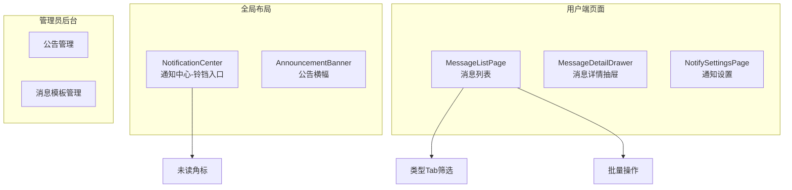
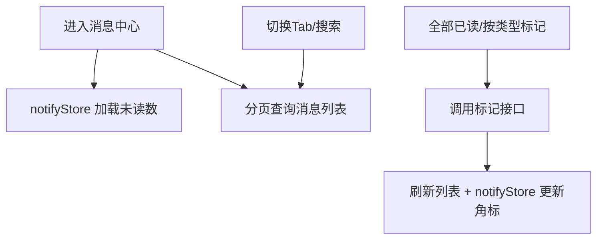
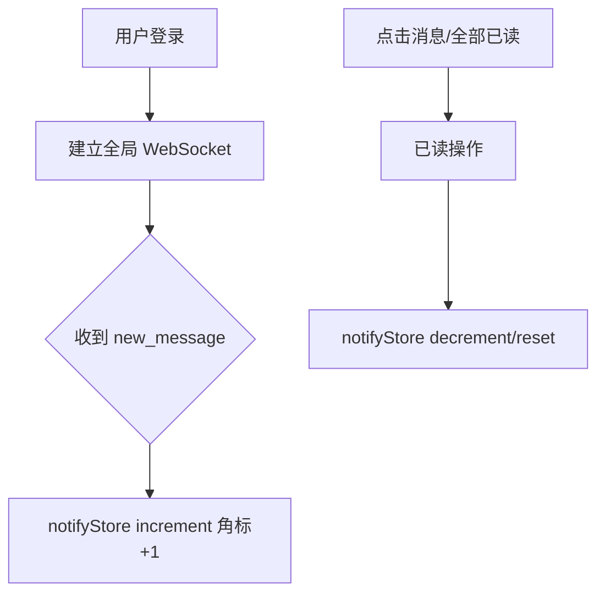

# 消息通知模块 - 前端实现设计

## 1. 文档概述

本文档描述消息通知模块的前端实现方案（dehaze-front-vue），聚焦组件架构、状态管理、路由设计、数据流与关键交互决策。消息通知为系统的统一消息分发与触达中心，前端承担消息中心查阅、未读角标实时更新、通知偏好设置与公告/模板管理。业务需求见[需求规格.md](./需求规格.md)。

---

## 2. 组件树设计

| 组件 | 职责 | 复用性 |
|------|------|--------|
| NotificationCenter | 全局导航栏铃铛入口，展示未读数角标，点击进入消息中心 | 全局布局组件 |
| AnnouncementBanner | 重要系统公告横幅展示（置顶公告） | 全局布局组件 |
| MessageListPage | 消息列表：类型 Tab 筛选、搜索、全部已读/按类型标记已读、单条/批量删除 | 用户端页面 |
| MessageDetailDrawer | 消息详情抽屉：完整内容展示 + 显式标记已读 | 用户端组件 |
| NotifySettingsPage | 通知偏好设置：按类型 APP 推送开关、免打扰时段、按模块开关 | 用户端页面 |
| 公告管理 | 管理员公告 CRUD、定时发送、定向推送、发送范围联动 | 管理员页面 |
| 消息模板管理 | 管理员模板编辑、渠道配置、变量说明 | 管理员页面 |

> 消息中心为单页面组件，未读角标由全局导航栏 + 通知 Store 承载；消息列表分页数据在页面组件内局部管理。

---

## 3. 状态管理

**Store 模块划分**

| Store | 职责 |
|------|------|
| notifyStore | 全局未读消息数（导航栏角标），登出时重置 |
| websocketStore | WebSocket 连接状态与实时消息事件分发，支持断线重连与离线增量拉取 |

**核心状态**

| Store | 状态字段 | 说明 |
|------|---------|------|
| notifyStore | unreadCount | 全局未读消息数，驱动导航栏铃铛角标 |
| notifyStore | loaded | 未读数是否已加载（避免重复请求） |
| websocketStore | connectionStatus | 连接状态（connecting/connected/disconnected） |
| websocketStore | realtimeMessages | 实时消息事件队列，分发至对应 Store |

**核心操作**

| Store | 方法 | 说明 |
|------|------|------|
| notifyStore | fetchUnreadCount | 请求未读数并写入角标 |
| notifyStore | increment / decrement | 角标 +1（WebSocket 新消息）/ -1（已读操作） |
| notifyStore | reset | 登出时重置角标 |
| websocketStore | connect / disconnect | 建立/断开 WebSocket 连接 |
| websocketStore | onMessage | 接收 new_message 事件并触发 notifyStore.increment |

> 消息列表分页数据在页面组件内局部管理，不入 Store；notifyStore 仅维护全局角标状态。

---

## 4. 路由设计

| 路径 | 组件 | 权限 | 守卫 |
|------|------|------|------|
| `notify/message` | MessageListPage | 登录用户 | 登录守卫（静态路由） |
| `notify/settings` | NotifySettingsPage | 登录用户 | 登录守卫（静态路由） |
| `notify/announcement` | AnnouncementManage | 管理员 | 登录守卫 + 动态菜单加载 |
| `notify/template` | TemplateManage | 管理员 | 登录守卫 + 动态菜单加载 |

> 消息中心与通知设置为登录用户可用（受保护路由，未登录跳转登录页）；公告管理/消息模板为管理员后台页面，无独立列表权限标识（菜单级权限由后端菜单配置控制）。

---

## 5. 数据流

### 5.1 消息中心

### 5.2 实时角标更新

### 5.3 消息详情已读

进入详情 -> 加载消息详情 -> 显式调用标记已读 -> notifyStore decrement（详情接口本身不自动标记已读，由前端显式调用）

### 5.4 缓存与更新策略

| 策略 | 说明 |
|------|------|
| 未读数缓存 | notifyStore 内存缓存 unreadCount，WebSocket 推送 increment、已读操作 decrement 实时更新 |
| 消息列表 | 页面组件局部管理分页数据，不缓存；切换 Tab/搜索重新查询 |
| 离线补偿 | 客户端记录 last_read_time，重连后按时间范围增量拉取未读消息 |
| 角标一致性 | WebSocket 在线实时推送；离线时轮询/重连增量拉取保证最终一致 |

### 5.5 模块间数据交互

| 交互方向 | 数据 | 说明 |
|---------|------|------|
| 全局 WebSocket -> 消息中心 | new_message 事件 | 实时更新未读角标 |
| 业务模块 -> 消息中心 | 站内信记录 | 各业务模块触发消息生成（后端） |

---

## 6. 交互设计决策

| 决策点 | 实现方式 | 理由 |
|--------|---------|------|
| WebSocket 实时推送 | 在线用户经 WebSocket 推送 new_message 事件，实时更新角标；小程序受限时降级为定时轮询（30s） | 站内信需实时触达在线用户；小程序 WebSocket 连接数受限，轮询作为兜底保证角标最终一致 |
| 铃铛红点未读提醒 | notifyStore 缓存未读数，导航栏铃铛展示角标；未读数为 0 时角标隐藏 | 未读角标是用户感知新消息的主要入口，全局可见且实时更新 |
| 公告横幅展示 | 重要系统公告以横幅形式置顶展示，支持关闭 | 系统级公告需全用户可见，横幅比站内信更显眼；支持关闭避免持续打扰 |
| 消息分类筛选 | 8 个 Tab（全部/6 类/未读），切换即查询；未读 Tab 带数量角标 | 消息类型多样，分类筛选帮助用户快速定位关注的消息 |
| 全部已读/按类型标记 | 未读数为 0 时按钮禁用；按类型标记带类型参数，角标按已读数量 decrement | 避免无未读时误操作；按类型标记满足精细化已读管理需求 |
| 删除防误操作 | 单条/批量删除均弹确认弹窗；软删除（仅从用户视图移除，记录保留） | 删除不可逆（用户视角），需防误操作；软删除保留记录可追溯 |
| 消息类型标识 | 类型色条 + 图标标签区分（announcement/business/member/alert/critical_alert/inbox） | 视觉快速区分消息类型与紧急程度，严重告警需突出展示 |
| 公告操作确认 | 发送/取消/删除均弹确认框；发送范围联动参数表单 | 公告影响面大（可全体用户），操作需谨慎确认 |
| 公告状态流转 | 草稿->待发送->已发送/已取消；编辑/发送仅草稿与待发送可用，取消仅待发送可用 | 状态机约束防止误操作（如已发送公告不可编辑） |
| 通知设置即时生效 | 修改 APP 推送开关/免打扰时段/模块开关后即时保存 | 用户期望设置立即生效，无需额外"保存"步骤 |
| 离线消息补偿 | 重连后增量拉取断连期间未读消息（记录本地 last_read_time，按时间范围分页拉取） | 避免离线期间消息丢失；增量拉取比全量拉取更高效 |

---

## 7. 公共组件使用

| 公共组件 | 使用方式 |
|---------|---------|
| 铃铛组件（NotificationCenter） | 全局布局嵌入，展示未读角标，点击跳转消息中心 |
| 列表组件 | 消息列表分页展示，支持类型 Tab 与搜索 |
| 抽屉组件（MessageDetailDrawer） | 消息详情侧滑展示 |
| 分页组件 | 消息列表分页查询 |
