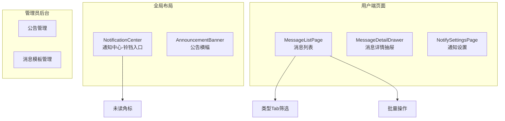
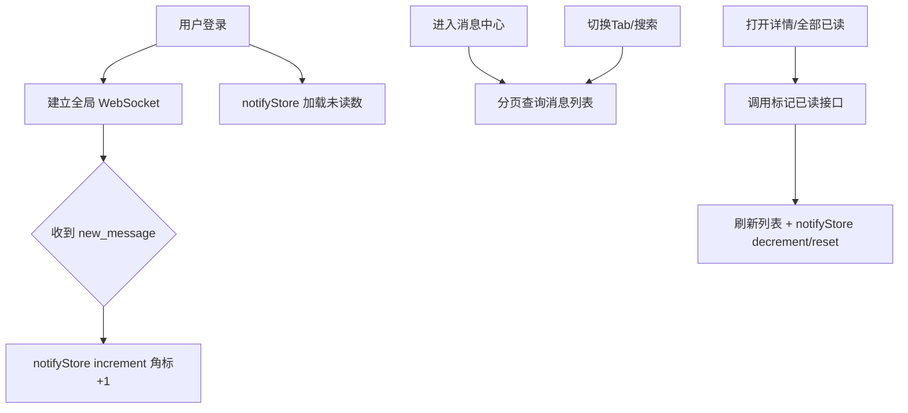

# 消息通知模块 - 前端实现设计

## 1. 文档概述

本文档描述消息通知模块的前端实现方案，聚焦组件架构、状态管理、路由设计、数据流与关键交互决策。前端承担消息中心查阅、未读角标实时更新、通知偏好设置与公告/模板管理。

---

## 2. 组件树设计

| 组件 | 职责 |
|------|------|
| NotificationCenter | 全局导航栏铃铛入口，展示未读数角标，点击进入消息中心 |
| AnnouncementBanner | 重要系统公告横幅展示（置顶公告） |
| MessageListPage | 消息列表：类型 Tab 筛选、搜索、全部已读/按类型标记已读、单条/批量删除 |
| MessageDetailDrawer | 消息详情抽屉：完整内容展示 + 显式标记已读 |
| NotifySettingsPage | 通知偏好设置：按类型 APP 推送开关、免打扰时段、按模块开关 |
| 公告管理 | 管理员公告 CRUD、定时发送、发送范围联动 |
| 消息模板管理 | 管理员模板编辑、渠道配置、变量说明 |

---

## 3. 状态管理

未读角标为全局状态，由 Store 承载；消息列表分页数据在页面组件内局部管理，不入 Store。

| Store | 职责 | 核心状态 | 核心操作 |
|------|------|---------|---------|
| notifyStore | 全局未读消息数（导航栏角标） | unreadCount（未读数）、loaded（是否已加载，避免重复请求） | fetchUnreadCount（拉取未读数）、increment / decrement（新消息 +1 / 已读 -1）、reset（登出重置） |
| websocketStore | WebSocket 连接状态与实时事件分发，支持断线重连 | connectionStatus（connecting/connected/disconnected）、realtimeMessages（实时事件队列） | connect / disconnect、onMessage（接收 `new_message` 事件并触发 notifyStore.increment） |

---

## 4. 路由设计

| 路径 | 组件 | 权限 | 守卫 |
|------|------|------|------|
| `notify/message` | MessageListPage | 登录用户 | 登录守卫（静态路由） |
| `notify/settings` | NotifySettingsPage | 登录用户 | 登录守卫（静态路由） |
| `notify/announcement` | AnnouncementManage | 管理员 | 登录守卫 + 动态菜单加载 |
| `notify/template` | TemplateManage | 管理员 | 登录守卫 + 动态菜单加载 |

消息中心与通知设置为登录用户可用；公告管理/消息模板为管理员后台页面，无独立列表权限标识，菜单级权限由后端菜单配置控制。

---

## 5. 数据流

- 消息详情不会自动置为已读，由前端在打开详情后显式调用标记已读接口，再递减角标。
- 消息列表不做前端缓存，切换 Tab / 搜索均重新查询；未读数由 notifyStore 内存持有，经实时事件与已读操作增量维护。
- 断线期间的消息通过本地 `last_read_time` 在重连后按时间范围增量拉取，保证角标与列表最终一致。

---

## 6. 交互设计决策

| 决策点 | 实现方式 | 理由 |
|--------|---------|------|
| 实时推送与降级 | 在线用户经 WebSocket 接收 `new_message` 更新角标；小程序实时通道受限时降级为定时轮询（30s） | 小程序 WebSocket 连接数受限，轮询作为兜底保证角标最终一致 |
| 角标状态提升至全局 | notifyStore 持有未读数，导航栏铃铛消费；未读数为 0 时隐藏角标 | 角标是感知新消息的主要入口，需跨页面全局可见且实时更新 |
| 离线增量拉取 | 记录本地 `last_read_time`，重连后按时间范围分页拉取未读消息 | 增量拉取比全量刷新高效，且避免离线期间消息遗漏 |
| 公告横幅独立于消息列表 | 重要公告以全局横幅置顶展示，支持关闭 | 系统级公告需全用户可见，横幅比站内信更显眼；可关闭避免持续打扰 |
| 全部已读按钮态由角标驱动 | 未读数为 0 时按钮禁用；按类型标记后按已读数量 decrement | 避免无未读时的空操作请求 |
| 通知设置即时保存 | 修改推送开关/免打扰时段/模块开关后立即提交，无独立保存按钮 | 用户期望设置立即生效 |
| 消息类型视觉编码 | 类型色条 + 图标标签区分六类消息，严重告警强化展示 | 消息类型多样，需快速区分类型与紧急程度 |
