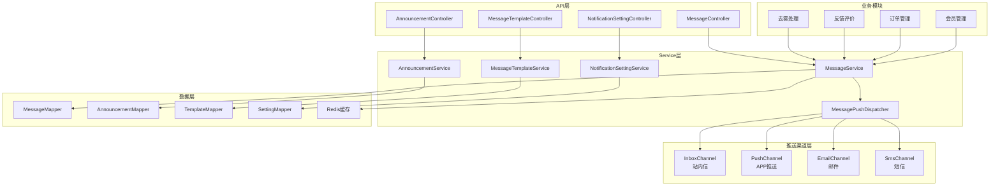
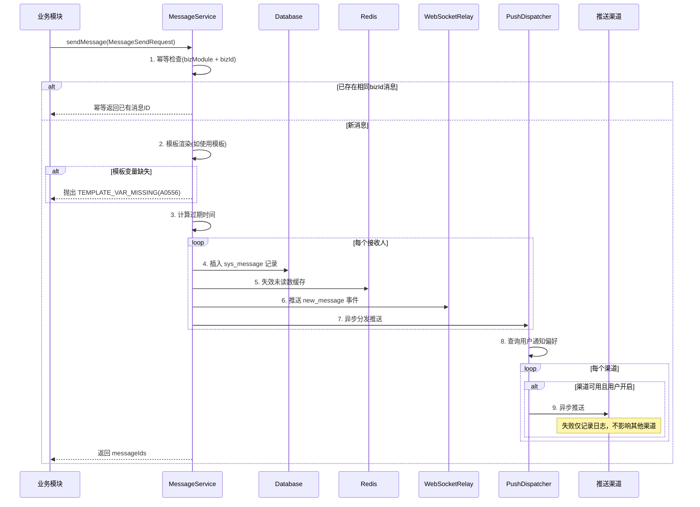
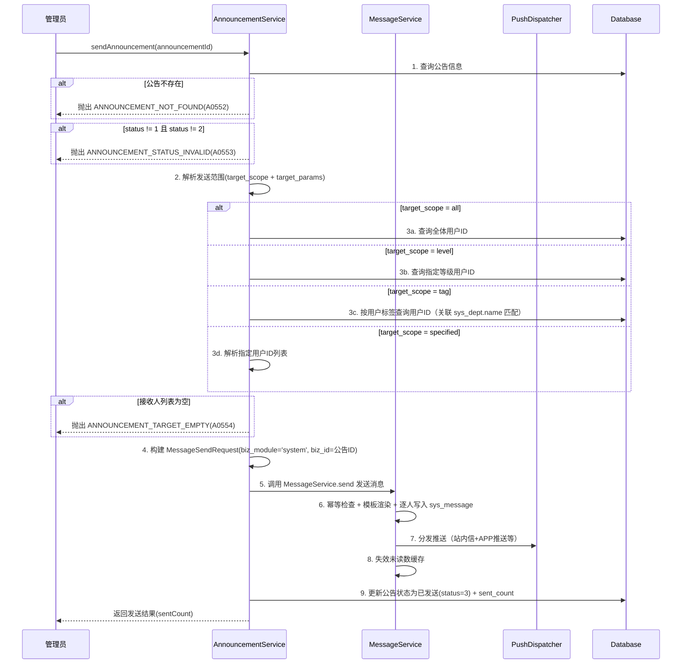

# 消息通知模块 - 后端实现设计

## 1. 文档概述

### 1.1 文档目的

本文档描述消息通知模块的后端实现方案，包括架构设计、核心业务逻辑、多渠道推送、缓存设计、定时任务等。

### 1.2 相关文档

- **需求规格**：[需求规格.md](./需求规格.md)
- **API 接口**：[API接口.md](./API接口.md)
- **数据库设计**：[03-数据库设计.md](../../../02-系统架构/03-数据库设计.md)
- **测试用例**：[测试用例.md](./测试用例.md)

## 2. 架构设计

### 2.1 模块分层架构

采用**事件驱动 + 策略模式**实现消息生成与推送的解耦。核心思想：

- **统一入口**：所有业务模块通过 `MessageService` 发送消息，不直接操作消息表
- **渠道分离**：站内信、APP推送、邮件、短信各为独立渠道，互不影响
- **异步推送**：APP推送、邮件、短信通过消息队列异步执行，不阻塞业务流程



### 2.2 核心组件职责

| 组件 | 职责描述 | 关键能力 |
|------|---------|---------|
| MessageService | 消息管理入口 | 消息生成、列表查询、已读管理、删除、搜索 |
| AnnouncementService | 公告管理 | 公告CRUD、发送、取消、批量投递 |
| MessageTemplateService | 模板管理 | 模板查询、编辑、变量渲染 |
| NotificationSettingService | 通知偏好 | 设置查询、更新、推送决策 |
| MessagePushDispatcher | 推送分发器 | 根据消息优先级和用户偏好决定推送渠道 |
| InboxChannel | 站内信渠道 | 写入 sys_message 表，保证必达 |
| PushChannel | APP推送渠道 | 调用推送平台API发送推送 |
| EmailChannel | 邮件渠道 | 调用邮件服务发送邮件 |
| SmsChannel | 短信渠道 | 调用短信服务发送短信 |

### 2.3 核心接口契约

#### MessagePushChannel 推送渠道接口

| 方法 | 入参 | 出参 | 说明 |
|------|------|------|------|
| getChannelType | 无 | String | 返回渠道类型（inbox/push/email/sms） |
| send | message, recipientId | void | 执行推送，失败时记录日志，不影响其他渠道 |
| isAvailable | 无 | boolean | 检查渠道是否可用 |

> 推送渠道接口不返回发送结果，失败时仅记录错误日志并降级处理（站内信已保证必达）。

### 2.4 消息发送校验规则

`MessageService.send` 在生成消息前执行以下校验，三端一致：

| 校验项 | 条件 | 失败错误码 |
|--------|------|-----------|
| 幂等检查 | `bizModule` + `bizId` 均非空时，查询是否已存在相同消息 | 幂等返回已有 messageIds |
| 模板存在性 | `templateCode` 非空时，查询模板 | `MESSAGE_TEMPLATE_NOT_FOUND`(A0555) |
| 模板启用状态 | 模板 `status == 0` | `TEMPLATE_DISABLED`(A0558) |
| 模板变量完整性 | 使用模板时，扫描 `title_template` 和 `content_template` 中的 `{varName}` 占位符，variables 须包含所有占位符变量 | `TEMPLATE_VAR_MISSING`(A0556) |
| 标题必填 | 未使用模板时，`title` 不能为空 | `PARAM_ERROR`(A0400) |
| 正文必填 | 未使用模板时，`content` 不能为空 | `PARAM_ERROR`(A0400) |

> 未使用模板时（`templateCode` 为空），`title` 和 `content` 必填，为空抛参数错误；使用模板时由模板渲染生成标题和正文，无需调用方传入。
>
> 幂等机制：三端 send 方法中先查询 `biz_module + biz_id` 是否已存在消息（提前失败），DB 层 `uk_biz_dedup` UNIQUE INDEX 作为并发兜底，避免 select-then-insert 竞态产生重复消息。

## 3. 数据传输对象

> API 层 DTO 定义详见 [API接口.md](./API接口.md)

### 3.1 内部对象

#### MessageSendRequest（内部发送请求）

| 字段 | 类型 | 说明 |
|------|------|------|
| templateCode | String | 模板编码（可选，使用模板时传入） |
| type | String | 消息类型 |
| title | String | 消息标题（不使用模板时必填） |
| content | String | 消息正文（不使用模板时必填） |
| recipientIds | List&lt;Long&gt; | 接收人ID列表 |
| bizModule | String | 业务模块 |
| bizId | String | 业务ID（用于幂等去重） |
| priority | Integer | 优先级 |
| jumpUrl | String | 跳转链接 |
| variables | Map&lt;String, String&gt; | 模板变量 |
| extra | Map&lt;String, Object&gt; | 扩展数据 |

#### MessageEntity（消息实体）

| 字段 | 类型 | 说明 |
|------|------|------|
| id | Long | 主键 |
| type | String | 消息类型 |
| title | String | 标题 |
| content | String | 正文 |
| senderType | Integer | 发送者类型 |
| recipientId | Long | 接收人ID |
| bizModule | String | 业务模块 |
| bizId | String | 业务ID |
| priority | Integer | 优先级 |
| jumpUrl | String | 跳转链接 |
| extra | Map<String, Object> | 扩展数据（JSON，通过 JacksonTypeHandler 自动转换） |
| readStatus | Integer | 已读状态 |
| readTime | LocalDateTime | 已读时间 |
| deleted | Integer | 删除标识 |
| expiresAt | LocalDateTime | 过期时间 |
| createTime | LocalDateTime | 创建时间 |

## 4. 核心业务逻辑

### 4.1 消息发送流程



**关键决策点**：
1. **幂等检查前置**：通过 `biz_module` + `biz_id` 唯一性检查，防止重复生成消息
2. **站内信同步写入**：站内信记录同步写入数据库，保证消息必达
3. **WebSocket 实时推送**：消息生成后立即通过 WebSocket 推送 `new_message` 事件，前端收到后更新角标
4. **其他渠道异步推送**：APP推送/邮件/短信通过 `@Async`/线程池异步执行，不阻塞业务流程
5. **推送失败降级**：非站内信渠道失败时不影响消息记录，仅记录日志

### 4.2 消息列表查询

#### 查询逻辑

```
查询用户消息列表
    ↓
WHERE recipient_id = #{userId}
  AND deleted = 0
  [AND type = #{type}]           -- 可选类型筛选
  [AND read_status = #{readStatus}]  -- 可选已读筛选
    ↓
ORDER BY read_status ASC, create_time DESC
    ↓
（未读消息在前，已读消息在后，各自按时间倒序）
```

#### 索引利用

| 查询条件 | 使用索引 |
|---------|---------|
| recipient_id + deleted + create_time | `idx_recipient_list` 复合索引 |
| recipient_id + read_status | `idx_recipient_read` 复合索引 |

### 4.3 已读管理

#### 标记单条已读

```
UPDATE sys_message
SET read_status = 1, read_time = NOW(), update_by = #{userId}
WHERE id = #{id}
  AND recipient_id = #{userId}
  AND read_status = 0
  AND deleted = 0
```

- 通过 `recipient_id` 校验确保数据隔离
- `read_status = 0` 条件保证幂等（已读消息不重复更新）

#### 全部标记已读

```
UPDATE sys_message
SET read_status = 1, read_time = NOW(), update_by = #{userId}
WHERE recipient_id = #{userId}
  AND read_status = 0
  AND deleted = 0
  [AND type = #{type}]   -- 可选按类型标记
```

- 标记后同步更新 Redis 未读数缓存

### 4.4 公告发送流程



**发送规则**：
- 复用 `MessageService.send` 发送消息，获得推送分发 + 未读缓存失效 + 幂等去重能力
- `biz_module = "system"`，`biz_id = 公告ID`（纯数字字符串，如 `"123"`，非 `"announcement_123"` 格式）
- 校验公告状态：仅 `status=1`（草稿）或 `status=2`（待发送）可发送，否则抛 `ANNOUNCEMENT_STATUS_INVALID`
- 校验接收人非空：解析后的接收人列表为空时抛 `ANNOUNCEMENT_TARGET_EMPTY`
- 优先级根据重要级别设置：重要(importance=2) → priority=3，普通(importance=1) → priority=2

### 4.5 模板渲染

#### 变量替换逻辑

```
输入：templateCode = "member_level_up", variables = {"levelName": "VIP2", "benefitList": "..."}
    ↓
查询模板：SELECT * FROM sys_message_template WHERE code = #{code} AND status = 1
    ↓
模板不存在 → 抛出 MESSAGE_TEMPLATE_NOT_FOUND(A0555)
模板已禁用 → 抛出 TEMPLATE_DISABLED(A0558)
    ↓
变量替换：title_template 中的 {levelName} → "VIP2"
         content_template 中的 {levelName} → "VIP2", {benefitList} → "..."
    ↓
变量缺失检查：扫描 title_template 和 content_template 中的 {varName} 占位符，variables 须包含所有占位符变量；缺失变量在渲染时替换为空字符串
    ↓
输出：渲染后的 title 和 content
```

#### 变量替换实现

使用正则表达式匹配 `{varName}` 并替换：

```java
// Java 示例
private String renderTemplate(String template, Map<String, String> variables) {
    Pattern pattern = Pattern.compile("\\{(\\w+)\\}");
    Matcher matcher = pattern.matcher(template);
    StringBuffer sb = new StringBuffer();
    while (matcher.find()) {
        String varName = matcher.group(1);
        String value = variables.getOrDefault(varName, "");
        matcher.appendReplacement(sb, Matcher.quoteReplacement(value));
    }
    matcher.appendTail(sb);
    return sb.toString();
}
```

### 4.6 推送决策逻辑

```
消息生成后 → MessagePushDispatcher 决定推送渠道
    ↓
1. 站内信：始终发送（必达渠道）
    ↓
2. 查询用户通知偏好（sys_notification_setting）
    ↓
3. APP推送决策：
   ├─ push_enabled == 0 → 不推送
   ├─ 消息类型在 type_channels 中 push == false → 不推送
   ├─ biz_module 在 module_switches 中 == false → 不推送
   ├─ dnd_enabled == 1 且当前时间在免打扰时段 → 延迟推送
   └─ 以上均通过 → 发送APP推送
    ↓
4. 邮件决策：
   ├─ 消息类型 != alert 且 != critical_alert → 不发邮件
   ├─ 接收人不是管理员 → 不发邮件
   └─ 以上均通过 → 发送邮件
    ↓
5. 短信决策：
   ├─ 消息类型 != critical_alert → 不发短信
   ├─ 接收人不是管理员 → 不发短信
   └─ 以上均通过 → 发送短信
```

#### 免打扰时段判断

```
免打扰开始时间：dnd_start（如 22:00:00）
免打扰结束时间：dnd_end（如 08:00:00）
当前时间：now

if dnd_start < dnd_end:
    # 同一天内（如 14:00 - 18:00）
    in_dnd = dnd_start <= now <= dnd_end
else:
    # 跨天（如 22:00 - 次日08:00）
    in_dnd = now >= dnd_start OR now <= dnd_end

if in_dnd:
    # 严重告警不受免打扰限制
    if priority != 4:
        延迟推送至免打扰结束后
```

### 4.7 事务管理

| 操作类型 | 事务级别 | 说明 |
|---------|---------|------|
| 查询操作 | 只读事务 | 优化数据库性能 |
| 消息生成 | 读写事务 | 消息记录写入需事务保证 |
| 标记已读 | 读写事务 | 单表更新 |
| 公告发送 | 读写事务 | 公告状态更新 + 批量消息插入 |
| 推送执行 | 无事务 | 异步执行，失败不影响消息记录 |

## 5. 数据访问层设计

### 5.1 依赖表清单

| 表名 | 关联方式 | 说明 |
|------|---------|------|
| sys_message | 主表 | 消息记录表 |
| sys_message_template | 读取 | 模板渲染时查询 |
| sys_notification_setting | 读取 | 推送决策时查询用户偏好 |
| sys_announcement | 主表 | 公告管理表 |
| sys_user | 外键关联 | 查询接收人信息（用户名、邮箱、手机号） |
| sys_member | 外键关联 | 按会员等级发送公告时查询 |

### 5.2 核心查询方法

| 查询方法 | 查询条件 | 索引依赖 | 说明 |
|---------|---------|---------|------|
| 用户消息列表 | recipient_id + deleted + create_time | idx_recipient_list | 分页查询 |
| 未读消息数 | recipient_id + read_status=0 | idx_recipient_read | 高频查询，走缓存 |
| 幂等检查 | biz_module + biz_id | uk_biz_dedup (UNIQUE INDEX) | 防重复生成，DB 层并发兜底 |
| 过期消息查询 | expires_at < NOW() | idx_expires_at | 定时清理使用 |
| 公告列表 | status + create_time | idx_status | 管理后台分页 |

## 6. 缓存设计

### 6.1 缓存 Key 规范

| 缓存对象 | Key 格式 | TTL | 用途 |
|---------|---------|------|------|
| 未读消息数 | `msg:unread:{userId}` | 1 小时（count=0 时 5 分钟） | 高频查询，角标显示 |
| 通知偏好 | `msg:setting:{userId}` | 30 分钟 | 推送决策时读取 |
| 消息模板 | `msg:template:{code}` | 1 小时 | 模板渲染时读取 |
| 幂等检查 | `msg:dedup:{bizModule}:{bizId}` | 24 小时 | 防重复生成 |

> 未读数缓存三端一致实现：Java（`MessageServiceImpl.getUnreadCount`）、Python（`MessageService.get_unread_count`）、Go（`MessageService.GetUnreadCount`）均通过 `msg:unread:{userId}` 缓存未读数，count=0 时使用短 TTL（5 分钟）避免空值缓存占用过久，count>0 时使用 1 小时 TTL。

### 6.2 缓存更新规则

| 操作 | 缓存行为 |
|------|---------|
| 生成消息 | 未读数 +1 |
| 标记已读 | 未读数 -1 |
| 全部已读 | 未读数置 0 |
| 删除未读消息 | 未读数 -1 |
| 更新通知偏好 | 删除偏好缓存 |
| 编辑模板 | 删除模板缓存 |

> **通知偏好更新合并策略**：三端统一采用 2 层深合并（与 Python `_deep_merge_preferences` 一致）：以旧 preferences 为基础，对 form 中传入的每个 key，若新旧值均为 dict 则对内层 dict 做浅合并（保留旧内层 key，新内层 key 覆盖），否则直接替换。避免整体替换导致未传入的字段丢失。

### 6.3 缓存一致性策略

| 场景 | 问题 | 解决方案 |
|------|------|---------|
| 未读数缓存与DB不一致 | 角标显示错误 | Write-Through：更新DB后立即更新缓存；每小时全量刷新 |
| 缓存雪崩 | 大量缓存同时失效 | TTL 随机化（±10%） |
| 缓存穿透 | 查询不存在的用户 | 空值缓存 5 分钟 |

**未读数查询流程**：
```
查询缓存 msg:unread:{userId}
├─ 命中 → 直接返回
└─ 未命中 → 查询数据库 COUNT(*)
           ├─ 存在 → 写入缓存，返回
           └─ 为0 → 写入空值缓存(5min)，返回0
```

## 7. 推送渠道集成

### 7.1 站内信渠道（InboxChannel）

| 项 | 说明 |
|----|------|
| 实现方式 | 同步写入 sys_message 表 |
| 可用性 | 100%（数据库可用即可用） |
| 失败处理 | 数据库写入失败时事务回滚，消息不生成 |
| 特点 | 必达渠道，所有消息均通过此渠道 |

### 7.2 APP推送渠道（PushChannel）

| 项 | 说明 |
|----|------|
| 实现方式 | 调用推送平台API（极光/友盟/FCM/APNs） |
| 异步执行 | 通过消息队列异步发送，不阻塞业务 |
| 超时设置 | 单次推送超时 5s |
| 失败重试 | 失败重试 2 次，仍失败则放弃（站内信已保证必达） |
| 降级策略 | 推送平台不可用时仅保留站内信 |

### 7.3 邮件渠道（EmailChannel）

| 项 | 说明 |
|----|------|
| 实现方式 | 调用邮件服务API（阿里云邮件推送/SendCloud） |
| 异步执行 | 通过消息队列异步发送 |
| 超时设置 | 单次发送超时 10s |
| 失败重试 | 失败重试 3 次 |
| 适用场景 | 仅告警通知和严重告警，发送给管理员 |

### 7.4 短信渠道（SmsChannel）

| 项 | 说明 |
|----|------|
| 实现方式 | 调用短信服务API（阿里云短信/腾讯云短信） |
| 异步执行 | 通过消息队列异步发送 |
| 超时设置 | 单次发送超时 10s |
| 失败重试 | 失败重试 3 次 |
| 适用场景 | 仅严重告警，发送给管理员 |

### 7.5 渠道降级策略

| 场景 | 检测方式 | 降级行为 |
|------|---------|---------|
| APP推送平台不可用 | 连接超时/错误 | 仅站内信，记录告警日志 |
| 邮件服务不可用 | 连接超时/错误 | 仅站内信，记录告警日志 |
| 短信服务不可用 | 连接超时/错误 | 仅站内信，记录告警日志 |
| 所有外部渠道不可用 | 全部渠道isAvailable=false | 仅站内信，触发系统告警 |

### 7.6 通知偏好默认值

用户首次访问通知设置时自动初始化默认偏好，三端统一：

| 消息类型 | push（APP推送） | email | sms |
|---------|:---:|:---:|:---:|
| announcement（系统公告） | true | false | false |
| business（业务通知） | false | false | false |
| member（会员通知） | true | false | false |
| alert（告警通知） | true | false | false |
| critical_alert（严重告警） | true | false | false |

| 全局设置项 | 默认值 |
|-----------|--------|
| pushEnabled（APP推送总开关） | true |
| dndEnabled（免打扰开关） | false |
| dndStart（免打扰开始时间） | 22:00:00 |
| dndEnd（免打扰结束时间） | 08:00:00 |

| 模块开关 | 默认值 |
|---------|--------|
| prediction（处理任务完成通知） | true |
| feedback（反馈处理进度通知） | true |
| announcement（系统公告推送） | true |

> 站内信作为基本渠道不可关闭，所有消息均生成站内信记录，不体现在偏好设置中。email/sms 渠道默认关闭，仅告警类消息在推送决策时根据消息类型和接收人角色决定是否发送。

## 8. WebSocket 实时推送设计

### 8.1 连接管理

| 项 | 说明 |
|----|------|
| 协议 | WebSocket（Java 端使用 STOMP/SockJS，Python/Go 端使用原生 WebSocket） |
| 鉴权 | 连接时携带 Session ID（URL query 参数 `sessionId` 或 Cookie `X-Session-Id`），服务端查询 Redis 验证用户身份 |
| 心跳间隔 | 30 秒（客户端发送 ping，服务端响应 pong） |
| 最大空闲时间 | 90 秒（3 次心跳未响应则断开） |
| 连接存储 | Redis sorted set 存储在线用户 + 本地连接 Map 维护用户连接 |
| 跨实例广播 | Redis Pub/Sub 频道 `dehaze:ws:broadcast`，三端一致 |

> 三端鉴权方式统一为 Session ID：Java 端通过 `HandshakeInterceptor` 在 STOMP 握手阶段读取 URL query 或 Cookie 中的 sessionId 并查询 Redis 验证；Python/Go 端在 WebSocket 升级时读取 sessionId 并查询 Redis 验证。

### 8.2 消息推送流程

```
MessageService.send 生成消息后
    ↓
通过 WebSocketMessageRelay/Manager.send_personal 发布到 Redis Pub/Sub 频道
    ↓
各实例订阅频道，投递给本地用户的 WebSocket 连接
    ├─ 用户在线 → 前端收到 new_message 事件 → 更新角标 + 显示提示
    └─ 用户离线 → 跳过实时推送（用户下次打开系统时查询未读数）
```

> WebSocket 推送与 `MessagePushDispatcher` 相互独立：WebSocket 推送用于在线用户的实时 UI 更新（角标/提示），不受用户通知偏好影响；Dispatcher 负责 APP 推送/邮件/短信等外部渠道，受通知偏好控制。

### 8.3 WebSocket 消息格式

三端一致推送 `new_message` 事件，前端收到后更新未读角标：

```json
{
  "event": "new_message",
  "data": {
    "id": 1,
    "type": "member",
    "title": "恭喜您升级至 VIP2",
    "priority": 2,
    "createTime": "2026-07-15 14:30:25"
  }
}
```

> Java 端通过 STOMP 队列 `/queue/message` 投递（任务相关事件走 `/queue/task`）；Python/Go 端通过原生 WebSocket 文本帧投递。三端消息体格式一致。

### 8.4 多端连接处理

| 场景 | 处理方式 |
|------|---------|
| 同用户多设备登录 | 每个设备独立 WebSocket 连接，消息推送到所有连接 |
| 用户切换网络 | 旧连接超时断开，新连接建立后推送积压消息 |
| 服务端集群部署 | 通过 Redis Pub/Sub 广播到目标用户所在节点 |

## 9. 定时任务设计

### 9.1 定时任务清单

| 任务 | Cron 表达式 | 说明 |
|------|------------|------|
| 过期消息清理 | `0 0 4 * * ?` | 每天凌晨 4 点清理过期消息 |
| 定时公告发送 | `0 * * * * ?` | 每分钟扫描待发送公告 |
| 免打扰延迟推送 | `0 * * * * ?` | 每分钟检查免打扰到期的延迟推送 |
| 未读数缓存刷新 | `0 0 * * * ?` | 每小时全量刷新未读数缓存 |

### 9.2 过期消息清理流程

```
定时任务触发（每天凌晨4点）
    ↓
查询过期消息：SELECT id FROM sys_message WHERE expires_at < NOW() LIMIT 500
    ↓
分批物理删除：DELETE FROM sys_message WHERE id IN (...)
    ↓
循环直到无过期消息
    ↓
清理完成，记录日志
```

**清理策略**：
- 分批处理，每批 500 条，避免长时间锁表
- 物理删除（非软删除），释放存储空间
- 清理所有 `expires_at < NOW()` 的消息，无论是否已读、无论是否软删除（`deleted=0` 或 `deleted=1` 均清理）
- 三端实现一致：Java（MessageCleanupJob）、Python（message_repository.delete_expired）、Go（MessageService.CleanupExpired）

### 9.3 定时公告发送

```
定时任务触发（每分钟）
    ↓
查询待发送公告：SELECT * FROM sys_announcement WHERE status = 2 AND send_time <= NOW()
    ↓
逐条处理：
    ├─ 调用 AnnouncementService.sendAnnouncement(id)
    ├─ 发送成功 → status 变为 3（已发送）
    └─ 发送失败 → 记录异常日志，下次扫描重试
```

### 9.4 免打扰延迟推送

```
定时任务触发（每分钟）
    ↓
扫描延迟推送队列：Redis 中 msg:delayed_push:* 的 key
    ↓
逐个 key 处理：
├─ 提取 userId，查询用户通知设置
├─ 仍在免打扰时段 → 跳过，等待下次检查
└─ 免打扰时段已结束 → 循环 leftPop 弹出 messageId
    ↓
    根据 messageId 查询消息
    ↓
    调用 MessagePushDispatcher.dispatch(message, userId) 实际推送
    ↓
    推送完成，从延迟队列移除
```

**实现要点**：
- 延迟推送队列存储在 Redis List 中，key 格式 `msg:delayed_push:{userId}`，元素为 messageId
- 免打扰时段判断支持跨天（如 22:00-次日08:00）
- 弹出 messageId 后调用 `MessagePushDispatcher.dispatch` 执行实际推送，而非仅记录日志
- 推送失败时记录错误日志，不回滚 List（消息已弹出，避免重复推送）

### 9.5 未读数缓存全量刷新

三端（Java/Python/Go）均已实现，CRON 为 `0 0 * * * ?`（每小时整点）。采用方案 A（全量刷新）而非方案 B（纯失效策略），理由：
- 纯失效策略在用户无主动操作时缓存不会重建，未读数可能长期过期
- 全量刷新确保所有活跃用户的未读数缓存始终有效，避免角标显示不准确
- 每小时执行一次开销可控（查询 + Redis SET，无复杂计算）

- **扫描条件**：`sys_user` 中 `status=1 AND deleted=0` 的所有活跃用户
- **处理逻辑**：
  1. 查询所有活跃用户 ID 列表
  2. 逐个用户查询未读消息数（`sys_message` WHERE `recipient_id=? AND read_status=0 AND deleted=0`）
  3. 写入 Redis 缓存 `msg:unread:{userId}`，count=0 时 TTL=5 分钟，count>0 时 TTL=1 小时
- **容错**：单用户查询/写入失败记录日志并跳过，不影响其他用户
- **参考实现**：Java `MessageServiceImpl.refreshUnreadCountCache`、Python `MessageService.refresh_unread_count_cache`、Go `MessageService.RefreshUnreadCountCache`

## 10. 安全设计

> 权限标识详见 [API接口.md](./API接口.md)

### 10.1 数据权限

| 操作 | 权限规则 |
|------|---------|
| 查看消息 | 仅能查看自己的消息 |
| 标记已读 | 仅能操作自己的消息 |
| 删除消息 | 仅能删除自己的消息 |
| 通知设置 | 仅能查看/修改自己的设置 |
| 公告管理 | 需对应权限标识（add/edit/delete/send/cancel） |
| 模板编辑 | 需 `notify:template:edit` 权限标识 |

### 10.2 公告与模板管理权限

三端均实现公告管理和模板编辑的权限校验，在路由/Controller层通过权限注解拦截：

| 权限标识 | 控制操作 | Java | Python | Go |
|---------|---------|------|--------|-----|
| `notify:announcement:add` | 创建公告 | `@PreAuthorize` | `@require_permission` | `middleware.Permission` |
| `notify:announcement:edit` | 编辑公告 | `@PreAuthorize` | `@require_permission` | `middleware.Permission` |
| `notify:announcement:delete` | 删除公告 | `@PreAuthorize` | `@require_permission` | `middleware.Permission` |
| `notify:announcement:send` | 发送公告 | `@PreAuthorize` | `@require_permission` | `middleware.Permission` |
| `notify:announcement:cancel` | 取消公告 | `@PreAuthorize` | `@require_permission` | `middleware.Permission` |
| `notify:template:edit` | 编辑模板 | `@PreAuthorize` | `@require_permission` | `middleware.Permission` |

### 10.3 安全防护

| 防护项 | 实现方式 |
|--------|---------|
| 数据隔离 | 所有用户端查询强制带 `recipient_id = #{currentUserId}` |
| 内部接口鉴权 | `/messages/send` 接口通过 API Key 鉴权 |
| 消息防篡改 | 已生成的消息记录不可修改，仅 read_status 和 deleted 可更新 |
| 内容过滤 | 公告内容做敏感词过滤 |
| 推送频率限制 | 单用户单消息类型推送频率限制，防止推送轰炸 |

## 11. 三端实现说明

消息通知模块需在 dehaze-java、dehaze-go、dehaze-python 三个后端中实现。以下是各端的实现要点：

### 11.1 Java 端

| 组件 | 实现类 | 说明 |
|------|--------|------|
| Controller | MessageController | 用户端消息接口 |
| Controller | AnnouncementController | 公告管理接口 |
| Controller | MessageTemplateController | 模板管理接口 |
| Controller | NotificationSettingController | 通知设置接口 |
| Service | MessageServiceImpl | 消息核心逻辑（含 WebSocket 推送调用） |
| Service | AnnouncementServiceImpl | 公告管理逻辑 |
| Service | MessageTemplateServiceImpl | 模板渲染逻辑 |
| Service | NotificationSettingServiceImpl | 通知偏好逻辑 |
| Dispatcher | MessagePushDispatcher | 推送分发器（`@Async` 异步执行） |
| Channel | InboxChannel / PushChannel / EmailChannel / SmsChannel | 推送渠道实现 |
| Mapper | MessageMapper / AnnouncementMapper / MessageTemplateMapper / NotificationSettingMapper | MyBatis-Plus Mapper |
| WebSocket | WebSocketConfig / WebSocketMessageRelay | STOMP 配置 + Redis Pub/Sub 跨实例消息中继 |
| Job | MessageCleanupJob / AnnouncementScheduleJob | 定时任务 |

**依赖注入**：所有 Service 实现使用 `@RequiredArgsConstructor` 构造器注入。
**异步推送**：`MessagePushDispatcher.dispatch` 通过 `@Async("pushTaskExecutor")` 异步执行，不阻塞主流程。

### 11.2 Go 端

| 组件 | 实现文件 | 说明 |
|------|---------|------|
| Handler | message_handler.go | HTTP 接口处理 |
| Service | message_service.go | 业务逻辑（含 WebSocket 推送调用） |
| Repository | message_repository.go | 数据访问 |
| WebSocket | pkg/websocket/handler.go、manager.go | WebSocket 连接管理 + Redis Pub/Sub 跨实例投递 |
| Job | message_cleanup.go / announcement_scheduler.go | 定时任务 |

### 11.3 Python 端

| 组件 | 实现文件 | 说明 |
|------|---------|------|
| Router | message_router.py | FastAPI 路由 |
| Service | message_service.py | 业务逻辑（含 WebSocket 推送调用） |
| Repository | message_repository.py | SQLAlchemy 数据访问 |
| WebSocket | app/service/websocket_service.py | 分布式连接管理 + Redis Pub/Sub 跨实例投递 |
| Job | message_cleanup.py | APScheduler 定时任务 |

## 12. 配置项

| 配置项 | 说明 | 默认值 |
|--------|------|--------|
| `message.retention.days` | 消息保留天数 | 30 |
| `message.alert.retention.days` | 告警消息保留天数 | 7 |
| `message.critical.retention.days` | 严重告警保留天数 | 90 |
| `message.cleanup.batch-size` | 清理批次大小 | 500 |
| `message.cleanup.cron` | 清理 Cron 表达式 | `0 0 4 * * ?` |
| `message.announcement.cron` | 公告定时发送 Cron | `0 * * * * ?` |
| `message.push.retry-count` | APP推送失败重试次数 | 2 |
| `message.push.timeout` | APP推送超时（秒） | 5 |
| `message.email.retry-count` | 邮件失败重试次数 | 3 |
| `message.email.timeout` | 邮件超时（秒） | 10 |
| `message.sms.retry-count` | 短信失败重试次数 | 3 |
| `message.sms.timeout` | 短信超时（秒） | 10 |
| `message.websocket.heartbeat` | WebSocket 心跳间隔（秒） | 30 |
| `message.websocket.max-idle` | WebSocket 最大空闲时间（秒） | 90 |
| `message.cache.unread.ttl` | 未读数缓存 TTL（秒） | 3600 |
| `message.cache.setting.ttl` | 通知偏好缓存 TTL（秒） | 1800 |
| `message.cache.template.ttl` | 模板缓存 TTL（秒） | 3600 |
| `message.batch-insert.size` | 批量插入批次大小 | 500 |
