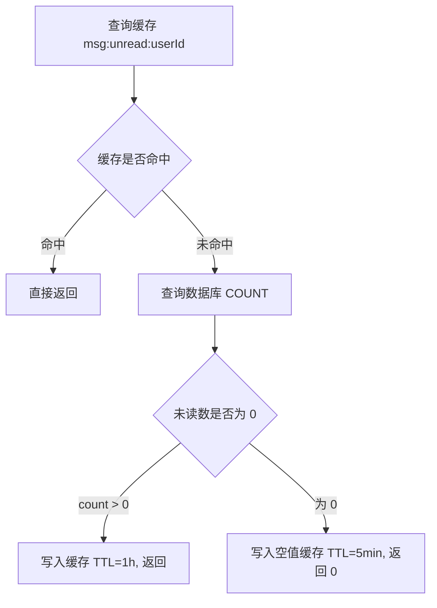

# 消息通知模块 - 后端实现设计

## 1. 文档概述

本文档描述消息通知模块的后端实现方案，包括架构设计、核心业务逻辑（发送幂等/模板渲染/推送决策）、缓存设计、定时任务与渠道接入现状。该模块在 dehaze-java、dehaze-python、dehaze-go 三端实现，逻辑保持一致。

- **API 接口规范**：参见 [API接口.md](./API接口.md)
- **需求规格**：参见 [需求规格.md](./需求规格.md)
- **数据库设计**：参见 [02-系统架构/03-数据库设计.md](../../../02-系统架构/03-数据库设计.md)
- **Schema 文件**：`config/sql/schema/sys_message.sql`、`sys_announcement.sql`、`sys_message_template.sql`、`sys_notification_setting.sql`

---

## 2. 架构设计

### 2.1 模块分层架构

| 层级 | 组件（Java） | 职责 |
|------|------|------|
| Controller | MessageController / AnnouncementController / MessageTemplateController / NotificationSettingController | 用户端消息接口、公告管理、模板管理、通知设置 |
| Service | MessageServiceImpl / AnnouncementServiceImpl / MessageTemplateServiceImpl / NotificationSettingServiceImpl | 消息核心逻辑（含 WebSocket 推送）、公告、模板、通知偏好 |
| 推送分发 | MessagePushDispatcher | 异步遍历可用渠道分发（`@Async("pushTaskExecutor")`） |
| 渠道层 | InboxChannel / PushChannel / EmailChannel / SmsChannel | 站内信（可用）、APP推送（决策完整、发送未接入）、邮件（未接入）、短信（未接入） |
| WebSocket | WebSocketMessageRelay + Redis Pub/Sub | 在线用户实时推送 new_message 事件 |
| Job | MessageCleanupJob / AnnouncementScheduleJob / DelayedPushJob / UnreadCountRefreshJob | 定时任务 |

> **说明**：早期设计稿中的"事件驱动消息队列（RabbitMQ 解耦推送）"**未实现**——消息生成同步落库，推送分发通过 Spring `@Async` 线程池异步执行（非消息队列）。

### 2.2 推送渠道接口（MessagePushChannel）

| 方法 | 入参 | 出参 | 说明 |
|------|------|------|------|
| getChannelType | 无 | String | 返回渠道类型（inbox/push/email/sms） |
| send | message, recipientId | void | 执行推送，失败时记录日志，不影响其他渠道 |
| isAvailable | 无 | boolean | 检查渠道是否可用 |

> 推送渠道接口不返回发送结果，失败时仅记录错误日志并降级（站内信已保证必达）。

---

## 3. 核心业务逻辑

### 3.1 消息发送流程（send）

```
业务模块调用 send（title/content 或 templateCode+variables + recipientIds）
    ↓
1. 幂等检查：bizModule+bizId 均非空时，按接收人查询已存在消息（提前失败）
   - 已存在 → 幂等返回已有 messageIds（跳过该接收人）
   - 未传入幂等键 → 不防重，允许重复生成
    ↓
2. 模板渲染（templateCode 非空时）：
   - 模板不存在 → MESSAGE_TEMPLATE_NOT_FOUND
   - 模板禁用（status=0）→ TEMPLATE_DISABLED
   - 变量校验：扫描 title_template/content_template 的 {varName} 占位符，
     variables 须包含所有占位符 → 缺失抛 TEMPLATE_VAR_MISSING
   - 渲染：正则匹配 {变量} 替换，缺失变量替换为空字符串
   - 未使用模板：title/content 必填，为空抛参数错误
    ↓
3. 计算过期时间（calcExpiresAt）：alert→7天、critical_alert→90天、其余→30天
    ↓
4. 逐接收人写入 sys_message（单条事务，每接收人独立提交）：
   - 记录：type/title/content/senderType=1/recipientId/bizModule/bizId/priority(默认2)/jumpUrl/extra/readStatus=0/expiresAt
    ↓
5. 每写入一条：
   - 失效未读数缓存（msg:unread:{userId}）
   - WebSocket 推送 new_message 事件（在线用户实时角标更新）
   - 异步分发外部渠道（MessagePushDispatcher.dispatch）
```

**幂等机制**：DB 层 (biz_module, biz_id, recipient_id) 唯一约束作为并发兜底；MySQL 唯一索引对 NULL 不生效——仅当 bizModule 与 bizId 均非空时才防重。

### 3.2 消息列表查询（getPage/search）

- 查询范围：当前登录用户（recipient_id = 当前用户）且未软删除（deleted=0）的消息
- 筛选维度：getPage 支持按消息类型、已读状态筛选；search 支持按标题/正文模糊搜索（仅当前用户消息）
- 增量拉取：支持按 create_time 时间范围过滤，供 WebSocket 重连后离线补偿使用（前端传 last_read_time 拉取增量未读消息）
- 排序规则：未读消息（read_status=0）优先置顶，同已读状态下按发送时间（create_time）倒序

### 3.3 已读管理

| 操作 | 实现 |
|------|------|
| 标记单条已读 | UPDATE read_status=1, read_time=NOW WHERE id=? AND recipient_id=? AND read_status=0（幂等，0 行影响静默成功）；影响 >0 时失效未读缓存 |
| 全部标记已读 | 按 recipient_id + 可选 type 更新全部未读；影响 >0 时删除未读缓存；返回影响条数 |
| 消息详情 | 按 id + recipient_id 查询（越权视为不存在抛 MESSAGE_NOT_FOUND）；**仅查询，不自动标记已读**（前端显式调用标记接口） |

### 3.4 消息删除

- 按 ID 列表 + 当前用户删除（**软删除** deleted=1，记录保留）
- 删除前统计未读删除数，>0 时删除未读缓存
- 到期物理删除由 MessageCleanupJob 执行（见 §5）

### 3.5 公告管理

| 操作 | 实现要点 |
|------|---------|
| 创建 | 定时发送时间必须为未来时间（否则参数错误）；定时发送（send_time>NOW）置 status=2，否则置 status=1（草稿）；sent_count=0 |
| 编辑 | 仅 status∈{1,2} 可编辑（已发送/已取消抛 ANNOUNCEMENT_STATUS_INVALID） |
| 发送 | 校验 status∈{1,2} → 解析接收人（all 全部用户 / level 按等级 / specified 指定用户）→ 接收人为空抛 ANNOUNCEMENT_TARGET_EMPTY → 按 500 人/批调用 send（type=announcement、bizModule=system、bizId=公告ID、priority 按重要性 重要=3/普通=2），每批独立提交；批次部分失败时不阻塞其他批次，公告保持 status=2，由 AnnouncementScheduleJob 下一轮扫描重试（已成功接收人经 bizModule+bizId 幂等去重不重复发送）→ 全部批次成功置 status=3 + sent_count |
| 取消 | 仅 status=2 可取消，置 status=4 |
| 删除 | 按 ID 物理删除 |

### 3.6 推送决策逻辑（PushChannel）

消息生成后由 MessagePushDispatcher.dispatch 遍历可用渠道（Inbox/Push 可用，Email/Sms 不可用），PushChannel.send 按用户通知偏好依次决策：

1. APP 推送总开关关闭（push_enabled=0）→ 不推送
2. 该消息类型在用户偏好中关闭推送（typeChannels.{type}.push=false）→ 不推送
3. 该触发模块在用户偏好中关闭推送（moduleSwitches.{biz_module}=false）→ 不推送
4. 处于免打扰时段且非严重告警（priority<4）→ 进入延迟队列 `msg:delayed_push:{userId}`，免打扰结束后由 DelayedPushJob 补发
5. 以上均通过 → 执行 doPush（当前仅记录日志，真实推送平台未接入）

**免打扰时段判断**（支持跨天）：

- 同一天（dndStart < dndEnd，如 14:00-18:00）：当前时间处于 [dndStart, dndEnd] 区间内即为免打扰
- 跨天（dndStart ≥ dndEnd，如 22:00-次日08:00）：当前时间 ≥ dndStart 或 ≤ dndEnd 即为免打扰

---

## 4. 数据访问层设计

> 表结构与索引定义见 [03-数据库设计.md](../../../02-系统架构/03-数据库设计.md) 及 Schema 文件。查询优化关注点：消息表按业务去重唯一约束（幂等兜底）、按接收人+已读状态查询（未读数）、按接收人分页（列表）、按过期时间扫描（清理）；公告表按状态扫描（定时发送）。未读数缓存于 Redis `msg:unread:{userId}`（见 §5.1）。

---

## 5. 缓存与定时任务

### 5.1 缓存设计

| 缓存对象 | Key 格式 | TTL | 更新策略 |
|---------|---------|------|---------|
| 未读消息数 | `msg:unread:{userId}` | count=0 → 5 分钟 / count>0 → 1 小时 | 消息生成/标记已读/全部已读/删除未读消息时失效；每小时全量刷新 |

**未读数查询流程**：


> **说明**：**无**通知偏好缓存、模板缓存、幂等检查缓存（早期设计稿内容未实现）——通知偏好/模板每次直接查库，幂等依赖前置查询 + DB 唯一索引。

**未读数缓存竞态说明**：「全部已读置 0」与「新消息 +1」并发执行可能出现角标少 1 的短暂窗口，由每小时全量刷新任务兜底修正（`UnreadCountRefreshJob` 扫描活跃用户重算未读数）。

### 5.2 定时任务清单

| 任务 | 实现类 | 执行时机 | 说明 |
|------|--------|---------|------|
| 过期消息清理 | MessageCleanupJob | 每天凌晨 4 点 | 分批（500 条/批）物理删除 expires_at<NOW 的消息，循环至清完 |
| 定时公告发送 | AnnouncementScheduleJob | 每分钟 | 扫描 status=2 且 send_time≤NOW 的公告逐条调用发送 |
| 免打扰延迟推送 | DelayedPushJob | 每分钟 | 扫描 `msg:delayed_push:*`，仍在免打扰时段跳过，结束后 leftPop 补发 |
| 未读数缓存刷新 | UnreadCountRefreshJob | 每小时 | 扫描活跃用户（status=1）重算未读数写入缓存 |

> 清理策略：物理删除（非软删除），无论是否已读、无论是否已软删（deleted=0/1 均清理）。

---

## 6. 推送渠道接入现状

| 渠道 | 实现类 | isAvailable | 现状 |
|------|--------|:---:|------|
| 站内信 | InboxChannel | ✅ | 消息已由 MessageService 写入 sys_message，渠道仅记录日志（必达） |
| APP推送 | PushChannel | ✅ | 决策逻辑完整（总开关/类型偏好/模块开关/免打扰），**`doPush` 仅记录日志，真实推送平台未接入** |
| 邮件 | EmailChannel | ❌ | 依赖第三方邮件服务，暂不可用（仅记录警告日志） |
| 短信 | SmsChannel | ❌ | 依赖第三方短信服务，暂不可用（仅记录警告日志） |

> **说明**：早期设计稿中"APP推送失败重试 2 次、邮件/短信失败重试 3 次、超时 5s/10s、渠道降级告警"等**均未实现**（渠道未接入外部服务，无重试/超时/降级监控逻辑）；推送失败仅记录错误日志。

### 6.1 通知偏好默认值（三端统一）

| 配置项 | 默认值 |
|--------|--------|
| pushEnabled（APP推送总开关） | true |
| dndEnabled（免打扰开关） | false |
| dndStart / dndEnd | 22:00:00 / 08:00:00 |
| typeChannels.announcement.push | true |
| typeChannels.business.push | **false** |
| typeChannels.member.push | true |
| moduleSwitches.prediction / feedback / announcement | true |

> **说明**：默认偏好仅配置 announcement/business/member 三种类型；alert/critical_alert 不在默认配置中（推送决策时未显式配置的类型默认 push=true）；站内信不可关闭。

---

## 7. WebSocket 实时推送设计

| 项 | 说明 |
|----|------|
| 协议 | Java 端 STOMP/SockJS；Python/Go 端原生 WebSocket |
| 鉴权 | 连接时携带 Session ID（URL query 或 Cookie），服务端查询 Redis 验证 |
| 跨实例广播 | Redis Pub/Sub 频道（Java `dehaze:ws:broadcast`） |
| 消息格式 | 三端一致推送 `new_message` 事件（id/type/title/priority/createTime） |
| 投递 | Java `/queue/message`（任务事件走 `/queue/task`）；在线用户实时推送 `new_message` 事件 |
| 离线补偿 | 采用重连增量拉取方案（不依赖服务端离线推送队列）：用户重连后前端携带本地 `last_read_time` 调用消息列表接口增量拉取断连期间产生的未读消息；后端列表查询支持按 `create_time` 时间范围过滤（见 §3.2） |

> WebSocket 推送与 MessagePushDispatcher 相互独立：WebSocket 用于在线用户实时 UI 更新（角标/提示），不受用户通知偏好影响；Dispatcher 负责 APP 推送/邮件/短信等外部渠道，受通知偏好控制。

---

## 8. 安全设计

### 8.1 数据权限

| 操作 | 权限规则 |
|------|---------|
| 查看消息 | 仅能查看自己的消息（越权视为不存在，返回 MESSAGE_NOT_FOUND） |
| 标记已读/删除 | 仅能操作自己的消息（WHERE 带 recipient_id） |
| 通知设置 | 仅能查看/修改自己的设置 |
| 公告管理 | 需对应权限标识（add/edit/delete/send/cancel） |
| 模板编辑 | 需 `notify:template:edit` 权限标识 |

### 8.2 权限标识

| 权限标识 | 控制操作 | 三端实现 |
|---------|---------|---------|
| notify:announcement:add/edit/delete/send/cancel | 公告管理 | Java `@PreAuthorize` / Python `@require_permission` / Go middleware |
| notify:template:edit | 模板编辑 | 同上 |

> **说明**：消息发送接口（`/messages/send`）**无独立权限标识**（登录即可），由调用方业务模块内部使用；早期设计稿的 `internal:notify:send`/API Key 鉴权不存在。

### 8.3 安全防护设计

**已实现防护**：

| 防护项 | 实现方式 |
|--------|---------|
| 数据隔离 | 所有用户端查询强制带 recipient_id |
| 消息防篡改 | 已生成消息仅 read_status/deleted 可更新 |

**架构级必备安全能力**（需求规格 §5.2/§4.4.2 已定为必备项，当前缺失，存在架构级风险）：

| 安全能力 | 缺失风险 | 架构决策 |
|---------|---------|---------|
| 公告内容审核 | 系统公告面向全量用户，缺内容审核存在合规风险 | 敏感词过滤 + 管理员审核双保险：发送前强制敏感词检测，命中敏感词禁止发送或转人工审核 |
| 推送频率限制 | 业务事件爆发式触发可能引发推送风暴，造成用户骚扰与推送服务过载 | 单用户单消息类型每小时 ≤5 条，超限合并为一条汇总通知；严重告警（priority≥4）不受限 |

---

## 9. 三端实现说明

**三端一致性保障**：Java 端为权威实现（契约定义方），Go/Python 端对齐 Java 端的接口契约与业务逻辑；三端共享基于 [API接口.md](./API接口.md) 的契约测试，保证请求/响应结构与业务行为一致。

### 9.1 Java 端

| 组件 | 实现类 |
|------|--------|
| Controller | MessageController / AnnouncementController / MessageTemplateController / NotificationSettingController |
| Service | MessageServiceImpl / AnnouncementServiceImpl / MessageTemplateServiceImpl / NotificationSettingServiceImpl |
| Dispatcher | MessagePushDispatcher（`@Async("pushTaskExecutor")`） |
| Channel | InboxChannel / PushChannel / EmailChannel / SmsChannel |
| WebSocket | WebSocketConfig / WebSocketMessageRelay（STOMP + Redis Pub/Sub 中继） |
| Job | MessageCleanupJob / AnnouncementScheduleJob / DelayedPushJob / UnreadCountRefreshJob（XXL-Job） |

### 9.2 Python 端

| 组件 | 实现文件 |
|------|---------|
| Router | `app/router/message.py` / `announcement.py` / `message_template.py` / `notification_setting.py` |
| Service | `app/service/message_service.py` / `announcement_service.py` / `message_template_service.py` / `notification_setting_service.py` |
| WebSocket | `app/service/websocket_service.py`（Redis Pub/Sub 跨实例投递） |

### 9.3 Go 端

| 组件 | 实现文件 |
|------|---------|
| Handler/Service | `internal/service/message/`（message_handler/message_service） |
| Repository | `message_repository.go` |
| WebSocket | `pkg/websocket/`（连接管理 + Redis Pub/Sub） |
| Job | 过期清理/未读数刷新定时任务 |

### 9.4 跨模块协作契约

业务模块通过 `/api/v1/messages/send` 接口接入消息通知，契约字段如下：

| 字段 | 用途 | 示例 |
|------|------|------|
| bizModule | 触发模块标识；用于幂等去重（与 bizId 组合）与模块级推送开关（notification_setting.moduleSwitches） | `member`/`feedback`/`prediction`/`order`/`system` |
| bizId | 业务事件唯一标识；与 bizModule 组合作为幂等键，同业务事件发给不同接收人不去重 | 会员变更记录ID/反馈ID/任务ID/订单ID/公告ID |
| templateCode | 消息模板编码；驱动 title_template/content_template 渲染；未使用模板时传 title/content | `member_upgrade`/`feedback_low_score` 等 |

已接入的业务场景：

| bizModule | 触发场景 | 消息类型 | bizId 取值 |
|-----------|---------|---------|-----------|
| member | 会员升级/降级/到期预警（7/3/1天） | member | 会员等级变更记录ID |
| feedback | 低分评价告警（单条≤2星/24h同算法≥3条/全局低分率>20%） | alert / critical_alert | 反馈记录ID |
| system | 系统公告发布（管理员手动触发） | announcement | 公告ID |

---

## 10. 配置项与常量

| 配置项/常量 | 说明 | 值 |
|------------|------|-----|
| 消息保留天数 | 普通/告警/严重告警 | 30 / 7 / 90 天（代码常量，calcExpiresAt 按类型） |
| 清理批次大小 | MessageCleanupJob 每批条数 | 500 |
| 公告投递批次大小 | 公告发送每批接收人数 | 500 |
| 未读数缓存 TTL | count=0 / count>0 | 5 分钟 / 1 小时 |
| 免打扰默认时段 | 默认开始/结束 | 22:00 / 08:00 |
| 推送异步线程池 | MessagePushDispatcher | pushTaskExecutor |
| 公告优先级映射 | 重要/普通 | 3 / 2 |

> 以上为代码常量（Java static final / Python 模块常量），**非配置文件可调项**（早期设计稿的 `message.retention.days`、`message.cleanup.cron` 等配置项不存在，定时任务触发频率由 XXL-Job/APScheduler/cron 注册决定）。
