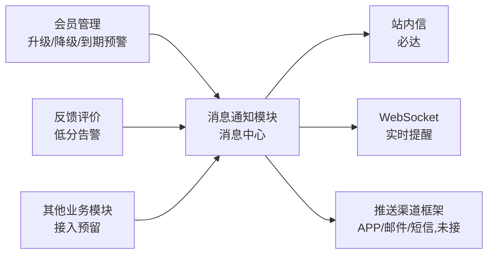

# 消息通知模块需求规格

## 1. 模块概述

### 1.1 模块定位

消息通知模块是系统的统一消息分发与触达中心，负责将各业务模块产生的通知事件（会员升级/降级、低分告警、套餐到期预警等）以站内信为主要载体送达目标用户或管理员。该模块向上对接所有产生通知需求的业务模块，向下统一管理消息投递、WebSocket 实时推送与用户消息查阅体验。

### 1.2 核心价值

| 价值维度 | 具体内容 |
|---------|---------|
| **统一触达** | 所有业务通知由消息通知模块统一收发，避免各模块各自实现消息推送造成体验割裂 |
| **消息中心化** | 用户拥有集中的消息收件箱，统一查阅、管理所有历史消息 |
| **实时感知** | WebSocket 实时推送 `new_message` 事件，在线用户即时收到新消息提醒 |
| **通知可控** | 用户可按类型/模块开关 APP 推送、设置免打扰时段 |
| **必达保障** | 站内信作为基本渠道持久化落库，即使外部推送通道全部故障消息仍可查阅 |
| **多渠道覆盖** | APP推送、邮件、短信提供分级触达手段（渠道框架已建，外部服务未接入，见 §4.4） |

### 1.3 业务目标

#### 功能目标

- 建立统一的消息通知基础设施，供所有业务模块调用
- 提供用户端消息中心（收件箱），实现消息查阅、已读管理、删除、搜索
- 提供通知偏好设置（按类型/模块开关 APP 推送 + 免打扰时段）
- 支持系统公告的创建、定时发送与定向推送
- 支持消息模板的变量渲染
- 建立消息生命周期管理机制（生成→投递→已读→清理）

#### 性能目标

| 指标 | 目标值 | 说明 |
|-----|--------|------|
| 消息生成延迟 | <1s | 业务事件触发到消息记录生成的延迟 |
| 消息生成吞吐 | ≥ 1000 条/秒 | 当前为同步写库，目标经异步消费生成达到 |
| 站内信送达延迟 | <3s | 消息生成到用户端可见（WebSocket 实时推送） |
| 消息列表查询 | <500ms | 用户端分页查询响应时间 |
| 消息未读数查询 | <50ms | 红点/角标查询（Redis 缓存） |

### 1.4 模块依赖关系



消息通知模块作为**被依赖模块**，业务模块通过消息发送接口推送通知。消息通知模块依赖**用户管理模块**确定消息接收人。**不依赖字典管理模块**（消息类型/优先级为代码常量，早期设计稿的字典配置未实现）。

---

## 2. 用户角色与权限

### 2.1 主要用户角色

| 角色 | 描述 | 主要职责 |
|------|------|---------|
| 普通用户 | 所有注册用户 | 接收和查阅个人消息、管理通知偏好设置 |
| 管理员 | 系统后台管理人员 | 发送系统公告、查看消息、接收告警通知 |

> **说明**：早期需求稿将"VIP用户"单列为角色，实际消息接收/查阅能力**所有用户一致**（无 VIP 专属通知差异），不单独列出。

### 2.2 权限矩阵

| 功能点 | 普通用户 | 管理员 |
|--------|:------:|:-----:|
| 接收站内信 | ✅ | ✅ |
| 查看消息列表 | ✅（仅自己的消息） | ✅（仅自己的消息） |
| 标记已读/全部已读 | ✅ | ✅ |
| 删除消息 | ✅（软删除） | ✅（软删除） |
| 搜索消息 | ✅ | ✅ |
| 设置通知偏好 | ✅ | ✅ |
| 发送系统公告 | ❌ | ✅ |
| 编辑消息模板 | ❌ | ✅ |

### 2.3 多端能力差异

各端受运行环境与系统能力限制，消息触达方式存在差异，未读数角标全端统一：

| 端 | 实时通道 | 触达方式 | 角标 | 说明 |
|----|---------|---------|------|------|
| Web（Vue/React） | WebSocket 长连（STOMP/SockJS） | 站内信 + 实时角标 | ✅ 统一未读数 | 在线时推送 `new_message`；离线时重连增量拉取（见 §4.3.5） |
| 桌面端（Electron） | WebSocket 长连 | 站内信 + 实时角标 | ✅ 统一未读数 | 同 Web 端，复用同一通道 |
| 移动端 APP（Android/Flutter/RN） | APP 推送 + 站内信 | 站内信 + APP 推送 | ✅ 统一未读数 | 后台/离线时依赖推送通道；前台时 WebSocket 实时推送 |
| 小程序（Taro/UniApp） | WebSocket（受限） | 站内信 + 降级轮询 | ✅ 统一未读数 | 小程序 WebSocket 连接数受限，连接失败/断开时降级为定时轮询（默认 30s）拉取未读数与最新消息 |

**统一规则**：

- 未读数角标全端一致，均基于 Redis 缓存 `msg:unread:{userId}`，各端通过 `GET /api/v1/messages/unread-count` 拉取。
- 站内信为全端必达渠道，无论实时通道是否可用，用户登录后均可查阅历史消息。
- APP 推送/邮件/短信等外部渠道当前未接入外部服务（见 §4.4），仅框架就绪。

---

## 3. 消息类型

### 3.1 消息类型定义

| 消息类型 | 编码 | 适用场景 | 发送对象 | 默认过期时间 |
|---------|------|---------|---------|------------|
| 站内信 | `inbox` | 所有需在系统内留痕的消息 | 用户/管理员 | 30 天 |
| 系统公告 | `announcement` | 系统维护、功能更新、活动通知等 | 全体用户/指定范围 | 30 天 |
| 业务通知 | `business` | 业务事件通知（多任务处理完成/订单/反馈等） | 特定用户 | 30 天 |
| 会员通知 | `member` | 等级升级/降级、套餐到期预警 | 特定用户 | 30 天 |
| 告警通知 | `alert` | 低分评价告警 | 管理员 | 7 天 |
| 严重告警 | `critical_alert` | 全局异常（大面积服务不可用等） | 管理员 | 90 天 |

### 3.2 各类型应用场景详述

#### 3.2.1 站内信（inbox）

所有消息的基本载体，保证消息必达。其他类型的消息均可在站内信中有对应副本。站内信是用户打开系统即可见的消息。

**典型场景**：管理员对反馈的回复、订单退款审核结果、会员等级变更通知。

#### 3.2.2 系统公告（announcement）

由管理员主动发送的广播消息，用于系统级通知。

| 公告类型 | 示例内容 |
|---------|---------|
| 系统维护 | "系统将于 7月30日 02:00-04:00 进行升级维护" |
| 功能更新 | "新算法'暗通道先验+'已上线，去雾效果更自然" |
| 活动通知 | "暑期 VIP 特惠活动，年费套餐限时 7 折" |
| 运营公告 | "因服务器迁移，历史处理记录将保留 30 天后清理" |

#### 3.2.3 业务通知（business）

各业务模块在特定事件发生时自动触发的消息，面向特定用户。**当前已接入的业务事件**：

| 触发模块 | 触发事件 |
|---------|---------|
| 会员管理 | 会员升级/降级通知、套餐到期预警（7/3/1 天） |
| 反馈评价 | 低分评价告警（alert/critical_alert） |

#### 3.2.4 会员通知（member）

与会员体系相关的专属通知，由会员管理模块触发：

| 触发事件 | 消息内容示例 |
|---------|------------|
| 升级通知 | "恭喜您升级至 VIP2，已解锁高清图导出、对比报告导出等权益" |
| 到期提醒（7天/3天/1天） | "您的 VIP2 套餐将于 X 天后到期，点击续费保持当前等级" |
| 降级通知 | 到期降级后通知 |

#### 3.2.5 告警通知（alert）与严重告警（critical_alert）

面向管理员的业务异常告警（低分评价告警等），由反馈评价模块触发：

| 触发条件 | 告警级别 | 消息内容示例 |
|---------|---------|------------|
| 单条评分 ≤2 星 | 普通 | "用户 xxx 对算法「暗通道先验」提交了低分评价" |
| 评分=1 星 且 24h 内同算法低分 ≥3 条 | 紧急 | "算法「暗通道先验」24 小时内收到 3 条低分评价" |
| 当日全局低分率 >20% | 严重 | "当日全局低分率已达 23%，请排查是否存在系统问题" |

---

## 4. 功能需求

### 4.1 消息接收（F-MN-001）

#### 4.1.1 功能描述

当业务事件触发消息生成时，消息通知模块接收消息请求，完成消息记录创建、站内信落库、WebSocket 实时推送与外部渠道分发。

#### 4.1.2 消息生成规则

| 属性 | 说明 |
|------|------|
| 触发方 | 各业务模块调用消息发送接口 |
| 发送者 | 系统（sender_type=1） |
| 接收者 | 单个用户、多个用户（批量）、按范围解析（公告） |
| 消息失效 | 默认 30 天后自动清理，告警类 7 天，严重告警 90 天 |
| 幂等 | 携带业务模块+业务 ID 的消息按接收人去重（同一业务事件发给不同接收人不去重），未携带的不防重 |

#### 4.1.3 消息发送流程

```
业务模块调用发送接口（title/content 或 templateCode+variables + recipientIds + bizModule/bizId）
    ↓
幂等检查（bizModule+bizId 均非空时，按接收人查询已存在消息）
    ↓
模板渲染（使用模板时校验变量完整性，替换 {变量} 占位符）
    ↓
计算过期时间（按类型：30/7/90 天）
    ↓
逐接收人写入站内信记录（同步事务）
    ↓
失效未读数缓存 + WebSocket 推送 new_message 事件（实时角标更新）
    ↓
异步分发外部渠道（APP推送/邮件/短信，按用户偏好决策）
```

#### 4.1.4 消息推送优先级

| 优先级 | 值 | 适用类型 | 说明 |
|--------|-----|---------|------|
| 紧急 | 4 | 严重告警 | 不受免打扰限制 |
| 高 | 3 | 重要公告、紧急告警 | - |
| 中 | 2 | 业务通知、会员通知、普通公告（默认） | - |
| 低 | 1 | 普通通知 | - |

### 4.2 消息列表展示（F-MN-002）

#### 4.2.1 功能描述

用户/管理员的统一消息收件箱，以列表形式展示所有接收的消息，支持分页加载、类型筛选与搜索。

#### 4.2.2 列表展示字段

| 字段 | 说明 |
|------|------|
| 消息类型 | 类型标签（站内信/系统公告/业务通知/会员通知/告警/严重告警）+ 类型色条 |
| 消息标题 | 消息标题 |
| 消息摘要 | 消息正文前 50 字符（截断） |
| 发送时间 | 完整时间展示 |
| 已读状态 | 未读消息排序在前（红点/标签区分） |

#### 4.2.3 消息筛选与排序

| 维度 | 说明 |
|------|------|
| 类型筛选 | 全部/站内信/系统公告/业务通知/会员通知/告警/严重告警/未读（单 Tab 切换） |
| 搜索 | 按标题/正文模糊搜索（仅当前用户消息） |
| 排序 | 未读消息优先置顶，同已读状态下按发送时间倒序 |

### 4.3 消息阅读与管理（F-MN-003）

#### 4.3.1 消息详情

点击消息进入详情页，展示完整消息内容（标题、类型标签、发送时间、正文、跳转链接）。

> **说明**：详情接口**仅查询，不自动标记已读**——前端打开详情页后需显式调用"标记已读"接口（早期需求稿"点击消息自动标记已读"通过前端显式调用实现，非后端详情接口行为）。

#### 4.3.2 已读/未读状态管理

| 功能 | 说明 |
|------|------|
| 标记单条已读 | 显式调用标记已读接口（幂等，已读消息重复调用静默成功） |
| 全部标记已读 | 列表页"全部已读"按钮，支持按类型可选标记 |
| 未读数角标 | 导航栏/菜单消息图标显示未读数量角标（基于 Redis 缓存未读数） |
| 角标更新 | 新消息经 WebSocket 实时推送更新；已读/删除后失效未读数缓存重建 |

#### 4.3.3 消息删除

| 功能 | 说明 |
|------|------|
| 单条/批量删除 | 支持按 ID 批量删除（确认弹窗） |
| 删除规则 | 用户删除为**软删除**（仅从当前用户视图移除，消息记录保留） |
| 到期清理 | 消息到期后（`expires_at < NOW()`）由定时任务**物理删除**，无论是否已读 |

> **说明**：早期需求稿的"左滑删除（移动端）/长按删除/悬停删除按钮"等交互**未实现**——前端提供删除按钮 + 确认弹窗。

#### 4.3.4 消息搜索

支持按消息标题、正文内容模糊搜索，仅搜索当前登录用户的消息（未读优先 + 时间倒序）。

#### 4.3.5 离线消息补偿

用户 WebSocket 断连期间产生的未读消息，在用户重连后增量拉取，不依赖服务端离线推送队列：

- 客户端记录本地 `last_read_time`（最近一次拉取/已读时间）。
- 重连后先调用 `GET /api/v1/messages/unread-count` 获取未读总数；若未读数 > 0，按 `last_read_time` 增量拉取离线期间产生的未读消息（分页）。
- 拉取完成后将本地 `last_read_time` 更新为本次拉取的最新消息时间。

> **定论**：离线消息补偿采用「重连增量拉取」方案，不实现服务端离线推送队列（避免消息堆积与重复推送）；该方案要求列表查询支持按 `create_time` 时间范围过滤。

### 4.4 消息设置（F-MN-004）

#### 4.4.1 通知方式偏好

用户可以按消息类型设置 APP 推送渠道偏好：

| 消息类型 | 默认 APP推送 | 说明 |
|---------|:---:|------|
| 系统公告 | 开 | 可关闭 |
| 业务通知 | **关** | 可开启 |
| 会员通知 | 开 | 可关闭 |
| 告警/严重告警 | 开（无默认配置时推送） | 可关闭 |

**规则**：站内信作为基本渠道不可关闭；APP 推送受总开关、类型偏好、模块开关三层控制。早期需求稿的"告警通知站内信+邮件（管理员可调整）"**邮件未接入**。

#### 4.4.2 免打扰设置

| 设置项 | 说明 |
|--------|------|
| 免打扰开关 | 开启后，APP 推送在指定时段内不发送 |
| 免打扰时段 | 用户自定义（默认 22:00 - 08:00，支持跨天） |
| 免打扰范围 | 仅 APP 推送渠道生效，站内信不受影响 |
| 例外情况 | 严重告警（priority≥4）不受免打扰限制 |
| 延迟补发 | 免打扰期间产生的 APP 推送进入延迟队列，免打扰结束后由定时任务补发；补发时合并同类型消息（同一用户同一 `biz_module` 的延迟消息合并为一条汇总通知），并遵守推送频率限制 |
| 推送频率限制 | 单用户单消息类型每小时 ≤ 5 条，超限合并为一条汇总通知；严重告警（priority≥4）不受限（必备项） |

#### 4.4.3 消息通知开关（按模块）

用户可按触发模块选择是否接收 APP 推送：

| 模块 | 默认状态 | 说明 |
|------|:------:|------|
| 处理任务完成通知（prediction） | 开启 | 多任务（去雾/去雨/去雪/低光/超分/去噪/修复）处理完成时通知 |
| 反馈处理进度通知（feedback） | 开启 | 反馈被回复/状态变更时通知 |
| 系统公告推送（announcement） | 开启 | 建议保持开启，以免错过维护通知 |

> **说明**：会员通知（升级/降级/到期预警）为关键通知，**无独立关闭开关**（不在模块开关中）。

### 4.5 系统公告管理（F-MN-005）

#### 4.5.1 功能描述

管理员可创建、编辑、发送和管理系统公告，支持定向发送和定时发送。

#### 4.5.2 公告创建

| 字段 | 必填 | 说明 |
|------|:--:|------|
| 公告标题 | ✅ | 2-50 字符 |
| 公告内容 | ✅ | 公告正文 |
| 公告类型 | ✅ | 系统维护/功能更新/活动通知/运营公告 |
| 重要级别 | ✅ | 普通/重要 |
| 发送范围 | ✅ | 全体用户/按会员等级/指定用户 |
| 发送时间 | ❌ | 支持立即发送和定时发送（定时发送时间必须为未来时间） |
| 过期时间 | ❌ | 公告失效时间 |

#### 4.5.3 公告状态与操作

| 状态 | 可操作 |
|------|--------|
| 草稿(1) | 编辑、发送、删除 |
| 待发送(2) | 编辑、发送、取消、删除 |
| 已发送(3) | 查看（不可编辑/取消） |
| 已取消(4) | 查看（不可编辑） |

#### 4.5.4 公告发送策略

- 立即发送：管理员点击"发送"直接触发
- 定时发送：创建时设置未来发送时间，由定时任务**每分钟扫描**待发送公告（status=2 且 send_time≤NOW）逐条发送
- 分批投递：接收人列表按 **500 人/批**分批调用消息发送接口，每批独立提交，避免全体用户公告长事务锁表
- 漏发补偿：定时任务执行异常或服务重启导致公告未在 send_time 发送时，记录告警日志并在下一轮扫描补偿重试（status=2 且 send_time≤NOW 的公告均会被拾取，不依赖单次调度成功）
- 发送成功置状态为"已发送"，记录发送数量

### 4.6 消息模板管理（F-MN-006）

#### 4.6.1 功能描述

管理员可管理各业务通知消息的模板，支持变量替换。

#### 4.6.2 模板能力

| 能力 | 说明 |
|------|------|
| 模板列表 | 按名称/类型/状态筛选分页查询 |
| 模板详情 | 展示标题模板、内容模板、优先级、渠道配置、变量说明 |
| 模板编辑 | 修改标题模板/内容模板/优先级/渠道配置/启用状态 |
| 变量渲染 | 发送时按 `{变量名}` 占位符替换，缺失必填变量报错 |

> **说明**：模板**无新增/删除接口**（模板由系统内置或数据库维护，仅支持编辑）；早期需求稿的"模板创建"未实现。

---

## 交互规范

### 页面布局

| 页面 | 布局要点 |
|------|---------|
| 通知铃铛 | 导航栏消息图标，展示未读红点与未读数量角标 |
| 消息列表页 | 顶部类型筛选 Tab（全部/站内信/公告/业务/会员/告警/未读），主体为消息列表，未读消息优先置顶，按发送时间倒序分页加载 |
| 公告横幅 | 首页顶部展示重要公告，可关闭 |

### 关键交互行为

| 场景 | 交互行为 |
|------|---------|
| 实时推送 | 在线用户收到新消息时铃铛角标即时更新 |
| 离线补偿 | 用户重连后增量拉取断连期间的未读消息 |
| 消息已读 | 点击消息进入详情后显式标记已读（非自动） |
| 批量已读 | 列表页"全部已读"按钮，支持按类型标记 |
| 消息删除 | 确认弹窗后软删除（从用户视图移除，记录保留） |
| 通知偏好 | 按消息类型开关 APP 推送，设置免打扰时段 |

### 操作反馈

| 场景 | 反馈行为 |
|------|---------|
| 收到新消息 | 铃铛角标 +1，未读列表出现新消息 |
| 标记已读 | 消息红点消失，角标 -1 |
| 全部已读 | 角标归零，列表全部标记为已读 |
| 删除消息 | 从列表移除，提示"已删除" |
| 公告发送（后台） | 提示"公告已发送"，记录发送数量 |

### 错误提示文案规范

| 场景 | 提示文案 |
|------|---------|
| 消息加载失败 | "消息加载失败，请下拉刷新" |
| 网络断开 | "网络连接断开，消息可能不是最新" |
| 公告内容含敏感词 | "公告内容包含敏感词，请修改后发送" |

---

## 5. 非功能需求

### 5.1 性能要求

| 指标 | 要求 | 实际 |
|-----|------|------|
| 消息生成吞吐 | 支持峰值 1000 条/秒 | 当前为逐接收人同步写库，批量为 500/批；目标经 RabbitMQ 异步消费生成（业务事件投递到 MQ → 消费者批量落库 + 推送）达到 |
| 站内信查询响应 | 分页查询 <500ms，未读数查询 <50ms | 未读数走 Redis 缓存 |
| 消息搜索响应 | 关键词搜索 <500ms | 当前为 MySQL LIKE；目标经 Elasticsearch 全文索引（标题/正文）达到 |
| 未读角标更新 | 收到新消息后 3s 内前端角标更新 | WebSocket 实时推送 |

### 5.2 安全要求

| 方面 | 措施 |
|-----|------|
| 消息防篡改 | 已发送的消息记录仅 read_status/deleted 可更新 |
| 越权防护 | 用户仅可查看、操作自己的消息（按接收人过滤，越权视为不存在） |
| 发送者校验 | 系统公告发送需校验管理员权限标识 |
| 内容审核 | 系统公告强制敏感词过滤 + 管理员审核（含敏感词的公告禁止发送或转人工审核），作为必备项 |
| 推送频率限制 | 单用户单消息类型每小时 ≤ 5 条，超限合并（见 §4.4.2），作为必备项 |

### 5.3 可用性要求

| 方面 | 要求 | 实际 |
|-----|------|------|
| 消息不丢失 | 站内信记录持久化落库，与业务操作同事务 | 已落地 |
| 站内信必达 | 站内信为基本渠道，即使外部通道全部故障消息仍可查阅 | 已落地 |
| 缓存降级 | 未读数缓存不可用时降级为直接查询 | 缓存未命中查库 |
| 推送降级 | APP推送/邮件/短信不可用时降级为仅站内信 | 渠道框架支持（外部服务未接入） |

---

## 6. 业务规则

### 6.1 消息生成规则

| 规则项 | 说明 |
|--------|------|
| 触发源 | 消息由各业务模块事件触发，不允许用户间直接互发消息 |
| 发送者 | 系统消息发送者为系统（sender_type=1） |
| 接收者 | 支持指定单个用户、批量用户 |
| 幂等 | 携带业务模块+业务 ID 的消息，按 (biz_module, biz_id, recipient_id) 唯一索引防重；同一业务事件发给不同接收人不去重；未携带幂等键的消息不防重 |

### 6.2 消息存储规则

| 规则项 | 说明 |
|--------|------|
| 消息留存 | 普通消息保留 30 天，告警消息保留 7 天，严重告警保留 90 天 |
| 清理策略 | 定时任务每天凌晨 4 点物理删除所有过期消息（分批 500 条） |

### 6.3 消息生命周期

```
业务事件触发 → 生成消息记录（未读）→ 站内信落库 + WebSocket 推送
    ↓
用户收到消息 → 角标更新
    ↓
用户查看详情（显式标记已读）
    ↓
├─ 用户删除消息 → 软删除（从用户视图移除，记录保留）
│
└─ 消息到期（expires_at < NOW()）→ 定时任务物理删除（无论是否已读）
```

---

## 7. 依赖关系

### 7.1 依赖模块

| 模块 | 依赖说明 |
|------|---------|
| **用户管理模块** | 确定消息接收人信息 |

### 7.2 被依赖模块

| 模块 | 依赖说明 |
|------|---------|
| **会员管理模块** | 会员升级/降级通知、套餐到期预警 |
| **反馈评价模块** | 低分告警通知（alert/critical_alert） |
| **系统管理** | 系统公告发布 |

---

## 8. 待确认事项

1. **APP推送通道**：APP推送具体使用哪个推送平台（极光推送/友盟/个推/FCM/APNs）？当前 `PushChannel` 决策逻辑完整但 `doPush` 仅记录日志，未接真实推送服务。
2. **邮件服务**：邮件发送使用哪个邮件服务商？当前 `EmailChannel.isAvailable=false`（依赖第三方服务，暂不可用），仅告警类消息需要邮件。
3. **短信服务**：短信发送使用哪个服务商？当前 `SmsChannel.isAvailable=false`，仅严重告警可能需要短信。
4. **业务模块接入**：多任务处理完成、订单支付/退款/续费、反馈状态变更/回复等业务事件何时调用消息发送接口？
5. **消息持久化**：过期消息清理是物理删除还是归档到冷存储？是否需要消息归档能力以支持合规审计？
6. **消息富文本**：系统公告和消息正文是否需要支持富文本（图片、链接）还是纯文本即可？
7. **免打扰时段时区**：免打扰时段默认值（22:00-08:00）是否需要按用户所在时区自动调整？
8. **公告定向发送规模**：公告定向发送（按等级/指定用户）的受众规模上限与分批策略是否需要规范？
9. **消息已读同步延迟**：多端同时在线时已读状态的同步延迟容忍度是多少？
