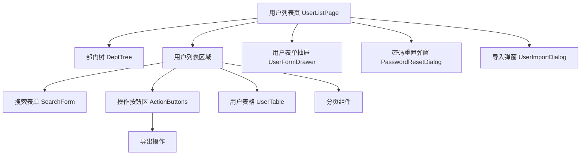

# 用户管理模块 - 前端实现设计

## 1. 文档概述

本文档描述用户管理模块的前端实现方案。用户管理采用左右两栏布局（左侧部门树 + 右侧用户列表），聚焦用户全生命周期的组件架构、状态管理与数据流设计。用户列表展示对接会员管理模块的会员等级与配额信息；数据权限过滤、超级管理员保护、首次登录强制改密等业务规则由后端保障，前端负责交互呈现与按钮级权限控制。

## 2. 组件树设计

| 组件 | 职责 | 复用性 |
|------|------|--------|
| DeptTree | 部门树展示与选择，点击节点按部门筛选用户 | 跨模块复用 |
| SearchForm | 关键字、状态、创建时间等搜索条件输入 | 页面内部 |
| ActionButtons | 新增/删除/导入/导出按钮，统一按钮级权限控制 | 页面内部 |
| UserTable | 用户数据表格展示与行操作，含状态开关 | 页面内部 |
| UserFormDrawer | 用户新增/编辑表单（抽屉式），编辑时用户名只读 | 页面内部 |
| PasswordResetDialog | 管理员重置用户密码 | 页面内部 |
| UserImportDialog | Excel 批量导入，展示导入结果与冲突明细 | 页面内部 |

## 3. 状态管理

### 3.1 Store 模块划分

| Store 模块 | 作用域 | 职责 |
|-----------|--------|------|
| userStore | 页面级 | 用户列表数据、分页与查询条件 |
| formStore | 页面级 | 表单数据、弹窗状态、部门/角色选项 |
| 全局字典 Store | 全局 | 性别等字典数据，登录后加载 |

### 3.2 核心状态

| 状态字段 | 归属 Store | 说明 |
|---------|-----------|------|
| pageData | userStore | 当前页用户数据 |
| total | userStore | 用户总数 |
| queryParams | userStore | pageNum/pageSize/keywords/status/deptId/时间范围 |
| selectedIds | userStore | 表格选中用户 ID 列表 |
| formData | formStore | 当前编辑用户表单数据 |
| formType | formStore | add/edit 模式 |
| deptOptions | formStore | 部门下拉选项（树形） |
| roleOptions | formStore | 角色下拉选项 |

### 3.3 核心操作

| 操作 | 说明 |
|------|------|
| loadUserList | 按查询条件分页加载用户列表 |
| handleDeptSelect | 选中部门节点后按部门筛选并重置到第一页 |
| submitForm | 新增/编辑用户提交，成功后刷新列表 |
| toggleStatus | 状态开关切换，超级管理员/自己不可禁用 |
| resetPassword | 重置密码，成功后该用户会话由后端踢出 |
| importUsers | 上传 Excel 导入，返回成功/冲突明细 |

## 4. 路由设计

| 路由路径 | 组件 | 访问控制 | 守卫说明 |
|---------|------|---------|---------|
| /system/user | UserListPage | sys:user:list | 路由由菜单树动态生成，菜单可见性由权限分配控制 |

**导航守卫策略**：
- 全局守卫校验登录态：未登录跳登录页，访问未授权菜单路由跳 403 页
- 按钮级权限按标识控制：新增 `sys:user:add`、编辑 `sys:user:edit`、删除 `sys:user:delete`、重置密码 `sys:user:password:reset`、状态切换 `sys:user:status`，无权限时隐藏或禁用

## 5. 数据流

### 5.1 数据获取策略

用户列表分页、新增/修改/删除、状态变更、密码重置、导入导出均通过 SDK 封装的用户接口调用，页面组件内完成请求与状态管理。页面初始化时并行请求部门树与用户列表；表单打开时并行加载部门选项与角色选项。

### 5.2 缓存策略

| 数据类型 | 缓存位置 | 失效策略 |
|---------|---------|---------|
| 部门树数据 | 组件状态 | 页面卸载时清除 |
| 角色选项 | 组件状态 | 页面卸载时清除 |
| 字典数据 | 全局 Store | 登录后加载，退出时清除 |
| 用户列表 | 组件状态 | 查询/翻页时重新获取 |

### 5.3 更新策略

- 新增/编辑/删除/状态切换/密码重置后刷新用户列表
- 删除为逻辑删除，已删除用户默认不在列表展示
- 状态变更、密码重置、删除后由后端实时踢出该用户所有在线会话，前端无需额外处理
- 导入完成后按结果类型展示（全部成功/部分成功下载冲突明细/全部失败）

### 5.4 请求错误处理

| 错误类型 | 处理方式 |
|---------|---------|
| 网络错误 | 显示网络连接失败提示 |
| 401 未授权 | 跳转登录页 |
| 403 无权限 | 显示无操作权限提示 |
| 超级管理员保护 | 显示后端返回的 `ROOT_USER_PROTECTED` 错误信息 |
| 业务错误 | 显示后端返回的错误信息 |
| 服务器错误 | 显示服务器异常提示 |

## 6. 交互设计决策

| 交互场景 | 技术选型/决策 | 理由 |
|---------|-------------|------|
| 左右两栏布局 | 左侧固定宽度部门树 + 右侧自适应列表 | 部门筛选与用户列表并排，减少跳转 |
| 部门树联动 | 点击部门节点筛选用户并重置到第一页 | 保持筛选上下文一致，避免空页 |
| 数据权限过滤 | 列表数据范围由后端按角色数据权限过滤 | 前端不维护数据权限逻辑，统一后端保障 |
| 超级管理员保护 | 据当前用户与目标用户关系禁用状态开关/删除按钮 | 防止自锁与误删 root，前端禁用 + 后端兜底 |
| 用户名只读 | 编辑模式下用户名字段只读 | 用户名创建后不可修改，避免唯一性冲突 |
| 状态开关直切 | 状态列使用 Switch 直接切换启用/禁用 | 减少弹窗交互，操作即时生效 |
| 导入进度展示 | 上传后展示导入结果与冲突明细下载 | 批量操作反馈清晰，便于纠错 |
| 首次登录强制改密 | 管理员创建/导入用户使用默认密码，前端据标记提示改密 | 保障账户安全，引导用户设置独立密码 |
| 会员信息展示 | 列表展示会员等级/到期/配额使用，数据来自会员管理模块 | 商业化属性对接，便于管理员掌握用户权益状态 |
| 并行请求初始化 | 页面加载时并行请求部门树与用户列表，表单打开时并行加载部门/角色选项 | 减少串行等待，提升首屏与表单打开速度 |

## 7. 公共组件使用

| 公共组件 | 使用场景 | 配置要点 |
|---------|---------|---------|
| 搜索表单组件 | 用户列表搜索 | 复用通用搜索布局，输入防抖 300ms |
| 表格组件 | 用户数据展示 | 支持复选、固定操作列、头像/状态标签渲染 |
| 树组件 | 部门树 | 默认展开，点击节点触发筛选联动 |
| 表单抽屉组件 | 新增/编辑用户 | 两列布局，必填标记，编辑模式用户名只读 |
| 导入导出组件 | 批量导入/导出 | 文件格式校验（.xls/.xlsx），导出按当前筛选条件 |
| 二次确认弹窗 | 删除、密码重置 | 显示用户名的确认提示 |
