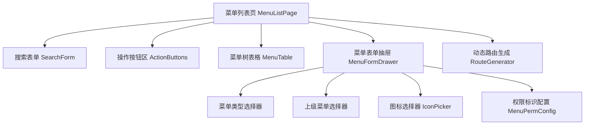

# 菜单管理模块 - 前端实现设计

## 1. 文档概述

本文档描述菜单管理模块的前端实现方案。菜单管理采用树形表格展示多级菜单结构（最多 5 级），聚焦菜单 CRUD、菜单类型驱动的动态表单、权限标识配置与动态路由生成的组件架构与状态管理。菜单为系统级配置数据，变更后需清除路由缓存触发重新生成；菜单类型（目录/菜单/外链/按钮）决定表单字段显隐与校验规则。系统预置菜单不可删除，前端据节点属性禁用对应操作。

## 2. 组件树设计

| 组件 | 职责 | 复用性 |
|------|------|--------|
| SearchForm | 菜单名称/权限标识/路由地址/类型/显示状态搜索 | 页面内部 |
| ActionButtons | 新增/批量删除按钮，统一按钮级权限控制 | 页面内部 |
| MenuTable | 菜单树形表格展示与行操作，含显示状态开关 | 页面内部 |
| MenuFormDrawer | 菜单新增/编辑表单，按类型动态显示字段 | 页面内部 |
| TypeSwitcher | 菜单类型选择（目录/菜单/外链/按钮），控制条件字段显隐 | 页面内部 |
| ParentSelector | 上级菜单树形选择器，过滤按钮类型（按钮不可作上级） | 跨场景复用 |
| IconPicker | 图标选择组件，支持关键字搜索与预览 | 跨模块复用 |
| PermConfig | 按钮类型权限标识配置，格式 `模块:功能:操作` | 页面内部 |
| RouteGenerator | 菜单变更后清除路由缓存，触发路由守卫重新生成动态路由 | 全局 |

## 3. 状态管理

### 3.1 Store 模块划分

| Store 模块 | 作用域 | 职责 |
|-----------|--------|------|
| menuStore | 页面级 | 菜单树数据、下拉选项、当前选中节点 |
| routeStore | 全局 | 动态路由配置，菜单变更时清除缓存触发重新生成 |
| 全局字典 Store | 全局 | 菜单类型等字典数据 |

### 3.2 核心状态

| 状态字段 | 归属 Store | 说明 |
|---------|-----------|------|
| menuList | menuStore | 菜单树形数据 |
| menuOptions | menuStore | 菜单下拉选项（上级选择，过滤按钮类型） |
| currentMenu | menuStore | 当前操作菜单节点 |
| queryParams | menuStore | keywords/perm/path/type/visible |
| formData | 表单组件 | 菜单表单数据（type/parentId/name/path/component/perm/icon/redirect/visible/sort） |
| expandedKeys | 表格组件 | 展开的菜单节点 key 集合 |
| dynamicRoutes | routeStore | 动态生成的路由配置 |

### 3.3 核心操作

| 操作 | 说明 |
|------|------|
| loadMenuList | 加载菜单树形列表，默认展开第一级 |
| loadMenuOptions | 加载上级菜单下拉选项（过滤按钮类型） |
| submitForm | 新增/编辑菜单提交，类型切换时重置条件字段，成功后刷新列表并清除路由缓存 |
| toggleVisible | 显示状态切换，成功后更新表格并清除路由缓存 |
| deleteMenu | 删除菜单（级联逻辑删除子孙），成功后刷新列表并清除路由缓存 |
| invalidateRoutes | 清除 routeStore 路由缓存，触发路由守卫重新生成 |

## 4. 路由设计

| 路由路径 | 组件 | 访问控制 | 守卫说明 |
|---------|------|---------|---------|
| /system/menu | MenuListPage | sys:menu:list | 路由由菜单树动态生成 |

**动态路由生成流程**：
1. 用户登录成功后调用菜单路由接口获取路由列表
2. 过滤隐藏菜单（visible=0）与按钮类型（type=4）
3. 递归处理子路由，按 path + component 注册路由
4. 写入 routeStore，触发侧边栏菜单刷新

**导航守卫策略**：
- 全局守卫校验登录态：未登录跳登录页，访问未授权菜单路由跳 403 页
- 按钮级权限按标识控制：新增 `sys:menu:add`、编辑 `sys:menu:edit`、删除 `sys:menu:delete`、状态切换 `sys:menu:edit`，无权限时隐藏或禁用
- 菜单新增/编辑/删除/显示状态切换/角色权限分配后需清除路由缓存重新生成

## 5. 数据流

### 5.1 数据获取策略

菜单列表、下拉选项、表单回显、新增/修改、删除、显示状态修改均通过 SDK 封装的菜单接口调用，页面组件内完成请求与状态管理。后端返回树形结构数据，前端直接使用。页面初始化时并行请求菜单列表与下拉选项。

### 5.2 缓存策略

| 数据类型 | 缓存位置 | 失效策略 |
|---------|---------|---------|
| 菜单列表 | 组件状态 | 页面卸载时清除 |
| 菜单下拉选项 | 组件状态 | 新增/编辑/删除后刷新 |
| 动态路由配置 | routeStore | 菜单/角色权限变更时清除重新生成 |
| 字典数据 | 全局 Store | 登录后加载，退出时清除 |

### 5.3 更新策略

- 新增/编辑/删除/显示状态切换后刷新菜单列表与下拉选项
- 删除为级联逻辑删除（子孙菜单一并标记删除），同步清理角色菜单关联
- 菜单变更后清除 routeStore 路由缓存，触发路由守卫重新生成动态路由
- 隐藏上级菜单时子菜单在导航中一并隐藏（前端渲染时父节点隐藏则子节点不渲染），权限仍生效

### 5.4 请求错误处理

| 错误类型 | 处理方式 |
|---------|---------|
| 网络错误 | 显示网络连接失败提示 |
| 401 未授权 | 跳转登录页 |
| 403 无权限 | 显示无操作权限提示 |
| 预置菜单保护 | 显示"系统预置菜单不可删除"提示 |
| 权限标识冲突 | 显示后端返回的全局唯一性校验错误 |
| 菜单名称冲突 | 显示后端返回的同层级名称重复错误 |
| 业务错误 | 显示后端返回的错误信息 |

## 6. 交互设计决策

| 交互场景 | 技术选型/决策 | 理由 |
|---------|-------------|------|
| 树表格展示 | 树形表格呈现层级，默认展开第一级 | 直观反映菜单层级，大数据量时启用虚拟滚动与懒加载 |
| 类型驱动动态表单 | 菜单类型切换时动态显示/隐藏字段并重置条件字段 | 不同类型字段差异大（目录需重定向、菜单需路由组件、按钮需权限标识），避免无效字段干扰 |
| 图标选择器 | 独立图标选择组件，支持关键字搜索与预览 | 菜单图标库较大，搜索选择优于下拉枚举 |
| 上级菜单过滤 | 上级选择器过滤按钮类型，按钮不可作上级 | 按钮仅作权限标识不对应页面，不可作为父级 |
| 权限标识唯一性 | 前端格式校验 `模块:功能:操作`，唯一性由后端校验 | 前端保证格式规范，后端保证全局唯一，提交时返回错误信息 |
| 路由缓存失效 | 菜单/权限变更后清除 routeStore 触发重新生成 | 保证路由与菜单配置实时一致，避免脏路由 |
| 预置菜单保护 | 系统预置菜单删除按钮禁用，编辑时类型不可修改 | 保护系统基础导航配置，前端禁用 + 后端兜底 |
| 级联删除提示 | 删除确认提示子菜单将一并删除 | 明确告知级联影响，避免误操作 |

## 7. 公共组件使用

| 公共组件 | 使用场景 | 配置要点 |
|---------|---------|---------|
| 搜索表单组件 | 菜单列表搜索 | 复用通用搜索布局，多条件筛选 |
| 树表格组件 | 菜单树形展示 | 树形展开/收起，图标渲染，类型/状态标签，大数据量虚拟滚动 |
| 树形选择器 | 上级菜单选择 | 过滤按钮类型，支持顶级菜单选择 |
| 表单抽屉组件 | 菜单新增/编辑 | 两列布局，类型驱动条件字段显隐，必填标记 |
| 图标选择组件 | 菜单图标选择 | 关键字搜索，动态预览，选中回显 |
| 二次确认弹窗 | 菜单删除 | 提示子菜单将一并删除 |
