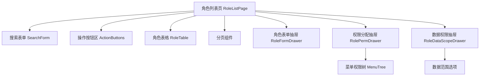

# 角色管理模块 - 前端实现设计

## 1. 文档概述

本文档描述角色管理模块的前端实现方案。角色管理采用单栏列表布局，聚焦角色 CRUD、菜单权限分配、数据权限配置的组件架构与状态管理。菜单权限以树形结构展示并支持父子联动勾选；数据权限提供 4 种固定范围可视化配置；权限分配后需刷新权限缓存以即时生效。超级管理员角色不可删除、不可禁用，前端据返回数据禁用对应操作。

## 2. 组件树设计

| 组件 | 职责 | 复用性 |
|------|------|--------|
| SearchForm | 角色名称关键字搜索 | 页面内部 |
| ActionButtons | 新增按钮，统一按钮级权限控制 | 页面内部 |
| RoleTable | 角色数据表格展示与行操作，含状态开关 | 页面内部 |
| RoleFormDrawer | 角色新增/编辑表单（名称、编码、状态、排序），编辑时编码只读 | 页面内部 |
| RolePermDrawer | 菜单权限树展示与勾选，回显已分配权限 | 页面内部 |
| RoleDataScopeDrawer | 数据权限范围配置（全部/本部门及子部门/仅本部门/仅本人） | 页面内部 |
| MenuTree | 菜单+按钮节点树形展示，支持父子联动勾选 | 跨模块复用 |

## 3. 状态管理

### 3.1 Store 模块划分

| Store 模块 | 作用域 | 职责 |
|-----------|--------|------|
| roleStore | 页面级 | 角色列表数据、分页与查询条件 |
| permStore | 页面级 | 权限分配所需的菜单树与已选权限 |
| 全局字典 Store | 全局 | 数据权限范围等字典数据 |

### 3.2 核心状态

| 状态字段 | 归属 Store | 说明 |
|---------|-----------|------|
| pageData | roleStore | 当前页角色数据 |
| total | roleStore | 角色总数 |
| queryParams | roleStore | pageNum/pageSize/keywords |
| menuTree | permStore | 菜单权限树数据（含菜单与按钮节点） |
| checkedMenuIds | permStore | 当前角色已分配的菜单 ID 集合 |
| currentRoleId | permStore | 当前操作的角色 ID |
| formData | 表单组件 | 角色表单数据（name/code/dataScope/status/sort） |

### 3.3 核心操作

| 操作 | 说明 |
|------|------|
| loadRoleList | 按查询条件分页加载角色列表 |
| submitForm | 新增/编辑角色提交，编码编辑时只读，成功后刷新列表 |
| toggleStatus | 状态开关切换，超级管理员角色不可禁用 |
| loadPermTree | 打开权限抽屉时并行加载菜单树与已分配权限并回显 |
| assignPermissions | 保存权限分配，覆盖原有权限并刷新权限缓存 |
| saveDataScope | 保存数据权限范围配置 |

## 4. 路由设计

| 路由路径 | 组件 | 访问控制 | 守卫说明 |
|---------|------|---------|---------|
| /system/role | RoleListPage | sys:role:list | 路由由菜单树动态生成，菜单可见性由权限分配控制 |

**导航守卫策略**：
- 全局守卫校验登录态：未登录跳登录页，访问未授权菜单路由跳 403 页
- 按钮级权限按标识控制：新增 `sys:role:add`、编辑 `sys:role:edit`、删除 `sys:role:delete`、权限分配 `sys:role:edit`、状态切换 `sys:role:edit`，无权限时隐藏或禁用

## 5. 数据流

### 5.1 数据获取策略

角色分页查询、下拉选项、新增、详情回显、修改、删除、状态修改、菜单权限查询与分配均通过 SDK 封装的角色接口调用，页面组件内完成请求与状态管理。权限分配所需的菜单树通过菜单接口获取。

### 5.2 缓存策略

| 数据类型 | 缓存位置 | 失效策略 |
|---------|---------|---------|
| 角色列表 | 组件状态 | 查询/翻页时重新获取 |
| 菜单权限树 | permStore | 抽屉关闭时清除 |
| 已分配权限 | permStore | 抽屉关闭时清除 |
| 字典数据 | 全局 Store | 登录后加载，退出时清除 |

### 5.3 更新策略

- 新增/编辑/删除/状态切换后刷新角色列表
- 删除为逻辑删除；存在关联用户的角色不可删除，前端提示先解绑或转移
- 权限分配/数据权限变更后由后端刷新权限缓存，关联用户权限即时生效
- 多角色用户数据权限取最大范围（数值最小者），由后端计算，前端仅展示单角色范围

### 5.4 请求错误处理

| 错误类型 | 处理方式 |
|---------|---------|
| 网络错误 | 显示网络连接失败提示 |
| 401 未授权 | 跳转登录页 |
| 403 无权限 | 显示无操作权限提示 |
| 超级管理员角色保护 | 显示后端返回的 `A0233` 错误信息 |
| 角色编码冲突 | 显示后端返回的唯一性校验错误 |
| 业务错误 | 显示后端返回的错误信息 |

## 6. 交互设计决策

| 交互场景 | 技术选型/决策 | 理由 |
|---------|-------------|------|
| 菜单树父子联动 | 勾选父节点自动勾选所有子节点，支持全选/展开收起 | 符合权限继承直觉，减少逐项勾选成本 |
| 权限回显 | 打开抽屉时加载菜单树与已分配权限并行回显 | 避免权限树与选中态不一致 |
| 权限覆盖保存 | 每次分配覆盖原有权限 | 权限为整体快照，避免增量同步复杂性 |
| 数据权限可视化 | 抽屉内展示 4 种范围选项及语义说明 | 帮助管理员理解各范围影响边界 |
| 角色编码只读 | 编辑模式下编码字段只读 | 编码创建后不可修改，保障权限标识稳定 |
| 状态开关直切 | 状态列使用 Switch 直接切换 | 减少弹窗交互，操作即时生效 |
| 超级管理员保护 | root 角色删除/禁用按钮禁用 | 防止误操作导致系统权限失控 |
| 部门管理员边界 | 部门管理员仅可查看角色列表并分配已有角色，不可增删改 | 按钮可见性按权限标识控制，权限边界由后端兜底 |
| 角色排序展示 | 列表按 sort 字段升序排列 | 控制角色展示顺序，便于按优先级管理 |

## 7. 公共组件使用

| 公共组件 | 使用场景 | 配置要点 |
|---------|---------|---------|
| 搜索表单组件 | 角色列表搜索 | 复用通用搜索布局，输入防抖 |
| 表格组件 | 角色数据展示 | 支持复选、固定操作列、状态开关、字典翻译 |
| 树组件 | 菜单权限树 | 复选框选择，父子关联，支持全选/展开收起 |
| 表单抽屉组件 | 角色新增/编辑 | 单列布局，必填标记，编辑模式编码只读 |
| 二次确认弹窗 | 角色删除 | 显示角色名的确认提示 |
