# 订单管理模块 - 前端实现设计

## 1. 文档概述

本文档描述订单管理模块的前端实现方案（dehaze-front-vue），聚焦组件架构、状态管理、路由设计与关键交互决策。订单模块连接套餐管理（商品）、支付渠道（资金）与会员管理（权益履约），前端覆盖用户端订单全流程（列表/详情/支付/退款申请）与管理端运维功能（订单管理/退款审核/统计）。

---

## 2. 组件树设计

```mermaid
flowchart TB
    subgraph 用户端
        OrderMyPage["OrderMyPage<br/>我的订单"]
        OrderDetailPage["OrderDetailPage<br/>订单详情"]
    end

    subgraph 管理端
        OrderListPage["OrderListPage<br/>订单管理"]
        RefundListPage["RefundListPage<br/>退款管理"]
    end

    OrderMyPage --> StatusTab["状态筛选 Tab"]
    OrderMyPage --> OrderCardList["订单卡片列表"]
    OrderMyPage --> PaymentDialog["支付弹窗<br/>（方式选择/二维码/倒计时）"]
    OrderMyPage --> RefundApplyDialog["退款申请弹窗"]
    OrderMyPage --> CancelConfirm["取消确认弹窗"]

    OrderDetailPage --> StatusCard["状态卡片<br/>（含状态流转标识）"]
    OrderDetailPage --> PackageInfo["套餐信息区"]
    OrderDetailPage --> AmountDetail["金额明细区"]
    OrderDetailPage --> PaymentDialog

    OrderListPage --> SearchForm["搜索表单<br/>（订单号/用户/状态/支付方式/金额/时间）"]
    OrderListPage --> OrderTable["订单表格"]
    OrderListPage --> OrderDetailDrawer["订单详情弹窗<br/>（支付流水/退款信息/成长值变动）"]
    OrderListPage --> StatsDrawer["统计抽屉<br/>（ECharts 图表）"]

    RefundListPage --> RefundSearch["退款筛选区"]
    RefundListPage --> RefundTable["退款表格"]
    RefundListPage --> RefundAuditDialog["退款审核弹窗<br/>（通过/驳回 + 备注）"]
    RefundListPage --> RefundDetailDialog["退款详情弹窗"]
```



### 组件职责划分

| 组件 | 职责 | 所属端 |
|------|------|:------:|
| OrderMyPage | 用户订单列表，状态 Tab 筛选、支付/取消/退款入口 | 用户 |
| OrderDetailPage | 订单状态/套餐/金额明细展示，内嵌支付弹窗 | 用户 |
| PaymentDialog | 支付方式选择（微信/支付宝/余额/组合）、二维码展示、轮询支付状态 | 共用 |
| RefundApplyDialog | 退款原因下拉 + 补充说明，提交退款申请 | 用户 |
| OrderListPage | 管理端订单分页查询、详情弹窗、统计抽屉 | 管理员 |
| OrderDetailDrawer | 订单信息 + 支付流水 + 退款信息 + 成长值变动 | 管理员 |
| StatsDrawer | 总量/收入/退款/退款率 + 状态/支付方式/套餐分布 + 每日趋势图 | 管理员 |
| RefundListPage | 退款审核列表，通过/驳回操作 | 管理员 |
| RefundAuditDialog | 审核通过/驳回 + 备注必填校验 | 管理员 |

> **设计决策**：支付弹窗、退款申请弹窗等能力内聚在页面组件内，不做独立子组件拆分；状态标签、订单卡片样式由页面内部映射函数驱动。

---

## 3. 状态管理

| Store | 核心状态 | 职责 |
|-------|---------|------|
| orderStore | orderList、total、queryParams（pageNum/pageSize/status/筛选条件）、loading | 订单列表分页数据、查询条件管理；用户端与管理端共用同一 Store 实例，通过 API 方法区分数据范围 |
| paymentStore | payResult、payMethod、qrCodeDataUrl、pollingTimer、countdown | 支付状态（处理中/已支付/失败）、支付方式选择、二维码生成、支付轮询定时器、支付倒计时 |

- orderStore 在页面组件内局部实例化，列表分页数据与筛选条件随页面生命周期管理，切换状态 Tab 重置 pageNum
- paymentStore 的轮询定时器在弹窗关闭时清除，避免内存泄漏；支付倒计时基于订单 expireTime 计算
- 订单状态机由后端驱动，前端按状态映射操作按钮显隐与标签配色

---

## 4. 路由设计

| 路由路径 | 组件 | 名称 | 加载方式 | 角色要求 |
|---------|------|------|---------|---------|
| `/order/my` | OrderMyPage | OrderMy | 静态路由（hidden） | 登录用户 |
| `/order/detail` | OrderDetailPage | OrderDetail | 静态路由（hidden） | 登录用户 |
| `/order/list` | OrderListPage | OrderList | 动态菜单 | 管理员 |
| `/order/refund` | RefundListPage | RefundList | 动态菜单 | 管理员 |

- 用户端路由（my/detail）为静态路由，hidden 不显示在菜单，通过个人中心入口跳转；detail 页通过 query 参数 orderNo 传递订单号
- 管理端路由（list/refund）经动态菜单加载，后端菜单权限控制入口可见性
- 订单详情页启用 keepAlive，返回列表时保留滚动位置

### 权限控制

| 操作 | 权限标识 | 无权限时 |
|------|---------|---------|
| 退款审核 | `order:refund:approve` | 按钮隐藏 |
| 订单统计 | `order:stats` | 按钮隐藏 |

> 订单列表/详情/退款列表查询无权限标识，登录管理员即可访问。用户端操作由后端校验订单归属（非本人返回 A0530）。

---

## 5. 数据流

### 用户端订单流程

```
进入我的订单 -> 分页查询（默认全部状态）
    ↓
切换状态 Tab -> 重置 pageNum -> 按状态查询
    ↓
├─ 去支付 -> 支付弹窗 -> 选择支付方式 -> 发起支付
│   ├─ 微信/支付宝 -> 展示二维码 -> 轮询支付状态 -> 支付成功刷新
│   ├─ 余额支付 -> 直接返回已支付 -> 刷新列表
│   └─ 组合支付 -> 输入余额抵扣 -> 第三方部分展示二维码
├─ 取消订单 -> 输入原因 -> 确认 -> 刷新
├─ 申请退款 -> 原因弹窗 -> 提交 -> 刷新
└─ 查看详情 -> 跳转 detail（携带 orderNo）
```

### 管理端数据流

```
进入订单管理 -> 分页查询
    ↓
筛选（订单号/用户/状态/支付方式/金额/时间）-> 重新查询
    ↓
├─ 详情弹窗 -> 加载订单详情（含支付流水/退款信息/成长值变动）
└─ 统计抽屉 -> 按需加载统计接口 -> ECharts 渲染图表
```

### 模块间数据交互

| 交互方向 | 数据 | 说明 |
|---------|------|------|
| 套餐商城 -> 订单管理 | packageId | 从套餐卡片发起创建订单，跳转订单详情 |
| 订单管理 -> 会员管理 | 支付事件 | 支付成功后后端激活会员权益，前端刷新会员状态 |

---

## 6. 交互设计决策

| 决策点 | 实现方式 | 理由 |
|--------|---------|------|
| 订单状态流转可视化 | 状态卡片色带 + 标签配色（pending 橙/paid 蓝/refunding 橙等），详情页展示完整状态轨迹 | 状态流转由后端驱动，前端按状态映射配色，用户直观感知当前阶段 |
| 支付倒计时 | 基于订单 expireTime（创建时间 + 30min）计算剩余时间，弹窗内展示倒计时 | 超时订单后端自动取消，前端倒计时引导用户尽快完成支付 |
| 支付方式切换 | 微信/支付宝展示二维码，余额直付，组合支付输入余额抵扣金额后第三方部分展示二维码 | 不同支付渠道交互差异大，弹窗内按方式动态渲染支付区域 |
| 退款流程引导 | 退款原因下拉预设选项 + 自定义补充说明，reason 为空时禁止提交 | 规范退款原因数据，便于管理端审核与统计 |
| 订单数据隔离 | 用户端调用 listMy 接口（后端按 userId 过滤），管理端调用分页查询接口（全量） | 数据隔离由后端保障，前端无需额外过滤 |
| 金额展示 | 分转元（toFixed(2)），原价删除线（有优惠时展示） | 后端金额单位为分，前端统一转换展示 |
| 统计图表按需加载 | 统计抽屉打开时初始化 ECharts，关闭时销毁实例 | 避免列表页不必要的图表渲染开销 |

---

## 7. 公共组件使用

| 公共组件 | 使用位置 | 配置要点 |
|---------|---------|---------|
| 分页表格 | 管理端订单列表、退款列表 | 自定义列模板（状态标签/优惠金额/操作按钮），后端分页 |
| 搜索表单 | 管理端订单/退款筛选区 | 订单号/用户/状态/支付方式/金额范围/时间范围联动查询 |
| 弹窗表单 | 退款申请/退款审核/取消确认 | 必填校验（退款原因、审核备注），表单重置 on close |
| 抽屉 | 订单统计 | 打开时按需加载统计数据，ECharts 图表初始化与销毁 |
| 状态标签 | 订单卡片/表格/详情 | 按订单状态映射 el-tag type（warning/primary/info） |
| 二维码 | 支付弹窗 | qrcode 库将 payUrl/qrCode 转为 DataURL 图片展示 |
