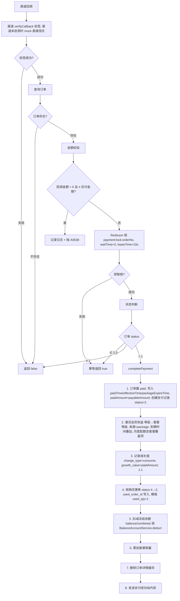
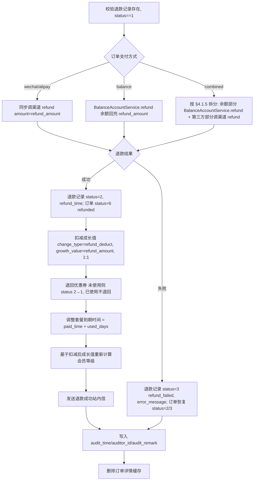
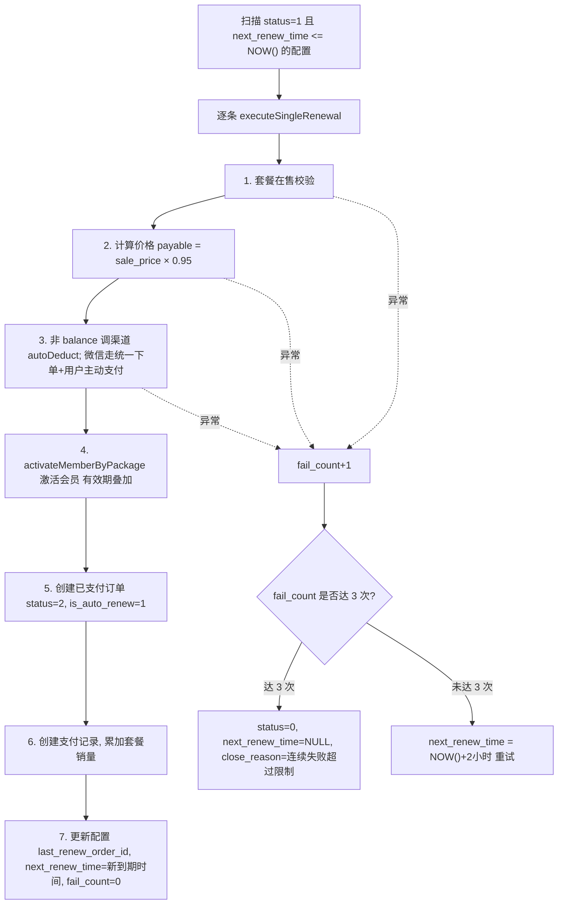

# 订单管理模块 - 后端实现设计

## 1. 文档概述

本文档描述订单管理模块的后端实现方案，包括业务逻辑、数据传输对象、服务层设计、支付回调幂等、退款与自动续费流程、定时任务与缓存策略。该模块在 dehaze-java、dehaze-python、dehaze-go 三端实现，三端 API 契约一致（Java 权威，Go/Python 对齐）。

- **API 接口规范**：参见 [API接口.md](./API接口.md)
- **需求规格**：参见 [需求规格.md](./需求规格.md)
- **数据库设计**：参见 [02-系统架构/03-数据库设计.md](../../../02-系统架构/03-数据库设计.md) §4.5
- **Schema 文件**：`config/sql/schema/sys_order.sql`、`sys_payment_record.sql`、`sys_refund_record.sql`、`sys_auto_renew.sql`

---

## 2. 数据传输对象

### 2.1 订单创建对象 (OrderCreateForm)

| 字段 | 类型 | 说明 |
|------|------|------|
| packageId | Long | 套餐ID（必填） |
| couponId | Long | 用户优惠券实例ID（可选） |
| payMethod | String | 支付方式（必填，wechat/alipay/balance/combined） |

### 2.2 订单查询参数 (OrderPageQuery)

| 字段 | 类型 | 说明 |
|------|------|------|
| pageNum/pageSize | Long | 页码/每页条数 |
| orderNo | String | 订单号（精确） |
| keywords | String | 用户名/昵称（模糊，命中用户后按 userId 过滤） |
| status | String | 订单状态（pending/paid/...） |
| payMethod | String | 支付方式 |
| amountMin/amountMax | Long | 应付金额范围（分） |
| paidTimeStart/paidTimeEnd | LocalDateTime | 支付时间范围 |

### 2.3 订单列表 VO (OrderPageVO) / 我的订单 VO (MyOrderVO)

| 字段 | 类型 | 说明 |
|------|------|------|
| id/orderNo | Long/String | 订单ID/订单号 |
| userId/username | Long/String | 用户ID/用户名（后台 VO） |
| packageName/packageLevel | String | 套餐名称/等级 |
| originalPrice/discountAmount/couponAmount | Long | 原价/折扣/券抵扣（详情 VO） |
| payableAmount/paidAmount | Long | 应付/实付（分） |
| payMethod | String | 支付方式 |
| status | String | 状态（pending/paid/completed/cancelled/refunding/refunded） |
| createTime/paidTime/packageExpireTime | LocalDateTime | 创建/支付/到期时间 |

### 2.4 订单详情 VO (OrderDetailVO)

| 字段 | 类型 | 说明 |
|------|------|------|
| 基本字段 | - | 同 OrderPageVO + originalPrice/discountAmount/couponAmount |
| expireTime | LocalDateTime | 订单支付超时时间 |
| effectiveTime | LocalDateTime | 权益生效时间 |
| cancelReason | String | 取消原因 |
| isAutoRenew | Integer | 是否自动续费订单 |
| paymentRecords | List<PaymentRecordVO> | 支付流水列表 |
| refundRecord | RefundRecordVO | 最近退款记录（无则为 null） |

### 2.5 退款对象

| 表单 | 字段 | 说明 |
|------|------|------|
| RefundApplyForm | reason（必填）/customReason | 退款原因；customReason 非空时以 `reason + ":" + customReason` 拼接写入 |
| RefundAuditForm | approved/remark | 审核通过标识/审核备注 |

### 2.6 自动续费表单 (AutoRenewConfigForm) / VO (AutoRenewConfigVO)

| 字段 | 说明 |
|------|------|
| packageId | 套餐ID（必填） |
| payMethod | 支付方式（必填，wechat/alipay/balance） |
| enabled | 是否启用 |
| nextRenewTime/failCount/closeReason | VO：下次扣款时间/失败次数/关闭原因（未配置时 enabled=false、payMethod=balance） |

---

## 3. 服务层设计

### 3.1 订单服务 (OrderService)

> **说明**：退款与自动续费逻辑**内聚于 OrderService**，无独立 RefundService/AutoRenewService（早期设计稿的拆分不存在）。

| 方法名 | 说明 |
|--------|------|
| create | 创建订单（防重锁 + 价格计算 + 锁定优惠券） |
| pay | 发起支付（渠道统一下单返回支付参数 / 余额直接生效） |
| handlePaymentCallback | 支付回调处理（验签 + 幂等 + 权益生效） |
| cancel | 取消订单（释放优惠券） |
| listMy | 我的订单分页 |
| getDetail | 订单详情（Redis 缓存 + 越权校验） |
| getPage | 后台订单分页 |
| applyRefund | 申请退款（按天折算） |
| listRefunds | 退款审核列表分页 |
| approveRefund / rejectRefund | 退款审核通过/驳回 |
| getStats | 订单统计 |
| updateAutoRenewConfig / getAutoRenewConfig | 自动续费配置读写 |
| expireOrders / executeRenewal / completeExpiredOrders / expireUserCoupons / retryFailedRefunds | 定时任务入口 |

### 3.2 支付渠道抽象 (PaymentChannelService)

| 实现 | 渠道类型 | 说明 |
|------|---------|------|
| WechatPayService | wechat | 统一下单/验签/退款/关单/代扣（native 扫码），`payment.wechat.enabled=false` 时 mock |
| AlipayService | alipay | 同上（precreate），`payment.alipay.enabled=false` 时 mock |
| 平台余额 | balance | 由 BalanceAccountService 处理（见 §3.3） |

### 3.3 余额账户服务 (BalanceAccountService)

封装余额账户的冻结、解冻、扣减、退款回充操作，供 OrderService 的支付、退款、超时取消流程调用。余额账户表结构与流水类型见 [需求规格 §3.5](./需求规格.md)。

| 方法名 | 职责 | 事务与并发边界 |
|--------|------|--------------|
| freeze | 校验可用余额 ≥ 金额，frozen_balance += amount | 乐观锁（version）单行 UPDATE，失败重试 ≤3 次 |
| unfreeze | frozen_balance -= amount（超时取消/支付失败解冻） | 与订单状态变更同一事务 |
| deduct | 扣减冻结余额出账（balance -= amount、frozen_balance -= amount） | 与 completePayment 同一事务 |
| refund | 退款回充可用余额（balance += amount） | 与退款审核同一事务 |

---

## 4. 核心业务逻辑

### 4.1 订单创建逻辑（create）

1. **参数校验**：payMethod ∈ {wechat, alipay, balance, combined}（否则"不支持的支付方式"）；套餐存在且在售
2. **防重复下单**：Redisson 锁（key `order:lock:{userId}:{packageId}`，waitTime=0、leaseTime=5s），获取失败抛 A0539
3. **价格计算**：调用套餐服务 `calculatePrice(packageId, couponId)`，取 originalPrice/discountAmount/couponAmount/payableAmount
4. **优惠券锁定**：条件 UPDATE `sys_user_coupon SET status=4 WHERE id=? AND status=1`（0 行影响抛 A0525）；锁定时仅置 status=4，核销时（支付成功）再写 used_order_id
5. **生成订单**：订单号 `DH + yyyyMMddHHmmss + 6位随机数`；套餐信息冗余（name/level/periodDays）；expire_time = NOW()+30min；status=1；is_auto_renew=0
6. **事务保证**：订单创建与优惠券锁定同一事务
7. **职责分离**：create 不触发渠道下单，支付链接由 pay 获取

### 4.2 发起支付（pay）

1. 越权校验：订单归属本人（非本人抛 A0530）
2. 状态校验：status==1（否则 A0531）；未超时（否则 A0532）
3. **balance**：调 BalanceAccountService.freeze 冻结应付金额（余额不足抛 BALANCE_INSUFFICIENT）→ 触发 completePayment（扣减冻结余额 + 权益生效）→ 返回 paid=true
4. **wechat/alipay**：调渠道 `unifiedOrder` → 失败抛 C0001 → 创建支付记录（status=1 处理中）→ 返回 payUrl/qrCode
5. **combined**：调 BalanceAccountService.freeze 冻结 balanceAmount（余额不足抛 BALANCE_INSUFFICIENT）→ 第三方应付 = payableAmount - balanceAmount → 调渠道 `unifiedOrder` 返回 payUrl/qrCode；回调成功后触发 completePayment（扣减冻结余额 + 权益生效）

### 4.3 支付回调处理（handlePaymentCallback）



### 4.4 取消订单（cancel）

1. 越权校验（非本人抛 A0530）；状态校验（status==1，否则 A0531）
2. 置 status=4、写入 cancel_reason
3. 释放优惠券（status 4→1）
4. 删除订单详情缓存

### 4.5 退款申请（applyRefund）

1. 越权校验（非本人抛 A0530）
2. 状态校验：订单状态 ∈ {paid(2), completed(3)}（否则 A0531）
3. **退款时限校验**：`paid_time < NOW() - 7天` 抛 A0534（三端统一）
4. **促销套餐校验**：套餐 `is_refundable=0` 抛 A0536
5. **唯一性校验**：已存在退款记录抛 A053A（+ 订单ID 唯一约束兜底）
6. **按天折算退款金额**：
   - 已使用天数 `used_days = max(1, ceil((NOW() - paid_time) / 86400))`
   - 剩余天数 `remaining_days = period_days - used_days`
   - `remaining_days <= 0` 时退款金额为 0（已用完不可退）；否则 `refund_amount = paid_amount × remaining_days / period_days`（向下取整到分）
   - `used_quota` 字段存储 used_days
7. 原因拼接：customReason 非空时 `reason + ":" + customReason` 写入
8. 插入退款记录（refund_no=`RF+时间戳+随机数`、status=1、channel=订单支付方式、refund_amount=折算金额、used_quota=used_days）
9. 订单置 status=5（refunding）；删除订单详情缓存

### 4.6 退款审核

**approveRefund**（通过）：


**rejectRefund**（驳回）：
```
校验退款记录存在、status==1
    ↓
退款记录 status=3（refund_failed）+ 审核信息
    ↓
订单恢复 status=2/3（按套餐是否到期）；删除订单详情缓存
```

> **说明**：
> - 组合支付退款按 [需求规格 §4.1.5](./需求规格.md) 拆分：余额退款金额 = `refund_amount × (balanceAmount / paidAmount)`，第三方退款金额 = `refund_amount - 余额退款金额`
> - 渠道退款为**同步调用**（无退款异步回调处理）
> - 审核驳回与渠道退款失败共用 status=3（refund_failed），通过 audit_remark/error_message 区分

### 4.7 自动续费

**配置读写**：
- `updateAutoRenewConfig`：校验套餐存在，upsert（`(user_id, package_id)` 唯一）写入 pay_method/status/fail_count=0；**next_renew_time 不设置（NULL）**——首次开启不触发扣款
- `getAutoRenewConfig`：未配置时返回 enabled=false、payMethod=balance

**executeRenewal**（定时任务）：


### 4.8 定时任务（5 个）

| 任务名 | 实现方法 | 执行时机 | 扫描条件 | 处理 |
|--------|---------|---------|---------|------|
| 订单超时取消 | expireOrders | 每 5 分钟 | status=1 且 expire_time < NOW | 渠道关单（失败仅告警）→ status=4 → 释放券 → cancel_reason="系统超时自动取消" |
| 自动续费扣款 | executeRenewal | 每 1 小时 | status=1 且 next_renew_time <= NOW | 见 §4.7 |
| 订单到期归档 | completeExpiredOrders | 每 1 小时 | status=2 且 package_expire_time < NOW | status → 3 |
| 优惠券过期 | expireUserCoupons | 每 1 小时 | status=1 且 expire_time < NOW | status → 3 |
| 退款失败重试 | retryFailedRefunds | 每 30 分钟 | status=3 且 retry_count < 3 | 重新调渠道退款；成功 → status=2、订单 status=6；失败 → retry_count+1、达 3 次标记"已达重试上限，转为最终失败" |

---

## 5. 数据访问层设计

> 表结构与索引定义见 [03-数据库设计.md](../../../02-系统架构/03-数据库设计.md) §4.5 及 Schema 文件。查询优化关注点：订单表按用户+状态查询（我的订单）、按状态/过期时间扫描（定时任务）；退款表按订单号唯一约束（一单仅一次退款）、按状态扫描（重试）；支付流水表按订单号查询；自动续费表按用户+套餐唯一约束、按状态+续费时间扫描。

### 5.1 缓存策略

| 缓存对象 | 缓存 Key | 过期时间 | 更新策略 |
|---------|---------|---------|---------|
| 订单详情 | order:detail:{orderNo} | 10 分钟（三端统一） | 状态变更时删除；缓存 VO 含 userId 用于越权校验（非本人不命中缓存） |
| 支付状态 | order:pay:{orderNo} | 5 分钟 | 支付回调时更新 |
| 用户订单列表 | - | 不缓存 | 查询条件多变（状态/时间/金额/支付方式），直接查库 |
| 支付回调锁 | payment:lock:{orderNo} | 10 秒（leaseTime） | 回调处理完释放 |
| 防重复下单锁 | order:lock:{userId}:{packageId} | 5 秒（leaseTime） | 自动过期 |

---

## 6. 三端实现一致性

三端 API 契约完全一致（Java 权威，Go/Python 对齐）。订单锁、支付回调锁三端统一使用 Redis 分布式锁（Java Redisson / Go go-redis / Python redis-py）；退款 7 天时限、回调金额校验、按天折算退款、退款扣减成长值/退券/调整到期时间等业务规则三端一致，详见 §4。

---

## 7. 安全设计

### 7.1 支付安全

| 防护项 | 实现方式 |
|--------|---------|
| 签名验证 | 渠道验签（wechat 按参数排序+key 签名；渠道未启用时 mock 直接信任） |
| 金额校验 | 回调金额与订单应付金额一致，不一致抛 A0538（三端统一） |
| 幂等处理 | 订单级分布式锁 + 状态判断 + 支付流水唯一索引（三重保障） |
| 防重复下单 | 订单级分布式锁（用户+套餐，5 秒） |
| 敏感信息 | 支付流水号脱敏展示，回调原始报文存库不对外 |

### 7.2 权限控制

| 权限标识 | 控制范围 |
|---------|---------|
| order:refund:approve | 退款审核通过/驳回（后端接口校验） |
| order:list | 后台订单分页列表（`GET /api/v1/orders/page`，后端接口校验） |
| order:refund:list | 后台退款审核列表（`GET /api/v1/orders/refunds/page`，后端接口校验） |
| order:stats | 订单统计（后端接口校验，`GET /api/v1/orders/stats`） |

> **安全加固（越权防护）**：后台订单列表与退款审核列表均属后台运营数据，任何登录用户可查看全量订单/退款存在越权与数据泄露风险，故收紧为按钮权限 `order:list` / `order:refund:list`（挂于订单管理菜单下，授权给管理员角色）。详情接口 `GET /api/v1/orders/{orderNo}` 由用户端越权校验（§7.3）管控，不设后台权限标识。

### 7.3 用户端越权校验

getDetail/cancel/pay/applyRefund 接口校验 `order.userId == 当前用户ID`，非本人操作返回 A0530（避免泄露订单是否存在）；订单详情缓存命中时同样校验缓存 VO 归属。

### 7.4 退款安全

| 防护项 | 实现方式 |
|--------|---------|
| 退款时限 | 支付成功后 7 天内可申请退款，超期抛 A0534（三端统一） |
| 退款金额校验 | 按天折算：已使用天数 `max(1, ceil((NOW() - paid_time) / 86400))`，剩余天数为 0 时退款金额为 0；退款金额 = `paid_amount × remaining_days / period_days`（向下取整到分） |
| 促销套餐限制 | 套餐 `is_refundable=0` 不可退款，抛 A0536 |
| 退款唯一性 | 每个订单仅可退款一次（退款记录订单 ID 唯一约束 + 前置检查，重复申请抛 A053A） |
| 审核流程 | 退款需管理员审核（approveRefund/rejectRefund），审核通过调渠道退款（同步调用），失败自动重试 ≤3 次 |
| 退款联动 | 审核通过后扣减成长值（refund_deduct，按退款金额 1:1）、退回未使用优惠券、调整套餐到期时间、重新计算会员等级 |

### 7.5 并发控制

| 场景 | 实现方式 |
|--------|---------|
| 优惠券锁定原子性 | 条件 UPDATE `status=1 -> 4`，0 行影响抛 A0525；锁定与订单创建同一事务 |
| 余额扣减原子性 | 乐观锁（version 字段）单行 UPDATE，失败重试 ≤3 次；冻结/扣减/退款回充均走 BalanceAccountService |
| 订单超时取消 | 定时任务每 5 分钟扫描 `status=1 AND expire_time < NOW()`，关单 + 释放优惠券 + 解冻余额 |
| 支付回调幂等 | 订单级分布式锁（payment:lock:{orderNo}）+ 状态判断 + 支付流水唯一索引（三重保障） |
| 防重复下单 | 用户+套餐粒度分布式锁（order:lock:{userId}:{packageId}，5 秒），获取失败抛 A0539 |

---

## 8. 配置项

| 配置项 | 说明 | 默认值 |
|--------|------|--------|
| 订单支付超时时间 | 创建后多少分钟超时 | 30 分钟 |
| 自动续费扣款重试 | 失败重试次数 | 3 |
| 自动续费重试间隔 | 重试间隔 | 2 小时 |
| 自动续费折扣 | 续费价格折扣 | 0.95 |
| 退款时限 | 支付后多少天内可退 | 7 天 |
| payment.wechat.enabled / payment.alipay.enabled | 渠道是否启用（false 时 mock） | false |

> 超时扫描频率（5 分钟）、续费扫描频率（1 小时）、退款重试频率（30 分钟）为任务调度常量（Java XXL-Job / Python APScheduler / Go cron），非配置文件可调项。
