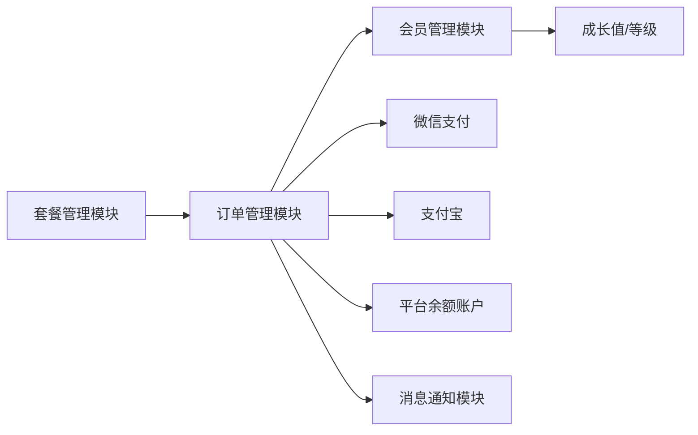
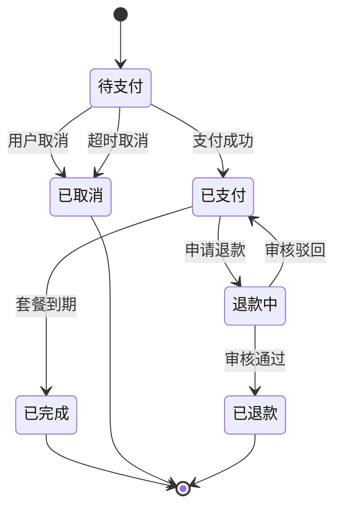

# 订单管理模块需求规格

> **文档分层说明**：本文档按"已实现（现状）/ 本次改造目标（规划中）/ 远期规划"三层组织。
> - **已实现**：当前代码已落地、可直接验证的功能
> - **本次改造目标（规划中）**：已列入[近期改造计划总览](../../05-改造计划/近期改造计划总览.md)，尚未实现的演进方向
> - **远期规划**：已列入[远期改造计划总览](../../05-改造计划/远期改造计划总览.md)，依赖后续阶段的基础设施
>
> **模块边界说明**：本模块覆盖订单创建、支付对接、回调处理、退款申请/审核、自动续费、余额账户管理、对账与订单统计；**套餐定义与定价**由[套餐管理模块](../套餐管理/需求规格.md)承接，**购买后会员等级变更与成长值体系**由[会员管理模块](../会员管理/需求规格.md)承接。
>
> **三后端契约**：Java/Go/Python 三后端 API 契约完全一致，Java 权威，Go/Python 对齐。

## 1. 模块概述

### 1.1 模块定位

订单管理模块负责处理用户购买 VIP 套餐的完整交易流程，包括订单创建、支付对接、履约生效、退款处理、自动续费、余额账户管理与订单状态全生命周期管理。该模块是商业化体系的交易中枢，连接套餐管理（商品）、支付渠道（资金）、余额账户（钱包）和会员管理（权益履约）。

### 1.2 核心价值

| 价值维度 | 具体内容 | 状态 |
|---------|---------|------|
| **交易闭环** | 从下单到权益生效的完整流程自动化，用户无需人工干预 | ✅ 已实现 |
| **支付安全** | 对接主流支付渠道（微信/支付宝，未启用时 mock 回退），保证交易安全和资金准确 | ✅ 已实现 |
| **状态透明** | 订单状态实时可查，支付结果即时反馈 | ✅ 已实现 |
| **余额账户** | 平台余额充值、余额支付、组合支付，资金可流转 | 🔧 本次改造目标 |
| **退款保障** | 按天折算退款（未使用部分全额退，已使用部分不退），退款扣减成长值 | 🔧 本次改造目标 |
| **资金对账** | 每日与支付渠道对账，差异告警 | 🔧 本次改造目标 |

### 1.3 业务目标

#### 功能目标

- 实现套餐购买的完整订单流程（创建→支付→履约→完成）✅ 已实现
- 对接微信支付、支付宝两大主流支付渠道（渠道配置未启用时走 mock）✅ 已实现
- 支持平台余额支付（余额校验、冻结、扣减）🔧 本次改造目标
- 支持组合支付（余额 + 第三方渠道）🔧 本次改造目标
- 提供退款申请、审核的全流程管理，按天折算退款金额 🔧 本次改造目标
- 支持自动续费的定时扣款 ✅ 已实现（部分，见 §3.4）
- 支付成功/退款结果通知用户 🔧 本次改造目标
- 每日与支付渠道对账 🔧 本次改造目标

#### 性能目标

| 指标 | 目标值 | 说明 |
|-----|--------|------|
| 订单创建 | <200ms | 下单接口响应时间 |
| 支付回调处理 | <3s | 从收到回调到权益生效的延迟 |
| 订单列表查询 | <500ms | 用户端和后台分页查询 |
| 支付超时取消 | 30min | 未支付订单自动取消时间 |
| 余额扣减 | <100ms | 余额支付/组合支付中余额扣减延迟 |

### 1.4 模块依赖关系



---

## 2. 订单状态机设计

### 2.1 订单状态定义 (F-OM-001)

| 状态 | 状态码 | 说明 | 后续可能状态 |
|------|--------|------|------------|
| 待支付 | `pending` | 订单已创建，等待用户支付 | 已支付 / 已取消 |
| 已支付 | `paid` | 支付成功，权益已生效 | 已完成 / 退款中 |
| 已完成 | `completed` | 套餐有效期结束，订单归档 | 退款中 |
| 已取消 | `cancelled` | 用户取消或超时自动取消 | - |
| 退款中 | `refunding` | 用户申请退款，等待审核 | 已退款 / 已支付 |
| 已退款 | `refunded` | 退款完成 | - |

### 2.2 状态流转图



### 2.3 状态流转规则

| 流转 | 触发条件 | 处理逻辑 |
|------|---------|---------|
| pending → paid | 支付渠道回调成功（微信/支付宝）、余额支付或组合支付完成 | 更新订单状态、激活会员权益、记录成长值、核销优惠券 |
| pending → cancelled | 用户主动取消 | 释放优惠券（状态 4→1）、解冻余额（组合支付）、记录取消原因 |
| pending → cancelled | 30 分钟未支付 | 定时任务扫描（每 5 分钟），调用渠道关单后自动取消 |
| paid → completed | 套餐有效期到期 | 定时任务扫描，归档订单 |
| paid → refunding | 用户申请退款 | 创建退款记录，等待审核 |
| refunding → refunded | 审核通过 | 执行退款、扣减成长值、退回优惠券、调整套餐到期时间、重新计算会员等级 |
| refunding → paid | 审核驳回 | 恢复订单状态（套餐未到期） |

---

## 3. 订单创建与支付

### 3.1 订单创建 (F-OM-002)

#### 3.1.1 功能描述

用户选择套餐后创建订单，生成订单号并关联套餐信息、价格、优惠券。**已实现**。

#### 3.1.2 创建流程

```
用户选择套餐 + 选择优惠券（可选）+ 选择支付方式
    ↓
前端调用订单创建接口
    ↓
后端校验：
    ├─ 套餐是否在售
    ├─ 支付方式是否合法（wechat/alipay/balance/combined）
    ├─ combined 支付：校验 balanceAmount > 0 且 < payableAmount
    ├─ 防重复下单（Redis 分布式锁，用户+套餐粒度，5 秒，三端统一实现）
    └─ 价格计算（原价 - 促销折扣 - 优惠券抵扣）
    ↓
锁定优惠券（状态改为已锁定，支付成功后才核销）
    ↓
生成订单号（DH + yyyyMMddHHmmss + 6位随机数）
    ↓
记录订单信息（套餐信息冗余存储），expire_time = 创建时间 + 30min
    ↓
返回订单信息（create 不触发渠道下单，由 pay 发起）
```

> **说明**：订单创建时**不校验用户当前等级**（任何等级可购买任意套餐）；**不调用渠道下单**，仅创建订单记录（职责分离），支付链接由 pay 接口获取。

#### 3.1.3 订单字段

| 字段 | 说明 |
|------|------|
| orderNo | 订单号（DH + 时间戳 + 6位随机数） |
| userId | 用户ID |
| packageId | 套餐ID |
| packageName | 套餐名称（冗余存储，防止套餐改名） |
| packageLevel | 套餐对应会员等级 |
| periodDays | 有效期天数 |
| originalPrice | 原价（分） |
| discountAmount | 促销折扣金额（分） |
| couponId | 用户优惠券实例ID |
| couponAmount | 优惠券抵扣金额（分） |
| payableAmount | 应付金额（分） |
| paidAmount | 实付金额（分，支付成功前为 0） |
| payMethod | 支付方式 |
| balanceAmount | 余额支付金额（分，仅组合支付时使用，记录余额支付部分金额） |
| status | 订单状态（1-6） |
| expireTime | 支付超时时间（创建时间 + 30min） |
| effectiveTime | 权益生效时间 |
| packageExpireTime | 套餐到期时间 |
| paidTime | 支付成功时间 |
| cancelReason | 取消原因 |
| isAutoRenew | 是否自动续费订单 |

### 3.2 支付对接 (F-OM-003)

#### 3.2.1 支付方式

| 支付方式 | 编码 | 说明 | 状态 |
|---------|------|------|:----:|
| 微信支付 | `wechat` | 统一下单（native 扫码），返回二维码 URL；渠道未配置时 mock 返回 | ✅ 已实现 |
| 支付宝 | `alipay` | 统一下单，返回支付链接；渠道未配置时 mock 返回 | ✅ 已实现 |
| 平台余额 | `balance` | 校验余额充足→冻结→支付成功扣减、支付失败解冻 | 🔧 本次改造目标 |
| 组合支付 | `combined` | 余额 + 第三方渠道组合支付，余额部分先扣减，剩余走第三方渠道 | 🔧 本次改造目标 |

> **说明**：渠道配置通过 `payment.wechat.enabled`/`payment.alipay.enabled` 控制，未启用时统一下单/验签/退款/关单全部 mock（便于本地联调）。

#### 3.2.2 支付流程

```
用户选择支付方式
    ↓
├─ 微信/支付宝：
│   后端调用支付渠道统一下单接口（pay）
│   返回支付参数（二维码URL / 支付链接）
│   记录支付流水（status=1 处理中）
│   用户完成支付 → 支付渠道异步回调通知后端
│
├─ 平台余额：
│   校验余额 >= 应付金额（不足抛 BALANCE_INSUFFICIENT）
│   冻结余额（frozen_balance += payableAmount）
│   触发 completePayment（置已支付 + 权益生效 + 扣减冻结余额）
│
└─ 组合支付（余额 + 第三方）：
    校验余额 >= balanceAmount（不足抛 BALANCE_INSUFFICIENT）
    冻结余额（frozen_balance += balanceAmount）
    第三方应付金额 = payableAmount - balanceAmount
    调渠道统一下单（第三方部分）→ 返回支付参数
    用户完成第三方支付 → 回调成功后触发 completePayment（扣减冻结余额 + 权益生效）
```

#### 3.2.3 支付回调处理

```
收到支付渠道异步回调（微信/支付宝）
    ↓
验证签名 → 确保回调来源可信（未启用渠道时直接信任）
    ↓
查询订单 → 订单不存在返回失败
    ↓
金额校验 → 回调金额与订单第三方应付金额不一致：
  三端统一抛 A0538（记录日志 + 返回失败）
    ↓
获取订单级分布式锁（payment:lock:{orderNo}）→ 获取失败视为重复回调，幂等返回成功
    ↓
检查订单状态 → 已支付/已完成幂等返回成功；非待支付返回失败
    ↓
completePayment：
  1. 更新订单状态为 paid、记录支付流水
  2. 激活会员权益（等级→套餐等级、来源=package、到期时间叠加、月度配额按任务类型配置）
  3. 记录成长值（change_type=consume，growth_value=paidAmount，1:1 按支付金额）
  4. 核销优惠券（status 4→2，used_order_id 写入，模板 used_qty+1）
  5. 扣减冻结余额（组合支付/余额支付场景）
  6. 累加套餐销量
  7. 删除订单详情缓存
  8. 发送支付成功通知（站内信）
    ↓
返回成功响应给支付渠道
```

> **权益生效内容**：更新会员等级/来源（package）/到期时间（在原到期时间上叠加）/月度配额（按套餐等级权益，含套餐覆盖项）；**成长值按支付金额 1:1 记录**（`consume` 类型）；支付成功后发送站内信通知。

#### 3.2.4 幂等设计

- 支付渠道回调可能重复发送，后端做幂等处理
- **幂等手段**：订单级分布式锁（`payment:lock:{orderNo}`，非阻塞，三端统一实现）+ 订单状态判断（已支付/已完成直接返回成功）
- 支付流水 `payment_no` 唯一索引防重
- 并发回调仅一个执行完整业务，其余返回成功

### 3.3 支付超时处理 (F-OM-004)

#### 3.3.1 功能描述

订单创建后 30 分钟内未支付，自动取消订单。**已实现**（定时任务，每 5 分钟）。

#### 3.3.2 处理流程

```
定时任务扫描（每 5 分钟）
    ↓
查询 status=pending AND expire_time < NOW() 的订单
    ↓
逐条处理：
    ├─ 微信/支付宝 → 调用渠道关单接口（失败仅告警，不中断）
    ├─ 组合支付 → 调用渠道关单 + 解冻余额（frozen_balance -= balanceAmount）
    ├─ 余额支付 → 解冻余额（frozen_balance -= payableAmount）
    ├─ 更新订单状态为 cancelled
    ├─ 释放优惠券（状态 4→1）
    └─ 记录取消原因："系统超时自动取消"
```

### 3.4 自动续费扣款 (F-OM-005)

#### 3.4.1 功能描述

开启自动续费的用户，套餐到期时自动创建续费订单并扣款。**已实现（部分）**。

#### 3.4.2 扣款流程

```
定时任务扫描（每小时执行）
    ↓
查询 status=启用 且 next_renew_time <= NOW() 的自动续费配置
    ↓
逐条执行续费：
    ├─ 校验套餐在售
    ├─ 价格：payable = sale_price × 0.95（95折），discount = 差价
    ├─ 余额支付 → 校验余额、冻结、扣减
    ├─ 微信/支付宝 → 调渠道代扣接口（微信实际走统一下单+用户主动支付，无真实代扣）
    ├─ 扣款成功 → 激活会员权益（有效期叠加）→ 记录成长值（consume）→ 创建已支付续费订单（is_auto_renew=1）
    │          → 更新 next_renew_time = 新到期时间，fail_count 归零
    └─ 扣款失败 → fail_count+1
        ├─ 未达 3 次 → next_renew_time = NOW() + 2 小时（重试）
        └─ 达 3 次 → 关闭自动续费（status=0），记录关闭原因
```

> **说明**：
> - **扣款时机为到期时**（`next_renew_time <= NOW()`）
> - **首次开启自动续费不触发扣款**：配置开启时 `next_renew_time` 未设置（NULL），需下次续费/购买后才有扣款时间
> - 微信渠道 `autoDeduct` 实际走"统一下单+用户主动支付"流程（真实代扣需签约协议，为远期规划）
> - 续费成功后发送站内信通知

### 3.5 余额账户管理 (F-OM-015)

#### 3.5.1 功能描述

平台余额账户支持用户充值、查询余额、余额支付与组合支付。🔧 本次改造目标。

#### 3.5.2 余额账户表设计

| 字段 | 类型 | 说明 |
|------|------|------|
| id | Long | 主键 |
| userId | Long | 用户ID（唯一） |
| balance | Long | 可用余额（分） |
| frozenBalance | Long | 冻结余额（分，支付处理中冻结的金额） |
| version | Integer | 乐观锁版本号 |
| deleted | Integer | 逻辑删除（0-未删除，1-已删除） |
| createBy/createTime/updateBy/updateTime | - | 审计字段 |

> **并发控制**：余额扣减使用乐观锁（`UPDATE ... SET balance=balance-?, version=version+1 WHERE id=? AND version=?`），避免并发扣减超卖。

#### 3.5.3 充值流程

```
用户选择充值金额 + 选择支付方式（微信/支付宝）
    ↓
后端创建充值订单（type=recharge，记录充值金额）
    ↓
调渠道统一下单 → 返回支付参数
    ↓
用户完成支付 → 渠道回调
    ↓
充值成功：balance += 充值金额，记录余额流水（change_type=recharge）
    ↓
发送充值成功通知
```

#### 3.5.4 余额流水

每笔余额变动记录流水（sys_balance_log），包含：用户ID、变动类型（recharge充值/consume消费/refund退款退回/freeze冻结/unfreeze解冻）、变动金额、变动后余额、关联订单号、时间。

---

## 4. 退款处理

### 4.1 退款申请 (F-OM-006)

#### 4.1.1 功能描述

用户可对已支付的订单发起退款申请。**已实现**。

#### 4.1.2 退款条件

| 条件 | 规则 | 状态 |
|------|------|:----:|
| 订单状态 | 已支付（2）/已完成（3）可申请 | ✅ 已实现（三端统一） |
| 退款时限 | 支付成功后 **7 天内**可申请，三端统一校验 | 🔧 本次改造目标（Java/Go 补齐） |
| 促销套餐 | `is_refundable=0` 的套餐不支持退款 | 🔧 本次改造目标 |
| 退款次数 | 每个订单仅可退款一次（唯一约束 + 前置检查） | ✅ 已实现 |

> **说明**：7 天时限校验三端统一实现（Java/Go 补齐，与 Python 端一致，超期抛 `A0534`）；促销套餐不可退校验通过套餐 `is_refundable` 字段判断，不可退时抛 `A0536`。

#### 4.1.3 申请流程

```
用户进入订单详情 → 点击"申请退款"
    ↓
选择退款原因（下拉 + 自定义补充说明）
    ↓
提交退款申请（reason + ":" + customReason 拼接）
    ↓
校验订单归属/状态/退款时限/促销套餐可退性
    ↓
按天折算退款金额（见 §4.1.4）
    ↓
创建退款记录（refund_amount = 折算后金额，used_days = 已使用天数）
    ↓
订单状态变为 refunding
    ↓
通知管理员审核（后台退款审核列表查询）
```

#### 4.1.4 退款金额计算（按天折算）

| 项目 | 计算方式 |
|------|---------|
| 已使用天数 | `used_days = max(1, ceil((NOW() - paid_time) / 86400))`（至少 1 天） |
| 剩余天数 | `remaining_days = period_days - used_days` |
| 退款金额 | `remaining_days <= 0` 时退款金额为 0（已用完不可退）；否则 `refund_amount = paid_amount × remaining_days / period_days`（向下取整到分） |
| 已使用部分 | `paid_amount - refund_amount`（不退） |

> **退款策略**：未使用部分（剩余天数）按比例全额退，已使用部分（已过天数）不退。退款金额记录在 `sys_refund_record.refund_amount`，已使用天数记录在 `used_quota` 字段（复用该字段存储 used_days）。

#### 4.1.5 组合支付订单退款金额拆分

组合支付订单退款时，按余额/第三方支付比例拆分退款金额：

| 拆分项 | 计算方式 |
|--------|---------|
| 余额退款金额 | `refund_amount × (balanceAmount / paidAmount)` |
| 第三方退款金额 | `refund_amount - 余额退款金额` |

### 4.2 退款审核 (F-OM-007)

#### 4.2.1 功能描述

管理员审核退款申请，决定通过或驳回。**已实现**。

#### 4.2.2 审核流程

```
后台退款审核列表（可按状态/订单号/用户名/申请时间筛选）
    ↓
查看退款详情（订单信息、退款原因、退款金额、已使用天数）
    ↓
├─ 审核通过：
│   调用支付渠道退款接口（余额支付/组合支付余额部分直接退回余额）
│   ├─ 退款成功 → 更新订单为 refunded，退款记录 status=2
│   │   → 扣减成长值（change_type=refund_deduct，按退款金额 1:1）
│   │   → 退回优惠券（未使用则 status 2→1，已使用不退回）
│   │   → 调整套餐到期时间 = paid_time + used_days
│   │   → 重新计算会员等级（基于扣减后成长值）
│   │   → 发送退款成功通知
│   └─ 退款失败 → 退款记录 status=3（refund_failed），订单恢复为已支付/已完成，记录错误信息，待自动重试
│
└─ 审核驳回：
    退款记录 status=3（refund_failed），订单恢复为已支付/已完成，记录驳回原因
```

> **说明**：
> - 渠道退款为**同步调用**（无退款异步回调处理）
> - 退款成功**扣减成长值**（`refund_deduct` 类型，按退款金额 1:1 扣减），并基于扣减后成长值重新计算会员等级
> - 退款成功**退回优惠券**：优惠券未使用（订单核销后未用于其他消费）则 status 2→1 退回；已使用不退回
> - 退款成功**调整套餐到期时间**为 `paid_time + used_days`（已使用天数对应的时间点），会员等级基于扣减后成长值重新计算
> - **退款失败自动重试**：定时任务每 30 分钟扫描 status=3 且 retry_count<3 的记录重试，达上限标记"已达重试上限，转为最终失败"（见 §5）

### 4.3 退款渠道

| 原支付方式 | 退款方式 |
|-----------|---------|
| 微信支付 | 调微信退款接口（原路退回） |
| 支付宝 | 调支付宝退款接口（原路退回） |
| 平台余额 | 余额退回（balance += refund_amount，记录余额流水 change_type=refund） |
| 组合支付 | 余额部分退回余额 + 第三方部分调渠道退款（按 §4.1.5 拆分） |

---

## 5. 定时任务

| 任务名 | 执行时机 | 功能 |
|--------|---------|------|
| 订单超时取消 | 每 5 分钟 | pending 且超时订单自动取消（关单 + 解冻余额 + 释放券） |
| 自动续费扣款 | 每 1 小时 | 到期的自动续费配置执行扣款与会员激活 |
| 订单到期归档 | 每 1 小时 | paid 且套餐到期订单置为 completed |
| 优惠券过期 | 每 1 小时 | 未使用且过期用户券置为已过期 |
| 退款失败重试 | 每 30 分钟 | status=3 且 retry_count<3 的退款记录自动重试（上限 3 次） |
| 渠道对账 | 每日 02:00 | 对比系统支付流水与渠道账单，差异记录并告警 🔧 本次改造目标 |

### 5.1 对账机制 (F-OM-016)

🔧 本次改造目标。

#### 5.1.1 对账流程

```
定时任务每日 02:00 执行
    ↓
查询前一日所有支付成功的支付流水
    ↓
调渠道对账接口下载渠道账单（微信/支付宝）
    ↓
逐笔比对：
    ├─ 系统有、渠道有 → 金额一致则通过，不一致记录差异（金额不符）
    ├─ 系统有、渠道无 → 记录差异（系统多单）
    └─ 渠道有、系统无 → 记录差异（渠道多单）
    ↓
差异写入 sys_reconciliation_diff 表
    ↓
差异告警通知运营（站内信 + 邮件）
```

#### 5.1.2 对账差异表设计

| 字段 | 说明 |
|------|------|
| reconciliationDate | 对账日期 |
| orderId/paymentNo | 订单ID/支付流水号 |
| systemAmount | 系统记录金额 |
| channelAmount | 渠道账单金额 |
| diffType | 差异类型（amount_mismatch/system_only/channel_only） |
| status | 处理状态（pending/resolved） |
| handleRemark | 处理备注 |

---

## 6. 后台管理功能

### 6.1 订单列表查询 (F-OM-009)

#### 6.1.1 查询条件

| 条件类型 | 字段 | 说明 |
|---------|------|------|
| 订单号 | orderNo | 精确匹配 |
| 用户信息 | keywords | 用户名/昵称模糊（命中用户后按 userId 过滤） |
| 订单状态 | status | 精确匹配 |
| 支付方式 | payMethod | 精确匹配 |
| 支付时间 | paidTimeStart/End | 范围匹配 |
| 金额区间 | amountMin/amountMax | 应付金额范围（分） |

#### 6.1.2 列表展示字段

| 字段 | 显示名称 | 说明 |
|------|---------|------|
| orderNo | 订单号 | 完整订单号 |
| username | 用户名 | 购买用户 |
| packageName | 套餐名称 | 购买的套餐 |
| payableAmount | 应付金额 | 订单金额 |
| paidAmount | 实付金额 | 实际支付金额 |
| payMethod | 支付方式 | 微信/支付宝/余额/组合支付 |
| status | 订单状态 | 状态标签 |
| paidTime | 支付时间 | 支付成功时间 |
| createTime | 创建时间 | 下单时间 |
| - | 操作 | 详情/退款审核 |

### 6.2 订单详情 (F-OM-010)

#### 6.2.1 详情内容

| 区域 | 内容 |
|------|------|
| 订单信息 | 订单号、套餐信息、金额明细（含余额支付部分）、支付方式、状态、取消原因 |
| 支付流水 | 支付渠道、流水号、金额、状态、回调时间 |
| 退款信息 | 退款记录（如有）：退款单号、金额、已使用天数、原因、状态、审核信息、错误信息 |
| 成长值变动 | 支付时增加的成长值、退款时扣减的成长值 |

### 6.3 退款审核列表 (F-OM-011)

展示所有退款记录：退款单号、订单号、用户名、退款金额、已使用天数、原因、渠道、状态（refunding/refunded/refund_failed）、申请时间、审核时间、审核人、错误信息（退款失败时展示），操作：通过/驳回。

### 6.4 订单统计 (F-OM-012)

#### 6.4.1 统计维度

| 维度 | 指标 | 状态 |
|------|------|:----:|
| 总额 | 总订单数、总收入（已支付+已完成订单实付合计）、总退款、退款率 | ✅ 已实现 |
| 状态分布 | 六种状态订单数 | ✅ 已实现 |
| 支付方式 | wechat/alipay/balance/combined 各占比 | ✅ 已实现 |
| 套餐分布 | 各套餐销量与收入 | ✅ 已实现 |
| 每日趋势 | 按日订单数/收入（近 30 天） | ✅ 已实现 |
| 转化率 | 下单→支付转化率、支付→续费转化率 | 🔧 本次改造目标 |
| 退款原因分布 | 各退款原因占比 | 🔧 本次改造目标 |

#### 6.4.2 转化率统计

| 指标 | 计算方式 |
|------|---------|
| 下单→支付转化率 | 支付成功订单数 / 创建订单总数 × 100% |
| 支付→续费转化率 | 自动续费成功订单数 / 首次支付成功订单数 × 100% |
| 退款率 | 退款成功订单数 / 支付成功订单数 × 100% |

---

## 7. 用户端功能

### 7.1 我的订单 (F-OM-013)

#### 7.1.1 功能描述

用户查看自己的订单记录，支持按状态筛选。**已实现**。

#### 7.1.2 订单列表

| 筛选标签 | 说明 |
|---------|------|
| 全部 | 所有订单 |
| 待支付 | status=pending |
| 已支付 | status=paid |
| 已完成 | status=completed |
| 已取消 | status=cancelled |
| 退款中 | status=refunding |
| 已退款 | status=refunded |

#### 7.1.3 订单卡片信息

| 信息项 | 说明 |
|--------|------|
| 订单号 | 订单号 + 创建时间 |
| 套餐名称 | 购买的套餐 + 等级标签 |
| 到期时间 | 套餐到期时间（有则展示） |
| 应付金额 | ¥XX.XX（原价删除线，有优惠时展示） |
| 订单状态 | 状态标签 |
| 操作按钮 | 待支付：去支付/取消订单；已支付：申请退款/查看详情；其余：查看详情 |

### 7.2 订单详情 (F-OM-014)

| 区域 | 内容 |
|------|------|
| 状态卡片 | 当前订单状态 + 订单号 + 创建时间 + 取消原因 |
| 套餐信息 | 套餐名称、等级、生效/到期时间 |
| 金额明细 | 订单原价、折扣优惠、优惠券抵扣、余额支付、实付金额 |
| 操作按钮 | 待支付：去支付/取消；已支付：申请退款（详情页入口） |

> 支付弹窗（选择支付方式/二维码/倒计时）由前端 `order/my` 页面的支付弹窗组件提供，调用发起支付接口获取支付参数。

### 7.3 余额账户 (F-OM-017)

🔧 本次改造目标。

| 功能 | 说明 |
|------|------|
| 余额查询 | 展示可用余额、冻结余额 |
| 充值入口 | 选择金额+支付方式，调充值接口 |
| 余额流水 | 查看余额变动记录（充值/消费/退款退回） |

---

## 8. 非功能需求

### 8.1 性能需求

| 指标 | 要求 | 实际 |
|-----|------|------|
| 支付回调处理 | <3s 完成权益生效 | 同事务完成，无外部阻塞调用 |
| 订单超时扫描 | 每 5 分钟执行，单次扫描 <30s | 逐条处理，订单量小时即时完成 |
| 自动续费扫描 | 每小时执行，单次扫描 <60s | 逐条处理 |
| 订单列表查询 | 分页查询 <500ms，支持万级订单 | 索引覆盖（user_id+status/status/expire_time 等） |
| 订单详情查询 | Redis 缓存（10 分钟），越权校验 | `order:detail:{orderNo}` |
| 余额扣减 | <100ms，乐观锁 | 单行 UPDATE，无外部调用 |
| 对账任务 | 每日 02:00，单次 <5min | 逐笔比对，分渠道并行 |

### 8.2 安全需求

| 方面 | 措施 |
|-----|------|
| 支付签名验证 | 渠道回调验签（渠道未启用时 mock 信任） |
| 金额校验 | 回调金额与订单应付金额一致，三端统一抛 A0538 |
| 幂等处理 | 订单级分布式锁 + 状态判断 + 支付流水唯一索引 |
| 防重复下单 | 订单级分布式锁（用户+套餐，5 秒），三端统一实现 |
| 余额并发安全 | 乐观锁（version 字段），扣减时校验版本号 |
| 越权防护 | 用户端操作校验订单归属（非本人返回 A0530，不泄露订单存在性） |
| 敏感信息 | 支付流水号等不对外展示原始渠道报文 |

### 8.3 可靠性需求

| 方面 | 要求 | 实际 |
|-----|------|------|
| 回调重试 | 支付渠道回调失败时自动重试（渠道侧） | 依赖渠道重试；系统内幂等不重复生效 |
| 退款容错 | 退款失败时记录错误信息并自动重试 | ✅ 定时任务重试（上限 3 次） |
| 超时关单 | 超时取消前调用渠道关单接口 | ✅（关单失败仅告警不中断） |
| 对账差异 | 每日对账发现差异时告警 | 🔧 本次改造目标 |

### 8.4 并发处理

| 场景 | 处理策略 |
|------|---------|
| 并发支付回调 | 订单级分布式锁（`payment:lock:{orderNo}`），三端统一实现 |
| 优惠券并发使用 | 条件 UPDATE（status=1 → 4）+ 唯一约束 |
| 防重复下单 | 订单级分布式锁（`order:lock:{userId}:{packageId}`，5 秒），三端统一实现 |
| 余额并发扣减 | 乐观锁（version 字段），扣减失败重试（最多 3 次） |
| 自动续费并发 | 逐条处理 + 异常隔离（单条失败不影响其余） |

> **三后端一致性**：订单锁、支付回调锁三端统一使用 Redis 分布式锁实现（Java Redisson / Go go-redis / Python redis-py）。

---

## 9. 远期规划

1. **微信真实代扣**：当前微信"代扣"实际走统一下单+用户主动支付，真实代扣需签约协议（微信委托扣款），远期对接。
2. **电子发票**：支持电子发票开具，对接第三方开票平台。
3. **多币种支持**：若拓展海外市场，支持多币种支付与结算。

> **说明**：原"待确认事项"已全部定论并纳入本次改造目标或远期规划，具体见上述各章节。
