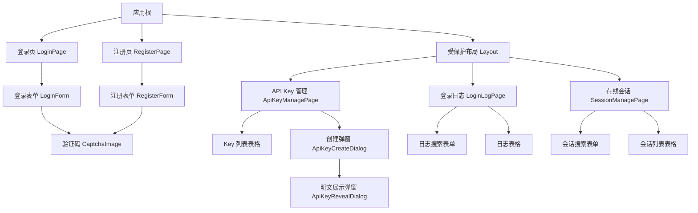

# 认证管理模块 - 前端实现设计

## 1. 文档概述

本文档描述认证管理模块的前端实现方案。认证模块采用 Session 模式，前端不存储任何 Token，会话凭证由浏览器 Cookie（Web 端）或请求头（移动端/小程序）自动携带。前端聚焦登录/注册、API Key 管理、登录日志、多端会话管理的组件架构、状态管理与路由守卫设计；权限信息（用户、角色、权限标识、菜单树）在登录/注册成功后统一加载并缓存于全局 authStore，供路由守卫与按钮级权限控制消费。

## 2. 组件树设计

| 组件 | 职责 | 复用性 |
|------|------|--------|
| LoginForm | 登录表单展示与提交，含记住我选项 | 页面内部 |
| RegisterForm | 注册表单展示与提交，成功后自动登录 | 页面内部 |
| CaptchaImage | 验证码图片展示与点击刷新 | 登录/注册复用 |
| ApiKeyCreateDialog | API Key 创建表单（名称、过期时间） | 页面内部 |
| ApiKeyRevealDialog | API Key 明文一次性展示与复制 | 页面内部 |
| LoginLogPage | 登录日志查询、筛选、导出 | 页面内部 |
| SessionManagePage | 在线会话查询与踢出 | 页面内部 |

## 3. 状态管理

### 3.1 Store 模块划分

| Store 模块 | 作用域 | 职责 |
|-----------|--------|------|
| authStore | 全局 | 登录上下文与权限信息，驱动路由守卫与权限指令 |
| 页面组件状态 | 页面级 | 验证码、API Key 列表、日志列表、会话列表均在各自页面组件内管理 |

### 3.2 核心状态（authStore）

| 状态字段 | 类型 | 持久化 | 说明 |
|---------|------|--------|------|
| user | Object | 否 | 当前用户基本信息 |
| roles | Array | 否 | 用户角色列表（仅启用角色） |
| perms | Array | 否 | 权限标识列表，驱动按钮级权限 |
| menus | Array | 否 | 菜单树，驱动动态路由渲染 |

> Session 模式下前端不存储 Token，认证凭证由 Cookie/请求头自动管理，会话续期由后端滑动完成对前端透明。

### 3.3 核心操作（authStore）

| 操作 | 说明 |
|------|------|
| loadAuthInfo | 登录/注册成功后调用权限信息接口，加载 user/roles/perms/menus |
| generateRoutes | 基于 menus 动态注册受保护路由 |
| logout | 调用注销接口，清空登录上下文，跳转登录页 |
| resetAuth | 收到 401 时清空登录上下文 |

## 4. 路由设计

| 路由路径 | 组件 | 访问控制 | 守卫说明 |
|---------|------|---------|---------|
| /login | LoginPage | 公开 | 已登录则重定向首页 |
| /register | RegisterPage | 公开 | 已登录则重定向首页 |
| /system/api-key | ApiKeyManagePage | 需登录态 | 全局守卫校验会话有效性 |
| /system/login-log | LoginLogPage | sys:auth:log:list | 菜单权限控制可见性 |
| /system/online-session | SessionManagePage | sys:auth:session:list | 菜单权限控制可见性 |

**导航守卫策略**：
- 全局前置守卫：无权限信息时调用权限信息接口验证会话，成功则动态生成路由并放行，401 则跳转登录页
- 访问未授权菜单路由跳转 403 页
- 登录日志/会话管理路由由权限信息接口返回的菜单树动态生成，菜单可见性由角色权限分配控制

## 5. 数据流

### 5.1 数据获取策略

登录、注销、注册、验证码、权限信息、API Key 增删查、登录日志查询导出、在线会话查询踢出均通过 SDK 封装的认证接口调用，各页面组件内完成请求与状态管理。登录/注册成功后由 authStore 统一加载并缓存权限信息，避免重复请求。

### 5.2 缓存策略

| 数据类型 | 缓存位置 | 失效策略 |
|---------|---------|---------|
| 权限信息（user/roles/perms/menus） | authStore | 注销或收到 401 时清空 |
| 验证码 | 页面组件状态 | 校验成功后失效，点击刷新重新获取 |
| API Key 列表 | 页面组件状态 | 页面卸载时清除 |
| 登录日志/会话列表 | 页面组件状态 | 页面卸载时清除 |

### 5.3 更新策略

- API Key 创建/吊销后刷新列表；列表仅展示 Key 前缀，明文仅在创建时一次性返回
- 会话踢出后刷新会话列表；超级管理员不可被踢出，前端据返回数据禁用对应按钮
- 权限信息仅在登录/注册/注销时整体变更，不做增量更新

### 5.4 请求错误与会话失效处理

| 错误类型 | 处理方式 |
|---------|---------|
| 验证码错误/过期 | 显示提示，自动刷新验证码并清空输入 |
| 网络错误 | 显示网络连接失败提示 |
| 401 会话失效 | 清空 authStore 登录上下文，跳转登录页 |

**会话失效场景统一处理**：会话过期、主动注销、被管理员踢出、账户被禁用/删除均会在下次请求收到 401，前端统一拦截并跳转登录页，不区分失效原因。

## 6. 交互设计决策

| 交互场景 | 技术选型/决策 | 理由 |
|---------|-------------|------|
| 会话凭证携带 | Web 端依赖 Cookie 自动携带，移动端/小程序通过请求头 X-Session-Id | 前端不手动管理凭证，简化多端实现 |
| 多端会话隔离展示 | 会话列表展示 deviceType 字段区分登录端 | 直观呈现同账号多端在线状态，支持按端踢出 |
| 验证码刷新 | 页面加载预加载，点击图片刷新，校验失败自动刷新 | 减少用户等待，失败后保证可用性 |
| API Key 明文展示 | 创建成功后弹窗一次性展示，提供复制按钮并强提示 | 明文仅此一次返回，强调妥善保存 |
| 记住我 | 表单字段传递选择，不感知后端凭证生命周期 | 仅控制会话保持时长，前端逻辑最小化 |
| 注册自动登录 | 注册成功返回会话与用户信息，直接加载权限跳转首页 | 免去注册后再次登录的重复操作 |

## 7. 公共组件使用

| 公共组件 | 使用场景 | 配置要点 |
|---------|---------|---------|
| CaptchaImage 验证码组件 | 登录页、注册页 | 点击图片触发刷新；captchaKey 与输入值一同提交校验 |
| 列表页公共组件（分页、搜索表单、表单弹窗、二次确认弹窗） | 登录日志、在线会话、API Key 管理 | 复用通用交互与文案；二次确认用于注销、API Key 吊销、会话踢出 |
