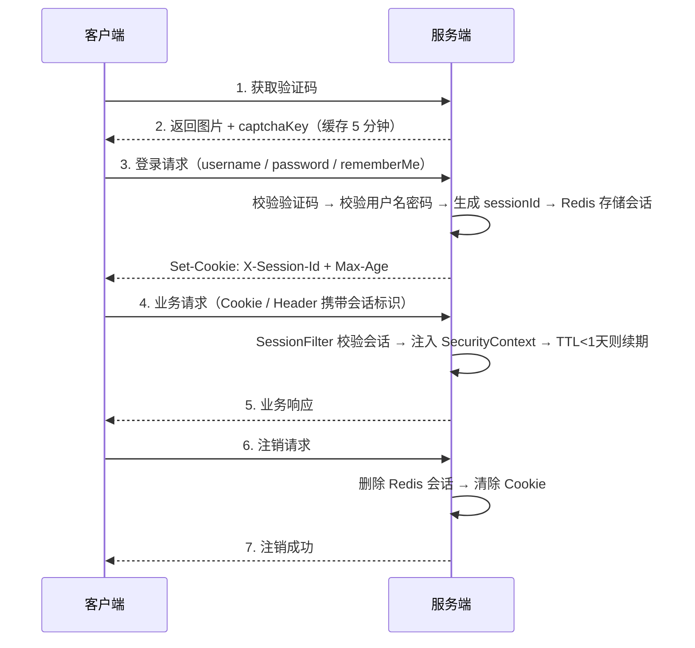

# 认证管理模块 - 后端实现设计

## 1. 文档概述

本文档描述认证管理模块的后端实现方案，包括认证流程、会话机制、验证码生成、API Key 认证等核心业务逻辑的实现要点。

- **API 接口规范**：参见 [API接口.md](./API接口.md)
- **数据库设计**：参见 [02-系统架构/03-数据库设计.md](../../../02-系统架构/03-数据库设计.md)

## 2. 数据传输对象

### 2.1 会话数据结构

Redis `session:{sessionId}` 存储会话 JSON，作为请求鉴权的数据来源：

| 字段 | 说明 |
|------|------|
| userId | 用户 ID |
| username | 用户名（小写） |
| nickname | 昵称 |
| deptId | 部门 ID |
| dataScope | 数据范围 |
| authorities | 权限标识（鉴权快照，加速鉴权） |
| deviceType | 登录端类型（web/android/flutter/miniprogram，默认 web） |
| loginIp | 登录来源 IP |
| loginTime | 登录时间 |
| lastAccessTime | 最后访问时间（滑动续期时刷新） |

TTL 为 7 天，每次请求滑动续期；会话内嵌的鉴权快照由 §5.2 的失效策略保证时效。

> **在线会话列表（F-AM-011）**：`GET /api/v1/auth/sessions` 通过 SCAN `session:*`（排除 `session:user:*` 索引键）并按 username 精确过滤实现，返回 sessionId/deviceType/loginTime/ip/lastAccessTime；踢出会话时删除会话键并从 `session:user:{userId}` 索引移除对应元素，超级管理员（authorities 含 `ROLE_ROOT`）会话拒绝踢出。

> **同时在线设备数上限（F-AM-011）**：`USE_MULTI_POINT=true` 时，登录/注册在写入会话后调用设备数限制：索引 `session:user:{userId}`（ZSet，member=sessionId，score=登录 epoch **秒**）ZADD 新会话并刷新 TTL → ZCARD 读在线数 → 超过上限时 ZRANGE 升序取最早登录的会话（排除本次新会话）→ 删除 `session:{sessionId}` 并 ZREM 对应元素。上限取值：`sys_user` 角色含 ROOT/ADMIN → 固定 10；否则按会员等级读 `sys_member_benefit.max_devices`（无会员档案按 level_0=1）。三端（Java/Go/Python）共用同一 ZSet 结构，行为完全一致。注销/踢出/批量踢出同步 ZREM（批量踢出按 userId 清理索引）。

## 3. 架构设计

### 3.1 认证流程图



### 3.2 过滤器链路

```
HttpServletRequest
      ↓
[TraceIdFilter]                  ← 生成/传播 TraceId
      ↓
[CorsFilter]                     ← 跨域处理
      ↓
[RequestLogFilter]               ← 请求日志记录
      ↓
[ApiKeyAuthenticationFilter]     ← 识别 dhak_ 前缀走 API Key 校验分支，命中后注入 SecurityContext
      ↓
[SessionFilter]                  ← Session 校验 + SecurityContext 注入 + 滑动续期
      ↓
[UsernamePasswordAuthenticationFilter]
      ↓
[ExceptionTranslationFilter]
      ↓
FilterSecurityInterceptor
      ↓
HttpServletResponse
```

## 4. 核心业务逻辑

### 4.1 用户认证流程

#### 4.1.1 登录认证

**入口**：`AuthServiceImpl.login()`

1. **用户名预处理**：转换为小写并去除首尾空格
2. **认证执行**：加载用户信息并校验密码
3. **会员档案兜底**（认证成功后）：确保 `sys_member` 行存在（三端 `get_or_init_member` / `ensureMemberProfile` / `EnsureMemberProfile`，幂等，已有活跃档案不重建）。种子账号（root/admin）与后台管理界面创建的用户不走注册流程，若无此兜底，AI 计费配额校验会因无会员权益档案 fail-closed 误报"配额不足"
4. **会话创建**（认证成功后）：生成 sessionId = UUID；写入 Redis `session:{sessionId}`（TTL 7 天，与是否记住我无关）；写入会话索引 `session:user:{userId}`（Set 结构，元素为 `sessionId:deviceType`）；Set-Cookie 属性见 §6.2
5. **返回登录结果**：sessionId 与用户基本信息

#### 4.1.2 请求认证（过滤器）

**入口**：`SessionFilter`

1. **会话标识提取**：优先从 Cookie 读取 `X-Session-Id`，兜底从请求头读取（移动端）
2. **会话查询**：查询 `session:{sessionId}`，不存在返回 401
3. **上下文注入**：解析会话内容，构建认证对象并注入 SecurityContext
4. **滑动续期**：TTL 剩余 < 1 天时续期为 7 天
5. **白名单路径**（登录、注册、验证码等）跳过过滤

### 4.2 验证码生成与校验

#### 4.2.1 验证码生成

**入口**：`AuthServiceImpl.getCaptcha()`

1. **类型选择**：按配置 `captcha.type` 选择生成器（`CIRCLE`/`GIF`/`LINE`/`SHEAR`）
2. **参数配置**：图片尺寸、干扰元素个数、字符长度、字体、透明度由 `captcha.*` 配置项控制
3. **生成**：生成验证码文本与图片，转换为 Base64 字符串
4. **缓存存储**：`captchaKey` = UUID；Redis 键 `captcha_code:{captchaKey}` 存验证码文本，过期时间 `captcha.expire-seconds`（默认 300 秒）
5. **返回结果**：`captchaKey` 与 `captchaBase64`

#### 4.2.2 验证码校验

**入口**：登录与注册方法内联

1. **参数提取**：`captchaCode`（用户输入）、`captchaKey`（缓存键）
2. **缓存查询**：`captcha_code:{captchaKey}` 不存在时返回 `VERIFY_CODE_TIMEOUT`
3. **比对**：大小写不敏感，失败返回 `VERIFY_CODE_ERROR`，成功后立即删除缓存（一次性有效）

### 4.3 注销

**入口**：`AuthServiceImpl.logout()`

1. **会话标识提取**：从 Cookie 或 `X-Session-Id` 请求头提取
2. **会话删除**：删除 `session:{sessionId}`，会话立即失效
3. **索引与缓存清理**：从 `session:user:{userId}` 移除当前端元素；清理 `user:info:{userId}` 与 `user:perms:{userId}`（下次请求重建）
4. **上下文清理**：清空 SecurityContext

> 多端会话共存策略下，注销仅清理当前端会话与索引元素，不影响该用户其他端的活跃会话。

### 4.4 会话续期机制

`SessionFilter` 在每次请求时检查 Redis 中会话的 TTL：剩余 < 1 天（86400 秒）时自动续期为 7 天（604800 秒）；连续 7 天无操作会话自然过期。此机制对前端完全透明。

### 4.5 API Key 认证

API Key 面向机器对机器（M2M）调用场景，是默认永不过期的长期身份凭证，其定位、接口约定与使用方式见 [API Key认证.md](./API%20Key认证.md)。

#### 4.5.1 API Key 创建

**入口**：`ApiKeyService.create()`

1. **凭证生成**：随机字符串拼接固定前缀 `dhak_` 得到明文（总长 53 字符）；截取 9 字符前缀片段（`keyPrefix`，如 `dhak_a1b2`）用于列表辨识
2. **哈希存储**：计算明文 SHA-256 哈希，数据库仅存储哈希值、名称、前缀、归属用户、过期时间
3. **返回结果**：明文仅在创建响应中返回一次

#### 4.5.2 API Key 校验（独立过滤器）

**入口**：`ApiKeyAuthenticationFilter`（Java）/ `ApiKeyAuthMiddleware`（Go）/ `ApiKeyAuthMiddleware`（Python）

1. **凭证提取**：从 `Authorization` 请求头获取凭证，移除 `Bearer ` 前缀；Anthropic 协议兼容路径直接从 `x-api-key` 请求头取原始 Key
2. **类型识别**：`dhak_` 前缀走 API Key 分支，否则交由 `SessionFilter` 走会话认证
3. **哈希比对（直查库）**：计算 SHA-256 后直接查询 `sys_api_key`（命中 `key_hash` 唯一索引且 `revoked_at IS NULL`）；三端均不做 Redis 缓存，因此吊销后不存在缓存延迟窗口
4. **有效性检查**：校验 Key 是否存在且 `status=1`、是否已过期（`expiresAt`），失败返回 `A0230` token 无效或已过期
5. **用户状态检查**：Key 所属用户不存在或已禁用时拒绝请求
6. **上下文注入**：以 Key 所属用户身份构建认证对象并注入 SecurityContext，同时记录 `lastUsedAt`

#### 4.5.3 跨后端共享

API Key 存储于共享数据库，三个后端服务复用同一份 Key 数据，校验逻辑一致：

| 后端 | 校验入口 | 说明 |
|------|---------|------|
| Java | `ApiKeyAuthenticationFilter`（独立 Filter） | 识别 `dhak_` 前缀走 API Key 分支 |
| Go | `ApiKeyAuthMiddleware`（独立中间件） | 共享数据库，校验逻辑一致 |
| Python | `ApiKeyAuthMiddleware`（独立 ASGI 中间件） | 算法服务复用同一 Key 体系 |

#### 4.5.4 AI 计费配额协作

API Key 认证通过后，userId 随 `SecurityContext` 注入请求上下文。AI 计费模块在处理 M2M 调用时，从上下文提取 userId 校验调用配额，配额超限时拒绝请求，三端后端在认证通过后均以相同方式注入 userId。

#### 4.5.5 API Key 删除/吊销

**入口**：`ApiKeyService.revoke()`（Java `revokeApiKey()` / Go / Python `delete_api_key()`）

1. **归属校验**：仅允许吊销当前用户自己创建的 Key
2. **软吊销**：置 `revoked_at = now()`，**不做物理删除**；`key_hash` 永久保留，以便继续识别并拒绝已泄露的旧密钥
3. **立即生效**：列表查询与认证查询均带 `revoked_at IS NULL` 过滤，且认证直查库无缓存，吊销后下一次请求即被拒绝

#### 4.5.6 Redis 降级策略（Python 端）

API Key 认证依赖 Redis 缓存加速权限查询。Redis 不可用时，`data_scope` 与 `perms` 均采用**最小权限**降级方向：

| 字段 | Redis 可用 | Redis 不可用（降级） | 说明 |
|------|-----------|-------------------|------|
| `data_scope` | 查询角色最大数据范围 | `3`（仅本人） | 降级为最小数据范围，与 `perms` 降级方向一致 |
| `perms` | 查询角色权限标识集合 | `set()`（空集） | 无任何操作权限 |

> **设计原则**：Redis 故障且无法获取角色权限时，API Key 请求应仅能访问本人数据（`data_scope=3`）且无细粒度操作权限，与行级数据权限过滤协同，收敛 Redis 故障期间的越权风险。

## 5. 缓存设计

### 5.1 Redis 缓存策略

| 缓存对象 | 缓存 Key | 数据类型 | 过期时间 | 更新策略 |
|---------|---------|---------|---------|---------|
| 验证码文本 | `captcha_code:{captchaKey}` | String | 5 分钟 | 校验成功后立即删除 |
| 账户绑定验证码 | `verify_code:{type}:{account}` | String | 5 分钟 | 校验成功后立即删除 |
| 用户会话 | `session:{sessionId}` | String (JSON) | 7 天 | 每次请求滑动续期，注销时删除 |
| 用户会话索引 | `session:user:{userId}` | ZSet（member=sessionId，score=登录 epoch 秒） | 7 天 | 仅多点登录开启时维护：登录/注册 ZADD 元素并按同时在线设备数上限踢出最早会话、注销/踢出 ZREM 元素、批量踢出用户时清空 |
| 登录失败计数（用户名维度） | `login:fail:{username}` | String | 30 分钟 | 成功登录清零；锁定期内累计 |
| 登录失败计数（IP 维度） | `login:fail:ip:{ip}` | String | 30 分钟 | 成功登录清零；锁定期内累计 |
| 角色权限 | `role:perms:{roleCode}` | String (JSON 数组) | 30 分钟 | 角色变更时删除重建 |

### 5.2 缓存失效策略

| 失效触发场景 | 失效方式 | 说明 |
|-------------|---------|------|
| 验证码校验成功 | 主动删除 | 立即删除缓存键，一次性有效 |
| 验证码超时 | 自动过期 | Redis TTL 到期自动清理 |
| 会话注销 | 主动删除 | 立即删除 Redis key 并从索引 ZREM 对应元素 |
| 会话自然过期 | 自动过期 | 7 天无操作后 TTL 到期 |
| 会话滑动续期 | TTL 重置 | 每次请求 TTL<1天时续期为7天 |
| 会话踢出 | 主动删除 | 管理员踢出后立即删除并从索引 ZREM 对应元素 |
| 同时在线超上限 | 主动删除 | 登录/注册时 ZCARD 超上限 → 删除最早登录会话的 key 并 ZREM，被踢端下次请求 401 |
| 权益 `max_devices` 调整 | 无需失效 | 上限在每次登录时实时读取等级权益，无需清缓存 |
| 角色变更（权限调整/角色删除/角色禁用） | 主动删除 | 反查该角色关联的活跃用户，SCAN `session:*` 按 userId 匹配批量删除 `session:{sessionId}`（不依赖多点登录索引）并清空索引；同时删除 `role:perms:{roleCode}` 缓存 |

> **角色变更权限联动**：会话内嵌鉴权快照，角色变更时必须联动失效受影响用户的全部会话，确保权限即时刷新。索引仅在多点登录开启时维护，故批量踢出不依赖索引、直接扫描会话空间匹配用户。会话清除由认证模块提供能力，由用户管理/角色管理模块在用户/角色调整时触发。

## 6. 安全设计

### 6.1 密码安全

| 策略项 | 配置值 | 实现方式 |
|--------|--------|---------|
| 密码存储 | 加密存储（自带盐值） | 不存储明文密码 |
| 工作因子 | 10（默认） | 抗彩虹表攻击 |
| 密码比对 | 加密比对 | 每次比对自动加盐 |

### 6.2 会话标识安全

会话标识的 Cookie 属性（HttpOnly / Secure / SameSite / Path / Max-Age）与"记住我"的环境取值见 [持久登录设计.md](./持久登录设计.md)。

| 安全措施 | 实现方式 | 说明 |
|---------|---------|------|
| SessionId 随机 | UUID | 不可预测，防暴力猜解 |
| 即时吊销 | Redis 删除 | 注销时立即删除，无滞后 |

### 6.3 防暴力破解

| 防护措施 | 实现方式 | 说明 |
|---------|---------|------|
| 验证码 | 图形验证码 | 防止自动化脚本攻击 |
| 验证码有效期 | 5 分钟 | 限制验证码使用窗口 |
| 验证码一次性 | 使用后失效 | 防止重放攻击 |
| 登录失败锁定 | 用户名维度与 IP 维度独立计数，任一维度连续 5 次失败即锁定 30 分钟 | 双键计数 `login:fail:{username}` 与 `login:fail:ip:{ip}`；任一达阈值即拒绝登录（含正确密码）；成功登录两个键一并清零；非凭证类异常不计入 |
| 用户名规范 | 小写 + 去空格 | 统一格式，避免枚举 |

### 6.4 CSRF 防护

当前 CSRF 防护已禁用。

**理由**：
- 会话 Cookie 使用 `SameSite=Lax`，跨站请求不会携带 Cookie
- CORS 白名单限制 + `allowCredentials=true` 仅允许可信 Origin
- 移动端使用 `X-Session-Id` 请求头，不受 CSRF 影响

## 7. 并发控制

### 7.1 多端会话共存控制

**策略**：多端会话共存（不互踢）。同一账号在 Web + 移动端 + 小程序 + 桌面端同时登录时，各端独立持有会话，按 deviceType 区分存储；管理员可通过会话管理接口手动踢出指定会话。

**会话索引**：Redis 维护 `session:user:{userId}`（Set 结构，元素为 `sessionId:deviceType`），登录时写入、注销/踢出时移除对应元素、角色变更时清空整组。

**同端重复登录**：同一 deviceType 重复登录时替换同端旧会话（删除旧会话并从索引移除），避免同端会话堆积。

**管理员踢出**：管理员调用 `DELETE /api/v1/auth/sessions/{sessionId}` 踢出指定会话，后端删除对应 `session:{sessionId}` 并从索引移除；超级管理员会话不可被踢出。

## 8. 配置项

### 8.1 Session 配置

Session 相关参数由 `SecurityConstants` 统一常量定义：

| 配置项 | 说明 | 默认值 |
|--------|------|--------|
| `SESSION_TTL` | Session Redis 过期时间（秒） | 604800（7 天） |
| `RENEW_THRESHOLD` | 滑动续期阈值（秒） | 86400（1 天） |
| `SESSION_COOKIE_MAX_AGE_REMEMBER` | 记住我时 Cookie Max-Age（秒） | 604800（7 天） |
| `SESSION_COOKIE_MAX_AGE_SESSION` | 非记住我时 Cookie Max-Age（秒） | -1（会话级） |
| `SESSION_COOKIE_NAME` | 会话 Cookie 名称 | `X-Session-Id` |

### 8.2 安全配置

| 配置项 | 说明 | 默认值 |
|--------|------|--------|
| `security.ignore-urls` | 忽略认证的 URL 列表 | 见配置文件 |

## 9. 异常处理

| 异常类型 | HTTP 状态码 | 错误码 | 说明 |
|---------|------------|--------|------|
| 用户名不存在 | 401 | UNAUTHORIZED | `UsernameNotFoundException` |
| 密码错误 | 401 | UNAUTHORIZED | `BadCredentialsException` |
| 账号已禁用 | 403 | FORBIDDEN | `DisabledException` |
| 账号已锁定 | 403 | FORBIDDEN | `LockedException` |
| 凭证过期 | 401 | CREDENTIALS_EXPIRED | `CredentialsExpiredException` |
| Session 不存在 | 401 | TOKEN_INVALID | 未登录或已注销 |
| Session 已过期 | 401 | TOKEN_INVALID | 7 天无操作自然过期 |
| 验证码超时 | 400 | VERIFY_CODE_TIMEOUT | 缓存不存在 |
| 验证码错误 | 400 | VERIFY_CODE_ERROR | 比对失败 |

## 10. 事务边界

认证模块主要涉及只读操作，事务边界如下：

| 操作 | 事务类型 | 说明 |
|------|---------|------|
| 用户登录 | 无事务 | 读取用户信息，创建会话 |
| 验证码校验 | 无事务 | Redis 读取 |
| 注销 | 无事务 | Redis 写入，不需要数据库事务 |

- 认证模块不涉及用户数据变更，密码修改等操作由用户管理模块负责
- 登录日志记录异步处理

## 11. 监控与日志

### 11.1 关键日志点

| 日志点 | 级别 | 说明 |
|--------|------|------|
| 登录成功 | INFO | 记录用户名、IP、时间 |
| 登录失败 | WARN | 记录失败原因（密码错误、账号禁用等） |
| Session 验证失败 | WARN | 记录会话异常（不存在、过期） |
| 验证码校验失败 | DEBUG | 记录客户端 IP、频率 |
| 注销操作 | INFO | 记录注销用户、时间 |

### 11.2 监控指标

| 指标 | 说明 | 告警阈值 |
|------|------|---------|
| 登录失败率 | 失败次数/总次数 | > 30% |
| 会话验证失败率 | 无效或过期会话 | > 10% |
| 验证码生成速率 | 每秒生成次数 | > 100/s（可能刷验证码） |

---

## 12. 异步场景的登录上下文传播

异步任务（MQ 消费者、异步方法、异步任务）不继承请求上下文，需显式传播登录上下文：

| 端 | 异步路径 | 处理方式 |
|---|---|---|
| Java | 异步方法 | 异步装饰器同时传播登录上下文与日志上下文 |
| Java | MQ 消费者 | 以系统身份执行（系统用户拥有全部数据权限），满足导出/下载等系统级任务需求 |
| Go | DLQ 消费者 | 从消息体注入用户 ID；数据权限未设置时按安全默认值处理 |
| Python | MQ handler | 从消息体恢复用户 ID 到上下文；需要数据权限时查询用户最大数据范围 |

---

## 13. 三端实现差异对比

| 特性 | Java | Go | Python |
|------|------|-----|--------|
| **验证码生成方式** | Hutool Captcha（4 种类型） | base64Captcha（digit driver） | Pillow + Redis |
| **Session TTL 续期** | Redis `getExpire` + `expire` | Redis `TTL` + `Expire` | Redis `ttl` + `expire` |

**三端一致项**（入口命名与配置位置不同，行为一致）：验证码校验内联于登录/注册方法、API Key 独立过滤器/中间件、Session 参数集中常量定义、`login:fail:{username}` + `login:fail:ip:{ip}` 双键登录失败计数、多端会话共存与会话索引、API Key 前缀与 `revoked_at` 软吊销（哈希直查库、无缓存）、注销清理范围、记住我 Cookie Max-Age。
