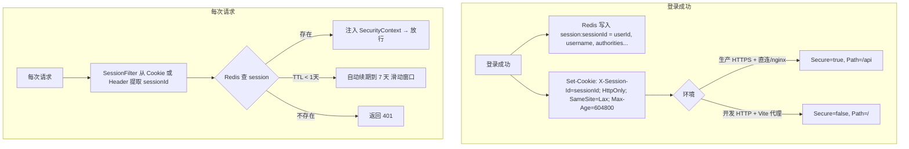
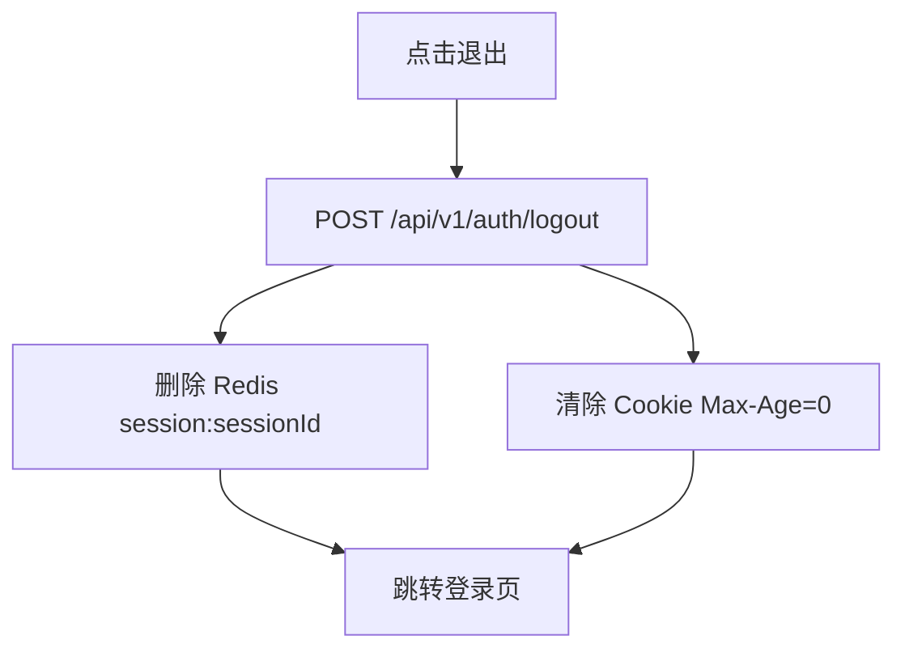

# 持久登录设计

## 1. 方案概述

系统采用 **Session Cookie** 认证方案。登录后后端创建 Session 并存入 Redis，Web 端通过 `Set-Cookie: X-Session-Id` 自动携带，移动端通过 `X-Session-Id` 请求头传递。



## 2. 核心特性

| 特性 | 说明 |
|------|------|
| **零前端 Token 管理** | 前端不存储任何 token，Cookie 由浏览器自动管理 |
| **防 XSS 窃取** | HttpOnly Cookie，JavaScript 完全无法访问 session 标识 |
| **滑动续期** | 每次请求自动续期，持续使用无需重新登录 |
| **即时吊销** | 注销时删除 Redis session，立即生效 |
| **7 天有效期** | 连续 7 天无操作后会话自动过期 |

## 3. 存储策略

| 端 | 存储方式 | 说明 |
|----|---------|------|
| **Web** | HttpOnly Cookie `X-Session-Id` | 浏览器自动携带，无法被 JS 读取 |
| **移动端** | 安全存储（Keychain/Keystore） | 登录响应返回 sessionId，客户端手动设置请求头 |

## 4. Cookie 属性

| 属性 | 生产环境 | 开发环境 | 作用 |
|------|---------|---------|------|
| `HttpOnly` | `true` | `true` | JavaScript 无法读取 |
| `Secure` | `true` | `false` | 仅 HTTPS 传输（开发环境 HTTP 需关闭，否则浏览器丢弃 Cookie） |
| `SameSite` | `Lax` | `Lax` | 防止跨站请求携带 |
| `Path` | `/api` | `/` | 仅 API 路径携带（开发环境 Vite 代理前缀为 `/java-api`/`/py-api`，`Path=/api` 无法匹配，需用 `/`） |
| `Max-Age` | `604800`（记住我）/ `-1`（会话级） | 同左 | 7 天持久化 vs 浏览器关闭清除 |

> `Secure` 和 `Path` 通过各后端配置文件按环境切换，无需改代码。

## 5. Redis Session 结构

```
Key: session:{sessionId}
Value (JSON): {
  "userId": 1,
  "username": "admin",
  "nickname": "管理员",
  "deptId": 1,
  "dataScope": 1,
  "authorities": ["ROLE_ADMIN"]
}
TTL: 604800 (7天，每次请求滑动续期)
```

### 5.1 权限时效保障

Session 内嵌 `authorities`/`dataScope` 作为鉴权快照加速请求鉴权。为避免角色变更后用户在 7 天滑动期内持有旧权限导致越权，系统维护 `session:user:{userId}` 索引（Set 结构，元素为 `sessionId:deviceType`），角色变更（权限调整/角色删除/角色禁用）时联动失效：

1. 查询该角色下所有受影响用户
2. 通过 `session:user:{userId}` 索引定位其全部 Session
3. 批量删除 `session:{sessionId}` 并清空索引
4. 同时删除 `role:perms:{roleCode}` 缓存

此机制确保权限在角色调整后立即刷新，详见 [后端实现.md](./后端实现.md) 第 5.2 节。

## 6. "记住我"机制

- **勾选**：Cookie `Max-Age=604800`（7 天），关闭浏览器后 Session 仍然有效
- **未勾选**：Cookie `Max-Age=-1`（会话级），关闭浏览器后 Cookie 被清除

Redis Session 在两种情况下 TTL 均为 7 天，未勾选时仅 Cookie 生命周期不同。

## 7. 注销流程



## 8. 安全设计

| 措施 | 说明 |
|------|------|
| **HttpOnly Cookie** | JavaScript 完全无法访问，彻底防范 XSS 窃取 |
| **Secure Cookie** | 生产环境仅 HTTPS 传输；开发环境 HTTP 需关闭（配置切换） |
| **SameSite=Lax** | 防止跨站请求携带 Cookie |
| **即时吊销** | 注销时删除 Redis key，无滞后 |
| **滑动过期** | 活跃用户自动续期，不活跃用户自动过期 |
