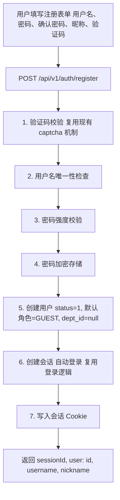

# 用户注册设计

## 1. 问题分析

### 1.1 现状

管理员创建用户需 `sys:user:add` 权限，仅适用于内部使用场景。

### 1.2 目标

面向公众开放场景提供用户自注册：用户通过用户名 + 密码 + 昵称 + 验证码完成注册，注册成功后自动登录。

## 2. 方案概述

### 2.1 核心流程

### 2.2 设计要点

| 要点 | 说明 |
|------|------|
| **公开端点** | `POST /api/v1/auth/register` 无需认证，属于认证白名单 |
| **验证码防护** | 复用现有 captcha 机制，防止机器人批量注册 |
| **自动登录** | 注册成功后直接创建会话，用户无需再手动登录 |
| **默认角色** | 新用户自动分配 GUEST 角色（data_scope=2，仅可见自己的数据） |
| **默认状态** | status=1（启用），注册后可立即使用系统 |
| **IP 限流** | 与登录限流策略一致（60 秒内 10 次/IP），防止滥用 |

## 3. API 设计

注册接口 `POST /api/v1/auth/register` 的完整契约见 [API接口.md](./API接口.md)。注册响应与登录响应结构一致（返回 `sessionId` 与用户基本信息，并写入会话 Cookie）。

## 4. 后端实现设计

### 4.2 注册流程

注册流程在验证码校验通过后依次执行用户名唯一性检查、密码强度校验、创建用户、分配默认角色、创建会话，其中需要关注的分支：

- 验证码过期或错误时终止注册
- 用户名转为小写后检查唯一性，已存在则终止注册
- 密码加密存储，不保存明文
- GUEST 角色不存在或被禁用时注册仍成功，用户暂无可访问权限，需管理员后续分配
- 注册成功后复用登录逻辑创建会话，无需二次登录

### 4.5 限流

注册接口按来源 IP 限流，与登录限流策略一致：时间窗口 60 秒，最大请求 10 次。

### 4.6 默认角色

系统种子数据中已有 GUEST 角色：

| id | name | code | data_scope | 说明 |
|----|------|------|-----------|------|
| 3 | 访问游客 | GUEST | 2 | 仅可见自己的数据 |

注册时自动查询 `code='GUEST'` 的角色并关联。

## 5. 前端实现设计

### 5.1 注册页面

#### 布局

与登录页风格一致，居中卡片布局：

| 区域 | 内容 |
|------|------|
| 顶部 | 系统标题 + "用户注册" 副标题 |
| 中部 | 注册表单（用户名、密码、确认密码、昵称、验证码、注册按钮） |
| 底部 | "已有账号？立即登录" 链接 |

#### 表单字段

| 字段 | 类型 | 校验规则 | 说明 |
|------|------|---------|------|
| username | 输入框 | 3-32 位字母数字下划线 | 实时校验格式 |
| password | 密码框 | 8-20 位含字母和数字 | 实时强度提示 |
| confirmPassword | 密码框 | 与 password 一致 | 实时比对 |
| nickname | 输入框 | 1-64 位 | 不能为纯空格 |
| captchaCode | 输入框 + 图片 | 必填 | 复用验证码组件 |

#### 交互规则

| 场景 | 行为 |
|------|------|
| 打开注册页 | 自动获取验证码 |
| 点击验证码图片 | 刷新验证码 |
| 注册成功 | Toast "注册成功" -> 1s 后跳转首页 |
| 用户名已存在 | Toast 错误提示，不跳转 |
| 验证码错误 | Toast 错误 + 刷新验证码 |
| 点击"立即登录" | 跳转登录页 |

### 5.2 登录页新增入口

登录页底部新增"没有账号？立即注册"链接，跳转到注册页。

## 6. 多端适配

| 端 | 认证方式 | 说明 |
|----|---------|------|
| **Web (Vue/React)** | Cookie 自动携带 | 注册成功后写入会话 Cookie，后续请求自动携带 |
| **Taro/UniApp、React Native、Flutter、Android、HarmonyOS** | X-Session-Id 请求头 | 注册响应中的 sessionId 存入本地存储，后续请求注入请求头 |

## 9. 配置项

| 配置项 | 说明 | 来源 | 默认值 |
|--------|------|------|--------|
| `security.register.enabled` | 是否开启注册功能（功能开关，运营可在需要时临时关闭注册） | 应用配置（环境变量可覆盖） | `true` |
