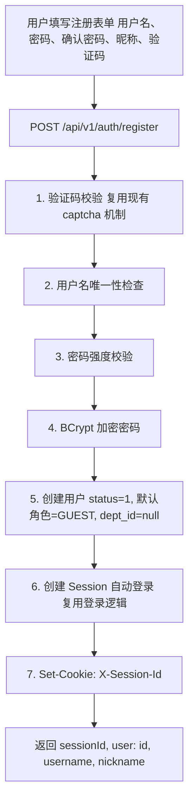
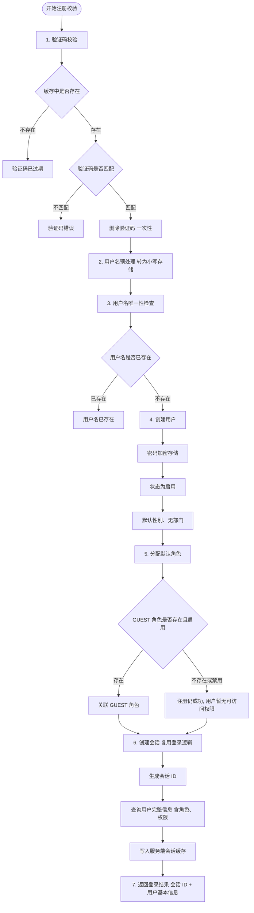

# 用户注册设计

## 1. 问题分析

### 1.1 现状

当前系统仅支持管理员创建用户（需 `sys:user:add` 权限），无用户自注册功能。新用户必须联系管理员开通账号，不适合面向公众开放使用的场景。

### 1.2 目标

提供用户自注册功能，用户通过用户名 + 密码 + 昵称 + 验证码完成注册，注册成功后自动登录。

## 2. 方案概述

### 2.1 核心流程

### 2.2 设计要点

| 要点 | 说明 |
|------|------|
| **公开端点** | `POST /api/v1/auth/register` 无需认证，加入 SecurityConfig 白名单 |
| **验证码防护** | 复用现有 captcha 机制，防止机器人批量注册 |
| **自动登录** | 注册成功后直接创建 Session，用户无需再手动登录 |
| **默认角色** | 新用户自动分配 GUEST 角色（data_scope=2，仅可见自己的数据） |
| **默认状态** | status=1（启用），注册后可立即使用系统 |
| **IP 限流** | 复用登录限流机制（60秒内10次/IP），防止滥用 |

## 3. API 设计

注册接口 `POST /api/v1/auth/register` 的完整契约（路径、请求参数、响应结构、错误码）参见 [API接口.md](./API接口.md)。

注册响应与登录响应结构一致（返回 `sessionId` 与用户基本信息，并通过 `Set-Cookie` 写入会话 Cookie），详见 [后端实现.md](./后端实现.md) 第 2.1 节 LoginResult。

## 4. 后端实现设计

### 4.1 数据传输对象

#### RegisterForm

| 字段 | 类型 | 校验 |
|------|------|------|
| username | String | 必填，3-32 位字母数字下划线 |
| password | String | 必填，6-20 位且同时包含字母和数字 |
| nickname | String | 必填，最长 64 位 |
| captchaKey | String | 必填，验证码标识 |
| captchaCode | String | 必填，验证码内容 |

### 4.2 注册流程（AuthServiceImpl.register）

### 4.3 注册接口

注册接口接收注册表单，注册成功后写入会话 Cookie 并返回登录结果。注册路径放行于登录白名单（无需登录即可访问）。

### 4.5 限流

注册接口按来源 IP 限流，与登录限流策略一致：
- 时间窗口: 60 秒
- 最大请求: 10 次

### 4.6 默认角色

系统种子数据中已有 GUEST 角色：

| id | name | code | data_scope | 说明 |
|----|------|------|-----------|------|
| 3 | 访问游客 | GUEST | 2 | 仅可见自己的数据 |

注册时自动查询 `code='GUEST'` 的角色并关联。若 GUEST 角色不存在或被禁用，注册仍成功但用户无角色（需管理员后续分配）。

## 5. 前端实现设计

### 5.1 注册页面

#### 布局

与登录页风格一致，居中卡片布局：

| 区域 | 内容 |
|------|------|
| 顶部 | 系统标题 + "用户注册" 副标题 |
| 中部 | 注册表单（用户名、密码、确认密码、昵称、验证码、注册按钮） |
| 底部 | "已有账号？立即登录" 链接 |

#### 表单字段

| 字段 | 类型 | 校验规则 | 说明 |
|------|------|---------|------|
| username | 输入框 | 3-32 位字母数字下划线 | 实时校验格式 |
| password | 密码框 | 6-20 位含字母和数字 | 实时强度提示 |
| confirmPassword | 密码框 | 与 password 一致 | 实时比对 |
| nickname | 输入框 | 1-64 位 | 不能为纯空格 |
| captchaCode | 输入框 + 图片 | 必填 | 复用验证码组件 |

#### 交互规则

| 场景 | 行为 |
|------|------|
| 打开注册页 | 自动获取验证码 |
| 点击验证码图片 | 刷新验证码 |
| 注册成功 | Toast "注册成功" -> 1s 后跳转首页 |
| 用户名已存在 | Toast 错误提示，不跳转 |
| 验证码错误 | Toast 错误 + 刷新验证码 |
| 点击"立即登录" | 跳转登录页 |

### 5.2 登录页新增入口

登录页底部新增"没有账号？立即注册"链接，跳转到注册页。

### 5.3 SDK 接口

SDK 提供注册方法，入参为注册表单（用户名/密码/昵称/验证码标识/验证码内容），返回登录结果（会话 ID + 用户基本信息）。

### 5.4 前端状态

注册成功后复用登录后的用户状态逻辑，将返回的会话信息写入用户状态并跳转首页。

## 6. 多端适配

| 端 | 认证方式 | 说明 |
|----|---------|------|
| **Web (Vue/React)** | Cookie 自动携带 | 注册成功后 Set-Cookie，后续请求自动携带 |
| **Taro/UniApp** | X-Session-Id header | 注册响应中的 sessionId 存入 storage，后续请求注入 header |
| **React Native** | X-Session-Id header | 同上 |
| **Flutter** | X-Session-Id header | 同上 |
| **Android** | X-Session-Id header | 同上 |
| **HarmonyOS** | X-Session-Id header | 同上 |

## 7. 安全设计

| 措施 | 说明 |
|------|------|
| **验证码防护** | 复用现有 captcha，防止机器人批量注册 |
| **IP 限流** | 60 秒内最多 10 次注册请求/IP |
| **用户名唯一** | 数据库唯一索引 + 应用层检查双重保障 |
| **密码加密** | BCrypt 加密存储，不存明文 |
| **密码强度** | 至少 6 位，必须包含字母和数字 |
| **XSS 防护** | nickname 字段过滤 HTML 标签 |
| **默认权限最小化** | GUEST 角色仅可查看自己的数据 |

## 8. 数据库变更

**无需变更表结构**。`sys_user` 和 `sys_user_role` 表已满足需求：

- `sys_user`：username 唯一索引已存在
- `sys_user_role`：用户角色关联表已存在
- GUEST 角色种子数据已存在

## 9. 配置项

| 配置项 | 说明 | 默认值 |
|--------|------|--------|
| `security.register.enabled` | 是否开启注册功能 | `true` |

后端在 `AuthService.register()` 入口处检查此配置，若关闭则抛出业务异常。

## 10. 改动范围

| 层 | 改动内容 |
|----|---------|
| **后端 (Java/Go/Python)** | 新增 `RegisterForm` DTO；`AuthService.register()` 方法；`AuthController.register()` 端点；SecurityConfig 白名单新增 `/register` |
| **SDK (JS/Harmony)** | `AuthAPI.register()` 方法；`RegisterData` 类型定义 |
| **前端 (Vue/React)** | 新增注册页面；路由配置新增 `/register`；登录页新增注册入口；Store 新增 register action |
| **移动端 (Taro/UniApp/RN/Flutter/Android/HarmonyOS)** | 新增注册页面；AuthAPI 新增 register 方法 |
| **文档** | 需求规格新增 F-AM-009；API 接口新增 /register；测试用例新增注册场景 |
