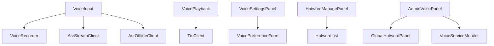

# 语音交互模块 - 前端实现设计

## 1. 文档概述

语音交互是系统级**基础能力模块**（语音输入 / 语音输出模态），前端**不设独立用户页面**，能力以公共组件形式由消费方模块嵌入，主消费方为 **AI 对话**。本文档定义语音能力的前端组件树、接入约定、状态管理、数据流，以及两处低频界面承载：用户设置（播报偏好 / 用户级热词，嵌入系统设置）与管理端面板（全局热词 / 服务监控）。

功能需求见 [需求规格.md](./需求规格.md)（F-VS-001~004），接口契约见 [API接口.md](./API接口.md)（ASR/TTS/热词）。主消费方 AI 对话的前端实现见 [../核心模块/AI对话/前端实现-用户端.md](../核心模块/AI对话/前端实现-用户端.md)：`MessageInput` 内嵌语音输入、`MessageActionBar` 朗读走语音 TTS。Android / Flutter / Taro 等多端参考本 Web 端组件结构与状态管理方案按各自技术栈适配。

---

## 2. 组件树设计



| 组件 | 职责 | 归属 |
|------|------|------|
| VoiceInput | **语音输入组件**（公共能力）：录音按钮 + 流式识别展示 + 会话管理，识别文本填入输入框供确认编辑；被 AI 对话 `MessageInput` 等消费方嵌入 | 语音模块公共组件 |
| VoiceRecorder | 录音控制：麦克风采集（16kHz/16bit/单声道 PCM）、60s 时长上限、停止/取消 | VoiceInput 内部 |
| AsrStreamClient | 流式 ASR 会话：`stream-session` 建会话 → WebSocket 推音频块 → 接收增量/最终文本 → EOS 结束 | VoiceInput 内部 |
| AsrOfflineClient | 离线 ASR：完整音频文件提交识别，结果回填输入框 | VoiceInput 内部 |
| VoicePlayback | **语音播报组件**（公共能力）：TTS 合成 + 音频播放/停止，语速/音色取用户偏好；被 AI 对话消息朗读（`speakMessage`）调用 | 语音模块公共组件 |
| TtsClient | TTS 合成调用：文本→音频 URL（缓存命中不合成不扣费），返回音频播放 | VoicePlayback 内部 |
| VoiceSettingsPanel | 播报偏好设置面板：语音回复开关（默认关闭）、音色选择、语速（0.8x/1.0x/1.2x），嵌入系统设置 | 系统设置页 |
| VoicePreferenceForm | 偏好表单：开关/音色/语速的本地持久化与应用 | VoiceSettingsPanel 内部 |
| HotwordManagePanel | 用户级热词管理面板：热词列表/新增/删除，提示"提升专业词汇识别率"，嵌入系统设置 | 系统设置页 |
| HotwordList | 用户热词列表（增删操作，上限提示） | HotwordManagePanel 内部 |
| AdminVoicePanel | 管理端面板容器：全局热词配置 + ASR/TTS 服务监控，入口见 §7 | 管理端独立路由 |
| GlobalHotwordPanel | 全局热词配置（所有用户生效，增删） | AdminVoicePanel 内部 |
| VoiceServiceMonitor | ASR/TTS 服务运行状态监控（引擎在线状态、并发会话数、模型加载状态） | AdminVoicePanel 内部 |

> 组件只承载能力编排与界面；是否展示入口由消费方决定（如公共库/对话页场景不同）。

---

## 3. 接入约定

### 3.1 消费方接入方式

| 消费方 | 接入方式 | 说明 |
|--------|---------|------|
| AI 对话 `MessageInput` | 内嵌 VoiceInput | 输入区"语音/文字切换"；识别文本填入输入框，用户确认/编辑后作为普通消息发送，走 AI 对话消息管道 |
| AI 对话 `MessageActionBar` | 调用 VoicePlayback | "朗读"操作合成助手回复并播放，再次点击停止；音色/语速取用户偏好 |

> 语音识别文本进入对话消息管道后由 LLM 统一处理意图与指令执行，前端不单独维护语音指令解析（需求规格 §1.1）。

### 3.2 多端录音适配

录音能力受运行环境影响，权限申请流程统一：进入语音功能 → 触发权限申请 → 用户授权 → 开始录音；拒绝授权时提示引导至系统设置开启（需求规格 §2.3）：

| 端 | 录音技术 | 权限申请 | 说明 |
|----|---------|---------|------|
| Web（Vue/React） | Web Audio API / MediaRecorder | 浏览器权限弹窗（getUserMedia） | 仅 HTTPS 环境可用；需处理浏览器兼容性 |
| 桌面端（Electron） | Electron 录音 API（基于 Chromium） | 系统麦克风权限 | 同 Web 端实现 |
| 移动端 APP（Android/Flutter/RN） | 原生录音 API | 运行时动态申请（Android RECORD_AUDIO） | 需在系统设置授权 |
| 小程序（Taro/UniApp） | `wx.getRecorderManager` | 小程序授权 `scope.record` | 单次最长 60s（与上限一致） |

> 录音采样参数全端统一：16kHz、16bit、单声道 PCM，匹配 FunASR 输入要求。

---

## 4. 状态管理

### 4.1 Store 模块划分

| Store 模块 | 职责 | 生命周期 |
|-----------|------|---------|
| 语音能力 Store（voiceStore） | 录音状态、ASR 会话、播报状态、偏好设置、用户热词 | 应用级，随能力组件实例化；ASR 会话随录音周期重置 |

### 4.2 核心状态

| 状态 | 说明 |
|------|------|
| `recordState` | 录音状态（idle/recording/stopped/canceled） |
| `asrSession` | 流式 ASR 会话（sessionId、wsStatus、识别文本） |
| `recognizedText` | 当前识别结果（增量实时更新，isFinal 后锁定为最终文本） |
| `playbackState` | 播报状态（idle/playing/stopped） |
| `ttsPreference` | 播报偏好（enabled 默认 false、voiceId、speed） |
| `hotwords` | 用户级热词列表 |

### 4.3 核心操作

| 操作 | 说明 |
|------|------|
| `startRecording` | 申请录音权限并开始采集（时长超 60s 自动停止） |
| `stopRecording` | 停止录音，发送 EOS 结束流式会话，获取最终识别文本 |
| `cancelRecording` | 取消录音（丢弃结果，不发送） |
| `offlineRecognize` | 提交完整音频文件离线识别（长音频场景） |
| `playSpeech` / `stopSpeech` | 合成并播放 / 停止播放（朗读助手回复） |
| `updatePreference` | 更新播报偏好（开关/音色/语速）并持久化 |
| `fetchHotwords` / `addHotword` / `deleteHotword` | 用户级热词管理 |
| `fetchGlobalHotwords` / `manageGlobalHotword` | 全局热词管理（管理端） |

---

## 5. 数据流

### 5.1 ASR 流式识别（WebSocket）

```
VoiceRecorder 采集 PCM 音频块（每 100ms） → POST /api/v1/voice/asr/stream-session 建会话
    → 获取 sessionId + wsUrl → 建立 WebSocket（/ws/asr）
    → 推送二进制 PCM 音频块（16kHz, 16bit, mono）
    → 接收增量文本 JSON {"text": 增量, "isFinal": false} 实时展示
    → 停止录音 → 发送 "EOS" → 接收 {"text": 完整文本, "isFinal": true}
    → 文本填入输入框，WebSocket 关闭
```

| 消息方向 | 格式 | 说明 |
|---------|------|------|
| 前端 → 后端 | 二进制 PCM 音频块 | 16kHz/16bit/mono，每 100ms 推送 |
| 后端 → 前端 | JSON `{"text": 增量, "isFinal": false}` | 中间结果实时展示 |
| 后端 → 前端 | JSON `{"text": 完整文本, "isFinal": true}` | 最终结果 |
| 前端 → 后端 | 文本 `"EOS"` | 结束信号 |

> 会话异常（并发上限 A0500、配额不足 A0682、FunASR 失败 C0001）时前端提示并降级为纯文本输入；识别结果可通过 `GET /api/v1/voice/asr/result/{sessionId}` 兜底查询。

### 5.2 ASR 离线识别

完整音频文件 → `POST /api/v1/voice/asr/offline` → 返回识别文本（离线高精度模型）→ 回填输入框。适用于超长音频或非实时场景。

### 5.3 TTS 合成与播报

| 场景 | 数据流 | 缓存 |
|------|--------|------|
| 首次合成 | `POST /api/v1/voice/tts`（text + voiceId + speed）→ 返回音频 URL | 服务端缓存（SHA256 文本+音色+语速，24h，单用户 100 条 LRU），缓存命中不合成不扣费 |
| 缓存播放 | `GET /api/v1/voice/tts/audio/{cacheKey}`（仅本人缓存可访问，AES 解密流式返回） | — |
| 音色列表 | `GET /api/v1/voice/tts/voices`（偏好设置页加载） | 页面级缓存 |

> TTS 引擎不可用/合成失败（A0500、C0001）时前端降级为纯文本回复，不展示播报入口。

### 5.4 热词管理

| 层级 | 接口 | 归属 |
|------|------|------|
| 用户级 | `GET/POST /api/v1/voice/hotwords`、`DELETE /api/v1/voice/hotwords/{id}` | 系统设置页（HotwordManagePanel） |
| 全局 | `GET/POST /api/v1/voice/hotwords/global`、`DELETE /api/v1/voice/hotwords/global/{id}` | 管理端（GlobalHotwordPanel，管理员） |

> 热词在流式/离线 ASR 会话创建时注册到引擎，变更后动态生效无需重启（需求规格 §3.4）。

### 5.5 服务监控（管理端）

`GET /api/v1/voice/service/status`（`voice:service:monitor`，仅管理员）返回 ASR/TTS 引擎在线状态/并发会话数/模型加载状态，VoiceServiceMonitor 定时轮询刷新。

---

## 6. 交互设计决策

| 交互点 | 技术选型 | 理由 |
|--------|---------|------|
| 能力嵌入而非独立页面 | VoiceInput/VoicePlayback 以公共组件嵌入消费方（AI 对话为主） | 语音是输入/输出模态，消费场景全部在对话画布内；独立页面违背"模块单一归属、路径最短"原则（菜单规划），且割裂边说边看上下文的体验 |
| 流式实时出字 | ASR 增量文本经 WebSocket 实时渲染，isFinal 后替换为完整文本 | "边说边出字"降低等待焦虑（需求规格 §1.3）；最终结果替换避免增量错字残留 |
| 识别文本可编辑确认 | 识别结果填入输入框而非直接发送 | 语音识别非 100% 准确，用户确认/编辑后发送，避免错误指令直接进入对话管道 |
| 录音时长与取消 | 60s 自动停止 + 手动停止/取消；取消不产生识别请求 | 时长上限防滥用（与计费关联）；取消操作零成本（不发送 EOS 不扣费） |
| 播报开关默认关闭 | 偏好默认 enabled=false，用户在设置中开启 | 语音播报属主动能力，默认关闭避免打扰；开关语义清晰 |
| TTS 降级纯文本 | 引擎不可用/合成失败时隐藏播报入口，仅展示文本 | 语音是增强而非必需，降级不阻塞对话主流程（需求规格 §3.2.4） |
| 配额预校验提示 | ASR/TTS 调用前预校验积分（A0682），不足时提示加购引导 | 语音消耗 AI 积分（ASR 按秒、TTS 按字符），预校验避免"说完才告知扣费失败" |
| 音频即用即焚 | 录音音频仅流式推送不落库；TTS 缓存音频按用户隔离加密存储 | 音频数据不持久化、仅本人可访问（需求规格 §5.3） |
| 用户热词自助管理 | 系统设置内嵌 HotwordManagePanel（增删 + 上限提示） | 领域术语（算法名/专业词汇）用户最清楚，自助配置提升识别率，无需依赖管理员 |

---

## 7. 设置与管理界面

| 界面 | 承载位置 | 内容 | 权限 |
|------|---------|------|------|
| 播报偏好设置 | 系统设置（嵌入） | 语音回复开关（默认关闭）、音色选择、语速（0.8x/1.0x/1.2x） | 登录用户 |
| 用户级热词管理 | 系统设置（嵌入） | 热词列表/新增/删除（仅本人） | `voice:hotword:edit` |
| 管理端面板 | 管理入口 → 语音管理（独立路由） | 全局热词配置 + ASR/TTS 服务监控 | 管理员 |

> 入口定位：播报偏好与用户热词属个人设置（低频、非对话主链路），嵌入系统设置不占主导航；全局热词与服务监控属管理端低频高权功能，走管理入口，不设独立用户页面。

---

## 8. 路由设计

| 路由路径 | 页面 | 权限控制 |
|---------|------|---------|
| （无独立用户路由） | 语音能力嵌入消费方（AI 对话 `/chat`）与系统设置页 | 登录用户 |
| `/admin/voice` | 管理端语音面板（全局热词 + 服务监控） | 管理员（`voice:hotword:edit`） |

> 用户端无语音独立页面：语音输入/播报随 AI 对话页与系统设置页承载；管理端面板独立路由，守卫校验管理员权限。
