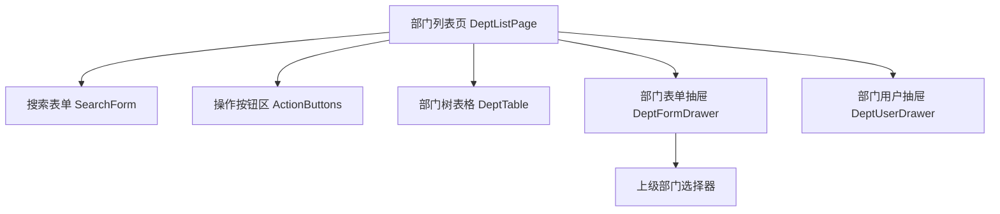

# 部门管理模块 - 前端实现设计

## 1. 文档概述

本文档描述部门管理模块前端的组件架构、状态管理与交互决策。部门管理为单页树形表格管理，前端负责树形展示、层级上限与根部门保护的前端约束，业务规则与数据权限边界由后端兜底。

## 2. 组件树设计

| 组件 | 职责 | 复用性 |
|------|------|--------|
| SearchForm | 部门名称、状态搜索 | 页面内部 |
| ActionButtons | 新增按钮，统一按钮级权限控制 | 页面内部 |
| DeptTable | 部门树形表格展示与行操作（新增下级/编辑/状态/删除） | 页面内部 |
| DeptFormDrawer | 部门新增/编辑表单，含上级部门树形选择器；新增下级时上级自动填充 | 页面内部 |
| DeptUserDrawer | 查看部门下关联用户列表，用于删除前校验与人员浏览 | 页面内部 |
| ParentSelector | 上级部门树形选择器，过滤当前节点及其子部门防循环引用 | 跨场景复用 |

## 3. 状态管理

### 3.1 Store 模块划分

| Store 模块 | 作用域 | 职责 |
|-----------|--------|------|
| deptStore | 页面级 | 部门树数据、当前选中节点、下拉选项 |
| 全局字典 Store | 全局 | 部门状态等字典数据 |

### 3.2 核心状态

| 状态字段 | 归属 Store | 说明 |
|---------|-----------|------|
| deptList | deptStore | 部门树形列表数据 |
| deptOptions | deptStore | 部门下拉选项（树形，供上级选择） |
| currentDept | deptStore | 当前操作部门节点（新增下级/编辑目标） |
| queryParams | deptStore | keywords/status |
| formData | 表单组件 | 部门表单数据（parentId/name/sort/status） |

### 3.3 核心操作

| 操作 | 说明 |
|------|------|
| loadDeptList | 加载部门树形列表，默认展开所有节点 |
| loadDeptOptions | 加载部门下拉选项（可配置仅启用） |
| submitForm | 新增/编辑部门提交，成功后刷新列表与下拉选项 |
| addSubDept | 新增下级，parentId 自动填充当前部门 |
| toggleStatus | 状态切换 |
| deleteDept | 删除部门 |

## 4. 路由设计

| 路由路径 | 组件 | 访问控制 | 守卫说明 |
|---------|------|---------|---------|
| /system/dept | DeptListPage | - | 路由由菜单树动态生成，菜单可见性由权限分配控制 |

**导航守卫策略**：
- 全局守卫校验登录态：未登录跳登录页，访问未授权菜单路由跳 403 页
- 按钮级权限按标识控制：新增/新增下级 `sys:dept:add`、编辑 `sys:dept:edit`、状态切换 `sys:dept:edit`、删除 `sys:dept:delete`，无权限时隐藏或禁用
- 部门管理员仅可操作本部门及下级部门数据，数据范围由后端按数据权限过滤

## 5. 数据流

### 5.1 数据获取策略

部门树形列表、下拉选项、表单回显与增删改均通过 SDK 封装的部门接口调用；后端返回树形结构，前端直接使用，不二次构建。

### 5.2 缓存策略

| 数据类型 | 缓存位置 | 失效策略 |
|---------|---------|---------|
| 部门树列表 | 组件状态 | 页面卸载时清除 |
| 部门下拉选项 | 组件状态 | 新增/编辑/删除后刷新 |
| 字典数据 | 全局 Store | 登录后加载，退出时清除 |

### 5.3 更新策略

- 新增/编辑/删除/状态切换后刷新部门树列表与下拉选项
- 树列表与下拉选项共用同一数据源，任一变更同步刷新，保证用户管理等模块的下拉选项一致

### 5.4 请求错误处理

| 错误类型 | 处理方式 |
|---------|---------|
| 401/403 | 401 跳登录页，403 显示无操作权限提示 |
| 业务错误 | 直接展示后端返回的错误信息（根部门保护、同级名称重复、存在关联用户/子部门等） |

## 6. 交互设计决策

| 交互场景 | 技术选型/决策 | 理由 |
|---------|-------------|------|
| 树形表格展示 | 采用树形表格呈现层级，支持展开/收起 | 直观反映组织层级关系，支持行内操作 |
| 默认展开 | 列表加载后默认展开所有节点 | 部门数量有限，全展开便于快速定位 |
| 新增下级 | 操作列提供"新增下级"入口，parentId 自动填充 | 快速在指定部门下创建子部门，减少选择成本 |
| 层级深度限制 | 当前部门达 5 级时禁用"新增下级"按钮 | 前端禁用 + 后端校验，防止层级过深 |
| 上级选择防循环 | 上级部门选择器过滤当前节点及其子部门 | 防止循环引用破坏树形结构 |
| 根部门保护 | 根部门（id=1）删除按钮禁用，编辑时上级选择器禁用 | 保护组织架构根节点，前端禁用 + 后端兜底 |
| 删除前校验 | 存在关联用户或子部门时禁止删除并提示 | 避免误删导致数据孤立，引导先清理依赖 |
| 状态独立切换 | 禁用部门不级联禁用子部门 | 部门状态与子部门、用户登录解耦，灵活管理 |
| 下拉选项过滤 | 部门下拉选项支持"仅启用"模式，禁用部门不展示 | 供用户管理等模块仅选择有效部门，避免分配到停用部门 |
| 数据权限过滤 | 部门管理员仅返回本部门及下级部门数据 | 数据范围由后端按角色数据权限过滤，前端不维护边界 |

## 7. 公共组件使用

| 公共组件 | 使用场景 | 配置要点 |
|---------|---------|---------|
| 搜索表单组件 | 部门列表搜索 | 复用通用搜索布局 |
| 树表格组件 | 部门树形展示 | 树形展开/收起，行操作按钮，层级缩进 |
| 树形选择器 | 上级部门选择 | 过滤当前节点及子部门，支持仅启用模式 |
| 表单抽屉组件 | 部门新增/编辑 | 单列布局，必填标记，新增下级时上级自动填充 |
| 二次确认弹窗 | 部门删除 | 显示部门名的确认提示 |
