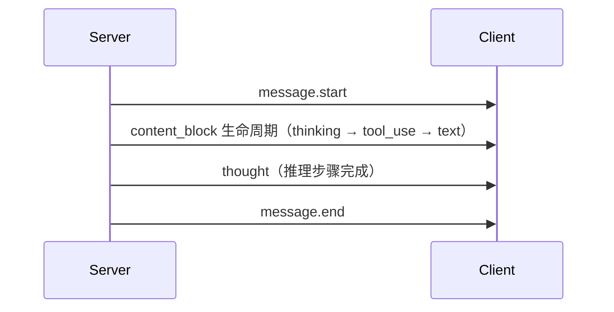

# AI 对话模块 API 接口

## 1. 文档概述

本文档定义 **AI 对话** 模块的 HTTP API 规范，是该模块 API 契约的**唯一权威来源**。

AI 对话 API 采用**双轨并行**设计：

| 轨道 | 路径前缀 | 响应格式 | 用途 |
|------|---------|---------|------|
| **内部 API** | `/api/v1/ai` | 本系统统一格式（`code/msg/data`）+ 自定义 SSE | 本系统前端，完整功能（会话管理、推理可视化、反馈等） |
| **OpenAI 兼容 API** | `/api/v1/chat/completions` | OpenAI 原生格式 + OpenAI SSE 格式 | 第三方接入，支持 OpenAI SDK / 第三方客户端（Chatbox、Open WebUI 等） |
| **Claude 兼容 API** | `/api/v1/messages` | Claude 原生格式 + Claude SSE 格式 | Claude SDK 接入 |

- **公共约定**：参见 [02-系统架构/04-API规范.md](../../../02-系统架构/04-API规范.md)
- **流式协议**：
  - 内部 API：SSE（Server-Sent Events），自定义事件类型
  - OpenAI 兼容 API：SSE，遵循 OpenAI Chat Completions 流式规范
  - Claude 兼容 API：SSE，遵循 Anthropic Messages 流式规范

> 内部 API 的消息发送采用 SSE 流式输出，推理过程通过 SSE 事件推送。兼容 API 分别遵循 OpenAI 和 Claude 的原生协议规范。接口详细参数/响应结构可通过 API 文档 MCP 查询，本文档仅定义接口清单和权限标识。

## 2. 接口清单

### 2.1 会话管理接口

> **会话生命周期**：创建会话 → 发送消息 → 流式接收回复 → 会话归档/删除。会话列表按最后活跃时间倒序，支持置顶；置顶会话不超过 10 个；搜索同时匹配会话标题与消息内容（全文检索），支持按全部/置顶/已归档范围过滤。
>
> **创建/更新表单字段**：创建（`POST /conversations`）可携带 `title`/`model`/`systemPrompt`/`modelConfig`/`apiKeyId`/`agentCode`/`scene`；`scene` 取值 `general`/`image_dispatch`/`multi_step`/`algorithm_recommend`/`scheduled_task`，决定默认提示词模板。更新（`PATCH /conversations/{id}`）为部分更新：`pinned` 为数值型（`0`/`1`）控制置顶、`status: 2` 表示归档；`titleSource` 取值 `auto`（自动生成）/`manual`（手动修改）。

| 路径 | 方法 | 功能描述 | 权限标识 | 关联功能点 |
|------|------|---------|---------|-----------|
| `/api/v1/ai/conversations` | POST | 创建对话会话（`suggestionsEnabled` 类似问题推荐开关，默认开启） | - | F-M08-001 |
| `/api/v1/ai/conversations` | GET | 会话列表（分页，支持搜索/置顶/归档范围筛选；`status` 参数：`0`=全部、`1`=活跃(默认)、`2`=已归档；返回 `unread_count`；搜索命中消息内容时返回 `matched_message_id` 支持消息级定位；`view=admin` 返回全量用户会话并带审计字段） | - | F-M08-001 |
| `/api/v1/ai/conversations/{id}` | GET | 会话详情（含模型配置、消息数等；`view=admin` 读取任意用户会话并带审计字段） | - | F-M08-001 |
| `/api/v1/ai/conversations/{id}` | PATCH | 部分更新会话（标题/置顶/归档/模型配置/`suggestionsEnabled` 类似问题推荐开关） | - | F-M08-001 |
| `/api/v1/ai/conversations/{id}` | DELETE | 删除会话（软删除，写 delete_time，30天可恢复） | - | F-M08-001 |
| `/api/v1/ai/conversations/batch` | POST | 批量操作会话（请求体 `{action: archive\|restore\|delete, ids: []}`；批量删除需二次确认 `confirm=true`）。注意：`action=restore` 指**撤销归档**（status 2→1，会话仍在列表）；`action=delete` 指软删除 | - | F-M08-001 |
| `/api/v1/ai/conversations/trash` | GET | 回收站列表（已软删未超 30 天，按 delete_time 倒序分页） | - | F-M08-001 |
| `/api/v1/ai/conversations/{id}/restore` | POST | 从回收站恢复软删会话（deleted 1→0，清空 delete_time；30 天恢复窗口内可恢复）。区别于 batch `restore`（撤销归档） | - | F-M08-001 |
| `/api/v1/ai/conversations/{id}/pin` | PUT | 置顶会话（上限 10 个，超限返回 A0501；写 pinned_at=now） | - | F-M08-001 |
| `/api/v1/ai/conversations/{id}/unpin` | PUT | 取消置顶（清空 pinned_at） | - | F-M08-001 |
| `/api/v1/ai/conversations/{id}/read` | PUT | 标记已读（last_read_message_id=最后消息 ID；列表返回 unread_count） | - | F-M08-001 |
| `/api/v1/ai/conversations/{id}/export` | GET | 导出会话记录（查询参数 `format=markdown\|json`，默认 markdown；推理过程默认不导出，流式写出） | - | F-M08-001 |

> **新会话引导**：示例问题为平台预设静态内容，由前端本地提供，无需接口请求，不消耗 Token。
>
> **管理端会话审计**：会话/消息接口支持管理员视角（`ai:conversation:audit`）：`GET /conversations` 携带 `view=admin` 返回全量用户会话；`GET /conversations/{id}?view=admin` 读取任意用户会话详情。审计视角只读，不提供会话内容操作（页面设计见 [需求规格.md](./需求规格.md) §3.3.1）。
>
> **审计扩展字段**（仅 `view=admin` 列表与详情返回，普通用户视角为 `null`；实现见 [会话与消息/后端实现.md](会话与消息/后端实现.md) §7）：
>
> | 字段 | 类型 | 说明 |
> |------|------|------|
> | `userName` | string | 会话归属用户展示名（昵称优先，缺省回退用户名） |
> | `tokenConsumed` | int | 会话累计消耗 Token 数（`sys_ai_billing` 按会话聚合的 `input_tokens + output_tokens`，与计费明细同源；无计费记录为 `0`） |
> | `creditsConsumed` | int | 会话累计消耗积分数（`sys_ai_billing.credits` 求和；无计费记录为 `0`） |
> | `anomalyType` | string | 会话异常类型：`failed`（存在 status=3 失败消息）/ `quota`（触发 `consecutive_quota_fail` 计费异常）/ `canceled`（存在 status=4 已取消消息），无异常为 `null`；多类并存时按 failed > quota > canceled 取其一 |
> | `anomalyLabel` | string | 异常中文展示标签，与 `anomalyType` 一一对应，前端无需硬编码映射 |
>
> **搜索命中定位**：`matched_message_id`（int）在关键词命中消息内容时返回该会话中最新一条命中消息 ID，供前端跳转定位；标题命中或未命中消息内容时为 `null`。

### 2.2 消息接口

> **流式模式**：POST 发送消息立即返回 SSE 流，逐 token 推送回复内容、推理步骤、工具调用事件。非流式模式返回完整响应。
>
> **发送表单**：`POST /conversations/{id}/messages` 请求体 `MessageSend` 仅含 `{content, model}` 两个字段。

| 路径 | 方法 | 功能描述 | 权限标识 | 关联功能点 |
|------|------|---------|---------|-----------|
| `/api/v1/ai/conversations/{id}/messages` | POST | 发送消息（SSE 流式输出），请求头携带 `Idempotency-Key` 防重复发送 | - | F-M08-001 |
| `/api/v1/ai/conversations/{id}/messages` | GET | 会话消息列表（分页：`before` 游标 + `limit`，按时间倒序增量加载；长会话向上滚动分页） | - | F-M08-001 |
| `/api/v1/ai/conversations/{id}/messages/stream/{streamSessionId}` | GET | SSE 断线重连（携带 `Last-Event-ID` 请求头从断点恢复） | - | F-M08-001 |
| `/api/v1/ai/conversations/{id}/messages/{msgId}/branches` | GET | 查询某消息的所有子消息（分支列表，按时间倒序） | - | F-M08-001 |
| `/api/v1/ai/conversations/{id}/branches/{msgId}` | PUT | 切换当前激活分支（更新 current_branch_message_id，后续上下文沿新分支构建） | - | F-M08-001 |
| `/api/v1/ai/messages/{id}` | GET | 消息详情（含推理步骤、工具调用） | - | F-M08-002 |
| `/api/v1/ai/messages/{id}` | DELETE | 删除助手回复消息（软删除，30 天可恢复；仅助手消息可删除，用户消息通过编辑重发调整；删除后不参与上下文且该消息重新生成入口失效） | - | F-M08-001 |
| `/api/v1/ai/messages/{id}/regenerate` | POST | 重新生成回复（基于原助手消息的父 user 消息新建兄弟分支并触发推理，SSE 流式输出） | - | F-M08-001 |
| `/api/v1/ai/messages/{id}` | PUT | 编辑用户消息并重新触发回复（创建分支消息，**SSE 流式响应**） | - | F-M08-001 |
| `/api/v1/ai/messages/{id}/resume` | POST | 恢复中断的推理（算法推荐确认/拒绝 / Plan-and-Execute 计划确认/干预），SSE 续流；请求体 `{confirm?: bool, params?: {algorithmId?: int}, plan_edit?: {remove: [taskId], reorder: [taskId...], add: {description, depends_on}}}`。plan_approve 中断时透传 `plan_edit` 做计划干预（仅计划待执行时允许） | - | F-M08-002 |
| `/api/v1/ai/messages/{id}/stop` | POST | 停止流式输出 / 取消当前推理（同时清理中断点） | - | F-M08-001 |

> **消息引用**：引用操作由前端本地完成（将消息内容填充至输入区），不产生新的接口请求，不建立消息间引用关系；引用后发送即新消息。
>
> **朗读消息**：助手回复朗读依赖语音交互模块（TTS），AI 对话侧无独立接口，前端在回复完成后调用语音模块播报。

> **幂等冲突**：发送消息携带 `Idempotency-Key`，同 key 处理中再次提交为**409 冲突语义**，以业务码 `A0002`（REPEAT_SUBMIT_ERROR）表达，HTTP 载体为项目统一的 400；缺失 `Idempotency-Key` 请求头返回 422。

**SSE 事件类型**（POST 发送消息的流式响应）：

| 事件 | 说明 | data 结构 |
|------|------|----------|
| `message.start` | 消息开始（仅含 messageId/conversationId/model，**不含 streamSessionId**） | `{messageId, conversationId, model}` |
| `content_block.start` | 内容块开始 | `{index, type}` — type: `text`/`thinking`/`tool_use` |
| `content_block.delta` | 内容块增量 | `{index, delta}` — delta.type: `text_delta`/`thinking_delta`/`input_json_delta`（工具参数流式增量） |
| `content_block.stop` | 内容块结束 | `{index}` — 标记该内容块完整，可解析完整工具参数 |
| `thought` | 推理步骤完成 | `{position, thought, tool, toolInput, observation, status, error, latencyMs}` — 完整推理步骤记录；`status`：`1`成功/`2`失败/`3`跳过（**数值型**），`error` 为失败原因（status=2 时透出，错误透明告知） |
| `plan` | 任务计划 | `{tasks: [{id, description, dependsOn, status}], status, revisions[], phase}` — Plan-and-Execute 计划生成/更新/重规划时推送；计划修订携带变更说明 |
| `interrupt` | 推理中断 | `{type, data}` — type: `confirm`/`quota`/`async_wait`/`plan_approve`（新增计划确认中断） |
| `suggestions` | 类似问题推荐 | `{questions: [{question}]}` — 回复完成后推送 2-3 条推荐问题，供前端展示"相关问题"引导追问；随该条回复计费，会话设置关闭该能力后不推送 |
| `ping` | 心跳保活 | `{}` — 每 15 秒推送，防止代理超时断连 |
| `error` | 错误事件 | `{code, message}` |
| `message.end` | 消息结束 | `{stopReason, usage}` — stopReason: `stop`/`tool_calls`/`length`/`content_filter`/`canceled`/`error`；usage: `{inputTokens, outputTokens, cachedInputTokens, credits}` |

**事件流程示例**：

> **恢复中断的推理**：中断（如算法推荐确认）后，通过 `POST /api/v1/ai/messages/{id}/resume` 恢复推理并 SSE 续流（读取消息关联的中断点 `ai:interrupt:{conversation_id}:{message_id}`）。`/resume` 端点是唯一恢复入口。

**async_wait 异步任务前端接入契约**：收到 `interrupt(type=async_wait)` 后，本轮 SSE 流随随后的 `message.end` 结束（`stopReason` 为该中断语义标识），但消息**尚未完成**——`message.end` 仅表示本轮流式通道关闭，不代表回复终态。前端应：
1. 记录 `interrupt.data.task_id`；
2. 轮询消息接口 `GET /api/v1/ai/conversations/{id}/messages`（或消息详情），消息 `status` 在 `async_wait` 挂起期间保持创建时的**生成中**状态（不置 2、无最终 `content`）；
3. 后台任务完成后后端自动恢复推理并 SSE 续流推送最终内容；当消息 `status` 变为 `2`（已完成）后，拉取最终 `content` 渲染。
> 注意：`confirm`/`quota` 挂起行为与此不同（保留挂起时的部分回复并依赖 `/resume` 续流），前端契约以各自 `interrupt.data` 为准。

### 2.3 上下文管理接口

> **中间产物（Artifacts）**：产物列表采用分页结构（`PageResult`）；产物详情走独立路径 `/artifacts/{id}/detail`（含运行时拼接的图片 URL 等元数据）；支持按消息关联反查（`/messages/{id}/artifacts`）与按业务引用反查（`/artifacts/by-ref`）。
>
> **长期记忆（Memories）**：统一路径前缀 `/api/v1/ai/memories`，列表为分页结构。包含 7 个端点：分页列表（GET）、创建（POST）、更新（PUT `/memories/{id}`）、删除（DELETE `/memories/{id}`，软删除）、关键词搜索（GET `/memories/search`）、批量清空（POST `/memories/clear`，需 `confirm` 二次确认，30 天内可恢复）、恢复软删（POST `/memories/restore`）、导出（GET `/memories/export?fmt=json|markdown`，返回文件流）。归档记忆列表走 GET `/memories/archived`。

| 路径 | 方法 | 功能描述 | 权限标识 | 关联功能点 |
|------|------|---------|---------|-----------|
| `/api/v1/ai/conversations/{id}/artifacts` | GET | 会话中间产物列表（分页） | - | F-M08-003 |
| `/api/v1/ai/artifacts/{id}/detail` | GET | 中间产物详情（含运行时图片 URL 等元数据） | - | F-M08-003 |
| `/api/v1/ai/messages/{id}/artifacts` | GET | 消息关联产物列表 | - | F-M08-003 |
| `/api/v1/ai/artifacts/by-ref` | GET | 按业务引用反查产物列表（`refType`/`refId` 查询参数） | - | F-M08-003 |
| `/api/v1/ai/memories` | GET | 当前用户长期记忆分页列表（`memoryType`/`source` 筛选） | - | F-M08-003 |
| `/api/v1/ai/memories/archived` | GET | 归档记忆分页列表 | - | F-M08-003 |
| `/api/v1/ai/memories` | POST | 创建记忆（`memoryType`/`content`/`importance`/`source`） | - | F-M08-003 |
| `/api/v1/ai/memories/{id}` | PUT | 更新记忆（`content`/`importance`/`status`） | - | F-M08-003 |
| `/api/v1/ai/memories/{id}` | DELETE | 删除单条记忆（软删除，不再注入对话） | - | F-M08-003 |
| `/api/v1/ai/memories/search` | GET | 关键词搜索记忆（`keyword`/`limit`） | - | F-M08-003 |
| `/api/v1/ai/memories/clear` | POST | 批量清空记忆（`memoryType`/`start`/`end` 过滤 + `confirm` 二次确认；30 天内可恢复） | - | F-M08-003 |
| `/api/v1/ai/memories/restore` | POST | 恢复软删记忆（参数同 clear） | - | F-M08-003 |
| `/api/v1/ai/memories/export` | GET | 导出全部记忆（`fmt=json\|markdown`，返回文件流） | - | F-M08-003 |

> **`/memories/clear` 与 `/memories/restore` 参数位置**：虽为 POST，**参数一律走查询参数（query string），不接收请求体**（`confirm` 同在 query）。前端/SDK 按 query 拼接，勿按 JSON body 提交，否则参数全被忽略、退化为"清空/恢复全部"。

**clear / restore 查询参数表**：

| 参数 | 类型 | 必填 | 说明 |
|------|------|------|------|
| `memoryType` | string | 否 | 按记忆子类型过滤（`episodic`/`semantic`/`procedural`），不传则不限类型 |
| `start` | string | 否 | 按创建时间过滤起始（含），支持 `%Y-%m-%d %H:%M:%S` / ISO8601 / `%Y-%m-%d` |
| `end` | string | 否 | 按创建时间过滤截止（含），格式同 `start` |
| `confirm` | bool | 否 | 二次确认标识，默认 `false`；为 `false` 时不执行操作，返回参数错误 `A0400`（提示需二次确认） |

### 2.4 消息反馈接口

| 路径 | 方法 | 功能描述 | 权限标识 | 关联功能点 |
|------|------|---------|---------|-----------|
| `/api/v1/ai/messages/{id}/feedback` | POST | 提交/更新反馈（点赞/点踩） | - | F-M08-008 |
| `/api/v1/ai/messages/{id}/feedback` | GET | 查询消息反馈状态 | - | F-M08-008 |
| `/api/v1/ai/messages/{id}/feedback` | DELETE | 撤销反馈 | - | F-M08-008 |

**POST 请求体**（对齐需求规格 §2.9.3 标签体系）：

| 字段 | 类型 | 必填 | 说明 |
|------|------|------|------|
| `rating` | int | 是 | 评分：`1`=点赞，`-1`=点踩 |
| `tags` | string[] | 点赞可选/点踩必选 | 预设标签：点赞 `accurate`/`detailed`/`concise`/`creative`；点踩 `incorrect`/`irrelevant`/`incomplete`/`too_long`/`bad_citation`/`harmful` |
| `comment` | string | 否 | 改进建议（点踩不强制填写，避免降低反馈率） |

> **反馈数据完整性**（对齐需求规格 §2.9.5）：反馈提交时服务端自动携带 `conversation_id`/`model`/`source` 冗余字段；question/answer/citations/retrieval 上下文快照不随请求提交，通过 `message_id` 关联 `sys_ai_message`/`sys_ai_agent_thought` 回溯，实现全链路归因。

### 2.5 智能体管理接口（AiAgentAPI）

> **Agent 生命周期**：创建 Agent → 配置系统提示词/模型/推理参数 → 关联 Skills/MCP/子Agent → 启用 → 会话选择使用。Agent 配置由管理员管理，普通用户在会话创建时选择启用的非子 Agent 类型的 Agent。

| 路径 | 方法 | 功能描述 | 权限标识 | 关联功能点 |
|------|------|---------|---------|-----------|
| `/api/v1/ai/agents` | GET | Agent 列表（管理员查全部，支持 `keyword`/`status`/`type`（`agent`普通Agent/`subagent`子Agent/`team`Team团队）筛选；列表项含 `tags` 分类标签与 `skillCount`/`mcpCount`/`subAgentCount` 关联计数；普通用户只返回启用且非子Agent的可选项） | - | F-M08-011 |
| `/api/v1/ai/agents/enabled` | GET | 可选 Agent 列表（会话创建时使用，仅返回启用且非子Agent类型） | - | F-M08-011 |
| `/api/v1/ai/agents` | POST | 创建 Agent（`tags` 分类标签可选，JSON 字符串数组） | `ai:agent:manage` | F-M08-011 |
| `/api/v1/ai/agents/{id}` | GET | Agent 详情（含配置、关联的Skills/MCP/子Agent） | - | F-M08-011 |
| `/api/v1/ai/agents/{id}` | PUT | 更新 Agent（基本信息/系统提示词/模型/推理参数/权限/分类标签） | `ai:agent:manage` | F-M08-011 |
| `/api/v1/ai/agents/{id}` | DELETE | 删除 Agent（软删除，校验引用关系） | `ai:agent:manage` | F-M08-011 |
| `/api/v1/ai/agents/{id}/skills` | PUT | 设置 Agent 关联的 Skills（覆盖式更新） | `ai:agent:manage` | F-M08-011 |
| `/api/v1/ai/agents/{id}/mcps` | PUT | 设置 Agent 关联的 MCP 命名空间（覆盖式更新） | `ai:agent:manage` | F-M08-011 |
| `/api/v1/ai/agents/{id}/subagents` | PUT | 设置 Agent 的子 Agent 关联（覆盖式更新，含优先级） | `ai:agent:manage` | F-M08-011 |
| `/api/v1/ai/agents/{id}/test` | POST | 测试 Agent（输入测试消息，预览响应，不入库不推送） | `ai:agent:manage` | F-M08-011 |
| `/api/v1/ai/agents/{id}/copy` | POST | 复制 Agent（复制基本信息和配置，不复制关联关系） | `ai:agent:manage` | F-M08-011 |
| `/api/v1/ai/agents/{id}/status` | PATCH | 启停 Agent（`{status: 0\|1}`；禁用后不可被会话选择，进行中会话不受影响） | `ai:agent:manage` | F-M08-011 |

**版本管理与发布**：

> 版本采用"草稿/已发布"分离的不可变快照：更新 Agent 时生成草稿快照（`status=1`），发布将草稿过回归集门禁后转为已发布（`status=2`）；发布/回滚仅影响新会话，进行中会话锚定创建时的版本。

| 路径 | 方法 | 功能描述 | 权限标识 | 关联功能点 |
|------|------|---------|---------|-----------|
| `/api/v1/ai/agents/{id}/versions` | GET | 版本历史列表（含草稿与已发布，分页） | - | F-M08-011 |
| `/api/v1/ai/agents/{id}/versions/{versionNo}` | GET | 版本快照详情（含完整配置快照） | - | F-M08-011 |
| `/api/v1/ai/agents/{id}/versions/diff` | GET | 版本差异对比（`base`/`target` 查询参数指定两个版本号） | - | F-M08-011 |
| `/api/v1/ai/agents/{id}/publish` | POST | 发布 Agent（草稿通过回归集门禁后发布为正式版本；判分模型漂移时门禁暂停阻断，`force=true` 为管理员豁免并记录于版本 `change_note`） | `ai:agent:manage` | F-M08-011 |
| `/api/v1/ai/agents/{id}/versions/{versionNo}/rollback` | POST | 回滚到历史发布版本（生成新版本号，完整历史保留） | `ai:agent:manage` | F-M08-011 |

**会话级 Agent 选择**：

- `POST /api/v1/ai/conversations` 请求体新增 `agent_code` 字段（可选，默认平台默认 Agent）
- `PATCH /api/v1/ai/conversations/{id}` 支持更新 `agent_code`（切换会话绑定的 Agent）

### 2.6 评测与回归测试接口（Agent 评测，F-M08-014）

> **评测集分层**：开发集（`dev`，日常调试）、回归集（`regression`，发布前必跑）、保留集（`heldout`，阶段验收）。评测集挂载在 Agent 下，样本属于评测集；评测执行逐样本运行 Agent 完整推理链路并按四维评分，使用平台专用 Token 池、不计入用户配额。
>
> 评测端点统一挂在 `/agents/{agent_id}/eval` 前缀下（非 `eval-datasets`/`eval-runs` 平铺路径），评测中心跨 Agent 聚合端点挂在 `/eval-center` 前缀下，全部需 `ai:agent:manage` 权限。实现细节见 [Agent评测/后端实现.md](Agent评测/后端实现.md)。

**评测集**（`/api/v1/ai/agents/{agent_id}/eval/datasets`）：

| 路径 | 方法 | 功能描述 | 权限标识 | 关联功能点 |
|------|------|---------|---------|-----------|
| `/api/v1/ai/agents/{id}/eval/datasets` | GET | 评测集列表（管理端） | `ai:agent:manage` | F-M08-014 |
| `/api/v1/ai/agents/{id}/eval/datasets` | POST | 创建评测集（`name`/`dataset_type`） | `ai:agent:manage` | F-M08-014 |
| `/api/v1/ai/agents/{id}/eval/datasets/{datasetId}` | PATCH | 更新评测集 | `ai:agent:manage` | F-M08-014 |
| `/api/v1/ai/agents/{id}/eval/datasets/{datasetId}` | DELETE | 删除评测集（软删除） | `ai:agent:manage` | F-M08-014 |

**评测样本**（`/api/v1/ai/agents/{agent_id}/eval`）：

| 路径 | 方法 | 功能描述 | 权限标识 | 关联功能点 |
|------|------|---------|---------|-----------|
| `/api/v1/ai/agents/{id}/eval/datasets/{datasetId}/samples` | GET | 评测样本列表 | `ai:agent:manage` | F-M08-014 |
| `/api/v1/ai/agents/{id}/eval/datasets/{datasetId}/samples` | POST | 创建评测样本（含 `risk_level`；Bad Case 脱敏回流复用此接口写入回归集） | `ai:agent:manage` | F-M08-014 |
| `/api/v1/ai/agents/{id}/eval/samples/{sampleId}` | PATCH | 更新评测样本 | `ai:agent:manage` | F-M08-014 |
| `/api/v1/ai/agents/{id}/eval/samples/{sampleId}` | DELETE | 删除评测样本 | `ai:agent:manage` | F-M08-014 |

**评测执行**（`/api/v1/ai/agents/{agent_id}/eval/runs`）：

| 路径 | 方法 | 功能描述 | 权限标识 | 关联功能点 |
|------|------|---------|---------|-----------|
| `/api/v1/ai/agents/{id}/eval/runs` | POST | 手动触发评测（回归集，`trigger_type=manual`；发布门禁由发布接口内部触发）；返回门禁判定（camelCase）：`runId`/`passed`/`scoreSummary`（四维评分聚合，dimensions 内键为四维指标名）/`failedSamples`（失败样本明细） | `ai:agent:manage` | F-M08-014 |
| `/api/v1/ai/agents/{id}/eval/runs` | GET | 评测执行记录列表（分页，含发布审计轨迹，可按 `datasetId` 过滤） | `ai:agent:manage` | F-M08-014 |

**评测中心**（`/api/v1/ai/eval-center`，跨 Agent 聚合，供评测中心页消费）：

| 路径 | 方法 | 功能描述 | 权限标识 | 关联功能点 |
|------|------|---------|---------|-----------|
| `/api/v1/ai/eval-center/overview` | GET | 评测总览：各 Agent 最近一次评测得分/门禁状态（`passed`/`failed`/`none` 未评测）/相对上次退化标识（超过 `ai_eval.regression_threshold`）/高风险样本失败标识 | `ai:agent:manage` | F-M08-014 |
| `/api/v1/ai/eval-center/trends` | GET | 评测历史趋势：已完成 run 的时间序列（`agentId`/`startTime`/`endTime`/`limit` 过滤，时间升序，每项含四维得分与总分） | `ai:agent:manage` | F-M08-014 |
| `/api/v1/ai/eval-center/runs/{runId}/compare` | GET | 两次 run 得分对比（`baseRunId` 必填查询参数，两次 run 须属同一 Agent）：四维得分差 + 样本级差异（新增/移除/变化/未变计数，按 `sample_id` 匹配） | `ai:agent:manage` | F-M08-014 |
| `/api/v1/ai/eval-center/judge-status` | GET | 判分模型状态（轻量聚合）：人工复核一致率对比 `ai_eval.judge_consistency_threshold` 推导 `consistency_state`（`normal`/`drifted`/`insufficient_data`）与漂移门禁暂停提示，附复核统计 | `ai:agent:manage` | F-M08-014 |
| `/api/v1/ai/eval-center/reviews` | GET | 人工复核队列：失败样本全量 + 通过样本按 `ai_eval.judge_review_ratio` 确定性抽样，`(runId, sampleId)` 幂等生成；`status` 过滤（1 待复核/2 已复核），返回队列与统计 | `ai:agent:manage` | F-M08-014 |
| `/api/v1/ai/eval-center/reviews/{reviewId}` | POST | 复核结果回填：请求体 `{agree: boolean, remark?: string(≤500)}`；判定一致/不一致 + 备注；已复核项不允许重复回填（A0503） | `ai:agent:manage` | F-M08-014 |

> 人工复核判定存 `sys_ai_eval_review` 表（见数据库设计 §4.7）；复核一致率直接反映到判分状态/漂移检测。

### 2.7 A2A 协议接口

> A2A（Agent2Agent）用于跨进程 / 跨系统的 Agent 互操作，与 MCP 互补（MCP 连接工具与上下文，A2A 连接 Agent 与 Agent）。dehaze 同时作为 A2A **服务端**（暴露自有 Agent）与**客户端**（调用外部 Agent）。Agent 对外暴露由主表 `is_exposed` 字段控制（复用 `PUT /api/v1/ai/agents/{id}`）。

**外部端点管理**（`sys_ai_agent_endpoint`）：

| 路径 | 方法 | 功能描述 | 权限标识 | 关联功能点 |
|------|------|---------|---------|-----------|
| `/api/v1/ai/a2a/endpoints` | GET | 外部 A2A 端点分页列表（`keyword`/`status` 筛选） | `ai:agent:manage` | F-M08-011 |
| `/api/v1/ai/a2a/endpoints` | POST | 注册外部 A2A 端点（拉取并缓存 Agent Card，凭证 AES 加密存储） | `ai:agent:manage` | F-M08-011 |
| `/api/v1/ai/a2a/endpoints/{id}` | PATCH | 更新端点 | `ai:agent:manage` | F-M08-011 |
| `/api/v1/ai/a2a/endpoints/{id}` | DELETE | 删除端点（软删除） | `ai:agent:manage` | F-M08-011 |
| `/api/v1/ai/a2a/endpoints/{id}/refresh-card` | POST | 刷新端点 Agent Card（返回刷新后的 Card） | `ai:agent:manage` | F-M08-011 |

**A2A 标准协议端点**（非内部 API，遵循 A2A 规范路径）：

| 路径 | 方法 | 功能描述 | 权限标识 | 关联功能点 |
|------|------|---------|---------|-----------|
| `POST /a2a` | POST | A2A JSON-RPC 2.0 服务端：`message/send`、`message/stream`（SSE）、`tasks/get`、`tasks/cancel`、`tasks/list` | API Key（Bearer） | F-M08-011 |
| `GET /.well-known/agent.json` | GET | Agent Card 发现（返回 Agent 能力、端点与安全方案声明） | - | F-M08-011 |

**A2A 约定**：

- 全局入口 `POST /a2a` 的 JSON-RPC `params` 携带 `agentId` 或 `agentCode` 定位目标 Agent（dehaze 扩展）；`/.well-known/agent.json` 返回平台**首个可对外服务** Agent 的 Card。另保留按路径定位单 Agent 的挂载路径 `/api/v1/ai/agents/{agent_id}/a2a`（含 `/a2a/.well-known/agent.json`），两套入口共用同一核心处理。
- 子 Agent 关联中的 `endpoint_id` 区分本地 / 远程：`NULL` 为本地子 Agent（走进程内 `task` 工具），非 `NULL` 为远程 A2A 子 Agent（走 A2A 客户端）；关联设置复用 `PUT /api/v1/ai/agents/{id}/subagents`。
- 外部调用不旁路护栏 / 评测 / 计费；远程子 Agent 的 Token 消耗不计入 dehaze 主会话配额，仅记录调用状态与耗时。

### 2.8 定时调度接口（AiScheduleAPI）

> **定时任务生命周期**：创建定时任务（Cron/常用频率 + 输入来源 + 输出目标）→ 启停控制 → 到达触发时间以系统身份执行（复用多步推理）→ 执行历史可查。定时调度仅 VIP2 及以上用户可用；单用户任务上限 20 个；同一任务上一次执行未完成时本次触发跳过（防重叠）；连续失败 ≥ 5 次自动停用并通知用户。

| 路径 | 方法 | 功能描述 | 权限标识 | 关联功能点 |
|------|------|---------|---------|-----------|
| `/api/v1/ai/scheduled-tasks` | POST | 创建定时任务（请求体含名称、Cron 表达式或常用频率、输入来源、输出目标；保存后返回下次触发时间预览） | - | F-M08-009 |
| `/api/v1/ai/scheduled-tasks` | GET | 任务列表（分页，按下次触发时间排序，含最近执行结果摘要） | - | F-M08-009 |
| `/api/v1/ai/scheduled-tasks/{id}` | GET | 任务详情（含触发规则、输入/输出配置、下次触发时间、熔断状态） | - | F-M08-009 |
| `/api/v1/ai/scheduled-tasks/{id}` | PUT | 更新任务（触发规则/输入来源/输出目标） | - | F-M08-009 |
| `/api/v1/ai/scheduled-tasks/{id}/status` | PATCH | 启停任务（`{enabled: true\|false}`；连续失败熔断停用后，用户修复配置可重新启用） | - | F-M08-009 |
| `/api/v1/ai/scheduled-tasks/{id}` | DELETE | 删除任务（软删除） | - | F-M08-009 |
| `/api/v1/ai/scheduled-tasks/{id}/run` | POST | 手动触发一次执行（验证配置或补跑遗漏执行，不改变定时规则） | - | F-M08-009 |
| `/api/v1/ai/scheduled-tasks/{id}/history` | GET | 执行历史（分页，含结果/消耗积分/耗时/失败原因/跳过原因，保留 30 天） | - | F-M08-009 |
| `/api/v1/ai/scheduled-tasks/next-times` | GET | Cron 表达式解释与下次执行时间预览（查询参数 `cron`，返回人类可读描述 + 接下来 N 次触发时间） | - | F-M08-009 |

**创建/更新请求体**：

| 字段 | 说明 |
|------|------|
| `name` | 任务名称 |
| `cron` | 触发规则。两种格式：① 标准 5 位 Cron 表达式（如 `0 9 * * 1,3`）；② 常用频率标识（`daily@HH:MM` 每天 / `weekly@D@HH:MM` 每周 D 的 HH:MM（D 为 mon…sun 或 0-6，0 与 7 为周日）/ `monthly@D@HH:MM` 每月 D 号），后端归一化为标准 Cron 存储 |
| `input` | 输入来源：`{type: fixed\|dynamic, ...}`（固定图片集 / MCP 动态拉取） |
| `output` | 输出目标（消息推送/回调等） |

### 2.9 OpenAI 兼容 API

> 完全遵循 OpenAI Chat Completions API 规范，支持 OpenAI SDK / 第三方客户端直接接入。
>
> **SDK 调用**：SDK 侧 `AiConversationAPI.openaiCompletion`/`openaiModels` 走 `compatStreamClient`（基于 `service` 默认配置新建的 axios 实例，复用 `configManager.onRequest` 拦截，但移除响应业务码解包以保留流式可读流语义），支持通过可选 `apiKey` 参数注入 `Authorization: Bearer <apiKey>` 认证；未传 `apiKey` 时回落到会话凭证。流式请求（`stream: true`）返回原生可读流，由调用方按 OpenAI SSE 格式解析。

| 路径 | 方法 | 功能描述 | 权限标识 | 关联功能点 |
|------|------|---------|---------|-----------|
| `/api/v1/chat/completions` | POST | 对话补全（支持流式/非流式，`stream` 参数控制） | - | F-M08-010 |
| `/api/v1/models` | GET | 模型列表（OpenAI 格式） | - | F-M08-010 |

**会话管理约定**：
- 请求中可传 `conversation_id`（自定义扩展字段）指定已有会话，不传则自动创建新会话
- 自动创建的会话标题从首条用户消息提取
- 兼容 API 不暴露会话列表/删除/归档等管理接口，这些操作通过内部 API 完成

**与内部 API 的差异**：

| 差异点 | 内部 API | OpenAI 兼容 API |
|--------|---------|----------------|
| 响应格式 | `{code, msg, data}` | OpenAI 原生 `{id, object, choices, usage}` |
| SSE 事件 | 自定义（content_block/thought 等） | OpenAI 标准（`data: {choices:[{delta}]}`） |
| 推理过程 | 有（thought 事件） | 无 |
| 会话管理 | 有（创建/列表/删除/归档） | 无（通过 `conversation_id` 指定，无则自动创建） |
| 认证 | Session / API Key | API Key（`Authorization: Bearer dhak_xxx`） |
| 工具调用 | 有（content_block type=tool_use） | 有（OpenAI tool_calls 格式） |

### 2.10 Claude 兼容 API

> 完全遵循 Anthropic Messages API 规范，支持 Claude SDK 直接接入。
>
> **SDK 调用**：SDK 侧 `AiConversationAPI.claudeMessage` 同样走 `compatStreamClient`，支持可选 `apiKey` 参数注入 `x-api-key`（固定携带 `anthropic-version: 2023-06-01`）认证；未传 `apiKey` 时回落到会话凭证。流式请求（`stream: true`）返回原生可读流。

| 路径 | 方法 | 功能描述 | 权限标识 | 关联功能点 |
|------|------|---------|---------|-----------|
| `/api/v1/messages` | POST | 消息对话（支持流式/非流式，`stream` 参数控制） | - | F-M08-010 |
| `/api/v1/models` | GET | 模型列表（Claude 格式） | - | F-M08-010 |

**会话管理约定**：
- 与 OpenAI 兼容 API 一致：请求中可传 `conversation_id`（自定义扩展字段）指定已有会话，不传则自动创建新会话

**与内部 API 的差异**：

| 差异点 | 内部 API | Claude 兼容 API |
|--------|---------|----------------|
| 响应格式 | `{code, msg, data}` | Claude 原生 `{id, type, content, usage}` |
| SSE 事件 | 自定义（content_block/thought 等） | Claude 标准（`message_start`/`content_block_delta`/`message_stop`） |
| 认证头 | `Authorization: Bearer` | `x-api-key` + `anthropic-version` |
| system 消息 | 在 messages 中 role=system | 独立的 `system` 顶层字段 |
| 推理过程 | 有（thought 事件） | 无 |

### 2.10.1 调用审计查询（内部 API）

> 接入治理（F-M08-010 §2.3.1）的观测底座：查询当前登录用户对兼容端点（OpenAI/Claude）的调用日志，支撑对账与异常排查。数据来源为 MongoDB 集合 `ai_api_call_log`（只追加、TTL 30 天），与 `sys_ai_billing`（仅成功计费）职责分离。

**端点表**：

| 路径 | 方法 | 功能描述 | 权限标识 | 关联功能点 |
|------|------|---------|---------|-----------|
| `/api/v1/ai/compat/calls` | GET | 兼容调用审计分页查询（当前登录用户，create_time 倒序） | - | F-M08-010 |

**查询参数表**：

| 参数 | 类型 | 必填 | 说明 |
|------|------|------|------|
| `page` | int | 否 | 页码，默认 `1`，最小 `1` |
| `size` | int | 否 | 每页条数，默认 `20`，范围 `1-100` |
| `keyId` | int | 否 | 按 API Key ID 筛选 |
| `model` | string | 否 | 按模型筛选 |
| `startTime` | string | 否 | 起始时间，支持 `%Y-%m-%d %H:%M:%S` / ISO8601 / `%Y-%m-%d` |
| `endTime` | string | 否 | 结束时间（同上格式） |

**响应字段表**（`data.list[]`，字段对齐 §2.3.1，camelCase；`data.total` 为筛选总数）：

| 字段 | 类型 | 说明 |
|------|------|------|
| `id` | string | 记录 _id |
| `keyId` | int \| null | 使用的 API Key ID（401 被拒调用可能为 null） |
| `keyPrefix` | string | Key 前缀（`dhak_xxx...`，脱敏展示，不存完整 Key） |
| `conversationId` | int \| null | 会话 ID |
| `model` | string \| null | 请求模型 |
| `endpoint` | string | 端点（`chat/completions`、`messages`、`models`） |
| `protocol` | string | 协议（`openai`/`claude`） |
| `isStream` | bool | 是否流式 |
| `inputTokens` | int | 输入 Token 数 |
| `outputTokens` | int | 输出 Token 数 |
| `credits` | float \| null | 积分消耗（成功计费时记录） |
| `statusCode` | int | 返回状态码（200/401/403/429/402/5xx） |
| `durationMs` | int | 调用耗时 |
| `clientIp` | string | 来源 IP |
| `requestId` | string | 请求 ID（串联日志与计费记录） |
| `errorMsg` | string \| null | 失败原因（非 2xx 时记录） |
| `createTime` | datetime | 调用时间 |

### 2.11 MCP Server 管理接口

> 外部 MCP Server 的通用接入与管理（需求规格-能力扩展 §2.6.13，页面设计见 [需求规格.md](./需求规格.md) §3.3.3）。任何符合 MCP 规范的外部服务均可注册接入，工具分组为命名空间供 Agent 关联（最小权限）；系统内部 MCP 能力网关（元工具）作为内置工具来源保留，不通过本组接口管理（沿用现有 MCP 网关配置）。凭据加密存储，不落明文、不暴露给 LLM。

| 路径 | 方法 | 功能描述 | 权限标识 | 关联功能点 |
|------|------|---------|---------|-----------|
| `/api/v1/ai/mcp/servers` | GET | MCP Server 列表（含启用状态/健康状态/工具数/`credentialConfigured` 是否已配置凭据，凭据密文不回显） | `ai:mcp:manage` | F-M08-006 |
| `/api/v1/ai/mcp/servers` | POST | 注册外部 MCP Server（名称/描述/传输协议/端点/鉴权方式），注册后自动拉取工具清单 | `ai:mcp:manage` | F-M08-006 |
| `/api/v1/ai/mcp/servers/{id}` | GET | Server 详情（含工具清单、命名空间） | `ai:mcp:manage` | F-M08-006 |
| `/api/v1/ai/mcp/servers/{id}` | PUT | 更新 Server 配置 | `ai:mcp:manage` | F-M08-006 |
| `/api/v1/ai/mcp/servers/{id}` | DELETE | 删除 Server（软删除；校验是否被 Agent 关联，有则提示先解绑） | `ai:mcp:manage` | F-M08-006 |
| `/api/v1/ai/mcp/servers/{id}/status` | PATCH | 启停 Server（`{status: 0\|1}`） | `ai:mcp:manage` | F-M08-006 |
| `/api/v1/ai/mcp/servers/{id}/health` | GET | Server 健康探测（连通性/延迟） | `ai:mcp:manage` | F-M08-006 |
| `/api/v1/ai/mcp/servers/{id}/tools` | GET | Server 工具清单（工具名/描述/参数 schema 概要） | `ai:mcp:manage` | F-M08-006 |
| `/api/v1/ai/mcp/servers/{id}/namespaces` | GET | 命名空间列表（工具分组） | `ai:mcp:manage` | F-M08-006 |
| `/api/v1/ai/mcp/servers/{id}/namespaces` | PUT | 配置命名空间（工具分组覆盖式更新） | `ai:mcp:manage` | F-M08-006 |
| `/api/v1/ai/mcp/servers/{id}/credentials` | PUT | 配置外部服务凭据（加密存储，仅录入/更新，不回显明文） | `ai:mcp:manage` | F-M08-006 |
| `/api/v1/ai/mcp/market` | GET | MCP 市场目录（内置常用 Server 预设，含已接入状态） | - | F-M08-006 |
| `/api/v1/ai/mcp/market/{presetId}/install` | POST | 从市场一键接入预设 Server（返回注册结果） | `ai:mcp:manage` | F-M08-006 |
| `/api/v1/ai/mcp/calls` | GET | 外部 MCP 工具调用审计（分页，谁/何时/调用什么/结果/耗时） | `ai:mcp:manage` | F-M08-006 |

### 2.12 SKILL 管理接口

> Skill（工作流指令包）的管理与市场分发（需求规格-能力扩展 §2.6.11/§2.6.14，页面设计见 [需求规格.md](./需求规格.md) §3.3.4）。列表接口普通用户仅返回启用项；管理操作需 `ai:skill:manage`。

| 路径 | 方法 | 功能描述 | 权限标识 | 关联功能点 |
|------|------|---------|---------|-----------|
| `/api/v1/ai/skills` | GET | Skill 列表（管理员全量含停用/`agentCount` 被关联数；普通用户仅启用项；项含 `scene` 适用场景） | - | F-M08-006 |
| `/api/v1/ai/skills` | POST | 创建 Skill（Markdown 指令 + `scene` 适用场景 + 可选脚本/模板，指令内容校验） | `ai:skill:manage` | F-M08-006 |
| `/api/v1/ai/skills/{id}` | GET | Skill 详情（含指令内容、启用状态、适用场景、被 Agent 关联数） | - | F-M08-006 |
| `/api/v1/ai/skills/{id}` | PUT | 更新 Skill（含 `scene`；更新后新会话生效，进行中会话沿用旧版本） | `ai:skill:manage` | F-M08-006 |
| `/api/v1/ai/skills/{id}` | DELETE | 删除 Skill（软删除；校验是否被 Agent 关联，有则提示先解绑） | `ai:skill:manage` | F-M08-006 |
| `/api/v1/ai/skills/{id}/status` | PATCH | 启停 Skill（`{status: 0\|1}`） | `ai:skill:manage` | F-M08-006 |
| `/api/v1/ai/skills/{id}/test` | POST | 试运行 Skill（输入测试数据预览指令执行效果，不入库不推送） | `ai:skill:manage` | F-M08-006 |
| `/api/v1/ai/skills/market` | GET | SKILL 市场目录（预设/共享 Skill，含启用状态与已关联 Agent 数） | - | F-M08-006 |
| `/api/v1/ai/skills/market` | POST | 将自建 Skill 共享至市场（需先启用） | `ai:skill:manage` | F-M08-006 |

**SKILL 市场约定**：`sys_ai_skill.market_shared`（0/1）标记是否共享至市场，市场目录只返回 `market_shared=1` 的 Skill（含 `enabled` 与 `agentCount`）；`POST /market` 传 `{skillId}`，需该 Skill 已启用（否则 `A0400`），重复共享幂等返回当前状态。试运行 `POST /{id}/test` 传 `{inputData}`，仅构造测试会话返回指令 + 输入预览，不入库不推送、不触发真实 LLM 推理。

### 2.13 可观测性接口（F-M08-013）

> **定位**：AI 对话可观测中心与过程链查询。用户查询自己的过程记录无需权限标识；管理端审计检索/导出需 `ai:conversation:audit`。实现细节见 [可观测性/后端实现.md](可观测性/后端实现.md)。

| 路径 | 方法 | 功能描述 | 权限标识 | 关联功能点 |
|------|------|---------|---------|-----------|
| `/api/v1/ai/messages/{id}` | GET | 消息详情（扩展：含过程链 `trace_id`、上下文快照、推理步骤与工具调用明细）✅ 已实现 | - | F-M08-013 |
| `/api/v1/ai/conversations` | GET | 会话列表（扩展：异常标注，`view=admin` 全量 + 状态/异常筛选）✅ 已实现 | `view=admin` 需 `ai:conversation:audit` | F-M08-013 |
| `/api/v1/ai/observability/summary` | GET | 异常总览统计（成功/失败/中断/超时计数 + 配额拒绝（按拒绝类 `error_type`）+ 高风险调用（步数≥40 或存在失败的工具调用））✅ 已实现 | `ai:conversation:audit` | F-M08-013 |
| `/api/v1/ai/observability/traces` | GET | 过程链检索（会话/用户/状态/智能体/模型/失败类型 `errorType`/关键词 `keyword`（匹配 trace_id 或会话标题）/能力维度 `capability=memory\|kb\|tools`/时间筛选，分页，时间倒序；含旁路过程链，列表元素含 `traceType` 区分类型）✅ 已实现 | `ai:conversation:audit` | F-M08-013 |
| `/api/v1/ai/observability/traces/{traceId}` | GET | 过程链详情（上下文快照含摘要/记忆原文 + 推理步骤 `thoughts` + 会话消息 `messages` + LLM 调用按 seq 回放，含每轮输入消息原文与工具定义、物理调用尝试明细 `attempts`（`[{providerId, keyId, model, status(1成功/2失败/3跳过-熔断), errorCode, latencyMs}]`，还原逐 Key 重试/路由降级/熔断跳过全过程）；trace 汇总含 `traceType`（conversation/summary/memory_extraction/suggestion/step_summary）；thoughts 元素透出 `agentCode`/`isSubagent` 子 Agent 归属 + 计费明细 `billing`（billType/model/actualModel/providerId/tokens/credits/creditsSaved/latencyMs/errorCode/requestId，按 request_id=trace_id 或 message_id 关联 sys_ai_billing）+ 中间产物 `artifacts`（按 message_id 关联 sys_ai_artifact）+ 失败/中断轮异常详情 `errorDetail`（message/stack））；管理员全量，普通用户仅可查自己会话（跨会话/不存在均 `A0401` 不暴露存在性）✅ 已实现 | 登录用户（管理员需 `ai:conversation:audit`） | F-M08-013 |
| `/api/v1/ai/observability/traces/export` | GET | 过程链导出（CSV，UTF-8 BOM；复用 traces 检索条件全量导出，超 10 万行返回 `A0709`）✅ 已实现 | `ai:conversation:audit` | F-M08-013 |
| `/api/v1/ai/observability/costs` | GET | 资源消耗聚合（按 model/agent/user 维度分页聚合 traceCount 与 total/prompt/completion/cached tokens（与计费口径一致）+ 按日趋势）✅ 已实现 | `ai:conversation:audit` | F-M08-013 |
| `/api/v1/ai/observability/trends` | GET | 性能趋势（按 model/agent + 日期聚合调用量/成功率/平均总耗时/平均首Token延迟）✅ 已实现 | `ai:conversation:audit` | F-M08-013 |

## 3. 权限标识汇总

| 权限标识 | 说明 |
|---------|------|
| - | AI 对话基础功能无特殊权限标识，登录用户即可操作；VIP 配额通过会员等级控制 |
| `ai:agent:manage` | 智能体配置管理（新增/修改/删除 Agent 及关联关系、启停、复制、发布/回滚、评测、A2A 端点），仅管理员；普通用户越权调用管理端接口返回 403（`A0301`） |
| `ai:conversation:audit` | 会话审计（管理端全量会话/消息查看、AI 链路追踪），仅管理员；越权返回 403（`A0301`） |
| `ai:mcp:manage` | MCP Server 管理（注册/启停/命名空间/凭据/健康/调用审计、市场接入），仅管理员；越权返回 403（`A0301`） |
| `ai:skill:manage` | Skill 管理（创建/更新/启停/删除/试运行/市场共享），仅管理员；越权返回 403（`A0301`） |
| `ai:model:manage` | 模型与供应商配置管理，属 [AI模型管理模块](../../基础模块/AI模型管理/API接口.md) 权限；仅管理员，越权返回 403（`A0301`） |

## 4. 业务错误码

| 错误码 | 说明 | 触发场景 |
|--------|------|---------|
| `A0401` | 请求资源不存在 | 会话/消息/产物/Agent/模型/记忆不存在 |
| `A0301` | 访问未授权 | 无管理权限调用管理端接口（模型/供应商/智能体管理）；跨用户访问在归属校验下通常降级为 `A0401`（不暴露资源存在性） |
| `A0500` | 业务异常 | 单条消息超过 4000 字符、会话并发流式冲突 |
| `A0501` | 数据已存在 | agent_code / model_id / provider_code / API Key 明文查重命中（含软删历史，不可复用） |
| `A0502` | 数据状态不允许 | 对已删除会话发消息、对非助手消息反馈、反馈超时效 |
| `A0503` | 操作不允许 | AI 对话积分已达上限需升级 VIP、默认 Agent 不可删除、定时任务非 VIP2 不可用 |
| `A0504` | 存在关联数据，无法删除 | 删除被活跃会话引用/被子 Agent 引用的模型或 Agent |
| `A0600` | LLM 调用失败 | LLM 调用失败、流式超时、工具调用失败 |
| `A0601` | 模型不可用 | 选择的模型已禁用或不支持所需能力（如多模态） |
| `B0100` | 系统执行超时 | 流式输出超时（120 秒无新 token） |
| `A0230` | token 无效或已过期 | 未登录访问 |
