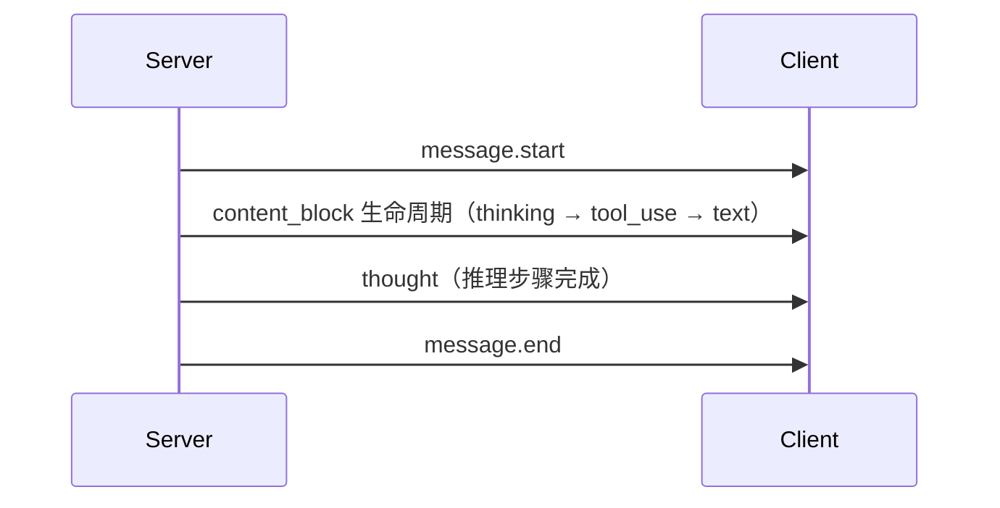

# AI 对话模块 API 接口

## 1. 文档概述

本文档定义 **AI 对话** 模块的 HTTP API 规范，是该模块 API 契约的**唯一权威来源**。

AI 对话 API 采用**双轨并行**设计：

| 轨道 | 路径前缀 | 响应格式 | 用途 |
|------|---------|---------|------|
| **内部 API** | `/api/v1/ai` | 本系统统一格式（`code/msg/data`）+ 自定义 SSE | 本系统前端，完整功能（会话管理、推理可视化、反馈等） |
| **OpenAI 兼容 API** | `/api/v1/chat/completions` | OpenAI 原生格式 + OpenAI SSE 格式 | 第三方接入，支持 OpenAI SDK / 第三方客户端（Chatbox、Open WebUI 等） |
| **Claude 兼容 API** | `/api/v1/messages` | Claude 原生格式 + Claude SSE 格式 | Claude SDK 接入 |

- **公共约定**：参见 [02-系统架构/04-API规范.md](../../../02-系统架构/04-API规范.md)
- **流式协议**：
  - 内部 API：SSE（Server-Sent Events），自定义事件类型
  - OpenAI 兼容 API：SSE，遵循 OpenAI Chat Completions 流式规范
  - Claude 兼容 API：SSE，遵循 Anthropic Messages 流式规范

> 内部 API 的消息发送采用 SSE 流式输出，推理过程通过 SSE 事件推送。兼容 API 分别遵循 OpenAI 和 Claude 的原生协议规范。接口详细参数/响应结构可通过 API 文档 MCP 查询，本文档仅定义接口清单和权限标识。

## 2. 接口清单

### 2.1 会话管理接口

> **会话生命周期**：创建会话 → 发送消息 → 流式接收回复 → 会话归档/删除。会话列表按最后活跃时间倒序，支持置顶。

| 路径 | 方法 | 功能描述 | 权限标识 | 关联功能点 |
|------|------|---------|---------|-----------|
| `/api/v1/ai/conversations` | POST | 创建对话会话 | - | F-M06-001 |
| `/api/v1/ai/conversations` | GET | 会话列表（分页，支持搜索/置顶筛选） | - | F-M06-001 |
| `/api/v1/ai/conversations/{id}` | GET | 会话详情（含模型配置、消息数等） | - | F-M06-001 |
| `/api/v1/ai/conversations/{id}` | PATCH | 部分更新会话（标题/置顶/归档/模型配置） | - | F-M06-001 |
| `/api/v1/ai/conversations/{id}` | DELETE | 删除会话（软删除，30天可恢复） | - | F-M06-001 |

### 2.2 消息接口

> **流式模式**：POST 发送消息立即返回 SSE 流，逐 token 推送回复内容、推理步骤、工具调用事件。非流式模式返回完整响应。

| 路径 | 方法 | 功能描述 | 权限标识 | 关联功能点 |
|------|------|---------|---------|-----------|
| `/api/v1/ai/conversations/{id}/messages` | POST | 发送消息（SSE 流式输出），请求头携带 `Idempotency-Key` 防重复发送，请求体携带 `resume` 参数时恢复中断的推理 | - | F-M06-001 |
| `/api/v1/ai/conversations/{id}/messages` | GET | 会话消息列表（分页，按时间正序） | - | F-M06-001 |
| `/api/v1/ai/conversations/{id}/messages/stream/{streamSessionId}` | GET | SSE 断线重连（携带 `Last-Event-ID` 请求头从断点恢复） | - | F-M06-001 |
| `/api/v1/ai/messages/{id}` | GET | 消息详情（含推理步骤、工具调用） | - | F-M06-002 |
| `/api/v1/ai/messages/{id}/regenerate` | POST | 重新生成回复（创建分支消息） | - | F-M06-001 |
| `/api/v1/ai/messages/{id}` | PUT | 编辑用户消息并重新触发回复（创建分支消息） | - | F-M06-001 |
| `/api/v1/ai/messages/{id}/stop` | POST | 停止流式输出 / 取消当前推理 | - | F-M06-001 |

**SSE 事件类型**（POST 发送消息的流式响应）：

| 事件 | 说明 | data 结构 |
|------|------|----------|
| `message.start` | 消息开始 | `{messageId, conversationId, model}` |
| `content_block.start` | 内容块开始 | `{index, type}` — type: `text`/`thinking`/`tool_use` |
| `content_block.delta` | 内容块增量 | `{index, delta}` — delta.type: `text_delta`/`thinking_delta`/`input_json_delta`（工具参数流式增量） |
| `content_block.stop` | 内容块结束 | `{index}` — 标记该内容块完整，可解析完整工具参数 |
| `thought` | 推理步骤完成 | `{position, thought, tool, toolInput, observation, status, latencyMs}` — 完整推理步骤记录 |
| `interrupt` | 推理中断 | `{type, data}` — type: `confirm`/`quota`/`async_wait` |
| `ping` | 心跳保活 | `{}` — 每 15 秒推送，防止代理超时断连 |
| `error` | 错误事件 | `{code, message}` |
| `message.end` | 消息结束 | `{stopReason, usage}` — stopReason: `stop`/`tool_calls`/`length`/`content_filter`/`canceled`；usage: `{inputTokens, outputTokens, cachedInputTokens, credits}` |

**事件流程示例**：

> **恢复中断的推理**：POST 发送消息时，请求体携带 `resume` 参数可恢复中断的推理（复用消息发送接口，不单独提供恢复端点）。

### 2.3 推理中断查询接口

| 路径 | 方法 | 功能描述 | 权限标识 | 关联功能点 |
|------|------|---------|---------|-----------|
| `/api/v1/ai/conversations/{id}/interrupts` | GET | 查询当前中断点信息（类型、数据，用于渲染确认卡片） | - | F-M06-002 |

### 2.4 上下文管理接口

| 路径 | 方法 | 功能描述 | 权限标识 | 关联功能点 |
|------|------|---------|---------|-----------|
| `/api/v1/ai/conversations/{id}/artifacts` | GET | 会话中间产物列表 | - | F-M06-003 |
| `/api/v1/ai/artifacts/{id}` | GET | 中间产物详情（含摘要元数据） | - | F-M06-003 |
| `/api/v1/ai/users/me/memories` | GET | 当前用户长期记忆列表 | - | F-M06-003 |
| `/api/v1/ai/users/me/memories/{id}` | DELETE | 删除单条记忆 | - | F-M06-003 |

### 2.5 模型管理接口

| 路径 | 方法 | 功能描述 | 权限标识 | 关联功能点 |
|------|------|---------|---------|-----------|
| `/api/v1/ai/models` | GET | 可用模型列表（含能力标识、积分单价） | - | F-M06-007 |
| `/api/v1/ai/models` | POST | 新增模型配置（管理员） | `ai:model:manage` | F-M06-007 |
| `/api/v1/ai/models/{id}` | PUT | 更新模型配置（管理员） | `ai:model:manage` | F-M06-007 |
| `/api/v1/ai/models/{id}` | DELETE | 删除模型配置（管理员，软删除） | `ai:model:manage` | F-M06-007 |

### 2.6 消息反馈接口

| 路径 | 方法 | 功能描述 | 权限标识 | 关联功能点 |
|------|------|---------|---------|-----------|
| `/api/v1/ai/messages/{id}/feedback` | POST | 提交/更新反馈（点赞/点踩） | - | F-M06-008 |
| `/api/v1/ai/messages/{id}/feedback` | GET | 查询消息反馈状态 | - | F-M06-008 |
| `/api/v1/ai/messages/{id}/feedback` | DELETE | 撤销反馈 | - | F-M06-008 |

### 2.7 配额查询接口

| 路径 | 方法 | 功能描述 | 权限标识 | 关联功能点 |
|------|------|---------|---------|-----------|
| `/api/v1/ai/quota` | GET | 查询 AI 对话积分日/月配额使用情况 | - | F-M06-001 |

### 2.8 OpenAI 兼容 API

> 完全遵循 OpenAI Chat Completions API 规范，支持 OpenAI SDK / 第三方客户端直接接入。

| 路径 | 方法 | 功能描述 | 权限标识 | 关联功能点 |
|------|------|---------|---------|-----------|
| `/api/v1/chat/completions` | POST | 对话补全（支持流式/非流式，`stream` 参数控制） | - | F-M06-001 |
| `/api/v1/models` | GET | 模型列表（OpenAI 格式） | - | F-M06-007 |

**会话管理约定**：
- 请求中可传 `conversation_id`（自定义扩展字段）指定已有会话，不传则自动创建新会话
- 自动创建的会话标题从首条用户消息提取
- 兼容 API 不暴露会话列表/删除/归档等管理接口，这些操作通过内部 API 完成

**与内部 API 的差异**：

| 差异点 | 内部 API | OpenAI 兼容 API |
|--------|---------|----------------|
| 响应格式 | `{code, msg, data}` | OpenAI 原生 `{id, object, choices, usage}` |
| SSE 事件 | 自定义（content_block/thought 等） | OpenAI 标准（`data: {choices:[{delta}]}`） |
| 推理过程 | 有（thought 事件） | 无 |
| 会话管理 | 有（创建/列表/删除/归档） | 无（通过 `conversation_id` 指定，无则自动创建） |
| 认证 | Session / API Key | API Key（`Authorization: Bearer dhak_xxx`） |
| 工具调用 | 有（content_block type=tool_use） | 有（OpenAI tool_calls 格式） |

### 2.9 Claude 兼容 API

> 完全遵循 Anthropic Messages API 规范，支持 Claude SDK 直接接入。

| 路径 | 方法 | 功能描述 | 权限标识 | 关联功能点 |
|------|------|---------|---------|-----------|
| `/api/v1/messages` | POST | 消息对话（支持流式/非流式，`stream` 参数控制） | - | F-M06-001 |
| `/api/v1/models` | GET | 模型列表（Claude 格式） | - | F-M06-007 |

**会话管理约定**：
- 与 OpenAI 兼容 API 一致：请求中可传 `conversation_id`（自定义扩展字段）指定已有会话，不传则自动创建新会话

**与内部 API 的差异**：

| 差异点 | 内部 API | Claude 兼容 API |
|--------|---------|----------------|
| 响应格式 | `{code, msg, data}` | Claude 原生 `{id, type, content, usage}` |
| SSE 事件 | 自定义（content_block/thought 等） | Claude 标准（`message_start`/`content_block_delta`/`message_stop`） |
| 认证头 | `Authorization: Bearer` | `x-api-key` + `anthropic-version` |
| system 消息 | 在 messages 中 role=system | 独立的 `system` 顶层字段 |
| 推理过程 | 有（thought 事件） | 无 |

## 3. 权限标识汇总

| 权限标识 | 说明 |
|---------|------|
| - | AI 对话基础功能无特殊权限标识，登录用户即可操作；VIP 配额通过会员等级控制 |
| `ai:model:manage` | 模型配置管理（新增/修改/删除模型），仅管理员 |

## 4. 业务错误码

| 错误码 | 说明 | 触发场景 |
|--------|------|---------|
| `A0401` | 请求资源不存在 | 会话/消息/产物不存在 |
| `A0403` | 无权限访问 | 访问他人的会话或消息 |
| `A0500` | 业务异常 | 单条消息超过 4000 字符、会话并发流式冲突 |
| `A0502` | 数据状态不允许 | 对已删除会话发消息、对非助手消息反馈、反馈超时效 |
| `A0503` | 操作不允许 | AI 对话积分已达上限，需升级 VIP |
| `A0600` | 操作失败 | LLM 调用失败、流式超时、工具调用失败 |
| `A0601` | 模型不可用 | 选择的模型已禁用或不支持所需能力（如多模态） |
| `B0100` | 系统执行超时 | 流式输出超时（120 秒无新 token） |
| `A0230` | token 无效或已过期 | 未登录访问 |
