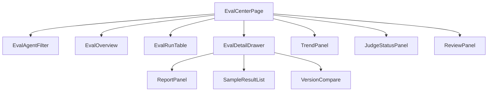

# AI 对话模块 - 前端实现设计（Agent 评测）

## 1. 文档概述

本文档描述 Agent 评测（F-M08-014）的前端实现方案，覆盖管理端**评测中心页**与智能体详情页**评测区**。页面结构与交互规范见 [需求规格.md](./需求规格.md)，接口契约见 [API接口.md](../API接口.md) §2.6。多端参考本 Web 端组件结构与状态管理方案按各自技术栈适配。

> 评测管理能力收敛至评测中心页，智能体详情页保留评测区入口（评测中心与评测区共用组件与状态管理）。

---

## 2. 页面定位

| 页面 | 回答的问题 | 使用者 |
|------|-----------|--------|
| 智能体详情页评测区 | 单个智能体的评测状态与发布门禁 | AI 能力配置者 |
| 评测中心页 | 全平台智能体评测管理、报告对比、趋势监控 | AI 能力配置者、平台管理员 |

---

## 3. 智能体详情页评测区（EvalPanel）

保留于智能体详情页（`/admin/ai-agents/:id` 评测 Tab），聚焦单 Agent：

| 区块 | 内容 |
|------|------|
| 评测集管理 | 该 Agent 的评测集（dev/regression/heldout）与样本管理入口 |
| 评测执行 | 手动触发开发集评测、查看最近执行 |
| 发布门禁状态 | 发布前回归集通过状态提示，未通过阻断并展示差异 |

---

## 4. 评测中心页

### 4.1 组件树

| 组件 | 职责 |
|------|------|
| EvalCenterPage | 评测中心页容器与路由入口（SFC `defineOptions name` 为 `AiEvalCenter`，与动态路由推导名一致以保证 keep-alive 命中） |
| EvalAgentFilter | 按智能体/评测集/时间筛选（时间范围仅作用于评测趋势） |
| EvalOverview | 评测总览：各智能体最近得分、门禁状态、退化告警 |
| EvalRunTable | 评测执行记录列表（触发方式/状态/得分/耗时） |
| EvalDetailDrawer | 评测详情抽屉：报告 + 样本明细 + 版本对比 |
| ReportPanel | 评测报告（总分 + 四维得分 + 指标级明细（任务完成/工具调用准确率/幻觉/死循环/效率）+ pass@k 通过率） |
| SampleResultList | 样本明细（通过/失败/差异说明），失败可下钻执行轨迹 |
| VersionCompare | 变更前后版本得分对比，显著退化（超阈值）显式标注 |
| TrendPanel | 评测历史趋势（退化发现，与门禁退化阈值对照） |
| JudgeStatusPanel | 判分模型状态：一致性验证状态、校准告警、漂移暂停门禁提示 |
| ReviewPanel | 人工复核（页面级）：线上抽样判定按比例抽取待确认项，复核回填用于判分校准 |

> ReviewPanel 归属页面而非评测详情抽屉：复核队列是跨 Agent 的抽样队列（失败样本全量 + 通过样本按比例抽样），与单次 run 无关，且回填后需联动判分状态（§4.4 数据流口径）。

### 4.2 状态管理

| 状态 | 说明 |
|------|------|
| `evalFilter` | 筛选条件（智能体/评测集/时间/分页） |
| `evalRuns` | 评测执行记录列表 |
| `evalOverview` | 各智能体评测总览与门禁状态 |
| `evalDetail` | 当前评测详情（报告/样本/对比） |
| `trendData` | 评测历史趋势 |
| `judgeStatus` | 判分模型状态（一致性验证/校准告警/门禁暂停） |
| `reviewQueue` | 人工复核待确认项 |

### 4.3 路由设计

| 路由路径 | 页面 | 权限控制 |
|---------|------|---------|
| `/admin/ai-eval-center` | 评测中心 | 管理员（`ai:agent:manage`）；评测报告对 AI 能力配置者可见 |

### 4.4 数据流

| 区块 | 数据来源 | 获取时机 |
|------|---------|---------|
| 评测总览（EvalOverview） | `GET /api/v1/ai/eval-center/overview` | 页面挂载 |
| 执行记录（EvalRunTable） | `GET /api/v1/ai/agents/{id}/eval/runs` | 筛选/分页变更 |
| 评测详情（ReportPanel/SampleResultList） | run 记录 `results` 明细（执行记录下钻） | 下钻触发 |
| 版本对比（VersionCompare） | `GET /api/v1/ai/eval-center/runs/{runId}/compare?baseRunId=` | 对比触发 |
| 趋势（TrendPanel） | `GET /api/v1/ai/eval-center/trends` | 页面挂载 |
| 判分状态（JudgeStatusPanel） | `GET /api/v1/ai/eval-center/judge-status` | 页面挂载 |
| 人工复核（ReviewPanel） | `GET /api/v1/ai/eval-center/reviews` + `POST /api/v1/ai/eval-center/reviews/{id}` | 页面挂载/提交回填 |

> 实现口径（受后端当前字段/参数约束，页面已就地标注）：
>
> - 执行记录端点无时间参数，筛选栏时间范围只下发到趋势端点；执行记录按智能体 + 评测集筛选（时间维度过滤为后端增强遗留）。
> - 执行记录无耗时字段，列表"耗时"取本次 run 各样本 `metrics.latency_ms` 合计。
> - pass@k 通过率取 `score_summary.pass_rate`（后端当前为单次评测的样本通过率，无 k 次采样）。
> - 版本对比的基准 run 候选复用 `GET /api/v1/ai/eval-center/trends?agentId=&limit=50` 并剔除当前 runId，不额外新增端点。

### 4.5 交互设计决策

| 交互点 | 技术选型 | 理由 |
|--------|---------|------|
| 评测-门禁联动 | 发布操作前校验回归集状态，未通过阻断并提示差异 | 发布门禁在 UI 层显性化，防止绕过（后端仍强制） |
| 报告下钻 | 报告 → 样本明细 → 失败样本执行轨迹 | 先看"整体好不好"，再"哪里不好"，最后"为什么"，符合迭代诊断路径 |
| 版本对比可视化 | 变更前后得分并列展示，退化（超阈值）显式标注 | 直接回答"改好了还是改差了"，退化一目了然 |
| 判分可信可见 | 判分模型一致性/校准状态在评测中心显性展示，漂移时提示门禁暂停 | 判分结果可信度透明，避免"分数不可信却放行" |
| 人工复核闭环 | ReviewPanel（页面级）抽样待确认项，回填后刷新队列并联动判分状态 | 校准判分模型、防指标失真（人机协同） |
| 测试与评测分离 | 测试 Agent 即时预览（单条）+ 评测中心批量回归 | 即时调试快速定位，评测回归承担门禁，职责分层 |

---

## 5. 公共组件使用

| 公共组件 | 配置要点 |
|---------|---------|
| 分页表格 | 评测执行记录、样本明细 |
| 抽屉（Drawer） | 评测详情、失败样本轨迹 |
| 标签页（Tabs） | 智能体详情页配置/版本/评测/A2A |
| 图表组件 | 评测趋势 |
| 折叠面板 | 版本对比、样本差异说明 |
