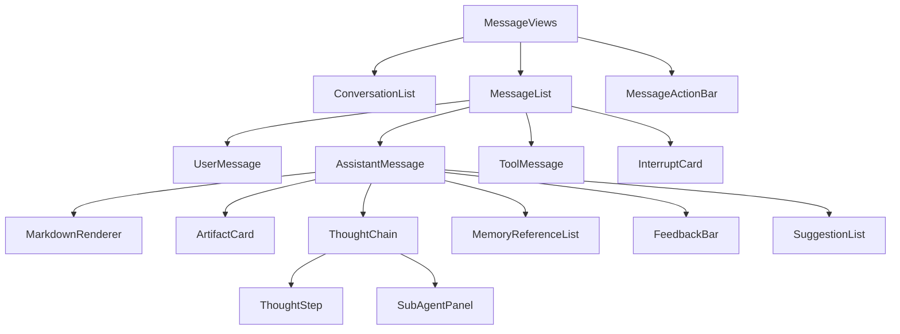
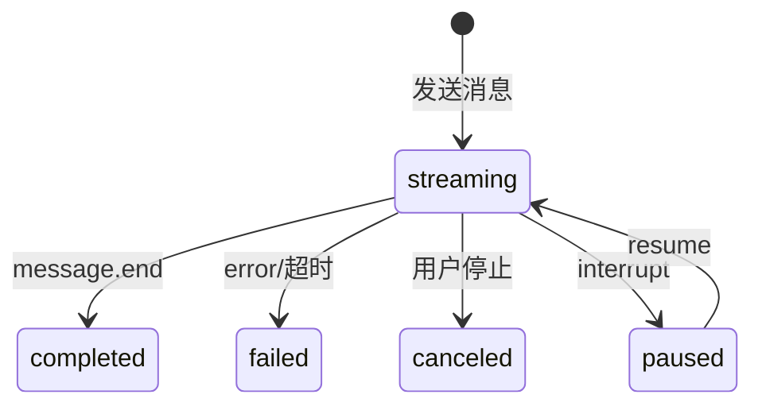

# AI 对话模块 - 前端实现设计（公共）

## 1. 文档概述

本文档描述 AI 对话模块**用户端与管理端共用的消息数据视图层与流式基础设施**：会话/消息数据视图组件（`scope` 驱动数据范围：用户端 `scope=self` 本人 / 管理端会话审计 `scope=admin` 全量）、SSE 流式状态机、会话级 Store 与消息操作。核心设计是**视图同构、数据范围可切换**——两端渲染同一套消息组件，仅查询参数与操作入口不同。

页面结构与交互规范见 [需求规格.md](./需求规格.md) §3，接口契约见 [API接口.md](./API接口.md) §2.1-2.2。用户端对话页见 [前端实现-用户端.md](./前端实现-用户端.md)，管理端四页见 [前端实现-管理端-会话管理.md](./前端实现-管理端-会话管理.md)/[前端实现-管理端-智能体管理.md](./前端实现-管理端-智能体管理.md)/[前端实现-管理端-MCP管理.md](./前端实现-管理端-MCP管理.md)/[前端实现-管理端-SKILL管理.md](./前端实现-管理端-SKILL管理.md)。

> 本公共文档仅承载**消息数据视图层与流式基础设施**（会话列表/消息流/消息操作/SSE 状态机）。输入区、会话设置、记忆面板等用户端交互与市场、命名空间、评测等管理端交互为端内特有，见各端文档；Markdown/代码高亮/图表等组件属项目公共组件库，不在本模块文档定义。

---

## 2. 公共组件树设计

| 组件 | 职责 |
|------|------|
| MessageViews | 消息数据视图层容器（无独立路由），按 `scope` 渲染对应视图，供用户端/管理端页面嵌入 |
| ConversationList | 会话列表：`scope=self` 按最后活跃时间倒序（搜索/置顶/归档范围筛选/未读数/批量选择）；`scope=admin` 全量用户会话（用户/模型/消息数/Token 与积分消耗/异常状态标注），仅展示不提供内容操作 |
| MessageList | 消息列表渲染：按时间正序，支持流式增量、分支切换；超 100 条启用虚拟滚动；自动滚动跟随，用户上滑时暂停跟随并显示"回到底部"按钮 |
| UserMessage | 用户消息展示，支持编辑重发、复制；编辑后展示"已编辑"标识并可查看原文 |
| AssistantMessage | 助手消息展示，聚合 Markdown/产物/推理过程/引用记忆/反馈/操作栏 |
| MessageActionBar | 消息操作栏（悬停出现）：复制、引用、重新生成、朗读、删除、反馈；复制成功切换完成态，代码块独立复制入口 |
| FeedbackBar | 渐进式反馈栏：点赞一键完成；点踩后展开 6 类问题标签单选，文字说明可选；已反馈状态高亮展示，支持撤销/修改 |
| ToolMessage | 工具调用消息，折叠展示工具名/参数/返回摘要，执行状态徽标更新 |
| ThoughtChain | 推理过程折叠展示，展开后按步骤显示，含子智能体并行消耗；推理模型的分析过程与正式回复分段展示 |
| ThoughtStep | 单个推理步骤（序号/耗时/thought/工具调用/observation/status） |
| SubAgentPanel | 子智能体并行消耗面板，展示各子智能体累计 Token 与积分 |
| InterruptCard | 中断交互卡片（确认/配额不足/异步等待） |
| ArtifactCard | 产物卡片（图片缩略图/指标报告/算法推荐/文件引用） |
| MemoryReferenceList | 助手回复引用的记忆清单（默认折叠） |
| SuggestionList | 类似问题推荐（`suggestions` 事件驱动），点击作为新消息发送，可忽略 |

> 组件只做数据获取与展示编排，是否提供操作入口由宿主页面按 `scope` 决定。

---

## 3. 状态管理

### 3.1 Store 模块划分

| Store 模块 | 职责 | 生命周期 |
|-----------|------|---------|
| 会话级 Store（chatStore） | 当前会话 ID、消息列表、流式输出状态、推理步骤、中断点、分支状态；数据范围由 `scope`（self/admin）区分 | 宿主页面级，随嵌入的用户端/管理端页面初始化，离开销毁 |

### 3.2 核心状态

| 状态 | 说明 |
|------|------|
| `scope` | 数据范围（`self`=本人 / `admin`=全量含异常标注），由宿主页面注入 |
| `conversations` | 会话列表，含未读消息数（`scope=admin` 含用户/消耗/异常标注） |
| `currentConversationId` | 当前会话 ID |
| `messages` | 当前会话消息列表 |
| `streamingMessageId` | 正在流式输出的消息 ID（null 表示空闲） |
| `interrupts` | 当前会话未处理的中断点 |
| `suggestions` | 当前回复的类似问题推荐（切换消息时清空） |
| `selectionMode` | 会话列表批量选择模式（勾选集合 + 目标操作：归档/删除；`scope=admin` 不提供内容操作） |
| `scrollFollowEnabled` | 流式自动滚动跟随开关（用户上滑时置 false，点击"回到底部"恢复） |

> Message 完整数据结构属 API 契约，见 [API接口.md](./API接口.md)；前端关注 `role`（选择渲染组件）、`status`（驱动流式状态机）、`agentThoughts`（推理过程）、`artifacts`（产物卡片）、`parentMessageId`（分支渲染）等字段。

### 3.3 核心操作

| 操作 | 说明 |
|------|------|
| `fetchConversations` | 按查询条件拉取会话列表（`scope=self` 默认可见性过滤，`scope=admin` 带 `view=admin`） |
| `fetchMessages` | 进入会话时按时间正序分页加载消息；切换会话时取消未完成请求 |
| `sendMessage` | 发送消息，建立 SSE 连接，携带 `Idempotency-Key` 防重复；引用预填充内容合并为消息内容后发送 |
| `stopStreaming` | 停止流式输出 / 取消当前推理 |
| `regenerate` | 重新生成助手回复，创建分支消息 |
| `editMessage` | 编辑用户消息并重新触发回复，创建分支 |
| `resumeInterrupt` | 恢复中断的推理（`POST /messages/{id}/resume` 独立流式端点） |
| `submitFeedback` | 提交/更新/撤销点赞点踩（渐进式：点赞一键提交；点踩携带问题标签 + 可选文字说明） |
| `deleteMessage` | 删除助手回复消息（软删除，删除后该分支"重新生成"入口不再展示） |
| `quoteMessage` | 将消息内容填充至输入区（本地操作，发起引用预填充） |
| `speakMessage` | 朗读助手回复（调用语音模块 [VoicePlayback](../../基础模块/语音交互/前端实现.md)，播报中再次点击停止） |
| `applySuggestion` | 点击推荐问题，作为新消息发送并清空推荐列表 |
| `reconnectStream` | 断线重连，携带 `Last-Event-ID` 从断点恢复 |

---

## 4. 数据流

### 4.1 数据获取策略

| 场景 | 策略 |
|------|------|
| 会话列表 | 分页加载，前端缓存减少重复请求；按最后活跃时间倒序 |
| 消息列表 | 进入会话时按时间正序分页加载；切换会话时取消未完成请求 |
| 中断点 | 进入会话时查询未处理中断，渲染对应 InterruptCard |

### 4.2 流式接收与更新策略

| 阶段 | 处理方式 |
|------|---------|
| 发送 | 创建 user 消息立即渲染；创建 assistant 占位（status=streaming）；建立 SSE 连接 |
| 增量更新 | `content_block.delta` 事件经 `requestAnimationFrame` 批量更新；Markdown 增量解析仅重渲染变化段；ThoughtChain 默认折叠降低渲染压力 |
| 中断 | `interrupt` 事件暂停流式（status=paused），渲染 InterruptCard |
| 完成 | `message.end` 标记完成，更新 token 统计与积分消耗 |
| 推荐问题 | `suggestions` 事件（在 `message.end` 后推送）填充 `suggestions` 状态，渲染 SuggestionList |
| 断线重连 | 网络断连后自动重连（携带 `Last-Event-ID` + 流式会话 ID，最大 3 次间隔 3 秒）从断点恢复 |

> 引用、复制、朗读、删除等消息操作为本地交互或依赖语音模块，不经过 SSE 数据流。SSE 事件类型与 data 结构见 [API接口.md](./API接口.md) §2.2。

### 4.3 流式输出状态机

单次流式超 120 秒无新 token 判定超时失败；同一会话同一时间仅允许一个流式输出进行中。

---

## 5. 公共交互设计决策

| 交互点 | 技术选型 | 理由 |
|--------|---------|------|
| 视图同构、scope 驱动数据范围 | 组件/Store 统一以 `scope` 决定查询参数与操作入口 | 用户端=self、管理端审计=admin，同一份实现两端复用，杜绝重复开发 |
| 流式接收 | SSE（自定义事件） | 单向推送契合 LLM 输出；复用 HTTP 连接与认证；断线重连携带 `Last-Event-ID` 从断点恢复，比 WebSocket 轻；`EventSource` API 零依赖 |
| 流式增量批量更新 | `requestAnimationFrame` 批量更新 | 逐 token 更新会触发同一帧多次 DOM 写入；批量更新让写入节奏与渲染帧对齐，渲染成本降一个数量级 |
| 消息分支管理 | parentMessageId 树 + 分支切换器 | 重新生成/编辑重发创建新分支，原消息保留；切换器（< 2/3 >）切换查看，不破坏历史 |
| 推理中断恢复 | interrupt 事件 + `POST /messages/{id}/resume` 独立流式端点 | 暂停推理展示确认卡片，用户操作后调用独立 `resume` 端点续流 |
| 推理过程展示 | ThoughtChain 默认折叠 | 减少渲染压力；推理过程是"过程信息"，默认折叠避免长思考链压过最终回复 |
| 滚动跟随控制 | 自动跟随 + 上滑暂停 + "回到底部" | 流式中自动滚动跟随最新内容；用户上滑阅读时暂停跟随，避免打断阅读 |
| 工具调用可见 | ToolMessage 折叠展示生命周期 | 让用户看到"AI 刚才做了什么"，执行状态（待执行/执行中/成功/失败）实时呈现 |
| 异步等待挂起 | async_wait 中断 + 消息状态轮询 | `message.end` 仅表示本轮流式通道关闭，消息 status 未变 2 前轮询拉取最终 content |
| XSS 防护 | MarkdownRenderer 转义 | LLM 输出经 Markdown 渲染自动转义 HTML；产物卡片 URL 校验白名单 |
| 渲染性能 | 虚拟滚动 + 增量渲染 | 消息列表超 100 条虚拟滚动；token 增量批量更新；产物缩略图懒加载 |

---

## 6. 两端差异

| 差异点 | 用户端（scope=self） | 管理端会话审计（scope=admin） |
|--------|---------------------|------------------------------|
| 数据范围 | 本人会话/消息 | 全量用户会话/消息（含用户、Token 与积分消耗、异常标注） |
| 列表组织 | 按最后活跃倒序 + 置顶 + 未读数 | 全量列表 + 用户/时间/状态/关键词筛选 + 异常会话标注 |
| 会话操作 | 创建/归档/删除/导出/置顶 | 仅只读浏览与链路追踪，无内容操作 |
| 消息交互 | 发送/停止/重新生成/编辑/反馈/引用 | 只读查看，推理链下钻 |
| 端内特有 | 输入区/会话设置/记忆面板/EmptyState | 链路追踪面板/异常筛选/审计口径展示 |

> 流式状态机、中断恢复等为发送侧能力，仅在用户端触发；管理端审计以只读消费消息视图（不发送消息）。
