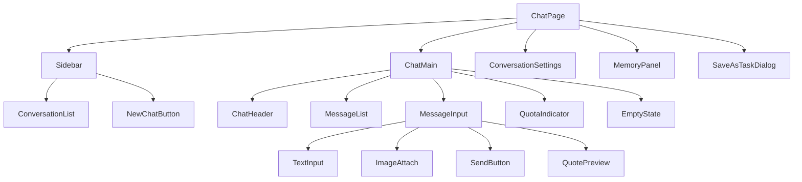

# AI 对话模块 - 前端实现设计（用户端）

## 1. 文档概述

本文档描述 AI 对话模块**用户端对话页**的 Web 端（React）前端实现方案，聚焦页面编排、端内状态与流式交互。页面结构与交互规范见 [需求规格.md](./需求规格.md) §3.2，接口契约见 [API接口.md](./API接口.md) §2.1-2.2。会话/消息数据视图、SSE 流式状态机与消息操作等**消息数据视图层**见 [前端实现-公共.md](./前端实现-公共.md)（本端以 `scope=self` 使用）。管理端各页见 [前端实现-管理端-会话管理.md](./前端实现-管理端-会话管理.md) 等。Android / Flutter / Taro 等多端参考本 Web 端的组件结构与状态管理方案按各自技术栈适配。

用户端对话页承担"对话即服务"：统一对话入口承载问答、写作、代码、图像处理调度等多类任务，核心链路（会话列表 → 对话 → 结果）一页完成。

---

## 2. 组件树设计

| 组件 | 职责 |
|------|------|
| ChatPage | 页面容器，路由入口，管理对话全局状态与子组件编排 |
| Sidebar | 会话侧栏容器：会话列表 + 新建会话入口 |
| NewChatButton | 新建会话按钮，创建后进入新会话（可指定 agent_code） |
| ConversationList（公共） | 会话列表：`scope=self` 按最后活跃度排序，支持搜索/置顶/归档范围筛选/未读数/批量操作/回收站 |
| ChatHeader | 对话头部：会话标题、模型/智能体切换、会话设置入口 |
| MessageList（公共） | 消息列表渲染，支持流式增量、分支切换、虚拟滚动 |
| MessageInput | 消息输入区：文本/图片/附件粘贴拖拽；语音输入内嵌语音模块 [VoiceInput](../../基础模块/语音交互/前端实现.md)；流式中发送按钮变为停止按钮 |
| TextInput | 文本输入（回车发送、Shift+回车换行），占位透出产品身份与能力 |
| ImageAttach | 多模态附件上传，上传前校验模型多模态能力 |
| QuotePreview | 引用预览条：展示被引用消息摘要，可移除后发送 |
| QuotaIndicator | 配额提示条：日/月已用与限额，不足时引导升级 |
| EmptyState | 新会话开场引导：问候语 + 2-4 条示例问题（本地静态数据），首次使用全屏展示 |
| ConversationSettings | 会话设置弹窗：标题/模型/智能体/系统提示词/上下文配置/类似问题推荐开关 |
| MemoryPanel | 长期记忆查看/筛选/删除/清空/手动录入/导出 |
| SaveAsTaskDialog | 将对话流程保存为定时任务（常用频率快捷项/Cron + 输入来源/输出目标） |

> 消息渲染（UserMessage/AssistantMessage/ToolMessage/ThoughtChain/InterruptCard/FeedbackBar 等）、AgentSelector/ModelSelector 下拉的职责见 [前端实现-公共.md](./前端实现-公共.md) 与各分篇；模型选择下拉消费 [AI模型管理模块](../../基础模块/AI模型管理/API接口.md) `GET /api/v1/ai/models/enabled`（`model_type=chat`）。

---

## 3. 状态管理

### 3.1 Store 模块划分

| Store 模块 | 职责 | 生命周期 |
|-----------|------|---------|
| 全局 Store | 会话列表、可用模型列表、配额信息、定时任务列表 | 应用级，跨会话共享 |
| 会话级 Store（chatStore，公共） | 当前会话 ID、消息列表、流式输出状态、推理步骤、中断点（scope=self） | 宿主页面级，见 [前端实现-公共.md](./前端实现-公共.md) |

### 3.2 核心状态

| 状态 | 说明 |
|------|------|
| `availableModels` | 可用模型列表（含能力标识、积分单价、上下文长度、速度档位、模型标签、降级标识） |
| `quota` | 配额使用情况（日/月已用与限额） |
| `scheduledTasks` | 用户定时任务列表 |
| `quote` | 引用预填充内容（`{sourceMessageId, text}`，发送或清空后重置） |
| `conversationSettings` | 当前会话设置（模型/智能体/系统提示词/类似问题推荐开关） |

> 会话列表（`conversations`）、消息（`messages`）、流式状态（`streamingMessageId`）等状态在公共 chatStore 中，本端以 `scope=self` 注入。

### 3.3 核心操作

| 操作 | 说明 |
|------|------|
| `createConversation` | 新建会话（可指定 agent_code），首条消息后异步生成标题 |
| `switchAgent` | 切换会话绑定的 Agent，下一条消息生效 |
| `switchModel` | 切换会话模型，下一条消息生效 |
| `updateConversationSettings` | 更新会话设置（系统提示词/类似问题推荐开关等） |
| `batchOperateConversations` | 批量归档/删除会话（删除需二次确认） |
| `exportConversation` | 导出会话为 Markdown/JSON |
| `saveAsScheduledTask` | 将对话流程保存为定时任务 |
| `fetchMemories` | 长期记忆查看/筛选/删除/导出 |

> 发送（`sendMessage`）、停止（`stopStreaming`）、重新生成（`regenerate`）、中断恢复（`resumeInterrupt`）、反馈（`submitFeedback`）等操作在公共 chatStore 中。

---

## 4. 路由设计

| 路由路径 | 页面 | 权限控制 | 守卫说明 |
|---------|------|---------|---------|
| `/chat` | ChatPage | 登录用户 | 默认进入最新会话或新建 |
| `/chat/:conversationId` | ChatPage | 登录用户 | 指定会话，进入时加载消息并检查未处理中断 |

> 管理端各页路由（会话审计/智能体/MCP/SKILL）见各管理端前端文档，与用户端独立。

---

## 5. 数据流

| 区块 | 数据来源 | 获取时机 | 缓存策略 |
|------|---------|---------|---------|
| 会话列表 | `GET /api/v1/ai/conversations`（scope=self） | 页面挂载 + 搜索/筛选变更 | 当前查询条件结果缓存；创建/删除/归档后失效 |
| 消息列表 | `GET /conversations/{id}/messages` | 进入会话 + 分页 | 切换会话时取消未完成请求 |
| 模型列表 | `GET /api/v1/ai/models/enabled?model_type=chat` | 应用挂载 | 应用级缓存 |
| 配额 | 配额接口 | 发送消息前校验 | 应用级缓存 |
| 中断点 | 中断查询接口 | 进入会话时 | 无 |
| 定时任务 | `GET /api/v1/ai/scheduled-tasks` | 保存为定时任务弹窗打开时 | 当前结果缓存 |

> 流式接收与更新策略（`requestAnimationFrame` 批量更新、断线重连、async_wait 轮询等）见 [前端实现-公共.md](./前端实现-公共.md) §4.2。

---

## 6. 交互设计决策

| 交互点 | 技术选型 | 理由 |
|--------|---------|------|
| 新会话引导 | EmptyState 本地静态示例问题 | 示例问题为平台预设静态内容，零接口请求、不消耗 Token，降低新手开口门槛 |
| 消息引用 | 本地填充输入区（QuotePreview） | 引用是"继续对话"的低成本路径：不建立消息引用关系、无接口调用，引用后作为普通新消息发送 |
| 类似问题推荐 | `suggestions` SSE 事件 + SuggestionList | 推荐问题随回复由 LLM 生成并随 SSE 推送，渲染于回复末尾；可忽略不发送 |
| 配额不足引导 | quota 中断 + 升级/降级 | 单步预扣失败展示"积分不足"卡片，支持升级后从当前步骤继续或降级（切模型/减并行度） |
| 会话设置收敛 | ConversationSettings 弹窗承载模型/智能体/系统提示词 | 会话级配置项收敛于弹窗，不挤占对话画布；模型切换与智能体切换下一条消息生效 |
| 定时任务固化 | SaveAsTaskDialog 内联于对话页 | 对话流程"确认后保存为定时任务"闭环，常用频率快捷项 + Cron + 下次触发时间预览 |

> 流式滚动跟随、推理过程折叠、工具调用可见、XSS 防护等公共交互见 [前端实现-公共.md](./前端实现-公共.md) §5。

---

## 7. 公共组件使用

| 公共组件 | 配置要点 |
|---------|---------|
| MarkdownRenderer | 渲染 LLM 输出，支持代码高亮/表格/链接；开启 HTML 转义防 XSS；增量解析仅重渲染变化段 |
| 代码高亮组件 | 多语言语法高亮，长代码块折叠 + 一键复制 |
| Mermaid 图渲染 | 识别 Markdown 中 mermaid 代码块并渲染为流程图 |
| 公式渲染（KaTeX） | 渲染 LaTeX 公式（行内与块级） |
| 虚拟滚动列表 | 消息列表超 100 条启用，仅渲染可视区域 |
| 文件上传组件 | 多模态附件上传，上传前校验模型多模态能力（图片需视觉能力、文档需文档理解能力、音视频需对应理解能力） |
