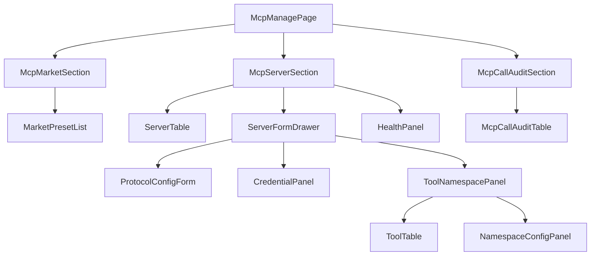

# AI 对话模块 - 前端实现设计（管理端-MCP 管理）

## 1. 文档概述

本文档描述 AI 对话模块**管理端 MCP 管理页**的 Web 端（React）前端实现方案，聚焦外部 MCP Server 的接入中心（市场 + 管理）页面编排与交互。页面结构与交互规范见 [需求规格.md](./需求规格.md) §3.3.3，接口契约见 [API接口.md](./API接口.md) §2.13。Android / Flutter / Taro 等多端参考本 Web 端的组件结构与状态管理方案按各自技术栈适配。

管理端 MCP 管理页承担"外部 MCP Server 的通用接入中心"：市场（内置预设一键接入）+ 管理（注册表/工具与命名空间/凭据/健康/调用审计），让任何符合 MCP 规范的服务可接入、可授权、可审计。

---

## 2. 组件树设计

| 组件 | 职责 |
|------|------|
| McpManagePage | MCP 管理页容器与路由入口，编排市场/Server 管理/调用审计三区 |
| McpMarketSection | MCP 市场区：内置常用 Server 预设目录（名称/描述/能力标签/已接入状态） |
| MarketPresetList | 市场预设列表，一键接入（install 后转注册并拉取工具清单） |
| McpServerSection | Server 管理区：已接入 Server 列表 + 注册表单 + 健康状态 |
| ServerTable | Server 表格：名称/传输协议/端点/鉴权方式/启用状态/健康状态/工具数 |
| ServerFormDrawer | Server 注册/编辑抽屉（名称/描述/传输协议/端点/鉴权方式） |
| ProtocolConfigForm | 传输协议配置（stdio/streamable-http/sse + 端点 URL） |
| CredentialPanel | 凭据配置（外部服务 API Key，仅录入/更新不回显明文） |
| ToolNamespacePanel | 工具与命名空间面板：查看 Server 工具清单，工具分组为命名空间供 Agent 关联 |
| ToolTable | Server 工具清单（工具名/描述/参数 schema 概要） |
| NamespaceConfigPanel | 命名空间配置（覆盖式更新） |
| HealthPanel | 健康探测结果（连通性/延迟，异常显著标注） |
| McpCallAuditSection | 调用审计区：外部 MCP 工具调用记录 |
| McpCallAuditTable | 调用审计表（调用者/时间/Server/工具/结果/耗时，分页） |

> 系统内部 MCP 能力网关（元工具）作为内置工具来源保留，不通过本页管理；命名空间预筛选机制见 [需求规格-能力扩展](./需求规格-能力扩展.md) §2.6.13 与 [后端实现-能力扩展](./后端实现-能力扩展.md) §5。

---

## 3. 状态管理

### 3.1 Store 模块划分

| Store 模块 | 职责 | 生命周期 |
|-----------|------|---------|
| 管理端 MCP Store（adminMcpStore） | 市场目录、Server 列表/表单/健康、工具与命名空间、调用审计 | 页面级，进入 MCP 管理页初始化，离开销毁 |

### 3.2 核心状态

| 状态 | 说明 |
|------|------|
| `marketPresets` | MCP 市场预设目录（含已接入状态） |
| `servers` | 已接入 Server 分页列表（含启用/健康状态/工具数） |
| `serverForm` | Server 表单状态（`{server, visible}`，含协议/端点/鉴权配置） |
| `credentials` | 当前 Server 凭据配置状态（仅录入/更新，不回显明文） |
| `tools` | 当前 Server 工具清单 |
| `namespaces` | 当前 Server 命名空间配置 |
| `health` | Server 健康探测结果 |
| `mcpCalls` | 外部 MCP 调用审计列表 |

### 3.3 核心操作

| 操作 | 说明 |
|------|------|
| `fetchMarketPresets` | 拉取 MCP 市场目录 |
| `installPreset` | 市场一键接入预设 Server（注册并拉取工具清单） |
| `fetchServers` | 拉取已接入 Server 列表 |
| `registerServer` | 注册/更新外部 MCP Server（注册后自动拉取工具清单） |
| `switchServerStatus` | 启停 Server（禁用后不参与命名空间预筛选） |
| `deleteServer` | 删除 Server（校验 Agent 关联，有则提示先解绑） |
| `configureCredentials` | 配置凭据（加密存储，仅录入/更新） |
| `fetchTools` | 拉取 Server 工具清单 |
| `configureNamespaces` | 配置命名空间（覆盖式更新） |
| `probeHealth` | 健康探测 |
| `fetchMcpCalls` | 拉取外部 MCP 调用审计 |

---

## 4. 路由设计

| 路由路径 | 页面 | 权限控制 |
|---------|------|---------|
| `/admin/ai-mcp` | MCP 管理页（市场 + 管理） | 管理员（`ai:mcp:manage`） |

> 路由守卫校验 `ai:mcp:manage`，无权限跳转 403；市场目录浏览需登录，接入操作需权限。

---

## 5. 数据流

### 5.1 数据获取策略

| 区块 | 数据来源 | 获取时机 | 缓存策略 |
|------|---------|---------|---------|
| 市场目录 | `GET /api/v1/ai/mcp/market` | 进入页面 + 切换市场 Tab | 当前结果缓存；接入后刷新已接入状态 |
| Server 列表 | `GET /api/v1/ai/mcp/servers` | 进入页面 + 筛选/分页变更 | 当前筛选结果缓存；注册/启停/删除后失效 |
| Server 表单 | `GET /api/v1/ai/mcp/servers/{id}`（编辑回显） | 打开抽屉时 | 抽屉会话级缓存 |
| 工具清单 | `GET /api/v1/ai/mcp/servers/{id}/tools` | 注册成功/打开工具 Tab | 当前结果缓存；注册后拉取 |
| 命名空间 | `GET /api/v1/ai/mcp/servers/{id}/namespaces` | 打开命名空间面板 | 保存后刷新 |
| 健康探测 | `GET /api/v1/ai/mcp/servers/{id}/health` | 页面挂载 + 手动刷新 | 无（实时性优先） |
| 调用审计 | `GET /api/v1/ai/mcp/calls` | 切换审计 Tab + 分页 | 当前筛选结果缓存 |

### 5.2 更新策略

- **接入即发现**：注册/市场接入成功后自动拉取工具清单，ToolNamespacePanel 可预览工具定义再启用
- **健康联动**：HealthPanel 探测结果实时展示，异常 Server 在列表显著标注
- **凭据不回显**：CredentialPanel 仅支持录入/更新，已配置状态以"已配置"标识展示，不回显明文

---

## 6. 交互设计决策

| 交互点 | 技术选型 | 理由 |
|--------|---------|------|
| 市场-管理分区 | 市场（预设一键接入）+ 管理（注册表/工具/凭据/健康/审计）Tab 组织 | 先"发现可用 Server"，再"管理已接入 Server"，降低接入门槛 |
| 接入即预览再启用 | 注册后拉取工具清单，管理员预览工具定义后启用 | 避免"接入即生效"带来的未知能力暴露，接入可控（需求规格 §2.6.13） |
| 凭据安全录入 | CredentialPanel 仅录入/更新，不回显明文 | 外部服务密钥属高敏信息，防泄露（需求规格 §2.6.10） |
| 命名空间授权内联 | ToolNamespacePanel 工具分组 → 命名空间 → 与 Agent 配置关联 | 最小权限在工具源头显性配置，Agent 仅可访问关联命名空间 |
| 健康状态可见 | HealthPanel 实时探测 + 列表状态标注 | Server 可用性是外部能力接入的信任底座，异常可发现可处置 |

---

## 7. 公共组件使用

| 公共组件 | 配置要点 |
|---------|---------|
| 分页表格 | Server 列表、工具清单、调用审计表 |
| 弹窗/抽屉（Drawer） | Server 注册/编辑抽屉、凭据配置弹窗 |
| 标签页（Tabs） | 市场/Server 管理/调用审计切换 |
| 状态标签 | Server 启用/禁用、健康状态（正常/异常）、已接入状态 |
| 表单校验组件 | 端点 URL 格式校验、协议必填、凭据必填校验 |
