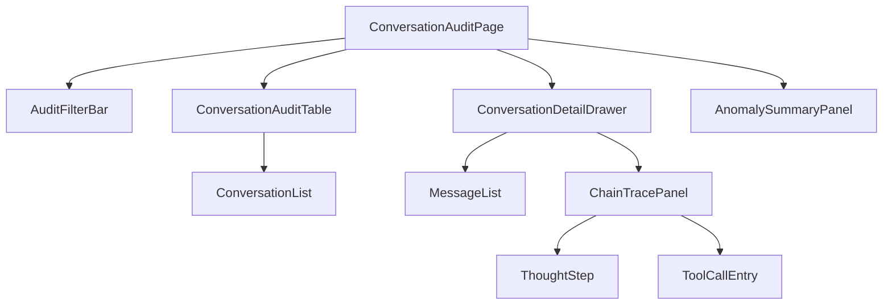

# AI 对话模块 - 前端实现设计（管理端-会话管理）

## 1. 文档概述

本文档描述 AI 对话模块**管理端会话管理页**的 Web 端（React）前端实现方案，聚焦页面编排、端内状态与链路追踪交互。页面结构与交互规范见 [需求规格.md](./需求规格.md) §3.3.1，接口契约见 [API接口.md](./API接口.md) §2.1。会话/消息数据视图层（MessageViews/ConversationList/MessageList 等）为用户端与管理端共用，见 [前端实现-公共.md](./前端实现-公共.md)（本端以 `scope=admin` 使用）。智能体管理见 [前端实现-管理端-智能体管理.md](./前端实现-管理端-智能体管理.md)，MCP/SKILL 管理见对应分篇。Android / Flutter / Taro 等多端参考本 Web 端的组件结构与状态管理方案按各自技术栈适配。

管理端会话管理页承担"平台 AI 行为审计"：全量会话检索（`scope=admin`）+ 只读会话浏览 + AI 链路追踪（单条消息下钻完整推理链），服务审计合规、故障排查与问题定位。

---

## 2. 组件树设计

| 组件 | 职责 |
|------|------|
| ConversationAuditPage | 会话审计页容器与路由入口，编排筛选/列表/详情抽屉/链路追踪 |
| AuditFilterBar | 审计筛选栏：用户/时间范围/状态/异常类型/关键词，驱动审计列表查询 |
| ConversationAuditTable | 会话审计表格：`scope=admin` 全量用户会话（用户/模型/消息数/Token 与积分消耗/状态/异常标注），点击进入详情 |
| ConversationList（公共） | 会话列表数据视图（scope=admin），承载审计表格的数据获取与分页 |
| AnomalySummaryPanel | 异常会话概览：失败/中断/配额拒绝/高风险工具调用会话计数与筛选入口 |
| ConversationDetailDrawer | 会话详情抽屉：只读浏览会话全部消息（含推理步骤、工具调用、模型轨迹、Token 与积分消耗） |
| MessageList（公共） | 消息列表渲染（scope=admin 只读），嵌入详情抽屉 |
| ChainTracePanel | 链路追踪面板：单条消息完整推理链（用户输入 → thought → 工具调用 → 中断/重试 → 最终回复） |
| ThoughtStep（公共） | 单个推理步骤（序号/耗时/thought/工具调用/observation/status/error） |
| ToolCallEntry | 工具调用条目（工具名/参数摘要/结果/耗时），默认折叠可展开 |

> 会话列表（`ConversationList`）、消息列表（`MessageList`）、ThoughtStep 等公共组件的职责、Store 与数据流见 [前端实现-公共.md](./前端实现-公共.md)。

---

## 3. 状态管理

### 3.1 Store 模块划分

| Store 模块 | 职责 | 生命周期 |
|-----------|------|---------|
| 管理端会话审计 Store（adminAuditStore） | 审计筛选条件、全量会话列表、异常概览、当前会话详情与链路追踪 | 页面级，进入会话管理页初始化，离开销毁 |
| 会话级 Store（chatStore，公共） | 会话/消息数据（scope=admin） | 宿主页面级，见 [前端实现-公共.md](./前端实现-公共.md) |

### 3.2 核心状态

| 状态 | 说明 |
|------|------|
| `auditFilter` | 审计筛选条件（用户/时间范围/状态/异常类型/关键词/分页） |
| `auditList` | 全量会话审计列表（来自 `GET /conversations?view=admin`） |
| `anomalySummary` | 异常会话概览（失败/中断/配额拒绝/高风险工具调用计数） |
| `detailConversation` | 当前审计会话详情 |
| `detailMessages` | 当前审计会话消息（只读） |
| `traceMessage` | 正在链路追踪的消息 ID |
| `traceChain` | 链路追踪结果（thought/工具调用序列） |

### 3.3 核心操作

| 操作 | 说明 |
|------|------|
| `applyAuditFilter` | 应用审计筛选并刷新列表 |
| `fetchAuditList` | 拉取全量会话审计列表（`view=admin`，需 `ai:conversation:audit`） |
| `fetchAnomalySummary` | 拉取异常会话概览 |
| `openConversationDetail` | 打开会话详情抽屉（`scope=admin` 只读） |
| `traceChain` | 对单条消息发起链路追踪（复用消息详情接口，含推理步骤/工具调用） |

---

## 4. 路由设计

| 路由路径 | 页面 | 权限控制 |
|---------|------|---------|
| `/admin/ai-conversations` | 会话审计页 | 管理员（`ai:conversation:audit`） |

> 路由守卫校验权限标识：无 `ai:conversation:audit` 禁止访问（跳转 403）；会话详情在抽屉内展示，不建独立详情路由。

---

## 5. 数据流

### 5.1 数据获取策略

| 区块 | 数据来源 | 获取时机 | 缓存策略 |
|------|---------|---------|---------|
| 审计列表 | `GET /api/v1/ai/conversations?view=admin` | 进入页面 + 筛选/分页变更 | 当前筛选结果缓存；进入时刷新 |
| 异常概览 | 会话列表按状态聚合（或异常统计接口） | 页面挂载 | 当前结果缓存 |
| 会话详情 | `GET /api/v1/ai/conversations/{id}`（管理员） | 打开详情抽屉 | 页面级缓存 |
| 会话消息 | `GET /api/v1/ai/conversations/{id}/messages`（管理员） | 打开详情抽屉 + 分页 | 当前结果缓存 |
| 链路追踪 | `GET /api/v1/ai/messages/{id}`（管理员，含推理步骤/工具调用） | 用户触发追踪 | 无 |

### 5.2 更新策略

- **异常标注**：审计列表中失败/中断/配额拒绝/高风险工具调用会话以状态徽标显著标注，AnomalySummaryPanel 提供计数与筛选入口
- **链路下钻**：会话审计列表 → 会话详情抽屉 → 单条消息链路追踪，逐层下钻定位问题根因
- **口径一致**：Token/积分消耗与用户端计费明细同源，对账口径一致

---

## 6. 交互设计决策

| 交互点 | 技术选型 | 理由 |
|--------|---------|------|
| 只读审计语义 | scope=admin 会话/消息仅展示，无内容操作入口 | 审计视角与用户所有权边界分离，监控不越权（需求规格 §2.1.9） |
| 概览-列表-下钻三层 | 异常概览 → 审计列表 → 详情抽屉 → 链路追踪 | 先回答"平台是否异常"，再"哪些会话异常"，最后"单条消息根因"，符合审计决策路径 |
| 链路追踪可视化 | ChainTracePanel 按推理步骤时间线展示 | 完整还原 AI 行为链（thought/工具调用/中断/重试），故障排查一目了然 |
| 筛选驱动定位 | AuditFilterBar 按用户/时间/状态/异常类型/关键词筛选 | 大规模会话下快速收敛目标，支撑合规审计与定向排查 |
| 权限收敛 | 页面按 `ai:conversation:audit` 显隐 | 审计数据属高权能力，界面显隐与后端权限一致 |

> 视图同构（scope 驱动）、虚拟滚动、XSS 防护等公共交互见 [前端实现-公共.md](./前端实现-公共.md) §5。

---

## 7. 公共组件使用

| 公共组件 | 配置要点 |
|---------|---------|
| 分页表格 | 会话审计列表（含状态徽标/异常标注） |
| 弹窗/抽屉（Drawer） | 会话详情抽屉 |
| 筛选表单组件 | 用户/时间范围/状态/异常类型筛选 |
| 状态标签 | 会话状态、异常类型（失败/中断/配额拒绝/高风险工具调用） |
| 折叠面板 | 链路追踪中工具调用条目、ThoughtStep 折叠 |
