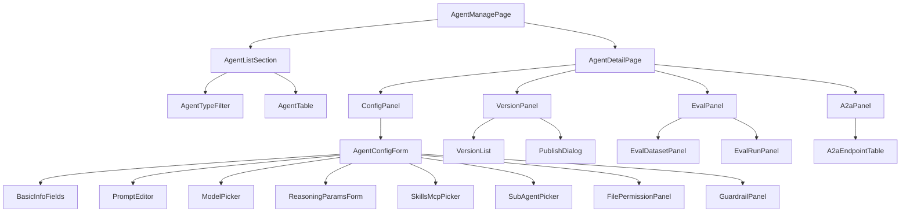

# AI 对话模块 - 前端实现设计（管理端-智能体管理）

## 1. 文档概述

本文档描述 AI 对话模块**管理端智能体管理页**的 Web 端（React）前端实现方案，聚焦 Agent 全生命周期（配置、版本、评测、发布、A2A）的页面编排与交互。页面结构与交互规范见 [需求规格.md](./需求规格.md) §3.3.2，接口契约见 [API接口.md](./API接口.md) §2.7-2.9。Android / Flutter / Taro 等多端参考本 Web 端的组件结构与状态管理方案按各自技术栈适配。

管理端智能体管理页承担"智能体资产全生命周期治理"：配置/版本（草稿-发布-回滚）/评测（门禁）/启停/复制/A2A 暴露，让智能体"可配置、可发布、可评测、可追溯"。

---

## 2. 组件树设计

| 组件 | 职责 |
|------|------|
| AgentManagePage | 智能体管理页容器与路由入口，编排列表与详情 |
| AgentListSection | Agent 列表区：类型筛选 + 分页表格 + 新建/复制/启停/删除操作 |
| AgentTypeFilter | Agent 类型筛选（全部/普通/子 Agent/Team） |
| AgentTable | Agent 表格：名称/编码/类型标签/状态/关联 Skills 与 MCP/子 Agent 数/版本信息 |
| AgentDetailPage | Agent 详情页容器：配置/版本/评测/A2A 四区 |
| ConfigPanel | 配置管理区：嵌入 AgentConfigForm（全量配置） |
| AgentConfigForm | Agent 配置表单：基本信息/系统提示词/模型/推理参数/Skills/MCP 命名空间/子 Agent/文件权限/安全护栏/A2A 暴露 |
| BasicInfoFields | 基本信息：名称/唯一编码（不可复用）/描述/分类标签/Agent 类型 |
| PromptEditor | 系统提示词编辑器（Markdown） |
| ModelPicker | 模型选择（消费 [AI模型管理模块](../../基础模块/AI模型管理/API接口.md) `GET /api/v1/ai/models/enabled?model_type=chat`） |
| ReasoningParamsForm | 推理参数：最大步数/Token 预算/并行度/工具超时/重试次数/Reflexion 阈值/温度 |
| SkillsMcpPicker | Skills/MCP 命名空间关联（覆盖式更新），可预览可加载能力 |
| SubAgentPicker | 子 Agent 关联（含优先级，区分本地/远程 A2A） |
| FilePermissionPanel | 文件系统权限规则（只读/指定目录/容量），工作区治理承载处 |
| GuardrailPanel | 安全护栏开关（输入/输出护栏规则，继承系统默认可覆盖） |
| VersionPanel | 版本管理区：草稿/已发布版本列表、版本差异对比、发布/回滚 |
| VersionList | 版本历史列表（版本号/变更人/时间/说明/状态） |
| PublishDialog | 发布确认弹窗（发布前评测门禁状态提示） |
| EvalPanel | 评测区：评测集（开发/回归/保留）管理 + 评测执行记录 |
| EvalDatasetPanel | 评测集/样本管理（含风险等级；Bad Case 脱敏回流） |
| EvalRunPanel | 评测执行记录列表（结果/评分/耗时），发布门禁结果展示 |
| A2aPanel | A2A 端点管理区：外部端点注册/刷新 Agent Card/删除；Agent 对外暴露开关 |
| A2aEndpointTable | 外部 A2A 端点列表（端点地址/状态/凭证状态） |

> Agent 配置表单字段与业务规则见 [需求规格-智能体管理](./需求规格-智能体管理.md) §2.11；评测门禁与评分维度见 §2.11.9。

---

## 3. 状态管理

### 3.1 Store 模块划分

| Store 模块 | 职责 | 生命周期 |
|-----------|------|---------|
| 管理端智能体 Store（adminAgentStore） | Agent 列表/类型筛选/配置表单（含草稿）/版本/评测/A2A 端点 | 页面级，进入智能体管理页初始化，离开销毁 |

### 3.2 核心状态

| 状态 | 说明 |
|------|------|
| `agents` | Agent 分页列表（含类型/状态/关联信息） |
| `agentTypeFilter` | 当前类型筛选（all/agent/subagent/team） |
| `agentForm` | Agent 配置表单状态（`{agent, visible}`，含草稿快照） |
| `versions` | 当前 Agent 版本历史（草稿/已发布） |
| `versionDiff` | 版本差异对比结果 |
| `evalDatasets` | 评测集列表（dev/regression/heldout） |
| `evalRuns` | 评测执行记录 |
| `a2aEndpoints` | 外部 A2A 端点列表 |

### 3.3 核心操作

| 操作 | 说明 |
|------|------|
| `fetchAgents` | 按类型筛选拉取 Agent 列表 |
| `saveAgent` | 创建/更新 Agent（保存草稿快照；`agent_code` 查重） |
| `copyAgent` | 复制 Agent（复制基本信息和配置，不复制关联关系） |
| `switchAgentStatus` | 启停 Agent（禁用后不可被选择，进行中会话不受影响） |
| `deleteAgent` | 删除 Agent（校验会话引用/子 Agent 引用，有则提示先解绑） |
| `fetchVersions` | 拉取版本历史 |
| `compareVersions` | 版本差异对比（base/target） |
| `publishAgent` | 发布 Agent（草稿通过评测集回归门禁后发布） |
| `rollbackVersion` | 回滚到历史发布版本（生成新版本号） |
| `fetchEvalDatasets` / `runEval` | 评测集管理 / 执行评测（发布门禁） |
| `testAgent` | 测试 Agent（输入测试消息预览响应，不入库不推送） |
| `manageA2aEndpoints` | 外部 A2A 端点注册/刷新/删除 |

---

## 4. 路由设计

| 路由路径 | 页面 | 权限控制 |
|---------|------|---------|
| `/admin/ai-agents` | 智能体管理列表页 | 管理员（`ai:agent:manage`） |
| `/admin/ai-agents/:id` | 智能体详情页（配置/版本/评测/A2A） | 管理员（`ai:agent:manage`） |

> 路由守卫校验 `ai:agent:manage`，无权限跳转 403；详情页仅管理员可进入。

---

## 5. 数据流

### 5.1 数据获取策略

| 区块 | 数据来源 | 获取时机 | 缓存策略 |
|------|---------|---------|---------|
| Agent 列表 | `GET /api/v1/ai/agents` | 进入页面 + 类型筛选/分页变更 | 当前筛选结果缓存；保存/启停后失效 |
| Agent 配置 | `GET /api/v1/ai/agents/{id}` | 进入详情/打开表单 | 弹窗会话级缓存；保存草稿后更新 |
| 版本历史 | `GET /api/v1/ai/agents/{id}/versions` | 进入版本 Tab | 当前结果缓存；发布/回滚后刷新 |
| 评测数据 | `GET /api/v1/ai/agents/{id}/eval/*` | 进入评测 Tab | 当前筛选结果缓存 |
| A2A 端点 | `GET /api/v1/ai/a2a/endpoints` | 进入 A2A Tab | 当前结果缓存；注册/刷新后刷新 |

### 5.2 更新策略

- **草稿-发布分离**：更新 Agent 生成草稿快照，不直接生效；发布通过评测回归后转为已发布版本，新会话使用最新已发布版本
- **评测门禁联动**：发布操作前校验回归集通过状态，未通过阻断发布并提示差异点
- **发布/回滚生效范围**：仅影响新会话，进行中会话锚定创建时版本（前端提示语义）
- **配置即消费**：Agent 启停/发布状态直接决定用户端会话可选范围，配置变更后列表状态标识同步

---

## 6. 交互设计决策

| 交互点 | 技术选型 | 理由 |
|--------|---------|------|
| 列表-详情组织 | 列表页（类型筛选 + 操作）→ 详情页（配置/版本/评测/A2A 四区） | 列表回答"有哪些智能体"，详情回答"怎么管好一个智能体"，符合资产治理路径 |
| 草稿-发布分离 | 保存生成草稿，发布需评测门禁 | 配置变更可追溯、可回退、可复现（需求规格 §2.11.8），发布门禁防回归 |
| 测试与评测分离 | TestAgent 即时预览（单条不入库）+ 评测集回归（发布门禁） | 即时调试快速定位，评测回归承担发布门禁，职责分层 |
| 推理参数继承可视化 | 三级优先级（系统默认 ← Agent ← 会话级）在表单中显式标注 | 参数合并规则透明，避免"配了不生效"的困惑 |
| 子 Agent 本地/远程标识 | SubAgentPicker 区分本地子 Agent（进程内 task）与远程 A2A（endpoint 关联） | 跨系统 Agent 互操作显性化，Token 消耗归属清晰（远程不计平台配额） |
| 工作区治理收敛 | FilePermissionPanel 承载文件权限与容量 | 工作区治理并入智能体配置，不单列管理页（见需求规格 §3.3.2） |

---

## 7. 公共组件使用

| 公共组件 | 配置要点 |
|---------|---------|
| 分页表格 | Agent 列表、评测执行记录、A2A 端点列表 |
| 弹窗（Dialog） | Agent 配置表单、发布确认、回滚确认、测试 Agent |
| 标签页（Tabs） | 详情页配置/版本/评测/A2A 切换 |
| 折叠面板 | 版本差异对比、评测样本详情 |
| Markdown 编辑器 | 系统提示词编辑、Skill 指令预览 |
