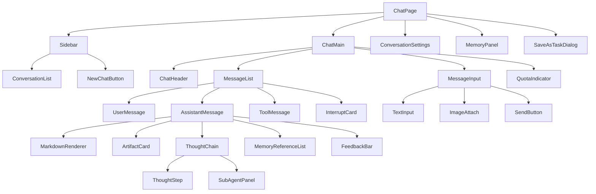
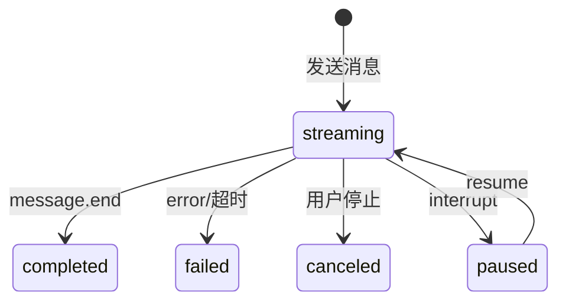

# AI 对话模块 - 前端实现设计

## 1. 文档概述

本文档描述 AI 对话模块的 Web 端（React）前端实现方案，聚焦组件架构、SSE 流式状态机、推理可视化、消息分支与配额引导等架构决策。功能需求见 [需求规格.md](./需求规格.md)，接口契约（含 SSE 事件类型、消息结构）见 [API接口.md](./API接口.md)。Android / Flutter / Taro 等多端参考本 Web 端的组件结构与状态管理方案按各自技术栈适配，不另行编写独立前端实现文档。

---

## 2. 组件树设计

独立路由页面：ModelManagePage（模型管理，管理员）、SkillsManagePage（Skills 管理，管理员）、ScheduledTaskPage（定时任务，VIP2+）、BatchResultDialog（批量结果弹窗）。

| 组件 | 职责 |
|------|------|
| ChatPage | 页面容器，路由入口，管理对话全局状态与子组件编排 |
| ConversationList | 会话列表展示，按活跃度排序，支持搜索/置顶/归档筛选/未读数；切换会话时标记已读并清零未读数 |
| MessageList | 消息列表渲染，支持流式增量、分支切换；超 100 条启用虚拟滚动 |
| UserMessage | 用户消息展示，支持编辑重发 |
| AssistantMessage | 助手消息展示，聚合 Markdown/产物/推理过程/引用记忆/反馈 |
| ToolMessage | 工具调用消息，折叠展示工具名/参数/返回摘要 |
| ThoughtChain | 推理过程折叠展示，展开后按步骤显示，含子智能体并行消耗 |
| ThoughtStep | 单个推理步骤（序号/耗时/thought/工具调用/observation/status） |
| SubAgentPanel | 子智能体并行消耗面板，展示各子智能体累计 Token 与积分 |
| InterruptCard | 中断交互卡片（确认/配额不足/异步等待） |
| ArtifactCard | 产物卡片（图片缩略图/指标报告/算法推荐/文件引用） |
| MemoryReferenceList | 助手回复引用的记忆清单（默认折叠） |
| MessageInput | 消息输入区，支持文本/图片/语音；流式中发送按钮变为停止按钮 |
| ModelSelector | 模型选择下拉，展示能力标识与单价，校验多模态能力 |
| MemoryPanel | 长期记忆查看/筛选/删除/清空/手动录入/导出 |
| SaveAsTaskDialog | 将对话流程保存为定时任务（Cron/输入来源/输出目标） |

---

## 3. 状态管理

### 3.1 Store 模块划分

| Store 模块 | 职责 | 生命周期 |
|-----------|------|---------|
| 全局 Store | 会话列表、可用模型列表、配额信息、定时任务列表 | 应用级，跨会话共享 |
| 会话级 Store | 当前会话 ID、消息列表、流式输出状态、推理步骤、中断点 | 会话级，切换会话时重置流式状态 |

### 3.2 核心状态

| 状态 | 说明 |
|------|------|
| `conversations` | 会话列表，含未读消息数 |
| `currentConversationId` | 当前会话 ID |
| `messages` | 当前会话消息列表 |
| `streamingMessageId` | 正在流式输出的消息 ID（null 表示空闲） |
| `availableModels` | 可用模型列表（含能力标识、积分单价） |
| `quota` | 配额使用情况（日/月已用与限额） |
| `interrupts` | 当前会话未处理的中断点 |
| `scheduledTasks` | 用户定时任务列表 |

> Message 完整数据结构属 API 契约，见 [API接口.md](./API接口.md)；前端关注 `role`（选择渲染组件）、`status`（驱动流式状态机）、`agentThoughts`（推理过程）、`artifacts`（产物卡片）、`parentMessageId`（分支渲染）等字段。

### 3.3 核心操作

| 操作 | 说明 |
|------|------|
| `createConversation` | 新建会话，首条消息后异步生成标题 |
| `sendMessage` | 发送消息，建立 SSE 连接，携带 `Idempotency-Key` 防重复 |
| `stopStreaming` | 停止流式输出 / 取消当前推理 |
| `regenerate` | 重新生成助手回复，创建分支消息 |
| `editMessage` | 编辑用户消息并重新触发回复，创建分支 |
| `resumeInterrupt` | 恢复中断的推理（请求体携带 `resume` 参数） |
| `submitFeedback` | 提交/更新/撤销点赞点踩 |
| `switchModel` | 切换会话模型，下一条消息生效 |
| `reconnectStream` | 断线重连，携带 `Last-Event-ID` 从断点恢复 |

---

## 4. 路由设计

| 路由路径 | 页面 | 权限控制 | 守卫说明 |
|---------|------|---------|---------|
| `/chat` | ChatPage | 登录用户 | 默认进入最新会话或新建 |
| `/chat/:conversationId` | ChatPage | 登录用户 | 指定会话，进入时加载消息并检查未处理中断 |
| `/chat/models` | ModelManagePage | 管理员（`ai:model:manage`） | 全局导航守卫校验角色，非管理员重定向至 `/chat` 并提示无权限 |
| `/chat/skills` | SkillsManagePage | 管理员 | 导航守卫校验角色 |
| `/chat/tasks` | ScheduledTaskPage | VIP2 及以上 | 守卫校验会员等级，不满足时引导升级 |

---

## 5. 数据流

### 5.1 数据获取策略

| 场景 | 策略 |
|------|------|
| 会话列表 | 分页加载，前端缓存减少重复请求；按最后活跃时间倒序 |
| 消息列表 | 进入会话时按时间正序分页加载；切换会话时取消未完成请求 |
| 模型列表 / 配额 | 应用级缓存，发送消息前校验配额余量 |
| 中断点 | 进入会话时查询未处理中断，渲染对应 InterruptCard |

### 5.2 流式接收与更新策略

| 阶段 | 处理方式 |
|------|---------|
| 发送 | 创建 user 消息立即渲染；创建 assistant 占位（status=streaming）；建立 SSE 连接 |
| 增量更新 | `content_block.delta` 事件经 `requestAnimationFrame` 批量更新；Markdown 增量解析仅重渲染变化段；ThoughtChain 默认折叠降低渲染压力 |
| 中断 | `interrupt` 事件暂停流式（status=paused），渲染 InterruptCard |
| 完成 | `message.end` 标记完成，更新 token 统计与积分消耗 |
| 断线重连 | 网络断连后自动重连（携带 `Last-Event-ID` + `streamSessionId`，最大 3 次间隔 3 秒）从断点恢复 |

> SSE 事件类型与 data 结构属接口契约，见 [API接口.md](./API接口.md) §2.2。

### 5.3 流式输出状态机

单次流式超 120 秒无新 token 判定超时失败；同一会话同一时间仅允许一个流式输出进行中，新消息需等待上一个完成或取消。

---

## 6. 交互设计决策

| 交互点 | 技术选型 | 理由 |
|--------|---------|------|
| 流式接收 | SSE（自定义事件） | 单向推送契合 LLM 输出；复用 HTTP 连接与认证；断线重连携带 `Last-Event-ID` 从断点恢复，比 WebSocket 轻 |
| 消息分支管理 | parentMessageId 树 + 分支切换器 | 重新生成/编辑重发创建新分支，原消息保留；切换器（< 2/3 >）切换查看，不破坏历史 |
| 推理中断恢复 | interrupt 事件 + `resume` 参数 | 暂停推理展示确认卡片，用户操作后复用消息发送接口恢复，无需独立恢复端点 |
| 配额不足引导 | quota 中断 + 升级/降级 | 单步预扣失败展示"积分不足"卡片，支持升级后从当前步骤继续或降级（切模型/减并行度） |
| 推理过程展示 | ThoughtChain 默认折叠 | 减少渲染压力；展开按步骤显示，含子智能体并行消耗汇总为会话总消耗 |
| 渲染性能 | 虚拟滚动 + 增量渲染 | 消息列表超 100 条虚拟滚动；token 增量批量更新；产物缩略图懒加载 |
| XSS 防护 | MarkdownRenderer 转义 | LLM 输出经 Markdown 渲染自动转义 HTML；产物卡片 URL 校验白名单 |

---

## 7. 公共组件使用

| 公共组件 | 配置要点 |
|---------|---------|
| MarkdownRenderer | 渲染 LLM 输出，支持代码高亮/表格/链接；开启 HTML 转义防 XSS；增量解析仅重渲染变化段 |
| 代码高亮组件 | 多语言语法高亮，长代码块折叠 + 一键复制 |
| Mermaid 图渲染 | 识别 Markdown 中 mermaid 代码块并渲染为流程图 |
| 公式渲染（KaTeX） | 渲染 LaTeX 公式（行内与块级） |
| 虚拟滚动列表 | 消息列表超 100 条启用，仅渲染可视区域 |
| 文件上传组件 | 多模态附件上传，上传前校验模型多模态能力（图片需视觉能力、文档需文档理解能力、音视频需对应理解能力） |
