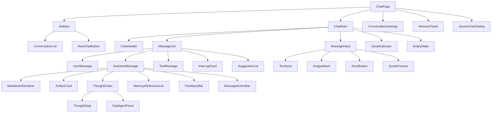
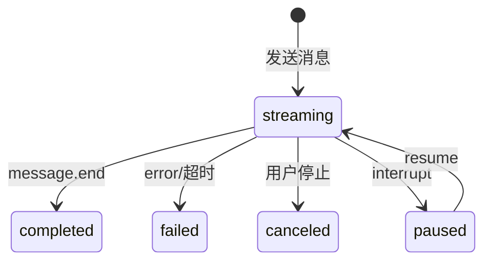

# AI 对话模块 - 前端实现设计

## 1. 文档概述

本文档描述 AI 对话模块的 Web 端（React）前端实现方案，聚焦组件架构、SSE 流式状态机、推理可视化、消息分支与配额引导等架构决策。功能需求见 [需求规格.md](./需求规格.md)，接口契约（含 SSE 事件类型、消息结构）见 [API接口.md](./API接口.md)。Android / Flutter / Taro 等多端参考本 Web 端的组件结构与状态管理方案按各自技术栈适配，不另行编写独立前端实现文档。

---

## 2. 组件树设计

独立路由页面：AgentManagePage（智能体管理，管理员）、ModelManagePage（模型管理，管理员）、SkillsManagePage（Skills 管理，管理员）、ScheduledTaskPage（定时任务，VIP2+）、BatchResultDialog（批量结果弹窗）。

| 组件 | 职责 |
|------|------|
| ChatPage | 页面容器，路由入口，管理对话全局状态与子组件编排 |
| ConversationList | 会话列表展示，按活跃度排序，支持搜索（标题+消息内容全文）/置顶/归档范围筛选/未读数；支持批量选择归档/删除；切换会话时标记已读并清零未读数 |
| EmptyState | 新会话开场引导：问候语 + 2-4 条示例问题（本地静态数据，点击填充输入框）；首次使用全屏展示，后续轻量提示 |
| MessageList | 消息列表渲染，支持流式增量、分支切换；超 100 条启用虚拟滚动；自动滚动跟随最新内容，用户上滑时暂停跟随并显示"回到底部"按钮 |
| UserMessage | 用户消息展示，支持编辑重发、复制；编辑后展示"已编辑"标识并可查看原文 |
| AssistantMessage | 助手消息展示，聚合 Markdown/产物/推理过程/引用记忆/反馈/操作栏 |
| MessageActionBar | 消息操作栏（悬停出现）：复制、引用、重新生成、朗读、删除、反馈；复制成功切换完成态，代码块独立复制入口 |
| FeedbackBar | 渐进式反馈栏（对齐需求规格 §2.9.2）：点赞一键完成；点踩后展开 6 类问题标签（错误/答非所问/不完整/太长/引用错误/有害）单选，文字说明可选；已反馈状态高亮展示，支持撤销/修改 |
| SuggestionList | 类似问题推荐（`suggestions` 事件驱动），展示 2-3 条推荐问题，点击作为新消息发送，可忽略 |
| ToolMessage | 工具调用消息，折叠展示工具名/参数/返回摘要 |
| ThoughtChain | 推理过程折叠展示，展开后按步骤显示，含子智能体并行消耗；推理模型的分析过程与正式回复分段展示 |
| ThoughtStep | 单个推理步骤（序号/耗时/thought/工具调用/observation/status） |
| SubAgentPanel | 子智能体并行消耗面板，展示各子智能体累计 Token 与积分 |
| InterruptCard | 中断交互卡片（确认/配额不足/异步等待） |
| ArtifactCard | 产物卡片（图片缩略图/指标报告/算法推荐/文件引用） |
| MemoryReferenceList | 助手回复引用的记忆清单（默认折叠） |
| MessageInput | 消息输入区，支持文本/图片/语音/附件粘贴拖拽；流式中发送按钮变为停止按钮；支持引用预填充（QuotePreview） |
| QuotePreview | 引用预览条：展示被引用消息摘要（含来源标记），可移除后发送；发送后引用内容作为普通消息内容 |
| AgentSelector | 智能体选择下拉，展示 Agent 名称/描述/类型标签，校验是否可作为会话入口 |
| ModelSelector | 模型选择下拉，展示能力标识、单价、速度档位、上下文长度与标签，校验多模态能力 |
| MemoryPanel | 长期记忆查看/筛选/删除/清空/手动录入/导出 |
| SaveAsTaskDialog | 将对话流程保存为定时任务（常用频率快捷项/Cron + 输入来源/输出目标，实时展示下次触发时间预览） |

---

## 3. 状态管理

### 3.1 Store 模块划分

| Store 模块 | 职责 | 生命周期 |
|-----------|------|---------|
| 全局 Store | 会话列表、可用模型列表、配额信息、定时任务列表 | 应用级，跨会话共享 |
| 会话级 Store | 当前会话 ID、消息列表、流式输出状态、推理步骤、中断点 | 会话级，切换会话时重置流式状态 |

### 3.2 核心状态

| 状态 | 说明 |
|------|------|
| `conversations` | 会话列表，含未读消息数 |
| `currentConversationId` | 当前会话 ID |
| `messages` | 当前会话消息列表 |
| `streamingMessageId` | 正在流式输出的消息 ID（null 表示空闲） |
| `availableModels` | 可用模型列表（含能力标识、积分单价、上下文长度、速度档位、模型标签、降级标识） |
| `quota` | 配额使用情况（日/月已用与限额） |
| `interrupts` | 当前会话未处理的中断点 |
| `scheduledTasks` | 用户定时任务列表 |
| `suggestions` | 当前回复的类似问题推荐（来自 `suggestions` 事件，切换消息时清空） |
| `quote` | 引用预填充内容（`{sourceMessageId, text}`，发送或清空后重置） |
| `selectionMode` | 会话列表批量选择模式（勾选集合 + 目标操作：归档/删除） |
| `scrollFollowEnabled` | 流式自动滚动跟随开关（用户上滑时置 false，点击"回到底部"恢复） |

> Message 完整数据结构属 API 契约，见 [API接口.md](./API接口.md)；前端关注 `role`（选择渲染组件）、`status`（驱动流式状态机）、`agentThoughts`（推理过程）、`artifacts`（产物卡片）、`parentMessageId`（分支渲染）等字段。

### 3.3 核心操作

| 操作 | 说明 |
|------|------|
| `createConversation` | 新建会话（可指定 agent_code），首条消息后异步生成标题 |
| `sendMessage` | 发送消息，建立 SSE 连接，携带 `Idempotency-Key` 防重复；引用预填充内容合并为消息内容后发送 |
| `stopStreaming` | 停止流式输出 / 取消当前推理 |
| `regenerate` | 重新生成助手回复，创建分支消息 |
| `editMessage` | 编辑用户消息并重新触发回复，创建分支 |
| `resumeInterrupt` | 恢复中断的推理（`POST /messages/{id}/resume` 独立流式端点，请求体 `confirm`/`params`/`plan_edit`） |
| `submitFeedback` | 提交/更新/撤销点赞点踩（渐进式：点赞一键提交；点踩携带问题标签 + 可选文字说明） |
| `quoteMessage` | 将消息内容填充至输入区（本地操作，发起引用预填充） |
| `deleteMessage` | 删除助手回复消息（软删除，删除后该分支"重新生成"入口不再展示） |
| `speakMessage` | 朗读助手回复（调用语音模块 TTS，播报中再次点击停止） |
| `batchOperateConversations` | 批量归档/删除会话（删除需二次确认） |
| `exportConversation` | 导出会话为 Markdown/JSON |
| `applySuggestion` | 点击推荐问题，作为新消息发送并清空推荐列表 |
| `switchAgent` | 切换会话绑定的 Agent，下一条消息生效 |
| `switchModel` | 切换会话模型，下一条消息生效 |
| `reconnectStream` | 断线重连，携带 `Last-Event-ID` 从断点恢复 |

---

## 4. 路由设计

| 路由路径 | 页面 | 权限控制 | 守卫说明 |
|---------|------|---------|---------|
| `/chat` | ChatPage | 登录用户 | 默认进入最新会话或新建 |
| `/chat/:conversationId` | ChatPage | 登录用户 | 指定会话，进入时加载消息并检查未处理中断 |
| `/chat/agents` | AgentManagePage | 管理员（`ai:agent:manage`） | 全局导航守卫校验角色，非管理员重定向至 `/chat` 并提示无权限 |
| `/chat/agents/:code` | AgentEditPage | 管理员（`ai:agent:manage`） | 编辑 Agent 配置（系统提示词/模型/推理参数/Skills/MCP/子Agent） |
| `/chat/models` | ModelManagePage | 管理员（`ai:model:manage`） | 全局导航守卫校验角色，非管理员重定向至 `/chat` 并提示无权限 |
| `/chat/skills` | SkillsManagePage | 管理员 | 导航守卫校验角色 |
| `/chat/tasks` | ScheduledTaskPage | VIP2 及以上 | 守卫校验会员等级，不满足时引导升级 |

---

## 5. 数据流

### 5.1 数据获取策略

| 场景 | 策略 |
|------|------|
| 会话列表 | 分页加载，前端缓存减少重复请求；按最后活跃时间倒序 |
| 消息列表 | 进入会话时按时间正序分页加载；切换会话时取消未完成请求 |
| 模型列表 / 配额 | 应用级缓存，发送消息前校验配额余量 |
| 中断点 | 进入会话时查询未处理中断，渲染对应 InterruptCard |

### 5.2 流式接收与更新策略

| 阶段 | 处理方式 |
|------|---------|
| 发送 | 创建 user 消息立即渲染；创建 assistant 占位（status=streaming）；建立 SSE 连接 |
| 增量更新 | `content_block.delta` 事件经 `requestAnimationFrame` 批量更新；Markdown 增量解析仅重渲染变化段；ThoughtChain 默认折叠降低渲染压力 |
| 中断 | `interrupt` 事件暂停流式（status=paused），渲染 InterruptCard |
| 完成 | `message.end` 标记完成，更新 token 统计与积分消耗 |
| 推荐问题 | `suggestions` 事件（在 `message.end` 后推送）填充 `suggestions` 状态，渲染 SuggestionList；点击推荐作为新消息发送后清空 |
| 断线重连 | 网络断连后自动重连（携带 `Last-Event-ID` + 流式会话 ID，最大 3 次间隔 3 秒）从断点恢复；流式会话 ID 不再由 `message.start` 返回，需结合其它途径获取 |

> 引用、复制、朗读、删除等消息操作为本地交互或依赖语音模块，不经过 SSE 数据流。

> SSE 事件类型与 data 结构属接口契约，见 [API接口.md](./API接口.md) §2.2。

### 5.3 流式输出状态机

单次流式超 120 秒无新 token 判定超时失败；同一会话同一时间仅允许一个流式输出进行中，新消息需等待上一个完成或取消。

---

## 6. 交互设计决策

| 交互点 | 技术选型 | 理由 |
|--------|---------|------|
| 流式接收 | SSE（自定义事件） | 单向推送契合 LLM 输出；复用 HTTP 连接与认证；断线重连携带 `Last-Event-ID` 从断点恢复，比 WebSocket 轻。SSE 是 LLM 流式输出的事实标准（OpenAI/Anthropic 官方接口均为 SSE），前端 `EventSource` API 零依赖 |
| 消息分支管理 | parentMessageId 树 + 分支切换器 | 重新生成/编辑重发创建新分支，原消息保留；切换器（< 2/3 >）切换查看，不破坏历史 |
| 推理中断恢复 | interrupt 事件 + `POST /messages/{id}/resume` 独立流式端点 | 暂停推理展示确认卡片，用户操作后调用独立 `resume` 端点续流（SSE）；确认/拒绝走 `confirm`、计划干预走 `plan_edit`、算法选择走 `params.algorithmId` |
| 配额不足引导 | quota 中断 + 升级/降级 | 单步预扣失败展示"积分不足"卡片，支持升级后从当前步骤继续或降级（切模型/减并行度） |
| 推理过程展示 | ThoughtChain 默认折叠 | 减少渲染压力；展开按步骤显示，含子智能体并行消耗汇总为会话总消耗；推理模型"分析过程/正式回复"分段展示，分析过程不参与复制/引用/朗读 |
| 渲染性能 | 虚拟滚动 + 增量渲染 | 消息列表超 100 条虚拟滚动；token 增量批量更新；产物缩略图懒加载 |
| XSS 防护 | MarkdownRenderer 转义 | LLM 输出经 Markdown 渲染自动转义 HTML；产物卡片 URL 校验白名单 |
| 新会话引导 | EmptyState 本地静态示例问题 | 示例问题为平台预设静态内容，点击填充输入框，零接口请求、不消耗 Token，降低新手开口门槛 |
| 消息引用 | 本地填充输入区（QuotePreview） | 引用是"继续对话"的低成本路径：不建立消息引用关系、无接口调用，引用后作为普通新消息发送，避免链路复杂化 |
| 类似问题推荐 | `suggestions` SSE 事件 + SuggestionList | 推荐问题随回复由 LLM 生成并随 SSE 推送，前端渲染于回复末尾；可忽略不发送，不打断阅读 |
| 消息删除 | 软删除（deleted 标记） | 删除后从对话流隐藏、上下文组装过滤；30 天可恢复，保留审计 |
| 滚动跟随控制 | 自动跟随 + 上滑暂停 + "回到底部" | 流式中自动滚动跟随最新内容；用户上滑阅读时暂停跟随，避免滚动打断阅读；点击"回到底部"平滑回到最新内容 |

### 6.1 关键交互决策的理论与业界依据

| 决策 | 理论/业界依据 | 为什么成立 |
|------|--------------|-----------|
| 流式增量用 `requestAnimationFrame` 批量更新而非逐 token 更新 | 浏览器渲染频率上限约 60fps（16.6ms/帧）；逐 token 更新会导致同一帧内多次 DOM 写入，触发不必要的重排重绘 | 批量更新让 DOM 写入节奏与渲染帧对齐：网络到达的 token 先入缓冲，`rAF` 每帧只写一次，视觉上"流式"感知不变，但渲染成本降一个数量级 |
| 分支对话（parentMessageId 树） | 对齐 Claude/ChatGPT 的"重新生成"交互：重新生成本质是**创建新分支**而非覆盖原消息 | 线性覆盖会丢失"不满意的那一版"；树结构保留全部历史版本，切换器（< 2/3 >）即"在版本间切换"，产品上等价于主流竞品的编辑/重发 |
| ThoughtChain 默认折叠 | 认知负荷理论（Cognitive Load Theory）：推理过程是"过程信息"，对大多数用户是干扰而非价值 | 默认折叠把推理过程降为"需要时才展开"，避免过长思考链（多步推理可达 20+ 步）压过最终回复的主体地位；展开查看满足高级用户/调试诉求 |
| 断线重连最多 3 次、间隔 3 秒 | 指数退避（Exponential Backoff）的简化版：网络抖动通常在秒级恢复，超过 3 次重试说明网络环境不可用 | 立即重试大概率再次失败；固定 3 秒间隔对"1-2 分钟的 LLM 流"足够，同时避免无限重试拖死连接 |
| 虚拟滚动阈值 100 条 | 主流虚拟滚动库（react-window/vue-virtual-scroller）的建议阈值，DOM 节点数超过该量级后渲染成本显著上升 | 100 条以内全量渲染的开销可接受，超过后只渲染可视区域，保证长对话滚动流畅 |
| 滚动跟随"自动 + 上滑暂停" | ChatGPT/Copilot 一致的流式滚动交互：自动跟随最新内容，用户上滑即暂停 | 流式输出逐字推送，强制滚动会打断用户阅读前文；上滑暂停 + "回到底部"按钮让用户掌控滚动节奏 |
| 新会话示例问题引导 | ChatGPT 新对话的示例提示词、Kimi/豆包开场问候 | 空会话直接展示示例问题能降低新手"无从下手"的开口门槛，同时隐式教育用户如何提问 |
| 消息引用填充输入区 | Ant Design X 结果应用规范的"引用"操作 | 引用是对话连续性的关键桥梁：将对回复某部分继续追问的成本降为"一键填充 + 修改"，优于让用户手动复制粘贴 |

---

## 7. 公共组件使用

| 公共组件 | 配置要点 |
|---------|---------|
| MarkdownRenderer | 渲染 LLM 输出，支持代码高亮/表格/链接；开启 HTML 转义防 XSS；增量解析仅重渲染变化段 |
| 代码高亮组件 | 多语言语法高亮，长代码块折叠 + 一键复制 |
| Mermaid 图渲染 | 识别 Markdown 中 mermaid 代码块并渲染为流程图 |
| 公式渲染（KaTeX） | 渲染 LaTeX 公式（行内与块级） |
| 虚拟滚动列表 | 消息列表超 100 条启用，仅渲染可视区域 |
| 文件上传组件 | 多模态附件上传，上传前校验模型多模态能力（图片需视觉能力、文档需文档理解能力、音视频需对应理解能力） |
