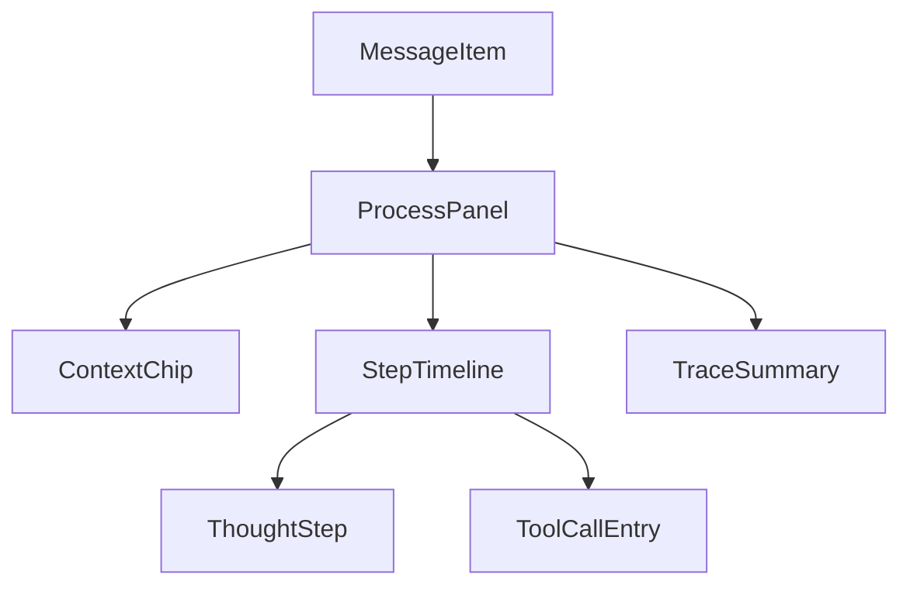
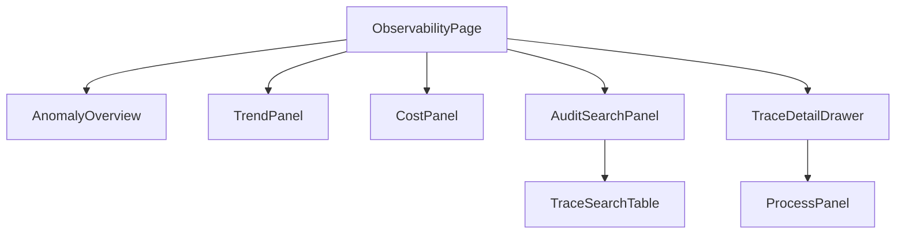

# AI 对话模块 - 前端实现设计（可观测性）

## 1. 文档概述

本文档描述 AI 对话可观测性（F-M08-013）的前端实现方案，覆盖**用户端过程透明**组件与管理端 **AI 可观测中心**页。页面结构与交互规范见 [需求规格.md](./需求规格.md)，接口契约见 [API接口.md](../API接口.md)。多端（Android / Flutter / Taro 等）参考本 Web 端组件结构与状态管理方案按各自技术栈适配。

可观测性前端解决两类诉求：

| 端 | 页面/组件 | 回答的问题 |
|----|----------|-----------|
| 用户端 | 对话页"查看过程"组件 | 这条回复 AI 做了什么、怎么得出的 |
| 管理端 | AI 可观测中心页 | 全平台 AI 行为是否异常、成本/性能趋势、审计检索 |

> 管理端会话管理页的链路追踪（ChainTracePanel）为单消息下钻入口，其数据承载与详细能力由本模块提供，页面结构见 [前端实现-管理端-会话管理.md](../页面设计/前端实现-管理端-会话管理.md)。

---

## 2. 用户端过程透明组件

### 2.1 组件树

| 组件 | 职责 |
|------|------|
| ProcessPanel | 过程面板：默认折叠，展开后展示"AI 执行过程" |
| ContextChip | 上下文构成标签：系统提示/历史/记忆/检索/工具清单及占比，可查看详情 |
| StepTimeline | 推理步骤时间线（复用 ThoughtStep/ToolCallEntry 公共组件） |
| TraceSummary | 过程摘要：步数/耗时/消耗，异常时显著标注失败环节 |

### 2.2 交互

- 过程面板默认折叠，回复下"查看过程"入口展开
- 上下文构成以占比条展示，点击构成项查看来源
- 失败/中断步骤显著标注，可查看失败原因
- 引用可见：AI 引用知识库内容时展示来源

---

## 3. 管理端 AI 可观测中心页

### 3.1 页面定位

AI 可观测中心回答"平台 AI 都在做什么、是否异常、趋势如何"，按**异常总览 → 趋势与资源 → 审计检索**组织：

| 区块 | 内容 |
|------|------|
| 异常总览 | 失败/中断/超时/配额拒绝/高风险调用计数与筛选入口 |
| 性能趋势 | 延迟（首 Token/完成）、成功率/失败率趋势 |
| 资源透视 | Token/积分/费用按模型/智能体/用户聚合与趋势 |
| 审计检索 | 全量过程链检索（用户/时间/模型/状态/能力），支持导出 |
| 过程链下钻 | 会话 → 消息 → 推理步骤/上下文快照（含摘要/记忆原文）/消息记录/工具调用完整回放，LLM 调用可看每轮输入消息原文与工具定义；推理步骤标注子 Agent 归属（agentCode/isSubagent）与推理期事件（护栏命中/计划快照/中断恢复），并展示计费明细（billing）、中间产物（artifacts）与失败/中断轮异常详情（errorDetail）；LLM 调用条目支持物理调用尝试（attempts）回放（逐 Key 重试/路由降级/熔断跳过全过程），过程链按 traceType 标注类型（主对话/摘要/记忆提取/建议/步骤摘要） |

### 3.2 组件树

| 组件 | 职责 |
|------|------|
| ObservabilityPage | 可观测中心页容器与路由入口 |
| AnomalyOverview | 异常总览卡片（失败/中断/超时/配额拒绝/高风险调用计数） |
| TrendPanel | 性能趋势图表（延迟/成功率，分模型/智能体） |
| CostPanel | 资源消耗聚合表与趋势（模型/智能体/用户维度） |
| AuditSearchPanel | 审计检索表单（用户/时间/状态/模型/能力/关键词） |
| TraceSearchTable | 过程链检索结果表（含异常标注），点击下钻 |
| TraceDetailDrawer | 过程链详情抽屉：上下文快照（含系统提示/摘要/记忆原文）+ 推理步骤（thoughts，标注子 Agent 归属 agentCode/isSubagent）+ 消息记录（完整对话 messages）+ 每轮 LLM 调用输入消息原文与工具定义回放，按"系统提示 → 用户输入 → 中间推理步骤 → 助手输出 → 工具返回"完整回放；同时展示推理期事件（guardrail 护栏命中/plan 计划快照/resume 中断恢复）、计费明细（billing，与计费口径一致）、中间产物（artifacts）与失败/中断轮的异常详情（errorDetail，message/stack）；LLM 调用条目支持物理调用尝试（attempts）回放（每条尝试的 provider/key/model/状态/错误码/耗时），traceType 标注过程链类型（conversation/summary/memory_extraction/suggestion/step_summary，旁路过程链据此识别） |
| ProcessPanel（公共） | 过程展示组件（与用户端共用） |

### 3.3 状态管理

| 状态 | 说明 |
|------|------|
| `anomalySummary` | 异常总览计数 |
| `trendData` | 性能趋势数据（时间范围可切换） |
| `costData` | 资源消耗聚合数据 |
| `auditFilter` | 审计检索条件（用户/时间/状态/模型/能力/分页） |
| `traceDetail` | 当前下钻的过程链详情 |

### 3.4 路由设计

| 路由路径 | 页面 | 权限控制 |
|---------|------|---------|
| `/admin/ai-observability` | AI 可观测中心 | 管理员（`ai:conversation:audit`） |

### 3.5 数据流

| 区块 | 数据来源 | 获取时机 |
|------|---------|---------|
| 异常总览 | 过程链聚合统计接口 | 页面挂载 + 定时刷新 |
| 趋势 | 指标聚合接口 | 页面挂载 + 时间范围切换 |
| 资源透视 | 消耗聚合接口（与计费口径一致） | 页面挂载 + 维度切换 |
| 审计检索 | 审计检索接口 | 检索条件变更 |
| 过程链详情 | 消息详情/过程链接口 | 下钻触发 |

### 3.6 交互设计决策

| 交互点 | 技术选型 | 理由 |
|--------|---------|------|
| 异常总览先行 | 先总览再检索 | 先回答"平台是否异常"，再"哪些会话异常"，符合审计决策路径 |
| 过程链回放 | 详情抽屉按时间线展示 | 完整还原 AI 行为（步骤/上下文/工具调用），定位一目了然 |
| 口径一致 | 资源透视与计费明细同源 | 审计对账口径一致，避免争议 |
| 权限收敛 | 页面按 `ai:conversation:audit` 显隐 | 观测数据高权，界面显隐与后端一致 |

---

## 4. 公共组件使用

| 公共组件 | 配置要点 |
|---------|---------|
| 图表组件 | 性能/成本趋势（折线/柱状） |
| 分页表格 | 审计检索结果（含异常状态标注） |
| 抽屉（Drawer） | 过程链详情 |
| 折叠面板 | 过程面板、上下文构成详情 |
| 状态标签 | 失败/中断/超时/配额拒绝 |
