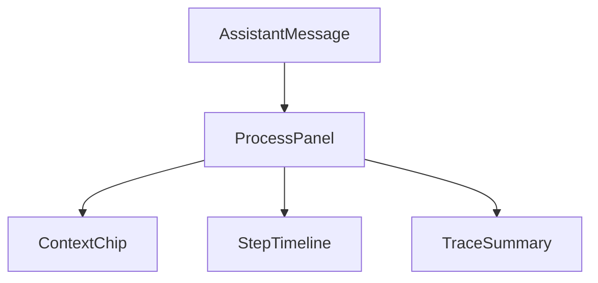
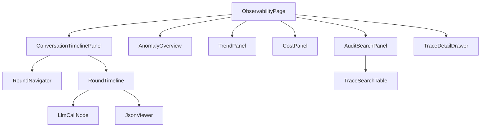

# AI 对话模块 - 前端实现设计（可观测性）

## 1. 文档概述

本文档描述 AI 对话可观测性（F-M08-013）的前端实现方案，覆盖**用户端过程透明**组件与管理端 **AI 可观测中心**页。页面结构与交互规范见 [需求规格.md](./需求规格.md)，接口契约见 [API接口.md](../API接口.md)。多端（Android / Flutter / Taro 等）参考本 Web 端组件结构与状态管理方案按各自技术栈适配。

可观测性前端解决两类诉求：

| 端 | 页面/组件 | 回答的问题 |
|----|----------|-----------|
| 用户端 | 对话页"查看过程"组件 | 这条回复 AI 做了什么、怎么得出的 |
| 管理端 | AI 可观测中心页 | 全平台 AI 行为是否异常、成本/性能趋势、审计检索 |

> 管理端观测/审计能力已全部集中到 AI 可观测中心（2026-09-13 页面合并，会话管理页链路追踪抽屉 ChainTracePanel 已下线、跳转可观测中心，见 §3.1）；会话管理页其余结构见 [前端实现-管理端-会话管理.md](../页面设计/前端实现-管理端-会话管理.md)。

---

## 2. 用户端过程透明组件（已接入运行时）

> 本节组件族已落地于前端无状态组件层 `dehaze-front-vue/src/components/ai-chat/`：组件在 `components/`，VM 类型在 `types.ts`（`ChatContextChipVM`/`ChatTraceStepVM`/`ChatTraceSummaryVM`/`ChatProcessVM`），宿主派生在绑定层；组件由 `AssistantMessage` 按助手消息 VM 的 `process` 字段渲染，数据经宿主绑定层（`useChatVmBinding`）前端派生注入、交互经 emit 上抛（组件结构见 [前端实现-公共.md](../页面设计/前端实现-公共.md) §2）。

### 2.1 组件树

| 组件 | 实现位置 | 职责 |
|------|---------|------|
| ProcessPanel | `components/ProcessPanel.vue` | 过程面板：由 `AssistantMessage` 在助手消息内渲染（`message.process` 存在时），默认折叠，"查看过程"展开后展示上下文构成 + 步骤时间线 + 摘要（不透出 raw 报文） |
| ContextChip | `components/ContextChip.vue` | 上下文构成标签：类别 + 占比条 + 详情入口（类别 `kind`：system/history/memory/retrieval/tools） |
| StepTimeline | `components/StepTimeline.vue` | 推理步骤时间线：按步骤 `kind` 分色节点、失败/中断步骤显著标注（消费 `ChatTraceStepVM[]`，非 ThoughtStep/ToolCallEntry） |
| TraceSummary | `components/TraceSummary.vue` | 过程摘要：步数/耗时/消耗，异常时显著标注失败环节 |

步骤 `kind` 六类（`ChatTraceStepVM.kind`）：`input`（用户输入）/ `context`（上下文组装）/ `llm_call`（LLM 调用）/ `tool_exec`（工具执行）/ `system_event`（系统事件）/ `billing`（计费）。

### 2.1.1 数据来源（用户端，全部前端派生、不新增接口）

过程透明视图由宿主绑定层 `useChatVmBinding` 从助手消息既有字段派生后注入 `ChatProcessVM`（`steps`/`summary`/`chips`）。**只上线用户端真实可得的部分，缺数据源的部分不上线**：

| 视图 | 数据来源 | 派生口径 |
|------|---------|---------|
| 步骤时间线（tool_exec / llm_call） | 消息 `steps`（`thoughts`：流式 thought 事件 / 落库 `agentThoughts`） | 工具步骤归 `tool_exec`、纯思考步骤归 `llm_call`；状态 1成功/2失败（3跳过归正常） |
| 步骤时间线（billing） | 消息 `usage`（`credits`/`inputTokens`/`outputTokens`/`cachedInputTokens`） | 有用量时派生一个计费节点 |
| 过程摘要 `summary` | `usage` + 步骤 `latencyMs` + 失败步数 | 无 wire 级总耗时字段，`durationMs` 取各步骤 `latencyMs` 合计；`stepCount`/`failedCount` 由派生步骤计数 |
| 上下文构成 `chips` | 消息 `usedMemoryIds`（wire `used_memory_ids`，注入可见性） | 记忆引用标签 `kind=memory`；系统提示/历史/检索构成项属管理端 raw 口径，用户端无数据源，不虚构占位 |

> **不上线的部分（用户端无真实数据源）**：步骤 `kind` 中的 `input`（用户输入）/`context`（上下文组装）/`system_event`（系统事件）在用户端无对应 wire 字段（属管理端会话时间线口径），故不派生、不展示空壳；上下文构成不展示占比条（用户端无占比数据），不展示来源明细（raw 属管理端）。

### 2.2 交互

- 过程面板默认折叠，回复下"查看过程"入口展开
- 上下文构成项以标签展示，点击经 `context-open` 上抛，由页面层展示人类可读来源说明（用户端无 raw 下钻）
- 步骤时间线按 `kind` 分色，失败/中断步骤以危险色显著标注，失败原因（`error`）内联展示
- 引用可见：AI 引用知识库内容时展示来源

> **raw 报文口径不变**：raw 报文（LLM 请求/响应原文等）仅在管理端可观测中心可见（§3 会话时间线按需展开），用户端 ProcessPanel 只透出人类可读的过程摘要，**从不透出 raw 报文**。

### 2.3 待决/未闭环

| # | 项 | 现状 | 说明 |
|---|----|------|------|
| 1 | 分支切换后端同步 | **已解决**：前端经 SDK `getBranches`/`switchBranch` 接入真切换，同步后端会话 `currentBranchMessageId` | 三端均实现端点（`GET /ai/conversations/{convId}/messages/{msgId}/branches`、`PUT /ai/conversations/{convId}/branches/{msgId}`），SDK 已补 `getBranches`/`switchBranch` |
| 2 | 过程透明派生落点 | 暂置于宿主绑定层 | 当前无用户端过程透明 wire 数据源，故由绑定层前端派生；若后端提供过程透明 wire 数据，wire→VM 映射应下沉 `adapters/fromSdk.ts` |

---

## 3. 管理端 AI 可观测中心页

### 3.1 页面定位（2026-09-13 审计级重构：唯一管理端观测/审计入口）

原管理端两处职责重合入口（会话管理页链路追踪抽屉 ChainTracePanel 与可观测中心）合并为**可观测中心一个入口**，重组为三 Tab：

| Tab | 内容 |
|------|------|
| **会话审计**（默认主 Tab） | AuditFilterBar + AnomalySummaryPanel + ConversationAuditTable（会话维度检索/异常标注）→ 点击进入会话时间线（RoundNavigator + RoundTimeline） |
| **总览** | AnomalyOverview（异常总览）+ PerformanceTrendPanel（性能趋势）+ CostPanel（资源透视）；异常卡片点击切"检索导出"Tab 收敛状态筛选 |
| **检索导出** | AuditSearchPanel + TraceSearchTable（跨会话 trace 检索，行内"会话时间线"跳转） |

**跨页跳转约定**：`/admin/ai-observability?conversationId=N` 自动切会话审计 Tab 并打开该会话时间线；会话管理页（ai-conversations 管理端）的链路追踪抽屉已下线（ChainTracePanel 删除），详情抽屉的链路查看与审计表格的"时间线"操作均跳转本页。

### 3.2 会话时间线视图（审计主路径）

一轮交互内**事无巨细**按时间序回放：用户输入原文 → 上下文组装（构成项/压缩事件/系统提示全文）→ 每次 LLM 调用（摘要卡 + 完整请求/响应 wire JSON）→ 工具执行（思考/完整入参出参/耗时/子 Agent 归属）→ 系统事件（护栏/计划/中断恢复）→ 计费 → 助手输出；旁路 trace（摘要压缩/记忆提取/建议/步骤摘要）以类型徽标挂轮次尾部次要样式。raw 为空显示中性空态"无原始报文记录"（不区分新旧数据，无兼容降级形态）。

| 组件 | 位置 | 职责 |
|------|------|------|
| `ConversationTimelinePanel` | `ai-observability/components/` | 时间线容器：会话概要 + 双栏布局 + 空态 |
| `RoundNavigator` | 同上 | 左栏轮次列表：用户消息摘要/状态徽标/耗时/token/调用次数/异常轮标注 |
| `RoundTimeline` | 同上 | 右栏垂直时间轴：六类事件（input/context/llm_call/tool_exec/system_event/billing）分色节点，ts 稳定排序（非 null 单调 + **null 沉底**），旁路 trace 尾部次要样式 |
| `LlmCallNode` | 同上 | LLM 调用节点：摘要卡（模型/耗时/TTFT/token/tool_call/attempts）+ 展开"查看完整请求/响应 JSON"（rawRequest/rawResponse wire 原文）+ attempts 物理尝试回放 |
| `JsonViewer` | `src/components/`（公共） | JSON 递归折叠 + 语法高亮 + 复制/下载；空态"无原始报文记录" |
| `ConversationAuditTable`/`AuditFilterBar`/`AnomalySummaryPanel` | `ai-observability/components/`（自会话管理页迁入，两页共享） | 会话审计列表/筛选/异常概要 |

### 3.3 可观测中心其余组件

| 组件 | 职责 |
|------|------|
| ObservabilityPage | 三 Tab 容器与路由入口（支持 `?conversationId=`/`?tab=` query 定位） |
| AnomalyOverview / TrendPanel / CostPanel | 总览 Tab：异常计数/性能趋势/资源透视 |
| TraceSearchTable | 检索导出 Tab：跨会话 trace 检索，行内跳转会话时间线 |
| TraceDetailDrawer | 过程链详情抽屉：trace 汇总/错误详情/计费/中间产物 + **单轮时间线回放（复用 RoundTimeline，同一数据形状）**——2026-09-13 由 25KB 单文件拆解重构，消除两套展示逻辑 |

### 3.4 状态管理

| 状态 | 说明 |
|------|------|
| `anomalySummary` / `trendData` / `costData` | 总览与检索数据（adminObservability store） |
| `auditFilter` | 会话审计检索条件 |
| `timelineData` / `timelineRoundIndex` / `timelineVisible` | 会话时间线（adminAudit store，`openConversationTimeline` 携 include=raw 拉取） |
| `traceDetail` | 过程链下钻详情 |

### 3.5 路由设计

| 路由路径 | 页面 | 权限控制 |
|---------|------|---------|
| `/admin/ai-observability` | AI 可观测中心（三 Tab：会话审计/总览/检索导出） | 管理员（`ai:conversation:audit`） |

### 3.6 数据流

| 区块 | 数据来源 | 获取时机 |
|------|---------|---------|
| 会话审计列表 | 会话审计检索接口（adminAudit store） | 挂载 + 检索条件变更 |
| 会话时间线 | `GET /ai/observability/conversations/{id}/timeline?include=raw` | 打开时间线（SDK `getConversationTimeline`） |
| 总览/趋势/资源 | summary/trends/costs 聚合接口 | 总览 Tab 挂载（lazy）+ 维度切换 |
| 检索导出 | traces 检索接口 | 检索条件变更 |
| 过程链详情 | trace 详情接口（llmCalls 含 wire 原文） | 下钻触发 |

### 3.7 交互设计决策

| 交互点 | 决策 | 理由 |
|--------|------|------|
| 审计主路径 | 会话 → 轮次 → 事件时间线三级下钻 | 对齐业界（Langfuse/LangSmith session 回放），审计以会话为单位而非单消息 |
| raw 报文默认收起 | 摘要卡 + 按需展开"查看完整请求/响应 JSON" | 信息密度分级：先定位再细看，防 JSON 全文淹没时间线 |
| summary 单形状 | LlmCallNode 摘要卡仅消费计数字段（counts/tokens/tool_count），全文唯一通道 rawRequest | 与后端"防双份传输"口径一致，无降级分支 |
| 两页合一 | 会话管理页链路追踪下线，统一跳转可观测中心 | 消除职责重合入口，审计能力集中 |
| 口径一致 | 资源透视与计费明细同源 | 审计对账口径一致，避免争议 |

---

## 4. 公共组件使用

| 公共组件 | 配置要点 |
|---------|---------|
| 图表组件 | 性能/成本趋势（折线/柱状） |
| 分页表格 | 审计检索结果（含异常状态标注） |
| 抽屉（Drawer） | 过程链详情 |
| 折叠面板 | 过程面板、上下文构成详情 |
| 状态标签 | 失败/中断/超时/配额拒绝 |
