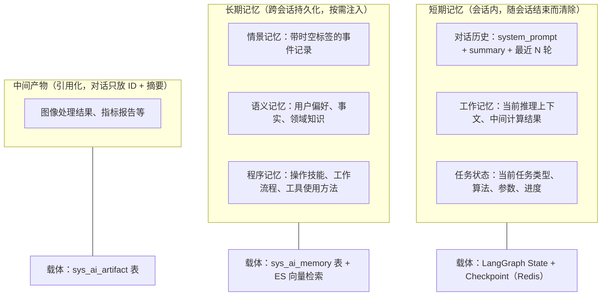

# AI 对话模块 - 后端实现设计（上下文管理）

## 1. 文档概述

本文档描述 F-M06-003 上下文管理的后端实现，包括上下文四层结构（对话历史/任务状态/长期记忆/中间产物）、artifacts 引用化、自动摘要压缩、记忆注入机制。

### 1.1 相关文档

- **架构与公共**：[后端实现-架构与公共.md](./后端实现-架构与公共.md)
- **需求规格 §2.3**：[需求规格.md](./需求规格.md)
- **API 接口 §2.4**：[API接口.md](./API接口.md)

---

## 2. 数据模型

本功能域涉及两张表，表结构详见 [数据库设计 §4.7](../../../02-系统架构/03-数据库设计.md#47-ai-对话模块)：

| 实体 | 职责 | 服务层关键用途 |
|------|------|-------------|
| `sys_ai_artifact` | 中间产物（引用化，多态引用业务表 + 业务摘要元数据） | 产物注册、摘要展示、失效标记 |
| `sys_ai_memory` | 长期记忆（情景/语义/程序三子类型，重要性评分 + 遗忘曲线） | 记忆检索注入、整理巩固、遗忘归档 |

**URL 不落库**：`sys_ai_artifact.summary` 只存业务摘要（指标数值、算法信息、处理参数），绝不存储 URL。图片 URL 通过 `ref_type=sys_file` + `ref_id=file_id` 引用 `sys_file`，运行时调 `FileService.getUrl()` 拼接，遵循文件管理规范"URL 永远运行时拼接、永不落库"。

**失效标记**：`sys_ai_artifact.is_invalid` 对齐 `sys_favorite.is_invalid` 设计。`sys_file` 被删除时，关联的 artifact 置失效标记，前端展示时标记"文件已失效"。产物记录为只追加，不使用逻辑删除（关联业务记录删除时标记失效，保留引用痕迹）。

**记忆子类型**（参考认知心理学 Tulving 记忆分类模型）：情景记忆（episodic，带时空标签的事件记录）、语义记忆（semantic，抽象知识/事实/用户偏好）、程序记忆（procedural，操作技能/工作流程/工具使用方法）。

**记忆归档与删除的区分**：`archived` 是遗忘策略归档（系统自动，不再注入但保留记录）；`deleted` 是用户主动删除（软删除后不再注入对话）。

---

## 3. 上下文与记忆分层结构

### 3.1 分层结构总览

参考认知心理学记忆模型和 MemGPT/Letta/LangGraph 等业界记忆框架：



### 3.2 上下文组装流程

每次推理前，ContextManager 组装发送给 LLM 的消息列表：

```
1. 系统消息层
   - system_prompt（会话级系统提示词）
   - 长期记忆注入（从 MemoryService 检索相关记忆，按相关性+近因性+重要性加权）
    ↓
2. 摘要层
   - 如果 summary 非空，作为 system 消息注入
   - "之前的对话摘要：{summary}"
    ↓
3. 最近消息层
   - 从 sys_ai_message 查询最近 N 轮消息（主分支链）
   - 过滤 deleted = 1 的消息
   - 保留最近 10 轮原文
    ↓
4. 任务状态层
   - 当前任务状态从 checkpoint state 读取
   - 不进入对话流，但 LLM 可通过工具查询
    ↓
5. 产物引用层
   - artifacts 只在消息中展示 ID + 摘要卡片
   - LLM 需要详情时通过工具获取
```

---

## 4. 对话历史管理

### 4.1 自动摘要压缩

当会话消息的累计 token 超过模型上下文阈值的 70% 时，触发摘要压缩：

```
计算当前上下文 token 总量
    ↓
总量 > 模型 max_context_tokens × 70%？
    ↓ 是
选取需要摘要的消息范围：
  - 保留最近 10 轮原文（不参与摘要）
  - 对 10 轮之前的消息生成摘要
    ↓
调用 LLM 生成摘要：
  - 输入：需要摘要的消息列表
  - Prompt："请将以下对话历史压缩为简洁摘要，保留关键信息、决策和任务状态"
  - 输出：摘要文本
    ↓
更新 sys_ai_conversation.summary：
  - 如果已有摘要，新摘要追加到旧摘要之后
  - "前序摘要：{旧摘要}\n近期摘要：{新摘要}"
    ↓
后续组装上下文时，被摘要的消息不再发送原文
  - 仅注入 summary 作为 system 消息
```

### 4.2 增量指令保护

增量指令（如"再亮一点"）不被摘要压掉：

| 保护策略 | 说明 |
|---------|------|
| 最近 N 轮原文保留 | 默认保留最近 10 轮消息原文，不参与摘要 |
| 任务状态独立维护 | 上一次处理的算法和参数记录在 task 层，LLM 可通过工具查询 |
| 摘要保留任务上下文 | 摘要 prompt 要求保留"最近一次处理的算法和参数" |

### 4.3 Token 统计

每次推理后统计 token 消耗，更新到消息记录：

```
LLM 返回 token 用量（input_tokens, output_tokens, cached_input_tokens）
    ↓
更新 sys_ai_message：
  - input_tokens = 本次输入 token 数（含缓存命中部分）
  - output_tokens = 本次输出 token 数
  - cached_input_tokens = 其中缓存命中的输入 token 数
    ↓
按模型计费比例换算积分：
  - credits = inputTokens × inputRate + cachedInputTokens × cachedRate + outputTokens × outputRate
  - 从 sys_ai_model 读取模型的 input_rate/output_rate/cached_rate
    ↓
更新 sys_ai_message.credits
```

---

## 5. 任务状态管理

### 5.1 任务状态结构

任务状态存储在 checkpoint 的 state 中，不进入对话流：

| 字段 | 用途 |
|------|------|
| `task_type` | 当前任务类型（如 dehaze） |
| `algorithm` | 当前使用的算法标识 |
| `params` | 处理参数（如强度、饱和度） |
| `status` | 任务执行状态（processing/completed/failed） |
| `task_id` | 关联的异步任务 ID |
| `artifacts` | 任务产生的产物引用列表（ID + 类型 + 摘要） |

### 5.2 任务状态更新时机

| 时机 | 更新内容 |
|------|---------|
| LLM 决定调用工具 | 设置 task_type、algorithm、params |
| 工具调用提交 | 设置 task_id、status=processing |
| 异步任务完成 | 设置 status=completed，添加 artifacts |
| 工具调用失败 | 设置 status=failed，记录 error |
| 用户修改参数 | 更新 params，重置 status |

### 5.3 任务状态查询

LLM 可通过 MCP 工具查询当前任务状态：

```
LLM 调用 get_task_status 工具
    ↓
ToolExecutorRegistry 从 checkpoint state 读取任务状态
    ↓
返回结构化任务状态（不进入对话流，只供 LLM 理解上下文）
```

---

## 6. 中间产物引用化

### 6.1 artifacts 引用化策略

图像处理结果体量大，绝不塞入 LLM 对话上下文：

```
工具调用产生结果（如去雾处理完成）
    ↓
MCP 网关返回结果摘要（指标数据 + 算法信息，不含 URL）
    ↓
ArtifactService 注册产物：
  - 创建 sys_ai_artifact 记录
  - type = image_result / metric_report
  - ref_type = sys_pred_log / sys_eval_log（间接关联 sys_file）
  - ref_id = 业务记录 ID
  - summary = {psnr, ssim, algorithm, params, ...}（JSON 业务摘要，绝不存 URL）
    ↓
在消息中只展示产物卡片（ID + 摘要）
  - 不把图片 URL 或完整指标数据塞入 content
    ↓
前端展示产物卡片需要图片 URL 时：
  - 通过 ref_type/ref_id 链路找到 sys_file.id
  - 调用 FileService.getUrl(fileId) 运行时拼接 URL
  - URL 不落库，遵循文件管理规范
    ↓
LLM 需要理解结果时：
  - 通过工具获取结构化摘要
  - 工具返回 artifact.summary 的内容（业务摘要，不含 URL）
    ↓
若需视觉理解（如"看看去雾效果好不好"）：
  - 利用多模态模型读取图片 URL
  - 更新会话 multimodal_read_count + 1（视觉读取计数）
  - 超过 VIP 等级上限则拒绝，提示升级
```

### 6.2 产物类型

| 类型 | 说明 | 关联业务表 | summary 内容（绝不存 URL） |
|------|------|-----------|-------------|
| `image_result` | 图像处理结果 | sys_pred_log（间接关联 sys_file） | 算法、参数、处理时间 |
| `metric_report` | 指标评估报告 | sys_eval_log | PSNR、SSIM、LPIPS、NIQE 等指标 |
| `algorithm_recommend` | 算法推荐结果 | sys_recommendation | 推荐算法列表、推荐理由、匹配度 |
| `file_ref` | 文件引用 | sys_file（直接关联） | 文件名、类型、大小 |

> 图片 URL 均通过 `ref_type`/`ref_id` 链路找到 `sys_file.id`，运行时调 `FileService.getUrl()` 拼接，不落库。

### 6.3 产物查询

| 查询场景 | 查询逻辑 |
|---------|---------|
| 会话产物列表 | 按会话 ID 查询，按创建时间倒序排列 |
| 消息产物 | 按消息 ID 查询关联产物 |
| 业务表反查 | 按引用类型和引用 ID 反查产物 |
| 产物详情 | 查询 artifact 记录 + 按需查询关联业务表获取完整数据 |

---

## 7. 长期记忆管理

### 7.1 记忆子类型

参考认知心理学 Tulving 记忆分类模型，长期记忆分三类：

| 子类型 | 定位 | 内容 | 示例 | metadata 结构 |
|--------|------|------|------|-------------|
| 情景记忆 (episodic) | 带时空标签的事件记录 | 某时某地发生了什么 | "用户上周二用 RIDCP 处理雾图，结果满意" | `{timestamp, event, outcome, user_feedback}` |
| 语义记忆 (semantic) | 抽象知识、事实、用户偏好 | 知道什么 | "用户偏好简洁回复"、"用户是图像处理研究者" | `{category, fact}` |
| 程序记忆 (procedural) | 操作技能、工作流程、工具使用方法 | 会做什么 | "用户习惯先去雾再评估，强度通常设 60-80" | `{skill, steps, params}` |

### 7.2 记忆来源

| 来源 | 提取方式 | 示例 |
|------|---------|------|
| 对话提取 (conversation) | LLM 在对话中识别值得记住的信息，异步提取 | "我喜欢简洁的回复" → 语义记忆 |
| 反馈提取 (feedback) | 用户点踩时附带的改进建议 | "太冗长" → 语义记忆（偏好简洁） |
| 反思整合 (reflection) | 定期回顾近期记忆，生成更高层次的抽象洞察 | "连续三周周一要报告" → 程序记忆（每周一需周报） |
| 手动录入 (manual) | 用户在设置中手动添加 | "我是图像处理研究者" → 语义记忆 |

### 7.3 记忆提取流程

```
对话完成（assistant 消息生成完毕）
    ↓
异步触发记忆提取（after_agent 钩子）：
  - 调用 LLM 分析本次对话
  - Prompt："分析以下对话，提取值得长期记忆的信息，分类为情景记忆/语义记忆/程序记忆"
  - 输入：本次对话消息 + 已有记忆列表（避免重复）
  - 输出：新记忆列表（memory_type, content, metadata）
    ↓
计算重要性评分（importance）：
  - 情感权重：用户情绪强烈的交互更值得记忆（0.3）
  - 频率因子：被多次提及的信息更重要（0.25）
  - 时效性：与当前任务的相关度（0.2）
  - 信息增益：新颖程度，与已有记忆的差异度（0.15）
  - 显式标记：用户主动要求"记住"的内容（0.1）
  - Importance = w1×Emotion + w2×Frequency + w3×Recency + w4×Novelty + w5×ExplicitMark
    ↓
写入 sys_ai_memory：
  - source = conversation
  - importance = 计算得分
  - status = 1, archived = 0
    ↓
同步到 ES 做向量检索：
  - 将记忆内容向量化
  - 写入 ES 索引（ai_memory）
```

### 7.4 记忆检索与注入

按相关性 + 近因性 + 重要性三维度加权检索（参考 Generative Agents）：

```
推理前组装上下文（before_model 钩子）
    ↓
MemoryService 检索相关记忆：
  - 优先从 ES 向量检索（按当前对话内容语义匹配）
  - 降级从 MySQL 查询（ES 不可用时）
  - 过滤 status = 1 && archived = 0 && deleted = 0
    ↓
三维度加权排序：
  Score = α × Relevance（语义相关性）
        + β × Recency（近因性，基于 last_accessed_at）
        + γ × Importance（重要性评分）
  默认权重 α=0.5, β=0.3, γ=0.2
    ↓
取 Top N 条记忆注入 system 消息
    ↓
重激活：更新命中记忆的 access_count + 1, last_accessed_at = NOW()
  （被检索的记忆重置衰减计时器，类似人类"复习巩固"）
```

### 7.5 记忆整理与巩固

记忆整理是将短期记忆转化为长期记忆、并对长期记忆进行维护管理的核心过程：

#### 7.5.1 定期摘要巩固

对话历史超 token 阈值时，摘要压缩并提取关键信息存入长期记忆：

```
对话历史 token 数 > 模型 max_context_tokens × 70%
    ↓
保留最近 10 轮原文（不参与摘要）
    ↓
对 10 轮之前的消息执行 LLM 摘要：
  - 提取关键决策、任务状态、用户偏好
  - 摘要存入 sys_ai_conversation.summary（短期，会话内）
  - 关键信息提取为情景记忆存入 sys_ai_memory（长期，跨会话）
    ↓
后续组装上下文时，被摘要的消息不再发送原文
```

#### 7.5.2 遗忘曲线

基于 Ebbinghaus 遗忘曲线，模拟记忆的自然衰退：

```
每日定时任务计算记忆衰减：
  priority = importance × exp(-Δt / half_life)
  Δt = NOW() - last_accessed_at（天）
  half_life = 30（半衰期 30 天）
    ↓
priority < 阈值（默认 10）→ 归档（archived = 1）
  - 归档记忆不再注入对话，但保留记录
  - 用户可查看历史归档记忆
    ↓
被检索命中的记忆重激活：
  - access_count + 1
  - last_accessed_at = NOW()
  - 衰减计时器重置（类似人类"复习巩固"）
```

#### 7.5.3 重要性评分更新

记忆的重要性评分在写入和访问时动态更新：

| 更新时机 | 更新逻辑 |
|---------|---------|
| 记忆写入时 | 初始评分（综合情感/频率/时效/信息增益/显式标记） |
| 被检索命中时 | importance += 5（最高 100），频率因子提升 |
| 用户显式标记"记住"时 | importance = 100（最高优先级） |
| 用户反馈相关时 | importance += 10（如点赞引用该记忆的回复） |

#### 7.5.4 反思整合

周期性回顾近期记忆，生成更高层次的抽象洞察：

```
每日定时任务触发反思：
  - 查询用户近 7 天的情景记忆
  - 调用 LLM 分析规律和模式
  - Prompt："回顾以下近期记忆，提取更高层次的抽象洞察"
  - 输入：近期情景记忆列表
  - 输出：抽象洞察（如"用户每周一需要周报" → 程序记忆）
    ↓
写入 sys_ai_memory：
  - source = reflection
  - memory_type = procedural 或 semantic（从情景记忆升级）
    ↓
反思层级：
  Layer 0: 原始观察（情景记忆："用户今天说喜欢简洁风格"）
    ↓ 反思
  Layer 1: 一阶抽象（语义记忆："用户偏好简洁"）
    ↓ 反思
  Layer 2: 二阶抽象（语义记忆："该用户是效率导向型人格"）
```

#### 7.5.5 合并去重

检测语义重复的记忆条目，合并为更完整的单一条目：

```
每日定时任务触发合并：
  - 查询用户所有活跃记忆
  - 按 memory_type 分组
  - 计算同组内记忆的语义相似度（ES 向量余弦相似度）
    ↓
相似度 > 0.9 的记忆对：
  - 调用 LLM 合并为统一表述
  - 示例："用户喜欢深色模式" + "用户偏好暗色主题" → "用户偏好深色/暗色主题"
  - importance 取较高值，access_count 累加
  - 旧记忆软删除，保留合并后的新记忆
```

### 7.6 记忆管理操作

| 操作 | 实现方式 |
|------|---------|
| 查看记忆列表 | 查询当前用户的未删除记忆，按重要性、更新时间倒序排列（支持按类型/来源筛选） |
| 删除单条记忆 | 软删除，不再注入对话，同步清除 ES 索引 |
| 查看归档记忆 | 查询当前用户被遗忘策略归档的记忆 |
| 记忆上限控制 | 超过 200 条时按重要性最低且最久未访问的记忆淘汰（归档而非删除） |

### 7.7 ES 向量检索

| 配置 | 说明 |
|------|------|
| 索引名 | `ai_memory` |
| 字段 | `id`、`user_id`、`memory_type`、`content`、`content_vector`（向量）、`importance`、`status`、`archived`、`deleted` |
| 向量模型 | 使用接入的 embedding 模型 |
| 检索方式 | 语义相似度检索（cosine similarity），按 user_id 过滤，排除 archived 和 deleted |
| 同步策略 | MySQL 写入后异步同步到 ES；ES 不可用时降级为 MySQL LIKE 查询 |

---

## 8. 多模态视觉读取控制

### 8.1 多模态视觉读取计数

```
LLM 需要视觉理解图片（如"看看去雾效果好不好"）
    ↓
跨日额度重置：若计数日期非当日，先将 multimodal_read_count 重置为 0
  - 会话可长期延续，视觉读取限额按会话维度独立计算
  - 超长会话不累积跨日额度（每日重置，避免长会话永久耗尽配额）
  - 新会话重置计数
    ↓
校验会话当日 multimodal_read_count < VIP 等级上限
  - 普通用户：5 次/会话/日
  - VIP1：10 次/会话/日
  - VIP2：20 次/会话/日
  - SVIP：50 次/会话/日
    ↓
未超限：
  - 更新 sys_ai_conversation.multimodal_read_count + 1，记录计数日期
  - 调用多模态模型读取图片 URL
  - 返回视觉理解结果给 LLM
    ↓
超限：
  - 拒绝多模态视觉读取
  - LLM 改为基于指标数据文字描述判断效果
  - 提示用户"本会话多模态视觉读取次数已用尽，升级 VIP 可增加次数"
```

### 8.2 多模态视觉 Token 计量

多模态视觉读取的 Token 消耗计入对话 Token（作为输入 Token 的一部分），不单独计量：

```
多模态模型返回 token 用量
    ↓
合并到本次推理的 input_tokens 中
    ↓
统一按模型计费比例换算积分