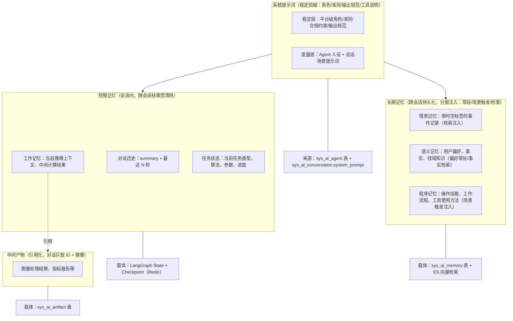

# AI 对话模块 - 后端实现设计（上下文管理）

## 1. 文档概述

本文档描述 F-M08-003 上下文、记忆与提示词管理的后端实现，包括提示词工程（系统提示词分层组装）、上下文分层结构（系统提示词/对话历史/任务状态/长期记忆/中间产物）、artifacts 引用化、自动摘要压缩、记忆注入机制。

### 1.1 设计思想

#### 设计动机

上下文管理是 AI 对话的"记忆层"，本功能域的根本矛盾是：**LLM 上下文窗口的有限性**与**对话信息的无限增长**之间的张力。

对话会无限增长（消息越来越多）、产物会越来越大（图像结果、指标报告）、用户偏好会持续积累（跨会话的记忆）。若全量塞进上下文，轻则 Token 成本失控，重则超出模型窗口直接报错。但信息也不能随意丢弃——用户刚说"再亮一点"这种增量指令被摘要压掉，体验会严重退化。

本功能域的设计目标：**让 Agent 在有限的上下文窗口内，始终保持"足够且相关"的信息**——该有的信息（最近原文、当前任务）绝不丢，不该有的信息（旧消息、大体积产物）绝不进上下文。

#### 核心设计原则

| 原则 | 说明 |
|------|------|
| 提示词工程 | 系统提示词内部再分"稳定层"（平台级角色/准则/合规约束/输出规范）与"变量层"（Agent 人设 + 会话场景提示词），稳定层构成 Prompt Caching 的稳定前缀，变量层随 Agent/会话注入（详见 §3.3） |
| 分层记忆 | 短期记忆（对话历史/任务状态/工作记忆）随会话结束清除；长期记忆（跨会话）分层注入；中间产物引用化。三层边界清晰，各自管理（详见 §3） |
| 引用化 | 大体积产物绝不进入 LLM 上下文，只传引用 ID + 业务摘要。这是"上下文不爆炸"的第一道防线（详见 §6） |
| 分层注入 | 长期记忆不是统一检索注入，而是按类型分层：用户偏好常驻（每轮生效）、历史事件检索（语义相关才召回）、操作习惯场景触发（任务出现才注入）。工具定义按命名空间预筛选（见 [后端实现-能力扩展 §3](./后端实现-能力扩展.md#3-mcp-工具命名空间预筛选)）。信息按需供给，而非全量供给 |
| 摘要保底 | 超出窗口阈值时对旧消息摘要压缩，但保留最近 N 轮原文与任务状态，守住"增量指令不被压掉"的底线（详见 §4.2） |
| 认知模型启发 | 长期记忆参考认知心理学：三类记忆（情景/语义/程序）、遗忘曲线（Ebbinghaus）、检索重激活（类似人类复习巩固）、反思整合（从具体事件抽象出规律）（详见 §7） |

#### 关键架构取舍

| 取舍点 | 方案对比 | 选择与理由 |
|--------|---------|-----------|
| 上下文组织 | 全部消息平铺 vs 分层结构（系统/摘要/最近原文/任务状态/产物引用） | 选分层。分层让"哪些信息必须保留、哪些可压缩"显式化，也为 Prompt Caching 优化提供"稳定前缀 + 动态后缀"的组装基础（见[后端实现-模型管理 §2.9](./后端实现-模型管理.md#29-prompt-caching-优化)） |
| 产物 URL 存储 | URL 落库 vs 引用 ID 运行时拼接 | 选引用拼接。URL 有有效期且属敏感资源，落库会导致过期失效与安全问题；存引用 ID（sys_file），运行时调 FileService 拼接，符合平台"URL 永不落库"的文件管理规范（详见 §6.1） |
| 记忆检索 | 仅 MySQL LIKE vs ES 向量语义检索 | 选 ES 向量。对话语义匹配不是关键词匹配，向量检索才能命中"用户之前说喜欢简洁风格"这类语义相关记忆；ES 不可用时降级 MySQL LIKE 保底 |
| 记忆管理策略 | 永久保留所有记忆 vs 遗忘曲线 + 归档 + 合并去重 | 选后者。记忆无限累积会稀释检索质量，也会撑爆注入预算；遗忘曲线模拟自然衰退、反思整合提炼高层洞察、合并去重消除冗余，让记忆系统"越用越聪明"（详见 §7.5） |

#### 总体规划

上下文管理是"记忆层"，为推理层提供组装好的输入：

```
输入源                    组装规则                  输出
对话历史（sys_ai_message）→ 最近 N 轮原文 + 摘要压缩   ┐
长期记忆（sys_ai_memory） → 分层注入（常驻偏好/场景触发/语义检索）├→ 组装为 LLM 消息序列
中间产物（sys_ai_artifact）→ 引用 ID + 摘要，绝不原文  ┘
任务状态（checkpoint）     → 独立维护，LLM 工具查询    → 不进入对话流
```

本功能域是推理前的统一入口：所有功能域的"喂给 LLM 什么"都由本层决定，保证信息供给的一致性。

---

## 2. 数据模型

本功能域涉及两张表，表结构详见 [数据库设计 §4.7](../../../02-系统架构/03-数据库设计.md#47-ai-对话模块)：

| 实体 | 职责 | 服务层关键用途 |
|------|------|-------------|
| `sys_ai_artifact` | 中间产物（引用化，多态引用业务表 + 业务摘要元数据） | 产物注册、摘要展示、失效标记 |
| `sys_ai_memory` | 长期记忆（情景/语义/程序三子类型，重要性评分 + 遗忘曲线） | 记忆检索注入、整理巩固、遗忘归档 |

**URL 不落库**：`sys_ai_artifact.summary` 只存业务摘要（指标数值、算法信息、处理参数），绝不存储 URL。图片 URL 通过 `ref_type=sys_file` + `ref_id=file_id` 引用 `sys_file`，运行时调 `FileService.getUrl()` 拼接，遵循文件管理规范"URL 永远运行时拼接、永不落库"。

**失效标记**：`sys_ai_artifact.is_invalid` 对齐 `sys_favorite.is_invalid` 设计。`sys_file` 被删除时，关联的 artifact 置失效标记，前端展示时标记"文件已失效"。产物记录为只追加，不使用逻辑删除（关联业务记录删除时标记失效，保留引用痕迹）。

**记忆子类型**（参考认知心理学 Tulving 记忆分类模型）：情景记忆（episodic，带时空标签的事件记录）、语义记忆（semantic，抽象知识/事实/用户偏好）、程序记忆（procedural，操作技能/工作流程/工具使用方法）。

**记忆归档与删除的区分**：`archived` 是遗忘策略归档（系统自动，不再注入但保留记录）；`deleted` 是用户主动删除（软删除后不再注入对话）。

---

## 3. 上下文与记忆分层结构

### 3.1 分层结构总览

**设计依据**：分层记忆与"按需换入换出"的思想参考业界 LLM 记忆框架（MemGPT/Letta：上下文类比主存，历史对话换出到外部存储、需要时换入；LangGraph Memory）。本系统只借鉴该思想，按平台数据模型落地为"摘要压缩 + 分层注入 + 产物引用化"三层机制，不引入额外运行时。



### 3.2 上下文组装流程

每次推理前，ContextManager 组装发送给 LLM 的消息列表。**组装为单点**：由 `reasoning_service.run` 内部调用 `build_context` 一次性完成（send_message/edit_message 不再预热，避免 build_context 重复执行导致记忆 touch 副作用翻倍），调用方无需传 messages/system_prompt：

```
1. 系统消息层（系统提示词 = 稳定层 + 变量层，详见 §3.3）

```
1. 系统消息层（系统提示词 = 稳定层 + 变量层，详见 §3.3）
   - 稳定层：平台级角色/准则/合规约束/输出规范（固定前缀，支撑 Prompt Caching）
   - 变量层：Agent 人设（sys_ai_agent 表）+ 会话场景提示词（sys_ai_conversation.system_prompt）
   - 长期记忆注入（MemoryService 三层注入：常驻偏好 + 场景触发程序记忆 + 语义检索相关记忆，见 §7.4）
   - 注入可见性：build_context 返回 injected_list，推理落库时写 sys_ai_message.used_memory_ids
     （resume 从 checkpoint state 续读），供前端展示每条回复引用了哪些记忆
    ↓
2. 摘要层
   - 如果 summary 非空，作为 system 消息注入
   - "之前的对话摘要：{summary}"
    ↓
3. 最近消息层
   - 从 sys_ai_message 查询最近 N 轮消息（主分支链）
   - 过滤 deleted = 1 的消息
   - 保留最近 10 轮原文
    ↓
4. 任务状态层
   - 当前任务状态从 checkpoint state 读取
   - 不进入对话流，但 LLM 可通过工具查询
    ↓
5. 产物引用层
   - 对关联产物（按 message_id 查询）在对应消息后附加引用行：
     "[[产物 #{id}] {类型}：{摘要关键字段}]"（摘要截断 200 字）
   - 绝不注入 URL/全文；LLM 需要详情时通过工具获取
```

### 3.3 提示词工程

提示词工程解决"系统如何稳定、高效地组织发送给 LLM 的指令"，是上下文的稳定前缀（第一层）。核心目标：以最小上下文开销换取最稳定的 Agent 行为，参考 Anthropic 上下文工程（Context Engineering）的"注意力预算"理念——上下文是有限资源，每一层注入都应有明确价值。

#### 3.3.1 系统提示词分层设计

系统提示词内部再分"稳定层"与"变量层"，稳定内容长期复用、动态内容随 Agent/会话注入，两者共同构成 Prompt Caching 的"稳定前缀 + 动态后缀"组装基础（见 [后端实现-模型管理 §2.9](./后端实现-模型管理.md#29-prompt-caching-优化)）：

| 层 | 内容 | 实现落点 | 变更频率 |
|----|------|---------|---------|
| 稳定层 | 平台级角色定位、通用行为准则、安全合规约束、输出格式规范 | 平台统一维护（固定前缀）；合规约束同时由 `GuardrailMiddleware` 独立拦截（见 [后端实现-智能体管理 §8.5](./后端实现-智能体管理.md#85-安全护栏)） | 极低 |
| 变量层 | Agent 人设与专属指令、会话场景提示词 | `sys_ai_agent` 表 + `sys_ai_conversation.system_prompt` | 随 Agent 配置/会话场景 |

**组装方式**（`prompt_composer.compose_system_prompt` 三层拼接）：稳定层位于最前，随后是 Agent 人设、会话场景提示词，保证缓存前缀不变。

- **图构建**（`DeepAgentBuilder`）：`create_deep_agent` 的 `system_prompt` 仅含"稳定层 + Agent 人设"（随快照稳定，可安全进入图缓存键）。
- **会话场景提示词**（`sys_ai_conversation.system_prompt`）随会话变化，**不进图缓存键**：经 `initial_state.conversation_prompt` 运行时注入，由 `DehazeHooksMiddleware.awrap_model_call` 在调用模型前并入 system 消息（追加于稳定层+Agent 人设之后）。
- **`ContextManager.build_context` 返回的 `system_prompt`** 为完整组装结果（三层全量），与图运行时实际发送的系统消息一致。

#### 3.3.2 场景化提示词模板

针对通用对话、图像处理调度、多步推理、算法推荐、定时任务等场景预设提示词模板。会话创建时根据场景选择对应默认提示词写入 `sys_ai_conversation.system_prompt`（见 [后端实现-会话与消息 §3.1](./后端实现-会话与消息.md#31-创建会话)），保证同类任务行为一致、可预期。

#### 3.3.3 结构化提示规范

| 规范 | 说明 |
|------|------|
| 角色-任务-格式三要素 | 每个提示词明确"扮演什么角色、完成什么任务、以什么格式输出" |
| 分节组织 | 指令、约束、示例、输入分区清晰，降低 LLM 理解歧义 |

#### 3.3.4 提示词优化闭环

结合消息反馈（F-M08-008）的点赞/点踩数据驱动系统提示词迭代：当某类负反馈标签累计超过阈值（如 tags=["too_long"] 出现 10 次），异步分析并在 system_prompt 中增加优化指令（如"回复保持简洁"），更新 `sys_ai_conversation.system_prompt`（详见 [后端实现-消息反馈 §2.7](./后端实现-消息反馈.md#27-反馈驱动闭环)）。

> 提示词优化是数据驱动闭环（Reflexion 范式的被动触发版）：用真实用户反馈反哺系统提示词，而非人工拍脑袋调整。同一反馈还会经记忆提取沉淀用户偏好（见 §7.2 反馈提取）。

---

## 4. 对话历史管理

### 4.1 自动摘要压缩

当会话消息的累计 token 超过模型上下文阈值的 70% 时，触发摘要压缩：

```
计算当前上下文 token 总量
    ↓
总量 > 模型 max_context_tokens × 70%？
    ↓ 是
选取需要摘要的消息范围（增量）：
  - 上界：summary_upto_message_id（上次摘要水位，未覆盖过则从最早开始）
  - 下界：保留最近 10 轮原文（不参与摘要）
  - 只摘要"上次水位之后、最近 10 轮之前"的消息，避免全量重摘导致摘要膨胀
    ↓
调用 LLM 生成摘要：
  - 输入：需要摘要的消息列表
  - Prompt："请将以下对话历史压缩为简洁摘要，保留关键信息、决策和任务状态"
  - 输出：摘要文本
    ↓
更新 sys_ai_conversation：
  - summary：如果已有摘要，新摘要追加到旧摘要之后
    "前序摘要：{旧摘要}\n近期摘要：{新摘要}"
  - 旧摘要超过 2000 字时，追加前先对旧摘要自身做一次 LLM 再压缩（防长会话累积膨胀）
  - summary_upto_message_id：推进到本次覆盖的最后一条消息 ID
    ↓
调用 extract_episodic_from_summary 从被摘要消息提取情景记忆（失败静默记日志）
    ↓
后续组装上下文时，被摘要的消息不再发送原文
  - 仅注入 summary 作为 system 消息
```

### 4.2 增量指令保护

增量指令（如"再亮一点"）不被摘要压掉：

| 保护策略 | 说明 |
|---------|------|
| 最近 N 轮原文保留 | 默认保留最近 10 轮消息原文，不参与摘要 |
| 任务状态独立维护 | 上一次处理的算法和参数记录在 task 层，LLM 可通过工具查询 |
| 摘要保留任务上下文 | 摘要 prompt 要求保留"最近一次处理的算法和参数" |

### 4.3 Token 统计

每次推理后统计 token 消耗，更新到消息记录：

```
LLM 返回 token 用量（input_tokens, output_tokens, cached_input_tokens）
    ↓
更新 sys_ai_message：
  - input_tokens = 本次输入 token 数（含缓存命中部分）
  - output_tokens = 本次输出 token 数
  - cached_input_tokens = 其中缓存命中的输入 token 数
    ↓
按模型计费比例换算积分：
  - credits = inputTokens × inputRate + cachedInputTokens × cachedRate + outputTokens × outputRate
  - 从 sys_ai_model 读取模型的 input_rate/output_rate/cached_rate
    ↓
更新 sys_ai_message.credits
```

---

## 5. 任务状态管理

### 5.1 任务状态结构

任务状态存储在 checkpoint 的 state 中，不进入对话流：

| 字段 | 用途 |
|------|------|
| `task_type` | 当前任务类型（如 dehaze） |
| `algorithm` | 当前使用的算法标识 |
| `params` | 处理参数（如强度、饱和度） |
| `status` | 任务执行状态（processing/completed/failed） |
| `task_id` | 关联的异步任务 ID |
| `artifacts` | 任务产生的产物引用列表（ID + 类型 + 摘要） |

### 5.2 任务状态更新时机

| 时机 | 更新内容 |
|------|---------|
| LLM 决定调用工具 | 设置 task_type、algorithm、params |
| 工具调用提交 | 设置 task_id、status=processing |
| 异步任务完成 | 设置 status=completed，添加 artifacts |
| 工具调用失败 | 设置 status=failed，记录 error |
| 用户修改参数 | 更新 params，重置 status |

### 5.3 任务状态查询

LLM 可通过 MCP 工具查询当前任务状态：

```
LLM 调用 get_task_status 工具
    ↓
ToolExecutorRegistry 从 checkpoint state 读取任务状态
    ↓
返回结构化任务状态（不进入对话流，只供 LLM 理解上下文）
```

---

## 6. 中间产物引用化

### 6.1 artifacts 引用化策略

图像处理结果体量大，绝不塞入 LLM 对话上下文：

```
工具调用产生结果（如去雾处理完成）
    ↓
MCP 网关返回结果摘要（指标数据 + 算法信息，不含 URL）
    ↓
ArtifactService 注册产物：
  - 创建 sys_ai_artifact 记录
  - type = image_result / metric_report
  - ref_type = sys_pred_log / sys_eval_log（间接关联 sys_file）
  - ref_id = 业务记录 ID
  - summary = {psnr, ssim, algorithm, params, ...}（JSON 业务摘要，绝不存 URL）
    ↓
在消息中只展示产物卡片（ID + 摘要）
  - 不把图片 URL 或完整指标数据塞入 content
    ↓
前端展示产物卡片需要图片 URL 时：
  - 通过 ref_type/ref_id 链路找到 sys_file.id
  - 调用 FileService.getUrl(fileId) 运行时拼接 URL
  - URL 不落库，遵循文件管理规范
    ↓
LLM 需要理解结果时：
  - 通过工具获取结构化摘要
  - 工具返回 artifact.summary 的内容（业务摘要，不含 URL）
    ↓
若需视觉理解（如"看看去雾效果好不好"）：
  - 利用多模态模型读取图片 URL
  - Redis 全局日计数 + 1（`ai:multimodal:{userId}:{date}`）
  - 超过 VIP 等级日限额则拒绝，提示升级
```

### 6.2 产物类型

| 类型 | 说明 | 关联业务表 | summary 内容（绝不存 URL） |
|------|------|-----------|-------------|
| `image_result` | 图像处理结果 | sys_pred_log（间接关联 sys_file） | 算法、参数、处理时间 |
| `metric_report` | 指标评估报告 | sys_eval_log | PSNR、SSIM、LPIPS、NIQE 等指标 |
| `algorithm_recommend` | 算法推荐结果 | sys_recommendation | 推荐算法列表、推荐理由、匹配度 |
| `file_ref` | 文件引用 | sys_file（直接关联） | 文件名、类型、大小 |

> 图片 URL 均通过 `ref_type`/`ref_id` 链路找到 `sys_file.id`，运行时调 `FileService.getUrl()` 拼接，不落库。
>
> `file_ref` 类型用于"用户消息附图"注册文件引用产物；当前消息附图以 markdown 图片 URL 内联在 `content` 中、无独立附件文件表机制，暂不注册 `file_ref`，待引入附件表后启用（见 §6.5 之后的边界说明）。

### 6.3 产物查询

| 查询场景 | 查询逻辑 | 接口 |
|---------|---------|------|
| 会话产物列表 | 按会话 ID 查询，按创建时间倒序排列 | `GET /api/v1/ai/conversations/{convId}/artifacts` |
| 消息产物 | 按消息 ID 查询关联产物 | `GET /api/v1/ai/messages/{msgId}/artifacts` |
| 业务表反查 | 按引用类型和引用 ID 反查产物（校验会话归属） | `GET /api/v1/ai/artifacts/by-ref?refType=&refId=` |
| 产物详情 | artifact 记录 + 按需查业务表 + 运行时拼图片 URL | `GET /api/v1/ai/artifacts/{id}/detail` |
| 批量消息产物（上下文引用层契约） | 批量取消息关联产物，仅 `is_invalid=0`，按 `message_id` 分组为 `[{id, type, summary}]` | `AiArtifactService.get_message_artifact_refs(db, message_ids)` |

**归属鉴权**：产物查询均校验 `artifact.conversation_id` 归属当前用户，他人会话产物返回资源不存在，避免越权访问。

### 6.4 产物失效联动

`sys_file` 删除（`FileService.delete_file_with_storage`）时调用 `AiArtifactService.mark_invalid_for_file(db, file_id)`，一次性失效：

- 直接引用：`ref_type=sys_file, ref_id=file_id`
- 间接引用：查 `sys_pred_log`（`pred_file_id`/`origin_file_id`）、`sys_eval_log`（`pred_file_id`/`gt_file_id`）中引用该文件的日志，失效对应的 `sys_pred_log`/`sys_eval_log` 产物。

### 6.5 metric_report 产物注册

`evaluation_service.evaluate` 支持可选 `conv_id`/`msg_id` 参数（AI 会话场景传入）；`_execute_async` 评估完成后，在会话场景下注册 `metric_report` 产物（`ref_type=sys_eval_log, ref_id=log_id, summary=metrics`）。独立评估（管理端）不传会话上下文则跳过注册，不阻断评估主流程。

---

## 7. 长期记忆管理

### 7.1 记忆子类型

参考认知心理学 Tulving 记忆分类模型，长期记忆分三类：

| 子类型 | 定位 | 内容 | 示例 | metadata 结构 | 注入方式 |
|--------|------|------|------|-------------|---------|
| 情景记忆 (episodic) | 带时空标签的事件记录 | 某时某地发生了什么 | "用户上周二用 RIDCP 处理雾图，结果满意" | `{timestamp, event, outcome, user_feedback}` | 检索注入 |
| 语义记忆 (semantic) | 抽象知识、事实、用户偏好 | 知道什么 | "用户偏好简洁回复"、"用户是图像处理研究者" | `{category, fact, is_preference}` | 偏好类常驻注入；事实类检索注入 |
| 程序记忆 (procedural) | 操作技能、工作流程、工具使用方法 | 会做什么 | "用户习惯先去雾再评估，强度通常设 60-80" | `{skill, steps, params}` | 场景触发注入 |

> `is_preference=1` 标记用户偏好类语义记忆（常驻注入）；`skill` 字段标记程序记忆对应的任务类型（场景触发注入依据）。详见 §7.4 记忆注入三层机制。

### 7.2 记忆来源

| 来源 | 提取方式 | 示例 |
|------|---------|------|
| 对话提取 (conversation) | LLM 在对话中识别值得记住的信息，异步提取 | "我喜欢简洁的回复" → 语义记忆 |
| 反馈提取 (feedback) | 用户点踩时附带的改进建议 | "太冗长" → 语义记忆（偏好简洁） |
| 反思整合 (reflection) | 定期回顾近期记忆，生成更高层次的抽象洞察 | "连续三周周一要报告" → 程序记忆（每周一需周报） |
| 手动录入 (manual) | 用户在设置中手动添加 | "我是图像处理研究者" → 语义记忆 |

### 7.3 记忆提取流程

```
对话完成（assistant 消息生成完毕）
    ↓
异步触发记忆提取（after_agent 钩子）：
  - 调用 LLM 分析本次对话
  - Prompt："分析以下对话，提取值得长期记忆的信息，分类为情景记忆/语义记忆/程序记忆"
  - 输入：本次对话消息 + 已有记忆列表（避免重复）
  - 输出：新记忆列表（memory_type, content, metadata）
    ↓
计算重要性评分（importance）：
  - 情感权重：用户情绪强烈的交互更值得记忆（0.3）
  - 频率因子：被多次提及的信息更重要（0.25）
  - 时效性：与当前任务的相关度（0.2）
  - 信息增益：新颖程度，与已有记忆的差异度（0.15）
  - 显式标记：用户主动要求"记住"的内容（0.1）
  - Importance = w1×Emotion + w2×Frequency + w3×Recency + w4×Novelty + w5×ExplicitMark
    ↓
写入 sys_ai_memory：
  - source = conversation
  - importance = 计算得分
  - status = 1, archived = 0
    ↓
同步到 ES 做向量检索：
  - 将记忆内容向量化
  - 写入 ES 索引（ai_memory）
```

### 7.4 记忆注入（三层机制）

**设计原则**：长期记忆不是统一检索，而是按记忆类型分三种注入方式。这是对齐业界最佳实践（OpenAI ChatGPT：Saved Memories 常驻 + Personal Context Tooling 按需检索）后的核心设计——**用户偏好应每轮生效（常驻），历史事件应语义相关时才召回（检索），操作习惯应任务出现时才触发（场景触发）**。若全部走统一检索，用户偏好会因当前对话语义不相关而被漏掉，导致"用户明确告诉过的偏好失效"。

```
推理前组装上下文（before_model 钩子）
    ↓
MemoryService 按三层机制组装：
    ↓
① 常驻注入（Always-on）
  - 加载语义记忆中的用户偏好/身份/固定习惯（preference=true 的语义记忆）
  - 全量注入 system prompt（数量少，通常 <20 条），不检索、不省略
    ↓
② 场景触发注入（Trigger-based）
  - 任务类型识别（复杂度评估环节输出的 task_type）
  - 未传 task_type 时兜底：按最后用户消息关键词匹配用户已有 skill（list_skills 去重）
  - 匹配该任务类型对应的程序记忆（skill 字段匹配）
  - 注入对应工作流/处理习惯
    ↓
③ 检索注入（Retrieval-based）
  - 优先从 ES 向量检索（按当前对话内容语义匹配）
  - 降级从 MySQL 查询（ES 不可用时）
  - 过滤 status = 1 && archived = 0 && deleted = 0
  - 按当前对话语义，检索相关的情景记忆 + 事实类语义记忆
    ↓
三维度加权排序（仅用于③检索注入）：
  Score = α × Relevance（语义相关性）
        + β × Recency（近因性，基于 last_accessed_at）
        + γ × Importance（重要性评分）
  默认权重 α=0.5, β=0.3, γ=0.2
    ↓
取 Top N 条记忆注入 system 消息
    ↓
重激活：更新命中记忆的 access_count + 1, last_accessed_at = NOW()
  （被检索的记忆重置衰减计时器，类似人类"复习巩固"）
```

**三层注入的实现要点**：

| 注入层 | 数据来源 | 过滤条件 | 注入位置 |
|--------|---------|---------|---------|
| 常驻注入 | `sys_ai_memory` 中 `memory_type=语义` 且 `is_preference=1` 的记录 | `status=1 && archived=0 && deleted=0` | system prompt 的"用户画像"区块，每轮固定 |
| 场景触发注入 | `memory_type=程序` 且 `skill` 与任务类型匹配的记录 | 任务类型识别命中 | system prompt 的"工作流提示"区块，任务识别后注入 |
| 检索注入 | ES 向量检索（情景 + 事实类语义记忆） | 语义相关 Top N | system prompt 的"相关记忆"区块 |

> 常驻注入的记忆与对话语义无关也要注入，因为它是用户长期偏好，对任何回复都有价值。为防止常驻注入挤占上下文，限制常驻条数上限（默认 20 条，超出时按重要性替换）。

### 7.5 记忆整理与巩固

记忆整理是将短期记忆转化为长期记忆、并对长期记忆进行维护管理的核心过程：

#### 7.5.1 定期摘要巩固

对话历史超 token 阈值时，摘要压缩并提取关键信息存入长期记忆：

```
对话历史 token 数 > 模型 max_context_tokens × 70%
    ↓
保留最近 10 轮原文（不参与摘要）
    ↓
对 10 轮之前的消息执行 LLM 摘要：
  - 提取关键决策、任务状态、用户偏好
  - 摘要存入 sys_ai_conversation.summary（短期，会话内）
  - 关键信息提取为情景记忆存入 sys_ai_memory（长期，跨会话）
    ↓
后续组装上下文时，被摘要的消息不再发送原文
```

#### 7.5.2 遗忘曲线

基于 Ebbinghaus 遗忘曲线，模拟记忆的自然衰退：

```
每日定时任务计算记忆衰减：
  priority = importance × exp(-Δt / half_life)
  Δt = NOW() - last_accessed_at（天）
  half_life = 30（半衰期 30 天）
    ↓
priority < 阈值（默认 10）→ 归档（archived = 1）
  - 归档记忆不再注入对话，但保留记录
  - 用户可查看历史归档记忆
    ↓
被检索命中的记忆重激活：
  - access_count + 1
  - last_accessed_at = NOW()
  - 衰减计时器重置（类似人类"复习巩固"）
```

#### 7.5.3 重要性评分更新

记忆的重要性评分在写入和访问时动态更新：

| 更新时机 | 更新逻辑 |
|---------|---------|
| 记忆写入时 | 初始评分（综合情感/频率/时效/信息增益/显式标记） |
| 被检索命中时 | importance += 5（最高 100），频率因子提升 |
| 用户显式标记"记住"时 | importance = 100（最高优先级） |
| 用户反馈相关时 | importance += 10（如点赞引用该记忆的回复） |

#### 7.5.4 反思整合

周期性回顾近期记忆，生成更高层次的抽象洞察：

```
每日定时任务触发反思：
  - 查询用户近 7 天的情景记忆
  - 调用 LLM 分析规律和模式
  - Prompt："回顾以下近期记忆，提取更高层次的抽象洞察"
  - 输入：近期情景记忆列表
  - 输出：抽象洞察（如"用户每周一需要周报" → 程序记忆）
    ↓
写入 sys_ai_memory：
  - source = reflection
  - memory_type = procedural 或 semantic（从情景记忆升级）
    ↓
反思层级：
  Layer 0: 原始观察（情景记忆："用户今天说喜欢简洁风格"）
    ↓ 反思
  Layer 1: 一阶抽象（语义记忆："用户偏好简洁"）
    ↓ 反思
  Layer 2: 二阶抽象（语义记忆："该用户是效率导向型人格"）
```

#### 7.5.5 合并去重

检测语义重复的记忆条目，合并为更完整的单一条目：

```
每日定时任务触发合并：
  - 查询用户所有活跃记忆
  - 按 memory_type 分组
  - 计算同组内记忆的语义相似度（ES 向量余弦相似度）
    ↓
相似度 > 0.9 的记忆对：
  - 调用 LLM 合并为统一表述
  - 示例："用户喜欢深色模式" + "用户偏好暗色主题" → "用户偏好深色/暗色主题"
  - importance 取较高值，access_count 累加
  - 旧记忆软删除，保留合并后的新记忆
```

### 7.6 记忆管理操作

| 操作 | 实现方式 |
|------|---------|
| 查看记忆列表 | 查询当前用户的未删除记忆，按重要性、更新时间倒序排列（支持按类型/来源筛选） |
| 删除单条记忆 | 软删除（记录 `delete_time`），不再注入对话，同步清除 ES 索引 |
| 查看归档记忆 | `GET /api/v1/ai/memories/archived`，查询当前用户被遗忘策略归档的记忆 |
| 批量清空 | `POST /api/v1/ai/memories/clear`，三种粒度（全部/指定类型/指定时间范围），需 `confirm=true` 二次确认，软删 + 记录 `delete_time`，30 天恢复窗口内可 `POST /restore` 恢复 |
| 记忆导出 | `GET /api/v1/ai/memories/export?fmt=json|markdown`，含类型/来源/重要性/创建时间，StreamingResponse 返回 |
| 物理清理 | 软删超过 30 天（`delete_time < NOW()-30d`）由定时任务 `purgeDeletedMemories` 物理删除 |
| 记忆上限控制 | 超过 200 条时按重要性最低且最久未访问的记忆淘汰（归档而非删除） |

### 7.7 ES 向量检索

| 配置 | 说明 |
|------|------|
| 索引名 | `ai_memory` |
| 字段 | `id`、`user_id`、`memory_type`、`content`、`content_vector`（向量）、`importance`、`status`、`archived`、`deleted` |
| 向量模型 | 从 `sys_dict`（`ai_embedding`：provider_code/model/dims 三键种子）读取，经 `ai_provider` 体系取 Key；dims 与 ES mapping 联动 |
| 检索方式 | 语义相似度检索（cosine similarity），按 user_id 过滤，排除 archived 和 deleted；ES 返回 `relevance` 分数供三维权排序归一化 |
| 同步策略 | MySQL 写入后异步同步到 ES；ES 不可用时降级为 MySQL LIKE 查询；删除记忆同步调 `delete_doc` 清除向量 |

**注入可见性**：`inject_memories` 返回 `(system_block_text, injected_list)`，其中 `injected_list` 为
`[{memory_id, memory_type, content, source}]`（source 取值 preference/skill/retrieval）。该清单
由推理层落库展示（写入 `sys_ai_message.used_memory_ids` JSON 列，migration 009），
用户可展开查看本次引用的记忆。

---

## 8. 多模态视觉读取控制

### 8.1 多模态视觉读取计数

视觉读取限额按用户维度全局日计数（Redis `ai:multimodal:{userId}:{date}`），与 AI 计费的日配额模型对齐：

```
LLM 需要视觉理解图片（如"看看去雾效果好不好"）
    ↓
读取 Redis 当日计数 ai:multimodal:{userId}:{date}
  - 跨会话共用同一额度，每日 0 点自然过期重置
  - 新会话不重置（用户维度全局计数，避免"开新会话绕过限额"）
    ↓
校验当日计数 < VIP 等级日限额
  - 普通用户：5 次/日
  - VIP1：10 次/日
  - VIP2：20 次/日
  - SVIP：50 次/日
    ↓
未超限：
  - Redis INCR 当日计数 + 1
  - 调用多模态模型读取图片 URL
  - 返回视觉理解结果给 LLM
    ↓
超限：
  - 拒绝多模态视觉读取
  - LLM 改为基于指标数据文字描述判断效果
  - 提示用户"今日多模态视觉读取次数已用尽，升级 VIP 可增加次数"
```

**实现落地**（`app/service/ai_artifact_service.py` + `app/service/ai/dehaze_tools_builder.py`）：

- **`visual_read(artifact_id)` 工具**：新增的第 7 个业务工具。入参为上下文产物引用行的 `artifact_id`。流程：查 artifact（未失效）→ 经 `ref_type`/`ref_id` 链路解析图片引用（`sys_file` 直接取 `ref_id`；`sys_pred_log`/`sys_eval_log` 经 `pred_file_id`）→ `FileService.getUrl` 运行时拼 URL → 限额判定 → 调多模态模型读取。工具描述写明"评估图片效果时使用"，与用户主动要求记住的行为无关。
- **`check_visual_quota(db, redis, user_id)`**：纯读当日额度 `(used, limit)`，供前端展示；读 `sys_member.level_code` → `sys_member_benefit.multimodal_limit` + Redis 当日计数 `ai:multimodal:{userId}:{yyyyMMdd}`。无会员记录回退 `level_0`。
- **原子消费 `_consume_visual_quota(redis, user_id, limit)`**：采用「INCR 先行后判断」——INCR 得到 `new_count`，若 `new_count > limit` 则 `DECR` 回退并返回拒绝（该次不消费），避免并发间隙绕过日上限；首次 INCR（`new_count==1`）设 TTL 至次日零点（每日 0 点自然过期重置），实现跨会话全局计数。`visual_read` 实际读取前调用原子消费，不再依赖 GET 判定。
- **模型选择**：优先使用当前会话模型（若 `supports_multimodal=1`），否则从启用模型列表中选任一支持多模态的模型。

### 8.2 多模态视觉 Token 计量

多模态视觉读取的 Token 消耗计入对话 Token（作为输入 Token 的一部分），不单独计量：

```
多模态模型返回 token 用量
    ↓
合并到本次推理的 input_tokens 中
    ↓
统一按模型计费比例换算积分
```

**实现落地**：`visual_read` 工具执行多模态调用后，将 usage 的 input_tokens 累加到共享推理 `ctx["multimodal_input_tokens"]`；`DehazeHooksMiddleware.aafter_agent` 结算时将该值并入 `usage` 的 `input_tokens`/`prompt_tokens`（按协议风格），随本次推理统一交给计费结算，不单独计量。`awrap_model_call` 的 Token 预算累计同样纳入该值，避免多模态消耗绕过 Token 预算。