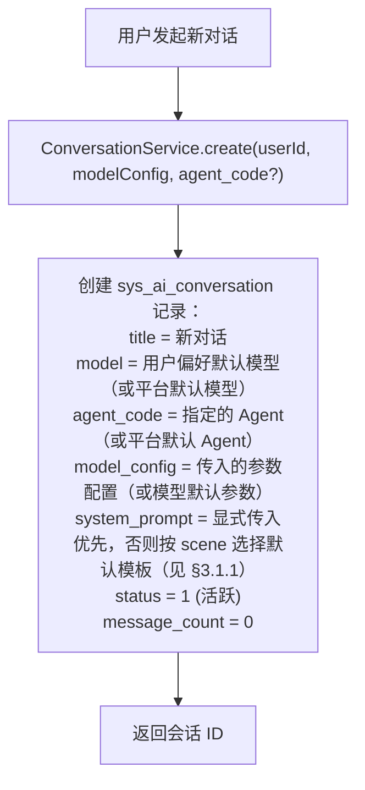
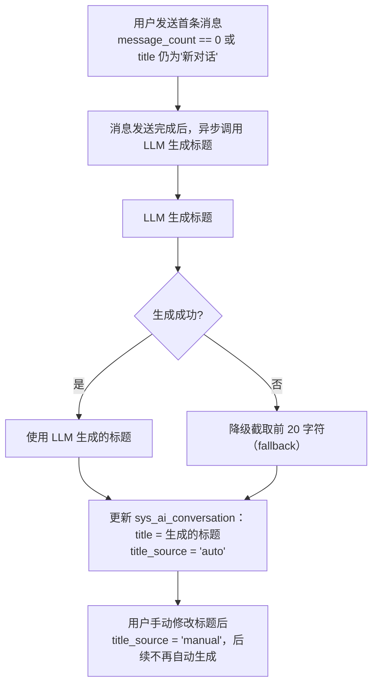
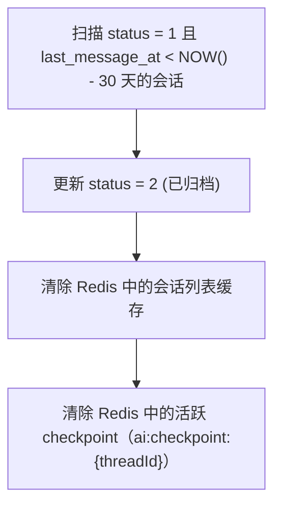

# AI 对话模块 - 后端实现设计（会话与消息）

## 1. 文档概述

本文档描述 F-M08-001 通用对话与会话管理的后端实现，包括会话生命周期管理（创建/列表/批量管理/归档/导出/删除）、消息发送与流式输出、类似问题推荐、分支对话、消息删除、多轮上下文维护。

### 1.1 设计思想

#### 设计动机

会话与消息是 AI 对话的基础设施，本功能域的根本矛盾是：**长连接的可靠性**与**对话的灵活性**之间的张力。

- **可靠性**：LLM 推理是秒级到分钟级的长时操作，期间网络可能抖动、客户端可能刷新、用户可能反悔。若流式输出一次性完成、失败即重来，体验将不可接受。
- **灵活性**：用户天然期望"重新生成""编辑重发"等类 ChatGPT 交互，这意味着对话不能是单向线性流，而必须支持分支。

本功能域的设计目标：**在不可靠的网络之上，提供可靠且灵活的多轮对话**。

#### 核心设计原则

| 原则 | 说明 |
|------|------|
| 网络不可靠假设 | 幂等键防重复提交、SSE 断线重连 + token 缓存、心跳保活、流式超时兜底，所有异常场景都有明确定义的降级路径（详见 §4.2/4.4/4.5） |
| 消息树而非线性列表 | 对话以 `parent_message_id` 组织成树，重新生成/编辑本质是"在树中插入新分支"，历史消息永不丢失（详见 §5） |
| 边流边持久化 | 消息以状态机演进（流式中→完成/失败/取消），token 边生成边写入 Redis 缓存，流式结束统一落库，兼顾实时推送与最终一致 |
| 会话是统一容器 | 模型、Agent、上下文、记忆、计费全部挂载在会话维度，消息只承担"内容记录"，降低耦合 |

#### 关键架构取舍

| 取舍点 | 方案对比 | 选择与理由 |
|--------|---------|-----------|
| 对话组织方式 | 线性消息列表 vs 消息树（parent_message_id） | 选消息树。线性列表无法表达分支；消息树让"重新生成""编辑重发"变为纯数据操作（插入新分支），且天然保留完整历史 |
| 消息列表存储 | 缓存加速读取 vs 实时查询数据库 | 选实时查询。消息是高频写入的流式数据，缓存一致性维护成本高于直接查询收益；用 ES 只索引标题+内容做全文检索，避免 MySQL JOIN 性能问题（详见 §3.3） |
| 流式落库时机 | 流式完成后一次性落库 vs 边流边写 | 选边流边写 Redis + 完成后落库。流中写 Redis 支撑断线重连（重放已生成 token），完成后写 MySQL 保证最终一致，兼顾体验与数据安全 |
| 幂等实现 | Redis 幂等键 vs 数据库唯一约束 | 选 Redis 幂等键。发送是高频操作，Redis 原子操作成本低且可区分 pending/完成/失败三种状态，配合 `Idempotency-Key` 请求头覆盖客户端双击、网络重试场景（详见 §4.2） |

#### 总体规划

会话是模块的"容器层"，向上承接用户交互，向下连接推理、上下文、计费：

```
用户交互（发送/重生成/编辑/停止）→ 本功能域（会话与消息）
                                      ↓ 触发
                              多步推理（ReasoningService）
                                      ↓ 读写
                          上下文管理（ContextManager/记忆/产物）
                                      ↓ 计量
                              计费集成（BillingIntegration）
```

本功能域不关心 LLM 如何推理，只保证"消息正确进入推理、推理结果可靠回流到用户"。

---

## 2. 数据模型

本功能域涉及两张核心表，表结构详见 [数据库设计 §4.7](../../../02-系统架构/03-数据库设计.md#47-ai-对话模块)：

| 实体 | 职责 | 服务层关键用途 |
|------|------|-------------|
| `sys_ai_conversation` | 对话会话（模型配置、摘要、API Key 绑定、分支指针） | 会话生命周期管理、上下文组装、多模态视觉读取日限额校验（Redis 全局日计数） |
| `sys_ai_message` | 对话消息（多角色、分支树、流式状态、Token 与积分计量、编辑原文保留） | 消息发送、分支对话、上下文回溯、计费记录 |

---

## 3. 会话生命周期管理

### 3.1 创建会话



#### 3.1.1 场景化提示词模板

`ConversationCreate.scene` 枚举值（默认 `general`）：`general`(通用对话)、`image_dispatch`(图像处理调度)、`multi_step`(多步推理)、`algorithm_recommend`(算法推荐)、`scheduled_task`(定时任务)。

- 请求显式传入 `systemPrompt` 时优先采用；否则按 `scene` 从 `scene_templates` 选择默认模板写入 `sys_ai_conversation.system_prompt`。
- 未知/空场景回退 `general` 模板。
- 场景语义已固化进 prompt 文本，`sys_ai_conversation` 无需加 scene 列。

### 3.2 标题自动生成

首条用户消息发送后，异步用 LLM 生成标题（对齐 ChatGPT/Claude/Dify 做法）：



### 3.3 会话列表查询

列表通过 `status` 查询参数支持三态范围过滤：`0`=全部（不按状态过滤）、`1`=活跃（默认）、`2`=已归档。服务层将 `0` 归一为 `None`（repo/ES 均以 `None` 表示不过滤状态）。

| 查询场景 | 查询逻辑 |
|---------|---------|
| 活跃会话列表（默认，status=1） | 当前用户的未删除活跃会话，按置顶优先、最后消息时间倒序排列 |
| 全部会话（status=0） | 当前用户未删除会话（不限状态），按置顶优先、最后消息时间倒序排列 |
| 归档会话列表（status=2） | 当前用户的未删除已归档会话 |
| 搜索会话（标题匹配） | 当前用户未删除会话，按标题模糊匹配 |
| 搜索会话（全文检索） | ES 索引 `ai_conversation` 检索标题 + 消息内容聚合（异步同步，避免 MySQL JOIN 性能问题）；ES 按状态过滤并分页返回 id 列表，再由 MySQL 取数据、按置顶/时间排序 |
| 置顶会话 | 当前用户的置顶未删除会话 |
| 未读会话 | 当前用户未删除会话中，最后已读消息 ID 小于最后消息 ID 的会话 |

**ES 全文检索**：

| 配置 | 说明 |
|------|------|
| 索引名 | `ai_conversation` |
| 字段 | `id`、`user_id`、`title`、`message_contents`（消息内容聚合）、`last_message_at`、`status`、`deleted` |
| 同步策略 | 双路径：① 会话写操作（创建/改标题/归档恢复/软删恢复）由 Service 层登记 `db.info`，DBSessionMiddleware 在**事务提交成功后、响应发出前**执行同步（读模型只反映已提交数据；rollback 跳过；失败记 warning 不影响响应）；② 消息发送完成后由推理链路后台任务异步同步（更新 message_contents 和 last_message_at）。ES 为必选基础设施，检索无命中直接返回空页，不降级 MySQL |

### 3.4 自动归档

定时任务每日凌晨扫描：



### 3.5 软删除与恢复

- 删除会话：标记当前用户的会话为逻辑删除，同时写入 `delete_time`（软删时间），作为 30 天恢复窗口的判定依据
- 恢复会话：`POST /conversations/{id}/restore`，仅 `delete_time` 距今 ≤ 30 天内可恢复（撤销逻辑删除并清空 `delete_time`）；超期返回资源不存在
- 回收站：`GET /conversations/trash` 返回当前用户 `deleted=1` 且未超 30 天的会话，按 `delete_time` 倒序分页
- 物理清理：定时任务 `purgeDeletedConversations` 每日清理 `deleted=1 且 delete_time < NOW()-30天` 的记录，物理 DELETE 会话并级联物理删除其消息（sys_ai_message）
- 删除会话不级联删除关联的图像处理记录（sys_pred_log 等独立保留）

### 3.6 置顶数量限制

- 置顶会话上限 10 个；`PUT /conversations/{id}/pin` 时校验当前用户置顶数，达到上限返回 `A0501`；`PUT /conversations/{id}/unpin` 取消置顶
- 置顶会话按置顶时间倒序排列（`pinned_at` 字段，置顶时写 `pinned_at=now`，取消置顶清空），取消置顶后回到最后活跃时间排序
- 列表排序：置顶（`pinned_at` 倒序）优先在前，其余按 `last_message_at` 倒序

### 3.7 批量管理

批量操作接口 `POST /conversations/batch` 接收 `{action, ids, confirm}`，逐条复用单会话操作的业务校验（归属校验、状态校验），任一失败则整体回滚并返回首个错误：

```
批量归档：遍历 ids → 校验归属与状态 → 逐条 status=2（已归档）
批量恢复：遍历 ids → 撤销归档（status=1）
批量删除：校验二次确认标记 confirm=true → 逐条 deleted=1（软删除，写 delete_time）
```

### 3.8 会话导出

- 导出内容：会话标题 + 全部消息（沿 `current_branch_message_id` 回溯当前激活分支，仅导 user/assistant 的 content，推理过程与工具调用默认不导出）
- 格式：Markdown（默认，文件名 `conversation_{id}.md`）/ JSON（`format` 查询参数，文件名 `conversation_{id}.json`，结构 `{conversation, messages}`）
- 实现：读取 `sys_ai_message` 组装导出内容，用 `StreamingResponse` 流式写出文件，不占用对话流资源

### 3.9 已读与未读

- `PUT /conversations/{id}/read`：将 `last_read_message_id` 置为会话最后一条未删除消息 ID
- 列表返回 `unread_count`：`last_read_message_id` 之后的未删除消息数；未读时取消息总数。"超过99显示99+"为前端展示逻辑，后端返回实际数值

---

## 4. 消息发送与流式输出

### 4.1 消息发送流程

```
用户发送消息（请求头携带 Idempotency-Key）
    ↓
MessageService.send(conversationId, content, role=user, idempotencyKey)
    ↓
幂等性校验：
  - 检查 Redis: ai:msg:idempotent:{userId}:{idempotencyKey}
  - 命中 → 返回已有消息结果（防重复发送）
  - 未命中 → SET ai:msg:idempotent:{key} = pending, EX = 60
    ↓
校验：
  - 会话存在且属于当前用户
  - 会话状态为活跃（status=1）
  - 无进行中的流式输出（同会话并发限制）
  - 消息长度 ≤ 4000 字符
  - 配额校验（预校验日/月限额）
    ↓
创建 user 消息记录（status=2 已完成）
    ↓
更新会话 message_count + 1，last_message_at = NOW()，current_branch_message_id = user 消息 ID
    ↓
创建 assistant 消息记录（status=1 流式输出中）
    ↓
调用 ReasoningService 启动推理（按会话绑定的 agent_code 加载 Agent 配置）
    ↓
初始化 SSE 流式会话（StreamSession）：
  - 生成 streamSessionId（UUID）
  - 在 Redis 创建 token 缓存：ai:stream:{streamSessionId} = {tokens:[], done:false}
  - TTL = 5 分钟（支持断线重连窗口）
    ↓
通过 SSE 流式推送（每个事件带递增 id）：
  - message.start 事件（返回 messageId, streamSessionId）
  - content_block.start/delta/stop 事件
  - thought 事件（推理步骤）
  - interrupt 事件（中断）
  - ping 事件（心跳保活）
  - message.end 事件（含 stopReason, usage）
    ↓
每推送一个事件，同步写入 Redis token 缓存（支撑断线重连）
    ↓
流式结束后：
  - 标记 Redis token 缓存 done = true
  - 更新 assistant 消息 status=2，content/tokens/credits
  - 更新会话 current_branch_message_id = assistant 消息 ID
  - 更新幂等缓存为已完成（返回最终结果）
```

### 4.2 消息发送幂等性

消息发送会触发 LLM 调用与计费，副作用重、成本高，网络重试（用户双击、请求重发）若造成重复会产生双倍 Token 消耗与双倍扣费，故必须保证"同一逻辑请求只执行一次"。幂等键采用两阶段状态（pending/completed）：处理中的重复请求被明确拒绝，失败时清除键允许用同一 Key 重试：


```
客户端发送消息时携带 Idempotency-Key 请求头（UUID，客户端生成）
    ↓
服务端校验：
  - 检查 Redis: ai:msg:idempotent:{userId}:{idempotencyKey}
  - 命中且已完成 → 直接返回已有消息结果（幂等返回）
  - 命中且 pending → 返回 409 Conflict（正在处理中，请勿重复提交）
  - 未命中 → SET {key} = pending, EX = 流式超时 + 60（即 AI_MESSAGE_STREAM_TIMEOUT+60=180s，长推理不提前过期）
    ↓
消息处理完成后更新：
  - SET {key} = {messageId, status}, EX = 300（保留 5 分钟供重试查询）
    ↓
异常时清理：
  - 处理失败 → DEL {key}（允许客户端用相同 key 重试）
```

> pending TTL 对齐流式超时（120s）并留 60s 余量，避免长推理期间 pending 过期后同 key 重复提交造成二次落库。**409 冲突语义以业务码 `REPEAT_SUBMIT_ERROR`（A0002）表达，HTTP 载体为项目统一的 400**（异常体系统一 `BusinessException→HTTP 400`，不为此单一场景改全局映射）。`Idempotency-Key` 请求头在发送端点必传（缺失返回 422）；OpenAI/Claude 兼容协议端点由 SDK 自动生成 uuid，无幂等头，不在要求范围。

**幂等范围**：同一用户 + 同一 Idempotency-Key 视为同一次请求，无论调用多少次只产生一条消息和一次计费。

### 4.3 SSE 事件结构

SSE 事件类型与 data 结构属于 API 契约，详见 [API接口.md §2.2 SSE 事件类型](./API接口.md)。

服务端实现层面，每个事件通过 SSE 的 `id:` 字段携带递增序号，客户端断线重连时通过 `Last-Event-ID` 请求头携带最后收到的事件 ID，服务端据此重放后续事件（断线重连机制详见 §4.4）。

### 4.4 SSE 断流重连

网络抖动导致 SSE 连接断开时，支持从断点恢复，不丢失已生成的 token（对齐 ChatGPT/Claude 做法）：

**服务端 token 缓存**：

```
流式输出过程中，每个事件同步写入 Redis token 缓存：
  Key: ai:stream:{streamSessionId}
  Value: {tokens: [{id, event, data}, ...], done: false}
  TTL: 5 分钟（重连窗口）
```

**断线重连流程**：

```
客户端 SSE 连接断开
    ↓
浏览器自动重连（携带 Last-Event-ID 请求头 + streamSessionId 查询参数）
    ↓
服务端读取 Last-Event-ID 和 streamSessionId
    ↓
从 Redis 读取 token 缓存：ai:stream:{streamSessionId}
    ↓
缓存命中：
  - 找到 lastEventId + 1 的位置
  - 重放后续已缓存但未送达的事件（带原始 id）
  - 如果原流已完成（done=true）→ 重放剩余事件后发送 message.end 关闭
  - 如果原流未完成（done=false）→ 重放已缓存事件后，继续从 LLM 拉取新 token 推送

流被停止/取消且无活跃连接时，服务端向缓存追加标准终结事件 `message.end`（stopReason=`canceled`），重连客户端重放后走与正常完成一致的收尾逻辑而非挂起。
    ↓
缓存未命中（超过 5 分钟重连窗口）：
  - 返回 410 Gone（重连窗口已过期）
  - 客户端提示"连接已超时，请重新发送消息"
```

**客户端要求**：
- 携带 `Last-Event-ID` 请求头（浏览器 SSE 自动行为）
- 携带 `streamSessionId` 查询参数（从 message.start 事件获取）
- 最大重连次数限制（默认 3 次，防止重连风暴）
- 重连间隔 3 秒（SSE `retry:` 字段控制）

### 4.5 流式异常处理

| 异常场景 | 处理方式 |
|---------|---------|
| 用户点击"停止" | 调用消息停止端点，经 ReasoningService.stop 关闭 SSE 连接、停止 LLM 推理、清理该消息关联的中断点（`ai:interrupt:{conv_id}:{msg_id}`），消息标记为 status=4（已取消），已生成的 token 保留在消息 content 中 |
| 流式超时 | 120 秒无新 token 判定超时，关闭连接，标记 status=3（失败），error 记录超时信息 |
| 客户端断连（未重连） | SSE 检测到断连，token 缓存保留 5 分钟等待重连；超时未重连则停止 LLM 推理，消息标记为 status=4（已取消） |
| LLM 调用失败 | 推送 error 事件，关闭连接，标记 status=3（失败），error 记录错误信息 |

> error 事件推送后必须补 `message.end`（stopReason=`error`）收尾，保证客户端总能走统一的完成处理逻辑，不会因缺少终结事件而挂起。多实例部署需 sticky session（同一 stream_session 的活跃队列仅存在于单实例内存），断线重连仅重放 Redis 缓存，不做跨实例续流。

### 4.6 并发控制

同一会话同一时间只允许一个流式输出进行中：

```
发送消息前检查 Redis：ai:streaming:{conversationId}
    ↓
存在活跃连接 → 返回 A0500（会话并发流式冲突）
不存在 → SET ai:streaming:{conversationId} = streamSessionId, EX = 120
    ↓
流式结束后 DEL ai:streaming:{conversationId}
```

**中断挂起时的锁让渡**：推理触发中断（图暂停待确认）时，`ReasoningService.run` 检测到挂起中断点即主动 `release_lock`（幂等，即使流结束已释放也无副作用），将锁让渡给 resume 续流。挂起期间：
- 新发送/编辑/重新生成被挂起拦截，返回"会话有未完成的中断确认，请先确认或停止"（而非并发冲突）
- resume 重新获取锁并 SSE 续流；stop 清理中断点后锁路径恢复正常

### 4.7 类似问题推荐

回复完成后为引导追问，由 LLM 生成 2-3 条推荐问题，通过 SSE `suggestions` 事件推送（对齐 ChatGPT 回复末尾的"相关问题"交互）：

```
message.end 事件推送后（若会话设置开启推荐且该条回复非中断/取消）：
    ↓
异步调用 LLM 生成推荐问题（提示词限定：2-3 条、与当前回复相关、口语化追问）
    ↓
生成成功 → 推送 suggestions 事件 {questions: [{question}]}
生成失败/超时 → 静默跳过（不阻塞回复、不影响消息状态）
    ↓
推荐问题 Token 计入该条回复消耗（与回复同一条计费记录，不单独计费）
```

> 异步生成不阻塞主回复的 `message.end`；会话设置关闭推荐能力后跳过生成。推荐问题不持久化入库，仅随 SSE 推送。

实现要点（`app/service/ai/service/suggestion_service.py`）：
- 会话开关：`model_config.suggest_questions`（默认开启，关闭则跳过）
- LLM 生成走非流式短超时（10s），失败/超时静默返回 `None`，不阻塞主回复
- 触发点：`ReasoningService` 在 `message.end` 推送后异步触发（`asyncio.create_task`），仅新增这一处挂钩
- 计费联动：生成成功后把推荐问题 usage 累加进该 assistant 消息的 token 字段，并再次调用 `BillingService.settle(..., adjustment=True)`（按 message_id 定位原 chat 记录做差额退补），实现"与回复同一条计费记录、不单独计费"；补记路径跳过新增 consume 流水与异常检测，避免流水翻倍与误判

---

## 5. 分支对话

**设计依据**：对话以消息树组织（`parent_message_id` 链），"重新生成/编辑重发"都是"基于父消息插入新分支"的数据操作，天然保留完整历史、无需覆盖式修改，与 Claude/ChatGPT 的分支行为一致。

### 5.1 重新生成

用户对助手回复不满意，可重新生成：

```
用户点击"重新生成"（针对 messageId 的 assistant 消息，校验 deleted=0）
    ↓
查找该 assistant 消息的 parent_message_id（对应的 user 消息）
    ↓
创建新的 assistant 消息：
  - parent_message_id = 原 user 消息 ID
  - 与原 assistant 消息共享同一个 parent（形成兄弟分支）
  - status=1（流式输出中）、task_id=streamSessionId
    ↓
更新会话 current_branch_message_id = 新 assistant 消息 ID
    ↓
重新触发 ReasoningService 推理（复用消息发送的 SSE 触发链路，SSE 流式输出新回复）
    ↓
message.start 返回新 messageId/streamSessionId
```

> regenerate 为显式操作，不参与幂等；新 assistant 消息无新 user 消息，推理上下文由 ReasoningService 内部按 `current_branch_message_id` 分支链重建。

### 5.2 编辑重发

用户编辑已发送的用户消息，重新触发回复。原消息标记为"已编辑"并保留原文，支持前端展示编辑历史：

```
用户编辑 messageId 的 user 消息
    ↓
原消息标记为已编辑：
  - 保存原内容到 original_content 字段，置 edited 标记
  - content 保持不变（前端展示时用 original_content 显示"编辑前"，content 为当前内容）
    ↓
创建新的 user 消息：
  - content = 编辑后的内容
  - parent_message_id = 原 user 消息的 parent_message_id（保持上下文链）
    ↓
创建新的 assistant 消息（parent_message_id = 新 user 消息 ID）
    ↓
更新会话 current_branch_message_id = 新 assistant 消息 ID
    ↓
触发推理
```

> 前端展示：被编辑的消息显示"已编辑"标识，点击可查看编辑前的原文（original_content）。

### 5.3 分支消息查询

消息列表展示当前激活分支（`current_branch_message_id` 所在的消息链），用户可切换查看其他分支：

```
获取会话当前分支消息：
  - 从 current_branch_message_id 向前回溯 parent_message_id 链
  - 形成线性消息列表
    ↓
切换分支：
  - 用户选择某消息的另一分支
  - 更新 current_branch_message_id = 该分支末端消息 ID
  - 后续消息发送从新分支位置继续
    ↓
查看某消息的分支：
  - 查询 parent_message_id = 该消息 ID 的所有子消息
  - 按时间倒序展示分支
    ↓
查看分支切换器：
  - 对有多个子消息的节点，显示 < 2/3 > 切换器
  - 切换后更新 current_branch_message_id
```

> `current_branch_message_id` 确保用户切换到历史分支查看后，再次发消息从正确位置继续，而不是从最新消息继续。

### 5.4 消息删除

仅助手回复可删除（对齐 ChatGPT 的单条回复隐藏交互），软删除保留审计：

```
用户删除 assistant 消息（仅最后一条之外的任意助手消息可删）
    ↓
校验：消息归属当前用户、role=assistant、deleted=0
    ↓
标记 deleted=1（软删除，30 天内可恢复，物理清理随定时任务执行）
    ↓
删除后影响：
  - 消息列表不再展示该消息
  - 上下文组装过滤 deleted=1 消息（见 §6.1），不参与后续推理
  - 该消息的"重新生成"入口不再可用
  - 兄弟分支与其他消息不受影响
```

> 用户消息不提供删除（通过编辑重发调整）；删除助手消息不级联删除其关联的产物/记忆引用，仅隐藏消息本身。

### 5.5 中断恢复（resume）

推理中断（如算法推荐确认）后，通过专用端点恢复：

```
POST /api/v1/ai/messages/{msg_id}/resume
body: {confirm: bool, params?: {algorithmId?: int}}
    ↓
校验消息归属；读取消息关联中断点 ai:interrupt:{conv_id}:{msg_id}
（thread_id = f"{conversation_id}:{message_id}"，与 ReasoningService._thread_id 一致）
    ↓
组装 resume_data = {confirmed: confirm, ...params}
    ↓
后台任务调用 ReasoningService.resume：
  - type=confirm → handle_user_confirmation（提交正向反馈）
  - Command(resume=resume_data) 从图中断处继续
    ↓
SSE 续流（对齐算法推荐 handle_user_confirmation 的确认载荷）
```

---

## 6. 多轮上下文维护

### 6.1 上下文组装

每次推理前，ContextManager 组装发送给 LLM 的消息列表：

```
1. 系统消息：system_prompt（会话级）
    ↓
2. 长期记忆注入：从 MemoryService 检索用户偏好（详见上下文管理文档）
    ↓
3. 会话摘要：如果 summary 非空，作为 system 消息注入（"之前的对话摘要：..."）
    ↓
4. 最近消息：从 sys_ai_message 沿 `current_branch_message_id` 的 parent_message_id 链回溯
  - 过滤 deleted = 1 的消息，只取 user/assistant 且 content 非空
  - 分支切换后严格取当前激活分支链上的消息，其他分支消息不混入上下文
  - 链异常防护：成环自动截断、超长链上限 200 跳即停
  - 保留最近 N 轮（默认 20 条）原文（按时间正序）
    ↓
5. 当前用户消息：本次发送的 user 消息
```

### 6.2 增量指令处理

增量指令（如"再亮一点"）不被摘要压掉：

- 最近 N 轮原文始终保留，不参与摘要
- 摘要只压缩 N 轮之前的消息
- 任务状态（task 层）独立维护，记录上一次处理的算法和参数，LLM 可通过工具查询

---

## 7. 管理端会话审计

管理端会话审计为管理员提供全平台会话/消息的**只读查询与链路追踪**（F-M08-001 §2.1.9）：

| 能力 | 实现 |
|------|------|
| 会话审计列表 | 会话列表接口支持 `view=admin` 查询参数（需 `ai:conversation:audit`），返回全量用户会话（含用户、模型、消息数、Token 与积分消耗），支持按用户/时间/状态/关键词筛选 |
| 会话详情/消息浏览 | 会话详情/消息列表/消息详情接口对管理员开放任意用户数据访问（需 `ai:conversation:audit`），数据与用户视角同源（不另建审计副本） |
| AI 链路追踪 | 复用消息详情接口（含推理步骤、工具调用），管理员可下钻单条消息的完整推理链定位问题根因 |

**权限与只读约束**：

- 权限标识 `ai:conversation:audit`，普通用户越权返回 403（`A0301`）
- 审计视角只读：不提供会话/消息内容操作，与用户所有权边界分离
- 数据同源：复用现有会话/消息/推理步骤查询链路，仅放宽用户归属过滤并叠加管理权限校验

---

## 8. 模块间协作

### 8.1 与 AI 计费模块

| 集成点 | 说明 |
|--------|------|
| 发送前预校验 | 调用 BillingService.checkQuota(userId) 校验日/月限额 |
| 发送后扣减 | 调用 BillingService.record(userId, conversationId, messageId, tokenUsage) 记录并扣减 |
| 配额不足中断 | LLM interrupt 暂停，推送 interrupt 事件（type=quota），前端展示升级引导 |

### 8.2 与语音交互模块

| 集成点 | 说明 |
|--------|------|
| 语音输入 | 前端录音 → 调用语音模块 ASR → 转文本后调用消息发送接口 |
| 朗读消息 | 前端对助手回复调用语音模块 TTS 播报（点击开始/再次点击停止）；AI 对话侧无独立接口，不经过本功能域后端 |
| 语音播报 | 助手回复完成后，前端可调用语音模块 TTS → 播报回复内容 |

### 8.3 与文件管理模块

| 集成点 | 说明 |
|--------|------|
| 多模态输入 | 用户在消息中附带图片/文档（PDF/Word/Excel/PPT/MD）/音视频（MP4/MP3）等文件，前端先调用文件模块上传 → 获取 fileId → 随消息发送 |
| 结果展示 | 图像处理结果通过 artifact 引用，前端通过文件模块获取图片 URL |
