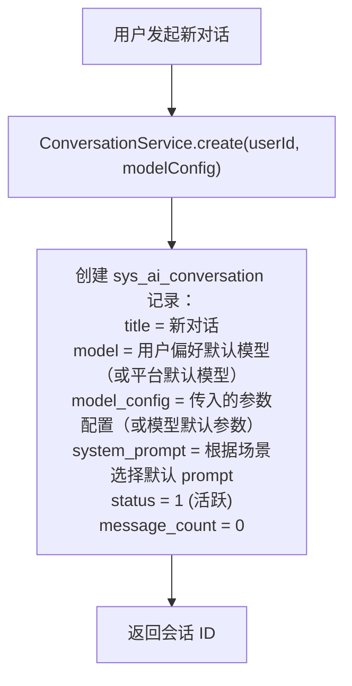
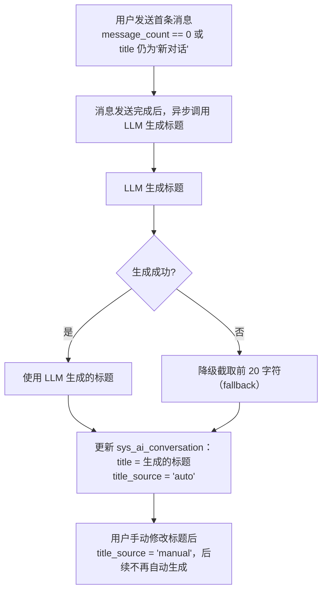
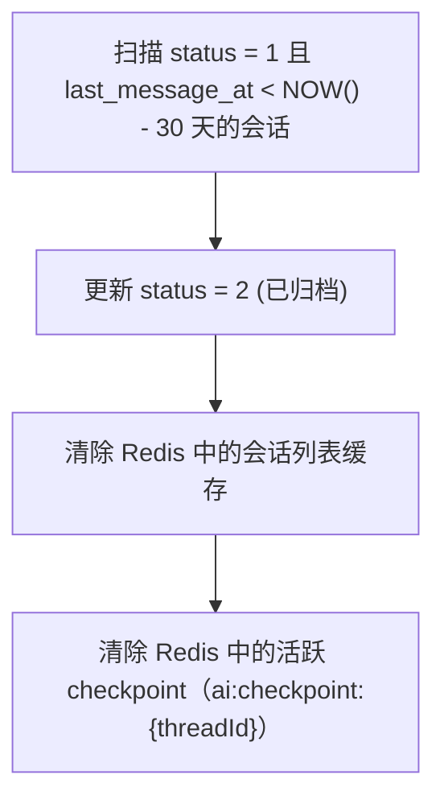

# AI 对话模块 - 后端实现设计（会话与消息）

## 1. 文档概述

本文档描述 F-M06-001 通用对话与会话管理的后端实现，包括会话生命周期管理、消息发送与流式输出、分支对话、多轮上下文维护。

### 1.1 相关文档

- **架构与公共**：[后端实现-架构与公共.md](./后端实现-架构与公共.md)
- **需求规格 §2.1**：[需求规格.md](./需求规格.md)
- **API 接口 §2.1/2.2**：[API接口.md](./API接口.md)

---

## 2. 数据模型

本功能域涉及两张核心表，表结构详见 [数据库设计 §4.7](../../../02-系统架构/03-数据库设计.md#47-ai-对话模块)：

| 实体 | 职责 | 服务层关键用途 |
|------|------|-------------|
| `sys_ai_conversation` | 对话会话（模型配置、摘要、API Key 绑定、分支指针、多模态读取计数） | 会话生命周期管理、上下文组装、多模态视觉读取限额校验 |
| `sys_ai_message` | 对话消息（多角色、分支树、流式状态、Token 与积分计量、编辑原文保留） | 消息发送、分支对话、上下文回溯、计费记录 |

---

## 3. 会话生命周期管理

### 3.1 创建会话



### 3.2 标题自动生成

首条用户消息发送后，异步用 LLM 生成标题（对齐 ChatGPT/Claude/Dify 做法）：



### 3.3 会话列表查询

| 查询场景 | 查询逻辑 |
|---------|---------|
| 活跃会话列表 | 当前用户的未删除活跃会话，按置顶优先、最后消息时间倒序排列 |
| 搜索会话（标题匹配） | 当前用户未删除会话，按标题模糊匹配 |
| 搜索会话（全文检索） | ES 索引 `ai_conversation` 检索标题 + 消息内容聚合（异步同步，避免 MySQL JOIN 性能问题） |
| 归档会话列表 | 当前用户的未删除已归档会话 |
| 置顶会话 | 当前用户的置顶未删除会话 |
| 未读会话 | 当前用户未删除会话中，最后已读消息 ID 小于最后消息 ID 的会话 |

**ES 全文检索**：

| 配置 | 说明 |
|------|------|
| 索引名 | `ai_conversation` |
| 字段 | `id`、`user_id`、`title`、`message_contents`（消息内容聚合）、`last_message_at`、`status`、`deleted` |
| 同步策略 | 消息发送后异步同步到 ES（只更新 message_contents 和 last_message_at）；ES 不可用时降级为 MySQL 标题模糊匹配 |

### 3.4 自动归档

定时任务每日凌晨扫描：



### 3.5 软删除与恢复

- 删除会话：标记当前用户的会话为逻辑删除
- 恢复会话：30 天内可恢复（撤销逻辑删除标记）
- 物理清理：定时任务清理逻辑删除超过 30 天的记录
- 删除会话不级联删除关联的图像处理记录（sys_pred_log 等独立保留）

---

## 4. 消息发送与流式输出

### 4.1 消息发送流程

```
用户发送消息（请求头携带 Idempotency-Key）
    ↓
MessageService.send(conversationId, content, role=user, idempotencyKey)
    ↓
幂等性校验：
  - 检查 Redis: ai:msg:idempotent:{userId}:{idempotencyKey}
  - 命中 → 返回已有消息结果（防重复发送）
  - 未命中 → SET ai:msg:idempotent:{key} = pending, EX = 60
    ↓
校验：
  - 会话存在且属于当前用户
  - 会话状态为活跃（status=1）
  - 无进行中的流式输出（同会话并发限制）
  - 消息长度 ≤ 4000 字符
  - 配额校验（预校验日/月限额）
    ↓
创建 user 消息记录（status=2 已完成）
    ↓
更新会话 message_count + 1，last_message_at = NOW()，current_branch_message_id = user 消息 ID
    ↓
创建 assistant 消息记录（status=1 流式输出中）
    ↓
调用 ReasoningService 启动 LangGraph Agent 推理
    ↓
初始化 SSE 流式会话（StreamSession）：
  - 生成 streamSessionId（UUID）
  - 在 Redis 创建 token 缓存：ai:stream:{streamSessionId} = {tokens:[], done:false}
  - TTL = 5 分钟（支持断线重连窗口）
    ↓
通过 SSE 流式推送（每个事件带递增 id）：
  - message.start 事件（返回 messageId, streamSessionId）
  - content_block.start/delta/stop 事件
  - thought 事件（推理步骤）
  - interrupt 事件（中断）
  - ping 事件（心跳保活）
  - message.end 事件（含 stopReason, usage）
    ↓
每推送一个事件，同步写入 Redis token 缓存（支撑断线重连）
    ↓
流式结束后：
  - 标记 Redis token 缓存 done = true
  - 更新 assistant 消息 status=2，content/tokens/credits
  - 更新会话 current_branch_message_id = assistant 消息 ID
  - 更新幂等缓存为已完成（返回最终结果）
```

### 4.2 消息发送幂等性

防止网络抖动导致的重复发送（用户快速点击两次"发送"产生两条相同消息+两次 LLM 调用+两次计费）：

```
客户端发送消息时携带 Idempotency-Key 请求头（UUID，客户端生成）
    ↓
服务端校验：
  - 检查 Redis: ai:msg:idempotent:{userId}:{idempotencyKey}
  - 命中且已完成 → 直接返回已有消息结果（幂等返回）
  - 命中且 pending → 返回 409 Conflict（正在处理中，请勿重复提交）
  - 未命中 → SET {key} = pending, EX = 60
    ↓
消息处理完成后更新：
  - SET {key} = {messageId, status}, EX = 300（保留 5 分钟供重试查询）
    ↓
异常时清理：
  - 处理失败 → DEL {key}（允许客户端用相同 key 重试）
```

**幂等范围**：同一用户 + 同一 Idempotency-Key 视为同一次请求，无论调用多少次只产生一条消息和一次计费。

### 4.3 SSE 事件结构

SSE 事件类型与 data 结构属于 API 契约，详见 [API接口.md §2.2 SSE 事件类型](./API接口.md)。

服务端实现层面，每个事件通过 SSE 的 `id:` 字段携带递增序号，客户端断线重连时通过 `Last-Event-ID` 请求头携带最后收到的事件 ID，服务端据此重放后续事件（断线重连机制详见 §4.4）。

### 4.4 SSE 断流重连

网络抖动导致 SSE 连接断开时，支持从断点恢复，不丢失已生成的 token（对齐 ChatGPT/Claude 做法）：

**服务端 token 缓存**：

```
流式输出过程中，每个事件同步写入 Redis token 缓存：
  Key: ai:stream:{streamSessionId}
  Value: {tokens: [{id, event, data}, ...], done: false}
  TTL: 5 分钟（重连窗口）
```

**断线重连流程**：

```
客户端 SSE 连接断开
    ↓
浏览器自动重连（携带 Last-Event-ID 请求头 + streamSessionId 查询参数）
    ↓
服务端读取 Last-Event-ID 和 streamSessionId
    ↓
从 Redis 读取 token 缓存：ai:stream:{streamSessionId}
    ↓
缓存命中：
  - 找到 lastEventId + 1 的位置
  - 重放后续已缓存但未送达的事件（带原始 id）
  - 如果原流已完成（done=true）→ 重放剩余事件后发送 message.end 关闭
  - 如果原流未完成（done=false）→ 重放已缓存事件后，继续从 LLM 拉取新 token 推送
    ↓
缓存未命中（超过 5 分钟重连窗口）：
  - 返回 410 Gone（重连窗口已过期）
  - 客户端提示"连接已超时，请重新发送消息"
```

**客户端要求**：
- 携带 `Last-Event-ID` 请求头（浏览器 SSE 自动行为）
- 携带 `streamSessionId` 查询参数（从 message.start 事件获取）
- 最大重连次数限制（默认 3 次，防止重连风暴）
- 重连间隔 3 秒（SSE `retry:` 字段控制）

### 4.5 流式异常处理

| 异常场景 | 处理方式 |
|---------|---------|
| 用户点击"停止" | 调用 `/messages/{id}/stop`，立即关闭 SSE 连接，停止 LLM 推理，消息标记为 status=4（已取消），已生成的 token 保留在消息 content 中 |
| 流式超时 | 120 秒无新 token 判定超时，关闭连接，标记 status=3（失败），error 记录超时信息 |
| 客户端断连（未重连） | SSE 检测到断连，token 缓存保留 5 分钟等待重连；超时未重连则停止 LLM 推理，消息标记为 status=4（已取消） |
| LLM 调用失败 | 推送 error 事件，关闭连接，标记 status=3（失败），error 记录错误信息 |

### 4.6 并发控制

同一会话同一时间只允许一个流式输出进行中：

```
发送消息前检查 Redis：ai:streaming:{conversationId}
    ↓
存在活跃连接 → 返回 A0500（会话并发流式冲突）
不存在 → SET ai:streaming:{conversationId} = streamSessionId, EX = 120
    ↓
流式结束后 DEL ai:streaming:{conversationId}
```

---

## 5. 分支对话

### 5.1 重新生成

用户对助手回复不满意，可重新生成：

```
用户点击"重新生成"（针对 messageId 的 assistant 消息）
    ↓
查找该 assistant 消息的 parent_message_id（对应的 user 消息）
    ↓
创建新的 assistant 消息：
  - parent_message_id = 原 user 消息 ID
  - 与原 assistant 消息共享同一个 parent（形成兄弟分支）
    ↓
重新触发 ReasoningService 推理
    ↓
SSE 流式输出新回复
```

### 5.2 编辑重发

用户编辑已发送的用户消息，重新触发回复。原消息标记为"已编辑"并保留原文，支持前端展示编辑历史：

```
用户编辑 messageId 的 user 消息
    ↓
原消息标记为已编辑：
  - 保存原内容到 original_content 字段，置 edited 标记
  - content 保持不变（前端展示时用 original_content 显示"编辑前"，content 为当前内容）
    ↓
创建新的 user 消息：
  - content = 编辑后的内容
  - parent_message_id = 原 user 消息的 parent_message_id（保持上下文链）
    ↓
创建新的 assistant 消息（parent_message_id = 新 user 消息 ID）
    ↓
更新会话 current_branch_message_id = 新 assistant 消息 ID
    ↓
触发推理
```

> 前端展示：被编辑的消息显示"已编辑"标识，点击可查看编辑前的原文（original_content）。

### 5.3 分支消息查询

消息列表展示当前激活分支（`current_branch_message_id` 所在的消息链），用户可切换查看其他分支：

```
获取会话当前分支消息：
  - 从 current_branch_message_id 向前回溯 parent_message_id 链
  - 形成线性消息列表
    ↓
切换分支：
  - 用户选择某消息的另一分支
  - 更新 current_branch_message_id = 该分支末端消息 ID
  - 后续消息发送从新分支位置继续
    ↓
查看某消息的分支：
  - 查询 parent_message_id = 该消息 ID 的所有子消息
  - 按时间倒序展示分支
    ↓
查看分支切换器：
  - 对有多个子消息的节点，显示 < 2/3 > 切换器
  - 切换后更新 current_branch_message_id
```

> `current_branch_message_id` 确保用户切换到历史分支查看后，再次发消息从正确位置继续，而不是从最新消息继续。

---

## 6. 多轮上下文维护

### 6.1 上下文组装

每次推理前，ContextManager 组装发送给 LLM 的消息列表：

```
1. 系统消息：system_prompt（会话级）
    ↓
2. 长期记忆注入：从 MemoryService 检索用户偏好（详见上下文管理文档）
    ↓
3. 会话摘要：如果 summary 非空，作为 system 消息注入（"之前的对话摘要：..."）
    ↓
4. 最近消息：从 sys_ai_message 查询最近 N 轮消息（主分支链）
  - 过滤 deleted = 1 的消息
  - 按 parent_message_id 链回溯
  - 保留最近 N 轮（默认 10 轮）原文
    ↓
5. 当前用户消息：本次发送的 user 消息
```

### 6.2 增量指令处理

增量指令（如"再亮一点"）不被摘要压掉：

- 最近 N 轮原文始终保留，不参与摘要
- 摘要只压缩 N 轮之前的消息
- 任务状态（task 层）独立维护，记录上一次处理的算法和参数，LLM 可通过工具查询

---

## 7. 模块间协作

### 7.1 与 AI 计费模块

| 集成点 | 说明 |
|--------|------|
| 发送前预校验 | 调用 BillingService.checkQuota(userId) 校验日/月限额 |
| 发送后扣减 | 调用 BillingService.record(userId, conversationId, messageId, tokenUsage) 记录并扣减 |
| 配额不足中断 | LLM interrupt 暂停，推送 interrupt 事件（type=quota），前端展示升级引导 |

### 7.2 与语音交互模块

| 集成点 | 说明 |
|--------|------|
| 语音输入 | 前端录音 → 调用语音模块 ASR → 转文本后调用消息发送接口 |
| 语音播报 | 助手回复完成后，前端可调用语音模块 TTS → 播报回复内容 |

### 7.3 与文件管理模块

| 集成点 | 说明 |
|--------|------|
| 多模态输入 | 用户在消息中附带图片/文档（PDF/Word/Excel/PPT/MD）/音视频（MP4/MP3）等文件，前端先调用文件模块上传 → 获取 fileId → 随消息发送 |
| 结果展示 | 图像处理结果通过 artifact 引用，前端通过文件模块获取图片 URL |
