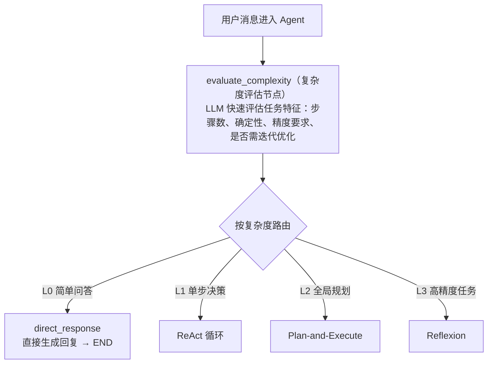
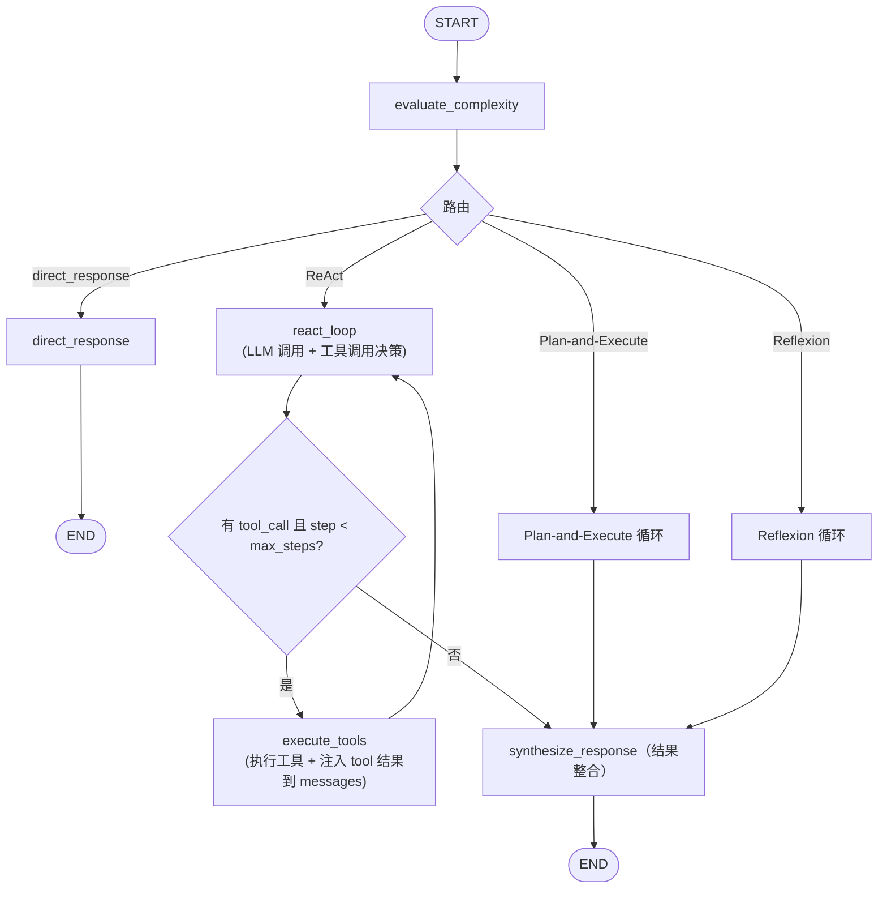
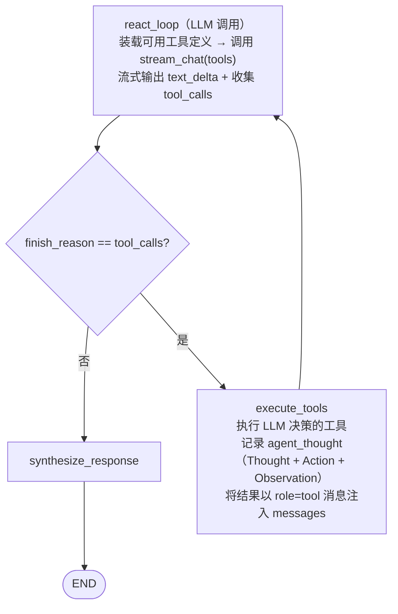
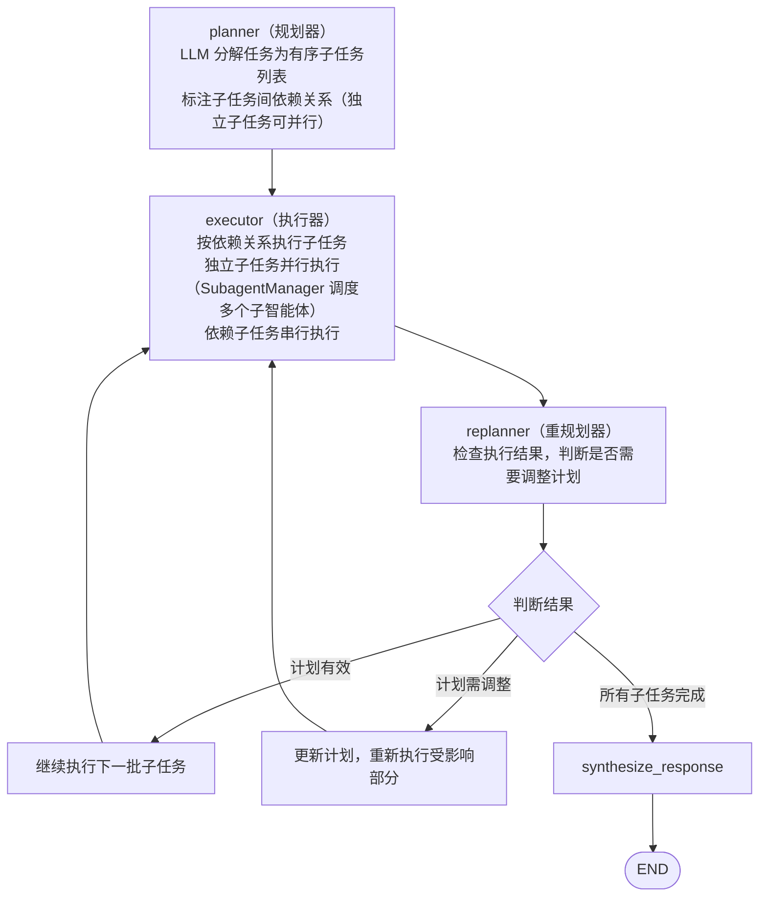
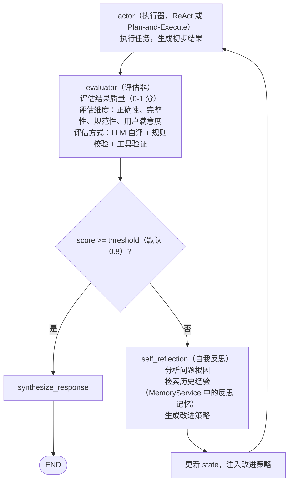
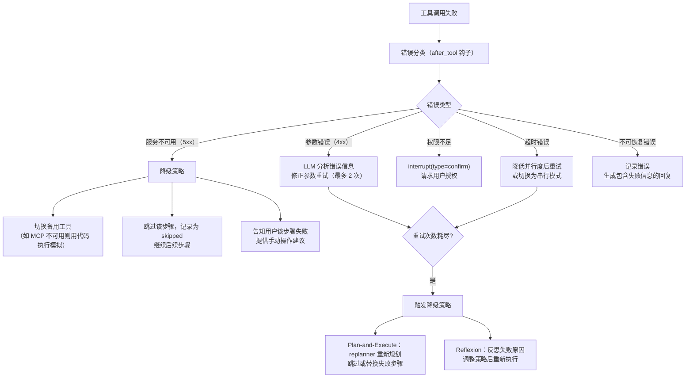

# AI 对话模块 - 后端实现设计（多步推理）

## 1. 文档概述

本文档描述 F-M08-002 多步推理的后端实现，包括推理引擎架构（ReAct/Plan-and-Execute/Reflexion 三种范式）、推理过程记录（思考双流与两级展示）、任务计划展示与用户干预、检查点持久化、中断与恢复机制、错误透明告知、成本与安全控制、子智能体协作。

### 1.1 设计思想

#### 设计动机

多步推理是 AI 对话的"引擎层"，本功能域的根本矛盾是：**推理质量**与**推理成本（延迟/Token/积分）**之间的张力。

不同任务对推理方式的需求差异巨大："PSNR 是什么"一次调用即可，"把 10 张雾图去雾并评估"需要规划与批量执行，"生成符合规范的评估报告"需要迭代打磨。若所有任务都跑最重的推理流程，简单问答将被无谓消耗拖慢；若所有任务都只做单次调用，复杂任务将频繁出错返工。

本功能域的设计目标：**为任务匹配合适的推理方式，在质量与成本之间取得动态平衡，并保证整个推理过程可控、可恢复、可观测**。

#### 核心设计原则

| 原则 | 说明 |
|------|------|
| 复杂度感知 | 不为一律，按任务复杂度路由到不同推理范式（L0 直接/L1 ReAct/L2 规划/L3 反思），用两级评估（规则预判 + LLM 兜底）控制评估自身的成本（详见 §3.1） |
| 能力工具化 | 推理核心只负责"决策"，具体业务（去雾、评估、推荐）全部以工具形态接入。推理引擎与业务解耦，新增能力不改推理循环 |
| 护栏先行 | 推理步数、Token 预算、工具超时、重试次数四重护栏在推理前就位（详见 §6），防止长循环失控造成成本事故 |
| 全过程可观测 | 每个推理步骤（thought/tool/observation）独立落表并 SSE 推送，用户可看到"Agent 在想什么"，这是复杂 Agent 产品可用性的底线 |
| 任务可中断可恢复 | 基于 LangGraph interrupt，推理可在任意工具调用前暂停（用户确认/配额不足/异步等待），恢复时从检查点继续，不重复执行（详见 §8） |

#### 关键架构取舍

| 取舍点 | 方案对比 | 选择与理由 |
|--------|---------|-----------|
| 推理范式组织 | 单一范式（只用 ReAct）vs 多范式混合路由 | 选多范式。单一范式无法兼顾"简单快、复杂稳"；复杂度路由让简单任务零额外开销、复杂任务按需重流程。实现上多范式共享基础设施，成本可控（详见 §4.4 混合架构） |
| 子 Agent 能力 | 全自研 SubagentManager vs 复用 deepagents `task` 工具 | 选后者。deepagents 已实现独立上下文窗口、防递归、结果摘要返回等关键机制（自研约 2000+ 行）；dehaze 只需从数据库加载子 Agent 配置，让子 Agent 复用主 Agent 的完整能力（详见 §7.1） |
| 大体积结果传递 | 完整数据注入上下文 vs 引用化（ID + 摘要） | 选引用化。图片/指标报告等大体积数据塞入上下文会撑爆 Token 预算；只传引用 ID + 业务摘要，LLM 需要详情时通过工具拉取（详见[上下文管理 §6]）。子 Agent 同理：中间过程不回流，只回流最终摘要 |
| 推理循环实现 | 手动构建 react_loop/execute_tools vs deepagents 内部循环 | 选后者。deepagents 内置 ReAct 循环、工具执行、错误重试，dehaze 通过 Hooks 挂载横切逻辑，避免重复实现框架级能力 |

#### 总体规划

多步推理是"引擎层"，输入是上下文管理组装好的消息，输出是最终回复 + 推理过程记录：

```
输入（消息 + 上下文）→ 复杂度评估 → 范式路由
                                    ├─ L0 直接回复
                                    ├─ L1/L2/L3 推理循环（工具调度 + 子Agent）
                                    └─ 中断点（确认/配额/异步等待）⇄ 用户恢复
                ↓
        推理过程落表（agent_thought）→ SSE 推送 → 推理完成
```

推理循环本身不持有任何业务能力，全部通过工具调用委派；业务能力（推荐/批量/Skills/MCP）见[后端实现-能力扩展](./后端实现-能力扩展.md)与[后端实现-智能调度](./后端实现-智能调度.md)。

---

## 2. 数据模型

### 2.1 业务表

本功能域涉及一张业务表，表结构详见 [数据库设计 §4.7](../../../02-系统架构/03-数据库设计.md#47-ai-对话模块)：

| 实体 | 职责 | 服务层关键用途 |
|------|------|-------------|
| `sys_ai_agent_thought` | 推理过程（thought/tool/observation/步骤序号/耗时） | 推理步骤记录、SSE 推送、推理链路回溯 |

推理记录为只追加表，不使用逻辑删除，过期数据通过定时任务物理清理。

### 2.2 LangGraph 检查点持久化（框架管理，不纳入本系统 schema）

不自建 checkpoint 业务表，直接使用 LangGraph 官方 Saver 体系。deepagents 的 `create_deep_agent` 接收 `checkpointer` 参数，dehaze 现有的 `RedisSaver`（自定义，继承 `BaseCheckpointSaver`）直接传入。持久化表由 `MySQLCheckpointSaver`（自定义，继承 `BaseCheckpointSaver`）的 `setup()` 自动创建和管理，**不纳入本系统 `config/sql/schema/` 目录**，表结构以 LangGraph 官方 `PostgresSaver` 为准。业务层不直接读写这些表，全部通过 LangGraph 的 Checkpointer API 交互。详见 [后端实现-架构与公共 §4.3 检查点管理器](./后端实现-架构与公共.md#43-检查点管理器checkpointmanager)。

---

## 3. 推理引擎架构

### 3.1 复杂度感知与范式调度

不同任务适用不同推理范式，Agent 启动时先评估任务复杂度，自动选择最合适的推理模式：



| 复杂度等级 | 特征 | 推理范式 | 典型场景 |
|-----------|------|---------|---------|
| L0 简单 | 单步可完成，无需工具 | 直接生成 | "PSNR 是什么意思？" |
| L1 动态 | 步骤不确定，需实时观察调整 | ReAct | "帮这张图去雾并看看效果" |
| L2 规划 | 步骤可预见，多步骤任务 | Plan-and-Execute | "把这 10 张雾图都去雾并评估" |
| L3 精度 | 需高精度输出，可迭代优化 | Reflexion | "按标准流程生成评估报告，确保符合规范" |

> 复杂度评估在 `evaluate_complexity` 节点内完成，采用两级评估：规则预判（关键词/消息长度/是否含附件/工具调用意图）优先，规则无法判定时才调用 LLM 兜底评估，避免每次请求都调 LLM。评估结果存入 state 供后续节点使用。用户也可手动指定推理范式（如"请仔细分析"触发 Reflexion）。

### 3.2 LangGraph 图结构

ReAct 循环拆为 `react_loop`（LLM 调用 + 决策）与 `execute_tools`（工具执行 + 结果注入）两个节点，通过条件边串联形成 Thought → Action → Observation 循环：



三种循环共享基于 LLM Function Calling 的工具调度与检查点持久化，差异在于规划策略和反思机制。`react_loop` 通过 `llm_client.stream_chat(tools=...)` 传入可用工具定义，LLM 在流式响应中自主决定是否调用工具；`execute_tools` 执行工具后将结果以 `role=tool` 消息注入 `messages`，回到 `react_loop` 让 LLM 基于 observation 继续推理。

---

## 4. 推理范式详解

### 4.0 范式来源总览

三种范式均来源于大模型 Agent 领域的代表性学术工作（ReAct / Plan-and-Solve / Reflexion），各有明确的适用边界与已知局限，理解来源有助于工程化时正确选用、合理设参、预判失效场景。本系统的定位是"站在成熟范式上做工程化适配"，而非学术创新。

| 范式 | 来源 | 核心主张 | 对本系统工程的启示 |
|------|------|---------|-------------------|
| ReAct | Yao et al., *ReAct: Synergizing Reasoning and Acting in Language Models*（ICLR 2023） | 推理（Thought）与行动（Action/工具调用）交替协同，优于只推理或只行动 | 作为 L1 基座范式；Function Calling 原生支持 ReAct 循环 |
| Plan-and-Execute | Wang et al. *Plan-and-Solve Prompting*（2023）+ LangChain 工程化 | 先规划完整计划再执行，减少逐次决策的次数与累积误差 | 作为 L2 范式；规划与执行分离，支持并行与 replan |
| Reflexion | Shinn et al., *Reflexion: Language Agents with Verbal Reinforcement Learning*（NeurIPS 2023） | 把"评估-反思"显式化为独立环节，从失败中语言化学习（verbal RL） | 作为 L3 范式；评估（LLM 自评+规则校验+工具验证）与反思分离 |

> 工程化取舍：学术界有大量范式变体（Tree of Thoughts、Self-Refine、CoT-SC 等），本系统只选取在真实产品中被验证成熟、且与"工具调用型 Agent"（Function Calling）天然契合的三个范式；过深的理论变体（如 ToT 的树搜索）成本高、收益不确定，不纳入。

### 4.1 ReAct（边想边做）

**核心思想**：Thought → Action → Observation 循环，每步只决定下一步，适合步骤不确定需动态调整的任务。Thought 与 Action 由 LLM 通过 Function Calling 自主产出，无需硬编码关键词匹配。

**设计依据**：ReAct 是 Function Calling 天然匹配的范式——LLM 每步自主决定"想什么（Thought）+ 调什么工具（Action）"，工具结果作为 Observation 回流，无需额外框架（来源与边界见 §4.0）。



**适用场景**：实时问答、单步决策明确的任务、工具调用链较短（3-5 步内）。

**限制**：长任务效率低（串行）、缺乏全局规划、无法并行执行独立步骤。

#### 4.1.1 工具定义清单

推理引擎基于 deepagents，工具来源分为 deepagents 内置工具与 dehaze 业务工具两类，完整清单与装载策略见 [后端实现-能力扩展 §2 工具执行体系](./后端实现-能力扩展.md)。dehaze 业务工具通过 `DehazeToolsBuilder` 按 Agent 配置装载，与 deepagents 内置工具合并后传给 LLM；工具定义采用 OpenAI Function 定义格式，Anthropic 适配在 `DehazeChatModel` 内完成。

与推理循环直接相关的工具行为约定：

| 工具 | 推理侧行为约定 |
|------|--------------|
| `algorithm_recommend` | 推送 interrupt 事件，等待用户确认算法后 resume（协议见 §4.1.2） |
| `batch_process` | 通过 SSE 推送逐张处理进度 |
| `skill_load` | 加载完整指令后注入 system_prompt |
| `mcp_lookup_tool` / `mcp_execute_tool` | 按需发现并执行 MCP 工具，结果回传 LLM |
| `get_task_status` | 查询当前任务状态（来自 checkpoint state） |

**工具装载策略**：

- dehaze 业务工具通过 `DehazeToolsBuilder` 按 Agent 配置（Skills/MCP 命名空间）装载
- deepagents 内置工具默认全部可用，通过 `HarnessProfile.excluded_tools` 移除不需要的工具
- Skills 渐进式加载：启动时只加载名称和描述（几十 tokens），LLM 判断需要时通过 `skill_load` 加载完整指令
- MCP 工具按需发现：LLM 调用 `mcp_lookup_tool` 后，将查到的具体 MCP 工具展开为 `mcp_execute_tool` 的参数说明注入下一轮

#### 4.1.2 工具结果注入 messages

deepagents 内部执行工具后，按 OpenAI Function Calling 协议向 `state["messages"]` 追加 assistant 消息（携带 `tool_calls`）和 tool 消息（携带 `tool_call_id` + 结果摘要）。下一轮 LLM 调用时，LLM 看到 assistant 的 `tool_calls` 与 tool 角色的结果，基于 observation 继续推理或决定调用下一个工具。

**产物引用化**：工具返回大体积数据（图像、评估报告）时，通过 `ArtifactService` 注册产物，仅将引用 ID + 摘要作为 tool 消息内容回传给 LLM，避免上下文膨胀。详见 [后端实现-上下文管理 §产物引用化](./后端实现-上下文管理.md)。

**虚拟文件系统补充**：Agent 推理过程中产生的中间临时文件通过 deepagents 虚拟文件系统（`write_file`/`read_file`）暂存于 LangGraph State，会话内有效，不持久化。与 `ArtifactService`（持久化用户可见产物）互补。详见 [后端实现-智能体管理 §7.1 虚拟文件系统](./后端实现-智能体管理.md)。

**algorithm_recommend 的 interrupt 协议**：算法推荐工具执行后通过 deepagents `interrupt_on` 配置暂停 Agent，推送推荐算法卡片等待用户确认；用户在 `resume` 中携带选定的 `algorithm` 与 `params` 后，作为 tool 消息内容注入 messages 继续 ReAct 循环。详见 §8.1 中断类型。

### 4.2 Plan-and-Execute（先想后做）

**核心思想**：先由 Planner 生成完整计划，再由 Executor 按计划执行，支持并行和动态重规划。



**并行执行策略**：

```
Plan: [A, B(depends:A), C(独立), D(独立), E(depends:B,C)]
    ↓
批次1: 并行执行 [A, C, D]
    ↓
批次2: 执行 B（依赖 A）
    ↓
批次3: 执行 E（依赖 B, C）
    ↓
所有完成 → 结果整合
```

**适用场景**：步骤可预见的多步骤任务、可并行的批量处理、需要全局视角的复杂任务。

**优势**：全局规划避免局部最优、独立步骤并行提升效率、计划透明便于人工介入。

**设计依据**：先规划再执行把"想"和"做"分离，用一次较重的规划调用换取全局视图，减少逐次决策的次数与累积误差（来源与边界见 §4.0）。本系统的取舍：**规划（Planner）与重规划（Replanner）分离**——计划与执行不符时不重跑全计划，只重新规划受影响部分（replan），兼顾质量与成本。

#### 4.2.1 任务计划展示与用户干预

任务计划不仅是内部状态，也是用户可感知、可干预的协作对象（对齐需求规格 §2.2.6）。计划的结构化数据存入 checkpoint state，通过 SSE 推送与干预接口开放给用户：

```
Planner 生成计划 → 计划以结构化数据写入 state["plan"]
    ↓
SSE 推送 plan 事件（子任务列表 + 依赖关系 + 预计顺序 + 状态）
    ↓
执行前：用户可干预（查看/调整计划）
    ↓
执行中：每完成一个子任务更新 plan 状态并推送增量
    ↓
重规划：Replanner 修改计划 → 推送计划变更说明（"计划已调整：因 xxx 失败，改为 yyy"）
```

**计划数据结构**（`state["plan"]`，与 `agent_thought` 分开持久化）：

| 字段 | 说明 |
|------|------|
| `tasks[]` | 子任务列表：`{id, description, depends_on[], status, tool_hint}` |
| `status` | 计划整体状态：`pending`（待执行）/ `executing` / `completed` / `revised` |
| `revisions[]` | 计划修订记录：`{at, reason, change}`（用户干预或重规划均可产生） |

**用户干预接口**：

| 交互 | 实现 |
|------|------|
| 查看计划 | 计划随 `plan` SSE 事件推送 + 可从会话详情查询当前计划 |
| 调整计划 | 调用独立恢复端点 `POST /messages/{id}/resume`，携带 `plan_edit`（`{remove: [taskId], reorder: [...], add: {...}}`），执行前生效 |
| 中途改需求 | 用户发送新消息 → 推理引擎将新指令合并到当前 state，Replanner 修订剩余计划 |

**干预窗口规则**：计划生成后、执行开始前提供干预入口；执行开始后默认不允许整体修改计划（可中途改需求），避免执行中计划变更引发状态不一致。

### 4.3 Reflexion（反思迭代优化）

**核心思想**：在执行基础上增加反思循环，从错误中学习，迭代优化至达标。

**设计依据**：Reflexion 把"失败后如何改进"从隐式（换答案再试）变为显式——评估环节定位问题后生成语言化反思，注入下一轮执行（来源与边界见 §4.0）。本系统的取舍：Reflexion 在**有客观验证**的任务上效果显著，而开放式对话上收益不明且成本高，因此**不作为默认范式**，只通过复杂度评估（L3）在"高精度、可验证"的任务上启用，并用迭代上限与达标阈值控制成本。



**反思记忆**：反思结果存入 `sys_ai_memory`（source=reflection），后续执行类似任务时注入历史经验，避免重复犯错。

**迭代控制**：
- 最大迭代次数（默认 3 次），超过后接受当前最佳结果
- 每次迭代注入上一次的反思总结到 prompt
- 迭代不增加用户感知延迟（同一 SSE 流内完成）

**适用场景**：需高精度输出（代码生成/审查）、可明确定义成功标准、重复性任务可从历史学习。

### 4.4 混合架构

实际生产中三种范式可组合使用，采用分层架构：

| 层级 | 范式 | 职责 |
|------|------|------|
| 顶层 | Plan-and-Execute | 任务分解、全局规划 |
| 中层（标准子任务） | Plan-and-Execute | 稳定执行预定义步骤 |
| 中层（不确定子任务） | ReAct | 灵活应对动态环境 |
| 中层（高精度子任务） | Reflexion | 迭代优化至达标 |

Planner 分解子任务时，为每个子任务标注推荐的推理范式，Executor 按标注调度对应循环。

### 4.5 实现选型（deepagents 适配）

本系统基于 deepagents 图基座实现多范式，以下为实现选型说明（与设计目标对齐）：

**范式路由接线（P0）**：`reasoning_service.run` 在构建图前调用 `DeepAgentBuilder.resolve_reasoning_mode`
（读快照 `reasoning_mode`；`auto` 时经 `complexity_evaluator` 两级评估解析），结果写入图
`initial_state`（`reasoning_mode`/`max_steps` 字段）。`DehazeHooksMiddleware` 每 run 从
state 覆盖 ctx 的 `max_steps`（图按版本缓存复用，但步数上限需按运行时范式生效）。
`direct` 范式不构建完整 deepagents 图，走 `_run_direct` 单次 `DehazeChatModel` 直连
（无工具），获得真实的性能收益；`_needs_tool_call` 与路由共用会话锚定 Agent 的
`reasoning_mode` 判定，固定 `direct` 才跳过工具能力校验。计费与图路径对齐：推理前
`pre_charge` 预扣（欠费/配额/余额不足时以中断文案作为回复阻断，direct 无检查点可
恢复，配额阻断为终态提示）、推理后 `settle` 实扣结算（图路径经 before_agent/after_agent
钩子完成，direct 直接调用）。

**模型选型**：建图时以**会话模型覆盖 Agent 快照默认模型**（三级合并"会话覆盖"原则，
§智能体管理 4.2）。`reasoning_service.run` 将发送消息锚定的 `model_id` 传入
`_build_graph`，仅覆盖快照的 `model_id` 字段（提示词/工具/护栏仍随 Agent 版本快照），
图缓存键为 `(agent_id, version_no, model_id)`，同 Agent 不同会话模型各自建图；`direct`
路径直接以 `model_id` 单次直连，不涉及图缓存。

**范式编排中间件**：新增 `ParadigmMiddleware`（恒定装载进图，仅按运行时
`state.reasoning_mode` 分支，不破坏图缓存）。plan_execute / reflexion 在 `abefore_agent`
入口程序化编排，完成后经 `Command(goto="end")` 直接收尾（复用 Hooks 的计费结算与
`final_response` 提取）。

**Plan-and-Execute**（`paradigms/plan_execute.py` 纯逻辑 + middleware 编排）：
- Planner：LLM 分解为结构化 JSON 计划（`tasks[{id, description, depends_on, tool_hint, paradigm}]`），
  解析失败兜底为单任务 react 计划。
- 执行器：**子任务以自然语言指令委派给直接 LLM 调用**（`DehazeChatModel`），非 deepagents
  `task` 工具（后者不支持自动并行编排）。`compute_batches` 按依赖拓扑分批，批内
  `asyncio.gather` + `max_parallel` 信号量并行；`paradigm=reflexion` 的子任务内嵌
  evaluator 迭代（§4.4 混合架构）。
- 计划确认/干预：Planner 生成计划后经 `plan_approve` 中断等待用户 `resume`（SSE 推
  `plan` 事件 + `interrupt`）；resume 透传 `plan_edit`（`MessageResume.plan_edit`），
  middleware 合并干预（remove/reorder/add）并做干预窗口校验（`plan.status=pending/revised`
  才允许整体调整）。
- Replanner：子任务失败时只重规划受影响部分（`plan.revisions` 追加修订记录），不重跑全计划。
- 配额：批次派发前 `quota_recall.precharge_batch` 预扣，失败整批降级；执行中
  `check_and_recall` 召回未启动子任务（详见 §7.2）。

**Reflexion**（`paradigms/reflexion.py`）：evaluator 执行后 LLM 自评 0-1 分 + 期望格式
规则兜底压分；score < `reflexion_threshold` 时 `reflect_failure` 分析根因生成改进策略，
注入下一轮 prompt；迭代上限 `max_iterations_reflexion` 超限接受当前最佳。反思结果经
`build_reflection_memory` 写入 `sys_ai_memory`（source=reflection），由 memory_injection
检索注入实现"同任务再执行时复用历史反思经验"。

**SSE 事件**：middleware 经图 custom 通道推送 `{type: plan|thought}` 载荷，
`SseEventConverter._handle_custom` 识别后经公开接口 `record_plan`/`record_thought` 落库并
推送 `plan`/`thought` SSE（不改 converter 内部 thinking/thought 增强）。

---

## 5. 推理过程记录

每种范式的执行步骤都记录到 `sys_ai_agent_thought`，通过 SSE 推送给前端：

### 5.1 ReAct 记录

每个 Thought-Action-Observation 循环在 `execute_tools` 节点中记录一条 agent_thought：

- `thought` = LLM 的思考文本（`react_loop` 中 `text_delta` 累积的内容，说明为什么选这个工具）
- `tool` = 工具名称（来自 `tool_call_complete` 的 `tool_call_name`）
- `tool_input` = 工具参数（来自 `tool_call_complete` 的完整 `arguments` JSON）
- `observation` = 工具返回摘要（大体积结果通过 `ArtifactService` 引用化，仅记录摘要）

### 5.2 Plan-and-Execute 记录

| 记录点 | thought 内容 | tool | observation |
|--------|-------------|------|-------------|
| 规划阶段 | "分解任务为 N 个子任务" | `planner` | 子任务列表 |
| 执行阶段 | "执行子任务 X" | 实际工具 | 工具返回 |
| 重规划阶段 | "子任务 X 失败，调整计划" | `replanner` | 更新后的计划 |

并行执行的子任务，position 相同（同批次），通过 metadata 标注 batch 序号。

### 5.3 Reflexion 记录

| 记录点 | thought 内容 | tool | observation |
|--------|-------------|------|-------------|
| 执行阶段 | 同 ReAct/Plan-and-Execute | 实际工具 | 工具返回 |
| 评估阶段 | "评估结果质量" | `evaluator` | 评分 + 反馈 |
| 反思阶段 | "分析问题根因，改进策略" | `self_reflection` | 改进策略 |

### 5.4 思考双流与两级展示

推理过程展示采用"思考与正式回复双流分离 + 两级展示"（对齐需求规格 §2.2.5）：

**思考双流分离**：

| 流 | 数据载体 | 持久化 | UI 行为 |
|----|---------|--------|---------|
| 思考流（thinking） | SSE `content_block` type=`thinking` + `thought` 事件 | `sys_ai_agent_thought` 的 `thought` 字段 | 默认折叠，标注"模型思考过程，非最终结论"，不参与复制/引用/朗读 |
| 正式回复流（text） | SSE `content_block` type=`text` | 消息 `content` 字段 | 完整展示，为主操作对象 |

- 思考流与正式回复流按模型真实输出时间序推送，**不做"思考在前、回复在后"的强行重排**
- 思考 Token 计入该条回复的 `usage`（`outputTokens` 含 thinking 部分），前端呈现消耗时包含思考 Token

**两级展示数据供给**：

| 展示层级 | 数据来源 | 前端渲染 |
|---------|---------|---------|
| 一级：步骤摘要 | 从 `agent_thought` 聚合（每步一句话：做了什么 + 结果如何） | 默认展开的步骤列表 |
| 二级：完整推理链 | `agent_thought` 全文 + `thought` 事件详情（思考内容/工具调用/反思记录） | 默认折叠，展开查看 |

> `agent_thought` 记录与 SSE 推送机制保持不变（§5.1-5.3），两级展示是前端对同一数据的两种聚合视图；步骤摘要可由 LLM 对 thought 生成一句概括（在 `synthesize_response` 阶段异步生成，不阻塞主回复）。

---

## 6. 成本与安全控制

### 6.1 推理步数限制

```
每步推理前检查当前 step 数（before_model 钩子）
    ↓
step >= max_steps → 强制终止
  - ReAct: max_steps=20
  - Plan-and-Execute: max_steps=30（含规划步）
  - Reflexion: max_steps=15（单次迭代内）× max_iterations=3
    ↓
生成回复："已达到最大推理步数限制，请简化需求或分多次对话"
```

### 6.2 Token 预算控制

```
每步推理后累计 Token 消耗（after_model 钩子）
    ↓
累计 >= token_budget → interrupt(type=quota)
    ↓
复杂度评估消耗的 token 也计入预算
```

### 6.3 工具调用安全控制

| 控制项 | 说明 | 实现位置 |
|--------|------|---------|
| 工具白名单 | Agent 只能调用 `react_loop` 装载的工具定义（内置工具 + Skill + MCP），LLM 无法越权调用未注册工具 | `react_loop` 工具装载 + `LlmClient` 透传 `tools` 参数 |
| 危险操作拦截 | 删除文件、执行危险命令前需用户确认 | `before_tool` 钩子 → interrupt |
| 参数校验 | 工具参数 schema 校验（LLM 输出的 `arguments` 必须符合 JSON Schema） | `execute_tools` 节点解析 `arguments` 前校验 |
| 超时控制 | 单工具调用超时（默认 60s） | `execute_tools` 节点 + `McpGatewayClient` 超时配置 |
| MCP 工具范围 | MCP 网关本身的工具白名单由后端 OpenAPI 文档决定，AI 对话只暴露 3 个元 tool | `McpGatewayClient` |
| 路径白名单 | 文件操作限制在用户目录内 | MCP 网关侧文件工具实现（如有） |

### 6.4 错误恢复策略

工具调用失败时按错误类型执行系统化恢复策略：



#### 6.4.1 错误透明告知

推理中的失败与降级对用户可见可解释，不静默吞错（对齐需求规格 §2.2.8）。错误透明依托现有事件体系实现，不新增事件类型：

| 场景 | 实现方式 |
|------|---------|
| 工具调用失败 | `thought` 事件 `status=error` 携带失败原因；前端在推理链中展示失败原因与 Agent 的应对（重试/换工具/跳过） |
| 步骤降级 | 降级发生时推送 `thought` 事件（thought 内容含降级说明，如"切换为串行模式"）；前端展示降级原因 |
| 整体失败 | `error` 事件携带失败原因 + 下一步建议（重新生成/简化需求重试）；消息标记失败 |
| 部分完成 | 配额中断（§6.2）时，已生成部分以摘要形式随消息返回，并在回复中说明未完成部分及原因 |

**失败原因信息源**：`after_tool` 钩子错误分类结果（§6.4）写入 `agent_thought` 的 `observation`（工具返回原文）与 `error`（失败原因）、`status`（1成功/2失败/3跳过），SSE 推送时随 `thought` 事件（含 `error`/`status` 字段）透出；整体失败原因由 `after_agent` 钩子汇总错误信息生成。

### 6.5 自我评估质量保障

Reflexion 范式和关键节点的质量评估：

| 评估方式 | 适用场景 | 说明 |
|---------|---------|------|
| LLM 自评 | 通用任务 | LLM 对照要求自评结果质量（0-1 分） |
| 规则校验 | 结构化输出 | 正则/JSON schema 校验输出格式 |
| 工具验证 | 可执行结果 | 代码执行验证逻辑正确性、指标计算验证数值合理性 |
| 用户反馈 | 主观任务 | 用户点赞/点踩作为质量信号，反馈到记忆系统 |

---

## 7. 子智能体与多智能体协作

### 7.1 子智能体调度

主 Agent 通过 deepagents 内置的 `task` 工具将子任务委派给专用子智能体。子 Agent 配置存储在 `sys_ai_agent` 表中，关联关系通过 `sys_ai_agent_subagent` 表管理：

```
主 Agent 决定委派子任务
    ↓
deepagents SubAgentMiddleware 接收 task 工具调用
    ↓
从数据库加载子 Agent 配置（独立的 System Prompt / 工具集 / 模型 / 推理参数）
    ↓
创建子 Agent 实例（独立上下文窗口，与主 Agent 隔离）
    ↓
子 Agent 执行子任务（可用 ReAct/Plan-and-Execute/Reflexion）
    ↓
返回最终结果摘要给主 Agent
    ↓
主 Agent 收到结果，继续后续推理
```

**关键特性**（deepagents 内置）：
- 子 Agent 有独立上下文窗口，中间工具调用不污染主 Agent，仅返回最终结果摘要
- 子 Agent 使用自己的系统提示词、工具集、模型配置（从 `sys_ai_agent` 加载，不继承父 Agent）
- 子 Agent 不能再调用 `task` 工具（防递归）
- 子 Agent 的消耗归集到主会话配额，不单独开账户

### 7.2 并行执行

Plan-and-Execute 的独立子任务可并行执行，通过 deepagents 动态子代理（Dynamic Subagents）机制实现：

```
Planner 识别可并行的独立子任务 [A, B, C]
    ↓
deepagents 在代码解释器中通过循环/分支/并行批处理分发
    ↓
多个子 Agent 并行执行（各自独立的推理循环）
    ↓
全部完成后汇总结果
    ↓
并行度控制：max_parallel（默认 5），超过则排队等待
```

**配额召回机制**（对齐需求规格 §2.2.7 滚动预算校验）：

子智能体派发前主 Agent 向计费管理校验剩余配额并预扣本步预估消耗。并行执行过程中配额不足时，按以下策略处理：

| 场景 | 处理方式 |
|------|---------|
| 未启动的子智能体 | 主 Agent 召回，不执行 |
| 已完成的子智能体 | 结果保留，参与最终汇总 |
| 正在执行的子智能体 | 等待当前步骤完成后停止 |
| 前端提示 | 推送提示"部分子任务因配额不足未执行" |

**实现说明**（`app/service/ai/strategies/quota_recall.py`，`QuotaRecall` 单例 `quota_recall`，由 `_PlanExecutor` 集成调用）：

```python
class QuotaRecall:
    async def precharge_batch(self, ctx: dict, batch_size: int) -> bool  # 预扣失败返回 False
    async def check_and_recall(self, ctx, running: list, pending: list) -> list  # 返回被召回的 pending
```

- `precharge_batch`：派发前按子任务数预估（`EstimateService.estimate_step_credits`）预扣，
  `QuotaService.pre_deduct` 扣减配额 + 扣减 `billing_context.remaining_budget`；无计费上下文
  （非 AI 计费）时放行。预算不足返回 False，调用方整批降级（标记 failed +"配额不足，本批未执行"）。
- `check_and_recall`：`ctx.token_used >= ctx.token_budget` 或 `billing_context.remaining_budget <= 0`
  判定配额不足 → 召回全部未启动 pending（调用方取消并记 skipped），running 等待当前步完成，
  已完成保留；自行推送 `thought` 事件 `status=3`（"部分子任务因配额不足未执行"）。

子智能体消耗归集到主会话配额，不单独开账户。主会话计费明细按子智能体维度分项展示（子智能体名称 + Token 数 + 积分），与主 Agent 消耗汇总为会话总消耗。

### 7.3 Agent 团队协作

复杂任务可组建 Agent 团队（`is_team=true`），通过 `langgraph-supervisor` 编排多个 deep agent 实例协作完成。Team 成员关系通过 `sys_ai_agent_subagent` 关联表定义：

| 角色 | 职责 | 示例 |
|------|------|------|
| Orchestrator（Team Lead） | 任务分解、结果汇总、最终回复 | "分析这批图片的去雾效果" |
| Specialist（专家 Agent） | 专注特定领域子任务 | 图像分析 Agent、指标评估 Agent、报告生成 Agent |
| Reviewer（审查 Agent） | 质量审查、结果校验 | Reflexion 中的 Evaluator 角色 |

Team 成员异步并行执行，通过 Supervisor 中转通信，成员之间不直接通信，避免耦合。详见 [后端实现-智能体管理 §6 Team 团队协作](./后端实现-智能体管理.md)。

---

## 8. 中断与恢复

### 8.1 中断类型

| 中断类型 | 触发场景 | interrupt 数据 | 恢复方式 |
|---------|---------|---------------|---------|
| `confirm` | LLM 推荐算法后需用户确认 / 危险操作需确认 | 推荐算法/参数 或 危险操作详情 | 用户确认或修改后 resume |
| `quota` | 配额不足 | 已用配额、限额、升级提示 | 用户升级 VIP 后 resume |
| `async_wait` | 异步任务（图像处理）提交后等待 | task_id、任务类型、预计耗时 | 任务完成后自动 resume |

**quota 中断实现说明**：配额校验收敛于 `DehazeHooksMiddleware.awrap_model_call`（模型步级，图内），
不再文案短路。预扣阻断（`precharge_blocked` 的 `stop_reason==quota_exceeded`）与滚动预算不足
（`_billing_budget_hook` 返回 `interrupt.type==quota`）统一转为 `interrupt(type=quota)`，
`interrupt_data` 含 `{used_daily, daily_limit, used_monthly, monthly_limit, upgrade_tip}`；用量数据
组装失败时附加 `quota_data_error=true` 标记（记 error 日志），避免伪造"达标"用量展示，其余字段保持
升级引导主流程不变。载荷经 `interrupt_handler.save_interrupt` 落 Redis。用户升级 VIP 后经
resume 恢复：`reasoning_service.resume`
对 `type==quota` 直接 `Command(resume=True)` 从中断点继续，预算 hook 重查配额已恢复。非配额拦截
（步数上限/Token 预算）保持 AIMessage 终止短路。

### 8.2 中断处理流程

```
推理过程中触发 interrupt（before_tool / should_continue 节点）
    ↓
LangGraph interrupt 暂停 Agent 执行，自动保存 checkpoint
    ↓
after_agent 钩子记录中断点到 Redis：ai:interrupt:{threadId}
  - type = confirm / quota / async_wait
  - data = 中断相关数据
    ↓
通过 SSE 推送 interrupt 事件
    ↓
前端展示中断交互（确认卡片 / 升级引导 / 进度展示）
```

### 8.3 恢复处理流程

```
用户确认 / 配额恢复 / 异步任务完成
    ↓
调用独立恢复端点 POST /api/v1/ai/messages/{id}/resume（SSE 续流），请求体 MessageResume：
  - confirm: 接受/拒绝算法推荐
  - params: 确认参数（如 algorithmId 表示选择备选算法）
  - plan_edit: 计划干预（remove/reorder/add，仅计划待执行时允许）
    ↓
ReasoningService 调用 graph.invoke(Command(resume=...), config={thread_id})
  - LangGraph 自动从 checkpoint 恢复状态
  - 将 resume 值注入 interrupt() 返回值
  - 从中断点继续推理（恢复到原推理范式循环）
  - 恢复流经 SseEventConverter 推送 SSE 事件（thought/文本增量续流）
    ↓
清除 Redis 中断点：DEL ai:interrupt:{threadId}
    ↓
继续 SSE 流式输出
```

**恢复载荷按中断类型组装**（`ai_conversation_service.resume_message` + `reasoning_service.resume`）：

| 中断类型 | resume 载荷 | 图恢复命令 |
|---------|------------|-----------|
| `confirm` | `{confirmed, algorithmId, ...}` | `Command(resume=resume_data)` |
| `quota` | 空（用户升级 VIP 后恢复） | `Command(resume=True)` |
| `async_wait` | `{async_task: 任务结果摘要}` | `Command(resume=resume_data)`（回调触发，不走用户端点） |

### 8.4 异步任务等待与回调

**实现说明**（`dehaze_tools_builder` + `app/service/ai/middleware/async_resume.py`）：

```
LLM 调用批量工具（execute_tools 节点，batch_process）
    ↓
按批量阈值分流（config.AI_BATCH_ASYNC_THRESHOLD，默认 3）：
  - ≤阈值：同步直返（process_batch 逐张提交并等待结果摘要）
  - >阈值：走异步中断链路
    ↓
大批量异步提交：
  async_resume.submit_batch_task(...) → 封装 process_batch 为 asyncio 后台任务，返回 task_id
  登记 Redis 反查键：ai:async_task:{task_id} → {thread_id, conv_id, msg_id, user_id, stream_session_id}
    ↓
interrupt(type=async_wait, data={task_id, task_type, est_duration, image_count})
  - interrupt_handler.save_interrupt 落 Redis 供断线恢复
  - assistant 消息 task_id 字段写入异步任务 ID（不再存 stream_session_id）
    ↓
前端展示处理进度（async_wait interrupt 事件）
    ↓
后台任务完成（成功/失败两分支）→ async_resume.notify_task_completed(task_id, result)
  - 按 task_id 反查 thread_id 等恢复信息
  - 清理反查键，调用 reasoning_service.resume(resume_data={"async_task": result})
  - resume 经 SseEventConverter 推送 thought/文本增量续流（SSE 自动续流）
    ↓
工具中断点 interrupt() 返回任务结果摘要 → 更新 task_status/task_artifacts → 继续推理
```

- 单张预测异步任务：`prediction_service._execute_async` 完成处触发注册的完成回调
  （`register_prediction_done_callback(pred_log_id, cb)`），供 async_wait 单任务场景使用。
- 断线恢复：中断点与反查键 TTL 均为 24h，任务完成仍可反查恢复。

**挂起分支行为**（`reasoning_service.run`）：`async_wait` 挂起时消息**尚未完成**，跳过
`_finalize_message`（消息保持创建时的生成中状态，不置 2、不写部分 content）、跳过步骤摘要与
建议触发，仅推 `message.end` 作为本轮流式通道关闭信号；最终 `content` 与 `status=2` 由
`resume` 完成后写入。`confirm`/`quota` 挂起保持原行为（仍落库置 2）。

**并发锁防护**（`async_resume.notify_task_completed`）：自动恢复前 `acquire_lock(conv_id)`，
锁被占用（用户手动 `/resume` 或恢复期间新消息 run）时放弃自动恢复并记 info 日志（交由用户侧
接管），成功恢复后在 `finally` 中 `release_lock(conv_id)`，避免同 thread 双跑导致 checkpoint 冲突。

### 8.5 并行任务的中断与恢复

Plan-and-Execute 并行执行多个子任务时的中断处理：

```
多个子智能体并行执行中，某个子任务需要 interrupt
    ↓
该子智能体暂停，其他子智能体继续执行（不阻塞）
    ↓
主 Agent 等待所有子任务完成或中断
    ↓
中断的子任务通过 resume 恢复后继续
    ↓
全部子任务完成后汇总结果
```

### 8.6 用户主动中断

```
用户点击"停止"按钮
    ↓
调用消息停止端点
    ↓
LangGraph 终止当前推理（含所有并行子智能体）
    ↓
清除 Redis 检查点和中断点
    ↓
更新 assistant 消息 status = 4 (已取消)
    ↓
已完成的推理步骤保留（agent_thought 记录不删除）
    ↓
已生成的 token 保留在消息 content 中
```

---

## 9. 模块间协作

### 9.1 与能力扩展体系

| 集成点 | 说明 |
|--------|------|
| 工具发现 | `DehazeToolsBuilder` 按 Agent 配置装载工具定义，与 deepagents 内置工具合并传给 LLM，LLM 自主决策调用 |
| 算法推荐 | `algorithm_recommend` 工具 → 调用 `RecommendationService`，触发 interrupt 等待用户确认 |
| 批量处理 | `batch_process` 工具 → 调用 `prediction_service`，SSE 推送进度 |
| Skills 加载 | `skill_load` 工具 → 调用 `SkillManager`，注入 system_prompt |
| MCP 工具调用 | `mcp_lookup_tool` / `mcp_execute_tool` → 调用 `McpGatewayClient`，身份透传 API Key |
| 虚拟文件系统 | deepagents 内置 `FilesystemMiddleware` + `StateBackend`，Agent 内部读写临时文件 |
| TodoWrite | deepagents 内置 `TodoListMiddleware`，维护结构化任务清单 |
| 子智能体调度 | deepagents 内置 `task` 工具，从 DB 加载子 Agent 配置执行隔离子任务 |
| 异步工具调用 | 处理类工具（如图像去雾）返回 task_id，Agent 进入 async_wait 中断 |
| 结果摘要 | 大体积响应只返回引用 + 摘要元数据，不返回二进制，通过 `ArtifactService` 实现 |

### 9.2 与上下文与记忆系统

| 集成点 | 说明 |
|--------|------|
| 短期记忆注入 | before_model 钩子组装上下文（对话历史 + 摘要 + 任务状态） |
| 长期记忆注入 | before_model 钩子从 MemoryService 检索相关长期记忆，按相关性+近因性+重要性加权注入 |
| 任务状态维护 | 推理过程中任务状态存入 checkpoint state，不进入对话流 |
| 记忆提取 | after_agent 钩子异步提取本次对话的记忆，写入 sys_ai_memory |
| Reflexion 反思记忆 | Reflexion 范式的反思结果存入 sys_ai_memory（source=reflection），后续执行类似任务时注入 |
| 产物引用化 | 工具调用产生结果时通过 ArtifactService 注册产物，state 中只存引用 ID |

### 9.3 与 AI 计费模块

| 集成点 | 说明 |
|--------|------|
| 推理前配额校验 | before_agent 钩子校验日/月限额，不足则 interrupt（type=quota） |
| 推理后扣减 | after_agent 钩子累计 Token 消耗，消息完成后统一扣减 |
| 工具调用配额 | 工具调用的配额由底层 API 扣减，不在 AI 计费中重复记录 |

### 9.4 与任务管理模块

| 集成点 | 说明 |
|--------|------|
| 异步任务回调 | 图像处理等异步任务完成后，任务管理模块回调 ReasoningService 恢复推理 |
| 任务状态查询 | Agent 可通过工具查询异步任务状态（轮询降级方案） |
