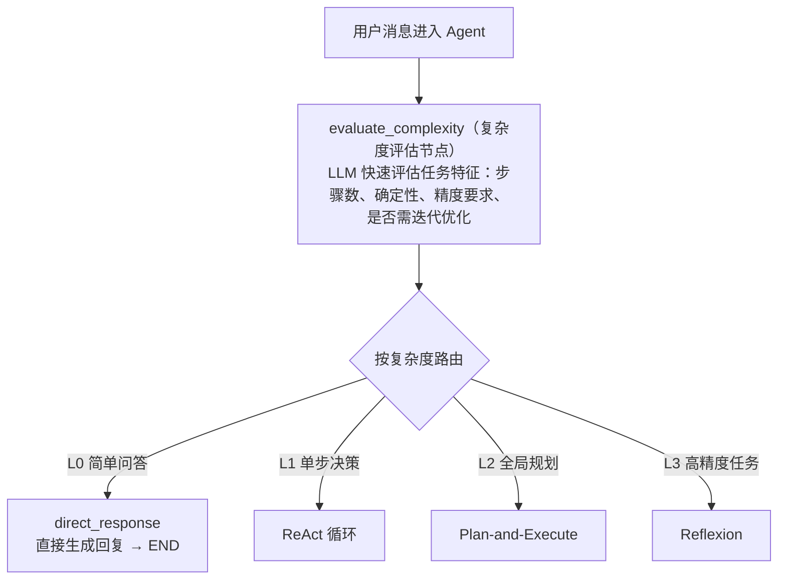
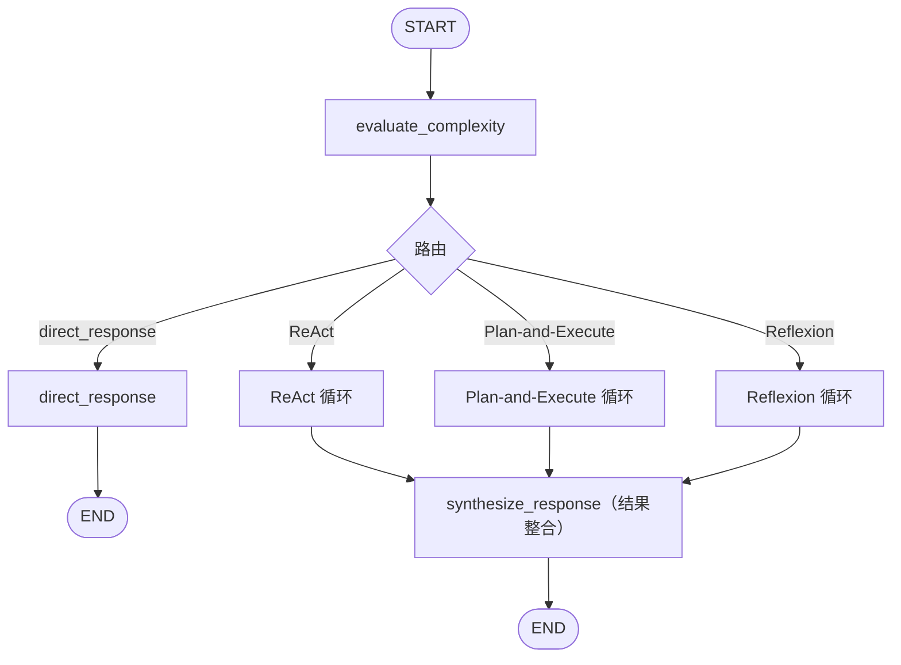
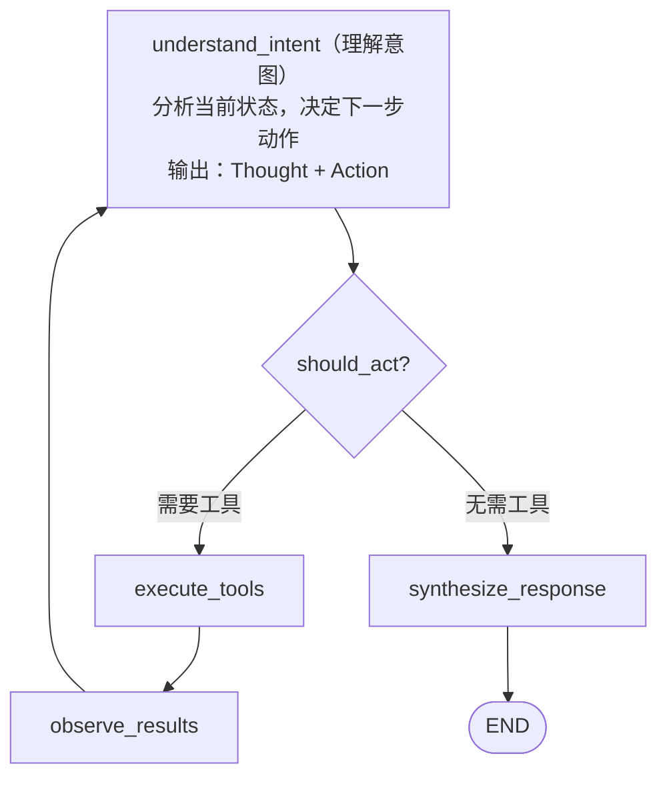
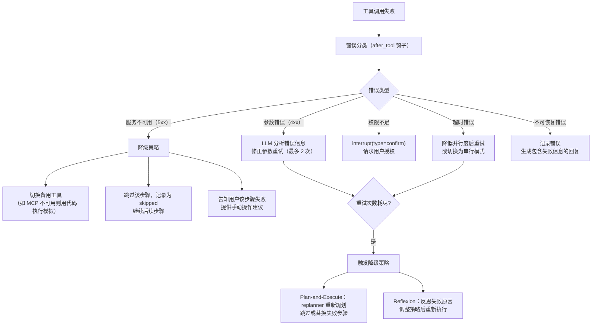

# AI 对话模块 - 后端实现设计（多步推理）

## 1. 文档概述

本文档描述 F-M06-002 多步推理的后端实现，包括推理引擎架构（ReAct/Plan-and-Execute/Reflexion 三种范式）、推理过程记录、检查点持久化、中断与恢复机制、成本与安全控制、子智能体协作。

### 1.1 相关文档

- **架构与公共**：[后端实现-架构与公共.md](./后端实现-架构与公共.md)
- **需求规格 §2.2**：[需求规格.md](./需求规格.md)
- **API 接口 §2.3**：[API接口.md](./API接口.md)

---

## 2. 数据模型

本功能域涉及一张业务表，表结构详见 [数据库设计 §4.7](../../../02-系统架构/03-数据库设计.md#47-ai-对话模块)：

| 实体 | 职责 | 服务层关键用途 |
|------|------|-------------|
| `sys_ai_agent_thought` | 推理过程（thought/tool/observation/步骤序号/耗时） | 推理步骤记录、SSE 推送、推理链路回溯 |

推理记录为只追加表，不使用逻辑删除，过期数据通过定时任务物理清理。

### 2.2 LangGraph 检查点持久化（框架管理，不纳入本系统 schema）

不自建 checkpoint 业务表，直接使用 LangGraph 官方 Saver 体系。持久化表由 `MySQLCheckpointSaver`（自定义，继承 `BaseCheckpointSaver`）的 `setup()` 自动创建和管理，**不纳入本系统 `config/sql/schema/` 目录**，表结构以 LangGraph 官方 `PostgresSaver` 为准。业务层不直接读写这些表，全部通过 LangGraph 的 Checkpointer API 交互。详见 [后端实现-架构与公共 §4.3 检查点管理器](./后端实现-架构与公共.md#43-检查点管理器checkpointmanager)。

---

## 3. 推理引擎架构

### 3.1 复杂度感知与范式调度

不同任务适用不同推理范式，Agent 启动时先评估任务复杂度，自动选择最合适的推理模式：



| 复杂度等级 | 特征 | 推理范式 | 典型场景 |
|-----------|------|---------|---------|
| L0 简单 | 单步可完成，无需工具 | 直接生成 | "PSNR 是什么意思？" |
| L1 动态 | 步骤不确定，需实时观察调整 | ReAct | "帮这张图去雾并看看效果" |
| L2 规划 | 步骤可预见，多步骤任务 | Plan-and-Execute | "把这 10 张雾图都去雾并评估" |
| L3 精度 | 需高精度输出，可迭代优化 | Reflexion | "按标准流程生成评估报告，确保符合规范" |

> 复杂度评估由 LLM 快速判断（before_agent 钩子），消耗极少 token。评估结果存入 state 供后续节点使用。用户也可手动指定推理范式（如"请仔细分析"触发 Reflexion）。

### 3.2 LangGraph 图结构



三种循环共享工具执行体系（ToolExecutorRegistry）和检查点持久化，差异在于规划策略和反思机制。

---

## 4. 推理范式详解

### 4.1 ReAct（边想边做）

**核心思想**：Thought → Action → Observation 循环，每步只决定下一步，适合步骤不确定需动态调整的任务。



**适用场景**：实时问答、单步决策明确的任务、工具调用链较短（3-5 步内）。

**限制**：长任务效率低（串行）、缺乏全局规划、无法并行执行独立步骤。

### 4.2 Plan-and-Execute（先想后做）

**核心思想**：先由 Planner 生成完整计划，再由 Executor 按计划执行，支持并行和动态重规划。


**并行执行策略**：

```
Plan: [A, B(depends:A), C(独立), D(独立), E(depends:B,C)]
    ↓
批次1: 并行执行 [A, C, D]
    ↓
批次2: 执行 B（依赖 A）
    ↓
批次3: 执行 E（依赖 B, C）
    ↓
所有完成 → 结果整合
```

**适用场景**：步骤可预见的多步骤任务、可并行的批量处理、需要全局视角的复杂任务。

**优势**：全局规划避免局部最优、独立步骤并行提升效率、计划透明便于人工介入。

### 4.3 Reflexion（反思迭代优化）

**核心思想**：在执行基础上增加反思循环，从错误中学习，迭代优化至达标。


**反思记忆**：反思结果存入 `sys_ai_memory`（source=reflection），后续执行类似任务时注入历史经验，避免重复犯错。

**迭代控制**：
- 最大迭代次数（默认 3 次），超过后接受当前最佳结果
- 每次迭代注入上一次的反思总结到 prompt
- 迭代不增加用户感知延迟（同一 SSE 流内完成）

**适用场景**：需高精度输出（代码生成/审查）、可明确定义成功标准、重复性任务可从历史学习。

### 4.4 混合架构

实际生产中三种范式可组合使用，采用分层架构：

| 层级 | 范式 | 职责 |
|------|------|------|
| 顶层 | Plan-and-Execute | 任务分解、全局规划 |
| 中层（标准子任务） | Plan-and-Execute | 稳定执行预定义步骤 |
| 中层（不确定子任务） | ReAct | 灵活应对动态环境 |
| 中层（高精度子任务） | Reflexion | 迭代优化至达标 |

Planner 分解子任务时，为每个子任务标注推荐的推理范式，Executor 按标注调度对应循环。

---

## 5. 推理过程记录

每种范式的执行步骤都记录到 `sys_ai_agent_thought`，通过 SSE 推送给前端：

### 5.1 ReAct 记录

每个 Thought-Action-Observation 循环记录一条 agent_thought：
- `thought` = LLM 的思考内容（为什么选这个工具）
- `tool` = 工具名称
- `tool_input` = 工具参数
- `observation` = 工具返回摘要

### 5.2 Plan-and-Execute 记录

| 记录点 | thought 内容 | tool | observation |
|--------|-------------|------|-------------|
| 规划阶段 | "分解任务为 N 个子任务" | `planner` | 子任务列表 |
| 执行阶段 | "执行子任务 X" | 实际工具 | 工具返回 |
| 重规划阶段 | "子任务 X 失败，调整计划" | `replanner` | 更新后的计划 |

并行执行的子任务，position 相同（同批次），通过 metadata 标注 batch 序号。

### 5.3 Reflexion 记录

| 记录点 | thought 内容 | tool | observation |
|--------|-------------|------|-------------|
| 执行阶段 | 同 ReAct/Plan-and-Execute | 实际工具 | 工具返回 |
| 评估阶段 | "评估结果质量" | `evaluator` | 评分 + 反馈 |
| 反思阶段 | "分析问题根因，改进策略" | `self_reflection` | 改进策略 |

---

## 6. 成本与安全控制

### 6.1 推理步数限制

```
每步推理前检查当前 step 数（before_model 钩子）
    ↓
step >= max_steps → 强制终止
  - ReAct: max_steps=20
  - Plan-and-Execute: max_steps=30（含规划步）
  - Reflexion: max_steps=15（单次迭代内）× max_iterations=3
    ↓
生成回复："已达到最大推理步数限制，请简化需求或分多次对话"
```

### 6.2 Token 预算控制

```
每步推理后累计 Token 消耗（after_model 钩子）
    ↓
累计 >= token_budget → interrupt(type=quota)
    ↓
复杂度评估消耗的 token 也计入预算
```

### 6.3 工具调用安全控制

| 控制项 | 说明 | 实现位置 |
|--------|------|---------|
| 工具白名单 | Agent 只能调用注册的工具 | ToolExecutorRegistry |
| 危险操作拦截 | 删除文件、执行危险命令前需用户确认 | before_tool 钩子 → interrupt |
| 参数校验 | 工具参数 schema 校验 | before_tool 钩子 |
| 超时控制 | 单工具调用超时（默认 60s） | ToolExecutorRegistry |
| 沙箱隔离 | 代码执行在受限沙箱中 | CodeExecutor |
| 路径白名单 | 文件操作限制在用户目录内 | FileToolExecutor |

### 6.4 错误恢复策略

工具调用失败时的系统化恢复策略（替代原"修正参数重试或降级"的笼统描述）：



### 6.5 自我评估质量保障

Reflexion 范式和关键节点的质量评估：

| 评估方式 | 适用场景 | 说明 |
|---------|---------|------|
| LLM 自评 | 通用任务 | LLM 对照要求自评结果质量（0-1 分） |
| 规则校验 | 结构化输出 | 正则/JSON schema 校验输出格式 |
| 工具验证 | 可执行结果 | 代码执行验证逻辑正确性、指标计算验证数值合理性 |
| 用户反馈 | 主观任务 | 用户点赞/点踩作为质量信号，反馈到记忆系统 |

---

## 7. 子智能体与多智能体协作

### 7.1 子智能体调度

主 Agent 通过 SubagentManager 将子任务委派给专用子智能体：

```
主 Agent 决定委派子任务
    ↓
SubagentManager 创建子智能体：
  - 独立的 System Prompt（专业化指令）
  - 独立的工具集（可见工具可与主 Agent 不同）
  - 独立的 checkpoint（子图命名空间 checkpoint_ns 隔离）
    ↓
子智能体执行子任务（可用 ReAct/Plan-and-Execute/Reflexion）
    ↓
返回结果给主 Agent
    ↓
主 Agent 汇总结果，继续后续推理
```

### 7.2 并行执行

Plan-and-Execute 的独立子任务可并行执行：

```
Planner 识别可并行的独立子任务 [A, B, C]
    ↓
SubagentManager 同时创建 3 个子智能体
    ↓
3 个子智能体并行执行（各自独立的推理循环）
    ↓
全部完成后汇总结果
    ↓
并行度控制：max_parallel（默认 5），超过则排队等待
```

**配额召回机制**（对齐需求 §2.2.6 滚动预算校验）：

子智能体派发前主 Agent 向计费管理校验剩余配额并预扣本步预估消耗。并行执行过程中配额不足时，按以下策略处理：

| 场景 | 处理方式 |
|------|---------|
| 未启动的子智能体 | 主 Agent 召回，不执行 |
| 已完成的子智能体 | 结果保留，参与最终汇总 |
| 正在执行的子智能体 | 等待当前步骤完成后停止 |
| 前端提示 | 推送提示"部分子任务因配额不足未执行" |

子智能体消耗归集到主会话配额，不单独开账户。主会话计费明细按子智能体维度分项展示（子智能体名称 + Token 数 + 积分），与主 Agent 消耗汇总为会话总消耗。

### 7.3 Agent 团队协作

复杂任务可组建 Agent 团队，多智能体协作完成：

| 角色 | 职责 | 示例 |
|------|------|------|
| Orchestrator（主 Agent） | 任务分解、结果汇总、最终回复 | "分析这批图片的去雾效果" |
| Specialist（专家 Agent） | 专注特定领域子任务 | 图像分析 Agent、指标评估 Agent、报告生成 Agent |
| Reviewer（审查 Agent） | 质量审查、结果校验 | Reflexion 中的 Evaluator 角色 |

团队协作通过消息传递（主 Agent → 子 Agent 的任务委派，子 Agent → 主 Agent 的结果返回），子 Agent 之间不直接通信，避免耦合。

---

## 8. 中断与恢复

### 8.1 中断类型

| 中断类型 | 触发场景 | interrupt 数据 | 恢复方式 |
|---------|---------|---------------|---------|
| `confirm` | LLM 推荐算法后需用户确认 / 危险操作需确认 | 推荐算法/参数 或 危险操作详情 | 用户确认或修改后 resume |
| `quota` | 配额不足 | 已用配额、限额、升级提示 | 用户升级 VIP 后 resume |
| `async_wait` | 异步任务（图像处理）提交后等待 | task_id、任务类型、预计耗时 | 任务完成后自动 resume |

### 8.2 中断处理流程

```
推理过程中触发 interrupt（before_tool / should_continue 节点）
    ↓
LangGraph interrupt 暂停 Agent 执行，自动保存 checkpoint
    ↓
after_agent 钩子记录中断点到 Redis：ai:interrupt:{threadId}
  - type = confirm / quota / async_wait
  - data = 中断相关数据
    ↓
通过 SSE 推送 interrupt 事件
    ↓
前端展示中断交互（确认卡片 / 升级引导 / 进度展示）
```

### 8.3 恢复处理流程

```
用户确认 / 配额恢复 / 异步任务完成
    ↓
调用消息发送接口（POST /conversations/{id}/messages），请求体携带 resume 参数：
  - {"resume": {"confirmed": true, "algorithm": "RIDCP", "params": {...}}}
  - 不传 content（不是新消息，是恢复中断）
    ↓
ReasoningService 调用 graph.invoke(Command(resume=...), config={thread_id})
  - LangGraph 自动从 checkpoint 恢复状态
  - 将 resume 值注入 interrupt() 返回值
  - 从中断点继续推理（恢复到原推理范式循环）
    ↓
清除 Redis 中断点：DEL ai:interrupt:{threadId}
    ↓
继续 SSE 流式输出
```

### 8.4 异步任务等待与回调

```
LLM 调用异步工具（execute_tools 节点）
    ↓
工具执行器返回 task_id（异步调用）
    ↓
Agent 进入 interrupt（type=async_wait, data={task_id}）
    ↓
更新 assistant 消息 task_id = 异步任务 ID
    ↓
前端展示处理进度
    ↓
异步任务完成 → 后端回调通知 ReasoningService
    ↓
ReasoningService 自动 resume Agent
  - 从工具执行器获取任务结果摘要
  - 注入 state 作为工具返回
  - 继续推理
```

### 8.5 并行任务的中断与恢复

Plan-and-Execute 并行执行多个子任务时的中断处理：

```
多个子智能体并行执行中，某个子任务需要 interrupt
    ↓
该子智能体暂停，其他子智能体继续执行（不阻塞）
    ↓
主 Agent 等待所有子任务完成或中断
    ↓
中断的子任务通过 resume 恢复后继续
    ↓
全部子任务完成后汇总结果
```

### 8.6 用户主动中断

```
用户点击"停止"按钮
    ↓
调用 /messages/{id}/stop 接口
    ↓
LangGraph 终止当前推理（含所有并行子智能体）
    ↓
清除 Redis 检查点和中断点
    ↓
更新 assistant 消息 status = 4 (已取消)
    ↓
已完成的推理步骤保留（agent_thought 记录不删除）
    ↓
已生成的 token 保留在消息 content 中
```

---

## 9. 模块间协作

### 9.1 与能力扩展体系

| 集成点 | 说明 |
|--------|------|
| 工具发现 | Agent 启动时从 ToolExecutorRegistry 获取所有可用工具列表及参数 schema（含 MCP 工具、文件操作、搜索、代码执行、Skills、子智能体） |
| 系统工具调用 | 通过 McpGatewayClient 调用系统后端 API（图像处理、指标评估等），身份透传 API Key |
| 文件操作 | 通过 FileToolExecutor 读写删除用户文件，路径白名单和权限校验 |
| 搜索工具 | 通过 SearchToolExecutor 执行网络搜索、知识库检索、本地文件检索 |
| 代码执行 | 通过 CodeExecutor 在沙箱中执行 Python/Shell，资源限制和超时控制 |
| Skills 执行 | 通过 SkillManager 渐进式加载工作流指令，按步骤执行 |
| 子智能体 | 通过 SubagentManager 委派子任务给专用子智能体，支持 Agent 团队协作 |
| 异步工具调用 | 处理类工具（如图像去雾）返回 task_id，Agent 进入 async_wait 中断 |
| 结果摘要 | 大体积响应只返回引用 + 摘要元数据，不返回二进制 |

### 9.2 与上下文与记忆系统

| 集成点 | 说明 |
|--------|------|
| 短期记忆注入 | before_model 钩子组装上下文（对话历史 + 摘要 + 任务状态） |
| 长期记忆注入 | before_model 钩子从 MemoryService 检索相关长期记忆，按相关性+近因性+重要性加权注入 |
| 任务状态维护 | 推理过程中任务状态存入 checkpoint state，不进入对话流 |
| 记忆提取 | after_agent 钩子异步提取本次对话的记忆，写入 sys_ai_memory |
| Reflexion 反思记忆 | Reflexion 范式的反思结果存入 sys_ai_memory（source=reflection），后续执行类似任务时注入 |
| 产物引用化 | 工具调用产生结果时通过 ArtifactService 注册产物，state 中只存引用 ID |

### 9.3 与 AI 计费模块

| 集成点 | 说明 |
|--------|------|
| 推理前配额校验 | before_agent 钩子校验日/月限额，不足则 interrupt（type=quota） |
| 推理后扣减 | after_agent 钩子累计 Token 消耗，消息完成后统一扣减 |
| 工具调用配额 | 工具调用的配额由底层 API 扣减，不在 AI 计费中重复记录 |

### 9.4 与任务管理模块

| 集成点 | 说明 |
|--------|------|
| 异步任务回调 | 图像处理等异步任务完成后，任务管理模块回调 ReasoningService 恢复推理 |
| 任务状态查询 | Agent 可通过工具查询异步任务状态（轮询降级方案） |
