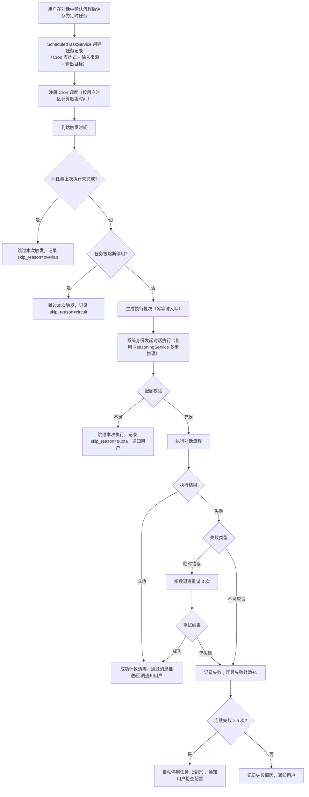

# AI 对话模块 - 后端实现设计（定时调度）

## 1. 文档概述

本文档描述 F-M08-009 定时调度的后端实现，支持用户将对话中调度的处理流程固化为定时任务，按 Cron 规则自动触发对话执行，满足企业用户自动化流程需求。

> 与 [需求规格-定时与兼容 §2.10](./需求规格-定时与兼容.md) 同步：幂等防重入、并发控制、失败分级重试、连续失败熔断、执行观测（§2.4）与手动触发（§2.5）的实现约束见该需求规格；定时任务数据表（`sys_ai_schedule`/`sys_ai_schedule_run`）见 §2.1；Python 端定时任务 API 与执行通知的路由/服务/仓库位置见 `app/router/ai_schedule.py`、`app/service/ai/service/ai_schedule_service.py`、`app/repository/ai_schedule_run_repository.py`、`app/service/ai/service/ai_schedule_notify.py`。

### 1.1 设计思想

#### 设计动机

本功能域承载的核心升级是：**把"人在场的对话"升级为"无人值守的自动化流程"**。企业用户往往需要周期性处理同一类任务（如每日拉取监控截图去雾评估、定时批量摘要），若每次都要人工发起对话，效率与可靠性都不可接受。定时调度让"曾经在对话中确认的处理流程"可以被固化为定时任务，到点自动执行、结果自动通知。

定时任务与普通对话的本质差异是**无人值守**：没有人在场纠正失败、确认重复、控制成本。因此本功能域在"复用内部推理链路"之外，还必须解决生产级调度缺的三件事——**任务会不会重复执行、会不会互相挤压、反复失败怎么办**（§2.4）。

#### 核心设计原则

| 原则 | 说明 |
|------|------|
| 任务触发复用内部推理链路 | 到达触发时间后以系统身份发起对话执行，直接复用 ReasoningService 的多步推理能力，不另建一套执行链路 |
| 幂等防重入 | 每次触发以"任务 ID + 触发窗口"生成唯一执行批次，数据库唯一约束防重，服务重启/多实例并发扫描/时钟漂移均不产生重复执行（详见 §2.4） |
| 失败分级重试 | 临时错误（网络/限流/超时）按指数退避重试 3 次；不可重试错误（参数/权限/配置）不重试，避免无效重试消耗成本（详见 §2.4） |
| 成本保护 | 连续失败熔断（≥5 次自动停用）+ 配额不足跳过 + 任务重叠跳过，防止无人值守任务消耗失控（详见 §2.4） |

#### 关键架构取舍

| 取舍点 | 方案对比 | 选择与理由 |
|--------|---------|-----------|
| 调度引擎 | 单实例内存调度 vs XXL-Job 分布式调度 | 选 XXL-Job。多实例部署场景下需要分布式调度与防重入；XXL-Job 已作为基础设施落地（`app/infrastructure/job/`），复用避免重复建设（详见 §2.4） |
| 幂等防重入 | 内存"上次执行时间" vs 数据库唯一约束 | 选数据库唯一约束。内存标记重启即丢失，无法覆盖多实例并发扫描与时钟漂移；以 `(schedule_id, window_start)` 唯一索引兜底（详见 §2.4） |
| 任务执行 | 独立执行链路 vs 复用内部推理链路 | 选复用内部推理链路。以系统身份发起对话执行，直接复用 ReasoningService 多步推理，不另建执行链路，保证行为一致（详见 §2.2） |

#### 总体规划

```
用户在对话中确认流程 → 保存为定时任务（Cron + 输入来源 + 输出目标）
    ↓
ScheduledTaskService 注册 Cron 调度（按用户时区计算触发时间）
    ↓
到达触发时间 → 幂等键防重入 → 并发控制 → 配额校验
    ↓
以系统身份发起对话执行（复用 ReasoningService 多步推理）
    ↓
执行结果 → 执行历史记录 → 消息通知用户
```

---

## 2. 定时调度（ScheduledTaskService）

F-M08-009 定时调度支持用户将对话中调度的处理流程固化为定时任务，按 Cron 规则自动触发对话执行，满足企业用户自动化流程需求。

| 组件 | 职责 |
|------|------|
| ScheduledTaskService | 定时任务 CRUD、Cron 调度注册/取消、任务触发执行、手动触发 |
| TaskExecutor | 到达触发时间时以系统身份发起对话执行，复用 ReasoningService 推理能力 |

### 2.1 数据模型

> 定时任务配置表 `sys_ai_schedule` 与执行历史表 `sys_ai_schedule_run` 已落地（`config/sql/schema/sys_ai_schedule.sql`、`sys_ai_schedule_run.sql`）。调度执行依赖 XXL-Job 基础设施（`app/infrastructure/job/`）与通用 `sys_task` 表（`sys_task` 为 MQ 异步任务，非 Cron 定时任务）。

| 表 | 关键字段 | 说明 |
|----|---------|------|
| `sys_ai_schedule` | `user_id`、`name`、`cron`、`timezone`、`input`（JSON：固定/动态）、`output`（JSON）、`enabled`（用户启停）、`status`（正常/熔断停用）、`circuit_streak`（连续失败次数）、`next_trigger_time` | 定时任务配置，逻辑删除（任务删除后不可恢复） |
| `sys_ai_schedule_run`（执行历史） | `schedule_id`、`user_id`、`window_start`（触发窗口）、`status`（成功/失败/跳过）、`skip_reason`（overlap/quota/circuit/idempotent）、`credits`、`duration_ms`、`error_msg`、`conversation_id`、`request_id` | 只追加，保留 30 天物理清理 |

**幂等键**：`sys_ai_schedule_run` 以 `(schedule_id, window_start)` 唯一索引（`uk_schedule_window`）实现幂等防重入，服务重启/多实例并发扫描/时钟漂移均不产生重复执行（见 §2.4）。

### 2.2 业务流程



### 2.3 输入来源

| 类型 | 说明 |
|------|------|
| 固定输入 | 用户预设的图片集 |
| 动态输入 | 通过 MCP 能力网关拉取监控截图/指定目录新文件 |

**触发规则设置**（对齐需求规格 §2.10.3）：

| 方式 | 实现 |
|------|------|
| 常用频率快捷项 | 每天/每周/每月快捷项映射为 Cron 表达式（如"每天 9 点"→ `0 0 9 * * ?`），前端选择小时/分钟 |
| 自定义 Cron | 用户直接输入 Cron 表达式 |
| 实时预览 | 两种方式均调用 Cron 解释接口（`GET /scheduled-tasks/next-times`）返回人类可读描述 + 接下来 N 次触发时间，创建/更新时返回下次执行时间预览 |

### 2.4 执行可靠性

| 能力 | 实现要点 |
|------|---------|
| 幂等防重入 | 每次触发生成执行批次，以 `user_id + schedule_id + window_start` 为幂等键写入执行历史，唯一约束防重；已存在同窗口记录则跳过。不依赖内存"上次执行时间"（重启丢失）。覆盖服务重启、多实例并发扫描、时钟漂移三种重复来源 |
| 并发控制 | 单任务串行：执行前检查该任务最近一次执行是否仍在进行（运行态标记，Redis `ai:schedule:{schedule_id}:running`），在跑则跳过本次（记录 `skip_reason=overlap`）；平台级全局并发上限（配置项 `ai.schedule.max-concurrent`，默认 10），防止任务风暴打爆推理服务 |
| 失败分级重试 | 可重试错误（网络瞬断、429 限流、5xx、超时）→ 指数退避重试 3 次（1s/2s/4s）；不可重试错误（参数错误、权限不足、配置问题）→ 不重试，直接记录失败原因并通知 |
| 连续失败熔断 | 同一任务连续失败 ≥ 5 次自动停用（`status=熔断停用`），通知用户检查配置；熔断期间跳过触发（记录 `skip_reason=circuit`）；用户修复后通过启停接口手动重新启用，启用后连续失败计数清零 |
| 禁用跳过 | 任务被用户停用（`enabled=false`）或熔断停用时，到达触发时间跳过本次（记录 `skip_reason=disabled`），不发起执行 |
| 执行观测 | 每次触发/跳过/执行均写执行历史：触发窗口、跳过原因（disabled/overlap/quota/circuit/idempotent）、执行耗时、失败原因、消耗积分；支持统计任务延迟（计划触发 vs 实际执行）与失败分布，排查"为什么没跑/重复跑/成本异常" |
| 执行历史保留 | 执行历史保留 30 天（与现有规则一致），熔断与跳过记录一并归档，定时物理清理 |

### 2.5 手动触发

```
用户在任务列表点击"立即执行"
    ↓
ScheduledTaskService 校验任务存在且未删除
    ↓
走与自动触发相同的执行链路（复用 §2.2 流程，含配额校验）
    ↓
不改变原 Cron 规则，执行记录写入执行历史
```

- 用于验证任务配置是否可用、补跑因故遗漏的执行
- 手动触发同样受幂等防重入约束（同窗口不重复执行）

### 2.6 执行通知与结果查看

对齐需求规格 §2.10.3 交互规范，无人值守任务的执行结果必须主动触达用户：

| 能力 | 实现要点 |
|------|---------|
| 执行通知 | 每次执行完成后通过站内消息通知用户执行结果（成功/失败/跳过）；失败或配额不足时通知中说明原因 |
| 通知升级 | 同一任务连续失败达阈值（如 3 次）时通知升级，提示"任务可能配置异常"，引导用户检查配置（对齐需求规格 §2.10.3 执行通知） |
| 最近执行摘要 | 任务列表展示最近一次执行摘要（成功/失败/跳过/熔断、消耗积分、耗时），从 `sys_ai_schedule_run` 最近一条记录聚合 |
| 结果跳转 | 执行历史记录 `conversation_id`，用户可跳转查看该次执行生成的对话记录 |

### 2.7 时区处理

- 任务按用户所在时区（Asia/Shanghai，与配额重置时区一致）计算 `next_trigger_time`，Cron 注册时指定时区，不随平台服务器时区漂移
- 创建/更新任务时返回下次执行时间预览，供前端展示

### 2.8 业务规则

任务权限、配额占用、失败重试、任务上限、执行历史等业务规则见 [需求规格-定时与兼容 §2.10](./需求规格-定时与兼容.md)，实现时按此约束校验与执行。

---

## 3. 模块间协作

| 协作方 | 说明 |
|--------|------|
| ReasoningService | 任务触发时以系统身份发起对话执行，复用多步推理链路 |
| AI 计费管理 | 执行消耗的积分计入用户配额，配额不足时跳过本次执行 |
| MCP 能力网关 | 动态输入通过 MCP 拉取监控截图/指定目录新文件 |
| XXL-Job | 分布式 Cron 调度基础设施（执行器集成见 `app/infrastructure/job/`），多实例部署场景下防重入依赖 §2.4 幂等键 |
| 消息通知 | 执行结果/失败/熔断通知用户 |
