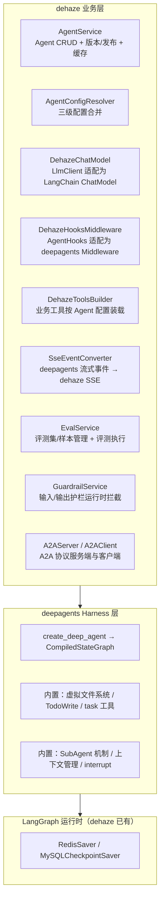
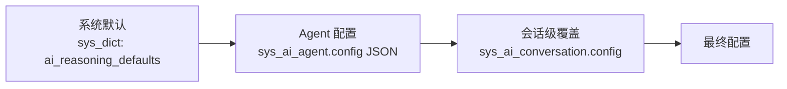
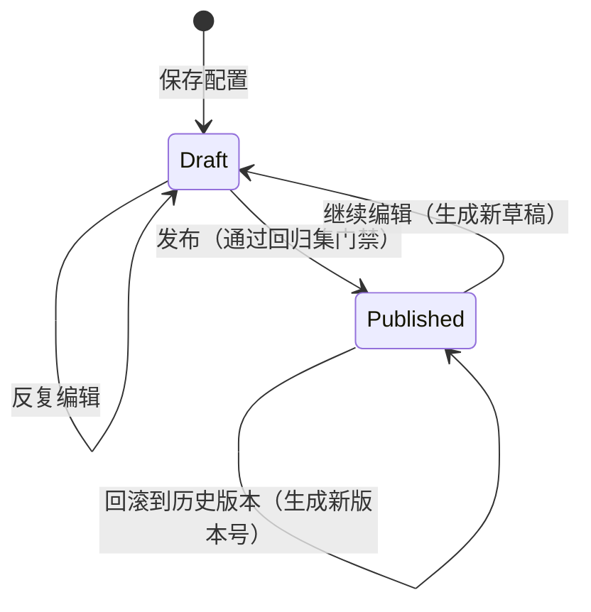
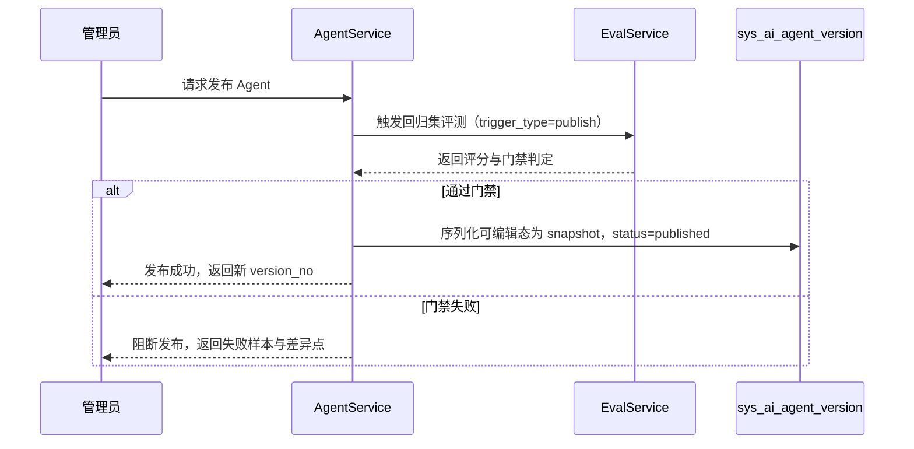
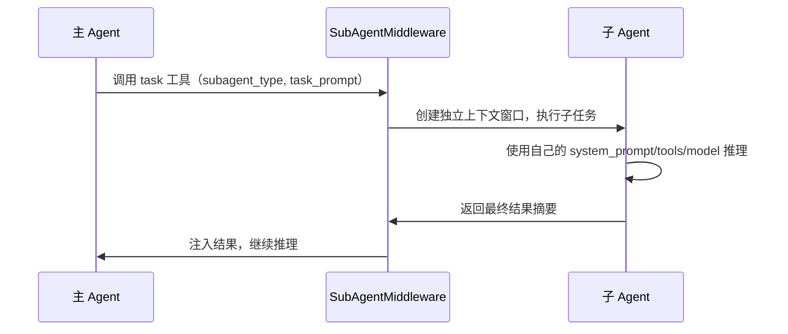
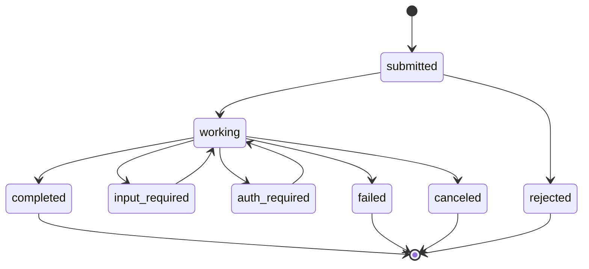
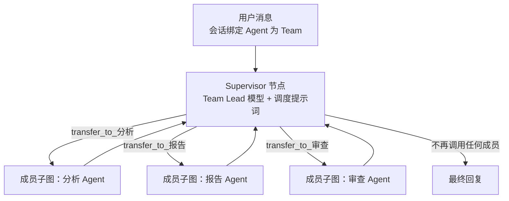
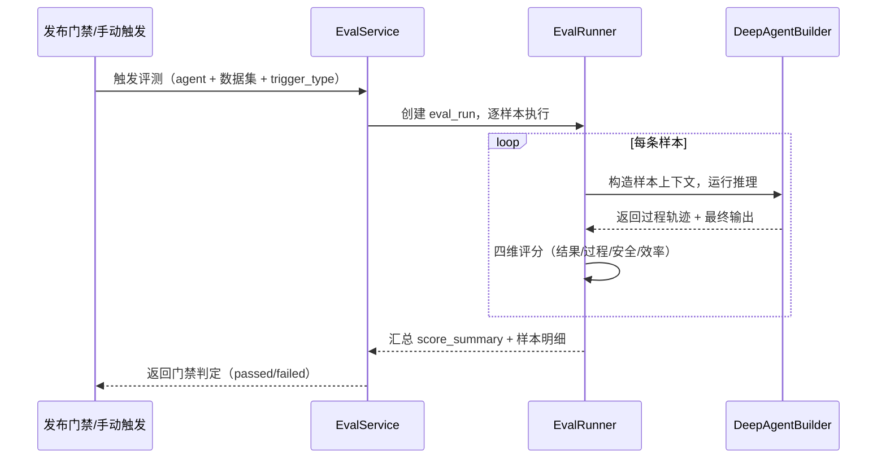

# AI 对话模块 - 后端实现设计（智能体管理）

## 1. 文档概述

本文档描述 F-M08-011 智能体管理的后端实现，包括 Agent 实体数据模型、基于 deepagents 的推理引擎集成、配置动态化、子 Agent 协作、Team 团队协作、复杂任务辅助工具、版本管理与发布、评测与回归测试、安全护栏。

### 1.1 设计思想

#### 设计动机

智能体管理是 AI 对话从"单一助手"走向"多智能体协作"的支撑层。本功能域的根本矛盾是：**Agent 能力的可组合性**与**配置的集中可管理性**之间的张力。

单 Agent 时代，Agent 的行为（提示词、工具、推理参数）散落在代码与环境变量中，改一处要发版、不同 Agent 无法差异化、更无法协作。多 Agent 时代的需求是：平台上存在多个 Agent，每个 Agent 拥有独立的"人格"（系统提示词）、"技能"（Skills/MCP 工具集）和"参数"（推理配置），一个 Agent 可以作为子 Agent 被另一个 Agent 调用，多个 Agent 可以组成团队协作完成复杂任务。

本功能域的设计目标：**把 Agent 从"代码产物"变为"数据实体"——配置即产品，Agent 之间可组合、可协作、可运营**。

#### 核心设计原则

| 原则 | 说明 |
|------|------|
| 配置驱动 | Agent 的全部行为（系统提示词、模型、推理范式、推理参数、Skills、MCP 命名空间、子 Agent、权限）由 `sys_ai_agent` 表管理，前端可动态配置。推理参数从环境变量迁移到数据库，按"系统默认 ← Agent 配置 ← 会话覆盖"三级合并（详见 §4.2） |
| 框架复用 | 基于 deepagents（LangChain 官方 Agent Harness），白送虚拟文件系统、TodoWrite、SubAgent、上下文管理四类能力；dehaze 通过 `DeepAgentBuilder` 从数据库加载配置组装 `create_deep_agent` 入参，只做适配不做重造（详见 §3.2） |
| 上下文隔离 | 子 Agent 拥有独立上下文窗口，中间工具调用不污染主 Agent，仅返回最终摘要。这与 Claude Code/deepagents 的实践一致：隔离保证主 Agent 上下文不被海量子过程信息撑爆（详见 §5.2） |
| 防递归 | 子 Agent 不能再调用 `task` 工具。递归调用会无限加深上下文层级、快速耗尽 Token 预算，防递归是兜底护栏（详见 §5.2） |
| 单一信息源 | 子 Agent 的触发描述复用其自身的 `sys_ai_agent.description` 字段，不在关联表重复存储，避免同一信息多处维护导致漂移（详见 §2.2） |
| 版本化 | Agent 配置变更生成不可变快照，草稿与已发布版本分离，发布/回滚可追溯、可复现；会话锚定创建时版本，避免"改配置即改线上行为"（详见 §4.4） |
| 发布门禁 | Agent 发布前须通过回归集评测，评分下降或高风险样本失败则阻断发布，让变更可量化、可比较（详见 §9） |
| 双层防护 | 静态权限（文件系统授权）与运行时护栏（输入/输出拦截）互补，防止越权操作的同时拦截注入、泄露与违规输出（详见 §8.5） |

#### 关键架构取舍

| 取舍点 | 方案对比 | 选择与理由 |
|--------|---------|-----------|
| 推理引擎选型 | 全自研 Agent 框架 vs 基于 deepagents 扩展 | 选后者。deepagents 提供开箱即用的虚拟文件系统、TodoWrite、SubAgent、上下文管理，自研约省 40-50% 工作量；其返回标准 LangGraph 图，dehaze 现有 Checkpointer/中断/SSE 全部兼容。Team 协作用 `langgraph-supervisor` 编排多个 deep agent 实例补齐 deepagents 缺失的能力（详见 §3.2/6） |
| 子 Agent 关联存储 | `sys_ai_agent.config` JSON 数组 vs 独立关联表 `sys_ai_agent_subagent` | 选关联表。JSON 无法表达优先级、无法高效查询"某 Agent 被谁引用"（删除校验需要）；关联表支持索引与覆盖式更新，且 Team 成员关系复用同一张表 |
| 子 Agent 的会话持久化 | 子 Agent 独立会话/消息/记忆 vs 无状态临时执行 | 选无状态。业界实践（deepagents Fresh context、Claude Code subagent）子 Agent 均为运行时隔离的临时执行，不创建独立会话；其消耗归集到主会话配额。持久化子 Agent 会话会引入"主/子会话同步"的巨大复杂度而无实际收益 |
| Agent 配置存储 | 每个参数一个列 vs 推理参数合并为 JSON 字段 | 选 JSON 字段。推理参数（max_steps/token_budget/max_parallel 等）是低频修改的扩展性配置，拆列会导致频繁 DDL；JSON + "继承系统默认"合并策略平衡了灵活性与扩展成本（详见 §2.1/§4.2） |
| 版本快照存储 | 在主表存 `published_config` JSON vs 独立版本表 `sys_ai_agent_version` | 选独立版本表。版本需要"自增版本号 + 变更人 + 变更说明 + 不可变快照 + 草稿/已发布状态"等元数据，塞进主表无法表达版本历史；独立表支持按版本号查询历史、回滚与差异对比（详见 §2.4） |
| 护栏规则存储 | 独立 `sys_ai_agent_guardrail` 表 vs 复用 `config` JSON 的 `guardrails` 字段 | 选 JSON 字段。护栏规则类型是内置的（Prompt 注入/PII 脱敏等），仅需按 Agent 开关 + 参数调优，无动态新增规则类型的需求；独立表属于过度设计，JSON + "继承系统默认"合并已足够（详见 §2.1/§8.5） |
| 子 Agent 跨系统调用协议 | 自研 RPC vs A2A 开放协议 | 选 A2A。进程内子 Agent 用 deepagents `task` 工具（§5.1/5.2），跨进程/外部 Agent 互操作采用业界标准 A2A（HTTP + JSON-RPC + SSE + Agent Card），与 MCP 互补；自研协议无生态与互操作价值（详见 §5.4） |

#### 总体规划

智能体管理是"编排层"，让推理引擎从"单一固定 Agent"升级为"配置驱动的多 Agent 协作体系"：

```
管理面：sys_ai_agent（Agent 实体）→ 前端管理界面（名称/提示词/模型/Skills/MCP/参数/护栏）
                    ↓ 三级配置合并
运行面：DeepAgentBuilder → create_deep_agent（每次推理按已发布版本配置组装）
                    ↓
协作面：子 Agent（task 工具，独立上下文）⇄ Team 团队（langgraph-supervisor 编排）
                    ↓
辅助面：虚拟文件系统 + TodoWrite（复杂任务支撑）
运营面：版本管理（草稿/发布/回滚）⇄ 评测回归（发布门禁）⇄ 安全护栏（运行时拦截）
```

本功能域是其他功能域的上层：多步推理的范式、上下文管理的记忆、模型管理的计费，都以"某个 Agent 的配置"为上下文运行。

---

## 2. 数据模型

本功能域涉及 9 张业务表，表结构详见 `config/sql/schema/` 目录，顶层设计详见 [数据库设计 §4.7](../../../02-系统架构/03-数据库设计.md#47-ai-对话模块)：

| 实体 | 职责 | 逻辑删除 |
|------|------|---------|
| `sys_ai_agent` | Agent 主表（系统提示词、模型、推理范式、配置 JSON、类型标识、权限规则、护栏配置） | 是（类别②，agent_code 不可复用） |
| `sys_ai_agent_skill` | Agent-Skill 关联 | 否（关联表，覆盖式更新） |
| `sys_ai_agent_mcp` | Agent-MCP 命名空间关联 | 否（关联表，覆盖式更新） |
| `sys_ai_agent_subagent` | Agent-Subagent 关联（自引用，含优先级） | 否（关联表，覆盖式更新） |
| `sys_ai_agent_version` | Agent 配置版本快照（草稿/已发布状态、变更说明、不可变快照） | 否（版本历史需永久保留，支持追溯/回滚） |
| `sys_ai_agent_eval_dataset` | 评测集（开发集/回归集/保留集） | 是（类别①） |
| `sys_ai_agent_eval_sample` | 评测样本（任务目标、期望过程/结果、禁止行为、风险等级） | 否（随数据集管理） |
| `sys_ai_agent_eval_run` | 评测执行记录（触发方式、状态、评分摘要、样本明细 JSON） | 否（发布审计轨迹） |
| `sys_ai_agent_endpoint` | 外部 A2A Agent 注册（Agent Card 地址、端点、认证凭证密文） | 是（类别①） |

### 2.1 `sys_ai_agent` 关键设计

| 字段 | 设计决策 |
|------|---------|
| `agent_code` | 业务引用键，唯一不可复用（类别②），删除后不可再用 |
| `config` | JSON 字段存储推理参数，支持"继承系统默认 + Agent 覆盖"两级合并，避免列爆炸 |
| `config.guardrails` | `config` JSON 内的 `guardrails` 子字段存储护栏规则（输入/输出护栏的开关与参数），复用"继承系统默认 + Agent 覆盖"合并策略（详见 §8.5） |
| `permissions` | 存储 deepagents 文件系统权限规则（operations/paths/mode），控制 Agent 文件操作范围 |
| `is_subagent` / `is_team` | 标识 Agent 类型，三种类型互斥（普通 / 子 Agent / Team 团队） |
| `reasoning_mode` | `auto` 表示由复杂度评估自动选择；其余值表示固定范式 |
| `is_exposed` | 是否对外暴露为 A2A 子 Agent（默认 `false`，仅启用且非子 Agent 的普通 Agent 可暴露，见 §5.4） |

### 2.2 `sys_ai_agent_subagent` 关键设计

- 触发描述复用子 Agent 自身的 `sys_ai_agent.description` 字段（单一信息源，对齐 deepagents SubAgent.description 和 Claude Code subagent frontmatter description 的语义——都是子 Agent 自身属性）
- `priority` 用于多个子 Agent 均可处理同一任务时的选择排序
- Team 团队关系复用此表：Team Lead 为 `parent_agent_id`，Team Member 为 `subagent_agent_id`
- `endpoint_id` 区分本地与远程子 Agent：`NULL` 为本地子 Agent（进程内 `task` 工具），非 `NULL` 指向 `sys_ai_agent_endpoint` 的外部 A2A Agent（走 A2A 客户端，见 §5.4）
- 远程子 Agent 须在本地 `sys_ai_agent` 建立影子记录（`is_subagent=1`，承载名称/描述等展示信息），`subagent_agent_id` 指向该影子记录，`endpoint_id` 指向外部端点；运行时以 `endpoint_id` 非空判定走 A2A 客户端

### 2.3 推理参数默认值来源

推理参数以 `sys_dict` 字典（`dict_type='ai_reasoning_defaults'`）作为全局默认值，管理员通过字典管理界面调整；Agent 级与会话级配置逐级覆盖（见 §4.2），不硬编码在代码中。

### 2.4 `sys_ai_agent_version` 关键设计

| 字段 | 设计决策 |
|------|---------|
| `version_no` | 每个 Agent 内自增，不可变、不回填；`(agent_id, version_no)` 唯一 |
| `snapshot` | JSON 字段，发布时从主表序列化完整配置（系统提示词、模型、推理参数、Skills/MCP/子 Agent 关联、权限、护栏），运行时据此组装，与主表可编辑态解耦 |
| `status` | `tinyint`：`1=草稿`，`2=已发布`（默认 1）；同一 Agent 同一时刻至多一条 `status=2`（已发布） |
| `change_note` / `operator_id` | 变更说明与操作人，支撑追溯与审计 |
| 保留策略 | 版本历史不物理删除，回滚生成新版本号，完整历史可追溯、可对比 |

主表 `sys_ai_agent` 字段保持为"当前可编辑态"；发布动作将可编辑态序列化为 `snapshot` 写入版本表。会话锚定发布时的 `version_no`，运行面读取对应快照组装 Agent（见 §4.4）。

### 2.5 评测表关键设计

| 实体 | 关键字段与设计决策 |
|------|------------------|
| `sys_ai_agent_eval_dataset` | `dataset_type`（`dev`/`regression`/`heldout`）+ `agent_id`；开发集日常调试、回归集发布门禁、保留集阶段验收（见 §9） |
| `sys_ai_agent_eval_sample` | `task_goal`/`allowed_input`/`tools`/`expected_process`/`expected_result`/`forbidden_behavior`/`risk_level`，每条样本含可审计的通过/失败条件；`risk_level=high` 的样本失败阻断发布 |
| `sys_ai_agent_eval_run` | `trigger_type`（`manual`/`publish`）+ `status`（tinyint：`1=执行中`，`2=通过`，`3=失败`）+ `score_summary`（四维评分聚合）+ `results`（样本明细 JSON）；发布审计轨迹，支持回溯每次发布的结果 |

评测结果明细存 `run.results` JSON（每条样本的四维分数 + 通过状态 + 差异说明），不独立建结果表，避免为"一次执行的明细"引入额外实体（遵循最小必要表原则）。

---

## 3. 架构设计

### 3.1 分层架构

架构设计的核心诉求是**解耦"通用 Agent 能力"与"dehaze 业务能力"**：通用能力尽量复用成熟框架，业务能力才自建——既避免在通用件上重复造轮子，也避免把业务逻辑耦合进开源框架。据此按职责划分为三层：

| 层 | 职责定位 | 归属与理由 |
|----|---------|-----------|
| Runtime 层 | LangGraph 状态持久化（Checkpointer）、中断/恢复 | dehaze 已有基础设施，deepagents 天然兼容，直接复用、零改动 |
| Harness 层 | 单个 Agent 的标准推理循环（虚拟文件系统、TodoWrite、SubAgent、上下文管理、interrupt、MCP） | deepagents 开源 Harness，开箱即用 |
| 业务层 | dehaze 的差异化能力（Agent 实体、DB 配置、业务工具、计费/SSE、Team、版本/发布、评测、护栏、A2A） | deepagents 不提供，必须自建 |



**为什么选 deepagents（架构选型）**：deepagents 是 LangChain 官方的 Agent Harness，把"单个 Agent 的推理循环"做成标准件——虚拟文件系统、TodoWrite、SubAgent、上下文管理、interrupt、MCP 集成全部内置，自研这套约省 40-50% 工作量。更关键的是它返回**标准 `CompiledStateGraph`**，可作为节点/子图嵌入 dehaze 已有的 LangGraph 运行时，Checkpointer、中断/恢复、流式这套底子无需重写、直接兼容。备选的全自研方案则要把这些能力从零实现一遍，且失去上游维护与生态演进（取舍详见 §1.1）。

**为什么要自建层（deepagents 的边界）**：deepagents 只解决"一个 Agent 怎么跑"，不理解 dehaze 作为**多智能体平台**的业务语义——它不知道 Agent 是数据库里的一条记录、配置要三级合并、要挂业务工具、消耗要计费、发布要过评测门禁。这些是 dehaze 的差异化竞争力，deepagents 不提供，必须在自建层补上。其中 `AgentService` + `AgentConfigResolver` + `DeepAgentBuilder` 承担**Agent 配置管理**的核心作用：管理员在前端改配置即改变 Agent 行为（无需发版），运行时由 `DeepAgentBuilder` 把数据库配置翻译成 `create_deep_agent` 入参——这是把 deepagents 从"代码产物"改造成"数据实体"的关键桥接（详见 §4）。

**取舍是否合理（层间关系）**：

- **复用/自建边界清晰**：复用层（Harness/Runtime）承担"通用且无业务价值"的部分，自建层承担"业务差异化"部分，各层职责单一、可独立演进。
- **框架可替换**：deepagents 通过适配器（§3.3）与 dehaze 业务解耦，未来升级或替换 Harness 层不影响 Runtime 层与业务层。
- **业务不旁路**：护栏、计费、评测等自建能力架设在 Harness 之上，无论复用层如何演进，dehaze 的安全与运营约束始终生效。

### 3.2 deepagents 集成核心

推理引擎从手动构建 LangGraph `StateGraph` 改为基于 deepagents `create_deep_agent` 构建。deepagents 返回标准 `CompiledStateGraph`，与 dehaze 现有 LangGraph 基础设施（Checkpointer、interrupt/resume）完全兼容。

**deepagents 提供的能力（开箱即用）**：

| 能力 | 说明 |
|------|------|
| 虚拟文件系统 | 基于 LangGraph State 的 `read_file`/`write_file`/`edit_file`/`ls`/`glob`/`grep` 工具，不操作真实磁盘 |
| TodoWrite | `write_todos` 工具维护结构化任务清单（pending/in_progress/completed） |
| SubAgent 机制 | `task` 工具调用子 Agent，独立上下文窗口，防递归 |
| 上下文管理 | 长线程摘要、工具输出 offload |
| interrupt | 基于 LangGraph interrupts 的工具调用前暂停 |
| MCP 集成 | 通过 `langchain-mcp-adapters` 支持 MCP 工具 |

**dehaze 自建层（deepagents 不提供）**：

| 能力 | 说明 |
|------|------|
| Agent 实体管理 | `sys_ai_agent` 表 + CRUD API + 前端管理界面 |
| 配置动态化 | DB 驱动的 Agent 配置，三级优先级合并 |
| 业务工具 | `algorithm_recommend`/`batch_process`/`mcp_*` 等 dehaze 专属工具 |
| 计费/SSE 适配 | deepagents 流式事件转换为 dehaze 自定义 SSE 事件 |
| Team 团队协作 | 通过 `langgraph-supervisor` 编排多个 deep agent 实例 |
| 版本管理与发布 | `sys_ai_agent_version` 快照 + 草稿/发布/回滚 + 会话版本锚定 |
| 评测与回归 | 评测集分层 + 四维评分 + 发布门禁 |
| 安全护栏 | 输入/输出护栏运行时拦截（与 deepagents 权限互补） |
| A2A 协议端点 | `A2AServer` 对外暴露 Agent 为子 Agent，`A2AClient` 调用外部 A2A Agent（见 §5.4） |

### 3.3 关键适配器

deepagents 的 API 与 dehaze 现有组件之间存在接口差异，通过以下适配器桥接：

| 适配器 | 职责 |
|--------|------|
| `DehazeChatModel` | 包装 dehaze `LlmClient`（多供应商、API Key 轮换、AES 解密）为 LangChain `BaseChatModel`，保留 dehaze 计费集成能力 |
| `DehazeHooksMiddleware` | 将 dehaze `AgentHooks`（before_agent/after_agent）适配为 deepagents `AgentMiddleware` |
| `DehazeToolsBuilder` | 按 Agent 配置（Skills/MCP 命名空间）装载 dehaze 业务工具为 deepagents tools |
| `DeepAgentBuilder` | 从数据库加载 Agent 配置，组装 deepagents `create_deep_agent` 入参，返回编译后的图 |
| `SseEventConverter` | 拦截 deepagents 流式事件（v2 格式 `{type, ns, data}`），转换为 dehaze 自定义 SSE 事件 |
| `TeamBuilder` | 构建基于 `langgraph-supervisor` 的 Team 团队图 |
| `GuardrailMiddleware` | deepagents `AgentMiddleware` 适配，输入护栏在 `before_model`/`before_tool` 拦截，输出护栏在 `after_agent`/流式事件拦截（见 §8.5） |
| `EvalRunner` | 逐样本执行评测集，记录四维评分，汇总通过/失败与差异点，供发布门禁判定（见 §9） |
| `A2AServer` | 暴露 `POST /a2a` 与 `/.well-known/agent.json`，将 A2A Task 映射到 dehaze 推理链路（见 §5.4） |
| `A2AClient` | 调用外部 A2A Agent（`message/send` / `message/stream`），解析 SSE 事件（见 §5.4） |

**Hooks 适配方案（实现依据 deepagents 0.7.6 实际 API）**：

deepagents 基于 `langchain.agents.middleware.AgentMiddleware`，其真实钩子为
`abefore_agent`/`aafter_agent`/`abefore_model`/`aafter_model`/`awrap_model_call`/
`awrap_tool_call`（**无独立 before_tool/after_tool 方法**，工具拦截统一走
`awrap_tool_call`）。实际实现映射如下：

| dehaze Hook | 适配方式（实际） |
|-------------|---------|
| `before_agent` / `after_agent` | `DehazeHooksMiddleware` 的 `abefore_agent` / `aafter_agent`（计费预扣/实扣、记忆提取、会话标题） |
| `before_model` 步数限制 / Token 预算 | `awrap_model_call` 在调用模型前检查并短路返回 `AIMessage`（`before_model` 钩子框架同步桥接） |
| `after_model` | `awrap_model_call` 在 handler 返回后调 `after_model` 钩子框架并累计 token |
| `before_tool` | `GuardrailMiddleware.awrap_tool_call` 做越权 MCP 命名空间检测，命中返回拦截 `ToolMessage` |
| `after_tool` | `SseEventConverter` 拦截 `updates` 事件中 `tools` 节点输出的 `ToolMessage` 记录 `thought` |

推理范式（`reasoning_mode=auto`）在 `DeepAgentBuilder.resolve_reasoning_mode`
中先跑 `complexity_evaluator` 决定 `direct`/`react`，`direct` 简化路径与
`react`/`plan_execute`/`reflexion` 均通过 `create_deep_agent` + middleware 扩展实现。

输出契约：`DehazeAgentState`（扩展 `DeepAgentState`）声明
`final_response`/`usage`/`stop_reason` 及业务上下文字段，`DehazeHooksMiddleware`
在 `aafter_agent` 写入最终 state，使 `graph.ainvoke()` 与
`astream + aget_state()` 两条消费路径（EvalRunner / A2A / reasoning）统一取到
这两个键。

> 旧自研图（`agent_graph.py` / `agent_nodes.py`）已彻底删除；`agent_state.py` 的
> `AgentState` TypedDict 因被保留的 `agent_hooks.py` / `complexity_evaluator.py`
> 依赖而保留为纯类型契约。

### 3.4 SSE 事件转换

deepagents 的流式事件格式为 `{type, ns, data}`（v2 格式），`ns` 标识来源（空为主 Agent，`tools:xxx` 为子 Agent）。`SseEventConverter` 拦截流式事件并转换为 dehaze SSE 事件，前端无感知：

| deepagents 事件 | dehaze SSE 事件 |
|----------------|----------------|
| `messages` + 文本增量 | `content_block.delta`（text_delta） |
| `messages` + 工具调用增量 | `content_block.delta`（input_json_delta） |
| `messages` + 工具返回 | `thought` |
| `updates` + 工具节点完成 | `thought`（推理步骤完成） |
| `custom` | `custom`（自定义进度事件） |
| LangGraph `interrupt()` | `interrupt` |

中断事件由 `SseEventConverter` 统一推送：`updates` 事件含 `__interrupt__` 时，
取其 `Interrupt.value` 作为 payload 推送 `interrupt` SSE（覆盖所有中断来源，
如算法推荐确认、文件系统权限中断、SubAgent 中断等）。中断数据同时由
`interrupt_handler.save_interrupt` 持久化，供 `resume`（`Command(resume=...)`）
在断线重连后恢复，SSE 事件仅作前端即时通知，不承担持久化职责。

### 3.5 Checkpointer 复用

deepagents 的 `checkpointer` 参数直接接收 LangGraph `Checkpointer` 实例，dehaze 现有的 `RedisSaver` + `MySQLCheckpointSaver` 直接传入，中断/恢复流程不变。

---

## 4. Agent 配置管理

### 4.1 AgentService

> **Python 端实现（已落地）**：Agent CRUD 路由 `app/router/ai_agent.py`（prefix=`/api/v1/ai/agents`）——列表（管理员分页 / 普通用户仅启用项）、`enabled` 列表、详情、创建/更新/删除/启停（`PATCH /status`）、测试（`POST /test`）、复制（`POST /copy`）、Skills/MCP/子 Agent 关联（覆盖式）、版本/发布/回滚（`POST /publish`、`GET /versions`、`GET /versions/diff`、`GET /versions/{versionNo}`、`POST /versions/{versionNo}/rollback`）。管理端接口均需 `ai:agent:manage` 权限（`@require_permission`，越权 403/`A0301`），普通用户 `_is_manager` 判定走仅启用列表。核心服务 `app/service/ai_agent_service.py` + `ai_agent_version_service.py`。

| 职责 | 说明 |
|------|------|
| Agent CRUD | 创建/查询/更新/删除/启停，`agent_code` 唯一性校验绕过软删查全表 |
| 关联管理 | 设置 Agent 的 Skills/MCP 命名空间/子 Agent 关联（覆盖式更新） |
| 版本管理 | 保存草稿快照、发布、回滚、查询版本历史与差异对比（见 §4.4） |
| 缓存管理 | Agent 详情、Skills、MCP、子 Agent 配置缓存，更新时失效 |
| 默认 Agent | 系统初始化时确保默认 Agent（`agent_code='default'`）存在，不可删除 |

### 4.2 AgentConfigResolver

配置按三级优先级合并，低优先级提供默认值，高优先级覆盖：



### 4.3 缓存策略

| 缓存对象 | 缓存 Key | TTL | 更新策略 |
|---------|---------|------|---------|
| Agent 详情 | `ai:agent:{agent_code}` | 30 分钟 | Agent 更新/删除/启停时失效 |
| Agent Skills | `ai:agent:{agent_id}:skills` | 30 分钟 | Skills 关联变更时失效 |
| Agent MCP | `ai:agent:{agent_id}:mcp` | 30 分钟 | MCP 关联变更时失效 |
| Agent Subagents | `ai:agent:{agent_id}:subagents` | 30 分钟 | 子 Agent 关联变更时失效 |
| 版本快照 | `ai:agent:{agent_id}:version:{version_no}` | 永久 | 快照不可变，发布时写入，仅回滚/删除 Agent 时失效 |
| 已发布版本号 | `ai:agent:{agent_id}:published` | 30 分钟 | 发布/回滚时失效 |
| 系统默认配置 | `ai:config:defaults` | 10 分钟 | sys_dict 更新时失效 |
| 可选 Agent 列表 | `ai:agent:list:enabled` | 10 分钟 | Agent 启停/创建/删除时失效 |

---

### 4.4 版本管理与发布

Agent 配置变更采用版本化快照，草稿与已发布版本分离，发布/回滚仅影响新会话，进行中会话锚定创建时版本以保证行为可复现。

**状态流转**：



**发布流程**：



**回滚流程**：选取历史 `published` 版本 → 以其 `snapshot` 反序列化覆盖主表可编辑态 → 写入新版本记录（`status=published`，新版本号）。完整历史不覆盖，`change_note` 记录"回滚自 vN"。

**会话版本锚定**：创建会话时，将 Agent 当前已发布 `version_no` 写入 `sys_ai_conversation`；运行面（`DeepAgentBuilder`）按会话锚定版本读取快照组装 Agent，而非读取主表可编辑态。发布/回滚对进行中会话无影响，新会话自动采用最新已发布版本。

---

## 5. 子 Agent 协作

### 5.1 子 Agent 构造

`DeepAgentBuilder` 从数据库加载子 Agent 关联，递归构造 deepagents `SubAgent` 配置列表。每个子 Agent 携带独立的系统提示词、工具集、模型配置和权限规则，从 `sys_ai_agent` 加载，不继承父 Agent。

子 Agent 关联按 `endpoint_id` 分流（实现见 `_build_subagents`）：

| 关联类型 | 判定 | 实现 |
|---------|------|------|
| 本地子 Agent | `endpoint_id` 为空 | 递归编译为 deepagents `SubAgent`（独立提示词/工具/模型，防递归） |
| 远程 A2A 子 Agent | `endpoint_id` 非空 | 不编译为本地子图，构造为 `_build_remote_tool` 生成的远程 task 工具（`remote_<agent_id>`），内部经 `A2AClient.message_send` → `task_get` 轮询获取产物 → `A2ATaskMapper.artifact_to_context` 映射为文本摘要返回主 Agent 上下文（§5.4.1 客户端流程） |

Team 场景（§6.3）同样分流：远程成员（`endpoint_id` 非空）不编译为 supervisor 本地子图，改为构造 supervisor 可直接调用的远程 task 工具传入 `create_supervisor(tools=...)`。

### 5.2 子 Agent 执行流程



**关键特性**（deepagents 内置）：
- 子 Agent 有独立上下文窗口，中间工具调用不污染主 Agent
- 子 Agent 不能再调用 `task` 工具（防递归）
- 子 Agent 的消耗归集到主会话配额
- 子 Agent 的流式事件通过 `subgraphs=True` 获取，`ns` 标识来源

### 5.3 并行执行

Plan-and-Execute 范式下，独立的子任务可并行调度多个子 Agent，受 `max_parallel` 参数限制。配额不足时按滚动预算校验策略召回未启动的子 Agent，已完成的结果保留参与汇总。

### 5.4 A2A 协议（跨 Agent 互操作）

#### 5.4.1 协议定位与设计原则

§5.1/5.2 描述的 `task` 工具解决的是 dehaze 平台**进程内**子 Agent 协作（同 deepagents 实例、共享 LangGraph runtime）。当子 Agent 是**跨进程 / 跨系统 / 外部厂商**的 Agent 时，进程内机制无法覆盖，需采用业界通用的 **Agent2Agent（A2A）协议**。

A2A 是 Google 等联合发起的开放标准，定位为 Agent 间互操作协议，与 MCP 互补：**MCP 解决"Agent 与工具/上下文"的互操作，A2A 解决"Agent 与 Agent"的互操作**。其核心设计原则：

| 原则 | 说明 |
|------|------|
| 拥抱 Agent 能力 | 接口最小化，Agent 内部推理/记忆/工具调用对调用方**不透明**，调用方只看任务输入输出 |
| 基于现有标准 | 复用 HTTP + JSON-RPC 2.0 + SSE，不发明新传输协议 |
| 默认安全 | 认证/授权/加密内建于协议，Agent Card 声明安全方案 |
| 异步优先 | 任务可能长时运行，通过任务生命周期异步轮询/订阅而非同步阻塞 |
| 模态无关 | 文本/文件/结构化数据统一由 Part 承载，协议不绑定模态 |

dehaze 在 A2A 中承担两个角色：

| 角色 | 场景 | 实现 |
|------|------|------|
| A2A 服务端 | dehaze Agent 对外暴露，被外部 Agent 作为子 Agent 调用 | 提供 `POST /a2a`（JSON-RPC 入口）+ `GET /.well-known/agent.json`（发现），Agent Card 由已发布版本动态生成 |
| A2A 客户端 | dehaze Agent 调用外部 A2A Agent 作为子 Agent | `sys_ai_agent_endpoint` 注册外部端点，`task` 工具命中远程子 Agent 时路由到 A2A 调用 |

#### 5.4.2 核心对象模型

**Agent Card**（能力发现）：JSON 文档，声明 Agent 身份、能力、端点与认证方式，是调用方发现并接入 Agent 的唯一依据：

```json
{
  "name": "dehaze-image-agent",
  "description": "图像去雾处理 Agent，支持指标评估与算法推荐",
  "version": "1.2.0",
  "url": "https://dehaze.example.com/a2a",
  "capabilities": { "streaming": true, "pushNotifications": false },
  "defaultInputModes": ["text", "file"],
  "defaultOutputModes": ["text", "file"],
  "skills": [{ "name": "image_dehaze", "description": "图像去雾" }],
  "securitySchemes": { "http": { "scheme": "bearer" } },
  "security": [{ "http": [] }]
}
```

**Task**（工作单元）：客户端与 Agent 间的一次任务委托，具有完整生命周期：



Task 关键字段：`id`（任务唯一标识）、`contextId`（会话上下文，多次任务共享）、`status`、`artifacts`（产物列表）、`history`（消息历史）。

**Message / Part**：Message 含 `role`（`user` / `agent`）与 `parts`（内容数组）；Part 是多态单元，三种类型：

| Part 类型 | 结构 | 用途 |
|-----------|------|------|
| `TextPart` | `{ "text": "..." }` | 自然语言指令 |
| `FilePart` | `{ "file": { "bytes" 或 "url" } }` | 文件输入（图像/文档） |
| `DataPart` | `{ "data": { ... } }` | 结构化数据（JSON 载荷） |

**Artifact**：任务产出物，可含多个 Part，调用方从中提取结果。dehaze 的中间产物（图像结果/指标）以大产物引用形式挂到 Artifact，避免塞入 LLM 上下文（对齐 §7.1）。

#### 5.4.3 传输层与 RPC 方法

传输层为 **HTTP + JSON-RPC 2.0**，流式返回用 **SSE**（`text/event-stream`）。dehaze 实现的核心方法：

| 方法 | 作用 | dehaze 实现 |
|------|------|------------|
| `message/send` | 发送消息，异步返回 Task（非流式） | 是 |
| `message/stream` | 发送消息，SSE 流式返回事件 | 是 |
| `tasks/get` | 按 `id` 查询任务状态与产物 | 是 |
| `tasks/cancel` | 取消进行中的任务 | 是 |
| `tasks/list` | 列出任务（按 `contextId` 过滤） | 是 |
| `tasks/subscribe` | 订阅任务推送通知 | 否（初版不实现，回调需公网可达） |

`message/stream` 通过 SSE 事件推送任务进展，事件类型（`a2a` 事件）：

| 事件 | 载荷 | 说明 |
|------|------|------|
| `status-update` | `TaskStatusUpdateEvent` | 状态流转（submitted→working→completed） |
| `artifact-update` | `TaskArtifactUpdateEvent` | 产物增量 |
| `message` | `Message` | 中间消息 |

#### 5.4.4 认证与发现

- **认证**：Agent Card 的 `securitySchemes` 声明支持的安全方案，遵循 OpenAPI 3.2 五种类型（`apiKey` / `http` / `oauth2` / `openIdConnect` / `mutualTLS`）。dehaze 服务端采用 `http`（Bearer）方案，复用现有 API Key 鉴权体系（`Authorization: Bearer dhak_xxx`），外部 Agent 调用前需申请 API Key；客户端调用外部 Agent 时，凭证经 AES 加密存 `sys_ai_agent_endpoint`，按外部 Agent 声明的方案注入请求头。
- **发现**：调用方通过 `GET /.well-known/agent.json` 获取 Agent Card，无需硬编码端点。dehaze 客户端在注册外部端点时拉取并缓存 Agent Card，据此路由消息格式与流式能力。

#### 5.4.5 dehaze 实现

**架构组件**：

| 组件 | 职责 |
|------|------|
| `A2AServer` | 暴露 `POST /a2a` 与 `GET /.well-known/agent.json`，将 A2A Task 映射到 dehaze 会话/推理链路，复用 `SseEventConverter` 回传 SSE |
| `A2AClient` | 发起 `message/send` / `message/stream` 调用外部 Agent，解析 SSE 事件并映射回主 Agent 上下文 |
| `A2ATaskMapper` | A2A Task / Message / Artifact ↔ dehaze 会话 / 消息 / 产物的双向映射 |

> **Python 端端点管理实现（已落地）**：外部 A2A 端点路由 `app/router/ai_agent_endpoint.py`（prefix=`/api/v1/ai/a2a/endpoints`，全部需 `ai:agent:manage` 权限）——注册（POST，拉取并缓存 Agent Card）、更新（PATCH）、删除（DELETE）、分页列表（GET）、Agent Card 刷新（POST `/{id}/refresh-card`）。核心服务 `app/service/ai_agent_endpoint_service.py`（凭证 AES 加密存储、SSRF 防护）。A2A 标准协议端点（`POST /a2a`、`GET /.well-known/agent.json`）由路由 `app/router/a2a.py` 承载，外部鉴权走 API Key（Bearer）。

**数据模型**：

| 改动 | 说明 |
|------|------|
| `sys_ai_agent.is_exposed` | 是否对外暴露为 A2A 子 Agent（默认 `false`，安全默认值；仅启用且非子 Agent 的普通 Agent 可暴露） |
| `sys_ai_agent_endpoint` | 外部 A2A Agent 注册表（name、agent_card_url、base_url、auth_type、credential 密文、status） |
| `sys_ai_agent_subagent.endpoint_id` | 可空外键：`NULL` 表示本地子 Agent（走 `task` 工具），非 `NULL` 表示远程 A2A 子 Agent（走 A2A 客户端）；远程子 Agent 须在本地 `sys_ai_agent` 建立影子记录（`is_subagent=1`），`subagent_agent_id` 指向影子记录，`endpoint_id` 指向外部端点 |

**客户端调用流程**：主 Agent 的 `task` 工具命中远程子 Agent → `A2AClient.message/send`（或 `message/stream`）→ 轮询/流式 `tasks/get` 获取 Artifact → `A2ATaskMapper` 将产物映射为主 Agent 上下文继续推理。远程子 Agent 的 Token 消耗**不**计入 dehaze 主会话配额（外部账单），仅记录调用状态与耗时。

**服务端调用流程**：外部 Agent `message/send` → `A2AServer` 校验 API Key → 创建临时会话（绑定暴露 Agent 的已发布版本，复用会话版本锚定 §4.4）→ 走 dehaze 完整推理链路 → Task 状态与 Artifact 经 SSE 回传。护栏（§8.5）、评测与计费在外部调用下照常生效，不因来源不同而旁路。

---

## 6. Team 团队协作

### 6.1 定位与解决的问题

§5 子 Agent 协作是**主 Agent 主导的按需委派**：主 Agent 既是业务执行者、又兼任调度者，在自身推理循环中用 `task` 工具把专业子任务委派给子 Agent，等摘要返回后继续。这适合"一个主 Agent + 若干专业子 Agent"的单线委派场景。

但当任务需要多个专业 Agent **平等协作**、且"先做谁、后做谁、谁来汇总"本身就是一个独立的复杂决策时（典型如"去雾效果评估团队 = 分析 + 报告 + 审查"三步流水线），委派模型暴露两个局限：

1. **调度职责淹没**：主 Agent 推理循环里"自己做业务"与"决定委派谁"混在一起，调度不专业，且调度信息挤占主 Agent 上下文。
2. **单向委派**：`task` 工具是单向的——主 Agent 调用子 Agent 后只拿摘要，无法形成"成员返回结果 → 重新评估 → 再调度另一成员"的多轮动态路由。

Team 引入**专职 Supervisor（监督者）**：把"任务分解、成员路由、结果汇总"从业务 Agent 中剥离给独立 supervisor 节点，成员 Agent 只专注自身领域。这是 LangGraph 官方 Supervisor 模式解决的问题。

| 维度 | 子 Agent 协作（§5） | Team 团队协作（§6） |
|------|-------------------|-------------------|
| 调度模型 | 主 Agent 推理循环中"顺便"委派（`task` 工具） | 专职 supervisor 节点做路由决策 |
| 决策主线 | 主 Agent 是唯一决策 + 执行主线 | supervisor 是决策层，成员是执行层 |
| 上下文 | 子 Agent 独立上下文，只回摘要 | 共享 `messages` 历史，supervisor 看到成员输入输出 |
| 成员定义 | 主 Agent 关联的子 Agent（含优先级） | Team Lead 关联的成员（复用同一关联表） |
| 并行 | 仅 Plan-and-Execute 范式，受 `max_parallel` 限制 | supervisor 一次可并行移交多个成员 |
| 典型场景 | 主 Agent 为主、按需委派专业子任务 | 多 Agent 平等协作、需要专职协调 |

### 6.2 编排模型

Team（`is_team=true`）通过 `langgraph-supervisor` 的 `create_supervisor` 编排，构成一个含 supervisor 节点与多个成员子图的 LangGraph 状态图：



- **supervisor 节点**：单个 LLM 节点，不执行具体业务，只负责"调用哪个成员 / 是否结束"
- **成员子图**：每个成员是已编译的 deep agent 图（Pregel 子图），保留自己的系统提示词、工具、模型与权限
- **移交机制**：每个成员暴露为 `transfer_to_<成员名>` 工具，supervisor 通过工具调用把控制权移交给成员

### 6.3 团队构建

`TeamBuilder` 将 Team Lead 与其成员关联（`sys_ai_agent_subagent`，Team Lead 为 `parent_agent_id`）组装为 `create_supervisor` 入参：

| 步骤 | 说明 |
|------|------|
| 加载成员 | 读 `sys_ai_agent_subagent` 取 `subagent_agent_id` 对应 Agent 的已发布版本 |
| 编译成员 | 每个成员复用 §3.2 `DeepAgentBuilder` 的组装逻辑，编译为 deep agent 子图 |
| 组装 supervisor | `create_supervisor(agents=成员子图, model=Team Lead 模型, prompt=Team Lead 系统提示词)` |
| 设定输出模式 | `output_mode=last_message`：成员只回传最终消息，内部过程不进 supervisor 上下文（对齐 §5.2 上下文隔离） |

### 6.4 调度、通信与并行

- **调度循环**：supervisor 依据共享消息历史决定调用某个（或多个）成员 → 成员执行并把结果写回历史 → supervisor 重新评估，继续调度或结束 → 直到 supervisor 不再调用任何成员，输出最终答复。这构成"多轮动态路由"，弥补 §5 单向委派的局限。
- **通信**：supervisor 与成员通过共享 `messages` 状态通信；成员之间不直接通信，统一由 supervisor 中转，避免成员两两耦合。
- **并行**：`parallel_tool_calls=True` 时 supervisor 可一次响应同时移交多个独立成员（受模型支持限制，目前 OpenAI/Anthropic 支持）。
- **防递归**：成员本质是子 Agent，同样不能调用 `task` 工具（复用 §5.2 防递归护栏）。
- **护栏与权限**：成员各自保留独立的 `permissions` 与护栏配置（§8），不因被 Team 编排而旁路。

### 6.5 消耗与计费

成员消耗归集到主会话配额（Team 作为会话入口时归集到该会话），计费明细按成员维度分项展示，便于成本归因，与 §5.2 子 Agent 的消耗归集策略一致。

---

## 7. 复杂任务辅助工具

### 7.1 虚拟文件系统

deepagents 内置 `FilesystemMiddleware` + `StateBackend`，提供基于 LangGraph State 的虚拟文件系统，不操作真实磁盘：

| 工具 | 功能 | dehaze 用途 |
|------|------|-------------|
| `ls` / `glob` / `grep` | 查找和搜索文件 | Agent 查看和检索当前会话已生成的临时文件 |
| `read_file` | 读取文件内容 | Agent 读取之前暂存的中间分析结果 |
| `write_file` / `edit_file` | 创建/修改文件 | Agent 暂存中间产物供后续步骤使用 |

**与 ArtifactService 的关系**：

| 维度 | 虚拟文件系统 | ArtifactService |
|------|------------|----------------|
| 用途 | Agent 推理过程中的临时文件 | 持久化用户可见的产物 |
| 存储 | LangGraph State（会话内） | 数据库（跨会话） |
| 生命周期 | 随会话结束清除 | 永久保留（只追加） |
| 可见性 | Agent 内部 | 用户可见（产物卡片） |

### 7.2 TodoWrite 任务清单

deepagents 内置 `TodoListMiddleware`，提供 `write_todos` 工具维护结构化任务清单。任务清单存入 LangGraph State，不持久化到数据库，LLM 自主维护清单状态。前端通过 SSE `custom` 事件展示任务进度。

### 7.3 内置工具控制

通过 deepagents `HarnessProfile` 的 `excluded_tools` 控制内置工具的可见性，为不执行代码的 Agent 移除 `execute` 工具等。

---

## 8. 安全设计

### 8.1 文件系统权限

通过 `sys_ai_agent.permissions` JSON 配置 deepagents `FilesystemPermission` 规则，按声明顺序评估，第一个匹配的生效，无规则匹配时默认允许。支持 `allow`/`deny`/`interrupt` 三种模式。

### 8.2 子 Agent 权限隔离

子 Agent 可独立配置 `permissions`，完全替换父 Agent 权限（非合并），确保子 Agent 权限不越界。

### 8.3 工具白名单

Agent 只能调用注册的工具（业务工具 + deepagents 内置工具），MCP 工具按命名空间限制，通过 `HarnessProfile.excluded_tools` 移除不需要的内置工具。

### 8.4 数据隔离

- Agent 配置管理需 `ai:agent:manage` 权限
- 会话只能选择 `status=1` 且非子 Agent 类型的 Agent
- 子 Agent 只能被关联的主 Agent 调用

### 8.5 安全护栏

护栏（Guardrail）在运行时实时拦截异常输入与不合规输出，与静态文件系统权限（§8.1）互补，构成"授权 + 拦截"双层防护。护栏规则内置，按 Agent 通过 `config.guardrails` 开关 + 调参，复用三级配置合并（系统默认 + Agent 覆盖）。

**拦截点**（`GuardrailMiddleware` 适配 deepagents `AgentMiddleware`）：

| 阶段 | 拦截点 | 护栏类型 |
|------|--------|---------|
| 输入 | `before_model`（用户消息进入模型前） | Prompt 注入防护、越权查询检测、敏感话题过滤 |
| 输入 | `before_tool`（工具调用发出前） | 越权查询检测（阻止访问未授权的 MCP 命名空间/数据） |
| 输出 | `after_agent` / 流式事件（返回用户前） | 敏感信息脱敏、事实性校验、格式合规 |

**内置护栏规则**：

| 护栏 | 类型 | 实现方式 |
|------|------|---------|
| Prompt 注入防护 | 输入 | 规则 + 轻量分类器检测"忽略系统提示词/越权指令"模式，命中则拒绝该轮输入 |
| 越权查询检测 | 输入 | 校验工具调用目标是否在 Agent 授权的 MCP 命名空间/文件权限范围内，越界则拦截 |
| 敏感话题过滤 | 输入 | 关键词/语义规则按业务场景屏蔽无关或不当请求 |
| 敏感信息脱敏 | 输出 | 正则 + NER 检测身份证号、手机号、密钥等 PII 与凭据，脱敏后返回 |
| 事实性校验 | 输出 | 对关键事实（价格、指标数值）做规则校验，拦截明显错误 |
| 格式合规 | 输出 | 校验输出是否符合下游系统与产物卡片格式要求 |

**拦截处理策略**：输入护栏命中 → 拒绝该轮请求并返回友好提示（不进入模型）；输出护栏命中 → 脱敏/重写或阻断，记录 `guardrail` 审计日志。护栏命中需埋点监控误拦率，避免过度拦截影响正常使用。

---

## 9. 评测与回归测试

> **Python 端实现（已落地）**：评测端点统一挂在 `/api/v1/ai/agents/{agent_id}/eval` 前缀下（路由 `app/router/ai_agent_eval.py`），含评测集 CRUD（`/eval/datasets`，更新用 PATCH）、评测样本 CRUD（`/eval/datasets/{datasetId}/samples`、`/eval/samples/{sampleId}`，更新用 PATCH）、评测执行记录（`/eval/runs` POST 手动触发回归集 + GET 分页）。全部端点需 `ai:agent:manage` 权限。核心服务 `app/service/ai_eval_service.py`（`EvalRunner` 逐样本四维评分、门禁判定、Bad Case 回流），评测执行使用平台专用 Token 池、不计入用户配额（见 [后端实现-模型管理 §3.1](./后端实现-模型管理.md) 计费隔离）。

### 9.1 评测执行

`EvalRunner` 逐样本执行评测集：为每条样本构造独立会话上下文（不污染生产会话），运行 Agent 完整推理链路，按四维评分，汇总通过/失败。评测执行不计入用户配额，使用平台专用 Token 池，计费与生产会话隔离。



### 9.2 评分模型

| 维度 | 评估方式 |
|------|---------|
| 结果质量 | 规则校验 + 轻量 LLM-as-Judge 对比 `expected_result`（准确性/完整性/格式） |
| 过程合规 | 校验 `tools` 使用是否正确、是否越权、是否有重复调用（对比 `expected_process`/`forbidden_behavior`） |
| 安全边界 | 是否泄露敏感信息、是否被注入、是否触发禁止行为 |
| 效率 | 推理步数、延迟、Token 成本是否在预算内 |

四维分数聚合为通过/失败：任一维度低于阈值或 `risk_level=high` 样本失败即判定该样本失败；`score_summary` 存四维聚合值，`results` 存每条样本明细与差异说明。

### 9.3 发布门禁

`AgentService` 发布前调用 `EvalService` 跑回归集（`trigger_type=publish`）：评分下降或高风险样本失败时阻断发布，返回失败样本与差异点。发布成功后，`eval_run` 作为发布审计轨迹保留，支持回溯每次发布对应的评测结果。

### 9.4 Bad Case 回流

生产发现的失败案例脱敏后写入开发集/回归集样本，防止同类问题复现；`risk_level` 标记其风险等级，高风险样本参与发布门禁硬阻断。

---

## 10. 配置项

### 10.1 Agent 级配置（`sys_ai_agent.config` JSON）

| 配置项 | 说明 | 默认值 |
|--------|------|--------|
| `max_steps` | 最大推理步数（覆盖按范式区分的默认值） | 继承系统默认 |
| `token_budget` | 单会话 Token 预算上限 | 500000 |
| `max_parallel` | 并行子任务最大数 | 5 |
| `tool_timeout` | 单工具调用超时（秒） | 60 |
| `retry_max` | 工具调用失败最大重试次数 | 2 |
| `reflexion_threshold` | Reflexion 质量达标阈值 | 0.8 |
| `temperature` | LLM 温度参数 | 模型默认 |
| `guardrails` | 护栏规则开关与参数（子字段见 §10.3） | 继承系统默认 |

### 10.2 系统默认配置（`sys_dict: ai_reasoning_defaults`）

| 配置项 | 说明 | 默认值 |
|--------|------|--------|
| `max_steps_react` | ReAct 最大推理步数 | 20 |
| `max_steps_plan` | Plan-and-Execute 最大推理步数 | 30 |
| `max_steps_reflexion` | Reflexion 单次迭代最大步数 | 15 |
| `max_iterations_reflexion` | Reflexion 最大迭代次数 | 3 |
| `reflexion_threshold` | Reflexion 质量达标阈值 | 0.8 |
| `max_parallel` | 并行子任务最大数 | 5 |
| `tool_timeout` | 单工具调用超时（秒） | 60 |
| `token_budget` | 单会话 Token 预算上限 | 500000 |
| `retry_max` | 工具调用失败最大重试次数 | 2 |

### 10.3 护栏配置

**Agent 级（`sys_ai_agent.config.guardrails` JSON）**：

| 配置项 | 说明 | 默认值 |
|--------|------|--------|
| `prompt_injection.enabled` | Prompt 注入防护开关 | true |
| `unauthorized_access.enabled` | 越权查询检测开关 | true |
| `sensitive_topic.enabled` | 敏感话题过滤开关 | false |
| `pii_mask.enabled` | 敏感信息脱敏开关 | true |
| `fact_check.enabled` | 事实性校验开关 | false |
| `format_check.enabled` | 格式合规校验开关 | false |

**系统默认（`sys_dict: ai_guardrail_defaults`）**：与上表同构，作为全局默认；Agent 级配置逐项覆盖。护栏规则类型是内置的，仅暴露开关与阈值参数，不支持动态新增规则类型。

---

## 11. 模块间协作

### 11.1 与多步推理模块

| 集成点 | 说明 |
|--------|------|
| 复杂度评估 | `evaluate_complexity` 结果传入 deepagents state |
| 推理循环 | deepagents 内部 ReAct 循环承载推理决策 |
| 中断/恢复 | deepagents `interrupt_on` + LangGraph `Command(resume=...)` |
| 子 Agent 协作 | deepagents `SubAgentMiddleware` + `task` 工具 |
| Plan-and-Execute / Reflexion | 通过 deepagents middleware 扩展 |

### 11.2 与上下文管理模块

| 集成点 | 说明 |
|--------|------|
| 短期记忆 | deepagents StateBackend + dehaze ContextManager |
| 长期记忆 | dehaze MemoryService，通过 middleware 注入 |
| 产物引用化 | dehaze ArtifactService，与 deepagents 虚拟文件系统互补 |
| 摘要压缩 | deepagents SummarizationMiddleware + dehaze summary_service |

### 11.3 与计费模块

| 集成点 | 说明 |
|--------|------|
| 推理前配额校验 | `DehazeHooksMiddleware.abefore_agent` → `before_agent` 钩子 |
| 推理后扣减 | `DehazeHooksMiddleware.aafter_agent` → `after_agent` 钩子 |
| 子 Agent 消耗归集 | 通过流式事件拦截 `ns` 标识子 Agent 来源，归集到主会话 |

### 11.4 与能力扩展体系

| 集成点 | 说明 |
|--------|------|
| MCP 工具 | `DehazeToolsBuilder` 按 Agent 配置的命名空间装载 |
| Skills | deepagents `skills` 参数 + `skill_load` 工具 |
| 虚拟文件系统 | deepagents `FilesystemMiddleware` + `StateBackend` |
| TodoWrite | deepagents `TodoListMiddleware` |
| A2A 外部 Agent | `A2AClient` 调用外部 A2A Agent 作为子 Agent，引入外部 Agent 能力（与 MCP 引入外部工具能力互补，见 §5.4） |
