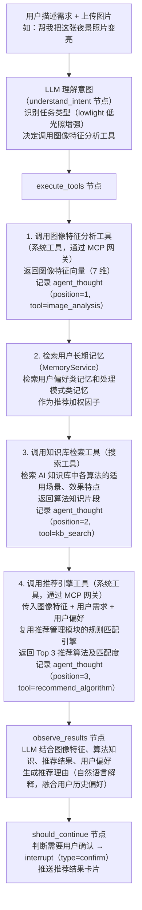

# AI 对话模块 - 后端实现设计（智能调度）

## 1. 文档概述

本文档描述 F-M06-004 智能算法推荐和 F-M06-005 批量处理摘要的后端实现，包括 LLM 结合图像特征和知识库推荐算法、批量任务调度与结果摘要生成。

### 1.1 相关文档

- **架构与公共**：[后端实现-架构与公共.md](./后端实现-架构与公共.md)
- **需求规格 §2.4/2.5**：[需求规格.md](./需求规格.md)
- **API 接口**：[API接口.md](./API接口.md)
- **推荐管理**：[推荐管理/后端实现](../../基础模块/推荐管理/后端实现.md)
- **AI 知识库**：[AI知识库/需求规格](../../基础模块/AI知识库/需求规格.md)

---

## 2. 智能算法推荐 (F-M06-004)

### 2.1 功能实现

用户用自然语言描述处理需求，LLM 结合图像特征分析和 AI 知识库的算法知识，智能推荐最匹配的算法。推荐过程作为多步推理的一个特殊场景，通过工具调用串联图像特征分析和知识库检索。

### 2.2 推荐流程



### 2.3 推荐结果数据结构

LLM 生成的推荐结果通过 interrupt 事件推送给前端，interrupt 事件结构属于 API 契约，详见 [API接口.md](./API接口.md)。推荐结果核心字段：

| 字段 | 说明 |
|------|------|
| recommendation.algorithm | 推荐算法（ID、名称、描述） |
| recommendation.reason | 推荐理由（自然语言，融合图像特征与用户偏好） |
| recommendation.params | 建议处理参数（如强度、饱和度） |
| recommendation.match_score | 匹配度（0-1） |
| alternatives | 备选算法列表（算法、理由、匹配度） |

### 2.4 推荐结果注册为 artifact

推荐结果同时注册为中间产物，便于后续引用：

```
推荐结果生成后
    ↓
ArtifactService 注册产物：
  - type = algorithm_recommend
  - ref_type = sys_recommendation
  - ref_id = 推荐管理模块创建的推荐记录 ID
  - summary = {推荐算法, 推荐理由, 匹配度, 备选方案}
    ↓
后续对话可引用此 artifact
  - 如用户问"刚才推荐的算法是什么"，LLM 从 artifact 摘要读取
```

### 2.5 用户确认与处理发起

```
用户看到推荐结果卡片
    ↓
用户确认使用推荐 → resume 接口传 confirm 参数
    ↓
Agent 恢复推理：
  - 使用推荐的算法和参数
  - 调用图像处理工具（系统工具）
  - 进入 async_wait 中断等待处理完成
    ↓
或用户修改参数 → resume 接口传修改后的参数
    ↓
Agent 使用修改后的参数发起处理
```

### 2.6 与推荐管理模块的协作

| 集成点 | 说明 |
|--------|------|
| 推荐引擎复用 | LLM 调用推荐管理模块的推荐接口（系统工具，通过 MCP 网关），复用规则匹配引擎 |
| 推荐记录创建 | 推荐管理模块创建 `sys_recommendation` 记录，AI 对话通过 artifact 引用 |
| 采纳率统计 | 用户确认推荐后，推荐管理模块更新 `adopted_algorithm_id`，统计采纳率 |
| 反馈回流 | 用户对推荐结果的反馈（采纳/拒绝/修改）同步到推荐管理模块 |

---

## 3. 批量处理摘要 (F-M06-005)

### 3.1 功能实现

用户上传多张图片后，通过自然语言描述统一处理需求，LLM 调度批量处理并生成结果摘要。批量处理作为多步推理的一个特殊场景，LLM 分解为多个子任务逐个或并行调度。

### 3.2 批量处理流程

```
用户上传多张图片 + 描述需求（如"把这 10 张雾图都去雾并评估效果"）
    ↓
LLM 理解意图（understand_intent 节点）：
  - 识别批量任务
  - 分解为子任务：每张图片 → 去雾处理 → 指标评估
  - 记录 agent_thought（position=1, thought=任务分解）
    ↓
execute_tools 节点：逐张或并行调度
  - 对每张图片：
    1. 调用去雾处理工具（系统工具）→ 返回 task_id（异步）
    2. 注册 artifact（image_result）
    3. 等待处理完成（async_wait 中断）
    4. 处理完成后调用评估工具（系统工具）
    5. 注册 artifact（metric_report）
    6. 推送批量进度事件（SSE content_block，type=tool_use）：
       - {index, total, imageId, status, artifactId}
       - 前端实时展示"第 3/10 张完成"
    ↓
  - 每个子任务记录 agent_thought：
    - position 递增
    - tool = process_image / evaluate_metrics
    - observation = 处理结果摘要
    ↓
所有子任务完成后
    ↓
observe_results 节点：
  - LLM 汇总所有子任务结果
  - 生成批量结果摘要
    ↓
should_continue 节点：
  - is_complete → 生成最终响应
```

### 3.3 批量调度策略

| 策略 | 说明 | 适用场景 |
|------|------|---------|
| 串行调度 | 逐张处理，前一张完成后再处理下一张 | 默认策略，避免资源竞争 |
| 并行调度 | 同时提交多张处理请求 | 图片数量多、系统负载低时 |
| 智能调度 | 根据系统负载自动选择串行/并行 | 推荐策略，由 LLM 根据工具返回的系统状态决定 |

**并行度控制**：

| 配置项 | 说明 | 默认值 |
|--------|------|--------|
| `ai.batch.max-parallel` | 批量处理最大并行数 | 5 |
| `ai.batch.strategy` | 批量处理策略（serial/parallel/auto） | auto |
| `ai.batch.max-images` | 单次批量最大图片数 | 20 |

### 3.4 批量结果摘要

所有子任务完成后，LLM 生成批量结果摘要，核心字段：

| 字段 | 说明 |
|------|------|
| summary.total / success / failed | 处理总数 / 成功数 / 失败数 |
| summary.avg_metrics | 平均指标（PSNR、SSIM 等） |
| summary.best | 效果最佳图片（ID + 指标） |
| summary.worst | 效果最差图片（ID + 指标） |
| summary.failures | 失败图片列表（ID + 原因） |
| results[] | 每张图片结果（artifact 引用 + 指标 + 算法 + 参数） |

### 3.5 批量产物管理

每个子任务的处理结果和评估结果都注册为独立的 artifact：

```
每张图片处理完成
    ↓
注册两个 artifact：
  1. type = image_result, ref_type = sys_pred_log, ref_id = 预测日志 ID
  2. type = metric_report, ref_type = sys_eval_log, ref_id = 评估日志 ID
    ↓
所有 artifact 关联到同一条 assistant 消息
    ↓
前端展示批量结果时：
  - 摘要卡片（成功率、平均指标、最佳/最差）
  - 结果列表（每张图片的 artifact 引用 + 指标 + 参数，缩略图 URL 运行时通过 FileService.getUrl() 拼接）
  - 点击单张可查看 artifact 详情
```

### 3.6 失败处理

| 失败场景 | 处理方式 |
|---------|---------|
| 单张处理失败 | 记录失败原因，继续处理其他图片，不中断整个批量任务 |
| 部分评估失败 | 处理成功的图片正常评估，失败的在摘要中标注 |
| 全部失败 | LLM 分析失败原因，建议用户检查图片格式或更换算法 |
| 系统过载 | LLM 根据工具返回的过载信号切换为串行模式或降低并行度 |

---

## 4. 模块间协作

### 4.1 与推荐管理模块

| 集成点 | 说明 |
|--------|------|
| 推荐引擎调用 | LLM 通过系统工具（MCP 网关）调用推荐管理模块的推荐接口 |
| 推荐记录创建 | 推荐管理模块创建 `sys_recommendation` 记录 |
| 采纳率统计 | 用户确认推荐后更新 `adopted_algorithm_id` |
| 推荐反馈回流 | 用户对推荐结果的反馈同步到推荐管理模块 |

### 4.2 与 AI 知识库

| 集成点 | 说明 |
|--------|------|
| 算法知识检索 | LLM 通过搜索工具调用知识库检索，获取各算法适用场景、效果特点 |
| RAG 注入 | 检索结果作为工具返回注入 LLM 上下文，辅助推荐决策 |

### 4.3 与去雾处理模块

| 集成点 | 说明 |
|--------|------|
| 图像处理调度 | LLM 通过系统工具（MCP 网关）调用去雾处理接口，底层由去雾处理模块执行 |
| 评估调度 | LLM 通过系统工具（MCP 网关）调用评估接口 |
| 异步任务回调 | 去雾处理完成后回调 ReasoningService 恢复推理 |
| 配额扣减 | 图像处理和评估的配额由底层 API 扣减，不在 AI 计费中重复记录 |

### 4.4 与文件管理模块

| 集成点 | 说明 |
|--------|------|
| 图片上传 | 用户上传图片通过文件管理模块，获取 fileId 后在消息中引用 |
| 结果获取 | 处理结果图片通过文件管理模块获取 URL |
| 批量上传 | 批量处理时多张图片通过文件管理模块批量上传 |
