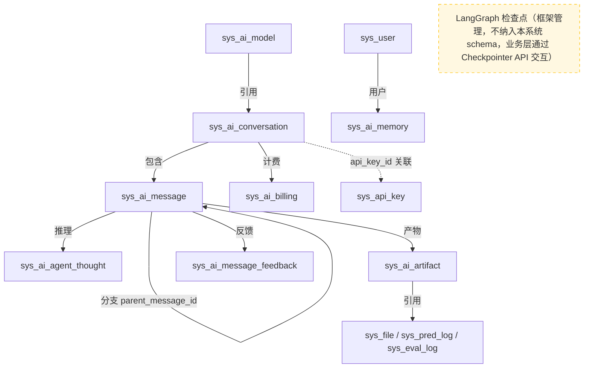
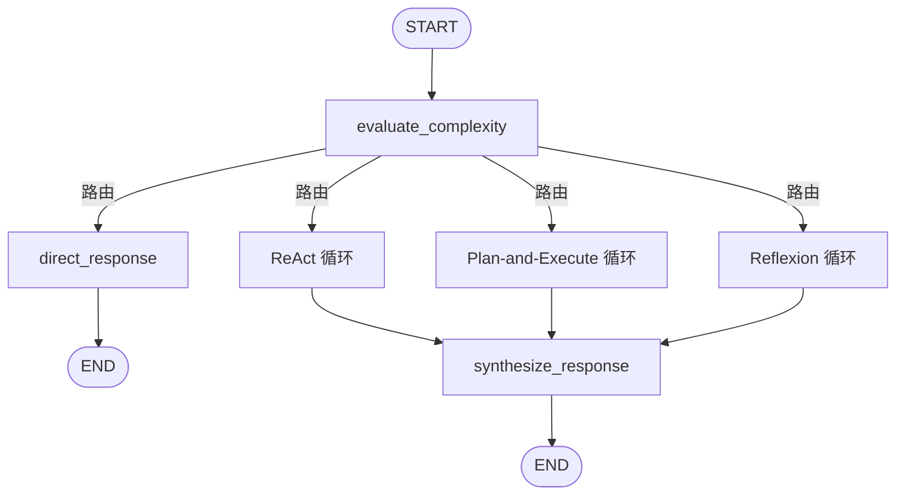
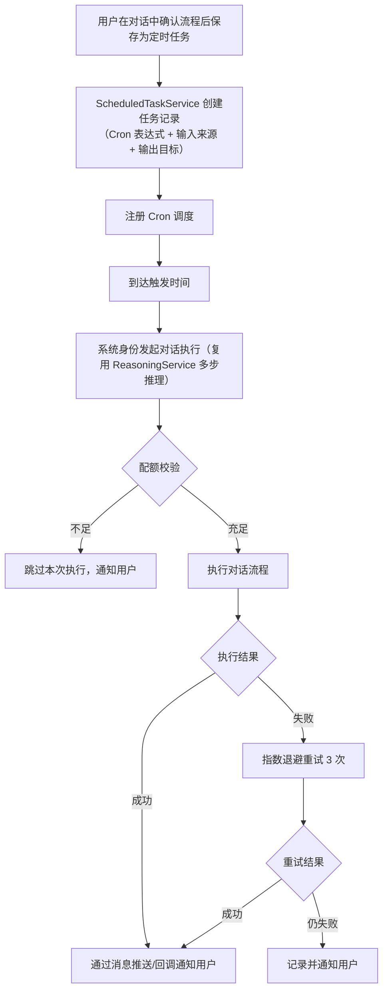

# AI 对话模块 - 后端实现设计（架构与公共）

## 1. 文档概述

### 1.1 文档目的

本文档描述 AI 对话模块的整体架构设计、数据模型总览、跨功能域公共组件、缓存策略与安全设计，并承载跨功能域的 F-M06-006 能力扩展（Skills 管理）与 F-M06-009 定时调度的服务层设计。各功能域的具体实现详见同目录下的分篇文档：

| 分篇文档 | 覆盖功能点 |
|---------|-----------|
| [后端实现-会话与消息](./后端实现-会话与消息.md) | F-M06-001 通用对话与会话管理 |
| [后端实现-多步推理](./后端实现-多步推理.md) | F-M06-002 多步推理 |
| [后端实现-上下文管理](./后端实现-上下文管理.md) | F-M06-003 上下文管理 |
| [后端实现-智能调度](./后端实现-智能调度.md) | F-M06-004 智能算法推荐 + F-M06-005 批量处理摘要 |
| [后端实现-模型与反馈](./后端实现-模型与反馈.md) | F-M06-007 模型选择 + F-M06-008 消息反馈 |

### 1.2 相关文档

- **需求规格**：[需求规格.md](./需求规格.md)
- **API 接口**：[API接口.md](./API接口.md)
- **数据库设计**：[03-数据库设计.md §4.7 AI 对话模块](../../../02-系统架构/03-数据库设计.md)
- **AI 计费管理**：[AI计费管理/需求规格](../../基础模块/AI计费管理/需求规格.md)
- **MCP 能力网关**：[MCP能力网关/需求规格](../MCP能力网关/需求规格.md)

---

## 2. 架构设计

### 2.1 模块分层架构

AI 对话模块以 LangGraph 为推理框架，通过能力扩展体系间接调用系统能力。模块本身不直接执行图像处理，而是通过工具调用委派给底层 API。能力扩展体系包括 MCP 工具（调用系统 API）、Skills（工作流指令包）、内置工具（代码执行/文件检索等）等多种能力来源：

```
Controller 层
├── ConversationController       # 会话 CRUD、置顶、归档
├── MessageController            # 消息发送（SSE）、列表、重新生成、编辑、停止
├── ReasoningController          # 推理中断恢复、取消
├── ContextController            # 上下文查询、产物、记忆管理
├── ModelController              # 模型配置管理
├── FeedbackController           # 消息反馈
└── QuotaController              # 配额查询

Service 层
├── ConversationService          # 会话生命周期管理
├── MessageService               # 消息发送、流式输出、分支管理
├── ReasoningService             # LangGraph Agent 推理编排
├── ContextManager               # 上下文与记忆分层管理（短期记忆/长期记忆/产物）
├── ArtifactService              # 中间产物引用化管理
├── MemoryService                # 长期记忆管理（多子类型/检索注入/整理巩固）
├── ModelService                 # 模型配置管理
├── FeedbackService              # 消息反馈管理
├── SkillManageService            # Skills 管理（创建/启停/列表查询）
├── ScheduledTaskService          # 定时调度管理（Cron 任务 CRUD 与触发执行）
└── BillingIntegration           # 计费集成（调用 AI 计费模块）

LangGraph Agent 层
├── AgentGraph                   # LangGraph 图定义（理解→执行→观察→反思循环）
├── McpToolNode                  # 工具执行节点（支持 MCP 工具/Skills/内置工具等多源工具）
├── CheckpointManager            # 检查点管理（LangGraph RedisSaver + MySQLCheckpointSaver）
└── InterruptHandler             # 中断处理（确认/配额/异步等待）

依赖模块
├── McpGatewayClient（MCP 能力网关）  # 系统工具调用转发（调用系统后端 API）
├── SkillManager（Skills 管理）       # Skills 加载/渐进式披露/执行
├── FileToolExecutor（文件操作）      # 读取/写入/删除文件
├── SearchToolExecutor（搜索工具）    # 网络搜索/知识库检索/本地文件检索
├── CodeExecutor（代码执行）          # 沙箱执行代码和命令（Python/Shell）
├── SubagentManager（子智能体）       # 子智能体调度/Agent 团队协作
├── BillingService（AI 计费管理）      # 积分计量与配额扣减
├── KnowledgeBaseService（AI 知识库）  # RAG 检索
├── VoiceService（语音交互）           # ASR/TTS
├── TaskService（任务管理）            # 异步任务回调
├── FileService（文件管理）            # 图片上传与获取
└── AuthService（认证管理）            # 用户身份解析
```

### 2.2 核心组件职责

| 组件 | 职责描述 | 关键能力 |
|------|---------|---------|
| ConversationService | 会话生命周期管理 | 会话 CRUD、置顶、归档、标题自动提取、活跃度统计 |
| MessageService | 消息发送与流式输出 | SSE 流式推送、分支对话（parent_message_id）、消息状态管理、重新生成 |
| ReasoningService | LangGraph Agent 推理编排 | 复杂度感知与范式调度（ReAct/Plan-and-Execute/Reflexion）、推理循环、工具调用、反思重试、中断/恢复、子智能体协作 |
| ContextManager | 上下文与记忆分层管理 | 短期记忆（对话历史/工作记忆/任务状态）组装、长期记忆检索注入、产物引用化 |
| ArtifactService | 中间产物引用化 | 产物注册、摘要元数据管理（不存 URL）、多态引用（sys_pred_log/sys_eval_log/sys_file）、失效标记 |
| MemoryService | 长期记忆管理 | 记忆 CRUD（情景/语义/程序三子类型）、ES 向量检索同步、按相关性+近因性+重要性加权检索注入、记忆整理巩固（摘要巩固/遗忘曲线/重要性评分/反思整合/合并去重） |
| ModelService | 模型配置管理 | 模型 CRUD、计费比例维护、能力校验 |
| FeedbackService | 消息反馈管理 | 反馈 upsert、唯一性校验、质量统计 |
| BillingIntegration | 计费集成 | Token 统计、积分换算、配额校验与扣减（委托 AI 计费模块） |

---

## 3. 数据模型总览

AI 对话模块由 8 张业务表 + LangGraph 官方 Saver 管理的 4 张检查点表构成，参考 OpenAI Assistants API（Thread/Run/RunStep）、Dify（Conversation/Message/MessageAgentThought）、LangGraph（checkpoint 持久化）等主流大模型平台的通用实现。表结构详见 `config/sql/schema/` 目录，顶层设计详见 [数据库设计 §4.7](../../../02-系统架构/03-数据库设计.md#47-ai-对话模块)。

### 3.1 表清单与职责

| 表 | 职责 | 所属功能域 | 逻辑删除 |
|----|------|-----------|---------|
| `sys_ai_model` | AI 模型配置（计费比例、能力标识） | 模型与反馈 | 是（类别②，model_id 不可复用） |
| `sys_ai_conversation` | 对话会话（模型配置、摘要、API Key 绑定） | 会话与消息 | 是（标准） |
| `sys_ai_message` | 对话消息（多角色、分支、流式状态） | 会话与消息 | 是（标准） |
| `sys_ai_agent_thought` | 推理过程（thought/tool/observation/步骤序号） | 多步推理 | 否（只追加） |
| `sys_ai_artifact` | 中间产物（引用化，摘要元数据不存 URL，is_invalid 失效标记） | 上下文管理 | 否（只追加） |
| `sys_ai_memory` | 长期记忆（用户偏好、处理模式） | 上下文管理 | 是（标准） |
| `sys_ai_message_feedback` | 消息反馈（点赞/点踩） | 模型与反馈 | 是（类别①，upsert 复活） |
| `sys_ai_billing` | 计费记录（Token 明细、积分扣减） | 计费集成 | 否（只追加，财务不可删） |

> LangGraph 的 checkpoint 持久化表（`langgraph_*`）由 `MySQLCheckpointSaver.setup()` 自动创建管理，不纳入本系统 schema，不在此列出。

### 3.2 核心关系



状态字段取值与枚举管理详见 [数据库设计 §5.4 状态字段编码规范](../../../02-系统架构/03-数据库设计.md#54-状态字段编码规范)。

---

## 4. 跨功能域公共组件

### 4.1 SSE 流式输出管理器（SseEmitterManager）

所有流式接口（消息发送、推理恢复）共用 SSE 管理器：

| 能力 | 说明 |
|------|------|
| 连接管理 | 维护会话与 SSE 连接的映射，同会话同一时间只允许一个活跃连接 |
| 事件推送 | 支持 message.start、content_block.start/delta/stop、thought、interrupt、ping、error、message.end 事件，每个事件携带递增 `id` |
| 心跳保活 | 每 15 秒推送心跳事件，防止代理超时断连 |
| token 缓存 | 每个事件同步写入 Redis token 缓存（`ai:stream:{streamSessionId}`，TTL 5 分钟），支撑断线重连 |
| 断线重连 | 客户端携带 `Last-Event-ID` 重连时，从 Redis 缓存重放断点之后的已发送事件，原流未完成则继续拉取新 token |
| 异常断连 | 客户端断连后保留 token 缓存 5 分钟等待重连；超时未重连则停止 LLM 推理，消息标记为"已取消" |
| 超时控制 | 120 秒无新 token 判定超时，主动关闭连接并标记失败 |

### 4.2 LangGraph Agent 图定义（AgentGraph）

推理引擎基于 LangGraph 构建，支持复杂度感知与三种推理范式调度：



- `evaluate_complexity`：复杂度评估（规则预判 + LLM 兜底），自动选择推理范式
- `direct_response`：L0 简单问答直接生成回复
- `ReAct 循环`：L1 动态任务，Thought → Action → Observation 循环
- `Plan-and-Execute 循环`：L2 多步任务，先规划再执行，支持并行和重规划
- `Reflexion 循环`：L3 高精度任务，执行 → 评估 → 反思 → 改进迭代
- `synthesize_response`：结果整合，生成最终回复

三种循环共享工具执行体系（ToolExecutorRegistry）、检查点持久化、记忆系统，差异在于规划策略和反思机制。详见 [后端实现-多步推理](./后端实现-多步推理.md)。

**复杂度评估策略（规则预判 + LLM 兜底）**：

避免每次请求都调 LLM 评估复杂度（简单"你好"也要一次 LLM 调用），采用两级评估：

| 层级 | 机制 | 适用场景 |
|------|------|---------|
| 规则预判 | 关键词/消息长度/是否含附件/是否含工具调用意图的规则匹配 | 大多数请求可由规则判定，无需 LLM |
| LLM 兜底 | 规则无法判定时调用 LLM 评估 | 复杂模糊的请求 |

规则预判示例：
- 消息 < 50 字符 且 无附件 且 无工具调用关键词 → L0（直接回复）
- 含"去雾/处理/评估"等动作关键词 → L1（ReAct）
- 含"批量/所有/这些图片"等批量关键词 → L2（Plan-and-Execute）
- 含"报告/分析/审查/优化"等高精度关键词 → L3（Reflexion）
- 规则无法判定 → 调 LLM 评估（兜底）

### 4.3 检查点管理器（CheckpointManager）

不自建 checkpoint 业务表，直接使用 LangGraph 官方 Saver 体系，双层存储：

| 层 | 存储 | Saver 实现 | 用途 | 读写频率 |
|----|------|-----------|------|---------|
| Redis | Redis | `RedisSaver`（官方） | 运行时高速读写、interrupt/resume | 每步推理自动读写 |
| MySQL | LangGraph 持久化表 | `MySQLCheckpointSaver`（自定义，继承 `BaseCheckpointSaver`） | 持久化、崩溃恢复 | 异步写入 |

- **运行时**：LangGraph 每步推理自动通过 `RedisSaver` 读写 checkpoint，Redis 开启 AOF 持久化保证数据安全
- **持久化**：`MySQLCheckpointSaver` 按 LangGraph 官方 `PostgresSaver` 的 4 表结构建表，适配 MySQL 语法（`JSONB`→`JSON`，`BYTEA`→`LONGBLOB`）。**持久化表由 `MySQLCheckpointSaver.setup()` 自动创建管理，不纳入本系统 `config/sql/schema/` 目录**，表结构以 LangGraph 官方为准
- **恢复策略**：会话重新进入时优先从 Redis 恢复，Redis 丢失时从 MySQL 恢复（`MySQLCheckpointSaver` 按 LangGraph 标准协议读取）
- **时间旅行**：通过 LangGraph Checkpointer API 可回溯历史检查点
- **业务层隔离**：业务代码不直接读写 LangGraph 持久化表，全部通过 LangGraph 的 Checkpointer API 交互

### 4.4 工具执行体系（ToolExecutorRegistry）

所有功能域通过统一的工具执行注册表调度各类工具。ToolExecutorRegistry 按 `tool_type` 路由到对应的执行器：

| 执行器 | tool_type | 职责 | 关键能力 |
|--------|-----------|------|---------|
| `McpGatewayClient` | `mcp` | 调用系统后端 API | 工具发现、身份透传、同步/异步调用、结果摘要 |
| `FileToolExecutor` | `file_read`/`file_write`/`file_delete` | 文件操作 | 读写删除用户文件、权限校验、路径白名单 |
| `SearchToolExecutor` | `web_search`/`kb_search`/`local_search` | 搜索工具 | 网络搜索、知识库 RAG 检索、本地文件检索 |
| `CodeExecutor` | `code_execute`/`shell_execute` | 代码执行 | 沙箱执行 Python/Shell、资源限制、超时控制 |
| `SkillManager` | `skill` | Skills 执行 | 渐进式加载指令、按步骤执行工作流 |
| `SubagentManager` | `subagent` | 子智能体 | 子智能体调度、Agent 团队协作、结果汇总 |

**通用能力（所有执行器共享）**：

| 能力 | 说明 |
|------|------|
| 工具发现 | 各执行器注册可用工具列表及参数 schema，Agent 启动时统一获取 |
| 身份透传 | 从会话上下文解析用户身份，透传给底层 API（MCP 工具用 API Key，其他工具用 Session） |
| 同步/异步 | 查询类工具同步返回，处理类工具返回 task_id 后 Agent 进入 interrupt 等待回调 |
| 结果摘要 | 大体积响应（图片等）只返回引用 + 摘要元数据，不返回二进制 |
| 错误处理 | 工具调用失败时 LLM 决定重试或降级 |
| 安全沙箱 | 代码执行和文件操作在受限沙箱中执行，资源配额和路径白名单控制 |

**子智能体协作**：

- 主 Agent 通过 `SubagentManager` 将子任务委派给专用子智能体
- 子智能体有独立的 System Prompt 和工具集（可见的工具列表可与主 Agent 不同）
- 子智能体执行完成后返回结果给主 Agent，主 Agent 汇总后生成最终回复
- 多个子智能体可并行执行（Agent 团队），主 Agent 负责任务分解和结果合并

**Skills 渐进式加载**：

- 启动时只加载 Skills 的名称和描述（几十 tokens），不加载完整指令
- LLM 判断需要某个 Skill 时，通过 `skill_load` 工具加载完整指令
- Skill 指令中可引用其他工具（如"调用 MCP 的评估工具获取指标"），形成 Skills + 工具的协同

### 4.5 生命周期钩子（AgentHooks）

参考 LangGraph 1.0 Middleware 体系，提供 Agent 推理全生命周期的钩子机制，支持在关键节点注入横切逻辑（安全、审计、计费、记忆等），避免硬编码到流程中：

```
before_agent → before_model → (LLM 调用) → after_model → (工具调用) → after_tool → after_agent
```

| 钩子 | 触发时机 | 典型用途 | 可否中断 |
|------|---------|---------|---------|
| `before_agent` | Agent 推理开始前 | 配额预校验、敏感词输入过滤、prompt 注入防护 | 是（拒绝推理） |
| `before_model` | 每次 LLM 调用前 | 动态注入 system prompt（记忆/任务状态）、上下文 token 预算校验、**MCP 工具命名空间预筛选**（按用户意图仅展开匹配分组，减少 93% 上下文占用） | 是（跳过本次调用） |
| `after_model` | 每次 LLM 调用后 | 内容安全审核、输出敏感词过滤、token 统计、日志记录 | 是（标记为失败） |
| `before_tool` | 每次工具调用前 | 工具参数校验、权限校验、危险操作拦截（如删除文件确认） | 是（阻止调用） |
| `after_tool` | 每次工具调用后 | 工具结果过滤、产物自动注册、工具调用审计日志 | 否 |
| `after_agent` | Agent 推理结束后 | 计费扣减、记忆提取触发、会话标题更新、消息状态更新 | 否 |

**设计要点**：

- 钩子通过配置注册，非硬编码到推理流程中，新增横切逻辑不改推理代码
- 钩子按优先级顺序执行，前置钩子可中断后续链路（如 `before_model` 校验失败则跳过 LLM 调用）
- 钩子可访问当前 state（messages、task、artifacts）和会话上下文
- 内置钩子：配额校验（`before_agent`）、敏感词过滤（`before_model`/`after_model`）、计费扣减（`after_agent`）、记忆提取（`after_agent`）
- 可扩展钩子：管理员可注册自定义钩子（如企业内部合规审计）

**MCP 工具命名空间预筛选（`before_model` 内置钩子）**：

参考 OpenAI Agents SDK `ToolSearchTool`（按需加载）和 Anthropic MCP 代码执行模式（文件树探索，减少 98.7% 上下文），`before_model` 钩子负责按用户意图预筛选工具的加载范围：

```
每次 LLM 调用前（before_model 钩子）：
    ↓
Step 1: 调用 MCP 网关 tools/list（无 expand）获取命名空间摘要
  - 返回 8 个分组摘要（name + description + tool_count），总共 ~160 tokens
  - 缓存摘要结果 5 分钟（MCP 网关定时同步间隔）
    ↓
Step 2: 意图匹配（规则预判，不调 LLM）
  - 从用户消息提取关键词
  - 匹配命名空间：{"去雾/处理/增强" → image_processing, "评估/PSNR/SSIM" → evaluation, "算法/推荐" → algorithm, ...}
  - 匹配 1-2 个命名空间
    ↓
Step 3: 展开匹配的命名空间
  - 调用 MCP 网关 tools/list（expand=[matched_namespaces]）
  - 获取匹配命名空间内 tool 的完整定义（name + description + inputSchema）
  - 典型：1-2 组 × 5-8 个工具 × 500 tokens = 2,500-8,000 tokens
    ↓
Step 4: 组装上下文（注入展开后的工具定义到 system prompt 的 tools 部分）
    ↓
如果意图无法匹配任何命名空间（模糊请求）：
  - 只注入命名空间摘要 + tool_search 工具的完整定义
  - LLM 需要时自行调用 tools/search 发现工具
```

**效果对比**：

| 场景 | 全量注入 | 预筛选后 | 节省 |
|------|---------|---------|------|
| "PSNR是什么" | 50,000 | 160（仅摘要） | 99.7% |
| "帮这张图去雾" | 50,000 | 160 + 4,000 = 4,160 | 91.7% |
| "去雾并评估" | 50,000 | 160 + 8,000 = 8,160 | 83.7% |

### 4.6 Skills 管理（SkillManageService）

SkillManager 在 §4.4 中承担 Skill 的执行职责（渐进式加载、按步骤执行工作流）。SkillManageService 负责管理侧（F-M06-006 中的 Skills 管理部分）：

| 管理操作 | 职责 | 业务规则 |
|---------|------|---------|
| Skills 列表查询 | 返回可用 Skills（名称、描述、适用场景、启用状态） | 所有用户可查询；加载到 Agent 时仅返回启用项 |
| Skill 创建 | 管理员创建自定义 Skill（Markdown 指令 + 可选脚本/模板） | 需 `ai:skill:manage` 权限；指令内容校验（长度限制、危险操作拦截） |
| Skill 启停 | 管理员启用/禁用 Skill | 禁用后不再加载到 Agent 工具列表；运行中的实例不受影响 |
| Skill 更新 | 管理员更新 Skill 指令内容 | 更新后新会话生效，进行中的会话沿用旧版本 |

**Skill 管理与执行的关系**：

| 关注点 | 归属 |
|--------|------|
| Skill 的存储、CRUD、启停 | SkillManageService（本节） |
| Skill 的渐进式加载、按步骤执行 | SkillManager（§4.4 工具执行体系） |

SkillManageService 维护 Skill 元数据，SkillManager 启动时从 SkillManageService 获取启用列表（仅名称+描述），LLM 判断需要时通过 `skill_load` 工具向 SkillManager 请求加载完整指令。

### 4.7 定时调度（ScheduledTaskService）

F-M06-009 定时调度支持用户将对话中调度的处理流程固化为定时任务，按 Cron 规则自动触发对话执行，满足企业用户自动化流程需求。

| 组件 | 职责 |
|------|------|
| ScheduledTaskService | 定时任务 CRUD、Cron 调度注册/取消、任务触发执行 |
| TaskExecutor | 到达触发时间时以系统身份发起对话执行，复用 ReasoningService 推理能力 |

**业务流程**：



**输入来源**：

| 类型 | 说明 |
|------|------|
| 固定输入 | 用户预设的图片集 |
| 动态输入 | 通过 MCP 拉取监控截图/指定目录新文件 |

**业务规则**：

| 规则 | 说明 |
|------|------|
| 权限限制 | 仅 VIP2 及以上用户可创建 |
| 配额占用 | 执行消耗的积分计入用户配额，不足时跳过本次执行并通知 |
| 失败重试 | 按指数退避重试 3 次，仍失败则记录并通知 |
| 任务上限 | 单用户定时任务数上限 20 个 |
| 执行历史 | 保留 30 天，支持回溯查看 |

---

## 5. 缓存策略

### 5.1 会话列表缓存

| 缓存对象 | 缓存 Key | TTL | 更新策略 |
|---------|---------|------|---------|
| 用户会话列表 | `ai:conv:list:{userId}` | 5 分钟 | 发消息/置顶/归档/删除时失效 |
| 会话详情 | `ai:conv:detail:{convId}` | 10 分钟 | 会话更新时失效 |

### 5.2 模型配置缓存

| 缓存对象 | 缓存 Key | TTL | 更新策略 |
|---------|---------|------|---------|
| 模型列表 | `ai:model:list` | 30 分钟 | 模型增删改时失效 |
| 单个模型 | `ai:model:{modelId}` | 30 分钟 | 模型更新时失效 |

### 5.3 推理检查点缓存

检查点由 LangGraph 官方 Saver 管理，不自建缓存：

| 缓存对象 | 存储位置 | 管理方 | 说明 |
|---------|---------|--------|------|
| 运行时 checkpoint | Redis | `RedisSaver`（官方） | 每步推理自动读写，Redis AOF 持久化保证安全 |
| 持久化 checkpoint | MySQL `langgraph_*` 4 表 | `MySQLCheckpointSaver`（自定义） | 异步写入，崩溃恢复时读取 |
| 中断点信息 | Redis | 业务层 | `ai:interrupt:{threadId}`，interrupt 时写入，resume 时清除，TTL 24 小时 |

### 5.4 SSE token 缓存

| 缓存对象 | 缓存 Key | TTL | 更新策略 |
|---------|---------|------|---------|
| 流式 token 缓存 | `ai:stream:{streamSessionId}` | 5 分钟 | 每个事件同步写入；流式结束后标记 done=true；重连窗口过期自动清理 |
| 消息幂等键 | `ai:msg:idempotent:{userId}:{key}` | 60 秒（pending）/ 5 分钟（已完成） | 发送时 SET pending；完成后更新为最终结果；失败时 DEL 允许重试 |
| 流式并发锁 | `ai:streaming:{conversationId}` | 120 秒 | 发送时 SET；流式结束后 DEL |

### 5.5 配额缓存

| 缓存对象 | 缓存 Key | TTL | 更新策略 |
|---------|---------|------|---------|
| 日配额已用 | `ai:quota:daily:{userId}:{date}` | 至当日 0 点 | 每次扣减时更新 |
| 月配额已用 | `ai:quota:monthly:{userId}:{month}` | 至当月 1 日 | 每次扣减时更新 |

### 5.6 消息列表

消息列表不缓存，每次实时查询数据库。消息为高频写入的流式数据，缓存一致性维护成本高于直接查询收益。

### 5.7 长期记忆缓存

| 缓存对象 | 缓存 Key | TTL | 更新策略 |
|---------|---------|------|---------|
| 用户长期记忆 | `ai:memory:{userId}` | 1 小时 | 记忆新增/删除/整理巩固时失效 |

---

## 6. 安全设计

### 6.1 配额穿透防护

| 防护措施 | 说明 |
|---------|------|
| 预扣减 + 实扣减 | 推理前按预估消耗**原子预扣减**配额（占额度，防止并发请求同时通过预校验导致超扣），推理后按实际 Token 消耗回补差额或补扣；预扣减失败直接拒绝，推理失败不扣减 |
| 原子扣减 | 使用 Redis 原子操作（DECR + 阈值判断）保证预扣减的原子性，避免"预校验通过但实际扣减时超额"的竞态 |
| 配额缓存 | 用户配额缓存在 Redis，BillingService 维护一致性 |
| 降级策略 | 缓存不可用时降级为直接查询 MySQL，保证核心功能可用 |

### 6.2 数据隔离

- 会话和消息仅能查询/操作当前用户自己的数据
- 长期记忆仅能管理当前用户自己的记忆
- 模型配置查询对所有用户开放，管理操作需 `ai:model:manage` 权限
- 所有接口校验用户身份与资源归属

### 6.3 API Key 安全

- 会话绑定的 API Key 只存储引用 ID（`api_key_id`），不存储明文
- MCP 工具调用时从 `sys_api_key` 查询 Key 哈希，运行时解密使用
- API Key 明文绝不进入日志、不进入 LLM 上下文

### 6.4 输入校验

| 校验项 | 规则 | 错误码 |
|--------|------|--------|
| 单条消息长度 | 不超过 4000 字符 | A0500 |
| 会话并发 | 同一会话同一时间只允许一个流式输出 | A0500 |
| 模型可用性 | 选择的模型必须为启用状态且支持所需能力 | A0601 |
| 反馈对象 | 仅 assistant 消息可反馈 | A0502 |
| 反馈时效 | 消息发送后 30 天内可反馈 | A0502 |

### 6.5 认证授权

| 认证方式 | 适用场景 | 说明 |
|---------|---------|------|
| Session 认证 | Web 端用户对话交互 | 通过登录态 Cookie/Token 校验用户身份 |
| API Key 认证 | MCP 工具调用、第三方集成 | 会话可绑定 API Key（`dhak_` 前缀），工具调用时透传身份 |

- 会话隔离：每个会话绑定创建者用户 ID，所有消息和推理操作校验会话归属
- 双轨认证结果统一解析为 userId，后续业务逻辑无感知认证方式差异

### 6.6 内容安全

| 防护方向 | 实现方式 |
|---------|---------|
| 输入过滤 | `before_model` 钩子对用户输入进行敏感词检测，命中敏感词时拒绝推理或脱敏处理后继续 |
| 输出过滤 | `after_model` 钩子对 LLM 生成的回复进行敏感词过滤，违规内容标记并拦截 |
| 违规内容拦截 | 涉及政治、色情、暴力等违规内容的输入/输出均拦截，记录审计日志 |

### 6.7 Prompt 注入防护

| 防护措施 | 说明 |
|---------|------|
| 系统提示词隔离 | 系统提示词（System Prompt）以受控方式注入，与用户输入严格分层，用户输入不拼接到系统提示词区域 |
| 用户输入净化 | 对用户输入进行边界标记和特殊字符转义，防止注入指令覆盖系统提示词 |
| 工具描述保护 | MCP 工具的 inputSchema 描述不可被用户输入篡改，工具调用参数经 SDK 自动校验 |

### 6.8 流式安全

| 防护项 | 说明 |
|--------|------|
| SSE 连接鉴权 | 流式输出连接建立时校验用户身份与会话归属，未认证请求拒绝建立连接 |
| 超时控制 | 120 秒无新 token 判定超时，主动关闭连接并标记消息失败，防止连接资源泄漏 |
| 断线重连安全 | 重连时校验 Last-Event-ID 与用户身份匹配，仅允许会话创建者重连自己的流式连接 |
| 并发控制 | 同一会话同一时间只允许一个活跃 SSE 连接，通过 Redis 分布式锁保证 |

### 6.9 API Key 吊销与审计

| 安全措施 | 说明 |
|---------|------|
| 吊销机制 | API Key 支持吊销（`revoked_at` 置非空），吊销后立即失效，正在进行的流式连接在下次操作时拒绝 |
| 使用审计 | API Key 的创建、吊销、工具调用记录审计日志，含调用时间、工具名称、调用结果 |
| 明文保护 | API Key 明文不存储（仅存哈希）、不进入日志、不进入 LLM 上下文 |

---

## 7. 配置项

| 配置项 | 说明 | 默认值 |
|--------|------|--------|
| `ai.message.max-length` | 单条消息最大字符数 | 4000 |
| `ai.message.stream-timeout` | 流式输出超时（秒） | 120 |
| `ai.message.heartbeat-interval` | SSE 心跳间隔（秒） | 15 |
| `ai.reasoning.max-steps-react` | ReAct 最大推理步数 | 20 |
| `ai.reasoning.max-steps-plan` | Plan-and-Execute 最大推理步数（含规划步） | 30 |
| `ai.reasoning.max-steps-reflexion` | Reflexion 单次迭代最大步数 | 15 |
| `ai.reasoning.max-iterations-reflexion` | Reflexion 最大迭代次数 | 3 |
| `ai.reasoning.reflexion-threshold` | Reflexion 质量达标阈值（0-1） | 0.8 |
| `ai.reasoning.max-parallel` | 并行子任务最大数 | 5 |
| `ai.reasoning.tool-timeout` | 单工具调用超时（秒） | 60 |
| `ai.reasoning.token-budget` | 单会话 Token 预算上限 | 500000 |
| `ai.reasoning.retry-max` | 工具调用失败最大重试次数 | 2 |
| `ai.conversation.archive-days` | 会话自动归档天数 | 30 |
| `ai.conversation.restore-days` | 已删除会话可恢复天数 | 30 |
| `ai.memory.max-count` | 单用户记忆条数上限 | 200 |
| `ai.memory.forget-threshold` | 遗忘曲线归档阈值（priority 低于此值归档） | 10 |
| `ai.memory.half-life-days` | 遗忘曲线半衰期（天） | 30 |
| `ai.memory.retrieval-top-n` | 记忆检索注入条数（Top N） | 5 |
| `ai.memory.reflection-schedule` | 反思整合定时任务（cron） | `0 0 3 * * ?`（每日 3 点） |
| `ai.memory.consolidation-schedule` | 摘要巩固定时任务（cron） | `0 0 4 * * ?`（每日 4 点） |
| `ai.feedback.expiry-days` | 反馈时效天数 | 30 |
| `ai.multimodal.default-limit` | 默认单会话多模态视觉读取上限 | 5 |
